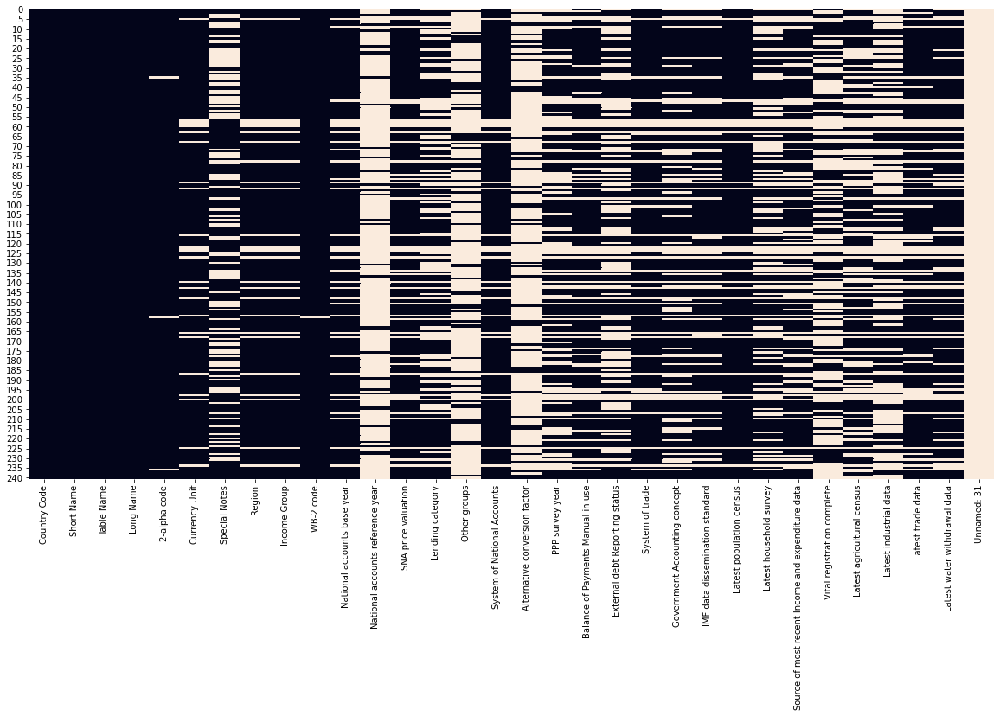
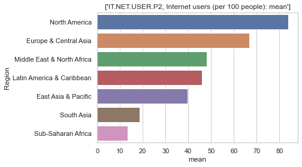
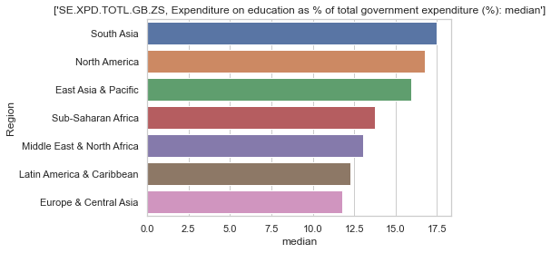

---
jupyter:
  kernelspec:
    display_name: Python 3
    language: python
    name: python3
  language_info:
    codemirror_mode:
      name: ipython
      version: 3
    file_extension: .py
    mimetype: text/x-python
    name: python
    nbconvert_exporter: python
    pygments_lexer: ipython3
    version: 3.8.8
  nbformat: 4
  nbformat_minor: 5
---

::: {.cell .code execution_count="1"}
``` {.python}
import pandas as pd
import numpy as np
import matplotlib.pyplot as plt
import seaborn as sns
%matplotlib inline
```
:::

::: {.cell .code execution_count="2"}
``` {.python}
import os
os.chdir('C:\\Users\\Nordine\\OneDrive\\Documents\\P2')
```
:::

::: {.cell .markdown}
***Description et qualité des données***
:::

::: {.cell .markdown}
**EdStatsCountry.csv**
:::

::: {.cell .code execution_count="3"}
``` {.python}
edStats_df = pd.read_csv('EdStatsCountry.csv')
edStats_df.shape
```

::: {.output .execute_result execution_count="3"}
    (241, 32)
:::
:::

::: {.cell .code execution_count="4"}
``` {.python}
# Pour mieux visualiser les données, affichons jusque 100 colonnes et 200 lignes
pd.set_option('display.max_columns', 100)
pd.set_option('display.max_rows', 300)
```
:::

::: {.cell .code execution_count="5"}
``` {.python}
edStats_df.head(5)
```

::: {.output .execute_result execution_count="5"}
```{=html}
<div>
<style scoped>
    .dataframe tbody tr th:only-of-type {
        vertical-align: middle;
    }

    .dataframe tbody tr th {
        vertical-align: top;
    }

    .dataframe thead th {
        text-align: right;
    }
</style>
<table border="1" class="dataframe">
  <thead>
    <tr style="text-align: right;">
      <th></th>
      <th>Country Code</th>
      <th>Short Name</th>
      <th>Table Name</th>
      <th>Long Name</th>
      <th>2-alpha code</th>
      <th>Currency Unit</th>
      <th>Special Notes</th>
      <th>Region</th>
      <th>Income Group</th>
      <th>WB-2 code</th>
      <th>National accounts base year</th>
      <th>National accounts reference year</th>
      <th>SNA price valuation</th>
      <th>Lending category</th>
      <th>Other groups</th>
      <th>System of National Accounts</th>
      <th>Alternative conversion factor</th>
      <th>PPP survey year</th>
      <th>Balance of Payments Manual in use</th>
      <th>External debt Reporting status</th>
      <th>System of trade</th>
      <th>Government Accounting concept</th>
      <th>IMF data dissemination standard</th>
      <th>Latest population census</th>
      <th>Latest household survey</th>
      <th>Source of most recent Income and expenditure data</th>
      <th>Vital registration complete</th>
      <th>Latest agricultural census</th>
      <th>Latest industrial data</th>
      <th>Latest trade data</th>
      <th>Latest water withdrawal data</th>
      <th>Unnamed: 31</th>
    </tr>
  </thead>
  <tbody>
    <tr>
      <th>0</th>
      <td>ABW</td>
      <td>Aruba</td>
      <td>Aruba</td>
      <td>Aruba</td>
      <td>AW</td>
      <td>Aruban florin</td>
      <td>SNA data for 2000-2011 are updated from offici...</td>
      <td>Latin America &amp; Caribbean</td>
      <td>High income: nonOECD</td>
      <td>AW</td>
      <td>2000</td>
      <td>NaN</td>
      <td>Value added at basic prices (VAB)</td>
      <td>NaN</td>
      <td>NaN</td>
      <td>Country uses the 1993 System of National Accou...</td>
      <td>NaN</td>
      <td>NaN</td>
      <td>IMF Balance of Payments Manual, 6th edition.</td>
      <td>NaN</td>
      <td>Special trade system</td>
      <td>NaN</td>
      <td>NaN</td>
      <td>2010</td>
      <td>NaN</td>
      <td>NaN</td>
      <td>Yes</td>
      <td>NaN</td>
      <td>NaN</td>
      <td>2012.0</td>
      <td>NaN</td>
      <td>NaN</td>
    </tr>
    <tr>
      <th>1</th>
      <td>AFG</td>
      <td>Afghanistan</td>
      <td>Afghanistan</td>
      <td>Islamic State of Afghanistan</td>
      <td>AF</td>
      <td>Afghan afghani</td>
      <td>Fiscal year end: March 20; reporting period fo...</td>
      <td>South Asia</td>
      <td>Low income</td>
      <td>AF</td>
      <td>2002/03</td>
      <td>NaN</td>
      <td>Value added at basic prices (VAB)</td>
      <td>IDA</td>
      <td>HIPC</td>
      <td>Country uses the 1993 System of National Accou...</td>
      <td>NaN</td>
      <td>NaN</td>
      <td>NaN</td>
      <td>Actual</td>
      <td>General trade system</td>
      <td>Consolidated central government</td>
      <td>General Data Dissemination System (GDDS)</td>
      <td>1979</td>
      <td>Multiple Indicator Cluster Survey (MICS), 2010/11</td>
      <td>Integrated household survey (IHS), 2008</td>
      <td>NaN</td>
      <td>2013/14</td>
      <td>NaN</td>
      <td>2012.0</td>
      <td>2000</td>
      <td>NaN</td>
    </tr>
    <tr>
      <th>2</th>
      <td>AGO</td>
      <td>Angola</td>
      <td>Angola</td>
      <td>People's Republic of Angola</td>
      <td>AO</td>
      <td>Angolan kwanza</td>
      <td>April 2013 database update: Based on IMF data,...</td>
      <td>Sub-Saharan Africa</td>
      <td>Upper middle income</td>
      <td>AO</td>
      <td>2002</td>
      <td>NaN</td>
      <td>Value added at producer prices (VAP)</td>
      <td>IBRD</td>
      <td>NaN</td>
      <td>Country uses the 1993 System of National Accou...</td>
      <td>1991–96</td>
      <td>2005</td>
      <td>IMF Balance of Payments Manual, 6th edition.</td>
      <td>Actual</td>
      <td>Special trade system</td>
      <td>Budgetary central government</td>
      <td>General Data Dissemination System (GDDS)</td>
      <td>1970</td>
      <td>Malaria Indicator Survey (MIS), 2011</td>
      <td>Integrated household survey (IHS), 2008</td>
      <td>NaN</td>
      <td>2015</td>
      <td>NaN</td>
      <td>NaN</td>
      <td>2005</td>
      <td>NaN</td>
    </tr>
    <tr>
      <th>3</th>
      <td>ALB</td>
      <td>Albania</td>
      <td>Albania</td>
      <td>Republic of Albania</td>
      <td>AL</td>
      <td>Albanian lek</td>
      <td>NaN</td>
      <td>Europe &amp; Central Asia</td>
      <td>Upper middle income</td>
      <td>AL</td>
      <td>Original chained constant price data are resca...</td>
      <td>1996.0</td>
      <td>Value added at basic prices (VAB)</td>
      <td>IBRD</td>
      <td>NaN</td>
      <td>Country uses the 1993 System of National Accou...</td>
      <td>NaN</td>
      <td>Rolling</td>
      <td>IMF Balance of Payments Manual, 6th edition.</td>
      <td>Actual</td>
      <td>General trade system</td>
      <td>Budgetary central government</td>
      <td>General Data Dissemination System (GDDS)</td>
      <td>2011</td>
      <td>Demographic and Health Survey (DHS), 2008/09</td>
      <td>Living Standards Measurement Study Survey (LSM...</td>
      <td>Yes</td>
      <td>2012</td>
      <td>2010.0</td>
      <td>2012.0</td>
      <td>2006</td>
      <td>NaN</td>
    </tr>
    <tr>
      <th>4</th>
      <td>AND</td>
      <td>Andorra</td>
      <td>Andorra</td>
      <td>Principality of Andorra</td>
      <td>AD</td>
      <td>Euro</td>
      <td>NaN</td>
      <td>Europe &amp; Central Asia</td>
      <td>High income: nonOECD</td>
      <td>AD</td>
      <td>1990</td>
      <td>NaN</td>
      <td>NaN</td>
      <td>NaN</td>
      <td>NaN</td>
      <td>Country uses the 1968 System of National Accou...</td>
      <td>NaN</td>
      <td>NaN</td>
      <td>NaN</td>
      <td>NaN</td>
      <td>Special trade system</td>
      <td>NaN</td>
      <td>NaN</td>
      <td>2011. Population figures compiled from adminis...</td>
      <td>NaN</td>
      <td>NaN</td>
      <td>Yes</td>
      <td>NaN</td>
      <td>NaN</td>
      <td>2006.0</td>
      <td>NaN</td>
      <td>NaN</td>
    </tr>
  </tbody>
</table>
</div>
```
:::
:::

::: {.cell .markdown}
Ce fichier des informations sur chaque pays. Quels sont les états
présents dans l\'étude
:::

::: {.cell .code execution_count="6"}
``` {.python}
edStats_df['Short Name'].unique()
```

::: {.output .execute_result execution_count="6"}
    array(['Aruba', 'Afghanistan', 'Angola', 'Albania', 'Andorra',
           'Arab World', 'United Arab Emirates', 'Argentina', 'Armenia',
           'American Samoa', 'Antigua and Barbuda', 'Australia', 'Austria',
           'Azerbaijan', 'Burundi', 'Belgium', 'Benin', 'Burkina Faso',
           'Bangladesh', 'Bulgaria', 'Bahrain', 'The Bahamas',
           'Bosnia and Herzegovina', 'Belarus', 'Belize', 'Bermuda',
           'Bolivia', 'Brazil', 'Barbados', 'Brunei', 'Bhutan', 'Botswana',
           'Central African Republic', 'Canada', 'Switzerland',
           'Channel Islands', 'Chile', 'China', "Côte d'Ivoire", 'Cameroon',
           'Dem. Rep. Congo', 'Congo', 'Colombia', 'Comoros', 'Cabo Verde',
           'Costa Rica', 'Cuba', 'Curaçao', 'Cayman Islands', 'Cyprus',
           'Czech Republic', 'Germany', 'Djibouti', 'Dominica', 'Denmark',
           'Dominican Republic', 'Algeria',
           'East Asia & Pacific (developing only)',
           'East Asia & Pacific (all income levels)',
           'Europe & Central Asia (developing only)',
           'Europe & Central Asia (all income levels)', 'Ecuador', 'Egypt',
           'Euro area', 'Eritrea', 'Spain', 'Estonia', 'Ethiopia',
           'European Union', 'Finland', 'Fiji', 'France', 'Faeroe Islands',
           'Micronesia', 'Gabon', 'United Kingdom', 'Georgia', 'Ghana',
           'Gibraltar', 'Guinea', 'The Gambia', 'Guinea-Bissau',
           'Equatorial Guinea', 'Greece', 'Grenada', 'Greenland', 'Guatemala',
           'Guam', 'Guyana', 'High income', 'Hong Kong SAR, China',
           'Honduras', 'Heavily indebted poor countries (HIPC)', 'Croatia',
           'Haiti', 'Hungary', 'Indonesia', 'Isle of Man', 'India', 'Ireland',
           'Iran', 'Iraq', 'Iceland', 'Israel', 'Italy', 'Jamaica', 'Jordan',
           'Japan', 'Kazakhstan', 'Kenya', 'Kyrgyz Republic', 'Cambodia',
           'Kiribati', 'St. Kitts and Nevis', 'Korea', 'Kuwait',
           'Latin America & Caribbean (developing only)', 'Lao PDR',
           'Lebanon', 'Liberia', 'Libya', 'St. Lucia',
           'Latin America & Caribbean (all income levels)',
           'Least developed countries: UN classification', 'Low income',
           'Liechtenstein', 'Sri Lanka', 'Lower middle income',
           'Low & middle income', 'Lesotho', 'Lithuania', 'Luxembourg',
           'Latvia', 'Macao SAR, China', 'St. Martin (French part)',
           'Morocco', 'Monaco', 'Moldova', 'Madagascar', 'Maldives',
           'Middle East & North Africa (all income levels)', 'Mexico',
           'Marshall Islands', 'Middle income', 'Macedonia', 'Mali', 'Malta',
           'Myanmar', 'Middle East & North Africa (developing only)',
           'Montenegro', 'Mongolia', 'Northern Mariana Islands', 'Mozambique',
           'Mauritania', 'Mauritius', 'Malawi', 'Malaysia', 'North America',
           'Namibia', 'New Caledonia', 'Niger', 'Nigeria', 'Nicaragua',
           'Netherlands', 'Norway', 'Nepal', 'Nauru', 'New Zealand',
           'OECD members', 'Oman', 'Pakistan', 'Panama', 'Peru',
           'Philippines', 'Palau', 'Papua New Guinea', 'Poland',
           'Puerto Rico', "Dem. People's Rep. Korea", 'Portugal', 'Paraguay',
           'West Bank and Gaza', 'French Polynesia', 'Qatar', 'Romania',
           'Russia', 'Rwanda', 'South Asia', 'Saudi Arabia', 'Sudan',
           'Senegal', 'Singapore', 'Solomon Islands', 'Sierra Leone',
           'El Salvador', 'San Marino', 'Somalia', 'Serbia',
           'Sub-Saharan Africa (developing only)', 'South Sudan',
           'Sub-Saharan Africa (all income levels)', 'São Tomé and Principe',
           'Suriname', 'Slovak Republic', 'Slovenia', 'Sweden', 'Swaziland',
           'Sint Maarten (Dutch part)', 'Seychelles', 'Syrian Arab Republic',
           'Turks and Caicos Islands', 'Chad', 'Togo', 'Thailand',
           'Tajikistan', 'Turkmenistan', 'Timor-Leste', 'Tonga',
           'Trinidad and Tobago', 'Tunisia', 'Turkey', 'Tuvalu', 'Tanzania',
           'Uganda', 'Ukraine', 'Upper middle income', 'Uruguay',
           'United States', 'Uzbekistan', 'St. Vincent and the Grenadines',
           'Venezuela', 'Virgin Islands', 'Vietnam', 'Vanuatu', 'World',
           'Samoa', 'Kosovo', 'Yemen', 'South Africa', 'Zambia', 'Zimbabwe'],
          dtype=object)
:::
:::

::: {.cell .code execution_count="7"}
``` {.python}
print(edStats_df['Short Name'].unique().shape)
print(edStats_df['Income Group'].unique().shape)
```

::: {.output .stream .stdout}
    (241,)
    (6,)
:::
:::

::: {.cell .code execution_count="8"}
``` {.python}
# On voit qu'il n'y a pas que des Etats mais aussi des régions, voire des niveaux de revenus. (ex: South Asia, "High income")
print(edStats_df['Income Group'].unique())
print(edStats_df['Region'].unique())
```

::: {.output .stream .stdout}
    ['High income: nonOECD' 'Low income' 'Upper middle income' nan
     'Lower middle income' 'High income: OECD']
    ['Latin America & Caribbean' 'South Asia' 'Sub-Saharan Africa'
     'Europe & Central Asia' nan 'Middle East & North Africa'
     'East Asia & Pacific' 'North America']
:::
:::

::: {.cell .code execution_count="9"}
``` {.python}
# Téléchargeons les codes pays iso
country_iso = pd.read_csv('sql-pays.csv', header=None)
```
:::

::: {.cell .code execution_count="10"}
``` {.python}
liste_code = country_iso.iloc[:,3]

liste_code.shape
```

::: {.output .execute_result execution_count="10"}
    (241,)
:::
:::

::: {.cell .code execution_count="11"}
``` {.python}
# On voit qu'il y a 240 codes pays. Combien de pays sont utilisés dans notre étude

print(edStats_df[edStats_df['Country Code'].isin(liste_code)]['Short Name'].unique())

print(edStats_df[edStats_df['Country Code'].isin(liste_code)]['Short Name'].unique().shape)
```

::: {.output .stream .stdout}
    ['Aruba' 'Afghanistan' 'Angola' 'Albania' 'Andorra' 'United Arab Emirates'
     'Argentina' 'Armenia' 'American Samoa' 'Antigua and Barbuda' 'Australia'
     'Austria' 'Azerbaijan' 'Burundi' 'Belgium' 'Benin' 'Burkina Faso'
     'Bangladesh' 'Bulgaria' 'Bahrain' 'The Bahamas' 'Bosnia and Herzegovina'
     'Belarus' 'Belize' 'Bermuda' 'Bolivia' 'Brazil' 'Barbados' 'Brunei'
     'Bhutan' 'Botswana' 'Central African Republic' 'Canada' 'Switzerland'
     'Chile' 'China' "Côte d'Ivoire" 'Cameroon' 'Dem. Rep. Congo' 'Congo'
     'Colombia' 'Comoros' 'Cabo Verde' 'Costa Rica' 'Cuba' 'Cayman Islands'
     'Cyprus' 'Czech Republic' 'Germany' 'Djibouti' 'Dominica' 'Denmark'
     'Dominican Republic' 'Algeria' 'Ecuador' 'Egypt' 'Eritrea' 'Spain'
     'Estonia' 'Ethiopia' 'Finland' 'Fiji' 'France' 'Faeroe Islands'
     'Micronesia' 'Gabon' 'United Kingdom' 'Georgia' 'Ghana' 'Gibraltar'
     'Guinea' 'The Gambia' 'Guinea-Bissau' 'Equatorial Guinea' 'Greece'
     'Grenada' 'Greenland' 'Guatemala' 'Guam' 'Guyana' 'Hong Kong SAR, China'
     'Honduras' 'Croatia' 'Haiti' 'Hungary' 'Indonesia' 'Isle of Man' 'India'
     'Ireland' 'Iran' 'Iraq' 'Iceland' 'Israel' 'Italy' 'Jamaica' 'Jordan'
     'Japan' 'Kazakhstan' 'Kenya' 'Kyrgyz Republic' 'Cambodia' 'Kiribati'
     'St. Kitts and Nevis' 'Korea' 'Kuwait' 'Lao PDR' 'Lebanon' 'Liberia'
     'Libya' 'St. Lucia' 'Liechtenstein' 'Sri Lanka' 'Lesotho' 'Lithuania'
     'Luxembourg' 'Latvia' 'Macao SAR, China' 'Morocco' 'Monaco' 'Moldova'
     'Madagascar' 'Maldives' 'Mexico' 'Marshall Islands' 'Macedonia' 'Mali'
     'Malta' 'Myanmar' 'Mongolia' 'Northern Mariana Islands' 'Mozambique'
     'Mauritania' 'Mauritius' 'Malawi' 'Malaysia' 'Namibia' 'New Caledonia'
     'Niger' 'Nigeria' 'Nicaragua' 'Netherlands' 'Norway' 'Nepal' 'Nauru'
     'New Zealand' 'Oman' 'Pakistan' 'Panama' 'Peru' 'Philippines' 'Palau'
     'Papua New Guinea' 'Poland' 'Puerto Rico' "Dem. People's Rep. Korea"
     'Portugal' 'Paraguay' 'West Bank and Gaza' 'French Polynesia' 'Qatar'
     'Romania' 'Russia' 'Rwanda' 'Saudi Arabia' 'Sudan' 'Senegal' 'Singapore'
     'Solomon Islands' 'Sierra Leone' 'El Salvador' 'San Marino' 'Somalia'
     'São Tomé and Principe' 'Suriname' 'Slovak Republic' 'Slovenia' 'Sweden'
     'Swaziland' 'Seychelles' 'Syrian Arab Republic'
     'Turks and Caicos Islands' 'Chad' 'Togo' 'Thailand' 'Tajikistan'
     'Turkmenistan' 'Timor-Leste' 'Tonga' 'Trinidad and Tobago' 'Tunisia'
     'Turkey' 'Tuvalu' 'Tanzania' 'Uganda' 'Ukraine' 'Uruguay' 'United States'
     'Uzbekistan' 'St. Vincent and the Grenadines' 'Venezuela'
     'Virgin Islands' 'Vietnam' 'Vanuatu' 'Samoa' 'Yemen' 'South Africa'
     'Zambia' 'Zimbabwe']
    (208,)
:::
:::

::: {.cell .code execution_count="12"}
``` {.python}
# Il y a 208 pays utilisés dans l'étude
# Quels sont les autres zones ne correspondant pas à un état utilisés dans notre étude
liste_zones = edStats_df[~edStats_df['Country Code'].isin(liste_code)]['Short Name'].unique()
print(liste_zones)
print(liste_zones.shape)
```

::: {.output .stream .stdout}
    ['Arab World' 'Channel Islands' 'Curaçao'
     'East Asia & Pacific (developing only)'
     'East Asia & Pacific (all income levels)'
     'Europe & Central Asia (developing only)'
     'Europe & Central Asia (all income levels)' 'Euro area' 'European Union'
     'High income' 'Heavily indebted poor countries (HIPC)'
     'Latin America & Caribbean (developing only)'
     'Latin America & Caribbean (all income levels)'
     'Least developed countries: UN classification' 'Low income'
     'Lower middle income' 'Low & middle income' 'St. Martin (French part)'
     'Middle East & North Africa (all income levels)' 'Middle income'
     'Middle East & North Africa (developing only)' 'Montenegro'
     'North America' 'OECD members' 'South Asia' 'Serbia'
     'Sub-Saharan Africa (developing only)' 'South Sudan'
     'Sub-Saharan Africa (all income levels)' 'Sint Maarten (Dutch part)'
     'Upper middle income' 'World' 'Kosovo']
    (33,)
:::
:::

::: {.cell .code execution_count="13"}
``` {.python}
# Il y a donc 33 zones ne correspondant pas à des états
# Le Montenegro est indépendant depuis peu ainsi que Kosovo (nouveaux pays)
# Les restes sont des zones géographiques ou déterminés par le revenu moyen
# Quels pays ne fait pas partie de l'étude?

np.array(country_iso[~country_iso.loc[:,3].isin(edStats_df['Country Code'])].loc[:,4])
```

::: {.output .execute_result execution_count="13"}
    array(['Antarctique', 'Île Bouvet',
           "Territoire Britannique de l'Océan Indien",
           'Îles Vierges Britanniques', 'Taïwan', 'Île Christmas',
           'Îles Cocos (Keeling)', 'Mayotte', 'Îles Cook',
           'Îles (malvinas) Falkland',
           'Géorgie du Sud et les Îles Sandwich du Sud', 'Îles Åland',
           'Guyane Française', 'Terres Australes Françaises', 'Guadeloupe',
           'Îles Heard et Mcdonald',
           'Saint-Siège (état de la Cité du Vatican)', 'Martinique',
           'Montserrat', 'Antilles Néerlandaises', 'Niué', 'Île Norfolk',
           'Îles Mineures Éloignées des États-Unis', 'Pitcairn', 'Réunion',
           'Sainte-Hélène', 'Anguilla', 'Saint-Pierre-et-Miquelon',
           'Sahara Occidental', 'Svalbard etÎle Jan Mayen', 'Tokelau',
           'Wallis et Futuna', 'Serbie-et-Monténégro'], dtype=object)
:::
:::

::: {.cell .code execution_count="14"}
``` {.python}
# Il s'agit essentiellement d'iles 
# On constate qu'il y a des données redondantes comme Morocco inclus dans la zone 'Middle East & North Africa (all income levels)'

edStats_df[edStats_df['Short Name'] == 'Morocco']['Region']
```

::: {.output .execute_result execution_count="14"}
    135    Middle East & North Africa
    Name: Region, dtype: object
:::
:::

::: {.cell .code execution_count="15"}
``` {.python}
# Quels est le nombre de pays ou zones par Region
plt.figure(figsize=(10,10))
plt.barh(y = edStats_df.groupby('Region')[['Short Name']].count().reset_index().sort_values(by = 'Short Name')['Region'], width =edStats_df.groupby('Region')[['Short Name']].count().reset_index()['Short Name'].sort_values())
plt.title('Nombre de pays par Region')
plt.show()
```

::: {.output .display_data}

:::
:::

::: {.cell .markdown}
Sans surprise, les régions contenant le plus de pays petit par la taille
ont le plus de pays présents dans l\'étude.
:::

::: {.cell .code execution_count="16"}
``` {.python}
# Nombre de pays par rang de revenus
plt.figure(figsize=(20,10))
plt.barh(y = edStats_df.groupby('Income Group')[['Short Name']].count().reset_index().sort_values(by = 'Short Name')['Income Group'], width =edStats_df.groupby('Income Group')[['Short Name']].count().reset_index()['Short Name'].sort_values())
plt.title('Nombre de pays par Revenu')
plt.show()
```

::: {.output .display_data}

:::
:::

::: {.cell .markdown}
Voyons s\'il y a des NA:
:::

::: {.cell .code execution_count="17"}
``` {.python}
plt.figure(figsize=(20,10))
sns.heatmap(edStats_df.isna(), cbar=False)
```

::: {.output .execute_result execution_count="17"}
    <AxesSubplot:>
:::

::: {.output .display_data}

:::
:::

::: {.cell .code execution_count="18"}
``` {.python}
pourcentage = {}
for col in edStats_df.columns:
    pourcentage[col] = edStats_df[col].isna().sum()/edStats_df.shape[0]
for k, v in sorted(pourcentage.items(), key=lambda x: x[1]):
    print(f'{k:-<50} {v}')
```

::: {.output .stream .stdout}
    Country Code-------------------------------------- 0.0
    Short Name---------------------------------------- 0.0
    Table Name---------------------------------------- 0.0
    Long Name----------------------------------------- 0.0
    WB-2 code----------------------------------------- 0.004149377593360996
    2-alpha code-------------------------------------- 0.012448132780082987
    Currency Unit------------------------------------- 0.1078838174273859
    System of National Accounts----------------------- 0.1078838174273859
    Region-------------------------------------------- 0.11203319502074689
    Income Group-------------------------------------- 0.11203319502074689
    Latest population census-------------------------- 0.11618257261410789
    National accounts base year----------------------- 0.14937759336099585
    System of trade----------------------------------- 0.17012448132780084
    SNA price valuation------------------------------- 0.1825726141078838
    Latest trade data--------------------------------- 0.23236514522821577
    Balance of Payments Manual in use----------------- 0.24896265560165975
    IMF data dissemination standard------------------- 0.24896265560165975
    Latest water withdrawal data---------------------- 0.2572614107883817
    Government Accounting concept--------------------- 0.33195020746887965
    Source of most recent Income and expenditure data- 0.3360995850622407
    Special Notes------------------------------------- 0.3983402489626556
    PPP survey year----------------------------------- 0.3983402489626556
    Lending category---------------------------------- 0.4024896265560166
    Latest agricultural census------------------------ 0.4107883817427386
    Latest household survey--------------------------- 0.4149377593360996
    External debt Reporting status-------------------- 0.4854771784232365
    Vital registration complete----------------------- 0.5394190871369294
    Latest industrial data---------------------------- 0.5560165975103735
    Other groups-------------------------------------- 0.7593360995850622
    Alternative conversion factor--------------------- 0.8049792531120332
    National accounts reference year------------------ 0.8672199170124482
    Unnamed: 31--------------------------------------- 1.0
:::
:::

::: {.cell .markdown}
On voit qu\'il y a des colonnes avec une majorité de NA: Vital
registration, Latest industrial data, Other groups, Alternative
conversion factor et National accounts reference year. La colonne
Unnamed: 31 ne contient que des NA
:::

::: {.cell .code execution_count="19"}
``` {.python}
edStats_df = edStats_df.drop(columns=['Unnamed: 31'])
```
:::

::: {.cell .markdown}
Vérifions si le fichier contient des lignes dupliqués:
:::

::: {.cell .code execution_count="20"}
``` {.python}
edStats_df.duplicated().sum()
```

::: {.output .execute_result execution_count="20"}
    0
:::
:::

::: {.cell .markdown}
**EdStatsCountry-Series.csv**
:::

::: {.cell .code execution_count="21"}
``` {.python}
edStatsCountrySeries = pd.read_csv('EdStatsCountry-Series.csv')
print(edStatsCountrySeries.shape)
edStatsCountrySeries.head(5)
```

::: {.output .stream .stdout}
    (613, 4)
:::

::: {.output .execute_result execution_count="21"}
```{=html}
<div>
<style scoped>
    .dataframe tbody tr th:only-of-type {
        vertical-align: middle;
    }

    .dataframe tbody tr th {
        vertical-align: top;
    }

    .dataframe thead th {
        text-align: right;
    }
</style>
<table border="1" class="dataframe">
  <thead>
    <tr style="text-align: right;">
      <th></th>
      <th>CountryCode</th>
      <th>SeriesCode</th>
      <th>DESCRIPTION</th>
      <th>Unnamed: 3</th>
    </tr>
  </thead>
  <tbody>
    <tr>
      <th>0</th>
      <td>ABW</td>
      <td>SP.POP.TOTL</td>
      <td>Data sources : United Nations World Population...</td>
      <td>NaN</td>
    </tr>
    <tr>
      <th>1</th>
      <td>ABW</td>
      <td>SP.POP.GROW</td>
      <td>Data sources: United Nations World Population ...</td>
      <td>NaN</td>
    </tr>
    <tr>
      <th>2</th>
      <td>AFG</td>
      <td>SP.POP.GROW</td>
      <td>Data sources: United Nations World Population ...</td>
      <td>NaN</td>
    </tr>
    <tr>
      <th>3</th>
      <td>AFG</td>
      <td>NY.GDP.PCAP.PP.CD</td>
      <td>Estimates are based on regression.</td>
      <td>NaN</td>
    </tr>
    <tr>
      <th>4</th>
      <td>AFG</td>
      <td>SP.POP.TOTL</td>
      <td>Data sources : United Nations World Population...</td>
      <td>NaN</td>
    </tr>
  </tbody>
</table>
</div>
```
:::
:::

::: {.cell .code execution_count="22"}
``` {.python}
# Il y a 614 lignes et 4 colonnes
# Ce dataset informe sur la source de données utilisées pour chaque pays ou zone géographique
# Est ce que tous les pays présent dans le fichier 

print(edStatsCountrySeries['CountryCode'].unique().shape)
print(edStats_df['Country Code'].unique().shape)
```

::: {.output .stream .stdout}
    (211,)
    (241,)
:::
:::

::: {.cell .code execution_count="23"}
``` {.python}
# Il y a 211 pays/zones géographiques alors que le fichier edStatsCountry en contenait 241
# Quels sont les pays dont on ne dispose pas de la source des données?

edStats_df[~edStats_df['Country Code'].isin(edStatsCountrySeries['CountryCode'].unique())]['Short Name'].unique()
```

::: {.output .execute_result execution_count="23"}
    array(['Arab World', 'Curaçao', 'East Asia & Pacific (developing only)',
           'East Asia & Pacific (all income levels)',
           'Europe & Central Asia (developing only)',
           'Europe & Central Asia (all income levels)', 'Euro area',
           'European Union', 'High income',
           'Heavily indebted poor countries (HIPC)',
           'Latin America & Caribbean (developing only)',
           'Latin America & Caribbean (all income levels)',
           'Least developed countries: UN classification', 'Low income',
           'Lower middle income', 'Low & middle income',
           'St. Martin (French part)',
           'Middle East & North Africa (all income levels)', 'Middle income',
           'Middle East & North Africa (developing only)', 'North America',
           'Nauru', 'OECD members', 'South Asia',
           'Sub-Saharan Africa (developing only)', 'South Sudan',
           'Sub-Saharan Africa (all income levels)',
           'Sint Maarten (Dutch part)', 'Upper middle income', 'World'],
          dtype=object)
:::
:::

::: {.cell .code execution_count="24"}
``` {.python}
# Combien de sources par zones géographiques
nbreSources = edStatsCountrySeries.groupby('CountryCode').count().reset_index().sort_values(by='SeriesCode', ascending=False)[['CountryCode', 'SeriesCode']]

topNbreSources = nbreSources[nbreSources['SeriesCode'] > 2]

listeNomPays = []
listeNbreSources = []

for codePays in topNbreSources['CountryCode'].values:
    nomPays = edStats_df[edStats_df['Country Code'] == codePays]['Short Name'].values[0] 
    listeNomPays.append(nomPays)
    nbreSources = topNbreSources[topNbreSources['CountryCode'] == codePays]['SeriesCode'].to_frame().values[0][0] 
    listeNbreSources.append(nbreSources)
    print(f'{nomPays:-<30} {nbreSources}')

```

::: {.output .stream .stdout}
    Moldova----------------------- 18
    Georgia----------------------- 18
    Cyprus------------------------ 12
    Serbia------------------------ 12
    Mauritius--------------------- 12
    Tanzania---------------------- 12
    Morocco----------------------- 12
    Syrian Arab Republic---------- 8
    Eritrea----------------------- 8
    Guyana------------------------ 8
    San Marino-------------------- 8
    Somalia----------------------- 8
    Turkmenistan------------------ 8
    Timor-Leste------------------- 8
    Puerto Rico------------------- 8
    Afghanistan------------------- 8
    Argentina--------------------- 8
    Kosovo------------------------ 8
    Uzbekistan-------------------- 8
    Libya------------------------- 8
    Lebanon----------------------- 8
    France------------------------ 6
    West Bank and Gaza------------ 6
    Channel Islands--------------- 6
    Malaysia---------------------- 6
    Australia--------------------- 6
    China------------------------- 6
    Venezuela--------------------- 3
:::
:::

::: {.cell .code execution_count="25"}
``` {.python}
# Le minimum de sources par pays est 2
# Regardons les pays dont on dispose de plus de données

plt.figure(figsize=(10,20))
plt.barh(y=listeNomPays, 
         width=listeNbreSources)
plt.title('Top Nombre de sources par zone géographique')
plt.show()
```

::: {.output .display_data}

:::
:::

::: {.cell .markdown}
:::

::: {.cell .markdown}
**EdStatsData.csv**
:::

::: {.cell .code execution_count="26"}
``` {.python}
edStatData = pd.read_csv('EdStatsData.csv')
edStatData.head(5)
```

::: {.output .execute_result execution_count="26"}
```{=html}
<div>
<style scoped>
    .dataframe tbody tr th:only-of-type {
        vertical-align: middle;
    }

    .dataframe tbody tr th {
        vertical-align: top;
    }

    .dataframe thead th {
        text-align: right;
    }
</style>
<table border="1" class="dataframe">
  <thead>
    <tr style="text-align: right;">
      <th></th>
      <th>Country Name</th>
      <th>Country Code</th>
      <th>Indicator Name</th>
      <th>Indicator Code</th>
      <th>1970</th>
      <th>1971</th>
      <th>1972</th>
      <th>1973</th>
      <th>1974</th>
      <th>1975</th>
      <th>1976</th>
      <th>1977</th>
      <th>1978</th>
      <th>1979</th>
      <th>1980</th>
      <th>1981</th>
      <th>1982</th>
      <th>1983</th>
      <th>1984</th>
      <th>1985</th>
      <th>1986</th>
      <th>1987</th>
      <th>1988</th>
      <th>1989</th>
      <th>1990</th>
      <th>1991</th>
      <th>1992</th>
      <th>1993</th>
      <th>1994</th>
      <th>1995</th>
      <th>1996</th>
      <th>1997</th>
      <th>1998</th>
      <th>1999</th>
      <th>2000</th>
      <th>2001</th>
      <th>2002</th>
      <th>2003</th>
      <th>2004</th>
      <th>2005</th>
      <th>2006</th>
      <th>2007</th>
      <th>2008</th>
      <th>2009</th>
      <th>2010</th>
      <th>2011</th>
      <th>2012</th>
      <th>2013</th>
      <th>2014</th>
      <th>2015</th>
      <th>2016</th>
      <th>2017</th>
      <th>2020</th>
      <th>2025</th>
      <th>2030</th>
      <th>2035</th>
      <th>2040</th>
      <th>2045</th>
      <th>2050</th>
      <th>2055</th>
      <th>2060</th>
      <th>2065</th>
      <th>2070</th>
      <th>2075</th>
      <th>2080</th>
      <th>2085</th>
      <th>2090</th>
      <th>2095</th>
      <th>2100</th>
      <th>Unnamed: 69</th>
    </tr>
  </thead>
  <tbody>
    <tr>
      <th>0</th>
      <td>Arab World</td>
      <td>ARB</td>
      <td>Adjusted net enrolment rate, lower secondary, ...</td>
      <td>UIS.NERA.2</td>
      <td>NaN</td>
      <td>NaN</td>
      <td>NaN</td>
      <td>NaN</td>
      <td>NaN</td>
      <td>NaN</td>
      <td>NaN</td>
      <td>NaN</td>
      <td>NaN</td>
      <td>NaN</td>
      <td>NaN</td>
      <td>NaN</td>
      <td>NaN</td>
      <td>NaN</td>
      <td>NaN</td>
      <td>NaN</td>
      <td>NaN</td>
      <td>NaN</td>
      <td>NaN</td>
      <td>NaN</td>
      <td>NaN</td>
      <td>NaN</td>
      <td>NaN</td>
      <td>NaN</td>
      <td>NaN</td>
      <td>NaN</td>
      <td>NaN</td>
      <td>NaN</td>
      <td>NaN</td>
      <td>NaN</td>
      <td>NaN</td>
      <td>NaN</td>
      <td>NaN</td>
      <td>NaN</td>
      <td>NaN</td>
      <td>NaN</td>
      <td>NaN</td>
      <td>NaN</td>
      <td>NaN</td>
      <td>NaN</td>
      <td>NaN</td>
      <td>NaN</td>
      <td>NaN</td>
      <td>NaN</td>
      <td>NaN</td>
      <td>NaN</td>
      <td>NaN</td>
      <td>NaN</td>
      <td>NaN</td>
      <td>NaN</td>
      <td>NaN</td>
      <td>NaN</td>
      <td>NaN</td>
      <td>NaN</td>
      <td>NaN</td>
      <td>NaN</td>
      <td>NaN</td>
      <td>NaN</td>
      <td>NaN</td>
      <td>NaN</td>
      <td>NaN</td>
      <td>NaN</td>
      <td>NaN</td>
      <td>NaN</td>
      <td>NaN</td>
      <td>NaN</td>
    </tr>
    <tr>
      <th>1</th>
      <td>Arab World</td>
      <td>ARB</td>
      <td>Adjusted net enrolment rate, lower secondary, ...</td>
      <td>UIS.NERA.2.F</td>
      <td>NaN</td>
      <td>NaN</td>
      <td>NaN</td>
      <td>NaN</td>
      <td>NaN</td>
      <td>NaN</td>
      <td>NaN</td>
      <td>NaN</td>
      <td>NaN</td>
      <td>NaN</td>
      <td>NaN</td>
      <td>NaN</td>
      <td>NaN</td>
      <td>NaN</td>
      <td>NaN</td>
      <td>NaN</td>
      <td>NaN</td>
      <td>NaN</td>
      <td>NaN</td>
      <td>NaN</td>
      <td>NaN</td>
      <td>NaN</td>
      <td>NaN</td>
      <td>NaN</td>
      <td>NaN</td>
      <td>NaN</td>
      <td>NaN</td>
      <td>NaN</td>
      <td>NaN</td>
      <td>NaN</td>
      <td>NaN</td>
      <td>NaN</td>
      <td>NaN</td>
      <td>NaN</td>
      <td>NaN</td>
      <td>NaN</td>
      <td>NaN</td>
      <td>NaN</td>
      <td>NaN</td>
      <td>NaN</td>
      <td>NaN</td>
      <td>NaN</td>
      <td>NaN</td>
      <td>NaN</td>
      <td>NaN</td>
      <td>NaN</td>
      <td>NaN</td>
      <td>NaN</td>
      <td>NaN</td>
      <td>NaN</td>
      <td>NaN</td>
      <td>NaN</td>
      <td>NaN</td>
      <td>NaN</td>
      <td>NaN</td>
      <td>NaN</td>
      <td>NaN</td>
      <td>NaN</td>
      <td>NaN</td>
      <td>NaN</td>
      <td>NaN</td>
      <td>NaN</td>
      <td>NaN</td>
      <td>NaN</td>
      <td>NaN</td>
      <td>NaN</td>
    </tr>
    <tr>
      <th>2</th>
      <td>Arab World</td>
      <td>ARB</td>
      <td>Adjusted net enrolment rate, lower secondary, ...</td>
      <td>UIS.NERA.2.GPI</td>
      <td>NaN</td>
      <td>NaN</td>
      <td>NaN</td>
      <td>NaN</td>
      <td>NaN</td>
      <td>NaN</td>
      <td>NaN</td>
      <td>NaN</td>
      <td>NaN</td>
      <td>NaN</td>
      <td>NaN</td>
      <td>NaN</td>
      <td>NaN</td>
      <td>NaN</td>
      <td>NaN</td>
      <td>NaN</td>
      <td>NaN</td>
      <td>NaN</td>
      <td>NaN</td>
      <td>NaN</td>
      <td>NaN</td>
      <td>NaN</td>
      <td>NaN</td>
      <td>NaN</td>
      <td>NaN</td>
      <td>NaN</td>
      <td>NaN</td>
      <td>NaN</td>
      <td>NaN</td>
      <td>NaN</td>
      <td>NaN</td>
      <td>NaN</td>
      <td>NaN</td>
      <td>NaN</td>
      <td>NaN</td>
      <td>NaN</td>
      <td>NaN</td>
      <td>NaN</td>
      <td>NaN</td>
      <td>NaN</td>
      <td>NaN</td>
      <td>NaN</td>
      <td>NaN</td>
      <td>NaN</td>
      <td>NaN</td>
      <td>NaN</td>
      <td>NaN</td>
      <td>NaN</td>
      <td>NaN</td>
      <td>NaN</td>
      <td>NaN</td>
      <td>NaN</td>
      <td>NaN</td>
      <td>NaN</td>
      <td>NaN</td>
      <td>NaN</td>
      <td>NaN</td>
      <td>NaN</td>
      <td>NaN</td>
      <td>NaN</td>
      <td>NaN</td>
      <td>NaN</td>
      <td>NaN</td>
      <td>NaN</td>
      <td>NaN</td>
      <td>NaN</td>
    </tr>
    <tr>
      <th>3</th>
      <td>Arab World</td>
      <td>ARB</td>
      <td>Adjusted net enrolment rate, lower secondary, ...</td>
      <td>UIS.NERA.2.M</td>
      <td>NaN</td>
      <td>NaN</td>
      <td>NaN</td>
      <td>NaN</td>
      <td>NaN</td>
      <td>NaN</td>
      <td>NaN</td>
      <td>NaN</td>
      <td>NaN</td>
      <td>NaN</td>
      <td>NaN</td>
      <td>NaN</td>
      <td>NaN</td>
      <td>NaN</td>
      <td>NaN</td>
      <td>NaN</td>
      <td>NaN</td>
      <td>NaN</td>
      <td>NaN</td>
      <td>NaN</td>
      <td>NaN</td>
      <td>NaN</td>
      <td>NaN</td>
      <td>NaN</td>
      <td>NaN</td>
      <td>NaN</td>
      <td>NaN</td>
      <td>NaN</td>
      <td>NaN</td>
      <td>NaN</td>
      <td>NaN</td>
      <td>NaN</td>
      <td>NaN</td>
      <td>NaN</td>
      <td>NaN</td>
      <td>NaN</td>
      <td>NaN</td>
      <td>NaN</td>
      <td>NaN</td>
      <td>NaN</td>
      <td>NaN</td>
      <td>NaN</td>
      <td>NaN</td>
      <td>NaN</td>
      <td>NaN</td>
      <td>NaN</td>
      <td>NaN</td>
      <td>NaN</td>
      <td>NaN</td>
      <td>NaN</td>
      <td>NaN</td>
      <td>NaN</td>
      <td>NaN</td>
      <td>NaN</td>
      <td>NaN</td>
      <td>NaN</td>
      <td>NaN</td>
      <td>NaN</td>
      <td>NaN</td>
      <td>NaN</td>
      <td>NaN</td>
      <td>NaN</td>
      <td>NaN</td>
      <td>NaN</td>
      <td>NaN</td>
      <td>NaN</td>
    </tr>
    <tr>
      <th>4</th>
      <td>Arab World</td>
      <td>ARB</td>
      <td>Adjusted net enrolment rate, primary, both sex...</td>
      <td>SE.PRM.TENR</td>
      <td>54.822121</td>
      <td>54.894138</td>
      <td>56.209438</td>
      <td>57.267109</td>
      <td>57.991138</td>
      <td>59.36554</td>
      <td>60.999962</td>
      <td>61.92268</td>
      <td>62.69342</td>
      <td>64.383186</td>
      <td>65.617767</td>
      <td>66.085152</td>
      <td>66.608139</td>
      <td>67.290451</td>
      <td>68.510094</td>
      <td>69.033211</td>
      <td>69.944908</td>
      <td>71.04187</td>
      <td>71.693779</td>
      <td>71.699097</td>
      <td>71.995819</td>
      <td>72.602837</td>
      <td>70.032722</td>
      <td>70.464821</td>
      <td>72.645683</td>
      <td>71.81176</td>
      <td>73.903511</td>
      <td>74.425201</td>
      <td>75.110817</td>
      <td>76.254318</td>
      <td>77.245682</td>
      <td>78.800522</td>
      <td>80.051399</td>
      <td>80.805389</td>
      <td>81.607063</td>
      <td>82.489487</td>
      <td>82.685509</td>
      <td>83.280342</td>
      <td>84.011871</td>
      <td>84.195961</td>
      <td>85.211998</td>
      <td>85.24514</td>
      <td>86.101669</td>
      <td>85.51194</td>
      <td>85.320152</td>
      <td>NaN</td>
      <td>NaN</td>
      <td>NaN</td>
      <td>NaN</td>
      <td>NaN</td>
      <td>NaN</td>
      <td>NaN</td>
      <td>NaN</td>
      <td>NaN</td>
      <td>NaN</td>
      <td>NaN</td>
      <td>NaN</td>
      <td>NaN</td>
      <td>NaN</td>
      <td>NaN</td>
      <td>NaN</td>
      <td>NaN</td>
      <td>NaN</td>
      <td>NaN</td>
      <td>NaN</td>
      <td>NaN</td>
    </tr>
  </tbody>
</table>
</div>
```
:::
:::

::: {.cell .code execution_count="27"}
``` {.python}
edStatData.shape
```

::: {.output .execute_result execution_count="27"}
    (886930, 70)
:::
:::

::: {.cell .code execution_count="28"}
``` {.python}
# Nombre d'indicateurs
edStatData['Indicator Name'].nunique()
```

::: {.output .execute_result execution_count="28"}
    3665
:::
:::

::: {.cell .code execution_count="29"}
``` {.python}
# Nombre de pays
edStatData['Country Name'].nunique()
```

::: {.output .execute_result execution_count="29"}
    242
:::
:::

::: {.cell .code execution_count="30"}
``` {.python}
# Même si le nombre de zones géographique est le même que celui du premier fichier, vérifions que ceux ci sont identiques
edStats_df[~edStats_df['Country Code'].isin(edStats_df['Country Code'].unique())]
```

::: {.output .execute_result execution_count="30"}
```{=html}
<div>
<style scoped>
    .dataframe tbody tr th:only-of-type {
        vertical-align: middle;
    }

    .dataframe tbody tr th {
        vertical-align: top;
    }

    .dataframe thead th {
        text-align: right;
    }
</style>
<table border="1" class="dataframe">
  <thead>
    <tr style="text-align: right;">
      <th></th>
      <th>Country Code</th>
      <th>Short Name</th>
      <th>Table Name</th>
      <th>Long Name</th>
      <th>2-alpha code</th>
      <th>Currency Unit</th>
      <th>Special Notes</th>
      <th>Region</th>
      <th>Income Group</th>
      <th>WB-2 code</th>
      <th>National accounts base year</th>
      <th>National accounts reference year</th>
      <th>SNA price valuation</th>
      <th>Lending category</th>
      <th>Other groups</th>
      <th>System of National Accounts</th>
      <th>Alternative conversion factor</th>
      <th>PPP survey year</th>
      <th>Balance of Payments Manual in use</th>
      <th>External debt Reporting status</th>
      <th>System of trade</th>
      <th>Government Accounting concept</th>
      <th>IMF data dissemination standard</th>
      <th>Latest population census</th>
      <th>Latest household survey</th>
      <th>Source of most recent Income and expenditure data</th>
      <th>Vital registration complete</th>
      <th>Latest agricultural census</th>
      <th>Latest industrial data</th>
      <th>Latest trade data</th>
      <th>Latest water withdrawal data</th>
    </tr>
  </thead>
  <tbody>
  </tbody>
</table>
</div>
```
:::
:::

::: {.cell .code execution_count="31"}
``` {.python}

import seaborn as sns

plt.figure(figsize=(20,20))

sns.heatmap(edStatData.isna(), cbar=False)
```

::: {.output .execute_result execution_count="31"}
    <AxesSubplot:>
:::

::: {.output .display_data}

:::
:::

::: {.cell .markdown}
Il y a des périodes avec quasi exclusivement de NA. Calculons le
pourcentage de NA pour chaque période:
:::

::: {.cell .code execution_count="32"}
``` {.python}
pourcentage = {}
for col in edStatData.columns:
    pourcentage[col] = edStatData[col].isna().sum()/edStatData.shape[0]
for k, v in sorted(pourcentage.items(), key=lambda x: x[1]):
    print(f'{k:-<50} {v}')
```

::: {.output .stream .stdout}
    Country Name-------------------------------------- 0.0
    Country Code-------------------------------------- 0.0
    Indicator Name------------------------------------ 0.0
    Indicator Code------------------------------------ 0.0
    2010---------------------------------------------- 0.7266503557214211
    2005---------------------------------------------- 0.7924210478842749
    2000---------------------------------------------- 0.8008005141330207
    2012---------------------------------------------- 0.8339620939645744
    2011---------------------------------------------- 0.8353737048019573
    2009---------------------------------------------- 0.8397754050488765
    2006---------------------------------------------- 0.8418003675600104
    2013---------------------------------------------- 0.8449607071584003
    2007---------------------------------------------- 0.845227921030972
    2008---------------------------------------------- 0.8484807143743024
    1995---------------------------------------------- 0.8518924830595425
    2015---------------------------------------------- 0.8522341109219442
    2003---------------------------------------------- 0.853017712784549
    2004---------------------------------------------- 0.8547641865761673
    1990---------------------------------------------- 0.859735266593756
    2002---------------------------------------------- 0.8599607635326351
    2001---------------------------------------------- 0.8607454928799342
    1999---------------------------------------------- 0.86601084640276
    2014---------------------------------------------- 0.8717046441094563
    1985---------------------------------------------- 0.8981926420348844
    1980---------------------------------------------- 0.8995163090661045
    1975---------------------------------------------- 0.9015638212711262
    1998---------------------------------------------- 0.9042607646601197
    1994---------------------------------------------- 0.9126627806027533
    1996---------------------------------------------- 0.9134012830775822
    1993---------------------------------------------- 0.9145445525576991
    1992---------------------------------------------- 0.9148264237312979
    1991---------------------------------------------- 0.916073421803299
    1997---------------------------------------------- 0.917182866742584
    1970---------------------------------------------- 0.9184963864115545
    2020---------------------------------------------- 0.9420066972590847
    2025---------------------------------------------- 0.9420066972590847
    2030---------------------------------------------- 0.9420066972590847
    2035---------------------------------------------- 0.9420066972590847
    2040---------------------------------------------- 0.9420066972590847
    2045---------------------------------------------- 0.9420066972590847
    2050---------------------------------------------- 0.9420066972590847
    2055---------------------------------------------- 0.9420066972590847
    2060---------------------------------------------- 0.9420066972590847
    2065---------------------------------------------- 0.9420066972590847
    2070---------------------------------------------- 0.9420066972590847
    2075---------------------------------------------- 0.9420066972590847
    2080---------------------------------------------- 0.9420066972590847
    2085---------------------------------------------- 0.9420066972590847
    2090---------------------------------------------- 0.9420066972590847
    2095---------------------------------------------- 0.9420066972590847
    2100---------------------------------------------- 0.9420066972590847
    1986---------------------------------------------- 0.9556086726122693
    1981---------------------------------------------- 0.9562795260054344
    1987---------------------------------------------- 0.9564328639238723
    1984---------------------------------------------- 0.9564723258881761
    1988---------------------------------------------- 0.9565332100616735
    1983---------------------------------------------- 0.9566369386535578
    1978---------------------------------------------- 0.9576336351234032
    1977---------------------------------------------- 0.957635890092792
    1989---------------------------------------------- 0.9576742245724015
    1982---------------------------------------------- 0.9577069216285389
    1976---------------------------------------------- 0.957738491199982
    1979---------------------------------------------- 0.9584984158840044
    1974---------------------------------------------- 0.9597149718692569
    1972---------------------------------------------- 0.9598401226703348
    1973---------------------------------------------- 0.95992355653772
    1971---------------------------------------------- 0.9599325764152752
    2016---------------------------------------------- 0.9814416019302538
    2017---------------------------------------------- 0.9998387696887014
    Unnamed: 69--------------------------------------- 1.0
:::
:::

::: {.cell .code}
``` {.python}
```
:::

::: {.cell .markdown}
La période allant de 2005 à 2015 contient des données plus pertinentes.
Tandis que la colonne Unnamed: 69 ne contient aucune donnée Supprimons
la:
:::

::: {.cell .code execution_count="33"}
``` {.python}
edStatData = edStatData.drop(columns=['Unnamed: 69'])
```
:::

::: {.cell .markdown}
Vérifions si le fichier contient des données dupliquées:
:::

::: {.cell .code execution_count="34"}
``` {.python}
edStatData.duplicated().sum()
```

::: {.output .execute_result execution_count="34"}
    0
:::
:::

::: {.cell .markdown}
Regroupons les années en décénnie pour une meilleur analyse:
:::

::: {.cell .code execution_count="35"}
``` {.python}
#edStatData = edStatData_copy
edStatData_copy = edStatData.copy()

edStatData['1970s'] = edStatData[[str(annee) for annee in range(1970,1980)]].mean(axis=1)
edStatData['1980s'] = edStatData[[str(annee) for annee in range(1980,1990)]].mean(axis=1)
edStatData['1990s'] = edStatData[[str(annee) for annee in range(1990,2000)]].mean(axis=1)
edStatData['2000s'] = edStatData[[str(annee) for annee in range(2000,2010)]].mean(axis=1)
edStatData['2010s'] = edStatData[[str(annee) for annee in [2010,2011,2012,2013,2014,2015,2016,2017]]].mean(axis=1)
edStatData['2020s'] = edStatData[[str(annee) for annee in [2020,2025]]].mean(axis=1)
edStatData['2030s'] = edStatData[[str(annee) for annee in [2030,2035]]].mean(axis=1)
edStatData['2040s'] = edStatData[[str(annee) for annee in [2040,2045]]].mean(axis=1)
edStatData['2050s'] = edStatData[[str(annee) for annee in [2050,2055]]].mean(axis=1)
edStatData['2060s'] = edStatData[[str(annee) for annee in [2060,2065]]].mean(axis=1)
edStatData['2070s'] = edStatData[[str(annee) for annee in [2070,2075]]].mean(axis=1)
edStatData['2080s'] = edStatData[[str(annee) for annee in [2080,2085]]].mean(axis=1)
edStatData['2090s'] = edStatData[[str(annee) for annee in [2090,2095]]].mean(axis=1)
edStatData['2100s'] = edStatData['2100']
```
:::

::: {.cell .code execution_count="36"}
``` {.python}
edStatData = edStatData.drop(columns=['1970', '1971', '1972', '1973', '1974', '1975', '1976', '1977', '1978',
       '1979', '1980', '1981', '1982', '1983', '1984', '1985', '1986', '1987',
       '1988', '1989', '1990', '1991', '1992', '1993', '1994', '1995', '1996',
       '1997', '1998', '1999', '2000', '2001', '2002', '2003', '2004', '2005',
       '2006', '2007', '2008', '2009', '2010', '2011', '2012', '2013', '2014',
       '2015', '2016', '2017', '2020', '2025', '2030', '2035', '2040', '2045',
       '2050', '2055', '2060', '2065', '2070', '2075', '2080', '2085', '2090',
       '2095', '2100'])
```
:::

::: {.cell .code execution_count="37" scrolled="false"}
``` {.python}
plt.figure(figsize=(10, 50))
plt.title('Nombre de données par Pays', size=15)
plot = sns.barplot(x = edStatData.groupby('Country Name')[['1970s', '1980s', '1990s', '2000s', '2010s', '2020s', '2030s', '2040s',
       '2050s', '2060s', '2070s', '2080s', '2090s', '2100s']].count().sum(axis=1).sort_values().values, 
                   y = edStatData.groupby('Country Name')[['1970s', '1980s', '1990s', '2000s', '2010s', '2020s', '2030s', '2040s',
       '2050s', '2060s', '2070s', '2080s', '2090s', '2100s']].count().sum(axis=1).sort_values().index)
plt.show()
```

::: {.output .display_data}

:::
:::

::: {.cell .markdown}
Les pays pour lesquels on a le moins de données sont les petit pays, les
groupes de pays (North America, Europe & Central Asia\...) et les
nouveaux pays (Kosovo\...).
:::

::: {.cell .code execution_count="38"}
``` {.python}
edStatData['Indicator Name'].nunique() * edStatData['Country Name'].nunique() == edStatData.shape[0]
```

::: {.output .execute_result execution_count="38"}
    True
:::
:::

::: {.cell .markdown}
On a bien les résultats de chaque indicateur par année pour chaque zone
géographique. Confirmons cela en en vérifiant qu\'il n\'y pas de pays
avec un nombre d\'indicateurs différent de 3665:
:::

::: {.cell .code execution_count="39"}
``` {.python}
nbreIndicateurParPays = edStatData.groupby('Country Code').count().reset_index()['Indicator Name']
nbreIndicateurParPays[nbreIndicateurParPays != 3665]
```

::: {.output .execute_result execution_count="39"}
    Series([], Name: Indicator Name, dtype: int64)
:::
:::

::: {.cell .markdown}
:::

::: {.cell .markdown}
EdStatsData nous donne l\'évolution (et prédiction pour les années \>
2020) des indicateurs par région.
:::

::: {.cell .markdown}
**EdStatsFootNote.csv**
:::

::: {.cell .code execution_count="40"}
``` {.python}
edStatsFootNote = pd.read_csv('EdStatsFootNote.csv')
```
:::

::: {.cell .code execution_count="41"}
``` {.python}
edStatsFootNote.head(5)
```

::: {.output .execute_result execution_count="41"}
```{=html}
<div>
<style scoped>
    .dataframe tbody tr th:only-of-type {
        vertical-align: middle;
    }

    .dataframe tbody tr th {
        vertical-align: top;
    }

    .dataframe thead th {
        text-align: right;
    }
</style>
<table border="1" class="dataframe">
  <thead>
    <tr style="text-align: right;">
      <th></th>
      <th>CountryCode</th>
      <th>SeriesCode</th>
      <th>Year</th>
      <th>DESCRIPTION</th>
      <th>Unnamed: 4</th>
    </tr>
  </thead>
  <tbody>
    <tr>
      <th>0</th>
      <td>ABW</td>
      <td>SE.PRE.ENRL.FE</td>
      <td>YR2001</td>
      <td>Country estimation.</td>
      <td>NaN</td>
    </tr>
    <tr>
      <th>1</th>
      <td>ABW</td>
      <td>SE.TER.TCHR.FE</td>
      <td>YR2005</td>
      <td>Country estimation.</td>
      <td>NaN</td>
    </tr>
    <tr>
      <th>2</th>
      <td>ABW</td>
      <td>SE.PRE.TCHR.FE</td>
      <td>YR2000</td>
      <td>Country estimation.</td>
      <td>NaN</td>
    </tr>
    <tr>
      <th>3</th>
      <td>ABW</td>
      <td>SE.SEC.ENRL.GC</td>
      <td>YR2004</td>
      <td>Country estimation.</td>
      <td>NaN</td>
    </tr>
    <tr>
      <th>4</th>
      <td>ABW</td>
      <td>SE.PRE.TCHR</td>
      <td>YR2006</td>
      <td>Country estimation.</td>
      <td>NaN</td>
    </tr>
  </tbody>
</table>
</div>
```
:::
:::

::: {.cell .code execution_count="42"}
``` {.python}
edStatsFootNote['SeriesCode'].nunique()
```

::: {.output .execute_result execution_count="42"}
    1558
:::
:::

::: {.cell .code execution_count="43"}
``` {.python}
edStatsFootNote.shape
```

::: {.output .execute_result execution_count="43"}
    (643638, 5)
:::
:::

::: {.cell .code execution_count="44"}
``` {.python}
edStatsFootNote['CountryCode'].nunique()
```

::: {.output .execute_result execution_count="44"}
    239
:::
:::

::: {.cell .code execution_count="45"}
``` {.python}
edStatsFootNote['Year'] = edStatsFootNote['Year'].apply(lambda x: x[2:])
edStatsFootNote.head(5)
```

::: {.output .execute_result execution_count="45"}
```{=html}
<div>
<style scoped>
    .dataframe tbody tr th:only-of-type {
        vertical-align: middle;
    }

    .dataframe tbody tr th {
        vertical-align: top;
    }

    .dataframe thead th {
        text-align: right;
    }
</style>
<table border="1" class="dataframe">
  <thead>
    <tr style="text-align: right;">
      <th></th>
      <th>CountryCode</th>
      <th>SeriesCode</th>
      <th>Year</th>
      <th>DESCRIPTION</th>
      <th>Unnamed: 4</th>
    </tr>
  </thead>
  <tbody>
    <tr>
      <th>0</th>
      <td>ABW</td>
      <td>SE.PRE.ENRL.FE</td>
      <td>2001</td>
      <td>Country estimation.</td>
      <td>NaN</td>
    </tr>
    <tr>
      <th>1</th>
      <td>ABW</td>
      <td>SE.TER.TCHR.FE</td>
      <td>2005</td>
      <td>Country estimation.</td>
      <td>NaN</td>
    </tr>
    <tr>
      <th>2</th>
      <td>ABW</td>
      <td>SE.PRE.TCHR.FE</td>
      <td>2000</td>
      <td>Country estimation.</td>
      <td>NaN</td>
    </tr>
    <tr>
      <th>3</th>
      <td>ABW</td>
      <td>SE.SEC.ENRL.GC</td>
      <td>2004</td>
      <td>Country estimation.</td>
      <td>NaN</td>
    </tr>
    <tr>
      <th>4</th>
      <td>ABW</td>
      <td>SE.PRE.TCHR</td>
      <td>2006</td>
      <td>Country estimation.</td>
      <td>NaN</td>
    </tr>
  </tbody>
</table>
</div>
```
:::
:::

::: {.cell .code execution_count="46"}
``` {.python}
edStatsFootNote['Year'].sort_values().unique()
```

::: {.output .execute_result execution_count="46"}
    array(['1970', '1971', '1972', '1973', '1974', '1975', '1976', '1977',
           '1978', '1979', '1980', '1981', '1982', '1983', '1984', '1985',
           '1986', '1987', '1988', '1989', '1990', '1991', '1992', '1993',
           '1994', '1995', '1996', '1997', '1998', '1999', '2000', '2001',
           '2002', '2003', '2004', '2005', '2006', '2007', '2008', '2009',
           '2010', '2011', '2012', '2013', '2014', '2015', '2016', '2017',
           '2020', '2025', '2030', '2035', '2040', '2045', '2050'],
          dtype=object)
:::
:::

::: {.cell .code execution_count="47"}
``` {.python}
edStatData.columns
```

::: {.output .execute_result execution_count="47"}
    Index(['Country Name', 'Country Code', 'Indicator Name', 'Indicator Code',
           '1970s', '1980s', '1990s', '2000s', '2010s', '2020s', '2030s', '2040s',
           '2050s', '2060s', '2070s', '2080s', '2090s', '2100s'],
          dtype='object')
:::
:::

::: {.cell .markdown}
Les années sont les mêmes que celles du fichier edStatsData sans les
années \> 2050. Le fichier EdStatsCountry-Series.csv contient les
sources par pays. Le fichier edStatsFootNote.csv contient l\'année
d\'origine des données par pays.
:::

::: {.cell .code}
``` {.python}
```
:::

::: {.cell .markdown}
Que signifie la colonne Unnamed:4?
:::

::: {.cell .code execution_count="48"}
``` {.python}
edStatsFootNote[~edStatsFootNote['Unnamed: 4'].isna()]
```

::: {.output .execute_result execution_count="48"}
```{=html}
<div>
<style scoped>
    .dataframe tbody tr th:only-of-type {
        vertical-align: middle;
    }

    .dataframe tbody tr th {
        vertical-align: top;
    }

    .dataframe thead th {
        text-align: right;
    }
</style>
<table border="1" class="dataframe">
  <thead>
    <tr style="text-align: right;">
      <th></th>
      <th>CountryCode</th>
      <th>SeriesCode</th>
      <th>Year</th>
      <th>DESCRIPTION</th>
      <th>Unnamed: 4</th>
    </tr>
  </thead>
  <tbody>
  </tbody>
</table>
</div>
```
:::
:::

::: {.cell .markdown}
Cette colonne ne contient ni nom, ni données nous permettant d\'éclairer
sur son utilité. Supprimons là.
:::

::: {.cell .code execution_count="49"}
``` {.python}
edStatsFootNote = edStatsFootNote.drop(columns=['Unnamed: 4'])
```
:::

::: {.cell .code execution_count="50"}
``` {.python}
edStatsFootNote.head(5)
```

::: {.output .execute_result execution_count="50"}
```{=html}
<div>
<style scoped>
    .dataframe tbody tr th:only-of-type {
        vertical-align: middle;
    }

    .dataframe tbody tr th {
        vertical-align: top;
    }

    .dataframe thead th {
        text-align: right;
    }
</style>
<table border="1" class="dataframe">
  <thead>
    <tr style="text-align: right;">
      <th></th>
      <th>CountryCode</th>
      <th>SeriesCode</th>
      <th>Year</th>
      <th>DESCRIPTION</th>
    </tr>
  </thead>
  <tbody>
    <tr>
      <th>0</th>
      <td>ABW</td>
      <td>SE.PRE.ENRL.FE</td>
      <td>2001</td>
      <td>Country estimation.</td>
    </tr>
    <tr>
      <th>1</th>
      <td>ABW</td>
      <td>SE.TER.TCHR.FE</td>
      <td>2005</td>
      <td>Country estimation.</td>
    </tr>
    <tr>
      <th>2</th>
      <td>ABW</td>
      <td>SE.PRE.TCHR.FE</td>
      <td>2000</td>
      <td>Country estimation.</td>
    </tr>
    <tr>
      <th>3</th>
      <td>ABW</td>
      <td>SE.SEC.ENRL.GC</td>
      <td>2004</td>
      <td>Country estimation.</td>
    </tr>
    <tr>
      <th>4</th>
      <td>ABW</td>
      <td>SE.PRE.TCHR</td>
      <td>2006</td>
      <td>Country estimation.</td>
    </tr>
  </tbody>
</table>
</div>
```
:::
:::

::: {.cell .markdown}
Regardons s\'il y a des NA:
:::

::: {.cell .code execution_count="51"}
``` {.python}
edStatsFootNote.isna().sum()
```

::: {.output .execute_result execution_count="51"}
    CountryCode    0
    SeriesCode     0
    Year           0
    DESCRIPTION    0
    dtype: int64
:::
:::

::: {.cell .markdown}
Vérifions maintenant les duplicated:
:::

::: {.cell .code execution_count="52"}
``` {.python}
edStatsFootNote.duplicated().sum()
```

::: {.output .execute_result execution_count="52"}
    0
:::
:::

::: {.cell .markdown}
Sur ce fichier, il n y a pas de NA. Regardons combien de données a-t-on
par année:
:::

::: {.cell .code execution_count="53" scrolled="false"}
``` {.python}
plt.figure(figsize=(16, 8))
plot = sns.barplot(y = 'CountryCode', x='Year', data = edStatsFootNote.groupby('Year').count().reset_index())
plot.set_xticklabels(labels = edStatsFootNote.groupby('Year').count().reset_index()['Year'], rotation=45, size=10)
plt.title('Nombre de données par année', size=20)
plt.show()
```

::: {.output .display_data}

:::
:::

::: {.cell .code}
``` {.python}
```
:::

::: {.cell .markdown}
**EdStatsSeries.csv**
:::

::: {.cell .code execution_count="54"}
``` {.python}
EdStatsSeries = pd.read_csv('EdStatsSeries.csv')
```
:::

::: {.cell .code execution_count="55"}
``` {.python}
EdStatsSeries.head(5)
```

::: {.output .execute_result execution_count="55"}
```{=html}
<div>
<style scoped>
    .dataframe tbody tr th:only-of-type {
        vertical-align: middle;
    }

    .dataframe tbody tr th {
        vertical-align: top;
    }

    .dataframe thead th {
        text-align: right;
    }
</style>
<table border="1" class="dataframe">
  <thead>
    <tr style="text-align: right;">
      <th></th>
      <th>Series Code</th>
      <th>Topic</th>
      <th>Indicator Name</th>
      <th>Short definition</th>
      <th>Long definition</th>
      <th>Unit of measure</th>
      <th>Periodicity</th>
      <th>Base Period</th>
      <th>Other notes</th>
      <th>Aggregation method</th>
      <th>Limitations and exceptions</th>
      <th>Notes from original source</th>
      <th>General comments</th>
      <th>Source</th>
      <th>Statistical concept and methodology</th>
      <th>Development relevance</th>
      <th>Related source links</th>
      <th>Other web links</th>
      <th>Related indicators</th>
      <th>License Type</th>
      <th>Unnamed: 20</th>
    </tr>
  </thead>
  <tbody>
    <tr>
      <th>0</th>
      <td>BAR.NOED.1519.FE.ZS</td>
      <td>Attainment</td>
      <td>Barro-Lee: Percentage of female population age...</td>
      <td>Percentage of female population age 15-19 with...</td>
      <td>Percentage of female population age 15-19 with...</td>
      <td>NaN</td>
      <td>NaN</td>
      <td>NaN</td>
      <td>NaN</td>
      <td>NaN</td>
      <td>NaN</td>
      <td>NaN</td>
      <td>NaN</td>
      <td>Robert J. Barro and Jong-Wha Lee: http://www.b...</td>
      <td>NaN</td>
      <td>NaN</td>
      <td>NaN</td>
      <td>NaN</td>
      <td>NaN</td>
      <td>NaN</td>
      <td>NaN</td>
    </tr>
    <tr>
      <th>1</th>
      <td>BAR.NOED.1519.ZS</td>
      <td>Attainment</td>
      <td>Barro-Lee: Percentage of population age 15-19 ...</td>
      <td>Percentage of population age 15-19 with no edu...</td>
      <td>Percentage of population age 15-19 with no edu...</td>
      <td>NaN</td>
      <td>NaN</td>
      <td>NaN</td>
      <td>NaN</td>
      <td>NaN</td>
      <td>NaN</td>
      <td>NaN</td>
      <td>NaN</td>
      <td>Robert J. Barro and Jong-Wha Lee: http://www.b...</td>
      <td>NaN</td>
      <td>NaN</td>
      <td>NaN</td>
      <td>NaN</td>
      <td>NaN</td>
      <td>NaN</td>
      <td>NaN</td>
    </tr>
    <tr>
      <th>2</th>
      <td>BAR.NOED.15UP.FE.ZS</td>
      <td>Attainment</td>
      <td>Barro-Lee: Percentage of female population age...</td>
      <td>Percentage of female population age 15+ with n...</td>
      <td>Percentage of female population age 15+ with n...</td>
      <td>NaN</td>
      <td>NaN</td>
      <td>NaN</td>
      <td>NaN</td>
      <td>NaN</td>
      <td>NaN</td>
      <td>NaN</td>
      <td>NaN</td>
      <td>Robert J. Barro and Jong-Wha Lee: http://www.b...</td>
      <td>NaN</td>
      <td>NaN</td>
      <td>NaN</td>
      <td>NaN</td>
      <td>NaN</td>
      <td>NaN</td>
      <td>NaN</td>
    </tr>
    <tr>
      <th>3</th>
      <td>BAR.NOED.15UP.ZS</td>
      <td>Attainment</td>
      <td>Barro-Lee: Percentage of population age 15+ wi...</td>
      <td>Percentage of population age 15+ with no educa...</td>
      <td>Percentage of population age 15+ with no educa...</td>
      <td>NaN</td>
      <td>NaN</td>
      <td>NaN</td>
      <td>NaN</td>
      <td>NaN</td>
      <td>NaN</td>
      <td>NaN</td>
      <td>NaN</td>
      <td>Robert J. Barro and Jong-Wha Lee: http://www.b...</td>
      <td>NaN</td>
      <td>NaN</td>
      <td>NaN</td>
      <td>NaN</td>
      <td>NaN</td>
      <td>NaN</td>
      <td>NaN</td>
    </tr>
    <tr>
      <th>4</th>
      <td>BAR.NOED.2024.FE.ZS</td>
      <td>Attainment</td>
      <td>Barro-Lee: Percentage of female population age...</td>
      <td>Percentage of female population age 20-24 with...</td>
      <td>Percentage of female population age 20-24 with...</td>
      <td>NaN</td>
      <td>NaN</td>
      <td>NaN</td>
      <td>NaN</td>
      <td>NaN</td>
      <td>NaN</td>
      <td>NaN</td>
      <td>NaN</td>
      <td>Robert J. Barro and Jong-Wha Lee: http://www.b...</td>
      <td>NaN</td>
      <td>NaN</td>
      <td>NaN</td>
      <td>NaN</td>
      <td>NaN</td>
      <td>NaN</td>
      <td>NaN</td>
    </tr>
  </tbody>
</table>
</div>
```
:::
:::

::: {.cell .code execution_count="56"}
``` {.python}
EdStatsSeries.shape
```

::: {.output .execute_result execution_count="56"}
    (3665, 21)
:::
:::

::: {.cell .code execution_count="57"}
``` {.python}
EdStatsSeries['Series Code'].nunique()
```

::: {.output .execute_result execution_count="57"}
    3665
:::
:::

::: {.cell .markdown}
On a bien le même nombre d\'indicateurs que dans le fichier
EdStatsData.csv (colonne \'Indicator Code\').
:::

::: {.cell .code execution_count="58"}
``` {.python}
plt.figure(figsize=(10,5))
sns.heatmap(EdStatsSeries.isna(), cbar=False)
```

::: {.output .execute_result execution_count="58"}
    <AxesSubplot:>
:::

::: {.output .display_data}

:::
:::

::: {.cell .markdown}
Supprimons les colonnes avec plus de 90% de NA:
:::

::: {.cell .code execution_count="59"}
``` {.python}
EdStatsSeries = EdStatsSeries[EdStatsSeries.columns[EdStatsSeries.isna().sum()/EdStatsSeries.shape[0] < 0.9]]
```
:::

::: {.cell .markdown}
Le fichier contient il des données dupliquées?
:::

::: {.cell .code execution_count="60"}
``` {.python}
EdStatsSeries.duplicated().sum()
```

::: {.output .execute_result execution_count="60"}
    0
:::
:::

::: {.cell .code execution_count="61"}
``` {.python}
EdStatsSeries.head(5)
```

::: {.output .execute_result execution_count="61"}
```{=html}
<div>
<style scoped>
    .dataframe tbody tr th:only-of-type {
        vertical-align: middle;
    }

    .dataframe tbody tr th {
        vertical-align: top;
    }

    .dataframe thead th {
        text-align: right;
    }
</style>
<table border="1" class="dataframe">
  <thead>
    <tr style="text-align: right;">
      <th></th>
      <th>Series Code</th>
      <th>Topic</th>
      <th>Indicator Name</th>
      <th>Short definition</th>
      <th>Long definition</th>
      <th>Other notes</th>
      <th>Source</th>
    </tr>
  </thead>
  <tbody>
    <tr>
      <th>0</th>
      <td>BAR.NOED.1519.FE.ZS</td>
      <td>Attainment</td>
      <td>Barro-Lee: Percentage of female population age...</td>
      <td>Percentage of female population age 15-19 with...</td>
      <td>Percentage of female population age 15-19 with...</td>
      <td>NaN</td>
      <td>Robert J. Barro and Jong-Wha Lee: http://www.b...</td>
    </tr>
    <tr>
      <th>1</th>
      <td>BAR.NOED.1519.ZS</td>
      <td>Attainment</td>
      <td>Barro-Lee: Percentage of population age 15-19 ...</td>
      <td>Percentage of population age 15-19 with no edu...</td>
      <td>Percentage of population age 15-19 with no edu...</td>
      <td>NaN</td>
      <td>Robert J. Barro and Jong-Wha Lee: http://www.b...</td>
    </tr>
    <tr>
      <th>2</th>
      <td>BAR.NOED.15UP.FE.ZS</td>
      <td>Attainment</td>
      <td>Barro-Lee: Percentage of female population age...</td>
      <td>Percentage of female population age 15+ with n...</td>
      <td>Percentage of female population age 15+ with n...</td>
      <td>NaN</td>
      <td>Robert J. Barro and Jong-Wha Lee: http://www.b...</td>
    </tr>
    <tr>
      <th>3</th>
      <td>BAR.NOED.15UP.ZS</td>
      <td>Attainment</td>
      <td>Barro-Lee: Percentage of population age 15+ wi...</td>
      <td>Percentage of population age 15+ with no educa...</td>
      <td>Percentage of population age 15+ with no educa...</td>
      <td>NaN</td>
      <td>Robert J. Barro and Jong-Wha Lee: http://www.b...</td>
    </tr>
    <tr>
      <th>4</th>
      <td>BAR.NOED.2024.FE.ZS</td>
      <td>Attainment</td>
      <td>Barro-Lee: Percentage of female population age...</td>
      <td>Percentage of female population age 20-24 with...</td>
      <td>Percentage of female population age 20-24 with...</td>
      <td>NaN</td>
      <td>Robert J. Barro and Jong-Wha Lee: http://www.b...</td>
    </tr>
  </tbody>
</table>
</div>
```
:::
:::

::: {.cell .markdown}
Nous avons 5 dataframes avec aucun doublon: - EdStats_df qui contient
des informations globales sur l\'économie globale de chaque zone
géographique - edStatsCountrySeries qui contient les sources
d\'informations pour chaque zone géographique. Hormis une colonne
entièrement vide, pas de NA. - EdStatsData qui donne l\'évolution des
indicateurs pour chaque zone géographique. Il contient énormément de NA.
Il y a peut être des indicateurs non pertinents du fait qu\'il manque de
données. - edStatsFootNote informe sur l\'année d\'origine des données.
Une seule colonne ne contenant que des NA. Celle ci a été supprimée. -
EdStatsSeries contient les descriptions de chaque indicateurs.
:::

::: {.cell .markdown}
\*\*\*\*Indicateurs les plus pertinents\*\*\*\*
:::

::: {.cell .markdown}
Nous allons travailler avec le Dataframe EdStatData. Jetons d\'abord un
petit coup d\'oeil sur ces indicateurs.
:::

::: {.cell .code execution_count="62"}
``` {.python}
edStatData['Indicator Name'].unique()
```

::: {.output .execute_result execution_count="62"}
    array(['Adjusted net enrolment rate, lower secondary, both sexes (%)',
           'Adjusted net enrolment rate, lower secondary, female (%)',
           'Adjusted net enrolment rate, lower secondary, gender parity index (GPI)',
           ..., 'Youth literacy rate, population 15-24 years, female (%)',
           'Youth literacy rate, population 15-24 years, gender parity index (GPI)',
           'Youth literacy rate, population 15-24 years, male (%)'],
          dtype=object)
:::
:::

::: {.cell .markdown}
On voit que les indicateurs portent sur les inscriptions à l\'école
(enrolment), l\'alphabetisation (literacy)\.... Analysons les mot-clés
qui reviennent le plus:
:::

::: {.cell .code execution_count="63"}
``` {.python}
liste_mots_indicateurs = []
for indicateur in edStatData['Indicator Name'].unique():
    mots_dans_indicateur = indicateur.split(' ')
    for i in range(len(mots_dans_indicateur)):
        liste_mots_indicateurs.append(mots_dans_indicateur[i])
```
:::

::: {.cell .code execution_count="64"}
``` {.python}
import nltk
#nltk.download('stopwords')

from nltk.corpus import stopwords
from nltk.tokenize import word_tokenize

stop_words = set(stopwords.words('english'))

# Il y a pas mal d'indicateurs par sexes. Pour mieux visualiser les autres, éliminons ceux ci de notre liste de mots.
stop_words.add('sexes')
stop_words.add('female')
stop_words.add('male')
stop_words.add('number')
stop_words.add('(%).')
stop_words.add('(%)')
stop_words.add('age')
stop_words.add('level')
stop_words.add('1')
stop_words.add('2nd')
stop_words.add('-')
stop_words.add('years')
liste_mots_filtres = [w for w in liste_mots_indicateurs  if not w.lower() in stop_words]
```
:::

::: {.cell .code execution_count="65"}
``` {.python}
from collections import Counter
dict_frequence_mots = Counter(liste_mots_filtres).most_common(40)


from wordcloud import WordCloud, STOPWORDS

def generate_wordcloud(text): 
    plt.figure( figsize=(20,10) )
    wordcloud = WordCloud(relative_scaling = 0.1,
                          stopwords = stop_words
                          ).generate(text)
    plt.imshow(wordcloud)
    plt.axis("off")
    plt.show()
    
generate_wordcloud("".join(liste_mots_filtres))
```

::: {.output .display_data}

:::
:::

::: {.cell .markdown}
Visualisons les 40 mots les plus présents.
:::

::: {.cell .code execution_count="66"}
``` {.python}
df_mots_indicateurs_populaires = pd.DataFrame(dict_frequence_mots, columns = ['Mot', 'Occurences']).sort_values(by='Occurences', ascending=False)

sns.set(style="whitegrid")
plt.figure(figsize=(16, 8))
sns.barplot(y = 'Mot', x='Occurences', data = df_mots_indicateurs_populaires)
plt.title('40 mots les plus récurrents dans les indicateurs de notre jeu de données', size=20)
plt.show()
```

::: {.output .display_data}

:::
:::

::: {.cell .markdown}
Le nuage de mots et le graphique nous permettent de voir qu\'on a pas
mal d\'indicateurs sur le niveau de scolarité (Barro Lee, Systems
Approach for Better Education Results), d\'indice de parité entre les
sexes (GPI, Wittgenstein Centre Human Capital Data , Wittgenstein Centre
Human Capital Data), apprentissage de la lecture (EGRA, reading
comprehension, oral reading fluency, wordsReadPerMinute Mean). On
remarque aussi le mot \'AfricaDataset\'. Quel est cet indicateur?
Concerne-t-il uniquement les pays africains? Regardons d\'abord à
combien d\'indicateurs cela correspond?
:::

::: {.cell .code execution_count="67"}
``` {.python}
#a = edStatData['Indicator Name'].unique()
#a.sort()
#print(a[24:125])
criteria = edStatData['Indicator Name'].map(lambda x : x.startswith('Africa Dataset'))
len(edStatData[criteria]['Indicator Name'].unique())
```

::: {.output .execute_result execution_count="67"}
    101
:::
:::

::: {.cell .markdown}
Il y a 101 indicateurs avec ce mot clé. Regardons s\'il y a beaucoup de
NA pour cet indicateur:
:::

::: {.cell .code execution_count="68"}
``` {.python}
plt.figure(figsize=(20,10))
sns.heatmap(edStatData[criteria].isna())
```

::: {.output .execute_result execution_count="68"}
    <AxesSubplot:>
:::

::: {.output .display_data}

:::
:::

::: {.cell .markdown}
Ce groupe d\'indicateurs contient très peu de données. L\'une des idées
pour filtrer les indicateurs peut être de choisir ceux étant les plus
pertinents. Pour cela, concentrons nous sur la décennie 2010. Quels sont
les indicateurs avec le plus de données à partir de 2010?
:::

::: {.cell .code execution_count="69"}
``` {.python}
edStatDataAggrege = edStatData[['Indicator Name', '2010s']].groupby('Indicator Name').count().sort_values(by='2010s',ascending=False)
edStatDataAggrege
```

::: {.output .execute_result execution_count="69"}
```{=html}
<div>
<style scoped>
    .dataframe tbody tr th:only-of-type {
        vertical-align: middle;
    }

    .dataframe tbody tr th {
        vertical-align: top;
    }

    .dataframe thead th {
        text-align: right;
    }
</style>
<table border="1" class="dataframe">
  <thead>
    <tr style="text-align: right;">
      <th></th>
      <th>2010s</th>
    </tr>
    <tr>
      <th>Indicator Name</th>
      <th></th>
    </tr>
  </thead>
  <tbody>
    <tr>
      <th>Population, total</th>
      <td>240</td>
    </tr>
    <tr>
      <th>Population growth (annual %)</th>
      <td>240</td>
    </tr>
    <tr>
      <th>GDP per capita (current US$)</th>
      <td>229</td>
    </tr>
    <tr>
      <th>GDP at market prices (current US$)</th>
      <td>229</td>
    </tr>
    <tr>
      <th>Internet users (per 100 people)</th>
      <td>229</td>
    </tr>
    <tr>
      <th>...</th>
      <td>...</td>
    </tr>
    <tr>
      <th>EGRA: Listening Comprehension - Share of students with a zero score (%). Songhoi. 2nd Grade</th>
      <td>0</td>
    </tr>
    <tr>
      <th>EGRA: Correct Letter Sounds Read Per Minute (Mean). English. 4th Grade</th>
      <td>0</td>
    </tr>
    <tr>
      <th>SACMEQ: Mean performance on the reading scale, total</th>
      <td>0</td>
    </tr>
    <tr>
      <th>SACMEQ: Mean performance on the reading scale, male</th>
      <td>0</td>
    </tr>
    <tr>
      <th>EGRA: Correct Letter Names Read Per Minute (Mean). English. 3rd Grade</th>
      <td>0</td>
    </tr>
  </tbody>
</table>
<p>3665 rows × 1 columns</p>
</div>
```
:::
:::

::: {.cell .markdown}
Il y a 2 indicateurs contenant des données pour chaque pays (240).
Regardons de plus près la distribution des données par indicateurs:
:::

::: {.cell .code execution_count="70"}
``` {.python}
plt.figure(figsize=(20,10))
sns.distplot(edStatDataAggrege['2010s'])
```

::: {.output .stream .stderr}
    C:\Users\Nordine\anaconda3\lib\site-packages\seaborn\distributions.py:2557: FutureWarning: `distplot` is a deprecated function and will be removed in a future version. Please adapt your code to use either `displot` (a figure-level function with similar flexibility) or `histplot` (an axes-level function for histograms).
      warnings.warn(msg, FutureWarning)
:::

::: {.output .execute_result execution_count="70"}
    <AxesSubplot:xlabel='2010s', ylabel='Density'>
:::

::: {.output .display_data}

:::
:::

::: {.cell .markdown}
On voit d\'après ce graphique qu\'il y\'a énormément d\'indicateurs avec
moins de 50 données (donc des données pour moins de 50 pays) et beaucoup
d\'indicateurs avec des données pour plus de 150 pays.
:::

::: {.cell .code execution_count="71"}
``` {.python}
edStatData['NaN'] = edStatData[['Indicator Code', 'Country Name', '2010s']]['2010s'].isna().astype(int)
print(edStatData[['Indicator Code', 'Country Name', '2010s']].head(2))
print(edStatData[['Indicator Code', 'Country Name', 'NaN']].head(2))
```

::: {.output .stream .stdout}
      Indicator Code Country Name  2010s
    0     UIS.NERA.2   Arab World    NaN
    1   UIS.NERA.2.F   Arab World    NaN
      Indicator Code Country Name  NaN
    0     UIS.NERA.2   Arab World    1
    1   UIS.NERA.2.F   Arab World    1
:::
:::

::: {.cell .code execution_count="72" scrolled="false"}
``` {.python}
edStatDataTableNan = edStatData[['Country Name', 'Indicator Code', 'NaN']].pivot(index='Country Name', columns='Indicator Code', values='NaN')
edStatDataTableNan
```

::: {.output .execute_result execution_count="72"}
```{=html}
<div>
<style scoped>
    .dataframe tbody tr th:only-of-type {
        vertical-align: middle;
    }

    .dataframe tbody tr th {
        vertical-align: top;
    }

    .dataframe thead th {
        text-align: right;
    }
</style>
<table border="1" class="dataframe">
  <thead>
    <tr style="text-align: right;">
      <th>Indicator Code</th>
      <th>BAR.NOED.1519.FE.ZS</th>
      <th>BAR.NOED.1519.ZS</th>
      <th>BAR.NOED.15UP.FE.ZS</th>
      <th>BAR.NOED.15UP.ZS</th>
      <th>BAR.NOED.2024.FE.ZS</th>
      <th>BAR.NOED.2024.ZS</th>
      <th>BAR.NOED.2529.FE.ZS</th>
      <th>BAR.NOED.2529.ZS</th>
      <th>BAR.NOED.25UP.FE.ZS</th>
      <th>BAR.NOED.25UP.ZS</th>
      <th>BAR.NOED.3034.FE.ZS</th>
      <th>BAR.NOED.3034.ZS</th>
      <th>BAR.NOED.3539.FE.ZS</th>
      <th>BAR.NOED.3539.ZS</th>
      <th>BAR.NOED.4044.FE.ZS</th>
      <th>BAR.NOED.4044.ZS</th>
      <th>BAR.NOED.4549.FE.ZS</th>
      <th>BAR.NOED.4549.ZS</th>
      <th>BAR.NOED.5054.FE.ZS</th>
      <th>BAR.NOED.5054.ZS</th>
      <th>BAR.NOED.5559.FE.ZS</th>
      <th>BAR.NOED.5559.ZS</th>
      <th>BAR.NOED.6064.FE.ZS</th>
      <th>BAR.NOED.6064.ZS</th>
      <th>BAR.NOED.6569.FE.ZS</th>
      <th>BAR.NOED.6569.ZS</th>
      <th>BAR.NOED.7074.FE.ZS</th>
      <th>BAR.NOED.7074.ZS</th>
      <th>BAR.NOED.75UP.FE.ZS</th>
      <th>BAR.NOED.75UP.ZS</th>
      <th>BAR.POP.1519</th>
      <th>BAR.POP.1519.FE</th>
      <th>BAR.POP.15UP</th>
      <th>BAR.POP.15UP.FE</th>
      <th>BAR.POP.2024</th>
      <th>BAR.POP.2024.FE</th>
      <th>BAR.POP.2529</th>
      <th>BAR.POP.2529.FE</th>
      <th>BAR.POP.25UP</th>
      <th>BAR.POP.25UP.FE</th>
      <th>BAR.POP.3034</th>
      <th>BAR.POP.3034.FE</th>
      <th>BAR.POP.3539</th>
      <th>BAR.POP.3539.FE</th>
      <th>BAR.POP.4044</th>
      <th>BAR.POP.4044.FE</th>
      <th>BAR.POP.4549</th>
      <th>BAR.POP.4549.FE</th>
      <th>BAR.POP.5054</th>
      <th>BAR.POP.5054.FE</th>
      <th>...</th>
      <th>UIS.XSPENDP.2.FDPUB.FNNONS</th>
      <th>UIS.XSPENDP.2.FDPUB.FNS</th>
      <th>UIS.XSPENDP.23.FDPUB.FNCAP</th>
      <th>UIS.XSPENDP.23.FDPUB.FNCUR</th>
      <th>UIS.XSPENDP.23.FDPUB.FNNONS</th>
      <th>UIS.XSPENDP.23.FDPUB.FNS</th>
      <th>UIS.XSPENDP.3.FDPUB.FNCAP</th>
      <th>UIS.XSPENDP.3.FDPUB.FNCUR</th>
      <th>UIS.XSPENDP.3.FDPUB.FNNONS</th>
      <th>UIS.XSPENDP.3.FDPUB.FNS</th>
      <th>UIS.XSPENDP.4.FDPUB.FNCAP</th>
      <th>UIS.XSPENDP.4.FDPUB.FNCUR</th>
      <th>UIS.XSPENDP.4.FDPUB.FNNONS</th>
      <th>UIS.XSPENDP.4.FDPUB.FNS</th>
      <th>UIS.XSPENDP.56.FDPUB.FNCAP</th>
      <th>UIS.XSPENDP.56.FDPUB.FNCUR</th>
      <th>UIS.XSPENDP.56.FDPUB.FNNONS</th>
      <th>UIS.XSPENDP.56.FDPUB.FNS</th>
      <th>UIS.XSPENDP.FDPUB.FNCAP</th>
      <th>UIS.XSPENDP.FDPUB.FNNONS</th>
      <th>UIS.XSPENDP.FDPUB.FNS</th>
      <th>UIS.XUNIT.GDPCAP.2.FSGOV</th>
      <th>UIS.XUNIT.GDPCAP.3.FSGOV</th>
      <th>UIS.XUNIT.GDPCAP.4.FSGOV</th>
      <th>UIS.XUNIT.PPP.1.FSGOV</th>
      <th>UIS.XUNIT.PPP.2.FSGOV</th>
      <th>UIS.XUNIT.PPP.23.FSGOV</th>
      <th>UIS.XUNIT.PPP.3.FSGOV</th>
      <th>UIS.XUNIT.PPP.4.FSGOV</th>
      <th>UIS.XUNIT.PPP.56.FSGOV</th>
      <th>UIS.XUNIT.PPPCONST.1.FSGOV</th>
      <th>UIS.XUNIT.PPPCONST.2.FSGOV</th>
      <th>UIS.XUNIT.PPPCONST.23.FSGOV</th>
      <th>UIS.XUNIT.PPPCONST.3.FSGOV</th>
      <th>UIS.XUNIT.PPPCONST.4.FSGOV</th>
      <th>UIS.XUNIT.PPPCONST.56.FSGOV</th>
      <th>UIS.XUNIT.US.1.FSGOV</th>
      <th>UIS.XUNIT.US.2.FSGOV</th>
      <th>UIS.XUNIT.US.23.FSGOV</th>
      <th>UIS.XUNIT.US.3.FSGOV</th>
      <th>UIS.XUNIT.US.4.FSGOV</th>
      <th>UIS.XUNIT.US.56.FSGOV</th>
      <th>UIS.XUNIT.USCONST.1.FSGOV</th>
      <th>UIS.XUNIT.USCONST.2.FSGOV</th>
      <th>UIS.XUNIT.USCONST.23.FSGOV</th>
      <th>UIS.XUNIT.USCONST.3.FSGOV</th>
      <th>UIS.XUNIT.USCONST.4.FSGOV</th>
      <th>UIS.XUNIT.USCONST.56.FSGOV</th>
      <th>XGDP.23.FSGOV.FDINSTADM.FFD</th>
      <th>XGDP.56.FSGOV.FDINSTADM.FFD</th>
    </tr>
    <tr>
      <th>Country Name</th>
      <th></th>
      <th></th>
      <th></th>
      <th></th>
      <th></th>
      <th></th>
      <th></th>
      <th></th>
      <th></th>
      <th></th>
      <th></th>
      <th></th>
      <th></th>
      <th></th>
      <th></th>
      <th></th>
      <th></th>
      <th></th>
      <th></th>
      <th></th>
      <th></th>
      <th></th>
      <th></th>
      <th></th>
      <th></th>
      <th></th>
      <th></th>
      <th></th>
      <th></th>
      <th></th>
      <th></th>
      <th></th>
      <th></th>
      <th></th>
      <th></th>
      <th></th>
      <th></th>
      <th></th>
      <th></th>
      <th></th>
      <th></th>
      <th></th>
      <th></th>
      <th></th>
      <th></th>
      <th></th>
      <th></th>
      <th></th>
      <th></th>
      <th></th>
      <th></th>
      <th></th>
      <th></th>
      <th></th>
      <th></th>
      <th></th>
      <th></th>
      <th></th>
      <th></th>
      <th></th>
      <th></th>
      <th></th>
      <th></th>
      <th></th>
      <th></th>
      <th></th>
      <th></th>
      <th></th>
      <th></th>
      <th></th>
      <th></th>
      <th></th>
      <th></th>
      <th></th>
      <th></th>
      <th></th>
      <th></th>
      <th></th>
      <th></th>
      <th></th>
      <th></th>
      <th></th>
      <th></th>
      <th></th>
      <th></th>
      <th></th>
      <th></th>
      <th></th>
      <th></th>
      <th></th>
      <th></th>
      <th></th>
      <th></th>
      <th></th>
      <th></th>
      <th></th>
      <th></th>
      <th></th>
      <th></th>
      <th></th>
      <th></th>
    </tr>
  </thead>
  <tbody>
    <tr>
      <th>Afghanistan</th>
      <td>0</td>
      <td>0</td>
      <td>0</td>
      <td>0</td>
      <td>0</td>
      <td>0</td>
      <td>0</td>
      <td>0</td>
      <td>0</td>
      <td>0</td>
      <td>0</td>
      <td>0</td>
      <td>0</td>
      <td>0</td>
      <td>0</td>
      <td>0</td>
      <td>0</td>
      <td>0</td>
      <td>0</td>
      <td>0</td>
      <td>0</td>
      <td>0</td>
      <td>0</td>
      <td>0</td>
      <td>0</td>
      <td>0</td>
      <td>0</td>
      <td>0</td>
      <td>0</td>
      <td>0</td>
      <td>0</td>
      <td>0</td>
      <td>0</td>
      <td>0</td>
      <td>0</td>
      <td>0</td>
      <td>0</td>
      <td>0</td>
      <td>0</td>
      <td>0</td>
      <td>0</td>
      <td>0</td>
      <td>0</td>
      <td>0</td>
      <td>0</td>
      <td>0</td>
      <td>0</td>
      <td>0</td>
      <td>0</td>
      <td>0</td>
      <td>...</td>
      <td>1</td>
      <td>1</td>
      <td>1</td>
      <td>0</td>
      <td>1</td>
      <td>0</td>
      <td>1</td>
      <td>1</td>
      <td>1</td>
      <td>1</td>
      <td>1</td>
      <td>1</td>
      <td>1</td>
      <td>1</td>
      <td>1</td>
      <td>0</td>
      <td>1</td>
      <td>0</td>
      <td>0</td>
      <td>0</td>
      <td>0</td>
      <td>1</td>
      <td>1</td>
      <td>1</td>
      <td>1</td>
      <td>1</td>
      <td>1</td>
      <td>1</td>
      <td>1</td>
      <td>1</td>
      <td>1</td>
      <td>1</td>
      <td>1</td>
      <td>1</td>
      <td>1</td>
      <td>1</td>
      <td>1</td>
      <td>1</td>
      <td>1</td>
      <td>1</td>
      <td>1</td>
      <td>1</td>
      <td>1</td>
      <td>1</td>
      <td>1</td>
      <td>1</td>
      <td>1</td>
      <td>1</td>
      <td>1</td>
      <td>1</td>
    </tr>
    <tr>
      <th>Albania</th>
      <td>0</td>
      <td>0</td>
      <td>0</td>
      <td>0</td>
      <td>0</td>
      <td>0</td>
      <td>0</td>
      <td>0</td>
      <td>0</td>
      <td>0</td>
      <td>0</td>
      <td>0</td>
      <td>0</td>
      <td>0</td>
      <td>0</td>
      <td>0</td>
      <td>0</td>
      <td>0</td>
      <td>0</td>
      <td>0</td>
      <td>0</td>
      <td>0</td>
      <td>0</td>
      <td>0</td>
      <td>0</td>
      <td>0</td>
      <td>0</td>
      <td>0</td>
      <td>0</td>
      <td>0</td>
      <td>0</td>
      <td>0</td>
      <td>0</td>
      <td>0</td>
      <td>0</td>
      <td>0</td>
      <td>0</td>
      <td>0</td>
      <td>0</td>
      <td>0</td>
      <td>0</td>
      <td>0</td>
      <td>0</td>
      <td>0</td>
      <td>0</td>
      <td>0</td>
      <td>0</td>
      <td>0</td>
      <td>0</td>
      <td>0</td>
      <td>...</td>
      <td>0</td>
      <td>0</td>
      <td>0</td>
      <td>0</td>
      <td>0</td>
      <td>0</td>
      <td>0</td>
      <td>0</td>
      <td>0</td>
      <td>0</td>
      <td>1</td>
      <td>1</td>
      <td>1</td>
      <td>1</td>
      <td>0</td>
      <td>0</td>
      <td>0</td>
      <td>0</td>
      <td>0</td>
      <td>0</td>
      <td>0</td>
      <td>0</td>
      <td>0</td>
      <td>1</td>
      <td>0</td>
      <td>0</td>
      <td>0</td>
      <td>0</td>
      <td>1</td>
      <td>0</td>
      <td>0</td>
      <td>0</td>
      <td>0</td>
      <td>0</td>
      <td>1</td>
      <td>0</td>
      <td>0</td>
      <td>0</td>
      <td>0</td>
      <td>0</td>
      <td>1</td>
      <td>0</td>
      <td>0</td>
      <td>0</td>
      <td>0</td>
      <td>0</td>
      <td>1</td>
      <td>0</td>
      <td>0</td>
      <td>0</td>
    </tr>
    <tr>
      <th>Algeria</th>
      <td>0</td>
      <td>0</td>
      <td>0</td>
      <td>0</td>
      <td>0</td>
      <td>0</td>
      <td>0</td>
      <td>0</td>
      <td>0</td>
      <td>0</td>
      <td>0</td>
      <td>0</td>
      <td>0</td>
      <td>0</td>
      <td>0</td>
      <td>0</td>
      <td>0</td>
      <td>0</td>
      <td>0</td>
      <td>0</td>
      <td>0</td>
      <td>0</td>
      <td>0</td>
      <td>0</td>
      <td>0</td>
      <td>0</td>
      <td>0</td>
      <td>0</td>
      <td>0</td>
      <td>0</td>
      <td>0</td>
      <td>0</td>
      <td>0</td>
      <td>0</td>
      <td>0</td>
      <td>0</td>
      <td>0</td>
      <td>0</td>
      <td>0</td>
      <td>0</td>
      <td>0</td>
      <td>0</td>
      <td>0</td>
      <td>0</td>
      <td>0</td>
      <td>0</td>
      <td>0</td>
      <td>0</td>
      <td>0</td>
      <td>0</td>
      <td>...</td>
      <td>1</td>
      <td>1</td>
      <td>1</td>
      <td>1</td>
      <td>1</td>
      <td>1</td>
      <td>1</td>
      <td>1</td>
      <td>1</td>
      <td>1</td>
      <td>1</td>
      <td>1</td>
      <td>1</td>
      <td>1</td>
      <td>1</td>
      <td>1</td>
      <td>1</td>
      <td>1</td>
      <td>1</td>
      <td>1</td>
      <td>1</td>
      <td>1</td>
      <td>1</td>
      <td>1</td>
      <td>1</td>
      <td>1</td>
      <td>1</td>
      <td>1</td>
      <td>1</td>
      <td>1</td>
      <td>1</td>
      <td>1</td>
      <td>1</td>
      <td>1</td>
      <td>1</td>
      <td>1</td>
      <td>1</td>
      <td>1</td>
      <td>1</td>
      <td>1</td>
      <td>1</td>
      <td>1</td>
      <td>1</td>
      <td>1</td>
      <td>1</td>
      <td>1</td>
      <td>1</td>
      <td>1</td>
      <td>1</td>
      <td>1</td>
    </tr>
    <tr>
      <th>American Samoa</th>
      <td>1</td>
      <td>1</td>
      <td>1</td>
      <td>1</td>
      <td>1</td>
      <td>1</td>
      <td>1</td>
      <td>1</td>
      <td>1</td>
      <td>1</td>
      <td>1</td>
      <td>1</td>
      <td>1</td>
      <td>1</td>
      <td>1</td>
      <td>1</td>
      <td>1</td>
      <td>1</td>
      <td>1</td>
      <td>1</td>
      <td>1</td>
      <td>1</td>
      <td>1</td>
      <td>1</td>
      <td>1</td>
      <td>1</td>
      <td>1</td>
      <td>1</td>
      <td>1</td>
      <td>1</td>
      <td>1</td>
      <td>1</td>
      <td>1</td>
      <td>1</td>
      <td>1</td>
      <td>1</td>
      <td>1</td>
      <td>1</td>
      <td>1</td>
      <td>1</td>
      <td>1</td>
      <td>1</td>
      <td>1</td>
      <td>1</td>
      <td>1</td>
      <td>1</td>
      <td>1</td>
      <td>1</td>
      <td>1</td>
      <td>1</td>
      <td>...</td>
      <td>1</td>
      <td>1</td>
      <td>1</td>
      <td>1</td>
      <td>1</td>
      <td>1</td>
      <td>1</td>
      <td>1</td>
      <td>1</td>
      <td>1</td>
      <td>1</td>
      <td>1</td>
      <td>1</td>
      <td>1</td>
      <td>1</td>
      <td>1</td>
      <td>1</td>
      <td>1</td>
      <td>1</td>
      <td>1</td>
      <td>1</td>
      <td>1</td>
      <td>1</td>
      <td>1</td>
      <td>1</td>
      <td>1</td>
      <td>1</td>
      <td>1</td>
      <td>1</td>
      <td>1</td>
      <td>1</td>
      <td>1</td>
      <td>1</td>
      <td>1</td>
      <td>1</td>
      <td>1</td>
      <td>1</td>
      <td>1</td>
      <td>1</td>
      <td>1</td>
      <td>1</td>
      <td>1</td>
      <td>1</td>
      <td>1</td>
      <td>1</td>
      <td>1</td>
      <td>1</td>
      <td>1</td>
      <td>1</td>
      <td>1</td>
    </tr>
    <tr>
      <th>Andorra</th>
      <td>1</td>
      <td>1</td>
      <td>1</td>
      <td>1</td>
      <td>1</td>
      <td>1</td>
      <td>1</td>
      <td>1</td>
      <td>1</td>
      <td>1</td>
      <td>1</td>
      <td>1</td>
      <td>1</td>
      <td>1</td>
      <td>1</td>
      <td>1</td>
      <td>1</td>
      <td>1</td>
      <td>1</td>
      <td>1</td>
      <td>1</td>
      <td>1</td>
      <td>1</td>
      <td>1</td>
      <td>1</td>
      <td>1</td>
      <td>1</td>
      <td>1</td>
      <td>1</td>
      <td>1</td>
      <td>1</td>
      <td>1</td>
      <td>1</td>
      <td>1</td>
      <td>1</td>
      <td>1</td>
      <td>1</td>
      <td>1</td>
      <td>1</td>
      <td>1</td>
      <td>1</td>
      <td>1</td>
      <td>1</td>
      <td>1</td>
      <td>1</td>
      <td>1</td>
      <td>1</td>
      <td>1</td>
      <td>1</td>
      <td>1</td>
      <td>...</td>
      <td>0</td>
      <td>0</td>
      <td>0</td>
      <td>0</td>
      <td>0</td>
      <td>0</td>
      <td>0</td>
      <td>0</td>
      <td>0</td>
      <td>0</td>
      <td>1</td>
      <td>0</td>
      <td>0</td>
      <td>1</td>
      <td>0</td>
      <td>0</td>
      <td>0</td>
      <td>0</td>
      <td>0</td>
      <td>0</td>
      <td>0</td>
      <td>0</td>
      <td>0</td>
      <td>0</td>
      <td>1</td>
      <td>1</td>
      <td>1</td>
      <td>1</td>
      <td>1</td>
      <td>1</td>
      <td>1</td>
      <td>1</td>
      <td>1</td>
      <td>1</td>
      <td>1</td>
      <td>1</td>
      <td>0</td>
      <td>0</td>
      <td>0</td>
      <td>0</td>
      <td>0</td>
      <td>0</td>
      <td>0</td>
      <td>0</td>
      <td>0</td>
      <td>0</td>
      <td>0</td>
      <td>0</td>
      <td>0</td>
      <td>0</td>
    </tr>
    <tr>
      <th>Angola</th>
      <td>1</td>
      <td>1</td>
      <td>1</td>
      <td>1</td>
      <td>1</td>
      <td>1</td>
      <td>1</td>
      <td>1</td>
      <td>1</td>
      <td>1</td>
      <td>1</td>
      <td>1</td>
      <td>1</td>
      <td>1</td>
      <td>1</td>
      <td>1</td>
      <td>1</td>
      <td>1</td>
      <td>1</td>
      <td>1</td>
      <td>1</td>
      <td>1</td>
      <td>1</td>
      <td>1</td>
      <td>1</td>
      <td>1</td>
      <td>1</td>
      <td>1</td>
      <td>1</td>
      <td>1</td>
      <td>1</td>
      <td>1</td>
      <td>1</td>
      <td>1</td>
      <td>1</td>
      <td>1</td>
      <td>1</td>
      <td>1</td>
      <td>1</td>
      <td>1</td>
      <td>1</td>
      <td>1</td>
      <td>1</td>
      <td>1</td>
      <td>1</td>
      <td>1</td>
      <td>1</td>
      <td>1</td>
      <td>1</td>
      <td>1</td>
      <td>...</td>
      <td>1</td>
      <td>1</td>
      <td>1</td>
      <td>1</td>
      <td>1</td>
      <td>1</td>
      <td>1</td>
      <td>1</td>
      <td>1</td>
      <td>1</td>
      <td>1</td>
      <td>1</td>
      <td>1</td>
      <td>1</td>
      <td>1</td>
      <td>1</td>
      <td>1</td>
      <td>1</td>
      <td>1</td>
      <td>1</td>
      <td>1</td>
      <td>1</td>
      <td>1</td>
      <td>1</td>
      <td>1</td>
      <td>1</td>
      <td>1</td>
      <td>1</td>
      <td>1</td>
      <td>1</td>
      <td>1</td>
      <td>1</td>
      <td>1</td>
      <td>1</td>
      <td>1</td>
      <td>1</td>
      <td>1</td>
      <td>1</td>
      <td>1</td>
      <td>1</td>
      <td>1</td>
      <td>1</td>
      <td>1</td>
      <td>1</td>
      <td>1</td>
      <td>1</td>
      <td>1</td>
      <td>1</td>
      <td>1</td>
      <td>1</td>
    </tr>
    <tr>
      <th>Antigua and Barbuda</th>
      <td>1</td>
      <td>1</td>
      <td>1</td>
      <td>1</td>
      <td>1</td>
      <td>1</td>
      <td>1</td>
      <td>1</td>
      <td>1</td>
      <td>1</td>
      <td>1</td>
      <td>1</td>
      <td>1</td>
      <td>1</td>
      <td>1</td>
      <td>1</td>
      <td>1</td>
      <td>1</td>
      <td>1</td>
      <td>1</td>
      <td>1</td>
      <td>1</td>
      <td>1</td>
      <td>1</td>
      <td>1</td>
      <td>1</td>
      <td>1</td>
      <td>1</td>
      <td>1</td>
      <td>1</td>
      <td>1</td>
      <td>1</td>
      <td>1</td>
      <td>1</td>
      <td>1</td>
      <td>1</td>
      <td>1</td>
      <td>1</td>
      <td>1</td>
      <td>1</td>
      <td>1</td>
      <td>1</td>
      <td>1</td>
      <td>1</td>
      <td>1</td>
      <td>1</td>
      <td>1</td>
      <td>1</td>
      <td>1</td>
      <td>1</td>
      <td>...</td>
      <td>1</td>
      <td>1</td>
      <td>1</td>
      <td>1</td>
      <td>1</td>
      <td>1</td>
      <td>1</td>
      <td>1</td>
      <td>1</td>
      <td>1</td>
      <td>1</td>
      <td>0</td>
      <td>0</td>
      <td>0</td>
      <td>0</td>
      <td>0</td>
      <td>0</td>
      <td>0</td>
      <td>1</td>
      <td>1</td>
      <td>1</td>
      <td>1</td>
      <td>1</td>
      <td>0</td>
      <td>1</td>
      <td>1</td>
      <td>0</td>
      <td>1</td>
      <td>0</td>
      <td>1</td>
      <td>1</td>
      <td>1</td>
      <td>0</td>
      <td>1</td>
      <td>0</td>
      <td>1</td>
      <td>1</td>
      <td>1</td>
      <td>0</td>
      <td>1</td>
      <td>0</td>
      <td>1</td>
      <td>1</td>
      <td>1</td>
      <td>0</td>
      <td>1</td>
      <td>0</td>
      <td>1</td>
      <td>0</td>
      <td>0</td>
    </tr>
    <tr>
      <th>Arab World</th>
      <td>1</td>
      <td>1</td>
      <td>1</td>
      <td>1</td>
      <td>1</td>
      <td>1</td>
      <td>1</td>
      <td>1</td>
      <td>1</td>
      <td>1</td>
      <td>1</td>
      <td>1</td>
      <td>1</td>
      <td>1</td>
      <td>1</td>
      <td>1</td>
      <td>1</td>
      <td>1</td>
      <td>1</td>
      <td>1</td>
      <td>1</td>
      <td>1</td>
      <td>1</td>
      <td>1</td>
      <td>1</td>
      <td>1</td>
      <td>1</td>
      <td>1</td>
      <td>1</td>
      <td>1</td>
      <td>1</td>
      <td>1</td>
      <td>1</td>
      <td>1</td>
      <td>1</td>
      <td>1</td>
      <td>1</td>
      <td>1</td>
      <td>1</td>
      <td>1</td>
      <td>1</td>
      <td>1</td>
      <td>1</td>
      <td>1</td>
      <td>1</td>
      <td>1</td>
      <td>1</td>
      <td>1</td>
      <td>1</td>
      <td>1</td>
      <td>...</td>
      <td>1</td>
      <td>1</td>
      <td>1</td>
      <td>1</td>
      <td>1</td>
      <td>1</td>
      <td>1</td>
      <td>1</td>
      <td>1</td>
      <td>1</td>
      <td>1</td>
      <td>1</td>
      <td>1</td>
      <td>1</td>
      <td>1</td>
      <td>1</td>
      <td>1</td>
      <td>1</td>
      <td>1</td>
      <td>1</td>
      <td>1</td>
      <td>1</td>
      <td>1</td>
      <td>1</td>
      <td>1</td>
      <td>1</td>
      <td>1</td>
      <td>1</td>
      <td>1</td>
      <td>1</td>
      <td>1</td>
      <td>1</td>
      <td>1</td>
      <td>1</td>
      <td>1</td>
      <td>1</td>
      <td>1</td>
      <td>1</td>
      <td>1</td>
      <td>1</td>
      <td>1</td>
      <td>1</td>
      <td>1</td>
      <td>1</td>
      <td>1</td>
      <td>1</td>
      <td>1</td>
      <td>1</td>
      <td>1</td>
      <td>1</td>
    </tr>
    <tr>
      <th>Argentina</th>
      <td>0</td>
      <td>0</td>
      <td>0</td>
      <td>0</td>
      <td>0</td>
      <td>0</td>
      <td>0</td>
      <td>0</td>
      <td>0</td>
      <td>0</td>
      <td>0</td>
      <td>0</td>
      <td>0</td>
      <td>0</td>
      <td>0</td>
      <td>0</td>
      <td>0</td>
      <td>0</td>
      <td>0</td>
      <td>0</td>
      <td>0</td>
      <td>0</td>
      <td>0</td>
      <td>0</td>
      <td>0</td>
      <td>0</td>
      <td>0</td>
      <td>0</td>
      <td>0</td>
      <td>0</td>
      <td>0</td>
      <td>0</td>
      <td>0</td>
      <td>0</td>
      <td>0</td>
      <td>0</td>
      <td>0</td>
      <td>0</td>
      <td>0</td>
      <td>0</td>
      <td>0</td>
      <td>0</td>
      <td>0</td>
      <td>0</td>
      <td>0</td>
      <td>0</td>
      <td>0</td>
      <td>0</td>
      <td>0</td>
      <td>0</td>
      <td>...</td>
      <td>0</td>
      <td>0</td>
      <td>0</td>
      <td>0</td>
      <td>0</td>
      <td>0</td>
      <td>0</td>
      <td>0</td>
      <td>0</td>
      <td>0</td>
      <td>1</td>
      <td>1</td>
      <td>1</td>
      <td>1</td>
      <td>0</td>
      <td>0</td>
      <td>0</td>
      <td>0</td>
      <td>0</td>
      <td>0</td>
      <td>0</td>
      <td>0</td>
      <td>0</td>
      <td>1</td>
      <td>0</td>
      <td>0</td>
      <td>0</td>
      <td>0</td>
      <td>1</td>
      <td>0</td>
      <td>1</td>
      <td>1</td>
      <td>1</td>
      <td>1</td>
      <td>1</td>
      <td>1</td>
      <td>0</td>
      <td>0</td>
      <td>0</td>
      <td>0</td>
      <td>1</td>
      <td>0</td>
      <td>0</td>
      <td>0</td>
      <td>0</td>
      <td>0</td>
      <td>1</td>
      <td>0</td>
      <td>0</td>
      <td>0</td>
    </tr>
    <tr>
      <th>Armenia</th>
      <td>0</td>
      <td>0</td>
      <td>0</td>
      <td>0</td>
      <td>0</td>
      <td>0</td>
      <td>0</td>
      <td>0</td>
      <td>0</td>
      <td>0</td>
      <td>0</td>
      <td>0</td>
      <td>0</td>
      <td>0</td>
      <td>0</td>
      <td>0</td>
      <td>0</td>
      <td>0</td>
      <td>0</td>
      <td>0</td>
      <td>0</td>
      <td>0</td>
      <td>0</td>
      <td>0</td>
      <td>0</td>
      <td>0</td>
      <td>0</td>
      <td>0</td>
      <td>0</td>
      <td>0</td>
      <td>0</td>
      <td>0</td>
      <td>0</td>
      <td>0</td>
      <td>0</td>
      <td>0</td>
      <td>0</td>
      <td>0</td>
      <td>0</td>
      <td>0</td>
      <td>0</td>
      <td>0</td>
      <td>0</td>
      <td>0</td>
      <td>0</td>
      <td>0</td>
      <td>0</td>
      <td>0</td>
      <td>0</td>
      <td>0</td>
      <td>...</td>
      <td>0</td>
      <td>0</td>
      <td>0</td>
      <td>0</td>
      <td>0</td>
      <td>0</td>
      <td>0</td>
      <td>0</td>
      <td>0</td>
      <td>0</td>
      <td>1</td>
      <td>1</td>
      <td>1</td>
      <td>1</td>
      <td>0</td>
      <td>0</td>
      <td>0</td>
      <td>0</td>
      <td>0</td>
      <td>0</td>
      <td>0</td>
      <td>0</td>
      <td>0</td>
      <td>1</td>
      <td>0</td>
      <td>0</td>
      <td>0</td>
      <td>0</td>
      <td>1</td>
      <td>0</td>
      <td>0</td>
      <td>0</td>
      <td>0</td>
      <td>0</td>
      <td>1</td>
      <td>0</td>
      <td>0</td>
      <td>0</td>
      <td>0</td>
      <td>0</td>
      <td>1</td>
      <td>0</td>
      <td>0</td>
      <td>0</td>
      <td>0</td>
      <td>0</td>
      <td>1</td>
      <td>0</td>
      <td>0</td>
      <td>0</td>
    </tr>
    <tr>
      <th>Aruba</th>
      <td>1</td>
      <td>1</td>
      <td>1</td>
      <td>1</td>
      <td>1</td>
      <td>1</td>
      <td>1</td>
      <td>1</td>
      <td>1</td>
      <td>1</td>
      <td>1</td>
      <td>1</td>
      <td>1</td>
      <td>1</td>
      <td>1</td>
      <td>1</td>
      <td>1</td>
      <td>1</td>
      <td>1</td>
      <td>1</td>
      <td>1</td>
      <td>1</td>
      <td>1</td>
      <td>1</td>
      <td>1</td>
      <td>1</td>
      <td>1</td>
      <td>1</td>
      <td>1</td>
      <td>1</td>
      <td>1</td>
      <td>1</td>
      <td>1</td>
      <td>1</td>
      <td>1</td>
      <td>1</td>
      <td>1</td>
      <td>1</td>
      <td>1</td>
      <td>1</td>
      <td>1</td>
      <td>1</td>
      <td>1</td>
      <td>1</td>
      <td>1</td>
      <td>1</td>
      <td>1</td>
      <td>1</td>
      <td>1</td>
      <td>1</td>
      <td>...</td>
      <td>1</td>
      <td>1</td>
      <td>1</td>
      <td>0</td>
      <td>0</td>
      <td>0</td>
      <td>1</td>
      <td>1</td>
      <td>1</td>
      <td>1</td>
      <td>1</td>
      <td>1</td>
      <td>1</td>
      <td>1</td>
      <td>1</td>
      <td>0</td>
      <td>0</td>
      <td>0</td>
      <td>1</td>
      <td>0</td>
      <td>0</td>
      <td>1</td>
      <td>1</td>
      <td>1</td>
      <td>1</td>
      <td>1</td>
      <td>1</td>
      <td>1</td>
      <td>1</td>
      <td>1</td>
      <td>1</td>
      <td>1</td>
      <td>1</td>
      <td>1</td>
      <td>1</td>
      <td>1</td>
      <td>1</td>
      <td>1</td>
      <td>1</td>
      <td>1</td>
      <td>1</td>
      <td>1</td>
      <td>1</td>
      <td>1</td>
      <td>1</td>
      <td>1</td>
      <td>1</td>
      <td>1</td>
      <td>1</td>
      <td>1</td>
    </tr>
    <tr>
      <th>Australia</th>
      <td>0</td>
      <td>0</td>
      <td>0</td>
      <td>0</td>
      <td>0</td>
      <td>0</td>
      <td>0</td>
      <td>0</td>
      <td>0</td>
      <td>0</td>
      <td>0</td>
      <td>0</td>
      <td>0</td>
      <td>0</td>
      <td>0</td>
      <td>0</td>
      <td>0</td>
      <td>0</td>
      <td>0</td>
      <td>0</td>
      <td>0</td>
      <td>0</td>
      <td>0</td>
      <td>0</td>
      <td>0</td>
      <td>0</td>
      <td>0</td>
      <td>0</td>
      <td>0</td>
      <td>0</td>
      <td>0</td>
      <td>0</td>
      <td>0</td>
      <td>0</td>
      <td>0</td>
      <td>0</td>
      <td>0</td>
      <td>0</td>
      <td>0</td>
      <td>0</td>
      <td>0</td>
      <td>0</td>
      <td>0</td>
      <td>0</td>
      <td>0</td>
      <td>0</td>
      <td>0</td>
      <td>0</td>
      <td>0</td>
      <td>0</td>
      <td>...</td>
      <td>0</td>
      <td>0</td>
      <td>0</td>
      <td>0</td>
      <td>0</td>
      <td>0</td>
      <td>0</td>
      <td>0</td>
      <td>0</td>
      <td>0</td>
      <td>0</td>
      <td>0</td>
      <td>0</td>
      <td>0</td>
      <td>0</td>
      <td>0</td>
      <td>0</td>
      <td>0</td>
      <td>1</td>
      <td>1</td>
      <td>0</td>
      <td>0</td>
      <td>0</td>
      <td>0</td>
      <td>0</td>
      <td>0</td>
      <td>0</td>
      <td>0</td>
      <td>0</td>
      <td>0</td>
      <td>0</td>
      <td>0</td>
      <td>0</td>
      <td>0</td>
      <td>0</td>
      <td>0</td>
      <td>0</td>
      <td>0</td>
      <td>0</td>
      <td>0</td>
      <td>0</td>
      <td>0</td>
      <td>0</td>
      <td>0</td>
      <td>0</td>
      <td>0</td>
      <td>0</td>
      <td>0</td>
      <td>0</td>
      <td>0</td>
    </tr>
    <tr>
      <th>Austria</th>
      <td>0</td>
      <td>0</td>
      <td>0</td>
      <td>0</td>
      <td>0</td>
      <td>0</td>
      <td>0</td>
      <td>0</td>
      <td>0</td>
      <td>0</td>
      <td>0</td>
      <td>0</td>
      <td>0</td>
      <td>0</td>
      <td>0</td>
      <td>0</td>
      <td>0</td>
      <td>0</td>
      <td>0</td>
      <td>0</td>
      <td>0</td>
      <td>0</td>
      <td>0</td>
      <td>0</td>
      <td>0</td>
      <td>0</td>
      <td>0</td>
      <td>0</td>
      <td>0</td>
      <td>0</td>
      <td>0</td>
      <td>0</td>
      <td>0</td>
      <td>0</td>
      <td>0</td>
      <td>0</td>
      <td>0</td>
      <td>0</td>
      <td>0</td>
      <td>0</td>
      <td>0</td>
      <td>0</td>
      <td>0</td>
      <td>0</td>
      <td>0</td>
      <td>0</td>
      <td>0</td>
      <td>0</td>
      <td>0</td>
      <td>0</td>
      <td>...</td>
      <td>0</td>
      <td>0</td>
      <td>0</td>
      <td>0</td>
      <td>0</td>
      <td>0</td>
      <td>0</td>
      <td>0</td>
      <td>0</td>
      <td>0</td>
      <td>0</td>
      <td>0</td>
      <td>0</td>
      <td>0</td>
      <td>0</td>
      <td>0</td>
      <td>0</td>
      <td>0</td>
      <td>0</td>
      <td>0</td>
      <td>0</td>
      <td>0</td>
      <td>0</td>
      <td>0</td>
      <td>0</td>
      <td>0</td>
      <td>0</td>
      <td>0</td>
      <td>0</td>
      <td>0</td>
      <td>0</td>
      <td>0</td>
      <td>0</td>
      <td>0</td>
      <td>0</td>
      <td>0</td>
      <td>0</td>
      <td>0</td>
      <td>0</td>
      <td>0</td>
      <td>0</td>
      <td>0</td>
      <td>0</td>
      <td>0</td>
      <td>0</td>
      <td>0</td>
      <td>0</td>
      <td>0</td>
      <td>0</td>
      <td>0</td>
    </tr>
    <tr>
      <th>Azerbaijan</th>
      <td>1</td>
      <td>1</td>
      <td>1</td>
      <td>1</td>
      <td>1</td>
      <td>1</td>
      <td>1</td>
      <td>1</td>
      <td>1</td>
      <td>1</td>
      <td>1</td>
      <td>1</td>
      <td>1</td>
      <td>1</td>
      <td>1</td>
      <td>1</td>
      <td>1</td>
      <td>1</td>
      <td>1</td>
      <td>1</td>
      <td>1</td>
      <td>1</td>
      <td>1</td>
      <td>1</td>
      <td>1</td>
      <td>1</td>
      <td>1</td>
      <td>1</td>
      <td>1</td>
      <td>1</td>
      <td>1</td>
      <td>1</td>
      <td>1</td>
      <td>1</td>
      <td>1</td>
      <td>1</td>
      <td>1</td>
      <td>1</td>
      <td>1</td>
      <td>1</td>
      <td>1</td>
      <td>1</td>
      <td>1</td>
      <td>1</td>
      <td>1</td>
      <td>1</td>
      <td>1</td>
      <td>1</td>
      <td>1</td>
      <td>1</td>
      <td>...</td>
      <td>1</td>
      <td>1</td>
      <td>0</td>
      <td>1</td>
      <td>0</td>
      <td>1</td>
      <td>1</td>
      <td>1</td>
      <td>1</td>
      <td>1</td>
      <td>1</td>
      <td>1</td>
      <td>1</td>
      <td>1</td>
      <td>0</td>
      <td>0</td>
      <td>0</td>
      <td>0</td>
      <td>0</td>
      <td>0</td>
      <td>0</td>
      <td>1</td>
      <td>1</td>
      <td>1</td>
      <td>1</td>
      <td>1</td>
      <td>1</td>
      <td>1</td>
      <td>1</td>
      <td>0</td>
      <td>1</td>
      <td>1</td>
      <td>1</td>
      <td>1</td>
      <td>1</td>
      <td>0</td>
      <td>1</td>
      <td>1</td>
      <td>1</td>
      <td>1</td>
      <td>1</td>
      <td>0</td>
      <td>1</td>
      <td>1</td>
      <td>1</td>
      <td>1</td>
      <td>1</td>
      <td>0</td>
      <td>1</td>
      <td>1</td>
    </tr>
    <tr>
      <th>Bahamas, The</th>
      <td>1</td>
      <td>1</td>
      <td>1</td>
      <td>1</td>
      <td>1</td>
      <td>1</td>
      <td>1</td>
      <td>1</td>
      <td>1</td>
      <td>1</td>
      <td>1</td>
      <td>1</td>
      <td>1</td>
      <td>1</td>
      <td>1</td>
      <td>1</td>
      <td>1</td>
      <td>1</td>
      <td>1</td>
      <td>1</td>
      <td>1</td>
      <td>1</td>
      <td>1</td>
      <td>1</td>
      <td>1</td>
      <td>1</td>
      <td>1</td>
      <td>1</td>
      <td>1</td>
      <td>1</td>
      <td>1</td>
      <td>1</td>
      <td>1</td>
      <td>1</td>
      <td>1</td>
      <td>1</td>
      <td>1</td>
      <td>1</td>
      <td>1</td>
      <td>1</td>
      <td>1</td>
      <td>1</td>
      <td>1</td>
      <td>1</td>
      <td>1</td>
      <td>1</td>
      <td>1</td>
      <td>1</td>
      <td>1</td>
      <td>1</td>
      <td>...</td>
      <td>1</td>
      <td>1</td>
      <td>1</td>
      <td>1</td>
      <td>1</td>
      <td>1</td>
      <td>1</td>
      <td>1</td>
      <td>1</td>
      <td>1</td>
      <td>1</td>
      <td>1</td>
      <td>1</td>
      <td>1</td>
      <td>1</td>
      <td>1</td>
      <td>1</td>
      <td>1</td>
      <td>1</td>
      <td>1</td>
      <td>1</td>
      <td>1</td>
      <td>1</td>
      <td>1</td>
      <td>1</td>
      <td>1</td>
      <td>1</td>
      <td>1</td>
      <td>1</td>
      <td>1</td>
      <td>1</td>
      <td>1</td>
      <td>1</td>
      <td>1</td>
      <td>1</td>
      <td>1</td>
      <td>1</td>
      <td>1</td>
      <td>1</td>
      <td>1</td>
      <td>1</td>
      <td>1</td>
      <td>1</td>
      <td>1</td>
      <td>1</td>
      <td>1</td>
      <td>1</td>
      <td>1</td>
      <td>1</td>
      <td>1</td>
    </tr>
    <tr>
      <th>Bahrain</th>
      <td>0</td>
      <td>0</td>
      <td>0</td>
      <td>0</td>
      <td>0</td>
      <td>0</td>
      <td>0</td>
      <td>0</td>
      <td>0</td>
      <td>0</td>
      <td>0</td>
      <td>0</td>
      <td>0</td>
      <td>0</td>
      <td>0</td>
      <td>0</td>
      <td>0</td>
      <td>0</td>
      <td>0</td>
      <td>0</td>
      <td>0</td>
      <td>0</td>
      <td>0</td>
      <td>0</td>
      <td>0</td>
      <td>0</td>
      <td>0</td>
      <td>0</td>
      <td>0</td>
      <td>0</td>
      <td>0</td>
      <td>0</td>
      <td>0</td>
      <td>0</td>
      <td>0</td>
      <td>0</td>
      <td>0</td>
      <td>0</td>
      <td>0</td>
      <td>0</td>
      <td>0</td>
      <td>0</td>
      <td>0</td>
      <td>0</td>
      <td>0</td>
      <td>0</td>
      <td>0</td>
      <td>0</td>
      <td>0</td>
      <td>0</td>
      <td>...</td>
      <td>0</td>
      <td>0</td>
      <td>0</td>
      <td>1</td>
      <td>0</td>
      <td>1</td>
      <td>0</td>
      <td>0</td>
      <td>0</td>
      <td>0</td>
      <td>1</td>
      <td>1</td>
      <td>1</td>
      <td>1</td>
      <td>1</td>
      <td>1</td>
      <td>1</td>
      <td>1</td>
      <td>0</td>
      <td>0</td>
      <td>0</td>
      <td>1</td>
      <td>1</td>
      <td>1</td>
      <td>1</td>
      <td>1</td>
      <td>1</td>
      <td>1</td>
      <td>1</td>
      <td>1</td>
      <td>1</td>
      <td>1</td>
      <td>1</td>
      <td>1</td>
      <td>1</td>
      <td>1</td>
      <td>1</td>
      <td>1</td>
      <td>1</td>
      <td>1</td>
      <td>1</td>
      <td>1</td>
      <td>1</td>
      <td>1</td>
      <td>1</td>
      <td>1</td>
      <td>1</td>
      <td>1</td>
      <td>0</td>
      <td>1</td>
    </tr>
    <tr>
      <th>Bangladesh</th>
      <td>0</td>
      <td>0</td>
      <td>0</td>
      <td>0</td>
      <td>0</td>
      <td>0</td>
      <td>0</td>
      <td>0</td>
      <td>0</td>
      <td>0</td>
      <td>0</td>
      <td>0</td>
      <td>0</td>
      <td>0</td>
      <td>0</td>
      <td>0</td>
      <td>0</td>
      <td>0</td>
      <td>0</td>
      <td>0</td>
      <td>0</td>
      <td>0</td>
      <td>0</td>
      <td>0</td>
      <td>0</td>
      <td>0</td>
      <td>0</td>
      <td>0</td>
      <td>0</td>
      <td>0</td>
      <td>0</td>
      <td>0</td>
      <td>0</td>
      <td>0</td>
      <td>0</td>
      <td>0</td>
      <td>0</td>
      <td>0</td>
      <td>0</td>
      <td>0</td>
      <td>0</td>
      <td>0</td>
      <td>0</td>
      <td>0</td>
      <td>0</td>
      <td>0</td>
      <td>0</td>
      <td>0</td>
      <td>0</td>
      <td>0</td>
      <td>...</td>
      <td>1</td>
      <td>1</td>
      <td>0</td>
      <td>0</td>
      <td>0</td>
      <td>0</td>
      <td>1</td>
      <td>1</td>
      <td>1</td>
      <td>1</td>
      <td>0</td>
      <td>0</td>
      <td>0</td>
      <td>0</td>
      <td>0</td>
      <td>0</td>
      <td>0</td>
      <td>0</td>
      <td>1</td>
      <td>1</td>
      <td>0</td>
      <td>1</td>
      <td>1</td>
      <td>0</td>
      <td>1</td>
      <td>1</td>
      <td>0</td>
      <td>1</td>
      <td>0</td>
      <td>0</td>
      <td>1</td>
      <td>1</td>
      <td>0</td>
      <td>1</td>
      <td>0</td>
      <td>0</td>
      <td>1</td>
      <td>1</td>
      <td>0</td>
      <td>1</td>
      <td>0</td>
      <td>0</td>
      <td>1</td>
      <td>1</td>
      <td>0</td>
      <td>1</td>
      <td>0</td>
      <td>0</td>
      <td>0</td>
      <td>0</td>
    </tr>
    <tr>
      <th>Barbados</th>
      <td>0</td>
      <td>0</td>
      <td>0</td>
      <td>0</td>
      <td>0</td>
      <td>0</td>
      <td>0</td>
      <td>0</td>
      <td>0</td>
      <td>0</td>
      <td>0</td>
      <td>0</td>
      <td>0</td>
      <td>0</td>
      <td>0</td>
      <td>0</td>
      <td>0</td>
      <td>0</td>
      <td>0</td>
      <td>0</td>
      <td>0</td>
      <td>0</td>
      <td>0</td>
      <td>0</td>
      <td>0</td>
      <td>0</td>
      <td>0</td>
      <td>0</td>
      <td>0</td>
      <td>0</td>
      <td>0</td>
      <td>0</td>
      <td>0</td>
      <td>0</td>
      <td>0</td>
      <td>0</td>
      <td>0</td>
      <td>0</td>
      <td>0</td>
      <td>0</td>
      <td>0</td>
      <td>0</td>
      <td>0</td>
      <td>0</td>
      <td>0</td>
      <td>0</td>
      <td>0</td>
      <td>0</td>
      <td>0</td>
      <td>0</td>
      <td>...</td>
      <td>1</td>
      <td>1</td>
      <td>0</td>
      <td>0</td>
      <td>0</td>
      <td>0</td>
      <td>1</td>
      <td>1</td>
      <td>1</td>
      <td>1</td>
      <td>0</td>
      <td>0</td>
      <td>1</td>
      <td>0</td>
      <td>0</td>
      <td>0</td>
      <td>0</td>
      <td>0</td>
      <td>0</td>
      <td>0</td>
      <td>0</td>
      <td>1</td>
      <td>1</td>
      <td>0</td>
      <td>1</td>
      <td>1</td>
      <td>0</td>
      <td>1</td>
      <td>0</td>
      <td>0</td>
      <td>1</td>
      <td>1</td>
      <td>0</td>
      <td>1</td>
      <td>0</td>
      <td>0</td>
      <td>1</td>
      <td>1</td>
      <td>0</td>
      <td>1</td>
      <td>0</td>
      <td>0</td>
      <td>1</td>
      <td>1</td>
      <td>0</td>
      <td>1</td>
      <td>0</td>
      <td>0</td>
      <td>0</td>
      <td>0</td>
    </tr>
    <tr>
      <th>Belarus</th>
      <td>1</td>
      <td>1</td>
      <td>1</td>
      <td>1</td>
      <td>1</td>
      <td>1</td>
      <td>1</td>
      <td>1</td>
      <td>1</td>
      <td>1</td>
      <td>1</td>
      <td>1</td>
      <td>1</td>
      <td>1</td>
      <td>1</td>
      <td>1</td>
      <td>1</td>
      <td>1</td>
      <td>1</td>
      <td>1</td>
      <td>1</td>
      <td>1</td>
      <td>1</td>
      <td>1</td>
      <td>1</td>
      <td>1</td>
      <td>1</td>
      <td>1</td>
      <td>1</td>
      <td>1</td>
      <td>1</td>
      <td>1</td>
      <td>1</td>
      <td>1</td>
      <td>1</td>
      <td>1</td>
      <td>1</td>
      <td>1</td>
      <td>1</td>
      <td>1</td>
      <td>1</td>
      <td>1</td>
      <td>1</td>
      <td>1</td>
      <td>1</td>
      <td>1</td>
      <td>1</td>
      <td>1</td>
      <td>1</td>
      <td>1</td>
      <td>...</td>
      <td>1</td>
      <td>1</td>
      <td>1</td>
      <td>1</td>
      <td>1</td>
      <td>1</td>
      <td>1</td>
      <td>1</td>
      <td>1</td>
      <td>1</td>
      <td>0</td>
      <td>0</td>
      <td>0</td>
      <td>0</td>
      <td>0</td>
      <td>0</td>
      <td>0</td>
      <td>0</td>
      <td>0</td>
      <td>0</td>
      <td>0</td>
      <td>1</td>
      <td>1</td>
      <td>0</td>
      <td>1</td>
      <td>1</td>
      <td>1</td>
      <td>1</td>
      <td>0</td>
      <td>0</td>
      <td>1</td>
      <td>1</td>
      <td>1</td>
      <td>1</td>
      <td>0</td>
      <td>0</td>
      <td>1</td>
      <td>1</td>
      <td>1</td>
      <td>1</td>
      <td>0</td>
      <td>0</td>
      <td>1</td>
      <td>1</td>
      <td>1</td>
      <td>1</td>
      <td>0</td>
      <td>0</td>
      <td>1</td>
      <td>0</td>
    </tr>
    <tr>
      <th>Belgium</th>
      <td>0</td>
      <td>0</td>
      <td>0</td>
      <td>0</td>
      <td>0</td>
      <td>0</td>
      <td>0</td>
      <td>0</td>
      <td>0</td>
      <td>0</td>
      <td>0</td>
      <td>0</td>
      <td>0</td>
      <td>0</td>
      <td>0</td>
      <td>0</td>
      <td>0</td>
      <td>0</td>
      <td>0</td>
      <td>0</td>
      <td>0</td>
      <td>0</td>
      <td>0</td>
      <td>0</td>
      <td>0</td>
      <td>0</td>
      <td>0</td>
      <td>0</td>
      <td>0</td>
      <td>0</td>
      <td>0</td>
      <td>0</td>
      <td>0</td>
      <td>0</td>
      <td>0</td>
      <td>0</td>
      <td>0</td>
      <td>0</td>
      <td>0</td>
      <td>0</td>
      <td>0</td>
      <td>0</td>
      <td>0</td>
      <td>0</td>
      <td>0</td>
      <td>0</td>
      <td>0</td>
      <td>0</td>
      <td>0</td>
      <td>0</td>
      <td>...</td>
      <td>0</td>
      <td>0</td>
      <td>0</td>
      <td>0</td>
      <td>0</td>
      <td>0</td>
      <td>0</td>
      <td>0</td>
      <td>0</td>
      <td>0</td>
      <td>1</td>
      <td>1</td>
      <td>1</td>
      <td>1</td>
      <td>0</td>
      <td>0</td>
      <td>0</td>
      <td>0</td>
      <td>0</td>
      <td>0</td>
      <td>0</td>
      <td>0</td>
      <td>0</td>
      <td>1</td>
      <td>0</td>
      <td>0</td>
      <td>0</td>
      <td>0</td>
      <td>1</td>
      <td>0</td>
      <td>0</td>
      <td>0</td>
      <td>0</td>
      <td>0</td>
      <td>1</td>
      <td>0</td>
      <td>0</td>
      <td>0</td>
      <td>0</td>
      <td>0</td>
      <td>1</td>
      <td>0</td>
      <td>0</td>
      <td>0</td>
      <td>0</td>
      <td>0</td>
      <td>1</td>
      <td>0</td>
      <td>0</td>
      <td>0</td>
    </tr>
    <tr>
      <th>Belize</th>
      <td>0</td>
      <td>0</td>
      <td>0</td>
      <td>0</td>
      <td>0</td>
      <td>0</td>
      <td>0</td>
      <td>0</td>
      <td>0</td>
      <td>0</td>
      <td>0</td>
      <td>0</td>
      <td>0</td>
      <td>0</td>
      <td>0</td>
      <td>0</td>
      <td>0</td>
      <td>0</td>
      <td>0</td>
      <td>0</td>
      <td>0</td>
      <td>0</td>
      <td>0</td>
      <td>0</td>
      <td>0</td>
      <td>0</td>
      <td>0</td>
      <td>0</td>
      <td>0</td>
      <td>0</td>
      <td>0</td>
      <td>0</td>
      <td>0</td>
      <td>0</td>
      <td>0</td>
      <td>0</td>
      <td>0</td>
      <td>0</td>
      <td>0</td>
      <td>0</td>
      <td>0</td>
      <td>0</td>
      <td>0</td>
      <td>0</td>
      <td>0</td>
      <td>0</td>
      <td>0</td>
      <td>0</td>
      <td>0</td>
      <td>0</td>
      <td>...</td>
      <td>1</td>
      <td>1</td>
      <td>1</td>
      <td>1</td>
      <td>1</td>
      <td>1</td>
      <td>1</td>
      <td>1</td>
      <td>1</td>
      <td>1</td>
      <td>1</td>
      <td>1</td>
      <td>1</td>
      <td>1</td>
      <td>1</td>
      <td>1</td>
      <td>1</td>
      <td>1</td>
      <td>1</td>
      <td>1</td>
      <td>1</td>
      <td>0</td>
      <td>0</td>
      <td>1</td>
      <td>0</td>
      <td>0</td>
      <td>0</td>
      <td>0</td>
      <td>1</td>
      <td>0</td>
      <td>0</td>
      <td>0</td>
      <td>0</td>
      <td>0</td>
      <td>1</td>
      <td>0</td>
      <td>0</td>
      <td>0</td>
      <td>0</td>
      <td>0</td>
      <td>1</td>
      <td>0</td>
      <td>0</td>
      <td>0</td>
      <td>0</td>
      <td>0</td>
      <td>1</td>
      <td>0</td>
      <td>0</td>
      <td>0</td>
    </tr>
    <tr>
      <th>Benin</th>
      <td>0</td>
      <td>0</td>
      <td>0</td>
      <td>0</td>
      <td>0</td>
      <td>0</td>
      <td>0</td>
      <td>0</td>
      <td>0</td>
      <td>0</td>
      <td>0</td>
      <td>0</td>
      <td>0</td>
      <td>0</td>
      <td>0</td>
      <td>0</td>
      <td>0</td>
      <td>0</td>
      <td>0</td>
      <td>0</td>
      <td>0</td>
      <td>0</td>
      <td>0</td>
      <td>0</td>
      <td>0</td>
      <td>0</td>
      <td>0</td>
      <td>0</td>
      <td>0</td>
      <td>0</td>
      <td>0</td>
      <td>0</td>
      <td>0</td>
      <td>0</td>
      <td>0</td>
      <td>0</td>
      <td>0</td>
      <td>0</td>
      <td>0</td>
      <td>0</td>
      <td>0</td>
      <td>0</td>
      <td>0</td>
      <td>0</td>
      <td>0</td>
      <td>0</td>
      <td>0</td>
      <td>0</td>
      <td>0</td>
      <td>0</td>
      <td>...</td>
      <td>0</td>
      <td>0</td>
      <td>0</td>
      <td>0</td>
      <td>0</td>
      <td>0</td>
      <td>0</td>
      <td>0</td>
      <td>0</td>
      <td>0</td>
      <td>0</td>
      <td>0</td>
      <td>1</td>
      <td>1</td>
      <td>0</td>
      <td>0</td>
      <td>0</td>
      <td>0</td>
      <td>0</td>
      <td>0</td>
      <td>0</td>
      <td>0</td>
      <td>0</td>
      <td>1</td>
      <td>0</td>
      <td>0</td>
      <td>0</td>
      <td>0</td>
      <td>1</td>
      <td>0</td>
      <td>0</td>
      <td>0</td>
      <td>0</td>
      <td>0</td>
      <td>1</td>
      <td>0</td>
      <td>0</td>
      <td>0</td>
      <td>0</td>
      <td>0</td>
      <td>1</td>
      <td>0</td>
      <td>0</td>
      <td>0</td>
      <td>0</td>
      <td>0</td>
      <td>1</td>
      <td>0</td>
      <td>0</td>
      <td>0</td>
    </tr>
    <tr>
      <th>Bermuda</th>
      <td>1</td>
      <td>1</td>
      <td>1</td>
      <td>1</td>
      <td>1</td>
      <td>1</td>
      <td>1</td>
      <td>1</td>
      <td>1</td>
      <td>1</td>
      <td>1</td>
      <td>1</td>
      <td>1</td>
      <td>1</td>
      <td>1</td>
      <td>1</td>
      <td>1</td>
      <td>1</td>
      <td>1</td>
      <td>1</td>
      <td>1</td>
      <td>1</td>
      <td>1</td>
      <td>1</td>
      <td>1</td>
      <td>1</td>
      <td>1</td>
      <td>1</td>
      <td>1</td>
      <td>1</td>
      <td>1</td>
      <td>1</td>
      <td>1</td>
      <td>1</td>
      <td>1</td>
      <td>1</td>
      <td>1</td>
      <td>1</td>
      <td>1</td>
      <td>1</td>
      <td>1</td>
      <td>1</td>
      <td>1</td>
      <td>1</td>
      <td>1</td>
      <td>1</td>
      <td>1</td>
      <td>1</td>
      <td>1</td>
      <td>1</td>
      <td>...</td>
      <td>1</td>
      <td>1</td>
      <td>1</td>
      <td>1</td>
      <td>1</td>
      <td>1</td>
      <td>1</td>
      <td>1</td>
      <td>1</td>
      <td>1</td>
      <td>1</td>
      <td>1</td>
      <td>1</td>
      <td>1</td>
      <td>0</td>
      <td>0</td>
      <td>0</td>
      <td>0</td>
      <td>1</td>
      <td>1</td>
      <td>0</td>
      <td>0</td>
      <td>0</td>
      <td>1</td>
      <td>0</td>
      <td>0</td>
      <td>0</td>
      <td>0</td>
      <td>1</td>
      <td>0</td>
      <td>0</td>
      <td>0</td>
      <td>0</td>
      <td>0</td>
      <td>1</td>
      <td>0</td>
      <td>0</td>
      <td>0</td>
      <td>0</td>
      <td>0</td>
      <td>1</td>
      <td>0</td>
      <td>0</td>
      <td>0</td>
      <td>0</td>
      <td>0</td>
      <td>1</td>
      <td>0</td>
      <td>0</td>
      <td>0</td>
    </tr>
    <tr>
      <th>Bhutan</th>
      <td>1</td>
      <td>1</td>
      <td>1</td>
      <td>1</td>
      <td>1</td>
      <td>1</td>
      <td>1</td>
      <td>1</td>
      <td>1</td>
      <td>1</td>
      <td>1</td>
      <td>1</td>
      <td>1</td>
      <td>1</td>
      <td>1</td>
      <td>1</td>
      <td>1</td>
      <td>1</td>
      <td>1</td>
      <td>1</td>
      <td>1</td>
      <td>1</td>
      <td>1</td>
      <td>1</td>
      <td>1</td>
      <td>1</td>
      <td>1</td>
      <td>1</td>
      <td>1</td>
      <td>1</td>
      <td>1</td>
      <td>1</td>
      <td>1</td>
      <td>1</td>
      <td>1</td>
      <td>1</td>
      <td>1</td>
      <td>1</td>
      <td>1</td>
      <td>1</td>
      <td>1</td>
      <td>1</td>
      <td>1</td>
      <td>1</td>
      <td>1</td>
      <td>1</td>
      <td>1</td>
      <td>1</td>
      <td>1</td>
      <td>1</td>
      <td>...</td>
      <td>0</td>
      <td>0</td>
      <td>0</td>
      <td>0</td>
      <td>0</td>
      <td>0</td>
      <td>0</td>
      <td>0</td>
      <td>0</td>
      <td>0</td>
      <td>1</td>
      <td>1</td>
      <td>1</td>
      <td>1</td>
      <td>1</td>
      <td>1</td>
      <td>1</td>
      <td>1</td>
      <td>1</td>
      <td>1</td>
      <td>0</td>
      <td>0</td>
      <td>0</td>
      <td>0</td>
      <td>0</td>
      <td>0</td>
      <td>0</td>
      <td>0</td>
      <td>0</td>
      <td>0</td>
      <td>0</td>
      <td>0</td>
      <td>0</td>
      <td>0</td>
      <td>0</td>
      <td>0</td>
      <td>0</td>
      <td>0</td>
      <td>0</td>
      <td>0</td>
      <td>0</td>
      <td>0</td>
      <td>0</td>
      <td>0</td>
      <td>0</td>
      <td>0</td>
      <td>0</td>
      <td>0</td>
      <td>0</td>
      <td>0</td>
    </tr>
    <tr>
      <th>Bolivia</th>
      <td>0</td>
      <td>0</td>
      <td>0</td>
      <td>0</td>
      <td>0</td>
      <td>0</td>
      <td>0</td>
      <td>0</td>
      <td>0</td>
      <td>0</td>
      <td>0</td>
      <td>0</td>
      <td>0</td>
      <td>0</td>
      <td>0</td>
      <td>0</td>
      <td>0</td>
      <td>0</td>
      <td>0</td>
      <td>0</td>
      <td>0</td>
      <td>0</td>
      <td>0</td>
      <td>0</td>
      <td>0</td>
      <td>0</td>
      <td>0</td>
      <td>0</td>
      <td>0</td>
      <td>0</td>
      <td>0</td>
      <td>0</td>
      <td>0</td>
      <td>0</td>
      <td>0</td>
      <td>0</td>
      <td>0</td>
      <td>0</td>
      <td>0</td>
      <td>0</td>
      <td>0</td>
      <td>0</td>
      <td>0</td>
      <td>0</td>
      <td>0</td>
      <td>0</td>
      <td>0</td>
      <td>0</td>
      <td>0</td>
      <td>0</td>
      <td>...</td>
      <td>0</td>
      <td>0</td>
      <td>0</td>
      <td>0</td>
      <td>0</td>
      <td>0</td>
      <td>0</td>
      <td>0</td>
      <td>0</td>
      <td>0</td>
      <td>1</td>
      <td>1</td>
      <td>1</td>
      <td>1</td>
      <td>0</td>
      <td>0</td>
      <td>0</td>
      <td>0</td>
      <td>0</td>
      <td>0</td>
      <td>0</td>
      <td>0</td>
      <td>0</td>
      <td>1</td>
      <td>0</td>
      <td>0</td>
      <td>0</td>
      <td>0</td>
      <td>1</td>
      <td>1</td>
      <td>0</td>
      <td>0</td>
      <td>0</td>
      <td>0</td>
      <td>1</td>
      <td>1</td>
      <td>0</td>
      <td>0</td>
      <td>0</td>
      <td>0</td>
      <td>1</td>
      <td>1</td>
      <td>0</td>
      <td>0</td>
      <td>0</td>
      <td>0</td>
      <td>1</td>
      <td>1</td>
      <td>0</td>
      <td>0</td>
    </tr>
    <tr>
      <th>Bosnia and Herzegovina</th>
      <td>1</td>
      <td>1</td>
      <td>1</td>
      <td>1</td>
      <td>1</td>
      <td>1</td>
      <td>1</td>
      <td>1</td>
      <td>1</td>
      <td>1</td>
      <td>1</td>
      <td>1</td>
      <td>1</td>
      <td>1</td>
      <td>1</td>
      <td>1</td>
      <td>1</td>
      <td>1</td>
      <td>1</td>
      <td>1</td>
      <td>1</td>
      <td>1</td>
      <td>1</td>
      <td>1</td>
      <td>1</td>
      <td>1</td>
      <td>1</td>
      <td>1</td>
      <td>1</td>
      <td>1</td>
      <td>1</td>
      <td>1</td>
      <td>1</td>
      <td>1</td>
      <td>1</td>
      <td>1</td>
      <td>1</td>
      <td>1</td>
      <td>1</td>
      <td>1</td>
      <td>1</td>
      <td>1</td>
      <td>1</td>
      <td>1</td>
      <td>1</td>
      <td>1</td>
      <td>1</td>
      <td>1</td>
      <td>1</td>
      <td>1</td>
      <td>...</td>
      <td>1</td>
      <td>1</td>
      <td>1</td>
      <td>1</td>
      <td>1</td>
      <td>1</td>
      <td>1</td>
      <td>1</td>
      <td>1</td>
      <td>1</td>
      <td>1</td>
      <td>1</td>
      <td>1</td>
      <td>1</td>
      <td>1</td>
      <td>1</td>
      <td>1</td>
      <td>1</td>
      <td>1</td>
      <td>1</td>
      <td>1</td>
      <td>1</td>
      <td>1</td>
      <td>1</td>
      <td>1</td>
      <td>1</td>
      <td>1</td>
      <td>1</td>
      <td>1</td>
      <td>1</td>
      <td>1</td>
      <td>1</td>
      <td>1</td>
      <td>1</td>
      <td>1</td>
      <td>1</td>
      <td>1</td>
      <td>1</td>
      <td>1</td>
      <td>1</td>
      <td>1</td>
      <td>1</td>
      <td>1</td>
      <td>1</td>
      <td>1</td>
      <td>1</td>
      <td>1</td>
      <td>1</td>
      <td>1</td>
      <td>1</td>
    </tr>
    <tr>
      <th>Botswana</th>
      <td>0</td>
      <td>0</td>
      <td>0</td>
      <td>0</td>
      <td>0</td>
      <td>0</td>
      <td>0</td>
      <td>0</td>
      <td>0</td>
      <td>0</td>
      <td>0</td>
      <td>0</td>
      <td>0</td>
      <td>0</td>
      <td>0</td>
      <td>0</td>
      <td>0</td>
      <td>0</td>
      <td>0</td>
      <td>0</td>
      <td>0</td>
      <td>0</td>
      <td>0</td>
      <td>0</td>
      <td>0</td>
      <td>0</td>
      <td>0</td>
      <td>0</td>
      <td>0</td>
      <td>0</td>
      <td>0</td>
      <td>0</td>
      <td>0</td>
      <td>0</td>
      <td>0</td>
      <td>0</td>
      <td>0</td>
      <td>0</td>
      <td>0</td>
      <td>0</td>
      <td>0</td>
      <td>0</td>
      <td>0</td>
      <td>0</td>
      <td>0</td>
      <td>0</td>
      <td>0</td>
      <td>0</td>
      <td>0</td>
      <td>0</td>
      <td>...</td>
      <td>1</td>
      <td>1</td>
      <td>1</td>
      <td>1</td>
      <td>1</td>
      <td>1</td>
      <td>1</td>
      <td>1</td>
      <td>1</td>
      <td>1</td>
      <td>1</td>
      <td>1</td>
      <td>1</td>
      <td>1</td>
      <td>1</td>
      <td>1</td>
      <td>1</td>
      <td>1</td>
      <td>1</td>
      <td>1</td>
      <td>1</td>
      <td>1</td>
      <td>1</td>
      <td>1</td>
      <td>1</td>
      <td>1</td>
      <td>1</td>
      <td>1</td>
      <td>1</td>
      <td>1</td>
      <td>1</td>
      <td>1</td>
      <td>1</td>
      <td>1</td>
      <td>1</td>
      <td>1</td>
      <td>1</td>
      <td>1</td>
      <td>1</td>
      <td>1</td>
      <td>1</td>
      <td>1</td>
      <td>1</td>
      <td>1</td>
      <td>1</td>
      <td>1</td>
      <td>1</td>
      <td>1</td>
      <td>1</td>
      <td>1</td>
    </tr>
    <tr>
      <th>Brazil</th>
      <td>0</td>
      <td>0</td>
      <td>0</td>
      <td>0</td>
      <td>0</td>
      <td>0</td>
      <td>0</td>
      <td>0</td>
      <td>0</td>
      <td>0</td>
      <td>0</td>
      <td>0</td>
      <td>0</td>
      <td>0</td>
      <td>0</td>
      <td>0</td>
      <td>0</td>
      <td>0</td>
      <td>0</td>
      <td>0</td>
      <td>0</td>
      <td>0</td>
      <td>0</td>
      <td>0</td>
      <td>0</td>
      <td>0</td>
      <td>0</td>
      <td>0</td>
      <td>0</td>
      <td>0</td>
      <td>0</td>
      <td>0</td>
      <td>0</td>
      <td>0</td>
      <td>0</td>
      <td>0</td>
      <td>0</td>
      <td>0</td>
      <td>0</td>
      <td>0</td>
      <td>0</td>
      <td>0</td>
      <td>0</td>
      <td>0</td>
      <td>0</td>
      <td>0</td>
      <td>0</td>
      <td>0</td>
      <td>0</td>
      <td>0</td>
      <td>...</td>
      <td>0</td>
      <td>0</td>
      <td>0</td>
      <td>0</td>
      <td>0</td>
      <td>0</td>
      <td>0</td>
      <td>0</td>
      <td>0</td>
      <td>0</td>
      <td>1</td>
      <td>1</td>
      <td>1</td>
      <td>1</td>
      <td>0</td>
      <td>0</td>
      <td>0</td>
      <td>0</td>
      <td>0</td>
      <td>0</td>
      <td>0</td>
      <td>0</td>
      <td>0</td>
      <td>1</td>
      <td>0</td>
      <td>0</td>
      <td>0</td>
      <td>0</td>
      <td>1</td>
      <td>0</td>
      <td>0</td>
      <td>0</td>
      <td>0</td>
      <td>0</td>
      <td>1</td>
      <td>0</td>
      <td>0</td>
      <td>0</td>
      <td>0</td>
      <td>0</td>
      <td>1</td>
      <td>0</td>
      <td>0</td>
      <td>0</td>
      <td>0</td>
      <td>0</td>
      <td>1</td>
      <td>0</td>
      <td>0</td>
      <td>0</td>
    </tr>
    <tr>
      <th>British Virgin Islands</th>
      <td>1</td>
      <td>1</td>
      <td>1</td>
      <td>1</td>
      <td>1</td>
      <td>1</td>
      <td>1</td>
      <td>1</td>
      <td>1</td>
      <td>1</td>
      <td>1</td>
      <td>1</td>
      <td>1</td>
      <td>1</td>
      <td>1</td>
      <td>1</td>
      <td>1</td>
      <td>1</td>
      <td>1</td>
      <td>1</td>
      <td>1</td>
      <td>1</td>
      <td>1</td>
      <td>1</td>
      <td>1</td>
      <td>1</td>
      <td>1</td>
      <td>1</td>
      <td>1</td>
      <td>1</td>
      <td>1</td>
      <td>1</td>
      <td>1</td>
      <td>1</td>
      <td>1</td>
      <td>1</td>
      <td>1</td>
      <td>1</td>
      <td>1</td>
      <td>1</td>
      <td>1</td>
      <td>1</td>
      <td>1</td>
      <td>1</td>
      <td>1</td>
      <td>1</td>
      <td>1</td>
      <td>1</td>
      <td>1</td>
      <td>1</td>
      <td>...</td>
      <td>1</td>
      <td>1</td>
      <td>1</td>
      <td>0</td>
      <td>1</td>
      <td>0</td>
      <td>1</td>
      <td>1</td>
      <td>1</td>
      <td>1</td>
      <td>1</td>
      <td>1</td>
      <td>1</td>
      <td>1</td>
      <td>1</td>
      <td>1</td>
      <td>1</td>
      <td>1</td>
      <td>1</td>
      <td>1</td>
      <td>1</td>
      <td>1</td>
      <td>1</td>
      <td>1</td>
      <td>1</td>
      <td>1</td>
      <td>1</td>
      <td>1</td>
      <td>1</td>
      <td>1</td>
      <td>1</td>
      <td>1</td>
      <td>1</td>
      <td>1</td>
      <td>1</td>
      <td>1</td>
      <td>1</td>
      <td>1</td>
      <td>1</td>
      <td>1</td>
      <td>1</td>
      <td>1</td>
      <td>1</td>
      <td>1</td>
      <td>1</td>
      <td>1</td>
      <td>1</td>
      <td>1</td>
      <td>1</td>
      <td>1</td>
    </tr>
    <tr>
      <th>Brunei Darussalam</th>
      <td>0</td>
      <td>0</td>
      <td>0</td>
      <td>0</td>
      <td>0</td>
      <td>0</td>
      <td>0</td>
      <td>0</td>
      <td>0</td>
      <td>0</td>
      <td>0</td>
      <td>0</td>
      <td>0</td>
      <td>0</td>
      <td>0</td>
      <td>0</td>
      <td>0</td>
      <td>0</td>
      <td>0</td>
      <td>0</td>
      <td>0</td>
      <td>0</td>
      <td>0</td>
      <td>0</td>
      <td>0</td>
      <td>0</td>
      <td>0</td>
      <td>0</td>
      <td>0</td>
      <td>0</td>
      <td>0</td>
      <td>0</td>
      <td>0</td>
      <td>0</td>
      <td>0</td>
      <td>0</td>
      <td>0</td>
      <td>0</td>
      <td>0</td>
      <td>0</td>
      <td>0</td>
      <td>0</td>
      <td>0</td>
      <td>0</td>
      <td>0</td>
      <td>0</td>
      <td>0</td>
      <td>0</td>
      <td>0</td>
      <td>0</td>
      <td>...</td>
      <td>1</td>
      <td>1</td>
      <td>1</td>
      <td>0</td>
      <td>1</td>
      <td>0</td>
      <td>1</td>
      <td>1</td>
      <td>1</td>
      <td>1</td>
      <td>1</td>
      <td>1</td>
      <td>1</td>
      <td>1</td>
      <td>1</td>
      <td>0</td>
      <td>1</td>
      <td>0</td>
      <td>1</td>
      <td>1</td>
      <td>0</td>
      <td>1</td>
      <td>1</td>
      <td>0</td>
      <td>0</td>
      <td>1</td>
      <td>0</td>
      <td>1</td>
      <td>0</td>
      <td>0</td>
      <td>0</td>
      <td>1</td>
      <td>0</td>
      <td>1</td>
      <td>0</td>
      <td>0</td>
      <td>0</td>
      <td>1</td>
      <td>0</td>
      <td>1</td>
      <td>0</td>
      <td>0</td>
      <td>0</td>
      <td>1</td>
      <td>0</td>
      <td>1</td>
      <td>0</td>
      <td>0</td>
      <td>0</td>
      <td>0</td>
    </tr>
    <tr>
      <th>Bulgaria</th>
      <td>0</td>
      <td>0</td>
      <td>0</td>
      <td>0</td>
      <td>0</td>
      <td>0</td>
      <td>0</td>
      <td>0</td>
      <td>0</td>
      <td>0</td>
      <td>0</td>
      <td>0</td>
      <td>0</td>
      <td>0</td>
      <td>0</td>
      <td>0</td>
      <td>0</td>
      <td>0</td>
      <td>0</td>
      <td>0</td>
      <td>0</td>
      <td>0</td>
      <td>0</td>
      <td>0</td>
      <td>0</td>
      <td>0</td>
      <td>0</td>
      <td>0</td>
      <td>0</td>
      <td>0</td>
      <td>0</td>
      <td>0</td>
      <td>0</td>
      <td>0</td>
      <td>0</td>
      <td>0</td>
      <td>0</td>
      <td>0</td>
      <td>0</td>
      <td>0</td>
      <td>0</td>
      <td>0</td>
      <td>0</td>
      <td>0</td>
      <td>0</td>
      <td>0</td>
      <td>0</td>
      <td>0</td>
      <td>0</td>
      <td>0</td>
      <td>...</td>
      <td>0</td>
      <td>0</td>
      <td>0</td>
      <td>0</td>
      <td>0</td>
      <td>0</td>
      <td>0</td>
      <td>0</td>
      <td>0</td>
      <td>0</td>
      <td>0</td>
      <td>0</td>
      <td>0</td>
      <td>0</td>
      <td>0</td>
      <td>0</td>
      <td>0</td>
      <td>0</td>
      <td>0</td>
      <td>0</td>
      <td>0</td>
      <td>0</td>
      <td>0</td>
      <td>0</td>
      <td>0</td>
      <td>0</td>
      <td>0</td>
      <td>0</td>
      <td>0</td>
      <td>0</td>
      <td>0</td>
      <td>0</td>
      <td>0</td>
      <td>0</td>
      <td>0</td>
      <td>0</td>
      <td>0</td>
      <td>0</td>
      <td>0</td>
      <td>0</td>
      <td>0</td>
      <td>0</td>
      <td>0</td>
      <td>0</td>
      <td>0</td>
      <td>0</td>
      <td>0</td>
      <td>0</td>
      <td>0</td>
      <td>0</td>
    </tr>
    <tr>
      <th>Burkina Faso</th>
      <td>1</td>
      <td>1</td>
      <td>1</td>
      <td>1</td>
      <td>1</td>
      <td>1</td>
      <td>1</td>
      <td>1</td>
      <td>1</td>
      <td>1</td>
      <td>1</td>
      <td>1</td>
      <td>1</td>
      <td>1</td>
      <td>1</td>
      <td>1</td>
      <td>1</td>
      <td>1</td>
      <td>1</td>
      <td>1</td>
      <td>1</td>
      <td>1</td>
      <td>1</td>
      <td>1</td>
      <td>1</td>
      <td>1</td>
      <td>1</td>
      <td>1</td>
      <td>1</td>
      <td>1</td>
      <td>1</td>
      <td>1</td>
      <td>1</td>
      <td>1</td>
      <td>1</td>
      <td>1</td>
      <td>1</td>
      <td>1</td>
      <td>1</td>
      <td>1</td>
      <td>1</td>
      <td>1</td>
      <td>1</td>
      <td>1</td>
      <td>1</td>
      <td>1</td>
      <td>1</td>
      <td>1</td>
      <td>1</td>
      <td>1</td>
      <td>...</td>
      <td>0</td>
      <td>0</td>
      <td>0</td>
      <td>0</td>
      <td>0</td>
      <td>0</td>
      <td>0</td>
      <td>0</td>
      <td>0</td>
      <td>0</td>
      <td>0</td>
      <td>0</td>
      <td>0</td>
      <td>0</td>
      <td>1</td>
      <td>1</td>
      <td>1</td>
      <td>1</td>
      <td>1</td>
      <td>1</td>
      <td>1</td>
      <td>0</td>
      <td>0</td>
      <td>0</td>
      <td>0</td>
      <td>0</td>
      <td>0</td>
      <td>0</td>
      <td>0</td>
      <td>0</td>
      <td>0</td>
      <td>0</td>
      <td>0</td>
      <td>0</td>
      <td>0</td>
      <td>0</td>
      <td>0</td>
      <td>0</td>
      <td>0</td>
      <td>0</td>
      <td>0</td>
      <td>0</td>
      <td>0</td>
      <td>0</td>
      <td>0</td>
      <td>0</td>
      <td>0</td>
      <td>0</td>
      <td>0</td>
      <td>0</td>
    </tr>
    <tr>
      <th>Burundi</th>
      <td>0</td>
      <td>0</td>
      <td>0</td>
      <td>0</td>
      <td>0</td>
      <td>0</td>
      <td>0</td>
      <td>0</td>
      <td>0</td>
      <td>0</td>
      <td>0</td>
      <td>0</td>
      <td>0</td>
      <td>0</td>
      <td>0</td>
      <td>0</td>
      <td>0</td>
      <td>0</td>
      <td>0</td>
      <td>0</td>
      <td>0</td>
      <td>0</td>
      <td>0</td>
      <td>0</td>
      <td>0</td>
      <td>0</td>
      <td>0</td>
      <td>0</td>
      <td>0</td>
      <td>0</td>
      <td>0</td>
      <td>0</td>
      <td>0</td>
      <td>0</td>
      <td>0</td>
      <td>0</td>
      <td>0</td>
      <td>0</td>
      <td>0</td>
      <td>0</td>
      <td>0</td>
      <td>0</td>
      <td>0</td>
      <td>0</td>
      <td>0</td>
      <td>0</td>
      <td>0</td>
      <td>0</td>
      <td>0</td>
      <td>0</td>
      <td>...</td>
      <td>1</td>
      <td>1</td>
      <td>0</td>
      <td>0</td>
      <td>0</td>
      <td>0</td>
      <td>1</td>
      <td>1</td>
      <td>1</td>
      <td>1</td>
      <td>1</td>
      <td>0</td>
      <td>0</td>
      <td>0</td>
      <td>0</td>
      <td>0</td>
      <td>0</td>
      <td>0</td>
      <td>0</td>
      <td>0</td>
      <td>0</td>
      <td>1</td>
      <td>1</td>
      <td>1</td>
      <td>0</td>
      <td>1</td>
      <td>0</td>
      <td>1</td>
      <td>1</td>
      <td>0</td>
      <td>0</td>
      <td>1</td>
      <td>0</td>
      <td>1</td>
      <td>1</td>
      <td>0</td>
      <td>0</td>
      <td>1</td>
      <td>0</td>
      <td>1</td>
      <td>1</td>
      <td>0</td>
      <td>0</td>
      <td>1</td>
      <td>0</td>
      <td>1</td>
      <td>1</td>
      <td>0</td>
      <td>0</td>
      <td>0</td>
    </tr>
    <tr>
      <th>Cabo Verde</th>
      <td>1</td>
      <td>1</td>
      <td>1</td>
      <td>1</td>
      <td>1</td>
      <td>1</td>
      <td>1</td>
      <td>1</td>
      <td>1</td>
      <td>1</td>
      <td>1</td>
      <td>1</td>
      <td>1</td>
      <td>1</td>
      <td>1</td>
      <td>1</td>
      <td>1</td>
      <td>1</td>
      <td>1</td>
      <td>1</td>
      <td>1</td>
      <td>1</td>
      <td>1</td>
      <td>1</td>
      <td>1</td>
      <td>1</td>
      <td>1</td>
      <td>1</td>
      <td>1</td>
      <td>1</td>
      <td>1</td>
      <td>1</td>
      <td>1</td>
      <td>1</td>
      <td>1</td>
      <td>1</td>
      <td>1</td>
      <td>1</td>
      <td>1</td>
      <td>1</td>
      <td>1</td>
      <td>1</td>
      <td>1</td>
      <td>1</td>
      <td>1</td>
      <td>1</td>
      <td>1</td>
      <td>1</td>
      <td>1</td>
      <td>1</td>
      <td>...</td>
      <td>1</td>
      <td>1</td>
      <td>0</td>
      <td>0</td>
      <td>0</td>
      <td>0</td>
      <td>1</td>
      <td>1</td>
      <td>1</td>
      <td>1</td>
      <td>1</td>
      <td>1</td>
      <td>1</td>
      <td>1</td>
      <td>1</td>
      <td>1</td>
      <td>1</td>
      <td>1</td>
      <td>0</td>
      <td>0</td>
      <td>0</td>
      <td>1</td>
      <td>1</td>
      <td>1</td>
      <td>0</td>
      <td>1</td>
      <td>0</td>
      <td>1</td>
      <td>1</td>
      <td>0</td>
      <td>0</td>
      <td>1</td>
      <td>0</td>
      <td>1</td>
      <td>1</td>
      <td>0</td>
      <td>0</td>
      <td>1</td>
      <td>0</td>
      <td>1</td>
      <td>1</td>
      <td>0</td>
      <td>0</td>
      <td>1</td>
      <td>0</td>
      <td>1</td>
      <td>1</td>
      <td>0</td>
      <td>0</td>
      <td>0</td>
    </tr>
    <tr>
      <th>Cambodia</th>
      <td>0</td>
      <td>0</td>
      <td>0</td>
      <td>0</td>
      <td>0</td>
      <td>0</td>
      <td>0</td>
      <td>0</td>
      <td>0</td>
      <td>0</td>
      <td>0</td>
      <td>0</td>
      <td>0</td>
      <td>0</td>
      <td>0</td>
      <td>0</td>
      <td>0</td>
      <td>0</td>
      <td>0</td>
      <td>0</td>
      <td>0</td>
      <td>0</td>
      <td>0</td>
      <td>0</td>
      <td>0</td>
      <td>0</td>
      <td>0</td>
      <td>0</td>
      <td>0</td>
      <td>0</td>
      <td>0</td>
      <td>0</td>
      <td>0</td>
      <td>0</td>
      <td>0</td>
      <td>0</td>
      <td>0</td>
      <td>0</td>
      <td>0</td>
      <td>0</td>
      <td>0</td>
      <td>0</td>
      <td>0</td>
      <td>0</td>
      <td>0</td>
      <td>0</td>
      <td>0</td>
      <td>0</td>
      <td>0</td>
      <td>0</td>
      <td>...</td>
      <td>0</td>
      <td>0</td>
      <td>1</td>
      <td>0</td>
      <td>0</td>
      <td>0</td>
      <td>1</td>
      <td>0</td>
      <td>0</td>
      <td>0</td>
      <td>1</td>
      <td>0</td>
      <td>0</td>
      <td>1</td>
      <td>1</td>
      <td>0</td>
      <td>1</td>
      <td>1</td>
      <td>1</td>
      <td>1</td>
      <td>0</td>
      <td>0</td>
      <td>1</td>
      <td>0</td>
      <td>0</td>
      <td>0</td>
      <td>1</td>
      <td>1</td>
      <td>0</td>
      <td>0</td>
      <td>0</td>
      <td>0</td>
      <td>1</td>
      <td>1</td>
      <td>0</td>
      <td>0</td>
      <td>0</td>
      <td>0</td>
      <td>1</td>
      <td>1</td>
      <td>0</td>
      <td>0</td>
      <td>0</td>
      <td>0</td>
      <td>1</td>
      <td>1</td>
      <td>0</td>
      <td>0</td>
      <td>0</td>
      <td>0</td>
    </tr>
    <tr>
      <th>Cameroon</th>
      <td>0</td>
      <td>0</td>
      <td>0</td>
      <td>0</td>
      <td>0</td>
      <td>0</td>
      <td>0</td>
      <td>0</td>
      <td>0</td>
      <td>0</td>
      <td>0</td>
      <td>0</td>
      <td>0</td>
      <td>0</td>
      <td>0</td>
      <td>0</td>
      <td>0</td>
      <td>0</td>
      <td>0</td>
      <td>0</td>
      <td>0</td>
      <td>0</td>
      <td>0</td>
      <td>0</td>
      <td>0</td>
      <td>0</td>
      <td>0</td>
      <td>0</td>
      <td>0</td>
      <td>0</td>
      <td>0</td>
      <td>0</td>
      <td>0</td>
      <td>0</td>
      <td>0</td>
      <td>0</td>
      <td>0</td>
      <td>0</td>
      <td>0</td>
      <td>0</td>
      <td>0</td>
      <td>0</td>
      <td>0</td>
      <td>0</td>
      <td>0</td>
      <td>0</td>
      <td>0</td>
      <td>0</td>
      <td>0</td>
      <td>0</td>
      <td>...</td>
      <td>0</td>
      <td>0</td>
      <td>0</td>
      <td>0</td>
      <td>0</td>
      <td>0</td>
      <td>1</td>
      <td>0</td>
      <td>0</td>
      <td>0</td>
      <td>1</td>
      <td>1</td>
      <td>1</td>
      <td>1</td>
      <td>0</td>
      <td>0</td>
      <td>0</td>
      <td>0</td>
      <td>0</td>
      <td>0</td>
      <td>0</td>
      <td>0</td>
      <td>0</td>
      <td>1</td>
      <td>0</td>
      <td>0</td>
      <td>0</td>
      <td>0</td>
      <td>1</td>
      <td>0</td>
      <td>0</td>
      <td>0</td>
      <td>0</td>
      <td>0</td>
      <td>1</td>
      <td>0</td>
      <td>0</td>
      <td>0</td>
      <td>0</td>
      <td>0</td>
      <td>1</td>
      <td>0</td>
      <td>0</td>
      <td>0</td>
      <td>0</td>
      <td>0</td>
      <td>1</td>
      <td>0</td>
      <td>0</td>
      <td>0</td>
    </tr>
    <tr>
      <th>Canada</th>
      <td>0</td>
      <td>0</td>
      <td>0</td>
      <td>0</td>
      <td>0</td>
      <td>0</td>
      <td>0</td>
      <td>0</td>
      <td>0</td>
      <td>0</td>
      <td>0</td>
      <td>0</td>
      <td>0</td>
      <td>0</td>
      <td>0</td>
      <td>0</td>
      <td>0</td>
      <td>0</td>
      <td>0</td>
      <td>0</td>
      <td>0</td>
      <td>0</td>
      <td>0</td>
      <td>0</td>
      <td>0</td>
      <td>0</td>
      <td>0</td>
      <td>0</td>
      <td>0</td>
      <td>0</td>
      <td>0</td>
      <td>0</td>
      <td>0</td>
      <td>0</td>
      <td>0</td>
      <td>0</td>
      <td>0</td>
      <td>0</td>
      <td>0</td>
      <td>0</td>
      <td>0</td>
      <td>0</td>
      <td>0</td>
      <td>0</td>
      <td>0</td>
      <td>0</td>
      <td>0</td>
      <td>0</td>
      <td>0</td>
      <td>0</td>
      <td>...</td>
      <td>1</td>
      <td>1</td>
      <td>0</td>
      <td>0</td>
      <td>0</td>
      <td>0</td>
      <td>0</td>
      <td>0</td>
      <td>0</td>
      <td>0</td>
      <td>1</td>
      <td>1</td>
      <td>1</td>
      <td>1</td>
      <td>0</td>
      <td>0</td>
      <td>0</td>
      <td>0</td>
      <td>0</td>
      <td>0</td>
      <td>0</td>
      <td>1</td>
      <td>0</td>
      <td>1</td>
      <td>1</td>
      <td>1</td>
      <td>0</td>
      <td>0</td>
      <td>1</td>
      <td>1</td>
      <td>1</td>
      <td>1</td>
      <td>0</td>
      <td>0</td>
      <td>1</td>
      <td>1</td>
      <td>1</td>
      <td>1</td>
      <td>0</td>
      <td>0</td>
      <td>1</td>
      <td>1</td>
      <td>1</td>
      <td>1</td>
      <td>0</td>
      <td>0</td>
      <td>1</td>
      <td>1</td>
      <td>0</td>
      <td>0</td>
    </tr>
    <tr>
      <th>Cayman Islands</th>
      <td>1</td>
      <td>1</td>
      <td>1</td>
      <td>1</td>
      <td>1</td>
      <td>1</td>
      <td>1</td>
      <td>1</td>
      <td>1</td>
      <td>1</td>
      <td>1</td>
      <td>1</td>
      <td>1</td>
      <td>1</td>
      <td>1</td>
      <td>1</td>
      <td>1</td>
      <td>1</td>
      <td>1</td>
      <td>1</td>
      <td>1</td>
      <td>1</td>
      <td>1</td>
      <td>1</td>
      <td>1</td>
      <td>1</td>
      <td>1</td>
      <td>1</td>
      <td>1</td>
      <td>1</td>
      <td>1</td>
      <td>1</td>
      <td>1</td>
      <td>1</td>
      <td>1</td>
      <td>1</td>
      <td>1</td>
      <td>1</td>
      <td>1</td>
      <td>1</td>
      <td>1</td>
      <td>1</td>
      <td>1</td>
      <td>1</td>
      <td>1</td>
      <td>1</td>
      <td>1</td>
      <td>1</td>
      <td>1</td>
      <td>1</td>
      <td>...</td>
      <td>1</td>
      <td>1</td>
      <td>1</td>
      <td>1</td>
      <td>1</td>
      <td>1</td>
      <td>1</td>
      <td>1</td>
      <td>1</td>
      <td>1</td>
      <td>1</td>
      <td>1</td>
      <td>1</td>
      <td>1</td>
      <td>1</td>
      <td>1</td>
      <td>1</td>
      <td>1</td>
      <td>1</td>
      <td>1</td>
      <td>1</td>
      <td>1</td>
      <td>1</td>
      <td>1</td>
      <td>1</td>
      <td>1</td>
      <td>1</td>
      <td>1</td>
      <td>1</td>
      <td>1</td>
      <td>1</td>
      <td>1</td>
      <td>1</td>
      <td>1</td>
      <td>1</td>
      <td>1</td>
      <td>1</td>
      <td>1</td>
      <td>1</td>
      <td>1</td>
      <td>1</td>
      <td>1</td>
      <td>1</td>
      <td>1</td>
      <td>1</td>
      <td>1</td>
      <td>1</td>
      <td>1</td>
      <td>1</td>
      <td>1</td>
    </tr>
    <tr>
      <th>Central African Republic</th>
      <td>0</td>
      <td>0</td>
      <td>0</td>
      <td>0</td>
      <td>0</td>
      <td>0</td>
      <td>0</td>
      <td>0</td>
      <td>0</td>
      <td>0</td>
      <td>0</td>
      <td>0</td>
      <td>0</td>
      <td>0</td>
      <td>0</td>
      <td>0</td>
      <td>0</td>
      <td>0</td>
      <td>0</td>
      <td>0</td>
      <td>0</td>
      <td>0</td>
      <td>0</td>
      <td>0</td>
      <td>0</td>
      <td>0</td>
      <td>0</td>
      <td>0</td>
      <td>0</td>
      <td>0</td>
      <td>0</td>
      <td>0</td>
      <td>0</td>
      <td>0</td>
      <td>0</td>
      <td>0</td>
      <td>0</td>
      <td>0</td>
      <td>0</td>
      <td>0</td>
      <td>0</td>
      <td>0</td>
      <td>0</td>
      <td>0</td>
      <td>0</td>
      <td>0</td>
      <td>0</td>
      <td>0</td>
      <td>0</td>
      <td>0</td>
      <td>...</td>
      <td>1</td>
      <td>1</td>
      <td>0</td>
      <td>0</td>
      <td>1</td>
      <td>1</td>
      <td>1</td>
      <td>1</td>
      <td>1</td>
      <td>1</td>
      <td>1</td>
      <td>1</td>
      <td>1</td>
      <td>1</td>
      <td>0</td>
      <td>0</td>
      <td>0</td>
      <td>0</td>
      <td>0</td>
      <td>1</td>
      <td>1</td>
      <td>1</td>
      <td>1</td>
      <td>1</td>
      <td>0</td>
      <td>1</td>
      <td>1</td>
      <td>1</td>
      <td>1</td>
      <td>0</td>
      <td>0</td>
      <td>1</td>
      <td>1</td>
      <td>1</td>
      <td>1</td>
      <td>0</td>
      <td>0</td>
      <td>1</td>
      <td>1</td>
      <td>1</td>
      <td>1</td>
      <td>0</td>
      <td>0</td>
      <td>1</td>
      <td>1</td>
      <td>1</td>
      <td>1</td>
      <td>0</td>
      <td>0</td>
      <td>0</td>
    </tr>
    <tr>
      <th>Chad</th>
      <td>1</td>
      <td>1</td>
      <td>1</td>
      <td>1</td>
      <td>1</td>
      <td>1</td>
      <td>1</td>
      <td>1</td>
      <td>1</td>
      <td>1</td>
      <td>1</td>
      <td>1</td>
      <td>1</td>
      <td>1</td>
      <td>1</td>
      <td>1</td>
      <td>1</td>
      <td>1</td>
      <td>1</td>
      <td>1</td>
      <td>1</td>
      <td>1</td>
      <td>1</td>
      <td>1</td>
      <td>1</td>
      <td>1</td>
      <td>1</td>
      <td>1</td>
      <td>1</td>
      <td>1</td>
      <td>1</td>
      <td>1</td>
      <td>1</td>
      <td>1</td>
      <td>1</td>
      <td>1</td>
      <td>1</td>
      <td>1</td>
      <td>1</td>
      <td>1</td>
      <td>1</td>
      <td>1</td>
      <td>1</td>
      <td>1</td>
      <td>1</td>
      <td>1</td>
      <td>1</td>
      <td>1</td>
      <td>1</td>
      <td>1</td>
      <td>...</td>
      <td>0</td>
      <td>0</td>
      <td>0</td>
      <td>0</td>
      <td>0</td>
      <td>0</td>
      <td>0</td>
      <td>0</td>
      <td>0</td>
      <td>0</td>
      <td>1</td>
      <td>1</td>
      <td>1</td>
      <td>1</td>
      <td>0</td>
      <td>0</td>
      <td>1</td>
      <td>0</td>
      <td>0</td>
      <td>1</td>
      <td>0</td>
      <td>0</td>
      <td>0</td>
      <td>1</td>
      <td>0</td>
      <td>0</td>
      <td>0</td>
      <td>0</td>
      <td>1</td>
      <td>0</td>
      <td>0</td>
      <td>0</td>
      <td>0</td>
      <td>0</td>
      <td>1</td>
      <td>0</td>
      <td>0</td>
      <td>0</td>
      <td>0</td>
      <td>0</td>
      <td>1</td>
      <td>0</td>
      <td>0</td>
      <td>0</td>
      <td>0</td>
      <td>0</td>
      <td>1</td>
      <td>0</td>
      <td>0</td>
      <td>0</td>
    </tr>
    <tr>
      <th>Channel Islands</th>
      <td>1</td>
      <td>1</td>
      <td>1</td>
      <td>1</td>
      <td>1</td>
      <td>1</td>
      <td>1</td>
      <td>1</td>
      <td>1</td>
      <td>1</td>
      <td>1</td>
      <td>1</td>
      <td>1</td>
      <td>1</td>
      <td>1</td>
      <td>1</td>
      <td>1</td>
      <td>1</td>
      <td>1</td>
      <td>1</td>
      <td>1</td>
      <td>1</td>
      <td>1</td>
      <td>1</td>
      <td>1</td>
      <td>1</td>
      <td>1</td>
      <td>1</td>
      <td>1</td>
      <td>1</td>
      <td>1</td>
      <td>1</td>
      <td>1</td>
      <td>1</td>
      <td>1</td>
      <td>1</td>
      <td>1</td>
      <td>1</td>
      <td>1</td>
      <td>1</td>
      <td>1</td>
      <td>1</td>
      <td>1</td>
      <td>1</td>
      <td>1</td>
      <td>1</td>
      <td>1</td>
      <td>1</td>
      <td>1</td>
      <td>1</td>
      <td>...</td>
      <td>1</td>
      <td>1</td>
      <td>1</td>
      <td>1</td>
      <td>1</td>
      <td>1</td>
      <td>1</td>
      <td>1</td>
      <td>1</td>
      <td>1</td>
      <td>1</td>
      <td>1</td>
      <td>1</td>
      <td>1</td>
      <td>1</td>
      <td>1</td>
      <td>1</td>
      <td>1</td>
      <td>1</td>
      <td>1</td>
      <td>1</td>
      <td>1</td>
      <td>1</td>
      <td>1</td>
      <td>1</td>
      <td>1</td>
      <td>1</td>
      <td>1</td>
      <td>1</td>
      <td>1</td>
      <td>1</td>
      <td>1</td>
      <td>1</td>
      <td>1</td>
      <td>1</td>
      <td>1</td>
      <td>1</td>
      <td>1</td>
      <td>1</td>
      <td>1</td>
      <td>1</td>
      <td>1</td>
      <td>1</td>
      <td>1</td>
      <td>1</td>
      <td>1</td>
      <td>1</td>
      <td>1</td>
      <td>1</td>
      <td>1</td>
    </tr>
    <tr>
      <th>Chile</th>
      <td>0</td>
      <td>0</td>
      <td>0</td>
      <td>0</td>
      <td>0</td>
      <td>0</td>
      <td>0</td>
      <td>0</td>
      <td>0</td>
      <td>0</td>
      <td>0</td>
      <td>0</td>
      <td>0</td>
      <td>0</td>
      <td>0</td>
      <td>0</td>
      <td>0</td>
      <td>0</td>
      <td>0</td>
      <td>0</td>
      <td>0</td>
      <td>0</td>
      <td>0</td>
      <td>0</td>
      <td>0</td>
      <td>0</td>
      <td>0</td>
      <td>0</td>
      <td>0</td>
      <td>0</td>
      <td>0</td>
      <td>0</td>
      <td>0</td>
      <td>0</td>
      <td>0</td>
      <td>0</td>
      <td>0</td>
      <td>0</td>
      <td>0</td>
      <td>0</td>
      <td>0</td>
      <td>0</td>
      <td>0</td>
      <td>0</td>
      <td>0</td>
      <td>0</td>
      <td>0</td>
      <td>0</td>
      <td>0</td>
      <td>0</td>
      <td>...</td>
      <td>1</td>
      <td>1</td>
      <td>1</td>
      <td>1</td>
      <td>1</td>
      <td>1</td>
      <td>1</td>
      <td>1</td>
      <td>1</td>
      <td>1</td>
      <td>1</td>
      <td>1</td>
      <td>1</td>
      <td>1</td>
      <td>0</td>
      <td>0</td>
      <td>0</td>
      <td>0</td>
      <td>1</td>
      <td>1</td>
      <td>1</td>
      <td>0</td>
      <td>0</td>
      <td>1</td>
      <td>0</td>
      <td>0</td>
      <td>0</td>
      <td>0</td>
      <td>1</td>
      <td>0</td>
      <td>0</td>
      <td>0</td>
      <td>0</td>
      <td>0</td>
      <td>1</td>
      <td>0</td>
      <td>0</td>
      <td>0</td>
      <td>0</td>
      <td>0</td>
      <td>1</td>
      <td>0</td>
      <td>0</td>
      <td>0</td>
      <td>0</td>
      <td>0</td>
      <td>1</td>
      <td>0</td>
      <td>0</td>
      <td>0</td>
    </tr>
    <tr>
      <th>China</th>
      <td>0</td>
      <td>0</td>
      <td>0</td>
      <td>0</td>
      <td>0</td>
      <td>0</td>
      <td>0</td>
      <td>0</td>
      <td>0</td>
      <td>0</td>
      <td>0</td>
      <td>0</td>
      <td>0</td>
      <td>0</td>
      <td>0</td>
      <td>0</td>
      <td>0</td>
      <td>0</td>
      <td>0</td>
      <td>0</td>
      <td>0</td>
      <td>0</td>
      <td>0</td>
      <td>0</td>
      <td>0</td>
      <td>0</td>
      <td>0</td>
      <td>0</td>
      <td>0</td>
      <td>0</td>
      <td>0</td>
      <td>0</td>
      <td>0</td>
      <td>0</td>
      <td>0</td>
      <td>0</td>
      <td>0</td>
      <td>0</td>
      <td>0</td>
      <td>0</td>
      <td>0</td>
      <td>0</td>
      <td>0</td>
      <td>0</td>
      <td>0</td>
      <td>0</td>
      <td>0</td>
      <td>0</td>
      <td>0</td>
      <td>0</td>
      <td>...</td>
      <td>1</td>
      <td>1</td>
      <td>1</td>
      <td>1</td>
      <td>1</td>
      <td>1</td>
      <td>1</td>
      <td>1</td>
      <td>1</td>
      <td>1</td>
      <td>1</td>
      <td>1</td>
      <td>1</td>
      <td>1</td>
      <td>1</td>
      <td>1</td>
      <td>1</td>
      <td>1</td>
      <td>1</td>
      <td>1</td>
      <td>1</td>
      <td>1</td>
      <td>1</td>
      <td>1</td>
      <td>1</td>
      <td>1</td>
      <td>1</td>
      <td>1</td>
      <td>1</td>
      <td>1</td>
      <td>1</td>
      <td>1</td>
      <td>1</td>
      <td>1</td>
      <td>1</td>
      <td>1</td>
      <td>1</td>
      <td>1</td>
      <td>1</td>
      <td>1</td>
      <td>1</td>
      <td>1</td>
      <td>1</td>
      <td>1</td>
      <td>1</td>
      <td>1</td>
      <td>1</td>
      <td>1</td>
      <td>1</td>
      <td>1</td>
    </tr>
    <tr>
      <th>Colombia</th>
      <td>0</td>
      <td>0</td>
      <td>0</td>
      <td>0</td>
      <td>0</td>
      <td>0</td>
      <td>0</td>
      <td>0</td>
      <td>0</td>
      <td>0</td>
      <td>0</td>
      <td>0</td>
      <td>0</td>
      <td>0</td>
      <td>0</td>
      <td>0</td>
      <td>0</td>
      <td>0</td>
      <td>0</td>
      <td>0</td>
      <td>0</td>
      <td>0</td>
      <td>0</td>
      <td>0</td>
      <td>0</td>
      <td>0</td>
      <td>0</td>
      <td>0</td>
      <td>0</td>
      <td>0</td>
      <td>0</td>
      <td>0</td>
      <td>0</td>
      <td>0</td>
      <td>0</td>
      <td>0</td>
      <td>0</td>
      <td>0</td>
      <td>0</td>
      <td>0</td>
      <td>0</td>
      <td>0</td>
      <td>0</td>
      <td>0</td>
      <td>0</td>
      <td>0</td>
      <td>0</td>
      <td>0</td>
      <td>0</td>
      <td>0</td>
      <td>...</td>
      <td>0</td>
      <td>0</td>
      <td>0</td>
      <td>0</td>
      <td>0</td>
      <td>0</td>
      <td>0</td>
      <td>0</td>
      <td>0</td>
      <td>0</td>
      <td>1</td>
      <td>1</td>
      <td>1</td>
      <td>1</td>
      <td>0</td>
      <td>0</td>
      <td>0</td>
      <td>0</td>
      <td>0</td>
      <td>0</td>
      <td>0</td>
      <td>0</td>
      <td>0</td>
      <td>1</td>
      <td>0</td>
      <td>0</td>
      <td>0</td>
      <td>0</td>
      <td>1</td>
      <td>0</td>
      <td>0</td>
      <td>0</td>
      <td>0</td>
      <td>0</td>
      <td>1</td>
      <td>0</td>
      <td>0</td>
      <td>0</td>
      <td>0</td>
      <td>0</td>
      <td>1</td>
      <td>0</td>
      <td>0</td>
      <td>0</td>
      <td>0</td>
      <td>0</td>
      <td>1</td>
      <td>0</td>
      <td>0</td>
      <td>0</td>
    </tr>
    <tr>
      <th>Comoros</th>
      <td>1</td>
      <td>1</td>
      <td>1</td>
      <td>1</td>
      <td>1</td>
      <td>1</td>
      <td>1</td>
      <td>1</td>
      <td>1</td>
      <td>1</td>
      <td>1</td>
      <td>1</td>
      <td>1</td>
      <td>1</td>
      <td>1</td>
      <td>1</td>
      <td>1</td>
      <td>1</td>
      <td>1</td>
      <td>1</td>
      <td>1</td>
      <td>1</td>
      <td>1</td>
      <td>1</td>
      <td>1</td>
      <td>1</td>
      <td>1</td>
      <td>1</td>
      <td>1</td>
      <td>1</td>
      <td>1</td>
      <td>1</td>
      <td>1</td>
      <td>1</td>
      <td>1</td>
      <td>1</td>
      <td>1</td>
      <td>1</td>
      <td>1</td>
      <td>1</td>
      <td>1</td>
      <td>1</td>
      <td>1</td>
      <td>1</td>
      <td>1</td>
      <td>1</td>
      <td>1</td>
      <td>1</td>
      <td>1</td>
      <td>1</td>
      <td>...</td>
      <td>0</td>
      <td>0</td>
      <td>1</td>
      <td>0</td>
      <td>0</td>
      <td>0</td>
      <td>1</td>
      <td>0</td>
      <td>0</td>
      <td>0</td>
      <td>1</td>
      <td>1</td>
      <td>1</td>
      <td>1</td>
      <td>1</td>
      <td>0</td>
      <td>1</td>
      <td>0</td>
      <td>1</td>
      <td>1</td>
      <td>0</td>
      <td>0</td>
      <td>1</td>
      <td>1</td>
      <td>0</td>
      <td>0</td>
      <td>1</td>
      <td>1</td>
      <td>1</td>
      <td>0</td>
      <td>0</td>
      <td>0</td>
      <td>1</td>
      <td>1</td>
      <td>1</td>
      <td>0</td>
      <td>0</td>
      <td>0</td>
      <td>1</td>
      <td>1</td>
      <td>1</td>
      <td>0</td>
      <td>0</td>
      <td>0</td>
      <td>1</td>
      <td>1</td>
      <td>1</td>
      <td>0</td>
      <td>0</td>
      <td>0</td>
    </tr>
    <tr>
      <th>Congo, Dem. Rep.</th>
      <td>0</td>
      <td>0</td>
      <td>0</td>
      <td>0</td>
      <td>0</td>
      <td>0</td>
      <td>0</td>
      <td>0</td>
      <td>0</td>
      <td>0</td>
      <td>0</td>
      <td>0</td>
      <td>0</td>
      <td>0</td>
      <td>0</td>
      <td>0</td>
      <td>0</td>
      <td>0</td>
      <td>0</td>
      <td>0</td>
      <td>0</td>
      <td>0</td>
      <td>0</td>
      <td>0</td>
      <td>0</td>
      <td>0</td>
      <td>0</td>
      <td>0</td>
      <td>0</td>
      <td>0</td>
      <td>0</td>
      <td>0</td>
      <td>0</td>
      <td>0</td>
      <td>0</td>
      <td>0</td>
      <td>0</td>
      <td>0</td>
      <td>0</td>
      <td>0</td>
      <td>0</td>
      <td>0</td>
      <td>0</td>
      <td>0</td>
      <td>0</td>
      <td>0</td>
      <td>0</td>
      <td>0</td>
      <td>0</td>
      <td>0</td>
      <td>...</td>
      <td>0</td>
      <td>0</td>
      <td>0</td>
      <td>0</td>
      <td>0</td>
      <td>0</td>
      <td>0</td>
      <td>0</td>
      <td>0</td>
      <td>0</td>
      <td>1</td>
      <td>1</td>
      <td>1</td>
      <td>1</td>
      <td>0</td>
      <td>0</td>
      <td>0</td>
      <td>0</td>
      <td>0</td>
      <td>0</td>
      <td>0</td>
      <td>0</td>
      <td>0</td>
      <td>1</td>
      <td>0</td>
      <td>0</td>
      <td>0</td>
      <td>0</td>
      <td>1</td>
      <td>0</td>
      <td>0</td>
      <td>0</td>
      <td>0</td>
      <td>0</td>
      <td>1</td>
      <td>0</td>
      <td>0</td>
      <td>0</td>
      <td>0</td>
      <td>0</td>
      <td>1</td>
      <td>0</td>
      <td>0</td>
      <td>0</td>
      <td>0</td>
      <td>0</td>
      <td>1</td>
      <td>0</td>
      <td>0</td>
      <td>0</td>
    </tr>
    <tr>
      <th>Congo, Rep.</th>
      <td>0</td>
      <td>0</td>
      <td>0</td>
      <td>0</td>
      <td>0</td>
      <td>0</td>
      <td>0</td>
      <td>0</td>
      <td>0</td>
      <td>0</td>
      <td>0</td>
      <td>0</td>
      <td>0</td>
      <td>0</td>
      <td>0</td>
      <td>0</td>
      <td>0</td>
      <td>0</td>
      <td>0</td>
      <td>0</td>
      <td>0</td>
      <td>0</td>
      <td>0</td>
      <td>0</td>
      <td>0</td>
      <td>0</td>
      <td>0</td>
      <td>0</td>
      <td>0</td>
      <td>0</td>
      <td>0</td>
      <td>0</td>
      <td>0</td>
      <td>0</td>
      <td>0</td>
      <td>0</td>
      <td>0</td>
      <td>0</td>
      <td>0</td>
      <td>0</td>
      <td>0</td>
      <td>0</td>
      <td>0</td>
      <td>0</td>
      <td>0</td>
      <td>0</td>
      <td>0</td>
      <td>0</td>
      <td>0</td>
      <td>0</td>
      <td>...</td>
      <td>1</td>
      <td>1</td>
      <td>1</td>
      <td>1</td>
      <td>1</td>
      <td>1</td>
      <td>1</td>
      <td>1</td>
      <td>1</td>
      <td>1</td>
      <td>1</td>
      <td>1</td>
      <td>1</td>
      <td>1</td>
      <td>0</td>
      <td>0</td>
      <td>0</td>
      <td>0</td>
      <td>1</td>
      <td>1</td>
      <td>1</td>
      <td>1</td>
      <td>1</td>
      <td>1</td>
      <td>0</td>
      <td>1</td>
      <td>1</td>
      <td>1</td>
      <td>1</td>
      <td>0</td>
      <td>0</td>
      <td>1</td>
      <td>1</td>
      <td>1</td>
      <td>1</td>
      <td>0</td>
      <td>0</td>
      <td>1</td>
      <td>1</td>
      <td>1</td>
      <td>1</td>
      <td>0</td>
      <td>0</td>
      <td>1</td>
      <td>1</td>
      <td>1</td>
      <td>1</td>
      <td>0</td>
      <td>0</td>
      <td>0</td>
    </tr>
    <tr>
      <th>Costa Rica</th>
      <td>0</td>
      <td>0</td>
      <td>0</td>
      <td>0</td>
      <td>0</td>
      <td>0</td>
      <td>0</td>
      <td>0</td>
      <td>0</td>
      <td>0</td>
      <td>0</td>
      <td>0</td>
      <td>0</td>
      <td>0</td>
      <td>0</td>
      <td>0</td>
      <td>0</td>
      <td>0</td>
      <td>0</td>
      <td>0</td>
      <td>0</td>
      <td>0</td>
      <td>0</td>
      <td>0</td>
      <td>0</td>
      <td>0</td>
      <td>0</td>
      <td>0</td>
      <td>0</td>
      <td>0</td>
      <td>0</td>
      <td>0</td>
      <td>0</td>
      <td>0</td>
      <td>0</td>
      <td>0</td>
      <td>0</td>
      <td>0</td>
      <td>0</td>
      <td>0</td>
      <td>0</td>
      <td>0</td>
      <td>0</td>
      <td>0</td>
      <td>0</td>
      <td>0</td>
      <td>0</td>
      <td>0</td>
      <td>0</td>
      <td>0</td>
      <td>...</td>
      <td>0</td>
      <td>0</td>
      <td>0</td>
      <td>0</td>
      <td>0</td>
      <td>0</td>
      <td>0</td>
      <td>0</td>
      <td>0</td>
      <td>0</td>
      <td>1</td>
      <td>1</td>
      <td>1</td>
      <td>1</td>
      <td>1</td>
      <td>1</td>
      <td>1</td>
      <td>1</td>
      <td>1</td>
      <td>1</td>
      <td>1</td>
      <td>0</td>
      <td>0</td>
      <td>1</td>
      <td>0</td>
      <td>0</td>
      <td>0</td>
      <td>0</td>
      <td>1</td>
      <td>0</td>
      <td>0</td>
      <td>0</td>
      <td>0</td>
      <td>0</td>
      <td>1</td>
      <td>0</td>
      <td>0</td>
      <td>0</td>
      <td>0</td>
      <td>0</td>
      <td>1</td>
      <td>0</td>
      <td>0</td>
      <td>0</td>
      <td>0</td>
      <td>0</td>
      <td>1</td>
      <td>0</td>
      <td>0</td>
      <td>0</td>
    </tr>
    <tr>
      <th>Cote d'Ivoire</th>
      <td>0</td>
      <td>0</td>
      <td>0</td>
      <td>0</td>
      <td>0</td>
      <td>0</td>
      <td>0</td>
      <td>0</td>
      <td>0</td>
      <td>0</td>
      <td>0</td>
      <td>0</td>
      <td>0</td>
      <td>0</td>
      <td>0</td>
      <td>0</td>
      <td>0</td>
      <td>0</td>
      <td>0</td>
      <td>0</td>
      <td>0</td>
      <td>0</td>
      <td>0</td>
      <td>0</td>
      <td>0</td>
      <td>0</td>
      <td>0</td>
      <td>0</td>
      <td>0</td>
      <td>0</td>
      <td>0</td>
      <td>0</td>
      <td>0</td>
      <td>0</td>
      <td>0</td>
      <td>0</td>
      <td>0</td>
      <td>0</td>
      <td>0</td>
      <td>0</td>
      <td>0</td>
      <td>0</td>
      <td>0</td>
      <td>0</td>
      <td>0</td>
      <td>0</td>
      <td>0</td>
      <td>0</td>
      <td>0</td>
      <td>0</td>
      <td>...</td>
      <td>0</td>
      <td>0</td>
      <td>0</td>
      <td>0</td>
      <td>0</td>
      <td>0</td>
      <td>0</td>
      <td>0</td>
      <td>0</td>
      <td>0</td>
      <td>1</td>
      <td>1</td>
      <td>1</td>
      <td>1</td>
      <td>0</td>
      <td>0</td>
      <td>0</td>
      <td>0</td>
      <td>0</td>
      <td>0</td>
      <td>0</td>
      <td>0</td>
      <td>0</td>
      <td>1</td>
      <td>0</td>
      <td>0</td>
      <td>0</td>
      <td>0</td>
      <td>1</td>
      <td>0</td>
      <td>0</td>
      <td>0</td>
      <td>0</td>
      <td>0</td>
      <td>1</td>
      <td>0</td>
      <td>0</td>
      <td>0</td>
      <td>0</td>
      <td>0</td>
      <td>1</td>
      <td>0</td>
      <td>0</td>
      <td>0</td>
      <td>0</td>
      <td>0</td>
      <td>1</td>
      <td>0</td>
      <td>0</td>
      <td>0</td>
    </tr>
    <tr>
      <th>Croatia</th>
      <td>0</td>
      <td>0</td>
      <td>0</td>
      <td>0</td>
      <td>0</td>
      <td>0</td>
      <td>0</td>
      <td>0</td>
      <td>0</td>
      <td>0</td>
      <td>0</td>
      <td>0</td>
      <td>0</td>
      <td>0</td>
      <td>0</td>
      <td>0</td>
      <td>0</td>
      <td>0</td>
      <td>0</td>
      <td>0</td>
      <td>0</td>
      <td>0</td>
      <td>0</td>
      <td>0</td>
      <td>0</td>
      <td>0</td>
      <td>0</td>
      <td>0</td>
      <td>0</td>
      <td>0</td>
      <td>0</td>
      <td>0</td>
      <td>0</td>
      <td>0</td>
      <td>0</td>
      <td>0</td>
      <td>0</td>
      <td>0</td>
      <td>0</td>
      <td>0</td>
      <td>0</td>
      <td>0</td>
      <td>0</td>
      <td>0</td>
      <td>0</td>
      <td>0</td>
      <td>0</td>
      <td>0</td>
      <td>0</td>
      <td>0</td>
      <td>...</td>
      <td>1</td>
      <td>1</td>
      <td>1</td>
      <td>1</td>
      <td>1</td>
      <td>1</td>
      <td>0</td>
      <td>0</td>
      <td>0</td>
      <td>0</td>
      <td>1</td>
      <td>1</td>
      <td>1</td>
      <td>1</td>
      <td>0</td>
      <td>0</td>
      <td>0</td>
      <td>0</td>
      <td>0</td>
      <td>0</td>
      <td>0</td>
      <td>1</td>
      <td>0</td>
      <td>1</td>
      <td>1</td>
      <td>1</td>
      <td>1</td>
      <td>0</td>
      <td>1</td>
      <td>0</td>
      <td>1</td>
      <td>1</td>
      <td>1</td>
      <td>0</td>
      <td>1</td>
      <td>0</td>
      <td>1</td>
      <td>1</td>
      <td>1</td>
      <td>0</td>
      <td>1</td>
      <td>0</td>
      <td>1</td>
      <td>1</td>
      <td>1</td>
      <td>0</td>
      <td>1</td>
      <td>0</td>
      <td>1</td>
      <td>0</td>
    </tr>
    <tr>
      <th>Cuba</th>
      <td>0</td>
      <td>0</td>
      <td>0</td>
      <td>0</td>
      <td>0</td>
      <td>0</td>
      <td>0</td>
      <td>0</td>
      <td>0</td>
      <td>0</td>
      <td>0</td>
      <td>0</td>
      <td>0</td>
      <td>0</td>
      <td>0</td>
      <td>0</td>
      <td>0</td>
      <td>0</td>
      <td>0</td>
      <td>0</td>
      <td>0</td>
      <td>0</td>
      <td>0</td>
      <td>0</td>
      <td>0</td>
      <td>0</td>
      <td>0</td>
      <td>0</td>
      <td>0</td>
      <td>0</td>
      <td>0</td>
      <td>0</td>
      <td>0</td>
      <td>0</td>
      <td>0</td>
      <td>0</td>
      <td>0</td>
      <td>0</td>
      <td>0</td>
      <td>0</td>
      <td>0</td>
      <td>0</td>
      <td>0</td>
      <td>0</td>
      <td>0</td>
      <td>0</td>
      <td>0</td>
      <td>0</td>
      <td>0</td>
      <td>0</td>
      <td>...</td>
      <td>0</td>
      <td>0</td>
      <td>0</td>
      <td>0</td>
      <td>0</td>
      <td>0</td>
      <td>0</td>
      <td>0</td>
      <td>0</td>
      <td>0</td>
      <td>1</td>
      <td>0</td>
      <td>0</td>
      <td>0</td>
      <td>0</td>
      <td>0</td>
      <td>0</td>
      <td>0</td>
      <td>0</td>
      <td>0</td>
      <td>0</td>
      <td>0</td>
      <td>0</td>
      <td>1</td>
      <td>0</td>
      <td>0</td>
      <td>0</td>
      <td>0</td>
      <td>1</td>
      <td>1</td>
      <td>0</td>
      <td>0</td>
      <td>0</td>
      <td>0</td>
      <td>1</td>
      <td>1</td>
      <td>0</td>
      <td>0</td>
      <td>0</td>
      <td>0</td>
      <td>1</td>
      <td>1</td>
      <td>0</td>
      <td>0</td>
      <td>0</td>
      <td>0</td>
      <td>1</td>
      <td>1</td>
      <td>0</td>
      <td>1</td>
    </tr>
    <tr>
      <th>Curacao</th>
      <td>1</td>
      <td>1</td>
      <td>1</td>
      <td>1</td>
      <td>1</td>
      <td>1</td>
      <td>1</td>
      <td>1</td>
      <td>1</td>
      <td>1</td>
      <td>1</td>
      <td>1</td>
      <td>1</td>
      <td>1</td>
      <td>1</td>
      <td>1</td>
      <td>1</td>
      <td>1</td>
      <td>1</td>
      <td>1</td>
      <td>1</td>
      <td>1</td>
      <td>1</td>
      <td>1</td>
      <td>1</td>
      <td>1</td>
      <td>1</td>
      <td>1</td>
      <td>1</td>
      <td>1</td>
      <td>1</td>
      <td>1</td>
      <td>1</td>
      <td>1</td>
      <td>1</td>
      <td>1</td>
      <td>1</td>
      <td>1</td>
      <td>1</td>
      <td>1</td>
      <td>1</td>
      <td>1</td>
      <td>1</td>
      <td>1</td>
      <td>1</td>
      <td>1</td>
      <td>1</td>
      <td>1</td>
      <td>1</td>
      <td>1</td>
      <td>...</td>
      <td>0</td>
      <td>0</td>
      <td>1</td>
      <td>0</td>
      <td>0</td>
      <td>0</td>
      <td>1</td>
      <td>0</td>
      <td>0</td>
      <td>0</td>
      <td>1</td>
      <td>0</td>
      <td>0</td>
      <td>0</td>
      <td>1</td>
      <td>0</td>
      <td>0</td>
      <td>0</td>
      <td>1</td>
      <td>0</td>
      <td>0</td>
      <td>0</td>
      <td>0</td>
      <td>0</td>
      <td>1</td>
      <td>1</td>
      <td>1</td>
      <td>1</td>
      <td>1</td>
      <td>1</td>
      <td>1</td>
      <td>1</td>
      <td>1</td>
      <td>1</td>
      <td>1</td>
      <td>1</td>
      <td>1</td>
      <td>1</td>
      <td>1</td>
      <td>1</td>
      <td>1</td>
      <td>1</td>
      <td>1</td>
      <td>1</td>
      <td>1</td>
      <td>1</td>
      <td>1</td>
      <td>1</td>
      <td>0</td>
      <td>0</td>
    </tr>
    <tr>
      <th>Cyprus</th>
      <td>0</td>
      <td>0</td>
      <td>0</td>
      <td>0</td>
      <td>0</td>
      <td>0</td>
      <td>0</td>
      <td>0</td>
      <td>0</td>
      <td>0</td>
      <td>0</td>
      <td>0</td>
      <td>0</td>
      <td>0</td>
      <td>0</td>
      <td>0</td>
      <td>0</td>
      <td>0</td>
      <td>0</td>
      <td>0</td>
      <td>0</td>
      <td>0</td>
      <td>0</td>
      <td>0</td>
      <td>0</td>
      <td>0</td>
      <td>0</td>
      <td>0</td>
      <td>0</td>
      <td>0</td>
      <td>0</td>
      <td>0</td>
      <td>0</td>
      <td>0</td>
      <td>0</td>
      <td>0</td>
      <td>0</td>
      <td>0</td>
      <td>0</td>
      <td>0</td>
      <td>0</td>
      <td>0</td>
      <td>0</td>
      <td>0</td>
      <td>0</td>
      <td>0</td>
      <td>0</td>
      <td>0</td>
      <td>0</td>
      <td>0</td>
      <td>...</td>
      <td>0</td>
      <td>0</td>
      <td>0</td>
      <td>0</td>
      <td>0</td>
      <td>0</td>
      <td>0</td>
      <td>0</td>
      <td>0</td>
      <td>0</td>
      <td>1</td>
      <td>1</td>
      <td>1</td>
      <td>1</td>
      <td>0</td>
      <td>0</td>
      <td>0</td>
      <td>0</td>
      <td>0</td>
      <td>0</td>
      <td>0</td>
      <td>0</td>
      <td>0</td>
      <td>1</td>
      <td>0</td>
      <td>0</td>
      <td>0</td>
      <td>0</td>
      <td>1</td>
      <td>0</td>
      <td>0</td>
      <td>0</td>
      <td>0</td>
      <td>0</td>
      <td>1</td>
      <td>0</td>
      <td>0</td>
      <td>0</td>
      <td>0</td>
      <td>0</td>
      <td>1</td>
      <td>0</td>
      <td>0</td>
      <td>0</td>
      <td>0</td>
      <td>0</td>
      <td>1</td>
      <td>0</td>
      <td>0</td>
      <td>0</td>
    </tr>
    <tr>
      <th>Czech Republic</th>
      <td>0</td>
      <td>0</td>
      <td>0</td>
      <td>0</td>
      <td>0</td>
      <td>0</td>
      <td>0</td>
      <td>0</td>
      <td>0</td>
      <td>0</td>
      <td>0</td>
      <td>0</td>
      <td>0</td>
      <td>0</td>
      <td>0</td>
      <td>0</td>
      <td>0</td>
      <td>0</td>
      <td>0</td>
      <td>0</td>
      <td>0</td>
      <td>0</td>
      <td>0</td>
      <td>0</td>
      <td>0</td>
      <td>0</td>
      <td>0</td>
      <td>0</td>
      <td>0</td>
      <td>0</td>
      <td>0</td>
      <td>0</td>
      <td>0</td>
      <td>0</td>
      <td>0</td>
      <td>0</td>
      <td>0</td>
      <td>0</td>
      <td>0</td>
      <td>0</td>
      <td>0</td>
      <td>0</td>
      <td>0</td>
      <td>0</td>
      <td>0</td>
      <td>0</td>
      <td>0</td>
      <td>0</td>
      <td>0</td>
      <td>0</td>
      <td>...</td>
      <td>0</td>
      <td>0</td>
      <td>0</td>
      <td>0</td>
      <td>0</td>
      <td>0</td>
      <td>0</td>
      <td>0</td>
      <td>0</td>
      <td>0</td>
      <td>0</td>
      <td>0</td>
      <td>0</td>
      <td>0</td>
      <td>0</td>
      <td>0</td>
      <td>0</td>
      <td>0</td>
      <td>0</td>
      <td>0</td>
      <td>0</td>
      <td>0</td>
      <td>0</td>
      <td>0</td>
      <td>0</td>
      <td>0</td>
      <td>0</td>
      <td>0</td>
      <td>0</td>
      <td>0</td>
      <td>0</td>
      <td>0</td>
      <td>0</td>
      <td>0</td>
      <td>0</td>
      <td>0</td>
      <td>0</td>
      <td>0</td>
      <td>0</td>
      <td>0</td>
      <td>0</td>
      <td>0</td>
      <td>0</td>
      <td>0</td>
      <td>0</td>
      <td>0</td>
      <td>0</td>
      <td>0</td>
      <td>0</td>
      <td>0</td>
    </tr>
    <tr>
      <th>Denmark</th>
      <td>0</td>
      <td>0</td>
      <td>0</td>
      <td>0</td>
      <td>0</td>
      <td>0</td>
      <td>0</td>
      <td>0</td>
      <td>0</td>
      <td>0</td>
      <td>0</td>
      <td>0</td>
      <td>0</td>
      <td>0</td>
      <td>0</td>
      <td>0</td>
      <td>0</td>
      <td>0</td>
      <td>0</td>
      <td>0</td>
      <td>0</td>
      <td>0</td>
      <td>0</td>
      <td>0</td>
      <td>0</td>
      <td>0</td>
      <td>0</td>
      <td>0</td>
      <td>0</td>
      <td>0</td>
      <td>0</td>
      <td>0</td>
      <td>0</td>
      <td>0</td>
      <td>0</td>
      <td>0</td>
      <td>0</td>
      <td>0</td>
      <td>0</td>
      <td>0</td>
      <td>0</td>
      <td>0</td>
      <td>0</td>
      <td>0</td>
      <td>0</td>
      <td>0</td>
      <td>0</td>
      <td>0</td>
      <td>0</td>
      <td>0</td>
      <td>...</td>
      <td>0</td>
      <td>0</td>
      <td>0</td>
      <td>0</td>
      <td>0</td>
      <td>0</td>
      <td>0</td>
      <td>0</td>
      <td>0</td>
      <td>0</td>
      <td>1</td>
      <td>1</td>
      <td>1</td>
      <td>1</td>
      <td>0</td>
      <td>0</td>
      <td>0</td>
      <td>0</td>
      <td>0</td>
      <td>0</td>
      <td>0</td>
      <td>0</td>
      <td>0</td>
      <td>1</td>
      <td>0</td>
      <td>0</td>
      <td>0</td>
      <td>0</td>
      <td>1</td>
      <td>0</td>
      <td>0</td>
      <td>0</td>
      <td>0</td>
      <td>0</td>
      <td>1</td>
      <td>0</td>
      <td>0</td>
      <td>0</td>
      <td>0</td>
      <td>0</td>
      <td>1</td>
      <td>0</td>
      <td>0</td>
      <td>0</td>
      <td>0</td>
      <td>0</td>
      <td>1</td>
      <td>0</td>
      <td>0</td>
      <td>0</td>
    </tr>
    <tr>
      <th>Djibouti</th>
      <td>1</td>
      <td>1</td>
      <td>1</td>
      <td>1</td>
      <td>1</td>
      <td>1</td>
      <td>1</td>
      <td>1</td>
      <td>1</td>
      <td>1</td>
      <td>1</td>
      <td>1</td>
      <td>1</td>
      <td>1</td>
      <td>1</td>
      <td>1</td>
      <td>1</td>
      <td>1</td>
      <td>1</td>
      <td>1</td>
      <td>1</td>
      <td>1</td>
      <td>1</td>
      <td>1</td>
      <td>1</td>
      <td>1</td>
      <td>1</td>
      <td>1</td>
      <td>1</td>
      <td>1</td>
      <td>1</td>
      <td>1</td>
      <td>1</td>
      <td>1</td>
      <td>1</td>
      <td>1</td>
      <td>1</td>
      <td>1</td>
      <td>1</td>
      <td>1</td>
      <td>1</td>
      <td>1</td>
      <td>1</td>
      <td>1</td>
      <td>1</td>
      <td>1</td>
      <td>1</td>
      <td>1</td>
      <td>1</td>
      <td>1</td>
      <td>...</td>
      <td>0</td>
      <td>0</td>
      <td>0</td>
      <td>0</td>
      <td>0</td>
      <td>0</td>
      <td>0</td>
      <td>0</td>
      <td>0</td>
      <td>0</td>
      <td>1</td>
      <td>1</td>
      <td>1</td>
      <td>1</td>
      <td>1</td>
      <td>1</td>
      <td>1</td>
      <td>1</td>
      <td>1</td>
      <td>1</td>
      <td>1</td>
      <td>1</td>
      <td>1</td>
      <td>1</td>
      <td>1</td>
      <td>1</td>
      <td>1</td>
      <td>1</td>
      <td>1</td>
      <td>0</td>
      <td>1</td>
      <td>1</td>
      <td>1</td>
      <td>1</td>
      <td>1</td>
      <td>0</td>
      <td>1</td>
      <td>1</td>
      <td>1</td>
      <td>1</td>
      <td>1</td>
      <td>0</td>
      <td>1</td>
      <td>1</td>
      <td>1</td>
      <td>1</td>
      <td>1</td>
      <td>0</td>
      <td>0</td>
      <td>0</td>
    </tr>
    <tr>
      <th>Dominica</th>
      <td>1</td>
      <td>1</td>
      <td>1</td>
      <td>1</td>
      <td>1</td>
      <td>1</td>
      <td>1</td>
      <td>1</td>
      <td>1</td>
      <td>1</td>
      <td>1</td>
      <td>1</td>
      <td>1</td>
      <td>1</td>
      <td>1</td>
      <td>1</td>
      <td>1</td>
      <td>1</td>
      <td>1</td>
      <td>1</td>
      <td>1</td>
      <td>1</td>
      <td>1</td>
      <td>1</td>
      <td>1</td>
      <td>1</td>
      <td>1</td>
      <td>1</td>
      <td>1</td>
      <td>1</td>
      <td>1</td>
      <td>1</td>
      <td>1</td>
      <td>1</td>
      <td>1</td>
      <td>1</td>
      <td>1</td>
      <td>1</td>
      <td>1</td>
      <td>1</td>
      <td>1</td>
      <td>1</td>
      <td>1</td>
      <td>1</td>
      <td>1</td>
      <td>1</td>
      <td>1</td>
      <td>1</td>
      <td>1</td>
      <td>1</td>
      <td>...</td>
      <td>1</td>
      <td>0</td>
      <td>1</td>
      <td>0</td>
      <td>1</td>
      <td>0</td>
      <td>1</td>
      <td>0</td>
      <td>1</td>
      <td>0</td>
      <td>1</td>
      <td>1</td>
      <td>1</td>
      <td>1</td>
      <td>1</td>
      <td>1</td>
      <td>1</td>
      <td>1</td>
      <td>1</td>
      <td>1</td>
      <td>0</td>
      <td>0</td>
      <td>0</td>
      <td>0</td>
      <td>0</td>
      <td>0</td>
      <td>0</td>
      <td>0</td>
      <td>0</td>
      <td>1</td>
      <td>0</td>
      <td>0</td>
      <td>0</td>
      <td>0</td>
      <td>0</td>
      <td>1</td>
      <td>0</td>
      <td>0</td>
      <td>0</td>
      <td>0</td>
      <td>0</td>
      <td>1</td>
      <td>0</td>
      <td>0</td>
      <td>0</td>
      <td>0</td>
      <td>0</td>
      <td>1</td>
      <td>0</td>
      <td>1</td>
    </tr>
    <tr>
      <th>Dominican Republic</th>
      <td>0</td>
      <td>0</td>
      <td>0</td>
      <td>0</td>
      <td>0</td>
      <td>0</td>
      <td>0</td>
      <td>0</td>
      <td>0</td>
      <td>0</td>
      <td>0</td>
      <td>0</td>
      <td>0</td>
      <td>0</td>
      <td>0</td>
      <td>0</td>
      <td>0</td>
      <td>0</td>
      <td>0</td>
      <td>0</td>
      <td>0</td>
      <td>0</td>
      <td>0</td>
      <td>0</td>
      <td>0</td>
      <td>0</td>
      <td>0</td>
      <td>0</td>
      <td>0</td>
      <td>0</td>
      <td>0</td>
      <td>0</td>
      <td>0</td>
      <td>0</td>
      <td>0</td>
      <td>0</td>
      <td>0</td>
      <td>0</td>
      <td>0</td>
      <td>0</td>
      <td>0</td>
      <td>0</td>
      <td>0</td>
      <td>0</td>
      <td>0</td>
      <td>0</td>
      <td>0</td>
      <td>0</td>
      <td>0</td>
      <td>0</td>
      <td>...</td>
      <td>0</td>
      <td>0</td>
      <td>0</td>
      <td>0</td>
      <td>0</td>
      <td>0</td>
      <td>0</td>
      <td>0</td>
      <td>0</td>
      <td>0</td>
      <td>1</td>
      <td>1</td>
      <td>1</td>
      <td>1</td>
      <td>1</td>
      <td>1</td>
      <td>1</td>
      <td>1</td>
      <td>0</td>
      <td>0</td>
      <td>1</td>
      <td>0</td>
      <td>0</td>
      <td>1</td>
      <td>0</td>
      <td>0</td>
      <td>0</td>
      <td>0</td>
      <td>1</td>
      <td>1</td>
      <td>0</td>
      <td>0</td>
      <td>0</td>
      <td>0</td>
      <td>1</td>
      <td>1</td>
      <td>0</td>
      <td>0</td>
      <td>0</td>
      <td>0</td>
      <td>1</td>
      <td>1</td>
      <td>0</td>
      <td>0</td>
      <td>0</td>
      <td>0</td>
      <td>1</td>
      <td>1</td>
      <td>0</td>
      <td>1</td>
    </tr>
    <tr>
      <th>East Asia &amp; Pacific</th>
      <td>1</td>
      <td>1</td>
      <td>1</td>
      <td>1</td>
      <td>1</td>
      <td>1</td>
      <td>1</td>
      <td>1</td>
      <td>1</td>
      <td>1</td>
      <td>1</td>
      <td>1</td>
      <td>1</td>
      <td>1</td>
      <td>1</td>
      <td>1</td>
      <td>1</td>
      <td>1</td>
      <td>1</td>
      <td>1</td>
      <td>1</td>
      <td>1</td>
      <td>1</td>
      <td>1</td>
      <td>1</td>
      <td>1</td>
      <td>1</td>
      <td>1</td>
      <td>1</td>
      <td>1</td>
      <td>1</td>
      <td>1</td>
      <td>1</td>
      <td>1</td>
      <td>1</td>
      <td>1</td>
      <td>1</td>
      <td>1</td>
      <td>1</td>
      <td>1</td>
      <td>1</td>
      <td>1</td>
      <td>1</td>
      <td>1</td>
      <td>1</td>
      <td>1</td>
      <td>1</td>
      <td>1</td>
      <td>1</td>
      <td>1</td>
      <td>...</td>
      <td>1</td>
      <td>1</td>
      <td>1</td>
      <td>1</td>
      <td>1</td>
      <td>1</td>
      <td>1</td>
      <td>1</td>
      <td>1</td>
      <td>1</td>
      <td>1</td>
      <td>1</td>
      <td>1</td>
      <td>1</td>
      <td>1</td>
      <td>1</td>
      <td>1</td>
      <td>1</td>
      <td>1</td>
      <td>1</td>
      <td>1</td>
      <td>1</td>
      <td>1</td>
      <td>1</td>
      <td>1</td>
      <td>1</td>
      <td>1</td>
      <td>1</td>
      <td>1</td>
      <td>1</td>
      <td>1</td>
      <td>1</td>
      <td>1</td>
      <td>1</td>
      <td>1</td>
      <td>1</td>
      <td>1</td>
      <td>1</td>
      <td>1</td>
      <td>1</td>
      <td>1</td>
      <td>1</td>
      <td>1</td>
      <td>1</td>
      <td>1</td>
      <td>1</td>
      <td>1</td>
      <td>1</td>
      <td>1</td>
      <td>1</td>
    </tr>
    <tr>
      <th>East Asia &amp; Pacific (excluding high income)</th>
      <td>1</td>
      <td>1</td>
      <td>1</td>
      <td>1</td>
      <td>1</td>
      <td>1</td>
      <td>1</td>
      <td>1</td>
      <td>1</td>
      <td>1</td>
      <td>1</td>
      <td>1</td>
      <td>1</td>
      <td>1</td>
      <td>1</td>
      <td>1</td>
      <td>1</td>
      <td>1</td>
      <td>1</td>
      <td>1</td>
      <td>1</td>
      <td>1</td>
      <td>1</td>
      <td>1</td>
      <td>1</td>
      <td>1</td>
      <td>1</td>
      <td>1</td>
      <td>1</td>
      <td>1</td>
      <td>1</td>
      <td>1</td>
      <td>1</td>
      <td>1</td>
      <td>1</td>
      <td>1</td>
      <td>1</td>
      <td>1</td>
      <td>1</td>
      <td>1</td>
      <td>1</td>
      <td>1</td>
      <td>1</td>
      <td>1</td>
      <td>1</td>
      <td>1</td>
      <td>1</td>
      <td>1</td>
      <td>1</td>
      <td>1</td>
      <td>...</td>
      <td>1</td>
      <td>1</td>
      <td>1</td>
      <td>1</td>
      <td>1</td>
      <td>1</td>
      <td>1</td>
      <td>1</td>
      <td>1</td>
      <td>1</td>
      <td>1</td>
      <td>1</td>
      <td>1</td>
      <td>1</td>
      <td>1</td>
      <td>1</td>
      <td>1</td>
      <td>1</td>
      <td>1</td>
      <td>1</td>
      <td>1</td>
      <td>1</td>
      <td>1</td>
      <td>1</td>
      <td>1</td>
      <td>1</td>
      <td>1</td>
      <td>1</td>
      <td>1</td>
      <td>1</td>
      <td>1</td>
      <td>1</td>
      <td>1</td>
      <td>1</td>
      <td>1</td>
      <td>1</td>
      <td>1</td>
      <td>1</td>
      <td>1</td>
      <td>1</td>
      <td>1</td>
      <td>1</td>
      <td>1</td>
      <td>1</td>
      <td>1</td>
      <td>1</td>
      <td>1</td>
      <td>1</td>
      <td>1</td>
      <td>1</td>
    </tr>
    <tr>
      <th>Ecuador</th>
      <td>0</td>
      <td>0</td>
      <td>0</td>
      <td>0</td>
      <td>0</td>
      <td>0</td>
      <td>0</td>
      <td>0</td>
      <td>0</td>
      <td>0</td>
      <td>0</td>
      <td>0</td>
      <td>0</td>
      <td>0</td>
      <td>0</td>
      <td>0</td>
      <td>0</td>
      <td>0</td>
      <td>0</td>
      <td>0</td>
      <td>0</td>
      <td>0</td>
      <td>0</td>
      <td>0</td>
      <td>0</td>
      <td>0</td>
      <td>0</td>
      <td>0</td>
      <td>0</td>
      <td>0</td>
      <td>0</td>
      <td>0</td>
      <td>0</td>
      <td>0</td>
      <td>0</td>
      <td>0</td>
      <td>0</td>
      <td>0</td>
      <td>0</td>
      <td>0</td>
      <td>0</td>
      <td>0</td>
      <td>0</td>
      <td>0</td>
      <td>0</td>
      <td>0</td>
      <td>0</td>
      <td>0</td>
      <td>0</td>
      <td>0</td>
      <td>...</td>
      <td>0</td>
      <td>0</td>
      <td>0</td>
      <td>0</td>
      <td>0</td>
      <td>0</td>
      <td>0</td>
      <td>0</td>
      <td>0</td>
      <td>0</td>
      <td>0</td>
      <td>0</td>
      <td>0</td>
      <td>0</td>
      <td>0</td>
      <td>1</td>
      <td>0</td>
      <td>1</td>
      <td>0</td>
      <td>0</td>
      <td>1</td>
      <td>0</td>
      <td>0</td>
      <td>1</td>
      <td>0</td>
      <td>0</td>
      <td>0</td>
      <td>0</td>
      <td>1</td>
      <td>0</td>
      <td>0</td>
      <td>0</td>
      <td>0</td>
      <td>0</td>
      <td>1</td>
      <td>0</td>
      <td>0</td>
      <td>0</td>
      <td>0</td>
      <td>0</td>
      <td>1</td>
      <td>0</td>
      <td>0</td>
      <td>0</td>
      <td>0</td>
      <td>0</td>
      <td>1</td>
      <td>0</td>
      <td>0</td>
      <td>0</td>
    </tr>
    <tr>
      <th>Egypt, Arab Rep.</th>
      <td>0</td>
      <td>0</td>
      <td>0</td>
      <td>0</td>
      <td>0</td>
      <td>0</td>
      <td>0</td>
      <td>0</td>
      <td>0</td>
      <td>0</td>
      <td>0</td>
      <td>0</td>
      <td>0</td>
      <td>0</td>
      <td>0</td>
      <td>0</td>
      <td>0</td>
      <td>0</td>
      <td>0</td>
      <td>0</td>
      <td>0</td>
      <td>0</td>
      <td>0</td>
      <td>0</td>
      <td>0</td>
      <td>0</td>
      <td>0</td>
      <td>0</td>
      <td>0</td>
      <td>0</td>
      <td>0</td>
      <td>0</td>
      <td>0</td>
      <td>0</td>
      <td>0</td>
      <td>0</td>
      <td>0</td>
      <td>0</td>
      <td>0</td>
      <td>0</td>
      <td>0</td>
      <td>0</td>
      <td>0</td>
      <td>0</td>
      <td>0</td>
      <td>0</td>
      <td>0</td>
      <td>0</td>
      <td>0</td>
      <td>0</td>
      <td>...</td>
      <td>1</td>
      <td>1</td>
      <td>1</td>
      <td>1</td>
      <td>1</td>
      <td>1</td>
      <td>1</td>
      <td>1</td>
      <td>1</td>
      <td>1</td>
      <td>1</td>
      <td>1</td>
      <td>1</td>
      <td>1</td>
      <td>1</td>
      <td>1</td>
      <td>1</td>
      <td>1</td>
      <td>1</td>
      <td>1</td>
      <td>1</td>
      <td>1</td>
      <td>1</td>
      <td>1</td>
      <td>1</td>
      <td>1</td>
      <td>1</td>
      <td>1</td>
      <td>1</td>
      <td>1</td>
      <td>1</td>
      <td>1</td>
      <td>1</td>
      <td>1</td>
      <td>1</td>
      <td>1</td>
      <td>1</td>
      <td>1</td>
      <td>1</td>
      <td>1</td>
      <td>1</td>
      <td>1</td>
      <td>1</td>
      <td>1</td>
      <td>1</td>
      <td>1</td>
      <td>1</td>
      <td>1</td>
      <td>1</td>
      <td>1</td>
    </tr>
    <tr>
      <th>El Salvador</th>
      <td>0</td>
      <td>0</td>
      <td>0</td>
      <td>0</td>
      <td>0</td>
      <td>0</td>
      <td>0</td>
      <td>0</td>
      <td>0</td>
      <td>0</td>
      <td>0</td>
      <td>0</td>
      <td>0</td>
      <td>0</td>
      <td>0</td>
      <td>0</td>
      <td>0</td>
      <td>0</td>
      <td>0</td>
      <td>0</td>
      <td>0</td>
      <td>0</td>
      <td>0</td>
      <td>0</td>
      <td>0</td>
      <td>0</td>
      <td>0</td>
      <td>0</td>
      <td>0</td>
      <td>0</td>
      <td>0</td>
      <td>0</td>
      <td>0</td>
      <td>0</td>
      <td>0</td>
      <td>0</td>
      <td>0</td>
      <td>0</td>
      <td>0</td>
      <td>0</td>
      <td>0</td>
      <td>0</td>
      <td>0</td>
      <td>0</td>
      <td>0</td>
      <td>0</td>
      <td>0</td>
      <td>0</td>
      <td>0</td>
      <td>0</td>
      <td>...</td>
      <td>1</td>
      <td>1</td>
      <td>1</td>
      <td>0</td>
      <td>1</td>
      <td>0</td>
      <td>0</td>
      <td>0</td>
      <td>0</td>
      <td>0</td>
      <td>1</td>
      <td>1</td>
      <td>1</td>
      <td>1</td>
      <td>0</td>
      <td>0</td>
      <td>0</td>
      <td>0</td>
      <td>0</td>
      <td>0</td>
      <td>0</td>
      <td>0</td>
      <td>0</td>
      <td>1</td>
      <td>0</td>
      <td>0</td>
      <td>0</td>
      <td>0</td>
      <td>1</td>
      <td>0</td>
      <td>0</td>
      <td>0</td>
      <td>0</td>
      <td>0</td>
      <td>1</td>
      <td>0</td>
      <td>0</td>
      <td>0</td>
      <td>0</td>
      <td>0</td>
      <td>1</td>
      <td>0</td>
      <td>0</td>
      <td>0</td>
      <td>0</td>
      <td>0</td>
      <td>1</td>
      <td>0</td>
      <td>0</td>
      <td>0</td>
    </tr>
    <tr>
      <th>Equatorial Guinea</th>
      <td>1</td>
      <td>1</td>
      <td>1</td>
      <td>1</td>
      <td>1</td>
      <td>1</td>
      <td>1</td>
      <td>1</td>
      <td>1</td>
      <td>1</td>
      <td>1</td>
      <td>1</td>
      <td>1</td>
      <td>1</td>
      <td>1</td>
      <td>1</td>
      <td>1</td>
      <td>1</td>
      <td>1</td>
      <td>1</td>
      <td>1</td>
      <td>1</td>
      <td>1</td>
      <td>1</td>
      <td>1</td>
      <td>1</td>
      <td>1</td>
      <td>1</td>
      <td>1</td>
      <td>1</td>
      <td>1</td>
      <td>1</td>
      <td>1</td>
      <td>1</td>
      <td>1</td>
      <td>1</td>
      <td>1</td>
      <td>1</td>
      <td>1</td>
      <td>1</td>
      <td>1</td>
      <td>1</td>
      <td>1</td>
      <td>1</td>
      <td>1</td>
      <td>1</td>
      <td>1</td>
      <td>1</td>
      <td>1</td>
      <td>1</td>
      <td>...</td>
      <td>1</td>
      <td>1</td>
      <td>1</td>
      <td>1</td>
      <td>1</td>
      <td>1</td>
      <td>1</td>
      <td>1</td>
      <td>1</td>
      <td>1</td>
      <td>1</td>
      <td>1</td>
      <td>1</td>
      <td>1</td>
      <td>1</td>
      <td>1</td>
      <td>1</td>
      <td>1</td>
      <td>1</td>
      <td>1</td>
      <td>1</td>
      <td>1</td>
      <td>1</td>
      <td>1</td>
      <td>1</td>
      <td>1</td>
      <td>1</td>
      <td>1</td>
      <td>1</td>
      <td>1</td>
      <td>1</td>
      <td>1</td>
      <td>1</td>
      <td>1</td>
      <td>1</td>
      <td>1</td>
      <td>1</td>
      <td>1</td>
      <td>1</td>
      <td>1</td>
      <td>1</td>
      <td>1</td>
      <td>1</td>
      <td>1</td>
      <td>1</td>
      <td>1</td>
      <td>1</td>
      <td>1</td>
      <td>1</td>
      <td>1</td>
    </tr>
    <tr>
      <th>Eritrea</th>
      <td>1</td>
      <td>1</td>
      <td>1</td>
      <td>1</td>
      <td>1</td>
      <td>1</td>
      <td>1</td>
      <td>1</td>
      <td>1</td>
      <td>1</td>
      <td>1</td>
      <td>1</td>
      <td>1</td>
      <td>1</td>
      <td>1</td>
      <td>1</td>
      <td>1</td>
      <td>1</td>
      <td>1</td>
      <td>1</td>
      <td>1</td>
      <td>1</td>
      <td>1</td>
      <td>1</td>
      <td>1</td>
      <td>1</td>
      <td>1</td>
      <td>1</td>
      <td>1</td>
      <td>1</td>
      <td>1</td>
      <td>1</td>
      <td>1</td>
      <td>1</td>
      <td>1</td>
      <td>1</td>
      <td>1</td>
      <td>1</td>
      <td>1</td>
      <td>1</td>
      <td>1</td>
      <td>1</td>
      <td>1</td>
      <td>1</td>
      <td>1</td>
      <td>1</td>
      <td>1</td>
      <td>1</td>
      <td>1</td>
      <td>1</td>
      <td>...</td>
      <td>1</td>
      <td>1</td>
      <td>1</td>
      <td>1</td>
      <td>1</td>
      <td>1</td>
      <td>1</td>
      <td>1</td>
      <td>1</td>
      <td>1</td>
      <td>1</td>
      <td>1</td>
      <td>1</td>
      <td>1</td>
      <td>1</td>
      <td>1</td>
      <td>1</td>
      <td>1</td>
      <td>1</td>
      <td>1</td>
      <td>1</td>
      <td>1</td>
      <td>1</td>
      <td>1</td>
      <td>1</td>
      <td>1</td>
      <td>1</td>
      <td>1</td>
      <td>1</td>
      <td>1</td>
      <td>1</td>
      <td>1</td>
      <td>1</td>
      <td>1</td>
      <td>1</td>
      <td>1</td>
      <td>1</td>
      <td>1</td>
      <td>1</td>
      <td>1</td>
      <td>1</td>
      <td>1</td>
      <td>1</td>
      <td>1</td>
      <td>1</td>
      <td>1</td>
      <td>1</td>
      <td>1</td>
      <td>1</td>
      <td>1</td>
    </tr>
    <tr>
      <th>Estonia</th>
      <td>0</td>
      <td>0</td>
      <td>0</td>
      <td>0</td>
      <td>0</td>
      <td>0</td>
      <td>0</td>
      <td>0</td>
      <td>0</td>
      <td>0</td>
      <td>0</td>
      <td>0</td>
      <td>0</td>
      <td>0</td>
      <td>0</td>
      <td>0</td>
      <td>0</td>
      <td>0</td>
      <td>0</td>
      <td>0</td>
      <td>0</td>
      <td>0</td>
      <td>0</td>
      <td>0</td>
      <td>0</td>
      <td>0</td>
      <td>0</td>
      <td>0</td>
      <td>0</td>
      <td>0</td>
      <td>0</td>
      <td>0</td>
      <td>0</td>
      <td>0</td>
      <td>0</td>
      <td>0</td>
      <td>0</td>
      <td>0</td>
      <td>0</td>
      <td>0</td>
      <td>0</td>
      <td>0</td>
      <td>0</td>
      <td>0</td>
      <td>0</td>
      <td>0</td>
      <td>0</td>
      <td>0</td>
      <td>0</td>
      <td>0</td>
      <td>...</td>
      <td>1</td>
      <td>1</td>
      <td>1</td>
      <td>0</td>
      <td>1</td>
      <td>0</td>
      <td>1</td>
      <td>1</td>
      <td>1</td>
      <td>1</td>
      <td>1</td>
      <td>1</td>
      <td>1</td>
      <td>1</td>
      <td>1</td>
      <td>0</td>
      <td>1</td>
      <td>0</td>
      <td>1</td>
      <td>1</td>
      <td>0</td>
      <td>0</td>
      <td>0</td>
      <td>0</td>
      <td>0</td>
      <td>0</td>
      <td>0</td>
      <td>0</td>
      <td>0</td>
      <td>0</td>
      <td>0</td>
      <td>0</td>
      <td>0</td>
      <td>0</td>
      <td>0</td>
      <td>0</td>
      <td>0</td>
      <td>0</td>
      <td>0</td>
      <td>0</td>
      <td>0</td>
      <td>0</td>
      <td>0</td>
      <td>0</td>
      <td>0</td>
      <td>0</td>
      <td>0</td>
      <td>0</td>
      <td>0</td>
      <td>0</td>
    </tr>
    <tr>
      <th>Ethiopia</th>
      <td>1</td>
      <td>1</td>
      <td>1</td>
      <td>1</td>
      <td>1</td>
      <td>1</td>
      <td>1</td>
      <td>1</td>
      <td>1</td>
      <td>1</td>
      <td>1</td>
      <td>1</td>
      <td>1</td>
      <td>1</td>
      <td>1</td>
      <td>1</td>
      <td>1</td>
      <td>1</td>
      <td>1</td>
      <td>1</td>
      <td>1</td>
      <td>1</td>
      <td>1</td>
      <td>1</td>
      <td>1</td>
      <td>1</td>
      <td>1</td>
      <td>1</td>
      <td>1</td>
      <td>1</td>
      <td>1</td>
      <td>1</td>
      <td>1</td>
      <td>1</td>
      <td>1</td>
      <td>1</td>
      <td>1</td>
      <td>1</td>
      <td>1</td>
      <td>1</td>
      <td>1</td>
      <td>1</td>
      <td>1</td>
      <td>1</td>
      <td>1</td>
      <td>1</td>
      <td>1</td>
      <td>1</td>
      <td>1</td>
      <td>1</td>
      <td>...</td>
      <td>0</td>
      <td>0</td>
      <td>0</td>
      <td>0</td>
      <td>0</td>
      <td>0</td>
      <td>0</td>
      <td>0</td>
      <td>0</td>
      <td>0</td>
      <td>0</td>
      <td>0</td>
      <td>0</td>
      <td>0</td>
      <td>0</td>
      <td>0</td>
      <td>0</td>
      <td>0</td>
      <td>0</td>
      <td>0</td>
      <td>0</td>
      <td>0</td>
      <td>0</td>
      <td>1</td>
      <td>0</td>
      <td>0</td>
      <td>0</td>
      <td>0</td>
      <td>1</td>
      <td>0</td>
      <td>0</td>
      <td>0</td>
      <td>0</td>
      <td>0</td>
      <td>1</td>
      <td>0</td>
      <td>0</td>
      <td>0</td>
      <td>0</td>
      <td>0</td>
      <td>1</td>
      <td>0</td>
      <td>0</td>
      <td>0</td>
      <td>0</td>
      <td>0</td>
      <td>1</td>
      <td>0</td>
      <td>0</td>
      <td>0</td>
    </tr>
    <tr>
      <th>Euro area</th>
      <td>1</td>
      <td>1</td>
      <td>1</td>
      <td>1</td>
      <td>1</td>
      <td>1</td>
      <td>1</td>
      <td>1</td>
      <td>1</td>
      <td>1</td>
      <td>1</td>
      <td>1</td>
      <td>1</td>
      <td>1</td>
      <td>1</td>
      <td>1</td>
      <td>1</td>
      <td>1</td>
      <td>1</td>
      <td>1</td>
      <td>1</td>
      <td>1</td>
      <td>1</td>
      <td>1</td>
      <td>1</td>
      <td>1</td>
      <td>1</td>
      <td>1</td>
      <td>1</td>
      <td>1</td>
      <td>1</td>
      <td>1</td>
      <td>1</td>
      <td>1</td>
      <td>1</td>
      <td>1</td>
      <td>1</td>
      <td>1</td>
      <td>1</td>
      <td>1</td>
      <td>1</td>
      <td>1</td>
      <td>1</td>
      <td>1</td>
      <td>1</td>
      <td>1</td>
      <td>1</td>
      <td>1</td>
      <td>1</td>
      <td>1</td>
      <td>...</td>
      <td>1</td>
      <td>1</td>
      <td>1</td>
      <td>1</td>
      <td>1</td>
      <td>1</td>
      <td>1</td>
      <td>1</td>
      <td>1</td>
      <td>1</td>
      <td>1</td>
      <td>1</td>
      <td>1</td>
      <td>1</td>
      <td>1</td>
      <td>1</td>
      <td>1</td>
      <td>1</td>
      <td>1</td>
      <td>1</td>
      <td>1</td>
      <td>1</td>
      <td>1</td>
      <td>1</td>
      <td>1</td>
      <td>1</td>
      <td>1</td>
      <td>1</td>
      <td>1</td>
      <td>1</td>
      <td>1</td>
      <td>1</td>
      <td>1</td>
      <td>1</td>
      <td>1</td>
      <td>1</td>
      <td>1</td>
      <td>1</td>
      <td>1</td>
      <td>1</td>
      <td>1</td>
      <td>1</td>
      <td>1</td>
      <td>1</td>
      <td>1</td>
      <td>1</td>
      <td>1</td>
      <td>1</td>
      <td>1</td>
      <td>1</td>
    </tr>
    <tr>
      <th>Europe &amp; Central Asia</th>
      <td>1</td>
      <td>1</td>
      <td>1</td>
      <td>1</td>
      <td>1</td>
      <td>1</td>
      <td>1</td>
      <td>1</td>
      <td>1</td>
      <td>1</td>
      <td>1</td>
      <td>1</td>
      <td>1</td>
      <td>1</td>
      <td>1</td>
      <td>1</td>
      <td>1</td>
      <td>1</td>
      <td>1</td>
      <td>1</td>
      <td>1</td>
      <td>1</td>
      <td>1</td>
      <td>1</td>
      <td>1</td>
      <td>1</td>
      <td>1</td>
      <td>1</td>
      <td>1</td>
      <td>1</td>
      <td>1</td>
      <td>1</td>
      <td>1</td>
      <td>1</td>
      <td>1</td>
      <td>1</td>
      <td>1</td>
      <td>1</td>
      <td>1</td>
      <td>1</td>
      <td>1</td>
      <td>1</td>
      <td>1</td>
      <td>1</td>
      <td>1</td>
      <td>1</td>
      <td>1</td>
      <td>1</td>
      <td>1</td>
      <td>1</td>
      <td>...</td>
      <td>1</td>
      <td>1</td>
      <td>1</td>
      <td>1</td>
      <td>1</td>
      <td>1</td>
      <td>1</td>
      <td>1</td>
      <td>1</td>
      <td>1</td>
      <td>1</td>
      <td>1</td>
      <td>1</td>
      <td>1</td>
      <td>1</td>
      <td>1</td>
      <td>1</td>
      <td>1</td>
      <td>1</td>
      <td>1</td>
      <td>1</td>
      <td>1</td>
      <td>1</td>
      <td>1</td>
      <td>1</td>
      <td>1</td>
      <td>1</td>
      <td>1</td>
      <td>1</td>
      <td>1</td>
      <td>1</td>
      <td>1</td>
      <td>1</td>
      <td>1</td>
      <td>1</td>
      <td>1</td>
      <td>1</td>
      <td>1</td>
      <td>1</td>
      <td>1</td>
      <td>1</td>
      <td>1</td>
      <td>1</td>
      <td>1</td>
      <td>1</td>
      <td>1</td>
      <td>1</td>
      <td>1</td>
      <td>1</td>
      <td>1</td>
    </tr>
    <tr>
      <th>Europe &amp; Central Asia (excluding high income)</th>
      <td>1</td>
      <td>1</td>
      <td>1</td>
      <td>1</td>
      <td>1</td>
      <td>1</td>
      <td>1</td>
      <td>1</td>
      <td>1</td>
      <td>1</td>
      <td>1</td>
      <td>1</td>
      <td>1</td>
      <td>1</td>
      <td>1</td>
      <td>1</td>
      <td>1</td>
      <td>1</td>
      <td>1</td>
      <td>1</td>
      <td>1</td>
      <td>1</td>
      <td>1</td>
      <td>1</td>
      <td>1</td>
      <td>1</td>
      <td>1</td>
      <td>1</td>
      <td>1</td>
      <td>1</td>
      <td>1</td>
      <td>1</td>
      <td>1</td>
      <td>1</td>
      <td>1</td>
      <td>1</td>
      <td>1</td>
      <td>1</td>
      <td>1</td>
      <td>1</td>
      <td>1</td>
      <td>1</td>
      <td>1</td>
      <td>1</td>
      <td>1</td>
      <td>1</td>
      <td>1</td>
      <td>1</td>
      <td>1</td>
      <td>1</td>
      <td>...</td>
      <td>1</td>
      <td>1</td>
      <td>1</td>
      <td>1</td>
      <td>1</td>
      <td>1</td>
      <td>1</td>
      <td>1</td>
      <td>1</td>
      <td>1</td>
      <td>1</td>
      <td>1</td>
      <td>1</td>
      <td>1</td>
      <td>1</td>
      <td>1</td>
      <td>1</td>
      <td>1</td>
      <td>1</td>
      <td>1</td>
      <td>1</td>
      <td>1</td>
      <td>1</td>
      <td>1</td>
      <td>1</td>
      <td>1</td>
      <td>1</td>
      <td>1</td>
      <td>1</td>
      <td>1</td>
      <td>1</td>
      <td>1</td>
      <td>1</td>
      <td>1</td>
      <td>1</td>
      <td>1</td>
      <td>1</td>
      <td>1</td>
      <td>1</td>
      <td>1</td>
      <td>1</td>
      <td>1</td>
      <td>1</td>
      <td>1</td>
      <td>1</td>
      <td>1</td>
      <td>1</td>
      <td>1</td>
      <td>1</td>
      <td>1</td>
    </tr>
    <tr>
      <th>European Union</th>
      <td>1</td>
      <td>1</td>
      <td>1</td>
      <td>1</td>
      <td>1</td>
      <td>1</td>
      <td>1</td>
      <td>1</td>
      <td>1</td>
      <td>1</td>
      <td>1</td>
      <td>1</td>
      <td>1</td>
      <td>1</td>
      <td>1</td>
      <td>1</td>
      <td>1</td>
      <td>1</td>
      <td>1</td>
      <td>1</td>
      <td>1</td>
      <td>1</td>
      <td>1</td>
      <td>1</td>
      <td>1</td>
      <td>1</td>
      <td>1</td>
      <td>1</td>
      <td>1</td>
      <td>1</td>
      <td>1</td>
      <td>1</td>
      <td>1</td>
      <td>1</td>
      <td>1</td>
      <td>1</td>
      <td>1</td>
      <td>1</td>
      <td>1</td>
      <td>1</td>
      <td>1</td>
      <td>1</td>
      <td>1</td>
      <td>1</td>
      <td>1</td>
      <td>1</td>
      <td>1</td>
      <td>1</td>
      <td>1</td>
      <td>1</td>
      <td>...</td>
      <td>1</td>
      <td>1</td>
      <td>1</td>
      <td>1</td>
      <td>1</td>
      <td>1</td>
      <td>1</td>
      <td>1</td>
      <td>1</td>
      <td>1</td>
      <td>1</td>
      <td>1</td>
      <td>1</td>
      <td>1</td>
      <td>1</td>
      <td>1</td>
      <td>1</td>
      <td>1</td>
      <td>1</td>
      <td>1</td>
      <td>1</td>
      <td>1</td>
      <td>1</td>
      <td>1</td>
      <td>1</td>
      <td>1</td>
      <td>1</td>
      <td>1</td>
      <td>1</td>
      <td>1</td>
      <td>1</td>
      <td>1</td>
      <td>1</td>
      <td>1</td>
      <td>1</td>
      <td>1</td>
      <td>1</td>
      <td>1</td>
      <td>1</td>
      <td>1</td>
      <td>1</td>
      <td>1</td>
      <td>1</td>
      <td>1</td>
      <td>1</td>
      <td>1</td>
      <td>1</td>
      <td>1</td>
      <td>1</td>
      <td>1</td>
    </tr>
    <tr>
      <th>Faroe Islands</th>
      <td>1</td>
      <td>1</td>
      <td>1</td>
      <td>1</td>
      <td>1</td>
      <td>1</td>
      <td>1</td>
      <td>1</td>
      <td>1</td>
      <td>1</td>
      <td>1</td>
      <td>1</td>
      <td>1</td>
      <td>1</td>
      <td>1</td>
      <td>1</td>
      <td>1</td>
      <td>1</td>
      <td>1</td>
      <td>1</td>
      <td>1</td>
      <td>1</td>
      <td>1</td>
      <td>1</td>
      <td>1</td>
      <td>1</td>
      <td>1</td>
      <td>1</td>
      <td>1</td>
      <td>1</td>
      <td>1</td>
      <td>1</td>
      <td>1</td>
      <td>1</td>
      <td>1</td>
      <td>1</td>
      <td>1</td>
      <td>1</td>
      <td>1</td>
      <td>1</td>
      <td>1</td>
      <td>1</td>
      <td>1</td>
      <td>1</td>
      <td>1</td>
      <td>1</td>
      <td>1</td>
      <td>1</td>
      <td>1</td>
      <td>1</td>
      <td>...</td>
      <td>1</td>
      <td>1</td>
      <td>1</td>
      <td>1</td>
      <td>1</td>
      <td>1</td>
      <td>1</td>
      <td>1</td>
      <td>1</td>
      <td>1</td>
      <td>1</td>
      <td>1</td>
      <td>1</td>
      <td>1</td>
      <td>1</td>
      <td>1</td>
      <td>1</td>
      <td>1</td>
      <td>1</td>
      <td>1</td>
      <td>1</td>
      <td>1</td>
      <td>1</td>
      <td>1</td>
      <td>1</td>
      <td>1</td>
      <td>1</td>
      <td>1</td>
      <td>1</td>
      <td>1</td>
      <td>1</td>
      <td>1</td>
      <td>1</td>
      <td>1</td>
      <td>1</td>
      <td>1</td>
      <td>1</td>
      <td>1</td>
      <td>1</td>
      <td>1</td>
      <td>1</td>
      <td>1</td>
      <td>1</td>
      <td>1</td>
      <td>1</td>
      <td>1</td>
      <td>1</td>
      <td>1</td>
      <td>1</td>
      <td>1</td>
    </tr>
    <tr>
      <th>Fiji</th>
      <td>0</td>
      <td>0</td>
      <td>0</td>
      <td>0</td>
      <td>0</td>
      <td>0</td>
      <td>0</td>
      <td>0</td>
      <td>0</td>
      <td>0</td>
      <td>0</td>
      <td>0</td>
      <td>0</td>
      <td>0</td>
      <td>0</td>
      <td>0</td>
      <td>0</td>
      <td>0</td>
      <td>0</td>
      <td>0</td>
      <td>0</td>
      <td>0</td>
      <td>0</td>
      <td>0</td>
      <td>0</td>
      <td>0</td>
      <td>0</td>
      <td>0</td>
      <td>0</td>
      <td>0</td>
      <td>0</td>
      <td>0</td>
      <td>0</td>
      <td>0</td>
      <td>0</td>
      <td>0</td>
      <td>0</td>
      <td>0</td>
      <td>0</td>
      <td>0</td>
      <td>0</td>
      <td>0</td>
      <td>0</td>
      <td>0</td>
      <td>0</td>
      <td>0</td>
      <td>0</td>
      <td>0</td>
      <td>0</td>
      <td>0</td>
      <td>...</td>
      <td>1</td>
      <td>1</td>
      <td>1</td>
      <td>1</td>
      <td>1</td>
      <td>1</td>
      <td>1</td>
      <td>1</td>
      <td>1</td>
      <td>1</td>
      <td>1</td>
      <td>1</td>
      <td>1</td>
      <td>1</td>
      <td>1</td>
      <td>1</td>
      <td>1</td>
      <td>1</td>
      <td>0</td>
      <td>0</td>
      <td>0</td>
      <td>1</td>
      <td>1</td>
      <td>1</td>
      <td>0</td>
      <td>1</td>
      <td>0</td>
      <td>1</td>
      <td>1</td>
      <td>1</td>
      <td>0</td>
      <td>1</td>
      <td>0</td>
      <td>1</td>
      <td>1</td>
      <td>1</td>
      <td>0</td>
      <td>1</td>
      <td>0</td>
      <td>1</td>
      <td>1</td>
      <td>1</td>
      <td>0</td>
      <td>1</td>
      <td>0</td>
      <td>1</td>
      <td>1</td>
      <td>1</td>
      <td>0</td>
      <td>0</td>
    </tr>
    <tr>
      <th>Finland</th>
      <td>0</td>
      <td>0</td>
      <td>0</td>
      <td>0</td>
      <td>0</td>
      <td>0</td>
      <td>0</td>
      <td>0</td>
      <td>0</td>
      <td>0</td>
      <td>0</td>
      <td>0</td>
      <td>0</td>
      <td>0</td>
      <td>0</td>
      <td>0</td>
      <td>0</td>
      <td>0</td>
      <td>0</td>
      <td>0</td>
      <td>0</td>
      <td>0</td>
      <td>0</td>
      <td>0</td>
      <td>0</td>
      <td>0</td>
      <td>0</td>
      <td>0</td>
      <td>0</td>
      <td>0</td>
      <td>0</td>
      <td>0</td>
      <td>0</td>
      <td>0</td>
      <td>0</td>
      <td>0</td>
      <td>0</td>
      <td>0</td>
      <td>0</td>
      <td>0</td>
      <td>0</td>
      <td>0</td>
      <td>0</td>
      <td>0</td>
      <td>0</td>
      <td>0</td>
      <td>0</td>
      <td>0</td>
      <td>0</td>
      <td>0</td>
      <td>...</td>
      <td>0</td>
      <td>0</td>
      <td>0</td>
      <td>0</td>
      <td>0</td>
      <td>0</td>
      <td>0</td>
      <td>0</td>
      <td>0</td>
      <td>0</td>
      <td>1</td>
      <td>1</td>
      <td>1</td>
      <td>1</td>
      <td>0</td>
      <td>0</td>
      <td>0</td>
      <td>0</td>
      <td>0</td>
      <td>0</td>
      <td>0</td>
      <td>0</td>
      <td>0</td>
      <td>1</td>
      <td>0</td>
      <td>0</td>
      <td>0</td>
      <td>0</td>
      <td>1</td>
      <td>0</td>
      <td>0</td>
      <td>0</td>
      <td>0</td>
      <td>0</td>
      <td>1</td>
      <td>0</td>
      <td>0</td>
      <td>0</td>
      <td>0</td>
      <td>0</td>
      <td>1</td>
      <td>0</td>
      <td>0</td>
      <td>0</td>
      <td>0</td>
      <td>0</td>
      <td>1</td>
      <td>0</td>
      <td>0</td>
      <td>0</td>
    </tr>
    <tr>
      <th>France</th>
      <td>0</td>
      <td>0</td>
      <td>0</td>
      <td>0</td>
      <td>0</td>
      <td>0</td>
      <td>0</td>
      <td>0</td>
      <td>0</td>
      <td>0</td>
      <td>0</td>
      <td>0</td>
      <td>0</td>
      <td>0</td>
      <td>0</td>
      <td>0</td>
      <td>0</td>
      <td>0</td>
      <td>0</td>
      <td>0</td>
      <td>0</td>
      <td>0</td>
      <td>0</td>
      <td>0</td>
      <td>0</td>
      <td>0</td>
      <td>0</td>
      <td>0</td>
      <td>0</td>
      <td>0</td>
      <td>0</td>
      <td>0</td>
      <td>0</td>
      <td>0</td>
      <td>0</td>
      <td>0</td>
      <td>0</td>
      <td>0</td>
      <td>0</td>
      <td>0</td>
      <td>0</td>
      <td>0</td>
      <td>0</td>
      <td>0</td>
      <td>0</td>
      <td>0</td>
      <td>0</td>
      <td>0</td>
      <td>0</td>
      <td>0</td>
      <td>...</td>
      <td>0</td>
      <td>0</td>
      <td>0</td>
      <td>0</td>
      <td>0</td>
      <td>0</td>
      <td>0</td>
      <td>0</td>
      <td>0</td>
      <td>0</td>
      <td>0</td>
      <td>0</td>
      <td>0</td>
      <td>0</td>
      <td>0</td>
      <td>0</td>
      <td>0</td>
      <td>0</td>
      <td>0</td>
      <td>0</td>
      <td>0</td>
      <td>0</td>
      <td>0</td>
      <td>0</td>
      <td>0</td>
      <td>0</td>
      <td>0</td>
      <td>0</td>
      <td>0</td>
      <td>0</td>
      <td>0</td>
      <td>0</td>
      <td>0</td>
      <td>0</td>
      <td>0</td>
      <td>0</td>
      <td>0</td>
      <td>0</td>
      <td>0</td>
      <td>0</td>
      <td>0</td>
      <td>0</td>
      <td>0</td>
      <td>0</td>
      <td>0</td>
      <td>0</td>
      <td>0</td>
      <td>0</td>
      <td>0</td>
      <td>0</td>
    </tr>
    <tr>
      <th>French Polynesia</th>
      <td>1</td>
      <td>1</td>
      <td>1</td>
      <td>1</td>
      <td>1</td>
      <td>1</td>
      <td>1</td>
      <td>1</td>
      <td>1</td>
      <td>1</td>
      <td>1</td>
      <td>1</td>
      <td>1</td>
      <td>1</td>
      <td>1</td>
      <td>1</td>
      <td>1</td>
      <td>1</td>
      <td>1</td>
      <td>1</td>
      <td>1</td>
      <td>1</td>
      <td>1</td>
      <td>1</td>
      <td>1</td>
      <td>1</td>
      <td>1</td>
      <td>1</td>
      <td>1</td>
      <td>1</td>
      <td>1</td>
      <td>1</td>
      <td>1</td>
      <td>1</td>
      <td>1</td>
      <td>1</td>
      <td>1</td>
      <td>1</td>
      <td>1</td>
      <td>1</td>
      <td>1</td>
      <td>1</td>
      <td>1</td>
      <td>1</td>
      <td>1</td>
      <td>1</td>
      <td>1</td>
      <td>1</td>
      <td>1</td>
      <td>1</td>
      <td>...</td>
      <td>1</td>
      <td>1</td>
      <td>1</td>
      <td>1</td>
      <td>1</td>
      <td>1</td>
      <td>1</td>
      <td>1</td>
      <td>1</td>
      <td>1</td>
      <td>1</td>
      <td>1</td>
      <td>1</td>
      <td>1</td>
      <td>1</td>
      <td>1</td>
      <td>1</td>
      <td>1</td>
      <td>1</td>
      <td>1</td>
      <td>1</td>
      <td>1</td>
      <td>1</td>
      <td>1</td>
      <td>1</td>
      <td>1</td>
      <td>1</td>
      <td>1</td>
      <td>1</td>
      <td>1</td>
      <td>1</td>
      <td>1</td>
      <td>1</td>
      <td>1</td>
      <td>1</td>
      <td>1</td>
      <td>1</td>
      <td>1</td>
      <td>1</td>
      <td>1</td>
      <td>1</td>
      <td>1</td>
      <td>1</td>
      <td>1</td>
      <td>1</td>
      <td>1</td>
      <td>1</td>
      <td>1</td>
      <td>1</td>
      <td>1</td>
    </tr>
    <tr>
      <th>Gabon</th>
      <td>0</td>
      <td>0</td>
      <td>0</td>
      <td>0</td>
      <td>0</td>
      <td>0</td>
      <td>0</td>
      <td>0</td>
      <td>0</td>
      <td>0</td>
      <td>0</td>
      <td>0</td>
      <td>0</td>
      <td>0</td>
      <td>0</td>
      <td>0</td>
      <td>0</td>
      <td>0</td>
      <td>0</td>
      <td>0</td>
      <td>0</td>
      <td>0</td>
      <td>0</td>
      <td>0</td>
      <td>0</td>
      <td>0</td>
      <td>0</td>
      <td>0</td>
      <td>0</td>
      <td>0</td>
      <td>0</td>
      <td>0</td>
      <td>0</td>
      <td>0</td>
      <td>0</td>
      <td>0</td>
      <td>0</td>
      <td>0</td>
      <td>0</td>
      <td>0</td>
      <td>0</td>
      <td>0</td>
      <td>0</td>
      <td>0</td>
      <td>0</td>
      <td>0</td>
      <td>0</td>
      <td>0</td>
      <td>0</td>
      <td>0</td>
      <td>...</td>
      <td>1</td>
      <td>1</td>
      <td>1</td>
      <td>0</td>
      <td>1</td>
      <td>0</td>
      <td>1</td>
      <td>1</td>
      <td>1</td>
      <td>1</td>
      <td>1</td>
      <td>1</td>
      <td>1</td>
      <td>1</td>
      <td>1</td>
      <td>1</td>
      <td>1</td>
      <td>1</td>
      <td>1</td>
      <td>1</td>
      <td>0</td>
      <td>1</td>
      <td>1</td>
      <td>1</td>
      <td>1</td>
      <td>1</td>
      <td>1</td>
      <td>1</td>
      <td>1</td>
      <td>1</td>
      <td>1</td>
      <td>1</td>
      <td>1</td>
      <td>1</td>
      <td>1</td>
      <td>1</td>
      <td>1</td>
      <td>1</td>
      <td>1</td>
      <td>1</td>
      <td>1</td>
      <td>1</td>
      <td>1</td>
      <td>1</td>
      <td>1</td>
      <td>1</td>
      <td>1</td>
      <td>1</td>
      <td>1</td>
      <td>1</td>
    </tr>
    <tr>
      <th>Gambia, The</th>
      <td>0</td>
      <td>0</td>
      <td>0</td>
      <td>0</td>
      <td>0</td>
      <td>0</td>
      <td>0</td>
      <td>0</td>
      <td>0</td>
      <td>0</td>
      <td>0</td>
      <td>0</td>
      <td>0</td>
      <td>0</td>
      <td>0</td>
      <td>0</td>
      <td>0</td>
      <td>0</td>
      <td>0</td>
      <td>0</td>
      <td>0</td>
      <td>0</td>
      <td>0</td>
      <td>0</td>
      <td>0</td>
      <td>0</td>
      <td>0</td>
      <td>0</td>
      <td>0</td>
      <td>0</td>
      <td>0</td>
      <td>0</td>
      <td>0</td>
      <td>0</td>
      <td>0</td>
      <td>0</td>
      <td>0</td>
      <td>0</td>
      <td>0</td>
      <td>0</td>
      <td>0</td>
      <td>0</td>
      <td>0</td>
      <td>0</td>
      <td>0</td>
      <td>0</td>
      <td>0</td>
      <td>0</td>
      <td>0</td>
      <td>0</td>
      <td>...</td>
      <td>0</td>
      <td>0</td>
      <td>0</td>
      <td>0</td>
      <td>0</td>
      <td>0</td>
      <td>0</td>
      <td>0</td>
      <td>0</td>
      <td>0</td>
      <td>1</td>
      <td>1</td>
      <td>1</td>
      <td>1</td>
      <td>0</td>
      <td>0</td>
      <td>0</td>
      <td>0</td>
      <td>0</td>
      <td>0</td>
      <td>0</td>
      <td>0</td>
      <td>0</td>
      <td>1</td>
      <td>0</td>
      <td>0</td>
      <td>0</td>
      <td>0</td>
      <td>1</td>
      <td>0</td>
      <td>0</td>
      <td>0</td>
      <td>0</td>
      <td>0</td>
      <td>1</td>
      <td>0</td>
      <td>0</td>
      <td>0</td>
      <td>0</td>
      <td>0</td>
      <td>1</td>
      <td>0</td>
      <td>0</td>
      <td>0</td>
      <td>0</td>
      <td>0</td>
      <td>1</td>
      <td>0</td>
      <td>0</td>
      <td>0</td>
    </tr>
    <tr>
      <th>Georgia</th>
      <td>1</td>
      <td>1</td>
      <td>1</td>
      <td>1</td>
      <td>1</td>
      <td>1</td>
      <td>1</td>
      <td>1</td>
      <td>1</td>
      <td>1</td>
      <td>1</td>
      <td>1</td>
      <td>1</td>
      <td>1</td>
      <td>1</td>
      <td>1</td>
      <td>1</td>
      <td>1</td>
      <td>1</td>
      <td>1</td>
      <td>1</td>
      <td>1</td>
      <td>1</td>
      <td>1</td>
      <td>1</td>
      <td>1</td>
      <td>1</td>
      <td>1</td>
      <td>1</td>
      <td>1</td>
      <td>1</td>
      <td>1</td>
      <td>1</td>
      <td>1</td>
      <td>1</td>
      <td>1</td>
      <td>1</td>
      <td>1</td>
      <td>1</td>
      <td>1</td>
      <td>1</td>
      <td>1</td>
      <td>1</td>
      <td>1</td>
      <td>1</td>
      <td>1</td>
      <td>1</td>
      <td>1</td>
      <td>1</td>
      <td>1</td>
      <td>...</td>
      <td>1</td>
      <td>1</td>
      <td>1</td>
      <td>1</td>
      <td>1</td>
      <td>1</td>
      <td>1</td>
      <td>1</td>
      <td>1</td>
      <td>1</td>
      <td>1</td>
      <td>1</td>
      <td>1</td>
      <td>1</td>
      <td>1</td>
      <td>0</td>
      <td>1</td>
      <td>1</td>
      <td>1</td>
      <td>1</td>
      <td>1</td>
      <td>0</td>
      <td>1</td>
      <td>1</td>
      <td>0</td>
      <td>0</td>
      <td>1</td>
      <td>1</td>
      <td>1</td>
      <td>0</td>
      <td>0</td>
      <td>0</td>
      <td>1</td>
      <td>1</td>
      <td>1</td>
      <td>0</td>
      <td>0</td>
      <td>0</td>
      <td>1</td>
      <td>1</td>
      <td>1</td>
      <td>0</td>
      <td>0</td>
      <td>0</td>
      <td>1</td>
      <td>1</td>
      <td>1</td>
      <td>0</td>
      <td>0</td>
      <td>0</td>
    </tr>
    <tr>
      <th>Germany</th>
      <td>0</td>
      <td>0</td>
      <td>0</td>
      <td>0</td>
      <td>0</td>
      <td>0</td>
      <td>0</td>
      <td>0</td>
      <td>0</td>
      <td>0</td>
      <td>0</td>
      <td>0</td>
      <td>0</td>
      <td>0</td>
      <td>0</td>
      <td>0</td>
      <td>0</td>
      <td>0</td>
      <td>0</td>
      <td>0</td>
      <td>0</td>
      <td>0</td>
      <td>0</td>
      <td>0</td>
      <td>0</td>
      <td>0</td>
      <td>0</td>
      <td>0</td>
      <td>0</td>
      <td>0</td>
      <td>0</td>
      <td>0</td>
      <td>0</td>
      <td>0</td>
      <td>0</td>
      <td>0</td>
      <td>0</td>
      <td>0</td>
      <td>0</td>
      <td>0</td>
      <td>0</td>
      <td>0</td>
      <td>0</td>
      <td>0</td>
      <td>0</td>
      <td>0</td>
      <td>0</td>
      <td>0</td>
      <td>0</td>
      <td>0</td>
      <td>...</td>
      <td>0</td>
      <td>0</td>
      <td>0</td>
      <td>0</td>
      <td>0</td>
      <td>0</td>
      <td>0</td>
      <td>0</td>
      <td>0</td>
      <td>0</td>
      <td>0</td>
      <td>0</td>
      <td>0</td>
      <td>0</td>
      <td>0</td>
      <td>0</td>
      <td>0</td>
      <td>0</td>
      <td>0</td>
      <td>0</td>
      <td>0</td>
      <td>0</td>
      <td>0</td>
      <td>1</td>
      <td>0</td>
      <td>0</td>
      <td>0</td>
      <td>0</td>
      <td>1</td>
      <td>1</td>
      <td>0</td>
      <td>0</td>
      <td>0</td>
      <td>0</td>
      <td>1</td>
      <td>1</td>
      <td>0</td>
      <td>0</td>
      <td>0</td>
      <td>0</td>
      <td>1</td>
      <td>1</td>
      <td>0</td>
      <td>0</td>
      <td>0</td>
      <td>0</td>
      <td>1</td>
      <td>1</td>
      <td>0</td>
      <td>0</td>
    </tr>
    <tr>
      <th>Ghana</th>
      <td>0</td>
      <td>0</td>
      <td>0</td>
      <td>0</td>
      <td>0</td>
      <td>0</td>
      <td>0</td>
      <td>0</td>
      <td>0</td>
      <td>0</td>
      <td>0</td>
      <td>0</td>
      <td>0</td>
      <td>0</td>
      <td>0</td>
      <td>0</td>
      <td>0</td>
      <td>0</td>
      <td>0</td>
      <td>0</td>
      <td>0</td>
      <td>0</td>
      <td>0</td>
      <td>0</td>
      <td>0</td>
      <td>0</td>
      <td>0</td>
      <td>0</td>
      <td>0</td>
      <td>0</td>
      <td>0</td>
      <td>0</td>
      <td>0</td>
      <td>0</td>
      <td>0</td>
      <td>0</td>
      <td>0</td>
      <td>0</td>
      <td>0</td>
      <td>0</td>
      <td>0</td>
      <td>0</td>
      <td>0</td>
      <td>0</td>
      <td>0</td>
      <td>0</td>
      <td>0</td>
      <td>0</td>
      <td>0</td>
      <td>0</td>
      <td>...</td>
      <td>0</td>
      <td>0</td>
      <td>0</td>
      <td>0</td>
      <td>0</td>
      <td>0</td>
      <td>0</td>
      <td>0</td>
      <td>0</td>
      <td>0</td>
      <td>1</td>
      <td>1</td>
      <td>1</td>
      <td>1</td>
      <td>0</td>
      <td>0</td>
      <td>0</td>
      <td>0</td>
      <td>0</td>
      <td>0</td>
      <td>0</td>
      <td>0</td>
      <td>0</td>
      <td>1</td>
      <td>0</td>
      <td>0</td>
      <td>0</td>
      <td>0</td>
      <td>1</td>
      <td>0</td>
      <td>0</td>
      <td>0</td>
      <td>0</td>
      <td>0</td>
      <td>1</td>
      <td>0</td>
      <td>0</td>
      <td>0</td>
      <td>0</td>
      <td>0</td>
      <td>1</td>
      <td>0</td>
      <td>0</td>
      <td>0</td>
      <td>0</td>
      <td>0</td>
      <td>1</td>
      <td>0</td>
      <td>0</td>
      <td>0</td>
    </tr>
    <tr>
      <th>Gibraltar</th>
      <td>1</td>
      <td>1</td>
      <td>1</td>
      <td>1</td>
      <td>1</td>
      <td>1</td>
      <td>1</td>
      <td>1</td>
      <td>1</td>
      <td>1</td>
      <td>1</td>
      <td>1</td>
      <td>1</td>
      <td>1</td>
      <td>1</td>
      <td>1</td>
      <td>1</td>
      <td>1</td>
      <td>1</td>
      <td>1</td>
      <td>1</td>
      <td>1</td>
      <td>1</td>
      <td>1</td>
      <td>1</td>
      <td>1</td>
      <td>1</td>
      <td>1</td>
      <td>1</td>
      <td>1</td>
      <td>1</td>
      <td>1</td>
      <td>1</td>
      <td>1</td>
      <td>1</td>
      <td>1</td>
      <td>1</td>
      <td>1</td>
      <td>1</td>
      <td>1</td>
      <td>1</td>
      <td>1</td>
      <td>1</td>
      <td>1</td>
      <td>1</td>
      <td>1</td>
      <td>1</td>
      <td>1</td>
      <td>1</td>
      <td>1</td>
      <td>...</td>
      <td>1</td>
      <td>1</td>
      <td>1</td>
      <td>1</td>
      <td>1</td>
      <td>1</td>
      <td>1</td>
      <td>1</td>
      <td>1</td>
      <td>1</td>
      <td>1</td>
      <td>1</td>
      <td>1</td>
      <td>1</td>
      <td>1</td>
      <td>1</td>
      <td>1</td>
      <td>1</td>
      <td>1</td>
      <td>1</td>
      <td>1</td>
      <td>1</td>
      <td>1</td>
      <td>1</td>
      <td>1</td>
      <td>1</td>
      <td>1</td>
      <td>1</td>
      <td>1</td>
      <td>1</td>
      <td>1</td>
      <td>1</td>
      <td>1</td>
      <td>1</td>
      <td>1</td>
      <td>1</td>
      <td>1</td>
      <td>1</td>
      <td>1</td>
      <td>1</td>
      <td>1</td>
      <td>1</td>
      <td>1</td>
      <td>1</td>
      <td>1</td>
      <td>1</td>
      <td>1</td>
      <td>1</td>
      <td>1</td>
      <td>1</td>
    </tr>
    <tr>
      <th>Greece</th>
      <td>0</td>
      <td>0</td>
      <td>0</td>
      <td>0</td>
      <td>0</td>
      <td>0</td>
      <td>0</td>
      <td>0</td>
      <td>0</td>
      <td>0</td>
      <td>0</td>
      <td>0</td>
      <td>0</td>
      <td>0</td>
      <td>0</td>
      <td>0</td>
      <td>0</td>
      <td>0</td>
      <td>0</td>
      <td>0</td>
      <td>0</td>
      <td>0</td>
      <td>0</td>
      <td>0</td>
      <td>0</td>
      <td>0</td>
      <td>0</td>
      <td>0</td>
      <td>0</td>
      <td>0</td>
      <td>0</td>
      <td>0</td>
      <td>0</td>
      <td>0</td>
      <td>0</td>
      <td>0</td>
      <td>0</td>
      <td>0</td>
      <td>0</td>
      <td>0</td>
      <td>0</td>
      <td>0</td>
      <td>0</td>
      <td>0</td>
      <td>0</td>
      <td>0</td>
      <td>0</td>
      <td>0</td>
      <td>0</td>
      <td>0</td>
      <td>...</td>
      <td>1</td>
      <td>1</td>
      <td>1</td>
      <td>1</td>
      <td>1</td>
      <td>1</td>
      <td>1</td>
      <td>1</td>
      <td>1</td>
      <td>1</td>
      <td>1</td>
      <td>1</td>
      <td>1</td>
      <td>1</td>
      <td>1</td>
      <td>1</td>
      <td>1</td>
      <td>1</td>
      <td>1</td>
      <td>1</td>
      <td>1</td>
      <td>1</td>
      <td>1</td>
      <td>1</td>
      <td>1</td>
      <td>1</td>
      <td>1</td>
      <td>1</td>
      <td>1</td>
      <td>1</td>
      <td>1</td>
      <td>1</td>
      <td>1</td>
      <td>1</td>
      <td>1</td>
      <td>1</td>
      <td>1</td>
      <td>1</td>
      <td>1</td>
      <td>1</td>
      <td>1</td>
      <td>1</td>
      <td>1</td>
      <td>1</td>
      <td>1</td>
      <td>1</td>
      <td>1</td>
      <td>1</td>
      <td>1</td>
      <td>1</td>
    </tr>
    <tr>
      <th>Greenland</th>
      <td>1</td>
      <td>1</td>
      <td>1</td>
      <td>1</td>
      <td>1</td>
      <td>1</td>
      <td>1</td>
      <td>1</td>
      <td>1</td>
      <td>1</td>
      <td>1</td>
      <td>1</td>
      <td>1</td>
      <td>1</td>
      <td>1</td>
      <td>1</td>
      <td>1</td>
      <td>1</td>
      <td>1</td>
      <td>1</td>
      <td>1</td>
      <td>1</td>
      <td>1</td>
      <td>1</td>
      <td>1</td>
      <td>1</td>
      <td>1</td>
      <td>1</td>
      <td>1</td>
      <td>1</td>
      <td>1</td>
      <td>1</td>
      <td>1</td>
      <td>1</td>
      <td>1</td>
      <td>1</td>
      <td>1</td>
      <td>1</td>
      <td>1</td>
      <td>1</td>
      <td>1</td>
      <td>1</td>
      <td>1</td>
      <td>1</td>
      <td>1</td>
      <td>1</td>
      <td>1</td>
      <td>1</td>
      <td>1</td>
      <td>1</td>
      <td>...</td>
      <td>1</td>
      <td>1</td>
      <td>1</td>
      <td>1</td>
      <td>1</td>
      <td>1</td>
      <td>1</td>
      <td>1</td>
      <td>1</td>
      <td>1</td>
      <td>1</td>
      <td>1</td>
      <td>1</td>
      <td>1</td>
      <td>1</td>
      <td>1</td>
      <td>1</td>
      <td>1</td>
      <td>1</td>
      <td>1</td>
      <td>1</td>
      <td>1</td>
      <td>1</td>
      <td>1</td>
      <td>1</td>
      <td>1</td>
      <td>1</td>
      <td>1</td>
      <td>1</td>
      <td>1</td>
      <td>1</td>
      <td>1</td>
      <td>1</td>
      <td>1</td>
      <td>1</td>
      <td>1</td>
      <td>1</td>
      <td>1</td>
      <td>1</td>
      <td>1</td>
      <td>1</td>
      <td>1</td>
      <td>1</td>
      <td>1</td>
      <td>1</td>
      <td>1</td>
      <td>1</td>
      <td>1</td>
      <td>1</td>
      <td>1</td>
    </tr>
    <tr>
      <th>Grenada</th>
      <td>1</td>
      <td>1</td>
      <td>1</td>
      <td>1</td>
      <td>1</td>
      <td>1</td>
      <td>1</td>
      <td>1</td>
      <td>1</td>
      <td>1</td>
      <td>1</td>
      <td>1</td>
      <td>1</td>
      <td>1</td>
      <td>1</td>
      <td>1</td>
      <td>1</td>
      <td>1</td>
      <td>1</td>
      <td>1</td>
      <td>1</td>
      <td>1</td>
      <td>1</td>
      <td>1</td>
      <td>1</td>
      <td>1</td>
      <td>1</td>
      <td>1</td>
      <td>1</td>
      <td>1</td>
      <td>1</td>
      <td>1</td>
      <td>1</td>
      <td>1</td>
      <td>1</td>
      <td>1</td>
      <td>1</td>
      <td>1</td>
      <td>1</td>
      <td>1</td>
      <td>1</td>
      <td>1</td>
      <td>1</td>
      <td>1</td>
      <td>1</td>
      <td>1</td>
      <td>1</td>
      <td>1</td>
      <td>1</td>
      <td>1</td>
      <td>...</td>
      <td>1</td>
      <td>1</td>
      <td>1</td>
      <td>1</td>
      <td>1</td>
      <td>1</td>
      <td>1</td>
      <td>1</td>
      <td>1</td>
      <td>1</td>
      <td>1</td>
      <td>1</td>
      <td>1</td>
      <td>1</td>
      <td>1</td>
      <td>1</td>
      <td>1</td>
      <td>1</td>
      <td>1</td>
      <td>1</td>
      <td>1</td>
      <td>1</td>
      <td>1</td>
      <td>1</td>
      <td>1</td>
      <td>1</td>
      <td>1</td>
      <td>1</td>
      <td>1</td>
      <td>1</td>
      <td>1</td>
      <td>1</td>
      <td>1</td>
      <td>1</td>
      <td>1</td>
      <td>1</td>
      <td>1</td>
      <td>1</td>
      <td>1</td>
      <td>1</td>
      <td>1</td>
      <td>1</td>
      <td>1</td>
      <td>1</td>
      <td>1</td>
      <td>1</td>
      <td>1</td>
      <td>1</td>
      <td>1</td>
      <td>1</td>
    </tr>
    <tr>
      <th>Guam</th>
      <td>1</td>
      <td>1</td>
      <td>1</td>
      <td>1</td>
      <td>1</td>
      <td>1</td>
      <td>1</td>
      <td>1</td>
      <td>1</td>
      <td>1</td>
      <td>1</td>
      <td>1</td>
      <td>1</td>
      <td>1</td>
      <td>1</td>
      <td>1</td>
      <td>1</td>
      <td>1</td>
      <td>1</td>
      <td>1</td>
      <td>1</td>
      <td>1</td>
      <td>1</td>
      <td>1</td>
      <td>1</td>
      <td>1</td>
      <td>1</td>
      <td>1</td>
      <td>1</td>
      <td>1</td>
      <td>1</td>
      <td>1</td>
      <td>1</td>
      <td>1</td>
      <td>1</td>
      <td>1</td>
      <td>1</td>
      <td>1</td>
      <td>1</td>
      <td>1</td>
      <td>1</td>
      <td>1</td>
      <td>1</td>
      <td>1</td>
      <td>1</td>
      <td>1</td>
      <td>1</td>
      <td>1</td>
      <td>1</td>
      <td>1</td>
      <td>...</td>
      <td>1</td>
      <td>1</td>
      <td>1</td>
      <td>1</td>
      <td>1</td>
      <td>1</td>
      <td>1</td>
      <td>1</td>
      <td>1</td>
      <td>1</td>
      <td>1</td>
      <td>1</td>
      <td>1</td>
      <td>1</td>
      <td>1</td>
      <td>1</td>
      <td>1</td>
      <td>1</td>
      <td>1</td>
      <td>1</td>
      <td>1</td>
      <td>1</td>
      <td>1</td>
      <td>1</td>
      <td>1</td>
      <td>1</td>
      <td>1</td>
      <td>1</td>
      <td>1</td>
      <td>1</td>
      <td>1</td>
      <td>1</td>
      <td>1</td>
      <td>1</td>
      <td>1</td>
      <td>1</td>
      <td>1</td>
      <td>1</td>
      <td>1</td>
      <td>1</td>
      <td>1</td>
      <td>1</td>
      <td>1</td>
      <td>1</td>
      <td>1</td>
      <td>1</td>
      <td>1</td>
      <td>1</td>
      <td>1</td>
      <td>1</td>
    </tr>
    <tr>
      <th>Guatemala</th>
      <td>0</td>
      <td>0</td>
      <td>0</td>
      <td>0</td>
      <td>0</td>
      <td>0</td>
      <td>0</td>
      <td>0</td>
      <td>0</td>
      <td>0</td>
      <td>0</td>
      <td>0</td>
      <td>0</td>
      <td>0</td>
      <td>0</td>
      <td>0</td>
      <td>0</td>
      <td>0</td>
      <td>0</td>
      <td>0</td>
      <td>0</td>
      <td>0</td>
      <td>0</td>
      <td>0</td>
      <td>0</td>
      <td>0</td>
      <td>0</td>
      <td>0</td>
      <td>0</td>
      <td>0</td>
      <td>0</td>
      <td>0</td>
      <td>0</td>
      <td>0</td>
      <td>0</td>
      <td>0</td>
      <td>0</td>
      <td>0</td>
      <td>0</td>
      <td>0</td>
      <td>0</td>
      <td>0</td>
      <td>0</td>
      <td>0</td>
      <td>0</td>
      <td>0</td>
      <td>0</td>
      <td>0</td>
      <td>0</td>
      <td>0</td>
      <td>...</td>
      <td>0</td>
      <td>0</td>
      <td>0</td>
      <td>0</td>
      <td>0</td>
      <td>0</td>
      <td>0</td>
      <td>0</td>
      <td>0</td>
      <td>0</td>
      <td>0</td>
      <td>0</td>
      <td>0</td>
      <td>0</td>
      <td>0</td>
      <td>0</td>
      <td>0</td>
      <td>0</td>
      <td>0</td>
      <td>0</td>
      <td>0</td>
      <td>0</td>
      <td>0</td>
      <td>1</td>
      <td>0</td>
      <td>0</td>
      <td>0</td>
      <td>0</td>
      <td>1</td>
      <td>0</td>
      <td>0</td>
      <td>0</td>
      <td>0</td>
      <td>0</td>
      <td>1</td>
      <td>0</td>
      <td>0</td>
      <td>0</td>
      <td>0</td>
      <td>0</td>
      <td>1</td>
      <td>0</td>
      <td>0</td>
      <td>0</td>
      <td>0</td>
      <td>0</td>
      <td>1</td>
      <td>0</td>
      <td>0</td>
      <td>0</td>
    </tr>
    <tr>
      <th>Guinea</th>
      <td>1</td>
      <td>1</td>
      <td>1</td>
      <td>1</td>
      <td>1</td>
      <td>1</td>
      <td>1</td>
      <td>1</td>
      <td>1</td>
      <td>1</td>
      <td>1</td>
      <td>1</td>
      <td>1</td>
      <td>1</td>
      <td>1</td>
      <td>1</td>
      <td>1</td>
      <td>1</td>
      <td>1</td>
      <td>1</td>
      <td>1</td>
      <td>1</td>
      <td>1</td>
      <td>1</td>
      <td>1</td>
      <td>1</td>
      <td>1</td>
      <td>1</td>
      <td>1</td>
      <td>1</td>
      <td>1</td>
      <td>1</td>
      <td>1</td>
      <td>1</td>
      <td>1</td>
      <td>1</td>
      <td>1</td>
      <td>1</td>
      <td>1</td>
      <td>1</td>
      <td>1</td>
      <td>1</td>
      <td>1</td>
      <td>1</td>
      <td>1</td>
      <td>1</td>
      <td>1</td>
      <td>1</td>
      <td>1</td>
      <td>1</td>
      <td>...</td>
      <td>0</td>
      <td>0</td>
      <td>0</td>
      <td>0</td>
      <td>0</td>
      <td>0</td>
      <td>0</td>
      <td>0</td>
      <td>0</td>
      <td>0</td>
      <td>1</td>
      <td>1</td>
      <td>1</td>
      <td>1</td>
      <td>0</td>
      <td>0</td>
      <td>0</td>
      <td>0</td>
      <td>0</td>
      <td>0</td>
      <td>0</td>
      <td>0</td>
      <td>0</td>
      <td>1</td>
      <td>0</td>
      <td>0</td>
      <td>0</td>
      <td>0</td>
      <td>1</td>
      <td>0</td>
      <td>0</td>
      <td>0</td>
      <td>0</td>
      <td>0</td>
      <td>1</td>
      <td>0</td>
      <td>0</td>
      <td>0</td>
      <td>0</td>
      <td>0</td>
      <td>1</td>
      <td>0</td>
      <td>0</td>
      <td>0</td>
      <td>0</td>
      <td>0</td>
      <td>1</td>
      <td>0</td>
      <td>0</td>
      <td>0</td>
    </tr>
    <tr>
      <th>Guinea-Bissau</th>
      <td>1</td>
      <td>1</td>
      <td>1</td>
      <td>1</td>
      <td>1</td>
      <td>1</td>
      <td>1</td>
      <td>1</td>
      <td>1</td>
      <td>1</td>
      <td>1</td>
      <td>1</td>
      <td>1</td>
      <td>1</td>
      <td>1</td>
      <td>1</td>
      <td>1</td>
      <td>1</td>
      <td>1</td>
      <td>1</td>
      <td>1</td>
      <td>1</td>
      <td>1</td>
      <td>1</td>
      <td>1</td>
      <td>1</td>
      <td>1</td>
      <td>1</td>
      <td>1</td>
      <td>1</td>
      <td>1</td>
      <td>1</td>
      <td>1</td>
      <td>1</td>
      <td>1</td>
      <td>1</td>
      <td>1</td>
      <td>1</td>
      <td>1</td>
      <td>1</td>
      <td>1</td>
      <td>1</td>
      <td>1</td>
      <td>1</td>
      <td>1</td>
      <td>1</td>
      <td>1</td>
      <td>1</td>
      <td>1</td>
      <td>1</td>
      <td>...</td>
      <td>0</td>
      <td>0</td>
      <td>0</td>
      <td>0</td>
      <td>0</td>
      <td>0</td>
      <td>0</td>
      <td>0</td>
      <td>0</td>
      <td>0</td>
      <td>0</td>
      <td>0</td>
      <td>0</td>
      <td>0</td>
      <td>0</td>
      <td>0</td>
      <td>0</td>
      <td>0</td>
      <td>0</td>
      <td>0</td>
      <td>0</td>
      <td>1</td>
      <td>1</td>
      <td>1</td>
      <td>0</td>
      <td>1</td>
      <td>1</td>
      <td>1</td>
      <td>1</td>
      <td>1</td>
      <td>0</td>
      <td>1</td>
      <td>1</td>
      <td>1</td>
      <td>1</td>
      <td>1</td>
      <td>0</td>
      <td>1</td>
      <td>1</td>
      <td>1</td>
      <td>1</td>
      <td>1</td>
      <td>0</td>
      <td>1</td>
      <td>1</td>
      <td>1</td>
      <td>1</td>
      <td>1</td>
      <td>0</td>
      <td>0</td>
    </tr>
    <tr>
      <th>Guyana</th>
      <td>0</td>
      <td>0</td>
      <td>0</td>
      <td>0</td>
      <td>0</td>
      <td>0</td>
      <td>0</td>
      <td>0</td>
      <td>0</td>
      <td>0</td>
      <td>0</td>
      <td>0</td>
      <td>0</td>
      <td>0</td>
      <td>0</td>
      <td>0</td>
      <td>0</td>
      <td>0</td>
      <td>0</td>
      <td>0</td>
      <td>0</td>
      <td>0</td>
      <td>0</td>
      <td>0</td>
      <td>0</td>
      <td>0</td>
      <td>0</td>
      <td>0</td>
      <td>0</td>
      <td>0</td>
      <td>0</td>
      <td>0</td>
      <td>0</td>
      <td>0</td>
      <td>0</td>
      <td>0</td>
      <td>0</td>
      <td>0</td>
      <td>0</td>
      <td>0</td>
      <td>0</td>
      <td>0</td>
      <td>0</td>
      <td>0</td>
      <td>0</td>
      <td>0</td>
      <td>0</td>
      <td>0</td>
      <td>0</td>
      <td>0</td>
      <td>...</td>
      <td>0</td>
      <td>0</td>
      <td>0</td>
      <td>0</td>
      <td>0</td>
      <td>0</td>
      <td>0</td>
      <td>0</td>
      <td>0</td>
      <td>0</td>
      <td>0</td>
      <td>0</td>
      <td>0</td>
      <td>0</td>
      <td>0</td>
      <td>0</td>
      <td>0</td>
      <td>0</td>
      <td>0</td>
      <td>0</td>
      <td>0</td>
      <td>1</td>
      <td>1</td>
      <td>0</td>
      <td>0</td>
      <td>1</td>
      <td>0</td>
      <td>1</td>
      <td>0</td>
      <td>0</td>
      <td>0</td>
      <td>1</td>
      <td>0</td>
      <td>1</td>
      <td>0</td>
      <td>0</td>
      <td>0</td>
      <td>1</td>
      <td>0</td>
      <td>1</td>
      <td>0</td>
      <td>0</td>
      <td>0</td>
      <td>1</td>
      <td>0</td>
      <td>1</td>
      <td>0</td>
      <td>0</td>
      <td>0</td>
      <td>0</td>
    </tr>
    <tr>
      <th>Haiti</th>
      <td>0</td>
      <td>0</td>
      <td>0</td>
      <td>0</td>
      <td>0</td>
      <td>0</td>
      <td>0</td>
      <td>0</td>
      <td>0</td>
      <td>0</td>
      <td>0</td>
      <td>0</td>
      <td>0</td>
      <td>0</td>
      <td>0</td>
      <td>0</td>
      <td>0</td>
      <td>0</td>
      <td>0</td>
      <td>0</td>
      <td>0</td>
      <td>0</td>
      <td>0</td>
      <td>0</td>
      <td>0</td>
      <td>0</td>
      <td>0</td>
      <td>0</td>
      <td>0</td>
      <td>0</td>
      <td>0</td>
      <td>0</td>
      <td>0</td>
      <td>0</td>
      <td>0</td>
      <td>0</td>
      <td>0</td>
      <td>0</td>
      <td>0</td>
      <td>0</td>
      <td>0</td>
      <td>0</td>
      <td>0</td>
      <td>0</td>
      <td>0</td>
      <td>0</td>
      <td>0</td>
      <td>0</td>
      <td>0</td>
      <td>0</td>
      <td>...</td>
      <td>1</td>
      <td>1</td>
      <td>1</td>
      <td>1</td>
      <td>1</td>
      <td>1</td>
      <td>1</td>
      <td>1</td>
      <td>1</td>
      <td>1</td>
      <td>1</td>
      <td>1</td>
      <td>1</td>
      <td>1</td>
      <td>1</td>
      <td>1</td>
      <td>1</td>
      <td>1</td>
      <td>1</td>
      <td>1</td>
      <td>1</td>
      <td>1</td>
      <td>1</td>
      <td>1</td>
      <td>1</td>
      <td>1</td>
      <td>1</td>
      <td>1</td>
      <td>1</td>
      <td>1</td>
      <td>1</td>
      <td>1</td>
      <td>1</td>
      <td>1</td>
      <td>1</td>
      <td>1</td>
      <td>1</td>
      <td>1</td>
      <td>1</td>
      <td>1</td>
      <td>1</td>
      <td>1</td>
      <td>1</td>
      <td>1</td>
      <td>1</td>
      <td>1</td>
      <td>1</td>
      <td>1</td>
      <td>1</td>
      <td>1</td>
    </tr>
    <tr>
      <th>Heavily indebted poor countries (HIPC)</th>
      <td>1</td>
      <td>1</td>
      <td>1</td>
      <td>1</td>
      <td>1</td>
      <td>1</td>
      <td>1</td>
      <td>1</td>
      <td>1</td>
      <td>1</td>
      <td>1</td>
      <td>1</td>
      <td>1</td>
      <td>1</td>
      <td>1</td>
      <td>1</td>
      <td>1</td>
      <td>1</td>
      <td>1</td>
      <td>1</td>
      <td>1</td>
      <td>1</td>
      <td>1</td>
      <td>1</td>
      <td>1</td>
      <td>1</td>
      <td>1</td>
      <td>1</td>
      <td>1</td>
      <td>1</td>
      <td>1</td>
      <td>1</td>
      <td>1</td>
      <td>1</td>
      <td>1</td>
      <td>1</td>
      <td>1</td>
      <td>1</td>
      <td>1</td>
      <td>1</td>
      <td>1</td>
      <td>1</td>
      <td>1</td>
      <td>1</td>
      <td>1</td>
      <td>1</td>
      <td>1</td>
      <td>1</td>
      <td>1</td>
      <td>1</td>
      <td>...</td>
      <td>1</td>
      <td>1</td>
      <td>1</td>
      <td>1</td>
      <td>1</td>
      <td>1</td>
      <td>1</td>
      <td>1</td>
      <td>1</td>
      <td>1</td>
      <td>1</td>
      <td>1</td>
      <td>1</td>
      <td>1</td>
      <td>1</td>
      <td>1</td>
      <td>1</td>
      <td>1</td>
      <td>1</td>
      <td>1</td>
      <td>1</td>
      <td>1</td>
      <td>1</td>
      <td>1</td>
      <td>1</td>
      <td>1</td>
      <td>1</td>
      <td>1</td>
      <td>1</td>
      <td>1</td>
      <td>1</td>
      <td>1</td>
      <td>1</td>
      <td>1</td>
      <td>1</td>
      <td>1</td>
      <td>1</td>
      <td>1</td>
      <td>1</td>
      <td>1</td>
      <td>1</td>
      <td>1</td>
      <td>1</td>
      <td>1</td>
      <td>1</td>
      <td>1</td>
      <td>1</td>
      <td>1</td>
      <td>1</td>
      <td>1</td>
    </tr>
    <tr>
      <th>High income</th>
      <td>1</td>
      <td>1</td>
      <td>1</td>
      <td>1</td>
      <td>1</td>
      <td>1</td>
      <td>1</td>
      <td>1</td>
      <td>1</td>
      <td>1</td>
      <td>1</td>
      <td>1</td>
      <td>1</td>
      <td>1</td>
      <td>1</td>
      <td>1</td>
      <td>1</td>
      <td>1</td>
      <td>1</td>
      <td>1</td>
      <td>1</td>
      <td>1</td>
      <td>1</td>
      <td>1</td>
      <td>1</td>
      <td>1</td>
      <td>1</td>
      <td>1</td>
      <td>1</td>
      <td>1</td>
      <td>1</td>
      <td>1</td>
      <td>1</td>
      <td>1</td>
      <td>1</td>
      <td>1</td>
      <td>1</td>
      <td>1</td>
      <td>1</td>
      <td>1</td>
      <td>1</td>
      <td>1</td>
      <td>1</td>
      <td>1</td>
      <td>1</td>
      <td>1</td>
      <td>1</td>
      <td>1</td>
      <td>1</td>
      <td>1</td>
      <td>...</td>
      <td>1</td>
      <td>1</td>
      <td>1</td>
      <td>1</td>
      <td>1</td>
      <td>1</td>
      <td>1</td>
      <td>1</td>
      <td>1</td>
      <td>1</td>
      <td>1</td>
      <td>1</td>
      <td>1</td>
      <td>1</td>
      <td>1</td>
      <td>1</td>
      <td>1</td>
      <td>1</td>
      <td>1</td>
      <td>1</td>
      <td>1</td>
      <td>1</td>
      <td>1</td>
      <td>1</td>
      <td>1</td>
      <td>1</td>
      <td>1</td>
      <td>1</td>
      <td>1</td>
      <td>1</td>
      <td>1</td>
      <td>1</td>
      <td>1</td>
      <td>1</td>
      <td>1</td>
      <td>1</td>
      <td>1</td>
      <td>1</td>
      <td>1</td>
      <td>1</td>
      <td>1</td>
      <td>1</td>
      <td>1</td>
      <td>1</td>
      <td>1</td>
      <td>1</td>
      <td>1</td>
      <td>1</td>
      <td>1</td>
      <td>1</td>
    </tr>
    <tr>
      <th>Honduras</th>
      <td>0</td>
      <td>0</td>
      <td>0</td>
      <td>0</td>
      <td>0</td>
      <td>0</td>
      <td>0</td>
      <td>0</td>
      <td>0</td>
      <td>0</td>
      <td>0</td>
      <td>0</td>
      <td>0</td>
      <td>0</td>
      <td>0</td>
      <td>0</td>
      <td>0</td>
      <td>0</td>
      <td>0</td>
      <td>0</td>
      <td>0</td>
      <td>0</td>
      <td>0</td>
      <td>0</td>
      <td>0</td>
      <td>0</td>
      <td>0</td>
      <td>0</td>
      <td>0</td>
      <td>0</td>
      <td>0</td>
      <td>0</td>
      <td>0</td>
      <td>0</td>
      <td>0</td>
      <td>0</td>
      <td>0</td>
      <td>0</td>
      <td>0</td>
      <td>0</td>
      <td>0</td>
      <td>0</td>
      <td>0</td>
      <td>0</td>
      <td>0</td>
      <td>0</td>
      <td>0</td>
      <td>0</td>
      <td>0</td>
      <td>0</td>
      <td>...</td>
      <td>0</td>
      <td>0</td>
      <td>1</td>
      <td>0</td>
      <td>0</td>
      <td>0</td>
      <td>1</td>
      <td>0</td>
      <td>0</td>
      <td>0</td>
      <td>1</td>
      <td>1</td>
      <td>1</td>
      <td>1</td>
      <td>0</td>
      <td>0</td>
      <td>0</td>
      <td>0</td>
      <td>0</td>
      <td>0</td>
      <td>0</td>
      <td>0</td>
      <td>0</td>
      <td>1</td>
      <td>0</td>
      <td>0</td>
      <td>0</td>
      <td>0</td>
      <td>1</td>
      <td>0</td>
      <td>0</td>
      <td>0</td>
      <td>0</td>
      <td>0</td>
      <td>1</td>
      <td>0</td>
      <td>0</td>
      <td>0</td>
      <td>0</td>
      <td>0</td>
      <td>1</td>
      <td>0</td>
      <td>0</td>
      <td>0</td>
      <td>0</td>
      <td>0</td>
      <td>1</td>
      <td>0</td>
      <td>0</td>
      <td>0</td>
    </tr>
    <tr>
      <th>Hong Kong SAR, China</th>
      <td>0</td>
      <td>0</td>
      <td>0</td>
      <td>0</td>
      <td>0</td>
      <td>0</td>
      <td>0</td>
      <td>0</td>
      <td>0</td>
      <td>0</td>
      <td>0</td>
      <td>0</td>
      <td>0</td>
      <td>0</td>
      <td>0</td>
      <td>0</td>
      <td>0</td>
      <td>0</td>
      <td>0</td>
      <td>0</td>
      <td>0</td>
      <td>0</td>
      <td>0</td>
      <td>0</td>
      <td>0</td>
      <td>0</td>
      <td>0</td>
      <td>0</td>
      <td>0</td>
      <td>0</td>
      <td>0</td>
      <td>0</td>
      <td>0</td>
      <td>0</td>
      <td>0</td>
      <td>0</td>
      <td>0</td>
      <td>0</td>
      <td>0</td>
      <td>0</td>
      <td>0</td>
      <td>0</td>
      <td>0</td>
      <td>0</td>
      <td>0</td>
      <td>0</td>
      <td>0</td>
      <td>0</td>
      <td>0</td>
      <td>0</td>
      <td>...</td>
      <td>1</td>
      <td>1</td>
      <td>0</td>
      <td>0</td>
      <td>1</td>
      <td>1</td>
      <td>1</td>
      <td>1</td>
      <td>1</td>
      <td>1</td>
      <td>0</td>
      <td>0</td>
      <td>1</td>
      <td>1</td>
      <td>0</td>
      <td>0</td>
      <td>1</td>
      <td>1</td>
      <td>0</td>
      <td>1</td>
      <td>1</td>
      <td>1</td>
      <td>1</td>
      <td>0</td>
      <td>0</td>
      <td>1</td>
      <td>0</td>
      <td>1</td>
      <td>0</td>
      <td>0</td>
      <td>0</td>
      <td>1</td>
      <td>0</td>
      <td>1</td>
      <td>0</td>
      <td>0</td>
      <td>0</td>
      <td>1</td>
      <td>0</td>
      <td>1</td>
      <td>0</td>
      <td>0</td>
      <td>0</td>
      <td>1</td>
      <td>0</td>
      <td>1</td>
      <td>0</td>
      <td>0</td>
      <td>0</td>
      <td>0</td>
    </tr>
    <tr>
      <th>Hungary</th>
      <td>0</td>
      <td>0</td>
      <td>0</td>
      <td>0</td>
      <td>0</td>
      <td>0</td>
      <td>0</td>
      <td>0</td>
      <td>0</td>
      <td>0</td>
      <td>0</td>
      <td>0</td>
      <td>0</td>
      <td>0</td>
      <td>0</td>
      <td>0</td>
      <td>0</td>
      <td>0</td>
      <td>0</td>
      <td>0</td>
      <td>0</td>
      <td>0</td>
      <td>0</td>
      <td>0</td>
      <td>0</td>
      <td>0</td>
      <td>0</td>
      <td>0</td>
      <td>0</td>
      <td>0</td>
      <td>0</td>
      <td>0</td>
      <td>0</td>
      <td>0</td>
      <td>0</td>
      <td>0</td>
      <td>0</td>
      <td>0</td>
      <td>0</td>
      <td>0</td>
      <td>0</td>
      <td>0</td>
      <td>0</td>
      <td>0</td>
      <td>0</td>
      <td>0</td>
      <td>0</td>
      <td>0</td>
      <td>0</td>
      <td>0</td>
      <td>...</td>
      <td>0</td>
      <td>0</td>
      <td>0</td>
      <td>0</td>
      <td>0</td>
      <td>0</td>
      <td>0</td>
      <td>0</td>
      <td>0</td>
      <td>0</td>
      <td>0</td>
      <td>0</td>
      <td>0</td>
      <td>0</td>
      <td>0</td>
      <td>0</td>
      <td>0</td>
      <td>0</td>
      <td>0</td>
      <td>0</td>
      <td>0</td>
      <td>0</td>
      <td>0</td>
      <td>0</td>
      <td>0</td>
      <td>0</td>
      <td>0</td>
      <td>0</td>
      <td>0</td>
      <td>0</td>
      <td>0</td>
      <td>0</td>
      <td>0</td>
      <td>0</td>
      <td>0</td>
      <td>0</td>
      <td>0</td>
      <td>0</td>
      <td>0</td>
      <td>0</td>
      <td>0</td>
      <td>0</td>
      <td>0</td>
      <td>0</td>
      <td>0</td>
      <td>0</td>
      <td>0</td>
      <td>0</td>
      <td>0</td>
      <td>0</td>
    </tr>
    <tr>
      <th>Iceland</th>
      <td>0</td>
      <td>0</td>
      <td>0</td>
      <td>0</td>
      <td>0</td>
      <td>0</td>
      <td>0</td>
      <td>0</td>
      <td>0</td>
      <td>0</td>
      <td>0</td>
      <td>0</td>
      <td>0</td>
      <td>0</td>
      <td>0</td>
      <td>0</td>
      <td>0</td>
      <td>0</td>
      <td>0</td>
      <td>0</td>
      <td>0</td>
      <td>0</td>
      <td>0</td>
      <td>0</td>
      <td>0</td>
      <td>0</td>
      <td>0</td>
      <td>0</td>
      <td>0</td>
      <td>0</td>
      <td>0</td>
      <td>0</td>
      <td>0</td>
      <td>0</td>
      <td>0</td>
      <td>0</td>
      <td>0</td>
      <td>0</td>
      <td>0</td>
      <td>0</td>
      <td>0</td>
      <td>0</td>
      <td>0</td>
      <td>0</td>
      <td>0</td>
      <td>0</td>
      <td>0</td>
      <td>0</td>
      <td>0</td>
      <td>0</td>
      <td>...</td>
      <td>0</td>
      <td>0</td>
      <td>0</td>
      <td>0</td>
      <td>0</td>
      <td>0</td>
      <td>0</td>
      <td>0</td>
      <td>0</td>
      <td>0</td>
      <td>1</td>
      <td>1</td>
      <td>1</td>
      <td>1</td>
      <td>0</td>
      <td>0</td>
      <td>0</td>
      <td>0</td>
      <td>0</td>
      <td>0</td>
      <td>0</td>
      <td>0</td>
      <td>0</td>
      <td>1</td>
      <td>0</td>
      <td>0</td>
      <td>0</td>
      <td>0</td>
      <td>1</td>
      <td>0</td>
      <td>0</td>
      <td>0</td>
      <td>0</td>
      <td>0</td>
      <td>1</td>
      <td>0</td>
      <td>0</td>
      <td>0</td>
      <td>0</td>
      <td>0</td>
      <td>1</td>
      <td>0</td>
      <td>0</td>
      <td>0</td>
      <td>0</td>
      <td>0</td>
      <td>1</td>
      <td>0</td>
      <td>0</td>
      <td>0</td>
    </tr>
    <tr>
      <th>India</th>
      <td>0</td>
      <td>0</td>
      <td>0</td>
      <td>0</td>
      <td>0</td>
      <td>0</td>
      <td>0</td>
      <td>0</td>
      <td>0</td>
      <td>0</td>
      <td>0</td>
      <td>0</td>
      <td>0</td>
      <td>0</td>
      <td>0</td>
      <td>0</td>
      <td>0</td>
      <td>0</td>
      <td>0</td>
      <td>0</td>
      <td>0</td>
      <td>0</td>
      <td>0</td>
      <td>0</td>
      <td>0</td>
      <td>0</td>
      <td>0</td>
      <td>0</td>
      <td>0</td>
      <td>0</td>
      <td>0</td>
      <td>0</td>
      <td>0</td>
      <td>0</td>
      <td>0</td>
      <td>0</td>
      <td>0</td>
      <td>0</td>
      <td>0</td>
      <td>0</td>
      <td>0</td>
      <td>0</td>
      <td>0</td>
      <td>0</td>
      <td>0</td>
      <td>0</td>
      <td>0</td>
      <td>0</td>
      <td>0</td>
      <td>0</td>
      <td>...</td>
      <td>1</td>
      <td>1</td>
      <td>1</td>
      <td>1</td>
      <td>1</td>
      <td>1</td>
      <td>1</td>
      <td>1</td>
      <td>1</td>
      <td>1</td>
      <td>1</td>
      <td>1</td>
      <td>1</td>
      <td>1</td>
      <td>1</td>
      <td>1</td>
      <td>1</td>
      <td>1</td>
      <td>1</td>
      <td>1</td>
      <td>1</td>
      <td>0</td>
      <td>0</td>
      <td>0</td>
      <td>0</td>
      <td>0</td>
      <td>0</td>
      <td>0</td>
      <td>0</td>
      <td>0</td>
      <td>0</td>
      <td>0</td>
      <td>0</td>
      <td>0</td>
      <td>0</td>
      <td>0</td>
      <td>0</td>
      <td>0</td>
      <td>0</td>
      <td>0</td>
      <td>0</td>
      <td>0</td>
      <td>0</td>
      <td>0</td>
      <td>0</td>
      <td>0</td>
      <td>0</td>
      <td>0</td>
      <td>0</td>
      <td>0</td>
    </tr>
    <tr>
      <th>Indonesia</th>
      <td>0</td>
      <td>0</td>
      <td>0</td>
      <td>0</td>
      <td>0</td>
      <td>0</td>
      <td>0</td>
      <td>0</td>
      <td>0</td>
      <td>0</td>
      <td>0</td>
      <td>0</td>
      <td>0</td>
      <td>0</td>
      <td>0</td>
      <td>0</td>
      <td>0</td>
      <td>0</td>
      <td>0</td>
      <td>0</td>
      <td>0</td>
      <td>0</td>
      <td>0</td>
      <td>0</td>
      <td>0</td>
      <td>0</td>
      <td>0</td>
      <td>0</td>
      <td>0</td>
      <td>0</td>
      <td>0</td>
      <td>0</td>
      <td>0</td>
      <td>0</td>
      <td>0</td>
      <td>0</td>
      <td>0</td>
      <td>0</td>
      <td>0</td>
      <td>0</td>
      <td>0</td>
      <td>0</td>
      <td>0</td>
      <td>0</td>
      <td>0</td>
      <td>0</td>
      <td>0</td>
      <td>0</td>
      <td>0</td>
      <td>0</td>
      <td>...</td>
      <td>0</td>
      <td>0</td>
      <td>0</td>
      <td>0</td>
      <td>0</td>
      <td>0</td>
      <td>0</td>
      <td>0</td>
      <td>0</td>
      <td>0</td>
      <td>1</td>
      <td>1</td>
      <td>1</td>
      <td>1</td>
      <td>0</td>
      <td>0</td>
      <td>0</td>
      <td>0</td>
      <td>0</td>
      <td>0</td>
      <td>0</td>
      <td>0</td>
      <td>0</td>
      <td>1</td>
      <td>0</td>
      <td>0</td>
      <td>0</td>
      <td>0</td>
      <td>1</td>
      <td>0</td>
      <td>0</td>
      <td>0</td>
      <td>0</td>
      <td>0</td>
      <td>1</td>
      <td>0</td>
      <td>0</td>
      <td>0</td>
      <td>0</td>
      <td>0</td>
      <td>1</td>
      <td>0</td>
      <td>0</td>
      <td>0</td>
      <td>0</td>
      <td>0</td>
      <td>1</td>
      <td>0</td>
      <td>0</td>
      <td>0</td>
    </tr>
    <tr>
      <th>Iran, Islamic Rep.</th>
      <td>0</td>
      <td>0</td>
      <td>0</td>
      <td>0</td>
      <td>0</td>
      <td>0</td>
      <td>0</td>
      <td>0</td>
      <td>0</td>
      <td>0</td>
      <td>0</td>
      <td>0</td>
      <td>0</td>
      <td>0</td>
      <td>0</td>
      <td>0</td>
      <td>0</td>
      <td>0</td>
      <td>0</td>
      <td>0</td>
      <td>0</td>
      <td>0</td>
      <td>0</td>
      <td>0</td>
      <td>0</td>
      <td>0</td>
      <td>0</td>
      <td>0</td>
      <td>0</td>
      <td>0</td>
      <td>0</td>
      <td>0</td>
      <td>0</td>
      <td>0</td>
      <td>0</td>
      <td>0</td>
      <td>0</td>
      <td>0</td>
      <td>0</td>
      <td>0</td>
      <td>0</td>
      <td>0</td>
      <td>0</td>
      <td>0</td>
      <td>0</td>
      <td>0</td>
      <td>0</td>
      <td>0</td>
      <td>0</td>
      <td>0</td>
      <td>...</td>
      <td>1</td>
      <td>1</td>
      <td>0</td>
      <td>0</td>
      <td>1</td>
      <td>0</td>
      <td>0</td>
      <td>0</td>
      <td>1</td>
      <td>1</td>
      <td>0</td>
      <td>0</td>
      <td>1</td>
      <td>1</td>
      <td>0</td>
      <td>0</td>
      <td>1</td>
      <td>0</td>
      <td>0</td>
      <td>1</td>
      <td>0</td>
      <td>0</td>
      <td>0</td>
      <td>0</td>
      <td>0</td>
      <td>0</td>
      <td>0</td>
      <td>0</td>
      <td>0</td>
      <td>0</td>
      <td>0</td>
      <td>0</td>
      <td>0</td>
      <td>0</td>
      <td>0</td>
      <td>0</td>
      <td>0</td>
      <td>0</td>
      <td>0</td>
      <td>0</td>
      <td>0</td>
      <td>0</td>
      <td>0</td>
      <td>0</td>
      <td>0</td>
      <td>0</td>
      <td>0</td>
      <td>0</td>
      <td>0</td>
      <td>0</td>
    </tr>
    <tr>
      <th>Iraq</th>
      <td>0</td>
      <td>0</td>
      <td>0</td>
      <td>0</td>
      <td>0</td>
      <td>0</td>
      <td>0</td>
      <td>0</td>
      <td>0</td>
      <td>0</td>
      <td>0</td>
      <td>0</td>
      <td>0</td>
      <td>0</td>
      <td>0</td>
      <td>0</td>
      <td>0</td>
      <td>0</td>
      <td>0</td>
      <td>0</td>
      <td>0</td>
      <td>0</td>
      <td>0</td>
      <td>0</td>
      <td>0</td>
      <td>0</td>
      <td>0</td>
      <td>0</td>
      <td>0</td>
      <td>0</td>
      <td>0</td>
      <td>0</td>
      <td>0</td>
      <td>0</td>
      <td>0</td>
      <td>0</td>
      <td>0</td>
      <td>0</td>
      <td>0</td>
      <td>0</td>
      <td>0</td>
      <td>0</td>
      <td>0</td>
      <td>0</td>
      <td>0</td>
      <td>0</td>
      <td>0</td>
      <td>0</td>
      <td>0</td>
      <td>0</td>
      <td>...</td>
      <td>1</td>
      <td>1</td>
      <td>1</td>
      <td>1</td>
      <td>1</td>
      <td>1</td>
      <td>1</td>
      <td>1</td>
      <td>1</td>
      <td>1</td>
      <td>1</td>
      <td>1</td>
      <td>1</td>
      <td>1</td>
      <td>1</td>
      <td>1</td>
      <td>1</td>
      <td>1</td>
      <td>1</td>
      <td>1</td>
      <td>1</td>
      <td>1</td>
      <td>1</td>
      <td>1</td>
      <td>1</td>
      <td>1</td>
      <td>1</td>
      <td>1</td>
      <td>1</td>
      <td>1</td>
      <td>1</td>
      <td>1</td>
      <td>1</td>
      <td>1</td>
      <td>1</td>
      <td>1</td>
      <td>1</td>
      <td>1</td>
      <td>1</td>
      <td>1</td>
      <td>1</td>
      <td>1</td>
      <td>1</td>
      <td>1</td>
      <td>1</td>
      <td>1</td>
      <td>1</td>
      <td>1</td>
      <td>1</td>
      <td>1</td>
    </tr>
    <tr>
      <th>Ireland</th>
      <td>0</td>
      <td>0</td>
      <td>0</td>
      <td>0</td>
      <td>0</td>
      <td>0</td>
      <td>0</td>
      <td>0</td>
      <td>0</td>
      <td>0</td>
      <td>0</td>
      <td>0</td>
      <td>0</td>
      <td>0</td>
      <td>0</td>
      <td>0</td>
      <td>0</td>
      <td>0</td>
      <td>0</td>
      <td>0</td>
      <td>0</td>
      <td>0</td>
      <td>0</td>
      <td>0</td>
      <td>0</td>
      <td>0</td>
      <td>0</td>
      <td>0</td>
      <td>0</td>
      <td>0</td>
      <td>0</td>
      <td>0</td>
      <td>0</td>
      <td>0</td>
      <td>0</td>
      <td>0</td>
      <td>0</td>
      <td>0</td>
      <td>0</td>
      <td>0</td>
      <td>0</td>
      <td>0</td>
      <td>0</td>
      <td>0</td>
      <td>0</td>
      <td>0</td>
      <td>0</td>
      <td>0</td>
      <td>0</td>
      <td>0</td>
      <td>...</td>
      <td>0</td>
      <td>0</td>
      <td>0</td>
      <td>0</td>
      <td>0</td>
      <td>0</td>
      <td>0</td>
      <td>0</td>
      <td>0</td>
      <td>0</td>
      <td>0</td>
      <td>0</td>
      <td>0</td>
      <td>0</td>
      <td>0</td>
      <td>0</td>
      <td>0</td>
      <td>0</td>
      <td>0</td>
      <td>0</td>
      <td>0</td>
      <td>0</td>
      <td>0</td>
      <td>0</td>
      <td>0</td>
      <td>0</td>
      <td>0</td>
      <td>0</td>
      <td>0</td>
      <td>0</td>
      <td>0</td>
      <td>0</td>
      <td>0</td>
      <td>0</td>
      <td>0</td>
      <td>0</td>
      <td>0</td>
      <td>0</td>
      <td>0</td>
      <td>0</td>
      <td>0</td>
      <td>0</td>
      <td>0</td>
      <td>0</td>
      <td>0</td>
      <td>0</td>
      <td>0</td>
      <td>0</td>
      <td>0</td>
      <td>0</td>
    </tr>
    <tr>
      <th>Isle of Man</th>
      <td>1</td>
      <td>1</td>
      <td>1</td>
      <td>1</td>
      <td>1</td>
      <td>1</td>
      <td>1</td>
      <td>1</td>
      <td>1</td>
      <td>1</td>
      <td>1</td>
      <td>1</td>
      <td>1</td>
      <td>1</td>
      <td>1</td>
      <td>1</td>
      <td>1</td>
      <td>1</td>
      <td>1</td>
      <td>1</td>
      <td>1</td>
      <td>1</td>
      <td>1</td>
      <td>1</td>
      <td>1</td>
      <td>1</td>
      <td>1</td>
      <td>1</td>
      <td>1</td>
      <td>1</td>
      <td>1</td>
      <td>1</td>
      <td>1</td>
      <td>1</td>
      <td>1</td>
      <td>1</td>
      <td>1</td>
      <td>1</td>
      <td>1</td>
      <td>1</td>
      <td>1</td>
      <td>1</td>
      <td>1</td>
      <td>1</td>
      <td>1</td>
      <td>1</td>
      <td>1</td>
      <td>1</td>
      <td>1</td>
      <td>1</td>
      <td>...</td>
      <td>1</td>
      <td>1</td>
      <td>1</td>
      <td>1</td>
      <td>1</td>
      <td>1</td>
      <td>1</td>
      <td>1</td>
      <td>1</td>
      <td>1</td>
      <td>1</td>
      <td>1</td>
      <td>1</td>
      <td>1</td>
      <td>1</td>
      <td>1</td>
      <td>1</td>
      <td>1</td>
      <td>1</td>
      <td>1</td>
      <td>1</td>
      <td>1</td>
      <td>1</td>
      <td>1</td>
      <td>1</td>
      <td>1</td>
      <td>1</td>
      <td>1</td>
      <td>1</td>
      <td>1</td>
      <td>1</td>
      <td>1</td>
      <td>1</td>
      <td>1</td>
      <td>1</td>
      <td>1</td>
      <td>1</td>
      <td>1</td>
      <td>1</td>
      <td>1</td>
      <td>1</td>
      <td>1</td>
      <td>1</td>
      <td>1</td>
      <td>1</td>
      <td>1</td>
      <td>1</td>
      <td>1</td>
      <td>1</td>
      <td>1</td>
    </tr>
    <tr>
      <th>Israel</th>
      <td>0</td>
      <td>0</td>
      <td>0</td>
      <td>0</td>
      <td>0</td>
      <td>0</td>
      <td>0</td>
      <td>0</td>
      <td>0</td>
      <td>0</td>
      <td>0</td>
      <td>0</td>
      <td>0</td>
      <td>0</td>
      <td>0</td>
      <td>0</td>
      <td>0</td>
      <td>0</td>
      <td>0</td>
      <td>0</td>
      <td>0</td>
      <td>0</td>
      <td>0</td>
      <td>0</td>
      <td>0</td>
      <td>0</td>
      <td>0</td>
      <td>0</td>
      <td>0</td>
      <td>0</td>
      <td>0</td>
      <td>0</td>
      <td>0</td>
      <td>0</td>
      <td>0</td>
      <td>0</td>
      <td>0</td>
      <td>0</td>
      <td>0</td>
      <td>0</td>
      <td>0</td>
      <td>0</td>
      <td>0</td>
      <td>0</td>
      <td>0</td>
      <td>0</td>
      <td>0</td>
      <td>0</td>
      <td>0</td>
      <td>0</td>
      <td>...</td>
      <td>1</td>
      <td>1</td>
      <td>0</td>
      <td>0</td>
      <td>0</td>
      <td>0</td>
      <td>1</td>
      <td>1</td>
      <td>1</td>
      <td>1</td>
      <td>1</td>
      <td>1</td>
      <td>1</td>
      <td>1</td>
      <td>0</td>
      <td>0</td>
      <td>0</td>
      <td>0</td>
      <td>0</td>
      <td>0</td>
      <td>0</td>
      <td>1</td>
      <td>0</td>
      <td>0</td>
      <td>0</td>
      <td>1</td>
      <td>0</td>
      <td>0</td>
      <td>0</td>
      <td>0</td>
      <td>0</td>
      <td>1</td>
      <td>0</td>
      <td>0</td>
      <td>0</td>
      <td>0</td>
      <td>0</td>
      <td>1</td>
      <td>0</td>
      <td>0</td>
      <td>0</td>
      <td>0</td>
      <td>0</td>
      <td>1</td>
      <td>0</td>
      <td>0</td>
      <td>0</td>
      <td>0</td>
      <td>0</td>
      <td>0</td>
    </tr>
    <tr>
      <th>Italy</th>
      <td>0</td>
      <td>0</td>
      <td>0</td>
      <td>0</td>
      <td>0</td>
      <td>0</td>
      <td>0</td>
      <td>0</td>
      <td>0</td>
      <td>0</td>
      <td>0</td>
      <td>0</td>
      <td>0</td>
      <td>0</td>
      <td>0</td>
      <td>0</td>
      <td>0</td>
      <td>0</td>
      <td>0</td>
      <td>0</td>
      <td>0</td>
      <td>0</td>
      <td>0</td>
      <td>0</td>
      <td>0</td>
      <td>0</td>
      <td>0</td>
      <td>0</td>
      <td>0</td>
      <td>0</td>
      <td>0</td>
      <td>0</td>
      <td>0</td>
      <td>0</td>
      <td>0</td>
      <td>0</td>
      <td>0</td>
      <td>0</td>
      <td>0</td>
      <td>0</td>
      <td>0</td>
      <td>0</td>
      <td>0</td>
      <td>0</td>
      <td>0</td>
      <td>0</td>
      <td>0</td>
      <td>0</td>
      <td>0</td>
      <td>0</td>
      <td>...</td>
      <td>0</td>
      <td>0</td>
      <td>0</td>
      <td>0</td>
      <td>0</td>
      <td>0</td>
      <td>0</td>
      <td>0</td>
      <td>0</td>
      <td>0</td>
      <td>0</td>
      <td>0</td>
      <td>0</td>
      <td>0</td>
      <td>0</td>
      <td>0</td>
      <td>0</td>
      <td>0</td>
      <td>0</td>
      <td>0</td>
      <td>0</td>
      <td>0</td>
      <td>0</td>
      <td>0</td>
      <td>0</td>
      <td>0</td>
      <td>0</td>
      <td>0</td>
      <td>0</td>
      <td>0</td>
      <td>0</td>
      <td>0</td>
      <td>0</td>
      <td>0</td>
      <td>0</td>
      <td>0</td>
      <td>0</td>
      <td>0</td>
      <td>0</td>
      <td>0</td>
      <td>0</td>
      <td>0</td>
      <td>0</td>
      <td>0</td>
      <td>0</td>
      <td>0</td>
      <td>0</td>
      <td>0</td>
      <td>0</td>
      <td>0</td>
    </tr>
    <tr>
      <th>Jamaica</th>
      <td>0</td>
      <td>0</td>
      <td>0</td>
      <td>0</td>
      <td>0</td>
      <td>0</td>
      <td>0</td>
      <td>0</td>
      <td>0</td>
      <td>0</td>
      <td>0</td>
      <td>0</td>
      <td>0</td>
      <td>0</td>
      <td>0</td>
      <td>0</td>
      <td>0</td>
      <td>0</td>
      <td>0</td>
      <td>0</td>
      <td>0</td>
      <td>0</td>
      <td>0</td>
      <td>0</td>
      <td>0</td>
      <td>0</td>
      <td>0</td>
      <td>0</td>
      <td>0</td>
      <td>0</td>
      <td>0</td>
      <td>0</td>
      <td>0</td>
      <td>0</td>
      <td>0</td>
      <td>0</td>
      <td>0</td>
      <td>0</td>
      <td>0</td>
      <td>0</td>
      <td>0</td>
      <td>0</td>
      <td>0</td>
      <td>0</td>
      <td>0</td>
      <td>0</td>
      <td>0</td>
      <td>0</td>
      <td>0</td>
      <td>0</td>
      <td>...</td>
      <td>0</td>
      <td>0</td>
      <td>0</td>
      <td>0</td>
      <td>0</td>
      <td>0</td>
      <td>0</td>
      <td>0</td>
      <td>0</td>
      <td>0</td>
      <td>0</td>
      <td>0</td>
      <td>0</td>
      <td>0</td>
      <td>0</td>
      <td>0</td>
      <td>0</td>
      <td>0</td>
      <td>0</td>
      <td>0</td>
      <td>0</td>
      <td>0</td>
      <td>0</td>
      <td>0</td>
      <td>0</td>
      <td>0</td>
      <td>0</td>
      <td>0</td>
      <td>0</td>
      <td>0</td>
      <td>0</td>
      <td>0</td>
      <td>0</td>
      <td>0</td>
      <td>0</td>
      <td>0</td>
      <td>0</td>
      <td>0</td>
      <td>0</td>
      <td>0</td>
      <td>0</td>
      <td>0</td>
      <td>0</td>
      <td>0</td>
      <td>0</td>
      <td>0</td>
      <td>0</td>
      <td>0</td>
      <td>0</td>
      <td>0</td>
    </tr>
    <tr>
      <th>Japan</th>
      <td>0</td>
      <td>0</td>
      <td>0</td>
      <td>0</td>
      <td>0</td>
      <td>0</td>
      <td>0</td>
      <td>0</td>
      <td>0</td>
      <td>0</td>
      <td>0</td>
      <td>0</td>
      <td>0</td>
      <td>0</td>
      <td>0</td>
      <td>0</td>
      <td>0</td>
      <td>0</td>
      <td>0</td>
      <td>0</td>
      <td>0</td>
      <td>0</td>
      <td>0</td>
      <td>0</td>
      <td>0</td>
      <td>0</td>
      <td>0</td>
      <td>0</td>
      <td>0</td>
      <td>0</td>
      <td>0</td>
      <td>0</td>
      <td>0</td>
      <td>0</td>
      <td>0</td>
      <td>0</td>
      <td>0</td>
      <td>0</td>
      <td>0</td>
      <td>0</td>
      <td>0</td>
      <td>0</td>
      <td>0</td>
      <td>0</td>
      <td>0</td>
      <td>0</td>
      <td>0</td>
      <td>0</td>
      <td>0</td>
      <td>0</td>
      <td>...</td>
      <td>0</td>
      <td>0</td>
      <td>0</td>
      <td>0</td>
      <td>0</td>
      <td>0</td>
      <td>0</td>
      <td>0</td>
      <td>0</td>
      <td>0</td>
      <td>1</td>
      <td>1</td>
      <td>1</td>
      <td>1</td>
      <td>0</td>
      <td>0</td>
      <td>0</td>
      <td>0</td>
      <td>0</td>
      <td>0</td>
      <td>0</td>
      <td>0</td>
      <td>0</td>
      <td>1</td>
      <td>0</td>
      <td>0</td>
      <td>0</td>
      <td>0</td>
      <td>1</td>
      <td>0</td>
      <td>0</td>
      <td>0</td>
      <td>0</td>
      <td>0</td>
      <td>1</td>
      <td>0</td>
      <td>0</td>
      <td>0</td>
      <td>0</td>
      <td>0</td>
      <td>1</td>
      <td>0</td>
      <td>0</td>
      <td>0</td>
      <td>0</td>
      <td>0</td>
      <td>1</td>
      <td>0</td>
      <td>0</td>
      <td>0</td>
    </tr>
    <tr>
      <th>Jordan</th>
      <td>0</td>
      <td>0</td>
      <td>0</td>
      <td>0</td>
      <td>0</td>
      <td>0</td>
      <td>0</td>
      <td>0</td>
      <td>0</td>
      <td>0</td>
      <td>0</td>
      <td>0</td>
      <td>0</td>
      <td>0</td>
      <td>0</td>
      <td>0</td>
      <td>0</td>
      <td>0</td>
      <td>0</td>
      <td>0</td>
      <td>0</td>
      <td>0</td>
      <td>0</td>
      <td>0</td>
      <td>0</td>
      <td>0</td>
      <td>0</td>
      <td>0</td>
      <td>0</td>
      <td>0</td>
      <td>0</td>
      <td>0</td>
      <td>0</td>
      <td>0</td>
      <td>0</td>
      <td>0</td>
      <td>0</td>
      <td>0</td>
      <td>0</td>
      <td>0</td>
      <td>0</td>
      <td>0</td>
      <td>0</td>
      <td>0</td>
      <td>0</td>
      <td>0</td>
      <td>0</td>
      <td>0</td>
      <td>0</td>
      <td>0</td>
      <td>...</td>
      <td>0</td>
      <td>0</td>
      <td>0</td>
      <td>0</td>
      <td>0</td>
      <td>0</td>
      <td>0</td>
      <td>0</td>
      <td>0</td>
      <td>0</td>
      <td>1</td>
      <td>1</td>
      <td>1</td>
      <td>1</td>
      <td>1</td>
      <td>1</td>
      <td>1</td>
      <td>1</td>
      <td>1</td>
      <td>1</td>
      <td>1</td>
      <td>0</td>
      <td>0</td>
      <td>1</td>
      <td>0</td>
      <td>0</td>
      <td>0</td>
      <td>0</td>
      <td>1</td>
      <td>1</td>
      <td>0</td>
      <td>0</td>
      <td>0</td>
      <td>0</td>
      <td>1</td>
      <td>1</td>
      <td>0</td>
      <td>0</td>
      <td>0</td>
      <td>0</td>
      <td>1</td>
      <td>1</td>
      <td>0</td>
      <td>0</td>
      <td>0</td>
      <td>0</td>
      <td>1</td>
      <td>1</td>
      <td>0</td>
      <td>1</td>
    </tr>
    <tr>
      <th>Kazakhstan</th>
      <td>0</td>
      <td>0</td>
      <td>0</td>
      <td>0</td>
      <td>0</td>
      <td>0</td>
      <td>0</td>
      <td>0</td>
      <td>0</td>
      <td>0</td>
      <td>0</td>
      <td>0</td>
      <td>0</td>
      <td>0</td>
      <td>0</td>
      <td>0</td>
      <td>0</td>
      <td>0</td>
      <td>0</td>
      <td>0</td>
      <td>0</td>
      <td>0</td>
      <td>0</td>
      <td>0</td>
      <td>0</td>
      <td>0</td>
      <td>0</td>
      <td>0</td>
      <td>0</td>
      <td>0</td>
      <td>0</td>
      <td>0</td>
      <td>0</td>
      <td>0</td>
      <td>0</td>
      <td>0</td>
      <td>0</td>
      <td>0</td>
      <td>0</td>
      <td>0</td>
      <td>0</td>
      <td>0</td>
      <td>0</td>
      <td>0</td>
      <td>0</td>
      <td>0</td>
      <td>0</td>
      <td>0</td>
      <td>0</td>
      <td>0</td>
      <td>...</td>
      <td>0</td>
      <td>0</td>
      <td>0</td>
      <td>0</td>
      <td>0</td>
      <td>0</td>
      <td>0</td>
      <td>0</td>
      <td>0</td>
      <td>0</td>
      <td>1</td>
      <td>0</td>
      <td>0</td>
      <td>0</td>
      <td>0</td>
      <td>0</td>
      <td>0</td>
      <td>0</td>
      <td>0</td>
      <td>0</td>
      <td>0</td>
      <td>0</td>
      <td>0</td>
      <td>0</td>
      <td>1</td>
      <td>0</td>
      <td>0</td>
      <td>0</td>
      <td>0</td>
      <td>0</td>
      <td>1</td>
      <td>0</td>
      <td>0</td>
      <td>0</td>
      <td>0</td>
      <td>0</td>
      <td>1</td>
      <td>0</td>
      <td>0</td>
      <td>0</td>
      <td>0</td>
      <td>0</td>
      <td>1</td>
      <td>0</td>
      <td>0</td>
      <td>0</td>
      <td>0</td>
      <td>0</td>
      <td>0</td>
      <td>0</td>
    </tr>
    <tr>
      <th>Kenya</th>
      <td>0</td>
      <td>0</td>
      <td>0</td>
      <td>0</td>
      <td>0</td>
      <td>0</td>
      <td>0</td>
      <td>0</td>
      <td>0</td>
      <td>0</td>
      <td>0</td>
      <td>0</td>
      <td>0</td>
      <td>0</td>
      <td>0</td>
      <td>0</td>
      <td>0</td>
      <td>0</td>
      <td>0</td>
      <td>0</td>
      <td>0</td>
      <td>0</td>
      <td>0</td>
      <td>0</td>
      <td>0</td>
      <td>0</td>
      <td>0</td>
      <td>0</td>
      <td>0</td>
      <td>0</td>
      <td>0</td>
      <td>0</td>
      <td>0</td>
      <td>0</td>
      <td>0</td>
      <td>0</td>
      <td>0</td>
      <td>0</td>
      <td>0</td>
      <td>0</td>
      <td>0</td>
      <td>0</td>
      <td>0</td>
      <td>0</td>
      <td>0</td>
      <td>0</td>
      <td>0</td>
      <td>0</td>
      <td>0</td>
      <td>0</td>
      <td>...</td>
      <td>1</td>
      <td>1</td>
      <td>1</td>
      <td>0</td>
      <td>1</td>
      <td>0</td>
      <td>1</td>
      <td>1</td>
      <td>1</td>
      <td>1</td>
      <td>1</td>
      <td>1</td>
      <td>1</td>
      <td>1</td>
      <td>1</td>
      <td>0</td>
      <td>1</td>
      <td>0</td>
      <td>1</td>
      <td>1</td>
      <td>0</td>
      <td>1</td>
      <td>1</td>
      <td>1</td>
      <td>1</td>
      <td>1</td>
      <td>1</td>
      <td>1</td>
      <td>1</td>
      <td>1</td>
      <td>1</td>
      <td>1</td>
      <td>1</td>
      <td>1</td>
      <td>1</td>
      <td>1</td>
      <td>1</td>
      <td>1</td>
      <td>1</td>
      <td>1</td>
      <td>1</td>
      <td>1</td>
      <td>1</td>
      <td>1</td>
      <td>1</td>
      <td>1</td>
      <td>1</td>
      <td>1</td>
      <td>1</td>
      <td>1</td>
    </tr>
    <tr>
      <th>Kiribati</th>
      <td>1</td>
      <td>1</td>
      <td>1</td>
      <td>1</td>
      <td>1</td>
      <td>1</td>
      <td>1</td>
      <td>1</td>
      <td>1</td>
      <td>1</td>
      <td>1</td>
      <td>1</td>
      <td>1</td>
      <td>1</td>
      <td>1</td>
      <td>1</td>
      <td>1</td>
      <td>1</td>
      <td>1</td>
      <td>1</td>
      <td>1</td>
      <td>1</td>
      <td>1</td>
      <td>1</td>
      <td>1</td>
      <td>1</td>
      <td>1</td>
      <td>1</td>
      <td>1</td>
      <td>1</td>
      <td>1</td>
      <td>1</td>
      <td>1</td>
      <td>1</td>
      <td>1</td>
      <td>1</td>
      <td>1</td>
      <td>1</td>
      <td>1</td>
      <td>1</td>
      <td>1</td>
      <td>1</td>
      <td>1</td>
      <td>1</td>
      <td>1</td>
      <td>1</td>
      <td>1</td>
      <td>1</td>
      <td>1</td>
      <td>1</td>
      <td>...</td>
      <td>1</td>
      <td>1</td>
      <td>1</td>
      <td>1</td>
      <td>1</td>
      <td>1</td>
      <td>1</td>
      <td>1</td>
      <td>1</td>
      <td>1</td>
      <td>1</td>
      <td>1</td>
      <td>1</td>
      <td>1</td>
      <td>1</td>
      <td>1</td>
      <td>1</td>
      <td>1</td>
      <td>1</td>
      <td>1</td>
      <td>1</td>
      <td>1</td>
      <td>1</td>
      <td>1</td>
      <td>1</td>
      <td>1</td>
      <td>1</td>
      <td>1</td>
      <td>1</td>
      <td>1</td>
      <td>1</td>
      <td>1</td>
      <td>1</td>
      <td>1</td>
      <td>1</td>
      <td>1</td>
      <td>1</td>
      <td>1</td>
      <td>1</td>
      <td>1</td>
      <td>1</td>
      <td>1</td>
      <td>1</td>
      <td>1</td>
      <td>1</td>
      <td>1</td>
      <td>1</td>
      <td>1</td>
      <td>1</td>
      <td>1</td>
    </tr>
    <tr>
      <th>Korea, Dem. People’s Rep.</th>
      <td>1</td>
      <td>1</td>
      <td>1</td>
      <td>1</td>
      <td>1</td>
      <td>1</td>
      <td>1</td>
      <td>1</td>
      <td>1</td>
      <td>1</td>
      <td>1</td>
      <td>1</td>
      <td>1</td>
      <td>1</td>
      <td>1</td>
      <td>1</td>
      <td>1</td>
      <td>1</td>
      <td>1</td>
      <td>1</td>
      <td>1</td>
      <td>1</td>
      <td>1</td>
      <td>1</td>
      <td>1</td>
      <td>1</td>
      <td>1</td>
      <td>1</td>
      <td>1</td>
      <td>1</td>
      <td>1</td>
      <td>1</td>
      <td>1</td>
      <td>1</td>
      <td>1</td>
      <td>1</td>
      <td>1</td>
      <td>1</td>
      <td>1</td>
      <td>1</td>
      <td>1</td>
      <td>1</td>
      <td>1</td>
      <td>1</td>
      <td>1</td>
      <td>1</td>
      <td>1</td>
      <td>1</td>
      <td>1</td>
      <td>1</td>
      <td>...</td>
      <td>1</td>
      <td>1</td>
      <td>1</td>
      <td>1</td>
      <td>1</td>
      <td>1</td>
      <td>1</td>
      <td>1</td>
      <td>1</td>
      <td>1</td>
      <td>1</td>
      <td>1</td>
      <td>1</td>
      <td>1</td>
      <td>1</td>
      <td>1</td>
      <td>1</td>
      <td>1</td>
      <td>1</td>
      <td>1</td>
      <td>1</td>
      <td>1</td>
      <td>1</td>
      <td>1</td>
      <td>1</td>
      <td>1</td>
      <td>1</td>
      <td>1</td>
      <td>1</td>
      <td>1</td>
      <td>1</td>
      <td>1</td>
      <td>1</td>
      <td>1</td>
      <td>1</td>
      <td>1</td>
      <td>1</td>
      <td>1</td>
      <td>1</td>
      <td>1</td>
      <td>1</td>
      <td>1</td>
      <td>1</td>
      <td>1</td>
      <td>1</td>
      <td>1</td>
      <td>1</td>
      <td>1</td>
      <td>1</td>
      <td>1</td>
    </tr>
    <tr>
      <th>Korea, Rep.</th>
      <td>0</td>
      <td>0</td>
      <td>0</td>
      <td>0</td>
      <td>0</td>
      <td>0</td>
      <td>0</td>
      <td>0</td>
      <td>0</td>
      <td>0</td>
      <td>0</td>
      <td>0</td>
      <td>0</td>
      <td>0</td>
      <td>0</td>
      <td>0</td>
      <td>0</td>
      <td>0</td>
      <td>0</td>
      <td>0</td>
      <td>0</td>
      <td>0</td>
      <td>0</td>
      <td>0</td>
      <td>0</td>
      <td>0</td>
      <td>0</td>
      <td>0</td>
      <td>0</td>
      <td>0</td>
      <td>0</td>
      <td>0</td>
      <td>0</td>
      <td>0</td>
      <td>0</td>
      <td>0</td>
      <td>0</td>
      <td>0</td>
      <td>0</td>
      <td>0</td>
      <td>0</td>
      <td>0</td>
      <td>0</td>
      <td>0</td>
      <td>0</td>
      <td>0</td>
      <td>0</td>
      <td>0</td>
      <td>0</td>
      <td>0</td>
      <td>...</td>
      <td>0</td>
      <td>0</td>
      <td>0</td>
      <td>0</td>
      <td>0</td>
      <td>0</td>
      <td>0</td>
      <td>0</td>
      <td>0</td>
      <td>0</td>
      <td>1</td>
      <td>1</td>
      <td>1</td>
      <td>1</td>
      <td>0</td>
      <td>0</td>
      <td>0</td>
      <td>0</td>
      <td>0</td>
      <td>0</td>
      <td>0</td>
      <td>0</td>
      <td>0</td>
      <td>1</td>
      <td>0</td>
      <td>0</td>
      <td>0</td>
      <td>0</td>
      <td>1</td>
      <td>0</td>
      <td>0</td>
      <td>0</td>
      <td>0</td>
      <td>0</td>
      <td>1</td>
      <td>0</td>
      <td>0</td>
      <td>0</td>
      <td>0</td>
      <td>0</td>
      <td>1</td>
      <td>0</td>
      <td>0</td>
      <td>0</td>
      <td>0</td>
      <td>0</td>
      <td>1</td>
      <td>0</td>
      <td>0</td>
      <td>0</td>
    </tr>
    <tr>
      <th>Kosovo</th>
      <td>1</td>
      <td>1</td>
      <td>1</td>
      <td>1</td>
      <td>1</td>
      <td>1</td>
      <td>1</td>
      <td>1</td>
      <td>1</td>
      <td>1</td>
      <td>1</td>
      <td>1</td>
      <td>1</td>
      <td>1</td>
      <td>1</td>
      <td>1</td>
      <td>1</td>
      <td>1</td>
      <td>1</td>
      <td>1</td>
      <td>1</td>
      <td>1</td>
      <td>1</td>
      <td>1</td>
      <td>1</td>
      <td>1</td>
      <td>1</td>
      <td>1</td>
      <td>1</td>
      <td>1</td>
      <td>1</td>
      <td>1</td>
      <td>1</td>
      <td>1</td>
      <td>1</td>
      <td>1</td>
      <td>1</td>
      <td>1</td>
      <td>1</td>
      <td>1</td>
      <td>1</td>
      <td>1</td>
      <td>1</td>
      <td>1</td>
      <td>1</td>
      <td>1</td>
      <td>1</td>
      <td>1</td>
      <td>1</td>
      <td>1</td>
      <td>...</td>
      <td>1</td>
      <td>1</td>
      <td>1</td>
      <td>1</td>
      <td>1</td>
      <td>1</td>
      <td>1</td>
      <td>1</td>
      <td>1</td>
      <td>1</td>
      <td>1</td>
      <td>1</td>
      <td>1</td>
      <td>1</td>
      <td>1</td>
      <td>1</td>
      <td>1</td>
      <td>1</td>
      <td>1</td>
      <td>1</td>
      <td>1</td>
      <td>1</td>
      <td>1</td>
      <td>1</td>
      <td>1</td>
      <td>1</td>
      <td>1</td>
      <td>1</td>
      <td>1</td>
      <td>1</td>
      <td>1</td>
      <td>1</td>
      <td>1</td>
      <td>1</td>
      <td>1</td>
      <td>1</td>
      <td>1</td>
      <td>1</td>
      <td>1</td>
      <td>1</td>
      <td>1</td>
      <td>1</td>
      <td>1</td>
      <td>1</td>
      <td>1</td>
      <td>1</td>
      <td>1</td>
      <td>1</td>
      <td>1</td>
      <td>1</td>
    </tr>
    <tr>
      <th>Kuwait</th>
      <td>0</td>
      <td>0</td>
      <td>0</td>
      <td>0</td>
      <td>0</td>
      <td>0</td>
      <td>0</td>
      <td>0</td>
      <td>0</td>
      <td>0</td>
      <td>0</td>
      <td>0</td>
      <td>0</td>
      <td>0</td>
      <td>0</td>
      <td>0</td>
      <td>0</td>
      <td>0</td>
      <td>0</td>
      <td>0</td>
      <td>0</td>
      <td>0</td>
      <td>0</td>
      <td>0</td>
      <td>0</td>
      <td>0</td>
      <td>0</td>
      <td>0</td>
      <td>0</td>
      <td>0</td>
      <td>0</td>
      <td>0</td>
      <td>0</td>
      <td>0</td>
      <td>0</td>
      <td>0</td>
      <td>0</td>
      <td>0</td>
      <td>0</td>
      <td>0</td>
      <td>0</td>
      <td>0</td>
      <td>0</td>
      <td>0</td>
      <td>0</td>
      <td>0</td>
      <td>0</td>
      <td>0</td>
      <td>0</td>
      <td>0</td>
      <td>...</td>
      <td>0</td>
      <td>0</td>
      <td>0</td>
      <td>0</td>
      <td>0</td>
      <td>0</td>
      <td>0</td>
      <td>0</td>
      <td>0</td>
      <td>0</td>
      <td>1</td>
      <td>1</td>
      <td>1</td>
      <td>1</td>
      <td>1</td>
      <td>1</td>
      <td>1</td>
      <td>1</td>
      <td>1</td>
      <td>1</td>
      <td>1</td>
      <td>0</td>
      <td>0</td>
      <td>1</td>
      <td>0</td>
      <td>0</td>
      <td>0</td>
      <td>0</td>
      <td>1</td>
      <td>1</td>
      <td>0</td>
      <td>0</td>
      <td>0</td>
      <td>0</td>
      <td>1</td>
      <td>1</td>
      <td>0</td>
      <td>0</td>
      <td>0</td>
      <td>0</td>
      <td>1</td>
      <td>1</td>
      <td>0</td>
      <td>0</td>
      <td>0</td>
      <td>0</td>
      <td>1</td>
      <td>1</td>
      <td>0</td>
      <td>1</td>
    </tr>
    <tr>
      <th>Kyrgyz Republic</th>
      <td>0</td>
      <td>0</td>
      <td>0</td>
      <td>0</td>
      <td>0</td>
      <td>0</td>
      <td>0</td>
      <td>0</td>
      <td>0</td>
      <td>0</td>
      <td>0</td>
      <td>0</td>
      <td>0</td>
      <td>0</td>
      <td>0</td>
      <td>0</td>
      <td>0</td>
      <td>0</td>
      <td>0</td>
      <td>0</td>
      <td>0</td>
      <td>0</td>
      <td>0</td>
      <td>0</td>
      <td>0</td>
      <td>0</td>
      <td>0</td>
      <td>0</td>
      <td>0</td>
      <td>0</td>
      <td>0</td>
      <td>0</td>
      <td>0</td>
      <td>0</td>
      <td>0</td>
      <td>0</td>
      <td>0</td>
      <td>0</td>
      <td>0</td>
      <td>0</td>
      <td>0</td>
      <td>0</td>
      <td>0</td>
      <td>0</td>
      <td>0</td>
      <td>0</td>
      <td>0</td>
      <td>0</td>
      <td>0</td>
      <td>0</td>
      <td>...</td>
      <td>1</td>
      <td>1</td>
      <td>0</td>
      <td>1</td>
      <td>0</td>
      <td>1</td>
      <td>1</td>
      <td>1</td>
      <td>1</td>
      <td>1</td>
      <td>0</td>
      <td>0</td>
      <td>0</td>
      <td>0</td>
      <td>0</td>
      <td>0</td>
      <td>0</td>
      <td>0</td>
      <td>0</td>
      <td>0</td>
      <td>0</td>
      <td>1</td>
      <td>1</td>
      <td>0</td>
      <td>1</td>
      <td>1</td>
      <td>0</td>
      <td>1</td>
      <td>0</td>
      <td>0</td>
      <td>1</td>
      <td>1</td>
      <td>0</td>
      <td>1</td>
      <td>0</td>
      <td>0</td>
      <td>1</td>
      <td>1</td>
      <td>0</td>
      <td>1</td>
      <td>0</td>
      <td>0</td>
      <td>1</td>
      <td>1</td>
      <td>0</td>
      <td>1</td>
      <td>0</td>
      <td>0</td>
      <td>0</td>
      <td>0</td>
    </tr>
    <tr>
      <th>Lao PDR</th>
      <td>0</td>
      <td>0</td>
      <td>0</td>
      <td>0</td>
      <td>0</td>
      <td>0</td>
      <td>0</td>
      <td>0</td>
      <td>0</td>
      <td>0</td>
      <td>0</td>
      <td>0</td>
      <td>0</td>
      <td>0</td>
      <td>0</td>
      <td>0</td>
      <td>0</td>
      <td>0</td>
      <td>0</td>
      <td>0</td>
      <td>0</td>
      <td>0</td>
      <td>0</td>
      <td>0</td>
      <td>0</td>
      <td>0</td>
      <td>0</td>
      <td>0</td>
      <td>0</td>
      <td>0</td>
      <td>0</td>
      <td>0</td>
      <td>0</td>
      <td>0</td>
      <td>0</td>
      <td>0</td>
      <td>0</td>
      <td>0</td>
      <td>0</td>
      <td>0</td>
      <td>0</td>
      <td>0</td>
      <td>0</td>
      <td>0</td>
      <td>0</td>
      <td>0</td>
      <td>0</td>
      <td>0</td>
      <td>0</td>
      <td>0</td>
      <td>...</td>
      <td>1</td>
      <td>1</td>
      <td>1</td>
      <td>0</td>
      <td>1</td>
      <td>0</td>
      <td>1</td>
      <td>1</td>
      <td>1</td>
      <td>1</td>
      <td>1</td>
      <td>1</td>
      <td>1</td>
      <td>1</td>
      <td>1</td>
      <td>0</td>
      <td>1</td>
      <td>0</td>
      <td>1</td>
      <td>1</td>
      <td>0</td>
      <td>1</td>
      <td>1</td>
      <td>1</td>
      <td>1</td>
      <td>1</td>
      <td>1</td>
      <td>1</td>
      <td>1</td>
      <td>1</td>
      <td>1</td>
      <td>1</td>
      <td>1</td>
      <td>1</td>
      <td>1</td>
      <td>1</td>
      <td>1</td>
      <td>1</td>
      <td>1</td>
      <td>1</td>
      <td>1</td>
      <td>1</td>
      <td>1</td>
      <td>1</td>
      <td>1</td>
      <td>1</td>
      <td>1</td>
      <td>1</td>
      <td>1</td>
      <td>1</td>
    </tr>
    <tr>
      <th>Latin America &amp; Caribbean</th>
      <td>1</td>
      <td>1</td>
      <td>1</td>
      <td>1</td>
      <td>1</td>
      <td>1</td>
      <td>1</td>
      <td>1</td>
      <td>1</td>
      <td>1</td>
      <td>1</td>
      <td>1</td>
      <td>1</td>
      <td>1</td>
      <td>1</td>
      <td>1</td>
      <td>1</td>
      <td>1</td>
      <td>1</td>
      <td>1</td>
      <td>1</td>
      <td>1</td>
      <td>1</td>
      <td>1</td>
      <td>1</td>
      <td>1</td>
      <td>1</td>
      <td>1</td>
      <td>1</td>
      <td>1</td>
      <td>1</td>
      <td>1</td>
      <td>1</td>
      <td>1</td>
      <td>1</td>
      <td>1</td>
      <td>1</td>
      <td>1</td>
      <td>1</td>
      <td>1</td>
      <td>1</td>
      <td>1</td>
      <td>1</td>
      <td>1</td>
      <td>1</td>
      <td>1</td>
      <td>1</td>
      <td>1</td>
      <td>1</td>
      <td>1</td>
      <td>...</td>
      <td>1</td>
      <td>1</td>
      <td>1</td>
      <td>1</td>
      <td>1</td>
      <td>1</td>
      <td>1</td>
      <td>1</td>
      <td>1</td>
      <td>1</td>
      <td>1</td>
      <td>1</td>
      <td>1</td>
      <td>1</td>
      <td>1</td>
      <td>1</td>
      <td>1</td>
      <td>1</td>
      <td>1</td>
      <td>1</td>
      <td>1</td>
      <td>1</td>
      <td>1</td>
      <td>1</td>
      <td>1</td>
      <td>1</td>
      <td>1</td>
      <td>1</td>
      <td>1</td>
      <td>1</td>
      <td>1</td>
      <td>1</td>
      <td>1</td>
      <td>1</td>
      <td>1</td>
      <td>1</td>
      <td>1</td>
      <td>1</td>
      <td>1</td>
      <td>1</td>
      <td>1</td>
      <td>1</td>
      <td>1</td>
      <td>1</td>
      <td>1</td>
      <td>1</td>
      <td>1</td>
      <td>1</td>
      <td>1</td>
      <td>1</td>
    </tr>
    <tr>
      <th>Latin America &amp; Caribbean (excluding high income)</th>
      <td>1</td>
      <td>1</td>
      <td>1</td>
      <td>1</td>
      <td>1</td>
      <td>1</td>
      <td>1</td>
      <td>1</td>
      <td>1</td>
      <td>1</td>
      <td>1</td>
      <td>1</td>
      <td>1</td>
      <td>1</td>
      <td>1</td>
      <td>1</td>
      <td>1</td>
      <td>1</td>
      <td>1</td>
      <td>1</td>
      <td>1</td>
      <td>1</td>
      <td>1</td>
      <td>1</td>
      <td>1</td>
      <td>1</td>
      <td>1</td>
      <td>1</td>
      <td>1</td>
      <td>1</td>
      <td>1</td>
      <td>1</td>
      <td>1</td>
      <td>1</td>
      <td>1</td>
      <td>1</td>
      <td>1</td>
      <td>1</td>
      <td>1</td>
      <td>1</td>
      <td>1</td>
      <td>1</td>
      <td>1</td>
      <td>1</td>
      <td>1</td>
      <td>1</td>
      <td>1</td>
      <td>1</td>
      <td>1</td>
      <td>1</td>
      <td>...</td>
      <td>1</td>
      <td>1</td>
      <td>1</td>
      <td>1</td>
      <td>1</td>
      <td>1</td>
      <td>1</td>
      <td>1</td>
      <td>1</td>
      <td>1</td>
      <td>1</td>
      <td>1</td>
      <td>1</td>
      <td>1</td>
      <td>1</td>
      <td>1</td>
      <td>1</td>
      <td>1</td>
      <td>1</td>
      <td>1</td>
      <td>1</td>
      <td>1</td>
      <td>1</td>
      <td>1</td>
      <td>1</td>
      <td>1</td>
      <td>1</td>
      <td>1</td>
      <td>1</td>
      <td>1</td>
      <td>1</td>
      <td>1</td>
      <td>1</td>
      <td>1</td>
      <td>1</td>
      <td>1</td>
      <td>1</td>
      <td>1</td>
      <td>1</td>
      <td>1</td>
      <td>1</td>
      <td>1</td>
      <td>1</td>
      <td>1</td>
      <td>1</td>
      <td>1</td>
      <td>1</td>
      <td>1</td>
      <td>1</td>
      <td>1</td>
    </tr>
    <tr>
      <th>Latvia</th>
      <td>0</td>
      <td>0</td>
      <td>0</td>
      <td>0</td>
      <td>0</td>
      <td>0</td>
      <td>0</td>
      <td>0</td>
      <td>0</td>
      <td>0</td>
      <td>0</td>
      <td>0</td>
      <td>0</td>
      <td>0</td>
      <td>0</td>
      <td>0</td>
      <td>0</td>
      <td>0</td>
      <td>0</td>
      <td>0</td>
      <td>0</td>
      <td>0</td>
      <td>0</td>
      <td>0</td>
      <td>0</td>
      <td>0</td>
      <td>0</td>
      <td>0</td>
      <td>0</td>
      <td>0</td>
      <td>0</td>
      <td>0</td>
      <td>0</td>
      <td>0</td>
      <td>0</td>
      <td>0</td>
      <td>0</td>
      <td>0</td>
      <td>0</td>
      <td>0</td>
      <td>0</td>
      <td>0</td>
      <td>0</td>
      <td>0</td>
      <td>0</td>
      <td>0</td>
      <td>0</td>
      <td>0</td>
      <td>0</td>
      <td>0</td>
      <td>...</td>
      <td>0</td>
      <td>0</td>
      <td>0</td>
      <td>0</td>
      <td>0</td>
      <td>0</td>
      <td>0</td>
      <td>0</td>
      <td>0</td>
      <td>0</td>
      <td>0</td>
      <td>0</td>
      <td>0</td>
      <td>0</td>
      <td>0</td>
      <td>0</td>
      <td>0</td>
      <td>0</td>
      <td>0</td>
      <td>0</td>
      <td>0</td>
      <td>0</td>
      <td>0</td>
      <td>0</td>
      <td>0</td>
      <td>0</td>
      <td>0</td>
      <td>0</td>
      <td>0</td>
      <td>0</td>
      <td>0</td>
      <td>0</td>
      <td>0</td>
      <td>0</td>
      <td>0</td>
      <td>0</td>
      <td>0</td>
      <td>0</td>
      <td>0</td>
      <td>0</td>
      <td>0</td>
      <td>0</td>
      <td>0</td>
      <td>0</td>
      <td>0</td>
      <td>0</td>
      <td>0</td>
      <td>0</td>
      <td>0</td>
      <td>0</td>
    </tr>
    <tr>
      <th>Least developed countries: UN classification</th>
      <td>1</td>
      <td>1</td>
      <td>1</td>
      <td>1</td>
      <td>1</td>
      <td>1</td>
      <td>1</td>
      <td>1</td>
      <td>1</td>
      <td>1</td>
      <td>1</td>
      <td>1</td>
      <td>1</td>
      <td>1</td>
      <td>1</td>
      <td>1</td>
      <td>1</td>
      <td>1</td>
      <td>1</td>
      <td>1</td>
      <td>1</td>
      <td>1</td>
      <td>1</td>
      <td>1</td>
      <td>1</td>
      <td>1</td>
      <td>1</td>
      <td>1</td>
      <td>1</td>
      <td>1</td>
      <td>1</td>
      <td>1</td>
      <td>1</td>
      <td>1</td>
      <td>1</td>
      <td>1</td>
      <td>1</td>
      <td>1</td>
      <td>1</td>
      <td>1</td>
      <td>1</td>
      <td>1</td>
      <td>1</td>
      <td>1</td>
      <td>1</td>
      <td>1</td>
      <td>1</td>
      <td>1</td>
      <td>1</td>
      <td>1</td>
      <td>...</td>
      <td>1</td>
      <td>1</td>
      <td>1</td>
      <td>1</td>
      <td>1</td>
      <td>1</td>
      <td>1</td>
      <td>1</td>
      <td>1</td>
      <td>1</td>
      <td>1</td>
      <td>1</td>
      <td>1</td>
      <td>1</td>
      <td>1</td>
      <td>1</td>
      <td>1</td>
      <td>1</td>
      <td>1</td>
      <td>1</td>
      <td>1</td>
      <td>1</td>
      <td>1</td>
      <td>1</td>
      <td>1</td>
      <td>1</td>
      <td>1</td>
      <td>1</td>
      <td>1</td>
      <td>1</td>
      <td>1</td>
      <td>1</td>
      <td>1</td>
      <td>1</td>
      <td>1</td>
      <td>1</td>
      <td>1</td>
      <td>1</td>
      <td>1</td>
      <td>1</td>
      <td>1</td>
      <td>1</td>
      <td>1</td>
      <td>1</td>
      <td>1</td>
      <td>1</td>
      <td>1</td>
      <td>1</td>
      <td>1</td>
      <td>1</td>
    </tr>
    <tr>
      <th>Lebanon</th>
      <td>1</td>
      <td>1</td>
      <td>1</td>
      <td>1</td>
      <td>1</td>
      <td>1</td>
      <td>1</td>
      <td>1</td>
      <td>1</td>
      <td>1</td>
      <td>1</td>
      <td>1</td>
      <td>1</td>
      <td>1</td>
      <td>1</td>
      <td>1</td>
      <td>1</td>
      <td>1</td>
      <td>1</td>
      <td>1</td>
      <td>1</td>
      <td>1</td>
      <td>1</td>
      <td>1</td>
      <td>1</td>
      <td>1</td>
      <td>1</td>
      <td>1</td>
      <td>1</td>
      <td>1</td>
      <td>1</td>
      <td>1</td>
      <td>1</td>
      <td>1</td>
      <td>1</td>
      <td>1</td>
      <td>1</td>
      <td>1</td>
      <td>1</td>
      <td>1</td>
      <td>1</td>
      <td>1</td>
      <td>1</td>
      <td>1</td>
      <td>1</td>
      <td>1</td>
      <td>1</td>
      <td>1</td>
      <td>1</td>
      <td>1</td>
      <td>...</td>
      <td>0</td>
      <td>0</td>
      <td>1</td>
      <td>0</td>
      <td>0</td>
      <td>0</td>
      <td>0</td>
      <td>0</td>
      <td>0</td>
      <td>0</td>
      <td>1</td>
      <td>1</td>
      <td>1</td>
      <td>1</td>
      <td>0</td>
      <td>0</td>
      <td>0</td>
      <td>0</td>
      <td>0</td>
      <td>0</td>
      <td>0</td>
      <td>1</td>
      <td>0</td>
      <td>1</td>
      <td>1</td>
      <td>1</td>
      <td>0</td>
      <td>0</td>
      <td>1</td>
      <td>0</td>
      <td>1</td>
      <td>1</td>
      <td>0</td>
      <td>0</td>
      <td>1</td>
      <td>0</td>
      <td>1</td>
      <td>1</td>
      <td>0</td>
      <td>0</td>
      <td>1</td>
      <td>0</td>
      <td>1</td>
      <td>1</td>
      <td>0</td>
      <td>0</td>
      <td>1</td>
      <td>0</td>
      <td>0</td>
      <td>0</td>
    </tr>
    <tr>
      <th>Lesotho</th>
      <td>0</td>
      <td>0</td>
      <td>0</td>
      <td>0</td>
      <td>0</td>
      <td>0</td>
      <td>0</td>
      <td>0</td>
      <td>0</td>
      <td>0</td>
      <td>0</td>
      <td>0</td>
      <td>0</td>
      <td>0</td>
      <td>0</td>
      <td>0</td>
      <td>0</td>
      <td>0</td>
      <td>0</td>
      <td>0</td>
      <td>0</td>
      <td>0</td>
      <td>0</td>
      <td>0</td>
      <td>0</td>
      <td>0</td>
      <td>0</td>
      <td>0</td>
      <td>0</td>
      <td>0</td>
      <td>0</td>
      <td>0</td>
      <td>0</td>
      <td>0</td>
      <td>0</td>
      <td>0</td>
      <td>0</td>
      <td>0</td>
      <td>0</td>
      <td>0</td>
      <td>0</td>
      <td>0</td>
      <td>0</td>
      <td>0</td>
      <td>0</td>
      <td>0</td>
      <td>0</td>
      <td>0</td>
      <td>0</td>
      <td>0</td>
      <td>...</td>
      <td>1</td>
      <td>1</td>
      <td>1</td>
      <td>1</td>
      <td>1</td>
      <td>1</td>
      <td>1</td>
      <td>1</td>
      <td>1</td>
      <td>1</td>
      <td>1</td>
      <td>1</td>
      <td>1</td>
      <td>1</td>
      <td>1</td>
      <td>1</td>
      <td>1</td>
      <td>1</td>
      <td>1</td>
      <td>1</td>
      <td>1</td>
      <td>1</td>
      <td>1</td>
      <td>1</td>
      <td>1</td>
      <td>1</td>
      <td>1</td>
      <td>1</td>
      <td>1</td>
      <td>1</td>
      <td>1</td>
      <td>1</td>
      <td>1</td>
      <td>1</td>
      <td>1</td>
      <td>1</td>
      <td>1</td>
      <td>1</td>
      <td>1</td>
      <td>1</td>
      <td>1</td>
      <td>1</td>
      <td>1</td>
      <td>1</td>
      <td>1</td>
      <td>1</td>
      <td>1</td>
      <td>1</td>
      <td>1</td>
      <td>1</td>
    </tr>
    <tr>
      <th>Liberia</th>
      <td>0</td>
      <td>0</td>
      <td>0</td>
      <td>0</td>
      <td>0</td>
      <td>0</td>
      <td>0</td>
      <td>0</td>
      <td>0</td>
      <td>0</td>
      <td>0</td>
      <td>0</td>
      <td>0</td>
      <td>0</td>
      <td>0</td>
      <td>0</td>
      <td>0</td>
      <td>0</td>
      <td>0</td>
      <td>0</td>
      <td>0</td>
      <td>0</td>
      <td>0</td>
      <td>0</td>
      <td>0</td>
      <td>0</td>
      <td>0</td>
      <td>0</td>
      <td>0</td>
      <td>0</td>
      <td>0</td>
      <td>0</td>
      <td>0</td>
      <td>0</td>
      <td>0</td>
      <td>0</td>
      <td>0</td>
      <td>0</td>
      <td>0</td>
      <td>0</td>
      <td>0</td>
      <td>0</td>
      <td>0</td>
      <td>0</td>
      <td>0</td>
      <td>0</td>
      <td>0</td>
      <td>0</td>
      <td>0</td>
      <td>0</td>
      <td>...</td>
      <td>1</td>
      <td>1</td>
      <td>1</td>
      <td>1</td>
      <td>1</td>
      <td>1</td>
      <td>1</td>
      <td>1</td>
      <td>1</td>
      <td>1</td>
      <td>1</td>
      <td>1</td>
      <td>1</td>
      <td>1</td>
      <td>1</td>
      <td>1</td>
      <td>1</td>
      <td>1</td>
      <td>1</td>
      <td>1</td>
      <td>1</td>
      <td>1</td>
      <td>1</td>
      <td>1</td>
      <td>1</td>
      <td>1</td>
      <td>1</td>
      <td>1</td>
      <td>1</td>
      <td>0</td>
      <td>1</td>
      <td>1</td>
      <td>1</td>
      <td>1</td>
      <td>1</td>
      <td>0</td>
      <td>1</td>
      <td>1</td>
      <td>1</td>
      <td>1</td>
      <td>1</td>
      <td>0</td>
      <td>1</td>
      <td>1</td>
      <td>1</td>
      <td>1</td>
      <td>1</td>
      <td>0</td>
      <td>0</td>
      <td>0</td>
    </tr>
    <tr>
      <th>Libya</th>
      <td>0</td>
      <td>0</td>
      <td>0</td>
      <td>0</td>
      <td>0</td>
      <td>0</td>
      <td>0</td>
      <td>0</td>
      <td>0</td>
      <td>0</td>
      <td>0</td>
      <td>0</td>
      <td>0</td>
      <td>0</td>
      <td>0</td>
      <td>0</td>
      <td>0</td>
      <td>0</td>
      <td>0</td>
      <td>0</td>
      <td>0</td>
      <td>0</td>
      <td>0</td>
      <td>0</td>
      <td>0</td>
      <td>0</td>
      <td>0</td>
      <td>0</td>
      <td>0</td>
      <td>0</td>
      <td>0</td>
      <td>0</td>
      <td>0</td>
      <td>0</td>
      <td>0</td>
      <td>0</td>
      <td>0</td>
      <td>0</td>
      <td>0</td>
      <td>0</td>
      <td>0</td>
      <td>0</td>
      <td>0</td>
      <td>0</td>
      <td>0</td>
      <td>0</td>
      <td>0</td>
      <td>0</td>
      <td>0</td>
      <td>0</td>
      <td>...</td>
      <td>1</td>
      <td>1</td>
      <td>1</td>
      <td>1</td>
      <td>1</td>
      <td>1</td>
      <td>1</td>
      <td>1</td>
      <td>1</td>
      <td>1</td>
      <td>1</td>
      <td>1</td>
      <td>1</td>
      <td>1</td>
      <td>1</td>
      <td>1</td>
      <td>1</td>
      <td>1</td>
      <td>1</td>
      <td>1</td>
      <td>1</td>
      <td>1</td>
      <td>1</td>
      <td>1</td>
      <td>1</td>
      <td>1</td>
      <td>1</td>
      <td>1</td>
      <td>1</td>
      <td>1</td>
      <td>1</td>
      <td>1</td>
      <td>1</td>
      <td>1</td>
      <td>1</td>
      <td>1</td>
      <td>1</td>
      <td>1</td>
      <td>1</td>
      <td>1</td>
      <td>1</td>
      <td>1</td>
      <td>1</td>
      <td>1</td>
      <td>1</td>
      <td>1</td>
      <td>1</td>
      <td>1</td>
      <td>1</td>
      <td>1</td>
    </tr>
    <tr>
      <th>Liechtenstein</th>
      <td>1</td>
      <td>1</td>
      <td>1</td>
      <td>1</td>
      <td>1</td>
      <td>1</td>
      <td>1</td>
      <td>1</td>
      <td>1</td>
      <td>1</td>
      <td>1</td>
      <td>1</td>
      <td>1</td>
      <td>1</td>
      <td>1</td>
      <td>1</td>
      <td>1</td>
      <td>1</td>
      <td>1</td>
      <td>1</td>
      <td>1</td>
      <td>1</td>
      <td>1</td>
      <td>1</td>
      <td>1</td>
      <td>1</td>
      <td>1</td>
      <td>1</td>
      <td>1</td>
      <td>1</td>
      <td>1</td>
      <td>1</td>
      <td>1</td>
      <td>1</td>
      <td>1</td>
      <td>1</td>
      <td>1</td>
      <td>1</td>
      <td>1</td>
      <td>1</td>
      <td>1</td>
      <td>1</td>
      <td>1</td>
      <td>1</td>
      <td>1</td>
      <td>1</td>
      <td>1</td>
      <td>1</td>
      <td>1</td>
      <td>1</td>
      <td>...</td>
      <td>1</td>
      <td>1</td>
      <td>0</td>
      <td>0</td>
      <td>0</td>
      <td>0</td>
      <td>1</td>
      <td>1</td>
      <td>1</td>
      <td>1</td>
      <td>0</td>
      <td>0</td>
      <td>0</td>
      <td>0</td>
      <td>1</td>
      <td>1</td>
      <td>1</td>
      <td>1</td>
      <td>0</td>
      <td>0</td>
      <td>0</td>
      <td>1</td>
      <td>1</td>
      <td>1</td>
      <td>1</td>
      <td>1</td>
      <td>1</td>
      <td>1</td>
      <td>1</td>
      <td>1</td>
      <td>1</td>
      <td>1</td>
      <td>1</td>
      <td>1</td>
      <td>1</td>
      <td>1</td>
      <td>0</td>
      <td>1</td>
      <td>0</td>
      <td>1</td>
      <td>1</td>
      <td>1</td>
      <td>1</td>
      <td>1</td>
      <td>1</td>
      <td>1</td>
      <td>1</td>
      <td>1</td>
      <td>0</td>
      <td>1</td>
    </tr>
    <tr>
      <th>Lithuania</th>
      <td>0</td>
      <td>0</td>
      <td>0</td>
      <td>0</td>
      <td>0</td>
      <td>0</td>
      <td>0</td>
      <td>0</td>
      <td>0</td>
      <td>0</td>
      <td>0</td>
      <td>0</td>
      <td>0</td>
      <td>0</td>
      <td>0</td>
      <td>0</td>
      <td>0</td>
      <td>0</td>
      <td>0</td>
      <td>0</td>
      <td>0</td>
      <td>0</td>
      <td>0</td>
      <td>0</td>
      <td>0</td>
      <td>0</td>
      <td>0</td>
      <td>0</td>
      <td>0</td>
      <td>0</td>
      <td>0</td>
      <td>0</td>
      <td>0</td>
      <td>0</td>
      <td>0</td>
      <td>0</td>
      <td>0</td>
      <td>0</td>
      <td>0</td>
      <td>0</td>
      <td>0</td>
      <td>0</td>
      <td>0</td>
      <td>0</td>
      <td>0</td>
      <td>0</td>
      <td>0</td>
      <td>0</td>
      <td>0</td>
      <td>0</td>
      <td>...</td>
      <td>0</td>
      <td>0</td>
      <td>0</td>
      <td>0</td>
      <td>0</td>
      <td>0</td>
      <td>0</td>
      <td>0</td>
      <td>0</td>
      <td>0</td>
      <td>0</td>
      <td>0</td>
      <td>0</td>
      <td>0</td>
      <td>0</td>
      <td>0</td>
      <td>0</td>
      <td>0</td>
      <td>0</td>
      <td>0</td>
      <td>0</td>
      <td>0</td>
      <td>0</td>
      <td>0</td>
      <td>0</td>
      <td>0</td>
      <td>0</td>
      <td>0</td>
      <td>0</td>
      <td>0</td>
      <td>0</td>
      <td>0</td>
      <td>0</td>
      <td>0</td>
      <td>0</td>
      <td>0</td>
      <td>0</td>
      <td>0</td>
      <td>0</td>
      <td>0</td>
      <td>0</td>
      <td>0</td>
      <td>0</td>
      <td>0</td>
      <td>0</td>
      <td>0</td>
      <td>0</td>
      <td>0</td>
      <td>0</td>
      <td>0</td>
    </tr>
    <tr>
      <th>Low &amp; middle income</th>
      <td>1</td>
      <td>1</td>
      <td>1</td>
      <td>1</td>
      <td>1</td>
      <td>1</td>
      <td>1</td>
      <td>1</td>
      <td>1</td>
      <td>1</td>
      <td>1</td>
      <td>1</td>
      <td>1</td>
      <td>1</td>
      <td>1</td>
      <td>1</td>
      <td>1</td>
      <td>1</td>
      <td>1</td>
      <td>1</td>
      <td>1</td>
      <td>1</td>
      <td>1</td>
      <td>1</td>
      <td>1</td>
      <td>1</td>
      <td>1</td>
      <td>1</td>
      <td>1</td>
      <td>1</td>
      <td>1</td>
      <td>1</td>
      <td>1</td>
      <td>1</td>
      <td>1</td>
      <td>1</td>
      <td>1</td>
      <td>1</td>
      <td>1</td>
      <td>1</td>
      <td>1</td>
      <td>1</td>
      <td>1</td>
      <td>1</td>
      <td>1</td>
      <td>1</td>
      <td>1</td>
      <td>1</td>
      <td>1</td>
      <td>1</td>
      <td>...</td>
      <td>1</td>
      <td>1</td>
      <td>1</td>
      <td>1</td>
      <td>1</td>
      <td>1</td>
      <td>1</td>
      <td>1</td>
      <td>1</td>
      <td>1</td>
      <td>1</td>
      <td>1</td>
      <td>1</td>
      <td>1</td>
      <td>1</td>
      <td>1</td>
      <td>1</td>
      <td>1</td>
      <td>1</td>
      <td>1</td>
      <td>1</td>
      <td>1</td>
      <td>1</td>
      <td>1</td>
      <td>1</td>
      <td>1</td>
      <td>1</td>
      <td>1</td>
      <td>1</td>
      <td>1</td>
      <td>1</td>
      <td>1</td>
      <td>1</td>
      <td>1</td>
      <td>1</td>
      <td>1</td>
      <td>1</td>
      <td>1</td>
      <td>1</td>
      <td>1</td>
      <td>1</td>
      <td>1</td>
      <td>1</td>
      <td>1</td>
      <td>1</td>
      <td>1</td>
      <td>1</td>
      <td>1</td>
      <td>1</td>
      <td>1</td>
    </tr>
    <tr>
      <th>Low income</th>
      <td>1</td>
      <td>1</td>
      <td>1</td>
      <td>1</td>
      <td>1</td>
      <td>1</td>
      <td>1</td>
      <td>1</td>
      <td>1</td>
      <td>1</td>
      <td>1</td>
      <td>1</td>
      <td>1</td>
      <td>1</td>
      <td>1</td>
      <td>1</td>
      <td>1</td>
      <td>1</td>
      <td>1</td>
      <td>1</td>
      <td>1</td>
      <td>1</td>
      <td>1</td>
      <td>1</td>
      <td>1</td>
      <td>1</td>
      <td>1</td>
      <td>1</td>
      <td>1</td>
      <td>1</td>
      <td>1</td>
      <td>1</td>
      <td>1</td>
      <td>1</td>
      <td>1</td>
      <td>1</td>
      <td>1</td>
      <td>1</td>
      <td>1</td>
      <td>1</td>
      <td>1</td>
      <td>1</td>
      <td>1</td>
      <td>1</td>
      <td>1</td>
      <td>1</td>
      <td>1</td>
      <td>1</td>
      <td>1</td>
      <td>1</td>
      <td>...</td>
      <td>1</td>
      <td>1</td>
      <td>1</td>
      <td>1</td>
      <td>1</td>
      <td>1</td>
      <td>1</td>
      <td>1</td>
      <td>1</td>
      <td>1</td>
      <td>1</td>
      <td>1</td>
      <td>1</td>
      <td>1</td>
      <td>1</td>
      <td>1</td>
      <td>1</td>
      <td>1</td>
      <td>1</td>
      <td>1</td>
      <td>1</td>
      <td>1</td>
      <td>1</td>
      <td>1</td>
      <td>1</td>
      <td>1</td>
      <td>1</td>
      <td>1</td>
      <td>1</td>
      <td>1</td>
      <td>1</td>
      <td>1</td>
      <td>1</td>
      <td>1</td>
      <td>1</td>
      <td>1</td>
      <td>1</td>
      <td>1</td>
      <td>1</td>
      <td>1</td>
      <td>1</td>
      <td>1</td>
      <td>1</td>
      <td>1</td>
      <td>1</td>
      <td>1</td>
      <td>1</td>
      <td>1</td>
      <td>1</td>
      <td>1</td>
    </tr>
    <tr>
      <th>Lower middle income</th>
      <td>1</td>
      <td>1</td>
      <td>1</td>
      <td>1</td>
      <td>1</td>
      <td>1</td>
      <td>1</td>
      <td>1</td>
      <td>1</td>
      <td>1</td>
      <td>1</td>
      <td>1</td>
      <td>1</td>
      <td>1</td>
      <td>1</td>
      <td>1</td>
      <td>1</td>
      <td>1</td>
      <td>1</td>
      <td>1</td>
      <td>1</td>
      <td>1</td>
      <td>1</td>
      <td>1</td>
      <td>1</td>
      <td>1</td>
      <td>1</td>
      <td>1</td>
      <td>1</td>
      <td>1</td>
      <td>1</td>
      <td>1</td>
      <td>1</td>
      <td>1</td>
      <td>1</td>
      <td>1</td>
      <td>1</td>
      <td>1</td>
      <td>1</td>
      <td>1</td>
      <td>1</td>
      <td>1</td>
      <td>1</td>
      <td>1</td>
      <td>1</td>
      <td>1</td>
      <td>1</td>
      <td>1</td>
      <td>1</td>
      <td>1</td>
      <td>...</td>
      <td>1</td>
      <td>1</td>
      <td>1</td>
      <td>1</td>
      <td>1</td>
      <td>1</td>
      <td>1</td>
      <td>1</td>
      <td>1</td>
      <td>1</td>
      <td>1</td>
      <td>1</td>
      <td>1</td>
      <td>1</td>
      <td>1</td>
      <td>1</td>
      <td>1</td>
      <td>1</td>
      <td>1</td>
      <td>1</td>
      <td>1</td>
      <td>1</td>
      <td>1</td>
      <td>1</td>
      <td>1</td>
      <td>1</td>
      <td>1</td>
      <td>1</td>
      <td>1</td>
      <td>1</td>
      <td>1</td>
      <td>1</td>
      <td>1</td>
      <td>1</td>
      <td>1</td>
      <td>1</td>
      <td>1</td>
      <td>1</td>
      <td>1</td>
      <td>1</td>
      <td>1</td>
      <td>1</td>
      <td>1</td>
      <td>1</td>
      <td>1</td>
      <td>1</td>
      <td>1</td>
      <td>1</td>
      <td>1</td>
      <td>1</td>
    </tr>
    <tr>
      <th>Luxembourg</th>
      <td>0</td>
      <td>0</td>
      <td>0</td>
      <td>0</td>
      <td>0</td>
      <td>0</td>
      <td>0</td>
      <td>0</td>
      <td>0</td>
      <td>0</td>
      <td>0</td>
      <td>0</td>
      <td>0</td>
      <td>0</td>
      <td>0</td>
      <td>0</td>
      <td>0</td>
      <td>0</td>
      <td>0</td>
      <td>0</td>
      <td>0</td>
      <td>0</td>
      <td>0</td>
      <td>0</td>
      <td>0</td>
      <td>0</td>
      <td>0</td>
      <td>0</td>
      <td>0</td>
      <td>0</td>
      <td>0</td>
      <td>0</td>
      <td>0</td>
      <td>0</td>
      <td>0</td>
      <td>0</td>
      <td>0</td>
      <td>0</td>
      <td>0</td>
      <td>0</td>
      <td>0</td>
      <td>0</td>
      <td>0</td>
      <td>0</td>
      <td>0</td>
      <td>0</td>
      <td>0</td>
      <td>0</td>
      <td>0</td>
      <td>0</td>
      <td>...</td>
      <td>0</td>
      <td>0</td>
      <td>0</td>
      <td>0</td>
      <td>0</td>
      <td>0</td>
      <td>0</td>
      <td>0</td>
      <td>0</td>
      <td>0</td>
      <td>1</td>
      <td>0</td>
      <td>1</td>
      <td>0</td>
      <td>1</td>
      <td>0</td>
      <td>1</td>
      <td>0</td>
      <td>1</td>
      <td>1</td>
      <td>0</td>
      <td>0</td>
      <td>0</td>
      <td>0</td>
      <td>0</td>
      <td>0</td>
      <td>0</td>
      <td>0</td>
      <td>0</td>
      <td>1</td>
      <td>0</td>
      <td>0</td>
      <td>0</td>
      <td>0</td>
      <td>0</td>
      <td>1</td>
      <td>0</td>
      <td>0</td>
      <td>0</td>
      <td>0</td>
      <td>0</td>
      <td>1</td>
      <td>0</td>
      <td>0</td>
      <td>0</td>
      <td>0</td>
      <td>0</td>
      <td>1</td>
      <td>0</td>
      <td>1</td>
    </tr>
    <tr>
      <th>Macao SAR, China</th>
      <td>0</td>
      <td>0</td>
      <td>0</td>
      <td>0</td>
      <td>0</td>
      <td>0</td>
      <td>0</td>
      <td>0</td>
      <td>0</td>
      <td>0</td>
      <td>0</td>
      <td>0</td>
      <td>0</td>
      <td>0</td>
      <td>0</td>
      <td>0</td>
      <td>0</td>
      <td>0</td>
      <td>0</td>
      <td>0</td>
      <td>0</td>
      <td>0</td>
      <td>0</td>
      <td>0</td>
      <td>0</td>
      <td>0</td>
      <td>0</td>
      <td>0</td>
      <td>0</td>
      <td>0</td>
      <td>0</td>
      <td>0</td>
      <td>0</td>
      <td>0</td>
      <td>0</td>
      <td>0</td>
      <td>0</td>
      <td>0</td>
      <td>0</td>
      <td>0</td>
      <td>0</td>
      <td>0</td>
      <td>0</td>
      <td>0</td>
      <td>0</td>
      <td>0</td>
      <td>0</td>
      <td>0</td>
      <td>0</td>
      <td>0</td>
      <td>...</td>
      <td>1</td>
      <td>1</td>
      <td>0</td>
      <td>0</td>
      <td>0</td>
      <td>0</td>
      <td>1</td>
      <td>1</td>
      <td>1</td>
      <td>1</td>
      <td>1</td>
      <td>1</td>
      <td>1</td>
      <td>1</td>
      <td>0</td>
      <td>0</td>
      <td>0</td>
      <td>0</td>
      <td>0</td>
      <td>0</td>
      <td>0</td>
      <td>1</td>
      <td>1</td>
      <td>1</td>
      <td>1</td>
      <td>1</td>
      <td>0</td>
      <td>1</td>
      <td>1</td>
      <td>0</td>
      <td>1</td>
      <td>1</td>
      <td>0</td>
      <td>1</td>
      <td>1</td>
      <td>0</td>
      <td>1</td>
      <td>1</td>
      <td>0</td>
      <td>1</td>
      <td>1</td>
      <td>0</td>
      <td>1</td>
      <td>1</td>
      <td>0</td>
      <td>1</td>
      <td>1</td>
      <td>0</td>
      <td>0</td>
      <td>0</td>
    </tr>
    <tr>
      <th>Macedonia, FYR</th>
      <td>1</td>
      <td>1</td>
      <td>1</td>
      <td>1</td>
      <td>1</td>
      <td>1</td>
      <td>1</td>
      <td>1</td>
      <td>1</td>
      <td>1</td>
      <td>1</td>
      <td>1</td>
      <td>1</td>
      <td>1</td>
      <td>1</td>
      <td>1</td>
      <td>1</td>
      <td>1</td>
      <td>1</td>
      <td>1</td>
      <td>1</td>
      <td>1</td>
      <td>1</td>
      <td>1</td>
      <td>1</td>
      <td>1</td>
      <td>1</td>
      <td>1</td>
      <td>1</td>
      <td>1</td>
      <td>1</td>
      <td>1</td>
      <td>1</td>
      <td>1</td>
      <td>1</td>
      <td>1</td>
      <td>1</td>
      <td>1</td>
      <td>1</td>
      <td>1</td>
      <td>1</td>
      <td>1</td>
      <td>1</td>
      <td>1</td>
      <td>1</td>
      <td>1</td>
      <td>1</td>
      <td>1</td>
      <td>1</td>
      <td>1</td>
      <td>...</td>
      <td>1</td>
      <td>1</td>
      <td>1</td>
      <td>1</td>
      <td>1</td>
      <td>1</td>
      <td>1</td>
      <td>1</td>
      <td>1</td>
      <td>1</td>
      <td>1</td>
      <td>1</td>
      <td>1</td>
      <td>1</td>
      <td>1</td>
      <td>1</td>
      <td>1</td>
      <td>1</td>
      <td>1</td>
      <td>1</td>
      <td>1</td>
      <td>1</td>
      <td>1</td>
      <td>1</td>
      <td>1</td>
      <td>1</td>
      <td>1</td>
      <td>1</td>
      <td>1</td>
      <td>1</td>
      <td>1</td>
      <td>1</td>
      <td>1</td>
      <td>1</td>
      <td>1</td>
      <td>1</td>
      <td>1</td>
      <td>1</td>
      <td>1</td>
      <td>1</td>
      <td>1</td>
      <td>1</td>
      <td>1</td>
      <td>1</td>
      <td>1</td>
      <td>1</td>
      <td>1</td>
      <td>1</td>
      <td>1</td>
      <td>1</td>
    </tr>
    <tr>
      <th>Madagascar</th>
      <td>1</td>
      <td>1</td>
      <td>1</td>
      <td>1</td>
      <td>1</td>
      <td>1</td>
      <td>1</td>
      <td>1</td>
      <td>1</td>
      <td>1</td>
      <td>1</td>
      <td>1</td>
      <td>1</td>
      <td>1</td>
      <td>1</td>
      <td>1</td>
      <td>1</td>
      <td>1</td>
      <td>1</td>
      <td>1</td>
      <td>1</td>
      <td>1</td>
      <td>1</td>
      <td>1</td>
      <td>1</td>
      <td>1</td>
      <td>1</td>
      <td>1</td>
      <td>1</td>
      <td>1</td>
      <td>1</td>
      <td>1</td>
      <td>1</td>
      <td>1</td>
      <td>1</td>
      <td>1</td>
      <td>1</td>
      <td>1</td>
      <td>1</td>
      <td>1</td>
      <td>1</td>
      <td>1</td>
      <td>1</td>
      <td>1</td>
      <td>1</td>
      <td>1</td>
      <td>1</td>
      <td>1</td>
      <td>1</td>
      <td>1</td>
      <td>...</td>
      <td>0</td>
      <td>0</td>
      <td>0</td>
      <td>0</td>
      <td>0</td>
      <td>0</td>
      <td>0</td>
      <td>0</td>
      <td>0</td>
      <td>0</td>
      <td>0</td>
      <td>0</td>
      <td>0</td>
      <td>0</td>
      <td>0</td>
      <td>0</td>
      <td>0</td>
      <td>0</td>
      <td>0</td>
      <td>0</td>
      <td>0</td>
      <td>0</td>
      <td>0</td>
      <td>1</td>
      <td>0</td>
      <td>0</td>
      <td>0</td>
      <td>0</td>
      <td>1</td>
      <td>0</td>
      <td>0</td>
      <td>0</td>
      <td>0</td>
      <td>0</td>
      <td>1</td>
      <td>0</td>
      <td>0</td>
      <td>0</td>
      <td>0</td>
      <td>0</td>
      <td>1</td>
      <td>0</td>
      <td>0</td>
      <td>0</td>
      <td>0</td>
      <td>0</td>
      <td>1</td>
      <td>0</td>
      <td>0</td>
      <td>0</td>
    </tr>
    <tr>
      <th>Malawi</th>
      <td>0</td>
      <td>0</td>
      <td>0</td>
      <td>0</td>
      <td>0</td>
      <td>0</td>
      <td>0</td>
      <td>0</td>
      <td>0</td>
      <td>0</td>
      <td>0</td>
      <td>0</td>
      <td>0</td>
      <td>0</td>
      <td>0</td>
      <td>0</td>
      <td>0</td>
      <td>0</td>
      <td>0</td>
      <td>0</td>
      <td>0</td>
      <td>0</td>
      <td>0</td>
      <td>0</td>
      <td>0</td>
      <td>0</td>
      <td>0</td>
      <td>0</td>
      <td>0</td>
      <td>0</td>
      <td>0</td>
      <td>0</td>
      <td>0</td>
      <td>0</td>
      <td>0</td>
      <td>0</td>
      <td>0</td>
      <td>0</td>
      <td>0</td>
      <td>0</td>
      <td>0</td>
      <td>0</td>
      <td>0</td>
      <td>0</td>
      <td>0</td>
      <td>0</td>
      <td>0</td>
      <td>0</td>
      <td>0</td>
      <td>0</td>
      <td>...</td>
      <td>0</td>
      <td>0</td>
      <td>0</td>
      <td>0</td>
      <td>0</td>
      <td>0</td>
      <td>0</td>
      <td>0</td>
      <td>0</td>
      <td>0</td>
      <td>0</td>
      <td>0</td>
      <td>0</td>
      <td>0</td>
      <td>0</td>
      <td>0</td>
      <td>1</td>
      <td>1</td>
      <td>0</td>
      <td>0</td>
      <td>0</td>
      <td>0</td>
      <td>0</td>
      <td>1</td>
      <td>0</td>
      <td>0</td>
      <td>0</td>
      <td>0</td>
      <td>1</td>
      <td>0</td>
      <td>0</td>
      <td>0</td>
      <td>0</td>
      <td>0</td>
      <td>1</td>
      <td>0</td>
      <td>0</td>
      <td>0</td>
      <td>0</td>
      <td>0</td>
      <td>1</td>
      <td>0</td>
      <td>0</td>
      <td>0</td>
      <td>0</td>
      <td>0</td>
      <td>1</td>
      <td>0</td>
      <td>0</td>
      <td>0</td>
    </tr>
    <tr>
      <th>Malaysia</th>
      <td>0</td>
      <td>0</td>
      <td>0</td>
      <td>0</td>
      <td>0</td>
      <td>0</td>
      <td>0</td>
      <td>0</td>
      <td>0</td>
      <td>0</td>
      <td>0</td>
      <td>0</td>
      <td>0</td>
      <td>0</td>
      <td>0</td>
      <td>0</td>
      <td>0</td>
      <td>0</td>
      <td>0</td>
      <td>0</td>
      <td>0</td>
      <td>0</td>
      <td>0</td>
      <td>0</td>
      <td>0</td>
      <td>0</td>
      <td>0</td>
      <td>0</td>
      <td>0</td>
      <td>0</td>
      <td>0</td>
      <td>0</td>
      <td>0</td>
      <td>0</td>
      <td>0</td>
      <td>0</td>
      <td>0</td>
      <td>0</td>
      <td>0</td>
      <td>0</td>
      <td>0</td>
      <td>0</td>
      <td>0</td>
      <td>0</td>
      <td>0</td>
      <td>0</td>
      <td>0</td>
      <td>0</td>
      <td>0</td>
      <td>0</td>
      <td>...</td>
      <td>1</td>
      <td>1</td>
      <td>0</td>
      <td>0</td>
      <td>0</td>
      <td>0</td>
      <td>1</td>
      <td>1</td>
      <td>1</td>
      <td>1</td>
      <td>0</td>
      <td>0</td>
      <td>0</td>
      <td>0</td>
      <td>0</td>
      <td>0</td>
      <td>0</td>
      <td>0</td>
      <td>0</td>
      <td>0</td>
      <td>0</td>
      <td>1</td>
      <td>1</td>
      <td>0</td>
      <td>0</td>
      <td>1</td>
      <td>0</td>
      <td>1</td>
      <td>0</td>
      <td>0</td>
      <td>0</td>
      <td>1</td>
      <td>0</td>
      <td>1</td>
      <td>0</td>
      <td>0</td>
      <td>0</td>
      <td>1</td>
      <td>0</td>
      <td>1</td>
      <td>0</td>
      <td>0</td>
      <td>0</td>
      <td>1</td>
      <td>0</td>
      <td>1</td>
      <td>0</td>
      <td>0</td>
      <td>0</td>
      <td>0</td>
    </tr>
    <tr>
      <th>Maldives</th>
      <td>0</td>
      <td>0</td>
      <td>0</td>
      <td>0</td>
      <td>0</td>
      <td>0</td>
      <td>0</td>
      <td>0</td>
      <td>0</td>
      <td>0</td>
      <td>0</td>
      <td>0</td>
      <td>0</td>
      <td>0</td>
      <td>0</td>
      <td>0</td>
      <td>0</td>
      <td>0</td>
      <td>0</td>
      <td>0</td>
      <td>0</td>
      <td>0</td>
      <td>0</td>
      <td>0</td>
      <td>0</td>
      <td>0</td>
      <td>0</td>
      <td>0</td>
      <td>0</td>
      <td>0</td>
      <td>0</td>
      <td>0</td>
      <td>0</td>
      <td>0</td>
      <td>0</td>
      <td>0</td>
      <td>0</td>
      <td>0</td>
      <td>0</td>
      <td>0</td>
      <td>0</td>
      <td>0</td>
      <td>0</td>
      <td>0</td>
      <td>0</td>
      <td>0</td>
      <td>0</td>
      <td>0</td>
      <td>0</td>
      <td>0</td>
      <td>...</td>
      <td>1</td>
      <td>1</td>
      <td>1</td>
      <td>0</td>
      <td>1</td>
      <td>0</td>
      <td>1</td>
      <td>1</td>
      <td>1</td>
      <td>1</td>
      <td>1</td>
      <td>1</td>
      <td>1</td>
      <td>1</td>
      <td>0</td>
      <td>0</td>
      <td>1</td>
      <td>0</td>
      <td>0</td>
      <td>1</td>
      <td>0</td>
      <td>1</td>
      <td>1</td>
      <td>1</td>
      <td>1</td>
      <td>1</td>
      <td>1</td>
      <td>1</td>
      <td>1</td>
      <td>1</td>
      <td>1</td>
      <td>1</td>
      <td>1</td>
      <td>1</td>
      <td>1</td>
      <td>1</td>
      <td>1</td>
      <td>1</td>
      <td>1</td>
      <td>1</td>
      <td>1</td>
      <td>1</td>
      <td>1</td>
      <td>1</td>
      <td>1</td>
      <td>1</td>
      <td>1</td>
      <td>1</td>
      <td>1</td>
      <td>0</td>
    </tr>
    <tr>
      <th>Mali</th>
      <td>0</td>
      <td>0</td>
      <td>0</td>
      <td>0</td>
      <td>0</td>
      <td>0</td>
      <td>0</td>
      <td>0</td>
      <td>0</td>
      <td>0</td>
      <td>0</td>
      <td>0</td>
      <td>0</td>
      <td>0</td>
      <td>0</td>
      <td>0</td>
      <td>0</td>
      <td>0</td>
      <td>0</td>
      <td>0</td>
      <td>0</td>
      <td>0</td>
      <td>0</td>
      <td>0</td>
      <td>0</td>
      <td>0</td>
      <td>0</td>
      <td>0</td>
      <td>0</td>
      <td>0</td>
      <td>0</td>
      <td>0</td>
      <td>0</td>
      <td>0</td>
      <td>0</td>
      <td>0</td>
      <td>0</td>
      <td>0</td>
      <td>0</td>
      <td>0</td>
      <td>0</td>
      <td>0</td>
      <td>0</td>
      <td>0</td>
      <td>0</td>
      <td>0</td>
      <td>0</td>
      <td>0</td>
      <td>0</td>
      <td>0</td>
      <td>...</td>
      <td>0</td>
      <td>0</td>
      <td>0</td>
      <td>0</td>
      <td>0</td>
      <td>0</td>
      <td>0</td>
      <td>0</td>
      <td>0</td>
      <td>0</td>
      <td>0</td>
      <td>0</td>
      <td>1</td>
      <td>1</td>
      <td>0</td>
      <td>0</td>
      <td>0</td>
      <td>0</td>
      <td>0</td>
      <td>0</td>
      <td>0</td>
      <td>0</td>
      <td>0</td>
      <td>0</td>
      <td>0</td>
      <td>0</td>
      <td>0</td>
      <td>0</td>
      <td>0</td>
      <td>0</td>
      <td>0</td>
      <td>0</td>
      <td>0</td>
      <td>0</td>
      <td>0</td>
      <td>0</td>
      <td>0</td>
      <td>0</td>
      <td>0</td>
      <td>0</td>
      <td>0</td>
      <td>0</td>
      <td>0</td>
      <td>0</td>
      <td>0</td>
      <td>0</td>
      <td>0</td>
      <td>0</td>
      <td>0</td>
      <td>0</td>
    </tr>
    <tr>
      <th>Malta</th>
      <td>0</td>
      <td>0</td>
      <td>0</td>
      <td>0</td>
      <td>0</td>
      <td>0</td>
      <td>0</td>
      <td>0</td>
      <td>0</td>
      <td>0</td>
      <td>0</td>
      <td>0</td>
      <td>0</td>
      <td>0</td>
      <td>0</td>
      <td>0</td>
      <td>0</td>
      <td>0</td>
      <td>0</td>
      <td>0</td>
      <td>0</td>
      <td>0</td>
      <td>0</td>
      <td>0</td>
      <td>0</td>
      <td>0</td>
      <td>0</td>
      <td>0</td>
      <td>0</td>
      <td>0</td>
      <td>0</td>
      <td>0</td>
      <td>0</td>
      <td>0</td>
      <td>0</td>
      <td>0</td>
      <td>0</td>
      <td>0</td>
      <td>0</td>
      <td>0</td>
      <td>0</td>
      <td>0</td>
      <td>0</td>
      <td>0</td>
      <td>0</td>
      <td>0</td>
      <td>0</td>
      <td>0</td>
      <td>0</td>
      <td>0</td>
      <td>...</td>
      <td>0</td>
      <td>0</td>
      <td>0</td>
      <td>0</td>
      <td>0</td>
      <td>0</td>
      <td>0</td>
      <td>0</td>
      <td>0</td>
      <td>0</td>
      <td>0</td>
      <td>0</td>
      <td>0</td>
      <td>0</td>
      <td>0</td>
      <td>0</td>
      <td>0</td>
      <td>0</td>
      <td>0</td>
      <td>0</td>
      <td>0</td>
      <td>0</td>
      <td>0</td>
      <td>0</td>
      <td>0</td>
      <td>0</td>
      <td>0</td>
      <td>0</td>
      <td>0</td>
      <td>0</td>
      <td>0</td>
      <td>0</td>
      <td>0</td>
      <td>0</td>
      <td>0</td>
      <td>0</td>
      <td>0</td>
      <td>0</td>
      <td>0</td>
      <td>0</td>
      <td>0</td>
      <td>0</td>
      <td>0</td>
      <td>0</td>
      <td>0</td>
      <td>0</td>
      <td>0</td>
      <td>0</td>
      <td>0</td>
      <td>0</td>
    </tr>
    <tr>
      <th>Marshall Islands</th>
      <td>1</td>
      <td>1</td>
      <td>1</td>
      <td>1</td>
      <td>1</td>
      <td>1</td>
      <td>1</td>
      <td>1</td>
      <td>1</td>
      <td>1</td>
      <td>1</td>
      <td>1</td>
      <td>1</td>
      <td>1</td>
      <td>1</td>
      <td>1</td>
      <td>1</td>
      <td>1</td>
      <td>1</td>
      <td>1</td>
      <td>1</td>
      <td>1</td>
      <td>1</td>
      <td>1</td>
      <td>1</td>
      <td>1</td>
      <td>1</td>
      <td>1</td>
      <td>1</td>
      <td>1</td>
      <td>1</td>
      <td>1</td>
      <td>1</td>
      <td>1</td>
      <td>1</td>
      <td>1</td>
      <td>1</td>
      <td>1</td>
      <td>1</td>
      <td>1</td>
      <td>1</td>
      <td>1</td>
      <td>1</td>
      <td>1</td>
      <td>1</td>
      <td>1</td>
      <td>1</td>
      <td>1</td>
      <td>1</td>
      <td>1</td>
      <td>...</td>
      <td>1</td>
      <td>1</td>
      <td>1</td>
      <td>1</td>
      <td>1</td>
      <td>1</td>
      <td>1</td>
      <td>1</td>
      <td>1</td>
      <td>1</td>
      <td>1</td>
      <td>1</td>
      <td>1</td>
      <td>1</td>
      <td>1</td>
      <td>1</td>
      <td>1</td>
      <td>1</td>
      <td>1</td>
      <td>1</td>
      <td>1</td>
      <td>1</td>
      <td>1</td>
      <td>1</td>
      <td>1</td>
      <td>1</td>
      <td>1</td>
      <td>1</td>
      <td>1</td>
      <td>1</td>
      <td>1</td>
      <td>1</td>
      <td>1</td>
      <td>1</td>
      <td>1</td>
      <td>1</td>
      <td>1</td>
      <td>1</td>
      <td>1</td>
      <td>1</td>
      <td>1</td>
      <td>1</td>
      <td>1</td>
      <td>1</td>
      <td>1</td>
      <td>1</td>
      <td>1</td>
      <td>1</td>
      <td>1</td>
      <td>1</td>
    </tr>
    <tr>
      <th>Mauritania</th>
      <td>0</td>
      <td>0</td>
      <td>0</td>
      <td>0</td>
      <td>0</td>
      <td>0</td>
      <td>0</td>
      <td>0</td>
      <td>0</td>
      <td>0</td>
      <td>0</td>
      <td>0</td>
      <td>0</td>
      <td>0</td>
      <td>0</td>
      <td>0</td>
      <td>0</td>
      <td>0</td>
      <td>0</td>
      <td>0</td>
      <td>0</td>
      <td>0</td>
      <td>0</td>
      <td>0</td>
      <td>0</td>
      <td>0</td>
      <td>0</td>
      <td>0</td>
      <td>0</td>
      <td>0</td>
      <td>0</td>
      <td>0</td>
      <td>0</td>
      <td>0</td>
      <td>0</td>
      <td>0</td>
      <td>0</td>
      <td>0</td>
      <td>0</td>
      <td>0</td>
      <td>0</td>
      <td>0</td>
      <td>0</td>
      <td>0</td>
      <td>0</td>
      <td>0</td>
      <td>0</td>
      <td>0</td>
      <td>0</td>
      <td>0</td>
      <td>...</td>
      <td>1</td>
      <td>1</td>
      <td>1</td>
      <td>1</td>
      <td>1</td>
      <td>1</td>
      <td>1</td>
      <td>1</td>
      <td>1</td>
      <td>1</td>
      <td>1</td>
      <td>0</td>
      <td>1</td>
      <td>0</td>
      <td>1</td>
      <td>1</td>
      <td>1</td>
      <td>1</td>
      <td>1</td>
      <td>1</td>
      <td>1</td>
      <td>1</td>
      <td>1</td>
      <td>1</td>
      <td>0</td>
      <td>1</td>
      <td>0</td>
      <td>1</td>
      <td>1</td>
      <td>0</td>
      <td>0</td>
      <td>1</td>
      <td>0</td>
      <td>1</td>
      <td>1</td>
      <td>0</td>
      <td>0</td>
      <td>1</td>
      <td>0</td>
      <td>1</td>
      <td>1</td>
      <td>0</td>
      <td>0</td>
      <td>1</td>
      <td>0</td>
      <td>1</td>
      <td>1</td>
      <td>0</td>
      <td>0</td>
      <td>0</td>
    </tr>
    <tr>
      <th>Mauritius</th>
      <td>0</td>
      <td>0</td>
      <td>0</td>
      <td>0</td>
      <td>0</td>
      <td>0</td>
      <td>0</td>
      <td>0</td>
      <td>0</td>
      <td>0</td>
      <td>0</td>
      <td>0</td>
      <td>0</td>
      <td>0</td>
      <td>0</td>
      <td>0</td>
      <td>0</td>
      <td>0</td>
      <td>0</td>
      <td>0</td>
      <td>0</td>
      <td>0</td>
      <td>0</td>
      <td>0</td>
      <td>0</td>
      <td>0</td>
      <td>0</td>
      <td>0</td>
      <td>0</td>
      <td>0</td>
      <td>0</td>
      <td>0</td>
      <td>0</td>
      <td>0</td>
      <td>0</td>
      <td>0</td>
      <td>0</td>
      <td>0</td>
      <td>0</td>
      <td>0</td>
      <td>0</td>
      <td>0</td>
      <td>0</td>
      <td>0</td>
      <td>0</td>
      <td>0</td>
      <td>0</td>
      <td>0</td>
      <td>0</td>
      <td>0</td>
      <td>...</td>
      <td>1</td>
      <td>1</td>
      <td>0</td>
      <td>0</td>
      <td>0</td>
      <td>0</td>
      <td>1</td>
      <td>1</td>
      <td>1</td>
      <td>1</td>
      <td>0</td>
      <td>0</td>
      <td>0</td>
      <td>0</td>
      <td>0</td>
      <td>0</td>
      <td>1</td>
      <td>1</td>
      <td>0</td>
      <td>1</td>
      <td>1</td>
      <td>1</td>
      <td>1</td>
      <td>0</td>
      <td>0</td>
      <td>1</td>
      <td>0</td>
      <td>1</td>
      <td>0</td>
      <td>0</td>
      <td>0</td>
      <td>1</td>
      <td>0</td>
      <td>1</td>
      <td>0</td>
      <td>0</td>
      <td>0</td>
      <td>1</td>
      <td>0</td>
      <td>1</td>
      <td>0</td>
      <td>0</td>
      <td>0</td>
      <td>1</td>
      <td>0</td>
      <td>1</td>
      <td>0</td>
      <td>0</td>
      <td>0</td>
      <td>0</td>
    </tr>
    <tr>
      <th>Mexico</th>
      <td>0</td>
      <td>0</td>
      <td>0</td>
      <td>0</td>
      <td>0</td>
      <td>0</td>
      <td>0</td>
      <td>0</td>
      <td>0</td>
      <td>0</td>
      <td>0</td>
      <td>0</td>
      <td>0</td>
      <td>0</td>
      <td>0</td>
      <td>0</td>
      <td>0</td>
      <td>0</td>
      <td>0</td>
      <td>0</td>
      <td>0</td>
      <td>0</td>
      <td>0</td>
      <td>0</td>
      <td>0</td>
      <td>0</td>
      <td>0</td>
      <td>0</td>
      <td>0</td>
      <td>0</td>
      <td>0</td>
      <td>0</td>
      <td>0</td>
      <td>0</td>
      <td>0</td>
      <td>0</td>
      <td>0</td>
      <td>0</td>
      <td>0</td>
      <td>0</td>
      <td>0</td>
      <td>0</td>
      <td>0</td>
      <td>0</td>
      <td>0</td>
      <td>0</td>
      <td>0</td>
      <td>0</td>
      <td>0</td>
      <td>0</td>
      <td>...</td>
      <td>0</td>
      <td>0</td>
      <td>0</td>
      <td>0</td>
      <td>0</td>
      <td>0</td>
      <td>0</td>
      <td>0</td>
      <td>0</td>
      <td>0</td>
      <td>1</td>
      <td>1</td>
      <td>1</td>
      <td>1</td>
      <td>0</td>
      <td>0</td>
      <td>0</td>
      <td>0</td>
      <td>0</td>
      <td>0</td>
      <td>0</td>
      <td>0</td>
      <td>0</td>
      <td>1</td>
      <td>0</td>
      <td>0</td>
      <td>0</td>
      <td>0</td>
      <td>1</td>
      <td>0</td>
      <td>0</td>
      <td>0</td>
      <td>0</td>
      <td>0</td>
      <td>1</td>
      <td>0</td>
      <td>0</td>
      <td>0</td>
      <td>0</td>
      <td>0</td>
      <td>1</td>
      <td>0</td>
      <td>0</td>
      <td>0</td>
      <td>0</td>
      <td>0</td>
      <td>1</td>
      <td>0</td>
      <td>0</td>
      <td>0</td>
    </tr>
    <tr>
      <th>Micronesia, Fed. Sts.</th>
      <td>1</td>
      <td>1</td>
      <td>1</td>
      <td>1</td>
      <td>1</td>
      <td>1</td>
      <td>1</td>
      <td>1</td>
      <td>1</td>
      <td>1</td>
      <td>1</td>
      <td>1</td>
      <td>1</td>
      <td>1</td>
      <td>1</td>
      <td>1</td>
      <td>1</td>
      <td>1</td>
      <td>1</td>
      <td>1</td>
      <td>1</td>
      <td>1</td>
      <td>1</td>
      <td>1</td>
      <td>1</td>
      <td>1</td>
      <td>1</td>
      <td>1</td>
      <td>1</td>
      <td>1</td>
      <td>1</td>
      <td>1</td>
      <td>1</td>
      <td>1</td>
      <td>1</td>
      <td>1</td>
      <td>1</td>
      <td>1</td>
      <td>1</td>
      <td>1</td>
      <td>1</td>
      <td>1</td>
      <td>1</td>
      <td>1</td>
      <td>1</td>
      <td>1</td>
      <td>1</td>
      <td>1</td>
      <td>1</td>
      <td>1</td>
      <td>...</td>
      <td>1</td>
      <td>1</td>
      <td>1</td>
      <td>1</td>
      <td>1</td>
      <td>1</td>
      <td>1</td>
      <td>1</td>
      <td>1</td>
      <td>1</td>
      <td>1</td>
      <td>1</td>
      <td>1</td>
      <td>1</td>
      <td>1</td>
      <td>1</td>
      <td>1</td>
      <td>1</td>
      <td>1</td>
      <td>1</td>
      <td>1</td>
      <td>1</td>
      <td>1</td>
      <td>1</td>
      <td>1</td>
      <td>1</td>
      <td>1</td>
      <td>1</td>
      <td>1</td>
      <td>1</td>
      <td>1</td>
      <td>1</td>
      <td>1</td>
      <td>1</td>
      <td>1</td>
      <td>1</td>
      <td>1</td>
      <td>1</td>
      <td>1</td>
      <td>1</td>
      <td>1</td>
      <td>1</td>
      <td>1</td>
      <td>1</td>
      <td>1</td>
      <td>1</td>
      <td>1</td>
      <td>1</td>
      <td>1</td>
      <td>1</td>
    </tr>
    <tr>
      <th>Middle East &amp; North Africa</th>
      <td>1</td>
      <td>1</td>
      <td>1</td>
      <td>1</td>
      <td>1</td>
      <td>1</td>
      <td>1</td>
      <td>1</td>
      <td>1</td>
      <td>1</td>
      <td>1</td>
      <td>1</td>
      <td>1</td>
      <td>1</td>
      <td>1</td>
      <td>1</td>
      <td>1</td>
      <td>1</td>
      <td>1</td>
      <td>1</td>
      <td>1</td>
      <td>1</td>
      <td>1</td>
      <td>1</td>
      <td>1</td>
      <td>1</td>
      <td>1</td>
      <td>1</td>
      <td>1</td>
      <td>1</td>
      <td>1</td>
      <td>1</td>
      <td>1</td>
      <td>1</td>
      <td>1</td>
      <td>1</td>
      <td>1</td>
      <td>1</td>
      <td>1</td>
      <td>1</td>
      <td>1</td>
      <td>1</td>
      <td>1</td>
      <td>1</td>
      <td>1</td>
      <td>1</td>
      <td>1</td>
      <td>1</td>
      <td>1</td>
      <td>1</td>
      <td>...</td>
      <td>1</td>
      <td>1</td>
      <td>1</td>
      <td>1</td>
      <td>1</td>
      <td>1</td>
      <td>1</td>
      <td>1</td>
      <td>1</td>
      <td>1</td>
      <td>1</td>
      <td>1</td>
      <td>1</td>
      <td>1</td>
      <td>1</td>
      <td>1</td>
      <td>1</td>
      <td>1</td>
      <td>1</td>
      <td>1</td>
      <td>1</td>
      <td>1</td>
      <td>1</td>
      <td>1</td>
      <td>1</td>
      <td>1</td>
      <td>1</td>
      <td>1</td>
      <td>1</td>
      <td>1</td>
      <td>1</td>
      <td>1</td>
      <td>1</td>
      <td>1</td>
      <td>1</td>
      <td>1</td>
      <td>1</td>
      <td>1</td>
      <td>1</td>
      <td>1</td>
      <td>1</td>
      <td>1</td>
      <td>1</td>
      <td>1</td>
      <td>1</td>
      <td>1</td>
      <td>1</td>
      <td>1</td>
      <td>1</td>
      <td>1</td>
    </tr>
    <tr>
      <th>Middle East &amp; North Africa (excluding high income)</th>
      <td>1</td>
      <td>1</td>
      <td>1</td>
      <td>1</td>
      <td>1</td>
      <td>1</td>
      <td>1</td>
      <td>1</td>
      <td>1</td>
      <td>1</td>
      <td>1</td>
      <td>1</td>
      <td>1</td>
      <td>1</td>
      <td>1</td>
      <td>1</td>
      <td>1</td>
      <td>1</td>
      <td>1</td>
      <td>1</td>
      <td>1</td>
      <td>1</td>
      <td>1</td>
      <td>1</td>
      <td>1</td>
      <td>1</td>
      <td>1</td>
      <td>1</td>
      <td>1</td>
      <td>1</td>
      <td>1</td>
      <td>1</td>
      <td>1</td>
      <td>1</td>
      <td>1</td>
      <td>1</td>
      <td>1</td>
      <td>1</td>
      <td>1</td>
      <td>1</td>
      <td>1</td>
      <td>1</td>
      <td>1</td>
      <td>1</td>
      <td>1</td>
      <td>1</td>
      <td>1</td>
      <td>1</td>
      <td>1</td>
      <td>1</td>
      <td>...</td>
      <td>1</td>
      <td>1</td>
      <td>1</td>
      <td>1</td>
      <td>1</td>
      <td>1</td>
      <td>1</td>
      <td>1</td>
      <td>1</td>
      <td>1</td>
      <td>1</td>
      <td>1</td>
      <td>1</td>
      <td>1</td>
      <td>1</td>
      <td>1</td>
      <td>1</td>
      <td>1</td>
      <td>1</td>
      <td>1</td>
      <td>1</td>
      <td>1</td>
      <td>1</td>
      <td>1</td>
      <td>1</td>
      <td>1</td>
      <td>1</td>
      <td>1</td>
      <td>1</td>
      <td>1</td>
      <td>1</td>
      <td>1</td>
      <td>1</td>
      <td>1</td>
      <td>1</td>
      <td>1</td>
      <td>1</td>
      <td>1</td>
      <td>1</td>
      <td>1</td>
      <td>1</td>
      <td>1</td>
      <td>1</td>
      <td>1</td>
      <td>1</td>
      <td>1</td>
      <td>1</td>
      <td>1</td>
      <td>1</td>
      <td>1</td>
    </tr>
    <tr>
      <th>Middle income</th>
      <td>1</td>
      <td>1</td>
      <td>1</td>
      <td>1</td>
      <td>1</td>
      <td>1</td>
      <td>1</td>
      <td>1</td>
      <td>1</td>
      <td>1</td>
      <td>1</td>
      <td>1</td>
      <td>1</td>
      <td>1</td>
      <td>1</td>
      <td>1</td>
      <td>1</td>
      <td>1</td>
      <td>1</td>
      <td>1</td>
      <td>1</td>
      <td>1</td>
      <td>1</td>
      <td>1</td>
      <td>1</td>
      <td>1</td>
      <td>1</td>
      <td>1</td>
      <td>1</td>
      <td>1</td>
      <td>1</td>
      <td>1</td>
      <td>1</td>
      <td>1</td>
      <td>1</td>
      <td>1</td>
      <td>1</td>
      <td>1</td>
      <td>1</td>
      <td>1</td>
      <td>1</td>
      <td>1</td>
      <td>1</td>
      <td>1</td>
      <td>1</td>
      <td>1</td>
      <td>1</td>
      <td>1</td>
      <td>1</td>
      <td>1</td>
      <td>...</td>
      <td>1</td>
      <td>1</td>
      <td>1</td>
      <td>1</td>
      <td>1</td>
      <td>1</td>
      <td>1</td>
      <td>1</td>
      <td>1</td>
      <td>1</td>
      <td>1</td>
      <td>1</td>
      <td>1</td>
      <td>1</td>
      <td>1</td>
      <td>1</td>
      <td>1</td>
      <td>1</td>
      <td>1</td>
      <td>1</td>
      <td>1</td>
      <td>1</td>
      <td>1</td>
      <td>1</td>
      <td>1</td>
      <td>1</td>
      <td>1</td>
      <td>1</td>
      <td>1</td>
      <td>1</td>
      <td>1</td>
      <td>1</td>
      <td>1</td>
      <td>1</td>
      <td>1</td>
      <td>1</td>
      <td>1</td>
      <td>1</td>
      <td>1</td>
      <td>1</td>
      <td>1</td>
      <td>1</td>
      <td>1</td>
      <td>1</td>
      <td>1</td>
      <td>1</td>
      <td>1</td>
      <td>1</td>
      <td>1</td>
      <td>1</td>
    </tr>
    <tr>
      <th>Moldova</th>
      <td>0</td>
      <td>0</td>
      <td>0</td>
      <td>0</td>
      <td>0</td>
      <td>0</td>
      <td>0</td>
      <td>0</td>
      <td>0</td>
      <td>0</td>
      <td>0</td>
      <td>0</td>
      <td>0</td>
      <td>0</td>
      <td>0</td>
      <td>0</td>
      <td>0</td>
      <td>0</td>
      <td>0</td>
      <td>0</td>
      <td>0</td>
      <td>0</td>
      <td>0</td>
      <td>0</td>
      <td>0</td>
      <td>0</td>
      <td>0</td>
      <td>0</td>
      <td>0</td>
      <td>0</td>
      <td>0</td>
      <td>0</td>
      <td>0</td>
      <td>0</td>
      <td>0</td>
      <td>0</td>
      <td>0</td>
      <td>0</td>
      <td>0</td>
      <td>0</td>
      <td>0</td>
      <td>0</td>
      <td>0</td>
      <td>0</td>
      <td>0</td>
      <td>0</td>
      <td>0</td>
      <td>0</td>
      <td>0</td>
      <td>0</td>
      <td>...</td>
      <td>0</td>
      <td>0</td>
      <td>0</td>
      <td>0</td>
      <td>0</td>
      <td>0</td>
      <td>0</td>
      <td>0</td>
      <td>0</td>
      <td>0</td>
      <td>0</td>
      <td>0</td>
      <td>0</td>
      <td>0</td>
      <td>0</td>
      <td>0</td>
      <td>0</td>
      <td>0</td>
      <td>0</td>
      <td>0</td>
      <td>0</td>
      <td>0</td>
      <td>0</td>
      <td>0</td>
      <td>0</td>
      <td>0</td>
      <td>0</td>
      <td>0</td>
      <td>0</td>
      <td>0</td>
      <td>0</td>
      <td>0</td>
      <td>0</td>
      <td>0</td>
      <td>0</td>
      <td>0</td>
      <td>0</td>
      <td>0</td>
      <td>0</td>
      <td>0</td>
      <td>0</td>
      <td>0</td>
      <td>0</td>
      <td>0</td>
      <td>0</td>
      <td>0</td>
      <td>0</td>
      <td>0</td>
      <td>0</td>
      <td>0</td>
    </tr>
    <tr>
      <th>Monaco</th>
      <td>1</td>
      <td>1</td>
      <td>1</td>
      <td>1</td>
      <td>1</td>
      <td>1</td>
      <td>1</td>
      <td>1</td>
      <td>1</td>
      <td>1</td>
      <td>1</td>
      <td>1</td>
      <td>1</td>
      <td>1</td>
      <td>1</td>
      <td>1</td>
      <td>1</td>
      <td>1</td>
      <td>1</td>
      <td>1</td>
      <td>1</td>
      <td>1</td>
      <td>1</td>
      <td>1</td>
      <td>1</td>
      <td>1</td>
      <td>1</td>
      <td>1</td>
      <td>1</td>
      <td>1</td>
      <td>1</td>
      <td>1</td>
      <td>1</td>
      <td>1</td>
      <td>1</td>
      <td>1</td>
      <td>1</td>
      <td>1</td>
      <td>1</td>
      <td>1</td>
      <td>1</td>
      <td>1</td>
      <td>1</td>
      <td>1</td>
      <td>1</td>
      <td>1</td>
      <td>1</td>
      <td>1</td>
      <td>1</td>
      <td>1</td>
      <td>...</td>
      <td>0</td>
      <td>0</td>
      <td>0</td>
      <td>0</td>
      <td>0</td>
      <td>0</td>
      <td>0</td>
      <td>0</td>
      <td>0</td>
      <td>0</td>
      <td>1</td>
      <td>1</td>
      <td>1</td>
      <td>1</td>
      <td>1</td>
      <td>1</td>
      <td>1</td>
      <td>1</td>
      <td>0</td>
      <td>0</td>
      <td>0</td>
      <td>0</td>
      <td>0</td>
      <td>1</td>
      <td>1</td>
      <td>1</td>
      <td>1</td>
      <td>1</td>
      <td>1</td>
      <td>1</td>
      <td>1</td>
      <td>1</td>
      <td>1</td>
      <td>1</td>
      <td>1</td>
      <td>1</td>
      <td>0</td>
      <td>0</td>
      <td>0</td>
      <td>0</td>
      <td>1</td>
      <td>1</td>
      <td>1</td>
      <td>1</td>
      <td>1</td>
      <td>1</td>
      <td>1</td>
      <td>1</td>
      <td>0</td>
      <td>1</td>
    </tr>
    <tr>
      <th>Mongolia</th>
      <td>0</td>
      <td>0</td>
      <td>0</td>
      <td>0</td>
      <td>0</td>
      <td>0</td>
      <td>0</td>
      <td>0</td>
      <td>0</td>
      <td>0</td>
      <td>0</td>
      <td>0</td>
      <td>0</td>
      <td>0</td>
      <td>0</td>
      <td>0</td>
      <td>0</td>
      <td>0</td>
      <td>0</td>
      <td>0</td>
      <td>0</td>
      <td>0</td>
      <td>0</td>
      <td>0</td>
      <td>0</td>
      <td>0</td>
      <td>0</td>
      <td>0</td>
      <td>0</td>
      <td>0</td>
      <td>0</td>
      <td>0</td>
      <td>0</td>
      <td>0</td>
      <td>0</td>
      <td>0</td>
      <td>0</td>
      <td>0</td>
      <td>0</td>
      <td>0</td>
      <td>0</td>
      <td>0</td>
      <td>0</td>
      <td>0</td>
      <td>0</td>
      <td>0</td>
      <td>0</td>
      <td>0</td>
      <td>0</td>
      <td>0</td>
      <td>...</td>
      <td>0</td>
      <td>0</td>
      <td>0</td>
      <td>0</td>
      <td>0</td>
      <td>0</td>
      <td>0</td>
      <td>0</td>
      <td>0</td>
      <td>0</td>
      <td>0</td>
      <td>0</td>
      <td>0</td>
      <td>0</td>
      <td>1</td>
      <td>1</td>
      <td>1</td>
      <td>1</td>
      <td>1</td>
      <td>1</td>
      <td>1</td>
      <td>0</td>
      <td>0</td>
      <td>0</td>
      <td>0</td>
      <td>0</td>
      <td>0</td>
      <td>0</td>
      <td>0</td>
      <td>0</td>
      <td>0</td>
      <td>0</td>
      <td>0</td>
      <td>0</td>
      <td>0</td>
      <td>0</td>
      <td>0</td>
      <td>0</td>
      <td>0</td>
      <td>0</td>
      <td>0</td>
      <td>0</td>
      <td>0</td>
      <td>0</td>
      <td>0</td>
      <td>0</td>
      <td>0</td>
      <td>0</td>
      <td>0</td>
      <td>0</td>
    </tr>
    <tr>
      <th>Montenegro</th>
      <td>1</td>
      <td>1</td>
      <td>1</td>
      <td>1</td>
      <td>1</td>
      <td>1</td>
      <td>1</td>
      <td>1</td>
      <td>1</td>
      <td>1</td>
      <td>1</td>
      <td>1</td>
      <td>1</td>
      <td>1</td>
      <td>1</td>
      <td>1</td>
      <td>1</td>
      <td>1</td>
      <td>1</td>
      <td>1</td>
      <td>1</td>
      <td>1</td>
      <td>1</td>
      <td>1</td>
      <td>1</td>
      <td>1</td>
      <td>1</td>
      <td>1</td>
      <td>1</td>
      <td>1</td>
      <td>1</td>
      <td>1</td>
      <td>1</td>
      <td>1</td>
      <td>1</td>
      <td>1</td>
      <td>1</td>
      <td>1</td>
      <td>1</td>
      <td>1</td>
      <td>1</td>
      <td>1</td>
      <td>1</td>
      <td>1</td>
      <td>1</td>
      <td>1</td>
      <td>1</td>
      <td>1</td>
      <td>1</td>
      <td>1</td>
      <td>...</td>
      <td>1</td>
      <td>1</td>
      <td>1</td>
      <td>1</td>
      <td>1</td>
      <td>1</td>
      <td>1</td>
      <td>1</td>
      <td>1</td>
      <td>1</td>
      <td>1</td>
      <td>1</td>
      <td>1</td>
      <td>1</td>
      <td>1</td>
      <td>1</td>
      <td>1</td>
      <td>1</td>
      <td>1</td>
      <td>1</td>
      <td>1</td>
      <td>1</td>
      <td>1</td>
      <td>1</td>
      <td>1</td>
      <td>1</td>
      <td>1</td>
      <td>1</td>
      <td>1</td>
      <td>1</td>
      <td>1</td>
      <td>1</td>
      <td>1</td>
      <td>1</td>
      <td>1</td>
      <td>1</td>
      <td>1</td>
      <td>1</td>
      <td>1</td>
      <td>1</td>
      <td>1</td>
      <td>1</td>
      <td>1</td>
      <td>1</td>
      <td>1</td>
      <td>1</td>
      <td>1</td>
      <td>1</td>
      <td>1</td>
      <td>1</td>
    </tr>
    <tr>
      <th>Morocco</th>
      <td>0</td>
      <td>0</td>
      <td>0</td>
      <td>0</td>
      <td>0</td>
      <td>0</td>
      <td>0</td>
      <td>0</td>
      <td>0</td>
      <td>0</td>
      <td>0</td>
      <td>0</td>
      <td>0</td>
      <td>0</td>
      <td>0</td>
      <td>0</td>
      <td>0</td>
      <td>0</td>
      <td>0</td>
      <td>0</td>
      <td>0</td>
      <td>0</td>
      <td>0</td>
      <td>0</td>
      <td>0</td>
      <td>0</td>
      <td>0</td>
      <td>0</td>
      <td>0</td>
      <td>0</td>
      <td>0</td>
      <td>0</td>
      <td>0</td>
      <td>0</td>
      <td>0</td>
      <td>0</td>
      <td>0</td>
      <td>0</td>
      <td>0</td>
      <td>0</td>
      <td>0</td>
      <td>0</td>
      <td>0</td>
      <td>0</td>
      <td>0</td>
      <td>0</td>
      <td>0</td>
      <td>0</td>
      <td>0</td>
      <td>0</td>
      <td>...</td>
      <td>1</td>
      <td>1</td>
      <td>1</td>
      <td>1</td>
      <td>1</td>
      <td>1</td>
      <td>1</td>
      <td>1</td>
      <td>1</td>
      <td>1</td>
      <td>1</td>
      <td>1</td>
      <td>1</td>
      <td>1</td>
      <td>1</td>
      <td>1</td>
      <td>1</td>
      <td>1</td>
      <td>1</td>
      <td>1</td>
      <td>1</td>
      <td>1</td>
      <td>1</td>
      <td>1</td>
      <td>0</td>
      <td>1</td>
      <td>0</td>
      <td>1</td>
      <td>1</td>
      <td>1</td>
      <td>0</td>
      <td>1</td>
      <td>0</td>
      <td>1</td>
      <td>1</td>
      <td>1</td>
      <td>0</td>
      <td>1</td>
      <td>0</td>
      <td>1</td>
      <td>1</td>
      <td>1</td>
      <td>0</td>
      <td>1</td>
      <td>0</td>
      <td>1</td>
      <td>1</td>
      <td>1</td>
      <td>1</td>
      <td>1</td>
    </tr>
    <tr>
      <th>Mozambique</th>
      <td>0</td>
      <td>0</td>
      <td>0</td>
      <td>0</td>
      <td>0</td>
      <td>0</td>
      <td>0</td>
      <td>0</td>
      <td>0</td>
      <td>0</td>
      <td>0</td>
      <td>0</td>
      <td>0</td>
      <td>0</td>
      <td>0</td>
      <td>0</td>
      <td>0</td>
      <td>0</td>
      <td>0</td>
      <td>0</td>
      <td>0</td>
      <td>0</td>
      <td>0</td>
      <td>0</td>
      <td>0</td>
      <td>0</td>
      <td>0</td>
      <td>0</td>
      <td>0</td>
      <td>0</td>
      <td>0</td>
      <td>0</td>
      <td>0</td>
      <td>0</td>
      <td>0</td>
      <td>0</td>
      <td>0</td>
      <td>0</td>
      <td>0</td>
      <td>0</td>
      <td>0</td>
      <td>0</td>
      <td>0</td>
      <td>0</td>
      <td>0</td>
      <td>0</td>
      <td>0</td>
      <td>0</td>
      <td>0</td>
      <td>0</td>
      <td>...</td>
      <td>0</td>
      <td>0</td>
      <td>0</td>
      <td>0</td>
      <td>0</td>
      <td>0</td>
      <td>0</td>
      <td>0</td>
      <td>0</td>
      <td>0</td>
      <td>1</td>
      <td>1</td>
      <td>1</td>
      <td>1</td>
      <td>0</td>
      <td>0</td>
      <td>0</td>
      <td>0</td>
      <td>0</td>
      <td>0</td>
      <td>0</td>
      <td>0</td>
      <td>0</td>
      <td>1</td>
      <td>0</td>
      <td>0</td>
      <td>0</td>
      <td>0</td>
      <td>1</td>
      <td>0</td>
      <td>0</td>
      <td>0</td>
      <td>0</td>
      <td>0</td>
      <td>1</td>
      <td>0</td>
      <td>0</td>
      <td>0</td>
      <td>0</td>
      <td>0</td>
      <td>1</td>
      <td>0</td>
      <td>0</td>
      <td>0</td>
      <td>0</td>
      <td>0</td>
      <td>1</td>
      <td>0</td>
      <td>0</td>
      <td>0</td>
    </tr>
    <tr>
      <th>Myanmar</th>
      <td>0</td>
      <td>0</td>
      <td>0</td>
      <td>0</td>
      <td>0</td>
      <td>0</td>
      <td>0</td>
      <td>0</td>
      <td>0</td>
      <td>0</td>
      <td>0</td>
      <td>0</td>
      <td>0</td>
      <td>0</td>
      <td>0</td>
      <td>0</td>
      <td>0</td>
      <td>0</td>
      <td>0</td>
      <td>0</td>
      <td>0</td>
      <td>0</td>
      <td>0</td>
      <td>0</td>
      <td>0</td>
      <td>0</td>
      <td>0</td>
      <td>0</td>
      <td>0</td>
      <td>0</td>
      <td>0</td>
      <td>0</td>
      <td>0</td>
      <td>0</td>
      <td>0</td>
      <td>0</td>
      <td>0</td>
      <td>0</td>
      <td>0</td>
      <td>0</td>
      <td>0</td>
      <td>0</td>
      <td>0</td>
      <td>0</td>
      <td>0</td>
      <td>0</td>
      <td>0</td>
      <td>0</td>
      <td>0</td>
      <td>0</td>
      <td>...</td>
      <td>1</td>
      <td>1</td>
      <td>1</td>
      <td>1</td>
      <td>1</td>
      <td>1</td>
      <td>1</td>
      <td>1</td>
      <td>1</td>
      <td>1</td>
      <td>1</td>
      <td>1</td>
      <td>1</td>
      <td>1</td>
      <td>1</td>
      <td>1</td>
      <td>1</td>
      <td>1</td>
      <td>1</td>
      <td>1</td>
      <td>1</td>
      <td>1</td>
      <td>1</td>
      <td>1</td>
      <td>1</td>
      <td>1</td>
      <td>1</td>
      <td>1</td>
      <td>1</td>
      <td>1</td>
      <td>1</td>
      <td>1</td>
      <td>1</td>
      <td>1</td>
      <td>1</td>
      <td>1</td>
      <td>1</td>
      <td>1</td>
      <td>1</td>
      <td>1</td>
      <td>1</td>
      <td>1</td>
      <td>1</td>
      <td>1</td>
      <td>1</td>
      <td>1</td>
      <td>1</td>
      <td>1</td>
      <td>1</td>
      <td>1</td>
    </tr>
    <tr>
      <th>Namibia</th>
      <td>0</td>
      <td>0</td>
      <td>0</td>
      <td>0</td>
      <td>0</td>
      <td>0</td>
      <td>0</td>
      <td>0</td>
      <td>0</td>
      <td>0</td>
      <td>0</td>
      <td>0</td>
      <td>0</td>
      <td>0</td>
      <td>0</td>
      <td>0</td>
      <td>0</td>
      <td>0</td>
      <td>0</td>
      <td>0</td>
      <td>0</td>
      <td>0</td>
      <td>0</td>
      <td>0</td>
      <td>0</td>
      <td>0</td>
      <td>0</td>
      <td>0</td>
      <td>0</td>
      <td>0</td>
      <td>0</td>
      <td>0</td>
      <td>0</td>
      <td>0</td>
      <td>0</td>
      <td>0</td>
      <td>0</td>
      <td>0</td>
      <td>0</td>
      <td>0</td>
      <td>0</td>
      <td>0</td>
      <td>0</td>
      <td>0</td>
      <td>0</td>
      <td>0</td>
      <td>0</td>
      <td>0</td>
      <td>0</td>
      <td>0</td>
      <td>...</td>
      <td>1</td>
      <td>1</td>
      <td>0</td>
      <td>0</td>
      <td>0</td>
      <td>0</td>
      <td>1</td>
      <td>1</td>
      <td>1</td>
      <td>1</td>
      <td>1</td>
      <td>1</td>
      <td>1</td>
      <td>1</td>
      <td>1</td>
      <td>1</td>
      <td>1</td>
      <td>1</td>
      <td>0</td>
      <td>0</td>
      <td>0</td>
      <td>1</td>
      <td>1</td>
      <td>1</td>
      <td>0</td>
      <td>1</td>
      <td>1</td>
      <td>1</td>
      <td>1</td>
      <td>1</td>
      <td>0</td>
      <td>1</td>
      <td>1</td>
      <td>1</td>
      <td>1</td>
      <td>1</td>
      <td>0</td>
      <td>1</td>
      <td>1</td>
      <td>1</td>
      <td>1</td>
      <td>1</td>
      <td>0</td>
      <td>1</td>
      <td>1</td>
      <td>1</td>
      <td>1</td>
      <td>1</td>
      <td>0</td>
      <td>0</td>
    </tr>
    <tr>
      <th>Nauru</th>
      <td>1</td>
      <td>1</td>
      <td>1</td>
      <td>1</td>
      <td>1</td>
      <td>1</td>
      <td>1</td>
      <td>1</td>
      <td>1</td>
      <td>1</td>
      <td>1</td>
      <td>1</td>
      <td>1</td>
      <td>1</td>
      <td>1</td>
      <td>1</td>
      <td>1</td>
      <td>1</td>
      <td>1</td>
      <td>1</td>
      <td>1</td>
      <td>1</td>
      <td>1</td>
      <td>1</td>
      <td>1</td>
      <td>1</td>
      <td>1</td>
      <td>1</td>
      <td>1</td>
      <td>1</td>
      <td>1</td>
      <td>1</td>
      <td>1</td>
      <td>1</td>
      <td>1</td>
      <td>1</td>
      <td>1</td>
      <td>1</td>
      <td>1</td>
      <td>1</td>
      <td>1</td>
      <td>1</td>
      <td>1</td>
      <td>1</td>
      <td>1</td>
      <td>1</td>
      <td>1</td>
      <td>1</td>
      <td>1</td>
      <td>1</td>
      <td>...</td>
      <td>1</td>
      <td>1</td>
      <td>1</td>
      <td>1</td>
      <td>1</td>
      <td>1</td>
      <td>1</td>
      <td>1</td>
      <td>1</td>
      <td>1</td>
      <td>1</td>
      <td>1</td>
      <td>1</td>
      <td>1</td>
      <td>1</td>
      <td>1</td>
      <td>1</td>
      <td>1</td>
      <td>1</td>
      <td>1</td>
      <td>1</td>
      <td>1</td>
      <td>1</td>
      <td>1</td>
      <td>1</td>
      <td>1</td>
      <td>1</td>
      <td>1</td>
      <td>1</td>
      <td>1</td>
      <td>1</td>
      <td>1</td>
      <td>1</td>
      <td>1</td>
      <td>1</td>
      <td>1</td>
      <td>1</td>
      <td>1</td>
      <td>1</td>
      <td>1</td>
      <td>1</td>
      <td>1</td>
      <td>1</td>
      <td>1</td>
      <td>1</td>
      <td>1</td>
      <td>1</td>
      <td>1</td>
      <td>1</td>
      <td>1</td>
    </tr>
    <tr>
      <th>Nepal</th>
      <td>0</td>
      <td>0</td>
      <td>0</td>
      <td>0</td>
      <td>0</td>
      <td>0</td>
      <td>0</td>
      <td>0</td>
      <td>0</td>
      <td>0</td>
      <td>0</td>
      <td>0</td>
      <td>0</td>
      <td>0</td>
      <td>0</td>
      <td>0</td>
      <td>0</td>
      <td>0</td>
      <td>0</td>
      <td>0</td>
      <td>0</td>
      <td>0</td>
      <td>0</td>
      <td>0</td>
      <td>0</td>
      <td>0</td>
      <td>0</td>
      <td>0</td>
      <td>0</td>
      <td>0</td>
      <td>0</td>
      <td>0</td>
      <td>0</td>
      <td>0</td>
      <td>0</td>
      <td>0</td>
      <td>0</td>
      <td>0</td>
      <td>0</td>
      <td>0</td>
      <td>0</td>
      <td>0</td>
      <td>0</td>
      <td>0</td>
      <td>0</td>
      <td>0</td>
      <td>0</td>
      <td>0</td>
      <td>0</td>
      <td>0</td>
      <td>...</td>
      <td>1</td>
      <td>1</td>
      <td>1</td>
      <td>0</td>
      <td>1</td>
      <td>0</td>
      <td>1</td>
      <td>1</td>
      <td>1</td>
      <td>1</td>
      <td>1</td>
      <td>1</td>
      <td>1</td>
      <td>1</td>
      <td>1</td>
      <td>0</td>
      <td>1</td>
      <td>0</td>
      <td>1</td>
      <td>1</td>
      <td>0</td>
      <td>0</td>
      <td>0</td>
      <td>1</td>
      <td>0</td>
      <td>0</td>
      <td>0</td>
      <td>0</td>
      <td>1</td>
      <td>0</td>
      <td>0</td>
      <td>0</td>
      <td>0</td>
      <td>0</td>
      <td>1</td>
      <td>0</td>
      <td>0</td>
      <td>0</td>
      <td>0</td>
      <td>0</td>
      <td>1</td>
      <td>0</td>
      <td>0</td>
      <td>0</td>
      <td>0</td>
      <td>0</td>
      <td>1</td>
      <td>0</td>
      <td>0</td>
      <td>0</td>
    </tr>
    <tr>
      <th>Netherlands</th>
      <td>0</td>
      <td>0</td>
      <td>0</td>
      <td>0</td>
      <td>0</td>
      <td>0</td>
      <td>0</td>
      <td>0</td>
      <td>0</td>
      <td>0</td>
      <td>0</td>
      <td>0</td>
      <td>0</td>
      <td>0</td>
      <td>0</td>
      <td>0</td>
      <td>0</td>
      <td>0</td>
      <td>0</td>
      <td>0</td>
      <td>0</td>
      <td>0</td>
      <td>0</td>
      <td>0</td>
      <td>0</td>
      <td>0</td>
      <td>0</td>
      <td>0</td>
      <td>0</td>
      <td>0</td>
      <td>0</td>
      <td>0</td>
      <td>0</td>
      <td>0</td>
      <td>0</td>
      <td>0</td>
      <td>0</td>
      <td>0</td>
      <td>0</td>
      <td>0</td>
      <td>0</td>
      <td>0</td>
      <td>0</td>
      <td>0</td>
      <td>0</td>
      <td>0</td>
      <td>0</td>
      <td>0</td>
      <td>0</td>
      <td>0</td>
      <td>...</td>
      <td>0</td>
      <td>0</td>
      <td>0</td>
      <td>0</td>
      <td>0</td>
      <td>0</td>
      <td>0</td>
      <td>0</td>
      <td>0</td>
      <td>0</td>
      <td>0</td>
      <td>0</td>
      <td>0</td>
      <td>0</td>
      <td>0</td>
      <td>0</td>
      <td>0</td>
      <td>0</td>
      <td>0</td>
      <td>0</td>
      <td>0</td>
      <td>0</td>
      <td>0</td>
      <td>0</td>
      <td>0</td>
      <td>0</td>
      <td>0</td>
      <td>0</td>
      <td>0</td>
      <td>0</td>
      <td>0</td>
      <td>0</td>
      <td>0</td>
      <td>0</td>
      <td>0</td>
      <td>0</td>
      <td>0</td>
      <td>0</td>
      <td>0</td>
      <td>0</td>
      <td>0</td>
      <td>0</td>
      <td>0</td>
      <td>0</td>
      <td>0</td>
      <td>0</td>
      <td>0</td>
      <td>0</td>
      <td>0</td>
      <td>0</td>
    </tr>
    <tr>
      <th>New Caledonia</th>
      <td>1</td>
      <td>1</td>
      <td>1</td>
      <td>1</td>
      <td>1</td>
      <td>1</td>
      <td>1</td>
      <td>1</td>
      <td>1</td>
      <td>1</td>
      <td>1</td>
      <td>1</td>
      <td>1</td>
      <td>1</td>
      <td>1</td>
      <td>1</td>
      <td>1</td>
      <td>1</td>
      <td>1</td>
      <td>1</td>
      <td>1</td>
      <td>1</td>
      <td>1</td>
      <td>1</td>
      <td>1</td>
      <td>1</td>
      <td>1</td>
      <td>1</td>
      <td>1</td>
      <td>1</td>
      <td>1</td>
      <td>1</td>
      <td>1</td>
      <td>1</td>
      <td>1</td>
      <td>1</td>
      <td>1</td>
      <td>1</td>
      <td>1</td>
      <td>1</td>
      <td>1</td>
      <td>1</td>
      <td>1</td>
      <td>1</td>
      <td>1</td>
      <td>1</td>
      <td>1</td>
      <td>1</td>
      <td>1</td>
      <td>1</td>
      <td>...</td>
      <td>1</td>
      <td>1</td>
      <td>1</td>
      <td>1</td>
      <td>1</td>
      <td>1</td>
      <td>1</td>
      <td>1</td>
      <td>1</td>
      <td>1</td>
      <td>1</td>
      <td>1</td>
      <td>1</td>
      <td>1</td>
      <td>1</td>
      <td>1</td>
      <td>1</td>
      <td>1</td>
      <td>1</td>
      <td>1</td>
      <td>1</td>
      <td>1</td>
      <td>1</td>
      <td>1</td>
      <td>1</td>
      <td>1</td>
      <td>1</td>
      <td>1</td>
      <td>1</td>
      <td>1</td>
      <td>1</td>
      <td>1</td>
      <td>1</td>
      <td>1</td>
      <td>1</td>
      <td>1</td>
      <td>1</td>
      <td>1</td>
      <td>1</td>
      <td>1</td>
      <td>1</td>
      <td>1</td>
      <td>1</td>
      <td>1</td>
      <td>1</td>
      <td>1</td>
      <td>1</td>
      <td>1</td>
      <td>1</td>
      <td>1</td>
    </tr>
    <tr>
      <th>New Zealand</th>
      <td>0</td>
      <td>0</td>
      <td>0</td>
      <td>0</td>
      <td>0</td>
      <td>0</td>
      <td>0</td>
      <td>0</td>
      <td>0</td>
      <td>0</td>
      <td>0</td>
      <td>0</td>
      <td>0</td>
      <td>0</td>
      <td>0</td>
      <td>0</td>
      <td>0</td>
      <td>0</td>
      <td>0</td>
      <td>0</td>
      <td>0</td>
      <td>0</td>
      <td>0</td>
      <td>0</td>
      <td>0</td>
      <td>0</td>
      <td>0</td>
      <td>0</td>
      <td>0</td>
      <td>0</td>
      <td>0</td>
      <td>0</td>
      <td>0</td>
      <td>0</td>
      <td>0</td>
      <td>0</td>
      <td>0</td>
      <td>0</td>
      <td>0</td>
      <td>0</td>
      <td>0</td>
      <td>0</td>
      <td>0</td>
      <td>0</td>
      <td>0</td>
      <td>0</td>
      <td>0</td>
      <td>0</td>
      <td>0</td>
      <td>0</td>
      <td>...</td>
      <td>1</td>
      <td>1</td>
      <td>1</td>
      <td>1</td>
      <td>1</td>
      <td>1</td>
      <td>1</td>
      <td>1</td>
      <td>1</td>
      <td>1</td>
      <td>1</td>
      <td>1</td>
      <td>1</td>
      <td>1</td>
      <td>1</td>
      <td>1</td>
      <td>1</td>
      <td>1</td>
      <td>1</td>
      <td>1</td>
      <td>1</td>
      <td>0</td>
      <td>0</td>
      <td>0</td>
      <td>0</td>
      <td>0</td>
      <td>0</td>
      <td>0</td>
      <td>0</td>
      <td>0</td>
      <td>0</td>
      <td>0</td>
      <td>0</td>
      <td>0</td>
      <td>0</td>
      <td>0</td>
      <td>0</td>
      <td>0</td>
      <td>0</td>
      <td>0</td>
      <td>0</td>
      <td>0</td>
      <td>0</td>
      <td>0</td>
      <td>0</td>
      <td>0</td>
      <td>0</td>
      <td>0</td>
      <td>0</td>
      <td>0</td>
    </tr>
    <tr>
      <th>Nicaragua</th>
      <td>0</td>
      <td>0</td>
      <td>0</td>
      <td>0</td>
      <td>0</td>
      <td>0</td>
      <td>0</td>
      <td>0</td>
      <td>0</td>
      <td>0</td>
      <td>0</td>
      <td>0</td>
      <td>0</td>
      <td>0</td>
      <td>0</td>
      <td>0</td>
      <td>0</td>
      <td>0</td>
      <td>0</td>
      <td>0</td>
      <td>0</td>
      <td>0</td>
      <td>0</td>
      <td>0</td>
      <td>0</td>
      <td>0</td>
      <td>0</td>
      <td>0</td>
      <td>0</td>
      <td>0</td>
      <td>0</td>
      <td>0</td>
      <td>0</td>
      <td>0</td>
      <td>0</td>
      <td>0</td>
      <td>0</td>
      <td>0</td>
      <td>0</td>
      <td>0</td>
      <td>0</td>
      <td>0</td>
      <td>0</td>
      <td>0</td>
      <td>0</td>
      <td>0</td>
      <td>0</td>
      <td>0</td>
      <td>0</td>
      <td>0</td>
      <td>...</td>
      <td>1</td>
      <td>1</td>
      <td>0</td>
      <td>0</td>
      <td>0</td>
      <td>0</td>
      <td>1</td>
      <td>1</td>
      <td>1</td>
      <td>1</td>
      <td>0</td>
      <td>0</td>
      <td>1</td>
      <td>1</td>
      <td>0</td>
      <td>0</td>
      <td>1</td>
      <td>1</td>
      <td>0</td>
      <td>0</td>
      <td>0</td>
      <td>1</td>
      <td>1</td>
      <td>0</td>
      <td>0</td>
      <td>1</td>
      <td>0</td>
      <td>1</td>
      <td>0</td>
      <td>1</td>
      <td>0</td>
      <td>1</td>
      <td>0</td>
      <td>1</td>
      <td>0</td>
      <td>1</td>
      <td>0</td>
      <td>1</td>
      <td>0</td>
      <td>1</td>
      <td>0</td>
      <td>1</td>
      <td>0</td>
      <td>1</td>
      <td>0</td>
      <td>1</td>
      <td>0</td>
      <td>1</td>
      <td>0</td>
      <td>0</td>
    </tr>
    <tr>
      <th>Niger</th>
      <td>0</td>
      <td>0</td>
      <td>0</td>
      <td>0</td>
      <td>0</td>
      <td>0</td>
      <td>0</td>
      <td>0</td>
      <td>0</td>
      <td>0</td>
      <td>0</td>
      <td>0</td>
      <td>0</td>
      <td>0</td>
      <td>0</td>
      <td>0</td>
      <td>0</td>
      <td>0</td>
      <td>0</td>
      <td>0</td>
      <td>0</td>
      <td>0</td>
      <td>0</td>
      <td>0</td>
      <td>0</td>
      <td>0</td>
      <td>0</td>
      <td>0</td>
      <td>0</td>
      <td>0</td>
      <td>0</td>
      <td>0</td>
      <td>0</td>
      <td>0</td>
      <td>0</td>
      <td>0</td>
      <td>0</td>
      <td>0</td>
      <td>0</td>
      <td>0</td>
      <td>0</td>
      <td>0</td>
      <td>0</td>
      <td>0</td>
      <td>0</td>
      <td>0</td>
      <td>0</td>
      <td>0</td>
      <td>0</td>
      <td>0</td>
      <td>...</td>
      <td>0</td>
      <td>0</td>
      <td>0</td>
      <td>0</td>
      <td>0</td>
      <td>0</td>
      <td>0</td>
      <td>0</td>
      <td>0</td>
      <td>0</td>
      <td>0</td>
      <td>0</td>
      <td>0</td>
      <td>0</td>
      <td>0</td>
      <td>0</td>
      <td>0</td>
      <td>0</td>
      <td>0</td>
      <td>0</td>
      <td>0</td>
      <td>0</td>
      <td>0</td>
      <td>0</td>
      <td>0</td>
      <td>0</td>
      <td>0</td>
      <td>0</td>
      <td>0</td>
      <td>0</td>
      <td>0</td>
      <td>0</td>
      <td>0</td>
      <td>0</td>
      <td>0</td>
      <td>0</td>
      <td>0</td>
      <td>0</td>
      <td>0</td>
      <td>0</td>
      <td>0</td>
      <td>0</td>
      <td>0</td>
      <td>0</td>
      <td>0</td>
      <td>0</td>
      <td>0</td>
      <td>0</td>
      <td>0</td>
      <td>0</td>
    </tr>
    <tr>
      <th>Nigeria</th>
      <td>1</td>
      <td>1</td>
      <td>1</td>
      <td>1</td>
      <td>1</td>
      <td>1</td>
      <td>1</td>
      <td>1</td>
      <td>1</td>
      <td>1</td>
      <td>1</td>
      <td>1</td>
      <td>1</td>
      <td>1</td>
      <td>1</td>
      <td>1</td>
      <td>1</td>
      <td>1</td>
      <td>1</td>
      <td>1</td>
      <td>1</td>
      <td>1</td>
      <td>1</td>
      <td>1</td>
      <td>1</td>
      <td>1</td>
      <td>1</td>
      <td>1</td>
      <td>1</td>
      <td>1</td>
      <td>1</td>
      <td>1</td>
      <td>1</td>
      <td>1</td>
      <td>1</td>
      <td>1</td>
      <td>1</td>
      <td>1</td>
      <td>1</td>
      <td>1</td>
      <td>1</td>
      <td>1</td>
      <td>1</td>
      <td>1</td>
      <td>1</td>
      <td>1</td>
      <td>1</td>
      <td>1</td>
      <td>1</td>
      <td>1</td>
      <td>...</td>
      <td>1</td>
      <td>1</td>
      <td>1</td>
      <td>1</td>
      <td>1</td>
      <td>1</td>
      <td>1</td>
      <td>1</td>
      <td>1</td>
      <td>1</td>
      <td>1</td>
      <td>1</td>
      <td>1</td>
      <td>1</td>
      <td>1</td>
      <td>1</td>
      <td>1</td>
      <td>1</td>
      <td>1</td>
      <td>1</td>
      <td>1</td>
      <td>1</td>
      <td>1</td>
      <td>1</td>
      <td>1</td>
      <td>1</td>
      <td>1</td>
      <td>1</td>
      <td>1</td>
      <td>1</td>
      <td>1</td>
      <td>1</td>
      <td>1</td>
      <td>1</td>
      <td>1</td>
      <td>1</td>
      <td>1</td>
      <td>1</td>
      <td>1</td>
      <td>1</td>
      <td>1</td>
      <td>1</td>
      <td>1</td>
      <td>1</td>
      <td>1</td>
      <td>1</td>
      <td>1</td>
      <td>1</td>
      <td>1</td>
      <td>1</td>
    </tr>
    <tr>
      <th>North America</th>
      <td>1</td>
      <td>1</td>
      <td>1</td>
      <td>1</td>
      <td>1</td>
      <td>1</td>
      <td>1</td>
      <td>1</td>
      <td>1</td>
      <td>1</td>
      <td>1</td>
      <td>1</td>
      <td>1</td>
      <td>1</td>
      <td>1</td>
      <td>1</td>
      <td>1</td>
      <td>1</td>
      <td>1</td>
      <td>1</td>
      <td>1</td>
      <td>1</td>
      <td>1</td>
      <td>1</td>
      <td>1</td>
      <td>1</td>
      <td>1</td>
      <td>1</td>
      <td>1</td>
      <td>1</td>
      <td>1</td>
      <td>1</td>
      <td>1</td>
      <td>1</td>
      <td>1</td>
      <td>1</td>
      <td>1</td>
      <td>1</td>
      <td>1</td>
      <td>1</td>
      <td>1</td>
      <td>1</td>
      <td>1</td>
      <td>1</td>
      <td>1</td>
      <td>1</td>
      <td>1</td>
      <td>1</td>
      <td>1</td>
      <td>1</td>
      <td>...</td>
      <td>1</td>
      <td>1</td>
      <td>1</td>
      <td>1</td>
      <td>1</td>
      <td>1</td>
      <td>1</td>
      <td>1</td>
      <td>1</td>
      <td>1</td>
      <td>1</td>
      <td>1</td>
      <td>1</td>
      <td>1</td>
      <td>1</td>
      <td>1</td>
      <td>1</td>
      <td>1</td>
      <td>1</td>
      <td>1</td>
      <td>1</td>
      <td>1</td>
      <td>1</td>
      <td>1</td>
      <td>1</td>
      <td>1</td>
      <td>1</td>
      <td>1</td>
      <td>1</td>
      <td>1</td>
      <td>1</td>
      <td>1</td>
      <td>1</td>
      <td>1</td>
      <td>1</td>
      <td>1</td>
      <td>1</td>
      <td>1</td>
      <td>1</td>
      <td>1</td>
      <td>1</td>
      <td>1</td>
      <td>1</td>
      <td>1</td>
      <td>1</td>
      <td>1</td>
      <td>1</td>
      <td>1</td>
      <td>1</td>
      <td>1</td>
    </tr>
    <tr>
      <th>Northern Mariana Islands</th>
      <td>1</td>
      <td>1</td>
      <td>1</td>
      <td>1</td>
      <td>1</td>
      <td>1</td>
      <td>1</td>
      <td>1</td>
      <td>1</td>
      <td>1</td>
      <td>1</td>
      <td>1</td>
      <td>1</td>
      <td>1</td>
      <td>1</td>
      <td>1</td>
      <td>1</td>
      <td>1</td>
      <td>1</td>
      <td>1</td>
      <td>1</td>
      <td>1</td>
      <td>1</td>
      <td>1</td>
      <td>1</td>
      <td>1</td>
      <td>1</td>
      <td>1</td>
      <td>1</td>
      <td>1</td>
      <td>1</td>
      <td>1</td>
      <td>1</td>
      <td>1</td>
      <td>1</td>
      <td>1</td>
      <td>1</td>
      <td>1</td>
      <td>1</td>
      <td>1</td>
      <td>1</td>
      <td>1</td>
      <td>1</td>
      <td>1</td>
      <td>1</td>
      <td>1</td>
      <td>1</td>
      <td>1</td>
      <td>1</td>
      <td>1</td>
      <td>...</td>
      <td>1</td>
      <td>1</td>
      <td>1</td>
      <td>1</td>
      <td>1</td>
      <td>1</td>
      <td>1</td>
      <td>1</td>
      <td>1</td>
      <td>1</td>
      <td>1</td>
      <td>1</td>
      <td>1</td>
      <td>1</td>
      <td>1</td>
      <td>1</td>
      <td>1</td>
      <td>1</td>
      <td>1</td>
      <td>1</td>
      <td>1</td>
      <td>1</td>
      <td>1</td>
      <td>1</td>
      <td>1</td>
      <td>1</td>
      <td>1</td>
      <td>1</td>
      <td>1</td>
      <td>1</td>
      <td>1</td>
      <td>1</td>
      <td>1</td>
      <td>1</td>
      <td>1</td>
      <td>1</td>
      <td>1</td>
      <td>1</td>
      <td>1</td>
      <td>1</td>
      <td>1</td>
      <td>1</td>
      <td>1</td>
      <td>1</td>
      <td>1</td>
      <td>1</td>
      <td>1</td>
      <td>1</td>
      <td>1</td>
      <td>1</td>
    </tr>
    <tr>
      <th>Norway</th>
      <td>0</td>
      <td>0</td>
      <td>0</td>
      <td>0</td>
      <td>0</td>
      <td>0</td>
      <td>0</td>
      <td>0</td>
      <td>0</td>
      <td>0</td>
      <td>0</td>
      <td>0</td>
      <td>0</td>
      <td>0</td>
      <td>0</td>
      <td>0</td>
      <td>0</td>
      <td>0</td>
      <td>0</td>
      <td>0</td>
      <td>0</td>
      <td>0</td>
      <td>0</td>
      <td>0</td>
      <td>0</td>
      <td>0</td>
      <td>0</td>
      <td>0</td>
      <td>0</td>
      <td>0</td>
      <td>0</td>
      <td>0</td>
      <td>0</td>
      <td>0</td>
      <td>0</td>
      <td>0</td>
      <td>0</td>
      <td>0</td>
      <td>0</td>
      <td>0</td>
      <td>0</td>
      <td>0</td>
      <td>0</td>
      <td>0</td>
      <td>0</td>
      <td>0</td>
      <td>0</td>
      <td>0</td>
      <td>0</td>
      <td>0</td>
      <td>...</td>
      <td>0</td>
      <td>0</td>
      <td>0</td>
      <td>0</td>
      <td>0</td>
      <td>0</td>
      <td>0</td>
      <td>0</td>
      <td>0</td>
      <td>0</td>
      <td>1</td>
      <td>1</td>
      <td>1</td>
      <td>1</td>
      <td>0</td>
      <td>0</td>
      <td>0</td>
      <td>0</td>
      <td>0</td>
      <td>0</td>
      <td>0</td>
      <td>0</td>
      <td>0</td>
      <td>1</td>
      <td>0</td>
      <td>0</td>
      <td>0</td>
      <td>0</td>
      <td>1</td>
      <td>0</td>
      <td>0</td>
      <td>0</td>
      <td>0</td>
      <td>0</td>
      <td>1</td>
      <td>0</td>
      <td>0</td>
      <td>0</td>
      <td>0</td>
      <td>0</td>
      <td>1</td>
      <td>0</td>
      <td>0</td>
      <td>0</td>
      <td>0</td>
      <td>0</td>
      <td>1</td>
      <td>0</td>
      <td>0</td>
      <td>0</td>
    </tr>
    <tr>
      <th>OECD members</th>
      <td>1</td>
      <td>1</td>
      <td>1</td>
      <td>1</td>
      <td>1</td>
      <td>1</td>
      <td>1</td>
      <td>1</td>
      <td>1</td>
      <td>1</td>
      <td>1</td>
      <td>1</td>
      <td>1</td>
      <td>1</td>
      <td>1</td>
      <td>1</td>
      <td>1</td>
      <td>1</td>
      <td>1</td>
      <td>1</td>
      <td>1</td>
      <td>1</td>
      <td>1</td>
      <td>1</td>
      <td>1</td>
      <td>1</td>
      <td>1</td>
      <td>1</td>
      <td>1</td>
      <td>1</td>
      <td>1</td>
      <td>1</td>
      <td>1</td>
      <td>1</td>
      <td>1</td>
      <td>1</td>
      <td>1</td>
      <td>1</td>
      <td>1</td>
      <td>1</td>
      <td>1</td>
      <td>1</td>
      <td>1</td>
      <td>1</td>
      <td>1</td>
      <td>1</td>
      <td>1</td>
      <td>1</td>
      <td>1</td>
      <td>1</td>
      <td>...</td>
      <td>1</td>
      <td>1</td>
      <td>1</td>
      <td>1</td>
      <td>1</td>
      <td>1</td>
      <td>1</td>
      <td>1</td>
      <td>1</td>
      <td>1</td>
      <td>1</td>
      <td>1</td>
      <td>1</td>
      <td>1</td>
      <td>1</td>
      <td>1</td>
      <td>1</td>
      <td>1</td>
      <td>1</td>
      <td>1</td>
      <td>1</td>
      <td>1</td>
      <td>1</td>
      <td>1</td>
      <td>1</td>
      <td>1</td>
      <td>1</td>
      <td>1</td>
      <td>1</td>
      <td>1</td>
      <td>1</td>
      <td>1</td>
      <td>1</td>
      <td>1</td>
      <td>1</td>
      <td>1</td>
      <td>1</td>
      <td>1</td>
      <td>1</td>
      <td>1</td>
      <td>1</td>
      <td>1</td>
      <td>1</td>
      <td>1</td>
      <td>1</td>
      <td>1</td>
      <td>1</td>
      <td>1</td>
      <td>1</td>
      <td>1</td>
    </tr>
    <tr>
      <th>Oman</th>
      <td>1</td>
      <td>1</td>
      <td>1</td>
      <td>1</td>
      <td>1</td>
      <td>1</td>
      <td>1</td>
      <td>1</td>
      <td>1</td>
      <td>1</td>
      <td>1</td>
      <td>1</td>
      <td>1</td>
      <td>1</td>
      <td>1</td>
      <td>1</td>
      <td>1</td>
      <td>1</td>
      <td>1</td>
      <td>1</td>
      <td>1</td>
      <td>1</td>
      <td>1</td>
      <td>1</td>
      <td>1</td>
      <td>1</td>
      <td>1</td>
      <td>1</td>
      <td>1</td>
      <td>1</td>
      <td>1</td>
      <td>1</td>
      <td>1</td>
      <td>1</td>
      <td>1</td>
      <td>1</td>
      <td>1</td>
      <td>1</td>
      <td>1</td>
      <td>1</td>
      <td>1</td>
      <td>1</td>
      <td>1</td>
      <td>1</td>
      <td>1</td>
      <td>1</td>
      <td>1</td>
      <td>1</td>
      <td>1</td>
      <td>1</td>
      <td>...</td>
      <td>0</td>
      <td>0</td>
      <td>0</td>
      <td>0</td>
      <td>0</td>
      <td>0</td>
      <td>0</td>
      <td>0</td>
      <td>0</td>
      <td>0</td>
      <td>1</td>
      <td>1</td>
      <td>1</td>
      <td>1</td>
      <td>1</td>
      <td>1</td>
      <td>1</td>
      <td>1</td>
      <td>0</td>
      <td>0</td>
      <td>0</td>
      <td>0</td>
      <td>0</td>
      <td>1</td>
      <td>0</td>
      <td>0</td>
      <td>0</td>
      <td>0</td>
      <td>1</td>
      <td>1</td>
      <td>0</td>
      <td>0</td>
      <td>0</td>
      <td>0</td>
      <td>1</td>
      <td>1</td>
      <td>0</td>
      <td>0</td>
      <td>0</td>
      <td>0</td>
      <td>1</td>
      <td>1</td>
      <td>0</td>
      <td>0</td>
      <td>0</td>
      <td>0</td>
      <td>1</td>
      <td>1</td>
      <td>0</td>
      <td>1</td>
    </tr>
    <tr>
      <th>Pakistan</th>
      <td>0</td>
      <td>0</td>
      <td>0</td>
      <td>0</td>
      <td>0</td>
      <td>0</td>
      <td>0</td>
      <td>0</td>
      <td>0</td>
      <td>0</td>
      <td>0</td>
      <td>0</td>
      <td>0</td>
      <td>0</td>
      <td>0</td>
      <td>0</td>
      <td>0</td>
      <td>0</td>
      <td>0</td>
      <td>0</td>
      <td>0</td>
      <td>0</td>
      <td>0</td>
      <td>0</td>
      <td>0</td>
      <td>0</td>
      <td>0</td>
      <td>0</td>
      <td>0</td>
      <td>0</td>
      <td>0</td>
      <td>0</td>
      <td>0</td>
      <td>0</td>
      <td>0</td>
      <td>0</td>
      <td>0</td>
      <td>0</td>
      <td>0</td>
      <td>0</td>
      <td>0</td>
      <td>0</td>
      <td>0</td>
      <td>0</td>
      <td>0</td>
      <td>0</td>
      <td>0</td>
      <td>0</td>
      <td>0</td>
      <td>0</td>
      <td>...</td>
      <td>1</td>
      <td>1</td>
      <td>0</td>
      <td>0</td>
      <td>1</td>
      <td>1</td>
      <td>1</td>
      <td>1</td>
      <td>1</td>
      <td>1</td>
      <td>1</td>
      <td>1</td>
      <td>1</td>
      <td>1</td>
      <td>0</td>
      <td>0</td>
      <td>1</td>
      <td>1</td>
      <td>0</td>
      <td>1</td>
      <td>1</td>
      <td>1</td>
      <td>1</td>
      <td>1</td>
      <td>0</td>
      <td>1</td>
      <td>0</td>
      <td>1</td>
      <td>1</td>
      <td>0</td>
      <td>0</td>
      <td>1</td>
      <td>0</td>
      <td>1</td>
      <td>1</td>
      <td>0</td>
      <td>0</td>
      <td>1</td>
      <td>0</td>
      <td>1</td>
      <td>1</td>
      <td>0</td>
      <td>0</td>
      <td>1</td>
      <td>0</td>
      <td>1</td>
      <td>1</td>
      <td>0</td>
      <td>1</td>
      <td>1</td>
    </tr>
    <tr>
      <th>Palau</th>
      <td>1</td>
      <td>1</td>
      <td>1</td>
      <td>1</td>
      <td>1</td>
      <td>1</td>
      <td>1</td>
      <td>1</td>
      <td>1</td>
      <td>1</td>
      <td>1</td>
      <td>1</td>
      <td>1</td>
      <td>1</td>
      <td>1</td>
      <td>1</td>
      <td>1</td>
      <td>1</td>
      <td>1</td>
      <td>1</td>
      <td>1</td>
      <td>1</td>
      <td>1</td>
      <td>1</td>
      <td>1</td>
      <td>1</td>
      <td>1</td>
      <td>1</td>
      <td>1</td>
      <td>1</td>
      <td>1</td>
      <td>1</td>
      <td>1</td>
      <td>1</td>
      <td>1</td>
      <td>1</td>
      <td>1</td>
      <td>1</td>
      <td>1</td>
      <td>1</td>
      <td>1</td>
      <td>1</td>
      <td>1</td>
      <td>1</td>
      <td>1</td>
      <td>1</td>
      <td>1</td>
      <td>1</td>
      <td>1</td>
      <td>1</td>
      <td>...</td>
      <td>1</td>
      <td>1</td>
      <td>1</td>
      <td>1</td>
      <td>1</td>
      <td>1</td>
      <td>1</td>
      <td>0</td>
      <td>0</td>
      <td>0</td>
      <td>1</td>
      <td>1</td>
      <td>1</td>
      <td>1</td>
      <td>1</td>
      <td>1</td>
      <td>1</td>
      <td>1</td>
      <td>1</td>
      <td>1</td>
      <td>1</td>
      <td>1</td>
      <td>1</td>
      <td>1</td>
      <td>1</td>
      <td>1</td>
      <td>1</td>
      <td>1</td>
      <td>1</td>
      <td>1</td>
      <td>1</td>
      <td>1</td>
      <td>1</td>
      <td>1</td>
      <td>1</td>
      <td>1</td>
      <td>1</td>
      <td>1</td>
      <td>1</td>
      <td>1</td>
      <td>1</td>
      <td>1</td>
      <td>1</td>
      <td>1</td>
      <td>1</td>
      <td>1</td>
      <td>1</td>
      <td>1</td>
      <td>1</td>
      <td>1</td>
    </tr>
    <tr>
      <th>Panama</th>
      <td>0</td>
      <td>0</td>
      <td>0</td>
      <td>0</td>
      <td>0</td>
      <td>0</td>
      <td>0</td>
      <td>0</td>
      <td>0</td>
      <td>0</td>
      <td>0</td>
      <td>0</td>
      <td>0</td>
      <td>0</td>
      <td>0</td>
      <td>0</td>
      <td>0</td>
      <td>0</td>
      <td>0</td>
      <td>0</td>
      <td>0</td>
      <td>0</td>
      <td>0</td>
      <td>0</td>
      <td>0</td>
      <td>0</td>
      <td>0</td>
      <td>0</td>
      <td>0</td>
      <td>0</td>
      <td>0</td>
      <td>0</td>
      <td>0</td>
      <td>0</td>
      <td>0</td>
      <td>0</td>
      <td>0</td>
      <td>0</td>
      <td>0</td>
      <td>0</td>
      <td>0</td>
      <td>0</td>
      <td>0</td>
      <td>0</td>
      <td>0</td>
      <td>0</td>
      <td>0</td>
      <td>0</td>
      <td>0</td>
      <td>0</td>
      <td>...</td>
      <td>1</td>
      <td>1</td>
      <td>1</td>
      <td>1</td>
      <td>1</td>
      <td>1</td>
      <td>0</td>
      <td>0</td>
      <td>1</td>
      <td>1</td>
      <td>1</td>
      <td>1</td>
      <td>1</td>
      <td>1</td>
      <td>0</td>
      <td>0</td>
      <td>1</td>
      <td>1</td>
      <td>1</td>
      <td>1</td>
      <td>1</td>
      <td>1</td>
      <td>1</td>
      <td>1</td>
      <td>0</td>
      <td>1</td>
      <td>0</td>
      <td>1</td>
      <td>1</td>
      <td>0</td>
      <td>0</td>
      <td>1</td>
      <td>0</td>
      <td>1</td>
      <td>1</td>
      <td>0</td>
      <td>0</td>
      <td>1</td>
      <td>0</td>
      <td>1</td>
      <td>1</td>
      <td>0</td>
      <td>0</td>
      <td>1</td>
      <td>0</td>
      <td>1</td>
      <td>1</td>
      <td>0</td>
      <td>0</td>
      <td>0</td>
    </tr>
    <tr>
      <th>Papua New Guinea</th>
      <td>0</td>
      <td>0</td>
      <td>0</td>
      <td>0</td>
      <td>0</td>
      <td>0</td>
      <td>0</td>
      <td>0</td>
      <td>0</td>
      <td>0</td>
      <td>0</td>
      <td>0</td>
      <td>0</td>
      <td>0</td>
      <td>0</td>
      <td>0</td>
      <td>0</td>
      <td>0</td>
      <td>0</td>
      <td>0</td>
      <td>0</td>
      <td>0</td>
      <td>0</td>
      <td>0</td>
      <td>0</td>
      <td>0</td>
      <td>0</td>
      <td>0</td>
      <td>0</td>
      <td>0</td>
      <td>0</td>
      <td>0</td>
      <td>0</td>
      <td>0</td>
      <td>0</td>
      <td>0</td>
      <td>0</td>
      <td>0</td>
      <td>0</td>
      <td>0</td>
      <td>0</td>
      <td>0</td>
      <td>0</td>
      <td>0</td>
      <td>0</td>
      <td>0</td>
      <td>0</td>
      <td>0</td>
      <td>0</td>
      <td>0</td>
      <td>...</td>
      <td>1</td>
      <td>1</td>
      <td>1</td>
      <td>1</td>
      <td>1</td>
      <td>1</td>
      <td>1</td>
      <td>1</td>
      <td>1</td>
      <td>1</td>
      <td>1</td>
      <td>1</td>
      <td>1</td>
      <td>1</td>
      <td>1</td>
      <td>1</td>
      <td>1</td>
      <td>1</td>
      <td>1</td>
      <td>1</td>
      <td>1</td>
      <td>1</td>
      <td>1</td>
      <td>1</td>
      <td>1</td>
      <td>1</td>
      <td>1</td>
      <td>1</td>
      <td>1</td>
      <td>1</td>
      <td>1</td>
      <td>1</td>
      <td>1</td>
      <td>1</td>
      <td>1</td>
      <td>1</td>
      <td>1</td>
      <td>1</td>
      <td>1</td>
      <td>1</td>
      <td>1</td>
      <td>1</td>
      <td>1</td>
      <td>1</td>
      <td>1</td>
      <td>1</td>
      <td>1</td>
      <td>1</td>
      <td>1</td>
      <td>1</td>
    </tr>
    <tr>
      <th>Paraguay</th>
      <td>0</td>
      <td>0</td>
      <td>0</td>
      <td>0</td>
      <td>0</td>
      <td>0</td>
      <td>0</td>
      <td>0</td>
      <td>0</td>
      <td>0</td>
      <td>0</td>
      <td>0</td>
      <td>0</td>
      <td>0</td>
      <td>0</td>
      <td>0</td>
      <td>0</td>
      <td>0</td>
      <td>0</td>
      <td>0</td>
      <td>0</td>
      <td>0</td>
      <td>0</td>
      <td>0</td>
      <td>0</td>
      <td>0</td>
      <td>0</td>
      <td>0</td>
      <td>0</td>
      <td>0</td>
      <td>0</td>
      <td>0</td>
      <td>0</td>
      <td>0</td>
      <td>0</td>
      <td>0</td>
      <td>0</td>
      <td>0</td>
      <td>0</td>
      <td>0</td>
      <td>0</td>
      <td>0</td>
      <td>0</td>
      <td>0</td>
      <td>0</td>
      <td>0</td>
      <td>0</td>
      <td>0</td>
      <td>0</td>
      <td>0</td>
      <td>...</td>
      <td>0</td>
      <td>0</td>
      <td>0</td>
      <td>0</td>
      <td>0</td>
      <td>0</td>
      <td>0</td>
      <td>0</td>
      <td>0</td>
      <td>0</td>
      <td>1</td>
      <td>1</td>
      <td>1</td>
      <td>1</td>
      <td>0</td>
      <td>0</td>
      <td>0</td>
      <td>0</td>
      <td>0</td>
      <td>0</td>
      <td>0</td>
      <td>0</td>
      <td>0</td>
      <td>1</td>
      <td>0</td>
      <td>0</td>
      <td>0</td>
      <td>0</td>
      <td>1</td>
      <td>0</td>
      <td>0</td>
      <td>0</td>
      <td>0</td>
      <td>0</td>
      <td>1</td>
      <td>0</td>
      <td>0</td>
      <td>0</td>
      <td>0</td>
      <td>0</td>
      <td>1</td>
      <td>0</td>
      <td>0</td>
      <td>0</td>
      <td>0</td>
      <td>0</td>
      <td>1</td>
      <td>0</td>
      <td>0</td>
      <td>0</td>
    </tr>
    <tr>
      <th>Peru</th>
      <td>0</td>
      <td>0</td>
      <td>0</td>
      <td>0</td>
      <td>0</td>
      <td>0</td>
      <td>0</td>
      <td>0</td>
      <td>0</td>
      <td>0</td>
      <td>0</td>
      <td>0</td>
      <td>0</td>
      <td>0</td>
      <td>0</td>
      <td>0</td>
      <td>0</td>
      <td>0</td>
      <td>0</td>
      <td>0</td>
      <td>0</td>
      <td>0</td>
      <td>0</td>
      <td>0</td>
      <td>0</td>
      <td>0</td>
      <td>0</td>
      <td>0</td>
      <td>0</td>
      <td>0</td>
      <td>0</td>
      <td>0</td>
      <td>0</td>
      <td>0</td>
      <td>0</td>
      <td>0</td>
      <td>0</td>
      <td>0</td>
      <td>0</td>
      <td>0</td>
      <td>0</td>
      <td>0</td>
      <td>0</td>
      <td>0</td>
      <td>0</td>
      <td>0</td>
      <td>0</td>
      <td>0</td>
      <td>0</td>
      <td>0</td>
      <td>...</td>
      <td>1</td>
      <td>1</td>
      <td>0</td>
      <td>0</td>
      <td>0</td>
      <td>0</td>
      <td>1</td>
      <td>1</td>
      <td>1</td>
      <td>1</td>
      <td>0</td>
      <td>0</td>
      <td>0</td>
      <td>0</td>
      <td>0</td>
      <td>0</td>
      <td>0</td>
      <td>0</td>
      <td>0</td>
      <td>0</td>
      <td>0</td>
      <td>1</td>
      <td>1</td>
      <td>1</td>
      <td>0</td>
      <td>1</td>
      <td>0</td>
      <td>1</td>
      <td>1</td>
      <td>0</td>
      <td>0</td>
      <td>1</td>
      <td>0</td>
      <td>1</td>
      <td>1</td>
      <td>0</td>
      <td>0</td>
      <td>1</td>
      <td>0</td>
      <td>1</td>
      <td>1</td>
      <td>0</td>
      <td>0</td>
      <td>1</td>
      <td>0</td>
      <td>1</td>
      <td>1</td>
      <td>0</td>
      <td>0</td>
      <td>0</td>
    </tr>
    <tr>
      <th>Philippines</th>
      <td>0</td>
      <td>0</td>
      <td>0</td>
      <td>0</td>
      <td>0</td>
      <td>0</td>
      <td>0</td>
      <td>0</td>
      <td>0</td>
      <td>0</td>
      <td>0</td>
      <td>0</td>
      <td>0</td>
      <td>0</td>
      <td>0</td>
      <td>0</td>
      <td>0</td>
      <td>0</td>
      <td>0</td>
      <td>0</td>
      <td>0</td>
      <td>0</td>
      <td>0</td>
      <td>0</td>
      <td>0</td>
      <td>0</td>
      <td>0</td>
      <td>0</td>
      <td>0</td>
      <td>0</td>
      <td>0</td>
      <td>0</td>
      <td>0</td>
      <td>0</td>
      <td>0</td>
      <td>0</td>
      <td>0</td>
      <td>0</td>
      <td>0</td>
      <td>0</td>
      <td>0</td>
      <td>0</td>
      <td>0</td>
      <td>0</td>
      <td>0</td>
      <td>0</td>
      <td>0</td>
      <td>0</td>
      <td>0</td>
      <td>0</td>
      <td>...</td>
      <td>1</td>
      <td>1</td>
      <td>1</td>
      <td>1</td>
      <td>1</td>
      <td>1</td>
      <td>1</td>
      <td>1</td>
      <td>1</td>
      <td>1</td>
      <td>1</td>
      <td>1</td>
      <td>1</td>
      <td>1</td>
      <td>1</td>
      <td>1</td>
      <td>1</td>
      <td>1</td>
      <td>1</td>
      <td>1</td>
      <td>1</td>
      <td>1</td>
      <td>1</td>
      <td>1</td>
      <td>1</td>
      <td>1</td>
      <td>1</td>
      <td>1</td>
      <td>1</td>
      <td>1</td>
      <td>1</td>
      <td>1</td>
      <td>1</td>
      <td>1</td>
      <td>1</td>
      <td>1</td>
      <td>1</td>
      <td>1</td>
      <td>1</td>
      <td>1</td>
      <td>1</td>
      <td>1</td>
      <td>1</td>
      <td>1</td>
      <td>1</td>
      <td>1</td>
      <td>1</td>
      <td>1</td>
      <td>1</td>
      <td>1</td>
    </tr>
    <tr>
      <th>Poland</th>
      <td>0</td>
      <td>0</td>
      <td>0</td>
      <td>0</td>
      <td>0</td>
      <td>0</td>
      <td>0</td>
      <td>0</td>
      <td>0</td>
      <td>0</td>
      <td>0</td>
      <td>0</td>
      <td>0</td>
      <td>0</td>
      <td>0</td>
      <td>0</td>
      <td>0</td>
      <td>0</td>
      <td>0</td>
      <td>0</td>
      <td>0</td>
      <td>0</td>
      <td>0</td>
      <td>0</td>
      <td>0</td>
      <td>0</td>
      <td>0</td>
      <td>0</td>
      <td>0</td>
      <td>0</td>
      <td>0</td>
      <td>0</td>
      <td>0</td>
      <td>0</td>
      <td>0</td>
      <td>0</td>
      <td>0</td>
      <td>0</td>
      <td>0</td>
      <td>0</td>
      <td>0</td>
      <td>0</td>
      <td>0</td>
      <td>0</td>
      <td>0</td>
      <td>0</td>
      <td>0</td>
      <td>0</td>
      <td>0</td>
      <td>0</td>
      <td>...</td>
      <td>0</td>
      <td>0</td>
      <td>0</td>
      <td>0</td>
      <td>0</td>
      <td>0</td>
      <td>0</td>
      <td>0</td>
      <td>0</td>
      <td>0</td>
      <td>0</td>
      <td>0</td>
      <td>0</td>
      <td>0</td>
      <td>0</td>
      <td>0</td>
      <td>0</td>
      <td>0</td>
      <td>0</td>
      <td>0</td>
      <td>0</td>
      <td>0</td>
      <td>0</td>
      <td>0</td>
      <td>0</td>
      <td>0</td>
      <td>0</td>
      <td>0</td>
      <td>0</td>
      <td>0</td>
      <td>0</td>
      <td>0</td>
      <td>0</td>
      <td>0</td>
      <td>0</td>
      <td>0</td>
      <td>0</td>
      <td>0</td>
      <td>0</td>
      <td>0</td>
      <td>0</td>
      <td>0</td>
      <td>0</td>
      <td>0</td>
      <td>0</td>
      <td>0</td>
      <td>0</td>
      <td>0</td>
      <td>0</td>
      <td>0</td>
    </tr>
    <tr>
      <th>Portugal</th>
      <td>0</td>
      <td>0</td>
      <td>0</td>
      <td>0</td>
      <td>0</td>
      <td>0</td>
      <td>0</td>
      <td>0</td>
      <td>0</td>
      <td>0</td>
      <td>0</td>
      <td>0</td>
      <td>0</td>
      <td>0</td>
      <td>0</td>
      <td>0</td>
      <td>0</td>
      <td>0</td>
      <td>0</td>
      <td>0</td>
      <td>0</td>
      <td>0</td>
      <td>0</td>
      <td>0</td>
      <td>0</td>
      <td>0</td>
      <td>0</td>
      <td>0</td>
      <td>0</td>
      <td>0</td>
      <td>0</td>
      <td>0</td>
      <td>0</td>
      <td>0</td>
      <td>0</td>
      <td>0</td>
      <td>0</td>
      <td>0</td>
      <td>0</td>
      <td>0</td>
      <td>0</td>
      <td>0</td>
      <td>0</td>
      <td>0</td>
      <td>0</td>
      <td>0</td>
      <td>0</td>
      <td>0</td>
      <td>0</td>
      <td>0</td>
      <td>...</td>
      <td>0</td>
      <td>0</td>
      <td>0</td>
      <td>0</td>
      <td>0</td>
      <td>0</td>
      <td>0</td>
      <td>0</td>
      <td>0</td>
      <td>0</td>
      <td>1</td>
      <td>1</td>
      <td>1</td>
      <td>1</td>
      <td>0</td>
      <td>0</td>
      <td>0</td>
      <td>0</td>
      <td>0</td>
      <td>0</td>
      <td>0</td>
      <td>0</td>
      <td>0</td>
      <td>1</td>
      <td>0</td>
      <td>0</td>
      <td>0</td>
      <td>0</td>
      <td>1</td>
      <td>0</td>
      <td>0</td>
      <td>0</td>
      <td>0</td>
      <td>0</td>
      <td>1</td>
      <td>0</td>
      <td>0</td>
      <td>0</td>
      <td>0</td>
      <td>0</td>
      <td>1</td>
      <td>0</td>
      <td>0</td>
      <td>0</td>
      <td>0</td>
      <td>0</td>
      <td>1</td>
      <td>0</td>
      <td>0</td>
      <td>0</td>
    </tr>
    <tr>
      <th>Puerto Rico</th>
      <td>1</td>
      <td>1</td>
      <td>1</td>
      <td>1</td>
      <td>1</td>
      <td>1</td>
      <td>1</td>
      <td>1</td>
      <td>1</td>
      <td>1</td>
      <td>1</td>
      <td>1</td>
      <td>1</td>
      <td>1</td>
      <td>1</td>
      <td>1</td>
      <td>1</td>
      <td>1</td>
      <td>1</td>
      <td>1</td>
      <td>1</td>
      <td>1</td>
      <td>1</td>
      <td>1</td>
      <td>1</td>
      <td>1</td>
      <td>1</td>
      <td>1</td>
      <td>1</td>
      <td>1</td>
      <td>1</td>
      <td>1</td>
      <td>1</td>
      <td>1</td>
      <td>1</td>
      <td>1</td>
      <td>1</td>
      <td>1</td>
      <td>1</td>
      <td>1</td>
      <td>1</td>
      <td>1</td>
      <td>1</td>
      <td>1</td>
      <td>1</td>
      <td>1</td>
      <td>1</td>
      <td>1</td>
      <td>1</td>
      <td>1</td>
      <td>...</td>
      <td>0</td>
      <td>0</td>
      <td>0</td>
      <td>0</td>
      <td>0</td>
      <td>0</td>
      <td>0</td>
      <td>0</td>
      <td>0</td>
      <td>0</td>
      <td>1</td>
      <td>0</td>
      <td>0</td>
      <td>0</td>
      <td>1</td>
      <td>0</td>
      <td>0</td>
      <td>0</td>
      <td>0</td>
      <td>0</td>
      <td>0</td>
      <td>0</td>
      <td>0</td>
      <td>1</td>
      <td>0</td>
      <td>0</td>
      <td>0</td>
      <td>0</td>
      <td>1</td>
      <td>0</td>
      <td>0</td>
      <td>0</td>
      <td>0</td>
      <td>0</td>
      <td>1</td>
      <td>0</td>
      <td>0</td>
      <td>0</td>
      <td>0</td>
      <td>0</td>
      <td>1</td>
      <td>0</td>
      <td>0</td>
      <td>0</td>
      <td>0</td>
      <td>0</td>
      <td>1</td>
      <td>0</td>
      <td>0</td>
      <td>0</td>
    </tr>
    <tr>
      <th>Qatar</th>
      <td>0</td>
      <td>0</td>
      <td>0</td>
      <td>0</td>
      <td>0</td>
      <td>0</td>
      <td>0</td>
      <td>0</td>
      <td>0</td>
      <td>0</td>
      <td>0</td>
      <td>0</td>
      <td>0</td>
      <td>0</td>
      <td>0</td>
      <td>0</td>
      <td>0</td>
      <td>0</td>
      <td>0</td>
      <td>0</td>
      <td>0</td>
      <td>0</td>
      <td>0</td>
      <td>0</td>
      <td>0</td>
      <td>0</td>
      <td>0</td>
      <td>0</td>
      <td>0</td>
      <td>0</td>
      <td>0</td>
      <td>0</td>
      <td>0</td>
      <td>0</td>
      <td>0</td>
      <td>0</td>
      <td>0</td>
      <td>0</td>
      <td>0</td>
      <td>0</td>
      <td>0</td>
      <td>0</td>
      <td>0</td>
      <td>0</td>
      <td>0</td>
      <td>0</td>
      <td>0</td>
      <td>0</td>
      <td>0</td>
      <td>0</td>
      <td>...</td>
      <td>1</td>
      <td>1</td>
      <td>1</td>
      <td>1</td>
      <td>1</td>
      <td>1</td>
      <td>1</td>
      <td>1</td>
      <td>1</td>
      <td>1</td>
      <td>1</td>
      <td>1</td>
      <td>1</td>
      <td>1</td>
      <td>1</td>
      <td>1</td>
      <td>1</td>
      <td>1</td>
      <td>0</td>
      <td>0</td>
      <td>0</td>
      <td>1</td>
      <td>1</td>
      <td>1</td>
      <td>1</td>
      <td>1</td>
      <td>1</td>
      <td>1</td>
      <td>1</td>
      <td>1</td>
      <td>1</td>
      <td>1</td>
      <td>1</td>
      <td>1</td>
      <td>1</td>
      <td>1</td>
      <td>1</td>
      <td>1</td>
      <td>1</td>
      <td>1</td>
      <td>1</td>
      <td>1</td>
      <td>1</td>
      <td>1</td>
      <td>1</td>
      <td>1</td>
      <td>1</td>
      <td>1</td>
      <td>1</td>
      <td>1</td>
    </tr>
    <tr>
      <th>Romania</th>
      <td>0</td>
      <td>0</td>
      <td>0</td>
      <td>0</td>
      <td>0</td>
      <td>0</td>
      <td>0</td>
      <td>0</td>
      <td>0</td>
      <td>0</td>
      <td>0</td>
      <td>0</td>
      <td>0</td>
      <td>0</td>
      <td>0</td>
      <td>0</td>
      <td>0</td>
      <td>0</td>
      <td>0</td>
      <td>0</td>
      <td>0</td>
      <td>0</td>
      <td>0</td>
      <td>0</td>
      <td>0</td>
      <td>0</td>
      <td>0</td>
      <td>0</td>
      <td>0</td>
      <td>0</td>
      <td>0</td>
      <td>0</td>
      <td>0</td>
      <td>0</td>
      <td>0</td>
      <td>0</td>
      <td>0</td>
      <td>0</td>
      <td>0</td>
      <td>0</td>
      <td>0</td>
      <td>0</td>
      <td>0</td>
      <td>0</td>
      <td>0</td>
      <td>0</td>
      <td>0</td>
      <td>0</td>
      <td>0</td>
      <td>0</td>
      <td>...</td>
      <td>0</td>
      <td>0</td>
      <td>0</td>
      <td>0</td>
      <td>0</td>
      <td>0</td>
      <td>0</td>
      <td>0</td>
      <td>0</td>
      <td>0</td>
      <td>0</td>
      <td>0</td>
      <td>0</td>
      <td>0</td>
      <td>0</td>
      <td>0</td>
      <td>0</td>
      <td>0</td>
      <td>0</td>
      <td>0</td>
      <td>0</td>
      <td>0</td>
      <td>0</td>
      <td>0</td>
      <td>0</td>
      <td>0</td>
      <td>0</td>
      <td>0</td>
      <td>0</td>
      <td>0</td>
      <td>0</td>
      <td>0</td>
      <td>0</td>
      <td>0</td>
      <td>0</td>
      <td>0</td>
      <td>0</td>
      <td>0</td>
      <td>0</td>
      <td>0</td>
      <td>0</td>
      <td>0</td>
      <td>0</td>
      <td>0</td>
      <td>0</td>
      <td>0</td>
      <td>0</td>
      <td>0</td>
      <td>0</td>
      <td>0</td>
    </tr>
    <tr>
      <th>Russian Federation</th>
      <td>0</td>
      <td>0</td>
      <td>0</td>
      <td>0</td>
      <td>0</td>
      <td>0</td>
      <td>0</td>
      <td>0</td>
      <td>0</td>
      <td>0</td>
      <td>0</td>
      <td>0</td>
      <td>0</td>
      <td>0</td>
      <td>0</td>
      <td>0</td>
      <td>0</td>
      <td>0</td>
      <td>0</td>
      <td>0</td>
      <td>0</td>
      <td>0</td>
      <td>0</td>
      <td>0</td>
      <td>0</td>
      <td>0</td>
      <td>0</td>
      <td>0</td>
      <td>0</td>
      <td>0</td>
      <td>0</td>
      <td>0</td>
      <td>0</td>
      <td>0</td>
      <td>0</td>
      <td>0</td>
      <td>0</td>
      <td>0</td>
      <td>0</td>
      <td>0</td>
      <td>0</td>
      <td>0</td>
      <td>0</td>
      <td>0</td>
      <td>0</td>
      <td>0</td>
      <td>0</td>
      <td>0</td>
      <td>0</td>
      <td>0</td>
      <td>...</td>
      <td>1</td>
      <td>1</td>
      <td>1</td>
      <td>1</td>
      <td>1</td>
      <td>1</td>
      <td>1</td>
      <td>1</td>
      <td>1</td>
      <td>1</td>
      <td>1</td>
      <td>1</td>
      <td>1</td>
      <td>1</td>
      <td>0</td>
      <td>0</td>
      <td>0</td>
      <td>0</td>
      <td>0</td>
      <td>0</td>
      <td>0</td>
      <td>1</td>
      <td>1</td>
      <td>1</td>
      <td>1</td>
      <td>1</td>
      <td>1</td>
      <td>1</td>
      <td>1</td>
      <td>0</td>
      <td>1</td>
      <td>1</td>
      <td>1</td>
      <td>1</td>
      <td>1</td>
      <td>0</td>
      <td>1</td>
      <td>1</td>
      <td>1</td>
      <td>1</td>
      <td>1</td>
      <td>0</td>
      <td>1</td>
      <td>1</td>
      <td>1</td>
      <td>1</td>
      <td>1</td>
      <td>0</td>
      <td>1</td>
      <td>0</td>
    </tr>
    <tr>
      <th>Rwanda</th>
      <td>0</td>
      <td>0</td>
      <td>0</td>
      <td>0</td>
      <td>0</td>
      <td>0</td>
      <td>0</td>
      <td>0</td>
      <td>0</td>
      <td>0</td>
      <td>0</td>
      <td>0</td>
      <td>0</td>
      <td>0</td>
      <td>0</td>
      <td>0</td>
      <td>0</td>
      <td>0</td>
      <td>0</td>
      <td>0</td>
      <td>0</td>
      <td>0</td>
      <td>0</td>
      <td>0</td>
      <td>0</td>
      <td>0</td>
      <td>0</td>
      <td>0</td>
      <td>0</td>
      <td>0</td>
      <td>0</td>
      <td>0</td>
      <td>0</td>
      <td>0</td>
      <td>0</td>
      <td>0</td>
      <td>0</td>
      <td>0</td>
      <td>0</td>
      <td>0</td>
      <td>0</td>
      <td>0</td>
      <td>0</td>
      <td>0</td>
      <td>0</td>
      <td>0</td>
      <td>0</td>
      <td>0</td>
      <td>0</td>
      <td>0</td>
      <td>...</td>
      <td>0</td>
      <td>0</td>
      <td>0</td>
      <td>0</td>
      <td>0</td>
      <td>0</td>
      <td>0</td>
      <td>0</td>
      <td>0</td>
      <td>0</td>
      <td>0</td>
      <td>0</td>
      <td>0</td>
      <td>0</td>
      <td>0</td>
      <td>0</td>
      <td>0</td>
      <td>0</td>
      <td>0</td>
      <td>0</td>
      <td>0</td>
      <td>0</td>
      <td>0</td>
      <td>0</td>
      <td>0</td>
      <td>0</td>
      <td>0</td>
      <td>0</td>
      <td>0</td>
      <td>0</td>
      <td>0</td>
      <td>0</td>
      <td>0</td>
      <td>0</td>
      <td>0</td>
      <td>0</td>
      <td>0</td>
      <td>0</td>
      <td>0</td>
      <td>0</td>
      <td>0</td>
      <td>0</td>
      <td>0</td>
      <td>0</td>
      <td>0</td>
      <td>0</td>
      <td>0</td>
      <td>0</td>
      <td>0</td>
      <td>0</td>
    </tr>
    <tr>
      <th>Samoa</th>
      <td>1</td>
      <td>1</td>
      <td>1</td>
      <td>1</td>
      <td>1</td>
      <td>1</td>
      <td>1</td>
      <td>1</td>
      <td>1</td>
      <td>1</td>
      <td>1</td>
      <td>1</td>
      <td>1</td>
      <td>1</td>
      <td>1</td>
      <td>1</td>
      <td>1</td>
      <td>1</td>
      <td>1</td>
      <td>1</td>
      <td>1</td>
      <td>1</td>
      <td>1</td>
      <td>1</td>
      <td>1</td>
      <td>1</td>
      <td>1</td>
      <td>1</td>
      <td>1</td>
      <td>1</td>
      <td>1</td>
      <td>1</td>
      <td>1</td>
      <td>1</td>
      <td>1</td>
      <td>1</td>
      <td>1</td>
      <td>1</td>
      <td>1</td>
      <td>1</td>
      <td>1</td>
      <td>1</td>
      <td>1</td>
      <td>1</td>
      <td>1</td>
      <td>1</td>
      <td>1</td>
      <td>1</td>
      <td>1</td>
      <td>1</td>
      <td>...</td>
      <td>1</td>
      <td>1</td>
      <td>1</td>
      <td>1</td>
      <td>1</td>
      <td>1</td>
      <td>1</td>
      <td>1</td>
      <td>1</td>
      <td>1</td>
      <td>1</td>
      <td>1</td>
      <td>1</td>
      <td>1</td>
      <td>1</td>
      <td>1</td>
      <td>1</td>
      <td>1</td>
      <td>1</td>
      <td>1</td>
      <td>1</td>
      <td>1</td>
      <td>1</td>
      <td>1</td>
      <td>1</td>
      <td>1</td>
      <td>1</td>
      <td>1</td>
      <td>1</td>
      <td>1</td>
      <td>1</td>
      <td>1</td>
      <td>1</td>
      <td>1</td>
      <td>1</td>
      <td>1</td>
      <td>1</td>
      <td>1</td>
      <td>1</td>
      <td>1</td>
      <td>1</td>
      <td>1</td>
      <td>1</td>
      <td>1</td>
      <td>1</td>
      <td>1</td>
      <td>1</td>
      <td>1</td>
      <td>1</td>
      <td>1</td>
    </tr>
    <tr>
      <th>San Marino</th>
      <td>1</td>
      <td>1</td>
      <td>1</td>
      <td>1</td>
      <td>1</td>
      <td>1</td>
      <td>1</td>
      <td>1</td>
      <td>1</td>
      <td>1</td>
      <td>1</td>
      <td>1</td>
      <td>1</td>
      <td>1</td>
      <td>1</td>
      <td>1</td>
      <td>1</td>
      <td>1</td>
      <td>1</td>
      <td>1</td>
      <td>1</td>
      <td>1</td>
      <td>1</td>
      <td>1</td>
      <td>1</td>
      <td>1</td>
      <td>1</td>
      <td>1</td>
      <td>1</td>
      <td>1</td>
      <td>1</td>
      <td>1</td>
      <td>1</td>
      <td>1</td>
      <td>1</td>
      <td>1</td>
      <td>1</td>
      <td>1</td>
      <td>1</td>
      <td>1</td>
      <td>1</td>
      <td>1</td>
      <td>1</td>
      <td>1</td>
      <td>1</td>
      <td>1</td>
      <td>1</td>
      <td>1</td>
      <td>1</td>
      <td>1</td>
      <td>...</td>
      <td>0</td>
      <td>0</td>
      <td>1</td>
      <td>0</td>
      <td>0</td>
      <td>0</td>
      <td>1</td>
      <td>0</td>
      <td>0</td>
      <td>0</td>
      <td>1</td>
      <td>1</td>
      <td>1</td>
      <td>1</td>
      <td>1</td>
      <td>1</td>
      <td>1</td>
      <td>1</td>
      <td>1</td>
      <td>0</td>
      <td>0</td>
      <td>0</td>
      <td>0</td>
      <td>1</td>
      <td>0</td>
      <td>0</td>
      <td>0</td>
      <td>0</td>
      <td>1</td>
      <td>0</td>
      <td>1</td>
      <td>1</td>
      <td>1</td>
      <td>1</td>
      <td>1</td>
      <td>1</td>
      <td>0</td>
      <td>0</td>
      <td>0</td>
      <td>0</td>
      <td>1</td>
      <td>0</td>
      <td>1</td>
      <td>1</td>
      <td>1</td>
      <td>1</td>
      <td>1</td>
      <td>1</td>
      <td>0</td>
      <td>0</td>
    </tr>
    <tr>
      <th>Sao Tome and Principe</th>
      <td>1</td>
      <td>1</td>
      <td>1</td>
      <td>1</td>
      <td>1</td>
      <td>1</td>
      <td>1</td>
      <td>1</td>
      <td>1</td>
      <td>1</td>
      <td>1</td>
      <td>1</td>
      <td>1</td>
      <td>1</td>
      <td>1</td>
      <td>1</td>
      <td>1</td>
      <td>1</td>
      <td>1</td>
      <td>1</td>
      <td>1</td>
      <td>1</td>
      <td>1</td>
      <td>1</td>
      <td>1</td>
      <td>1</td>
      <td>1</td>
      <td>1</td>
      <td>1</td>
      <td>1</td>
      <td>1</td>
      <td>1</td>
      <td>1</td>
      <td>1</td>
      <td>1</td>
      <td>1</td>
      <td>1</td>
      <td>1</td>
      <td>1</td>
      <td>1</td>
      <td>1</td>
      <td>1</td>
      <td>1</td>
      <td>1</td>
      <td>1</td>
      <td>1</td>
      <td>1</td>
      <td>1</td>
      <td>1</td>
      <td>1</td>
      <td>...</td>
      <td>0</td>
      <td>0</td>
      <td>0</td>
      <td>0</td>
      <td>0</td>
      <td>0</td>
      <td>0</td>
      <td>0</td>
      <td>0</td>
      <td>0</td>
      <td>1</td>
      <td>1</td>
      <td>1</td>
      <td>1</td>
      <td>1</td>
      <td>1</td>
      <td>1</td>
      <td>1</td>
      <td>1</td>
      <td>1</td>
      <td>1</td>
      <td>0</td>
      <td>0</td>
      <td>1</td>
      <td>0</td>
      <td>0</td>
      <td>0</td>
      <td>0</td>
      <td>1</td>
      <td>0</td>
      <td>0</td>
      <td>0</td>
      <td>0</td>
      <td>0</td>
      <td>1</td>
      <td>0</td>
      <td>0</td>
      <td>0</td>
      <td>0</td>
      <td>0</td>
      <td>1</td>
      <td>0</td>
      <td>0</td>
      <td>0</td>
      <td>0</td>
      <td>0</td>
      <td>1</td>
      <td>0</td>
      <td>0</td>
      <td>0</td>
    </tr>
    <tr>
      <th>Saudi Arabia</th>
      <td>0</td>
      <td>0</td>
      <td>0</td>
      <td>0</td>
      <td>0</td>
      <td>0</td>
      <td>0</td>
      <td>0</td>
      <td>0</td>
      <td>0</td>
      <td>0</td>
      <td>0</td>
      <td>0</td>
      <td>0</td>
      <td>0</td>
      <td>0</td>
      <td>0</td>
      <td>0</td>
      <td>0</td>
      <td>0</td>
      <td>0</td>
      <td>0</td>
      <td>0</td>
      <td>0</td>
      <td>0</td>
      <td>0</td>
      <td>0</td>
      <td>0</td>
      <td>0</td>
      <td>0</td>
      <td>0</td>
      <td>0</td>
      <td>0</td>
      <td>0</td>
      <td>0</td>
      <td>0</td>
      <td>0</td>
      <td>0</td>
      <td>0</td>
      <td>0</td>
      <td>0</td>
      <td>0</td>
      <td>0</td>
      <td>0</td>
      <td>0</td>
      <td>0</td>
      <td>0</td>
      <td>0</td>
      <td>0</td>
      <td>0</td>
      <td>...</td>
      <td>1</td>
      <td>1</td>
      <td>1</td>
      <td>1</td>
      <td>1</td>
      <td>1</td>
      <td>1</td>
      <td>1</td>
      <td>1</td>
      <td>1</td>
      <td>1</td>
      <td>1</td>
      <td>1</td>
      <td>1</td>
      <td>1</td>
      <td>1</td>
      <td>1</td>
      <td>1</td>
      <td>1</td>
      <td>1</td>
      <td>1</td>
      <td>1</td>
      <td>1</td>
      <td>1</td>
      <td>1</td>
      <td>1</td>
      <td>1</td>
      <td>1</td>
      <td>1</td>
      <td>1</td>
      <td>1</td>
      <td>1</td>
      <td>1</td>
      <td>1</td>
      <td>1</td>
      <td>1</td>
      <td>1</td>
      <td>1</td>
      <td>1</td>
      <td>1</td>
      <td>1</td>
      <td>1</td>
      <td>1</td>
      <td>1</td>
      <td>1</td>
      <td>1</td>
      <td>1</td>
      <td>1</td>
      <td>1</td>
      <td>1</td>
    </tr>
    <tr>
      <th>Senegal</th>
      <td>0</td>
      <td>0</td>
      <td>0</td>
      <td>0</td>
      <td>0</td>
      <td>0</td>
      <td>0</td>
      <td>0</td>
      <td>0</td>
      <td>0</td>
      <td>0</td>
      <td>0</td>
      <td>0</td>
      <td>0</td>
      <td>0</td>
      <td>0</td>
      <td>0</td>
      <td>0</td>
      <td>0</td>
      <td>0</td>
      <td>0</td>
      <td>0</td>
      <td>0</td>
      <td>0</td>
      <td>0</td>
      <td>0</td>
      <td>0</td>
      <td>0</td>
      <td>0</td>
      <td>0</td>
      <td>0</td>
      <td>0</td>
      <td>0</td>
      <td>0</td>
      <td>0</td>
      <td>0</td>
      <td>0</td>
      <td>0</td>
      <td>0</td>
      <td>0</td>
      <td>0</td>
      <td>0</td>
      <td>0</td>
      <td>0</td>
      <td>0</td>
      <td>0</td>
      <td>0</td>
      <td>0</td>
      <td>0</td>
      <td>0</td>
      <td>...</td>
      <td>1</td>
      <td>1</td>
      <td>0</td>
      <td>0</td>
      <td>0</td>
      <td>0</td>
      <td>1</td>
      <td>1</td>
      <td>1</td>
      <td>1</td>
      <td>1</td>
      <td>1</td>
      <td>1</td>
      <td>1</td>
      <td>0</td>
      <td>0</td>
      <td>0</td>
      <td>0</td>
      <td>0</td>
      <td>0</td>
      <td>0</td>
      <td>1</td>
      <td>1</td>
      <td>1</td>
      <td>0</td>
      <td>1</td>
      <td>0</td>
      <td>1</td>
      <td>1</td>
      <td>0</td>
      <td>0</td>
      <td>1</td>
      <td>0</td>
      <td>1</td>
      <td>1</td>
      <td>0</td>
      <td>0</td>
      <td>1</td>
      <td>0</td>
      <td>1</td>
      <td>1</td>
      <td>0</td>
      <td>0</td>
      <td>1</td>
      <td>0</td>
      <td>1</td>
      <td>1</td>
      <td>0</td>
      <td>1</td>
      <td>1</td>
    </tr>
    <tr>
      <th>Serbia</th>
      <td>0</td>
      <td>0</td>
      <td>0</td>
      <td>0</td>
      <td>0</td>
      <td>0</td>
      <td>0</td>
      <td>0</td>
      <td>0</td>
      <td>0</td>
      <td>0</td>
      <td>0</td>
      <td>0</td>
      <td>0</td>
      <td>0</td>
      <td>0</td>
      <td>0</td>
      <td>0</td>
      <td>0</td>
      <td>0</td>
      <td>0</td>
      <td>0</td>
      <td>0</td>
      <td>0</td>
      <td>0</td>
      <td>0</td>
      <td>0</td>
      <td>0</td>
      <td>0</td>
      <td>0</td>
      <td>0</td>
      <td>0</td>
      <td>0</td>
      <td>0</td>
      <td>0</td>
      <td>0</td>
      <td>0</td>
      <td>0</td>
      <td>0</td>
      <td>0</td>
      <td>0</td>
      <td>0</td>
      <td>0</td>
      <td>0</td>
      <td>0</td>
      <td>0</td>
      <td>0</td>
      <td>0</td>
      <td>0</td>
      <td>0</td>
      <td>...</td>
      <td>1</td>
      <td>1</td>
      <td>0</td>
      <td>0</td>
      <td>0</td>
      <td>0</td>
      <td>0</td>
      <td>0</td>
      <td>0</td>
      <td>0</td>
      <td>1</td>
      <td>1</td>
      <td>1</td>
      <td>1</td>
      <td>0</td>
      <td>0</td>
      <td>0</td>
      <td>0</td>
      <td>0</td>
      <td>0</td>
      <td>0</td>
      <td>1</td>
      <td>0</td>
      <td>1</td>
      <td>0</td>
      <td>1</td>
      <td>0</td>
      <td>0</td>
      <td>1</td>
      <td>0</td>
      <td>0</td>
      <td>1</td>
      <td>0</td>
      <td>0</td>
      <td>1</td>
      <td>0</td>
      <td>0</td>
      <td>1</td>
      <td>0</td>
      <td>0</td>
      <td>1</td>
      <td>0</td>
      <td>0</td>
      <td>1</td>
      <td>0</td>
      <td>0</td>
      <td>1</td>
      <td>0</td>
      <td>0</td>
      <td>0</td>
    </tr>
    <tr>
      <th>Seychelles</th>
      <td>1</td>
      <td>1</td>
      <td>1</td>
      <td>1</td>
      <td>1</td>
      <td>1</td>
      <td>1</td>
      <td>1</td>
      <td>1</td>
      <td>1</td>
      <td>1</td>
      <td>1</td>
      <td>1</td>
      <td>1</td>
      <td>1</td>
      <td>1</td>
      <td>1</td>
      <td>1</td>
      <td>1</td>
      <td>1</td>
      <td>1</td>
      <td>1</td>
      <td>1</td>
      <td>1</td>
      <td>1</td>
      <td>1</td>
      <td>1</td>
      <td>1</td>
      <td>1</td>
      <td>1</td>
      <td>1</td>
      <td>1</td>
      <td>1</td>
      <td>1</td>
      <td>1</td>
      <td>1</td>
      <td>1</td>
      <td>1</td>
      <td>1</td>
      <td>1</td>
      <td>1</td>
      <td>1</td>
      <td>1</td>
      <td>1</td>
      <td>1</td>
      <td>1</td>
      <td>1</td>
      <td>1</td>
      <td>1</td>
      <td>1</td>
      <td>...</td>
      <td>1</td>
      <td>1</td>
      <td>0</td>
      <td>0</td>
      <td>0</td>
      <td>0</td>
      <td>1</td>
      <td>1</td>
      <td>1</td>
      <td>1</td>
      <td>1</td>
      <td>1</td>
      <td>1</td>
      <td>1</td>
      <td>0</td>
      <td>0</td>
      <td>0</td>
      <td>0</td>
      <td>0</td>
      <td>0</td>
      <td>0</td>
      <td>1</td>
      <td>1</td>
      <td>1</td>
      <td>0</td>
      <td>1</td>
      <td>0</td>
      <td>1</td>
      <td>1</td>
      <td>0</td>
      <td>0</td>
      <td>1</td>
      <td>0</td>
      <td>1</td>
      <td>1</td>
      <td>0</td>
      <td>0</td>
      <td>1</td>
      <td>0</td>
      <td>1</td>
      <td>1</td>
      <td>0</td>
      <td>0</td>
      <td>1</td>
      <td>0</td>
      <td>1</td>
      <td>1</td>
      <td>0</td>
      <td>0</td>
      <td>0</td>
    </tr>
    <tr>
      <th>Sierra Leone</th>
      <td>0</td>
      <td>0</td>
      <td>0</td>
      <td>0</td>
      <td>0</td>
      <td>0</td>
      <td>0</td>
      <td>0</td>
      <td>0</td>
      <td>0</td>
      <td>0</td>
      <td>0</td>
      <td>0</td>
      <td>0</td>
      <td>0</td>
      <td>0</td>
      <td>0</td>
      <td>0</td>
      <td>0</td>
      <td>0</td>
      <td>0</td>
      <td>0</td>
      <td>0</td>
      <td>0</td>
      <td>0</td>
      <td>0</td>
      <td>0</td>
      <td>0</td>
      <td>0</td>
      <td>0</td>
      <td>0</td>
      <td>0</td>
      <td>0</td>
      <td>0</td>
      <td>0</td>
      <td>0</td>
      <td>0</td>
      <td>0</td>
      <td>0</td>
      <td>0</td>
      <td>0</td>
      <td>0</td>
      <td>0</td>
      <td>0</td>
      <td>0</td>
      <td>0</td>
      <td>0</td>
      <td>0</td>
      <td>0</td>
      <td>0</td>
      <td>...</td>
      <td>0</td>
      <td>0</td>
      <td>0</td>
      <td>0</td>
      <td>0</td>
      <td>0</td>
      <td>1</td>
      <td>0</td>
      <td>0</td>
      <td>0</td>
      <td>0</td>
      <td>0</td>
      <td>0</td>
      <td>0</td>
      <td>0</td>
      <td>0</td>
      <td>1</td>
      <td>1</td>
      <td>0</td>
      <td>0</td>
      <td>0</td>
      <td>0</td>
      <td>0</td>
      <td>1</td>
      <td>0</td>
      <td>0</td>
      <td>0</td>
      <td>0</td>
      <td>1</td>
      <td>1</td>
      <td>0</td>
      <td>0</td>
      <td>0</td>
      <td>0</td>
      <td>1</td>
      <td>1</td>
      <td>0</td>
      <td>0</td>
      <td>0</td>
      <td>0</td>
      <td>1</td>
      <td>1</td>
      <td>0</td>
      <td>0</td>
      <td>0</td>
      <td>0</td>
      <td>1</td>
      <td>1</td>
      <td>0</td>
      <td>0</td>
    </tr>
    <tr>
      <th>Singapore</th>
      <td>0</td>
      <td>0</td>
      <td>0</td>
      <td>0</td>
      <td>0</td>
      <td>0</td>
      <td>0</td>
      <td>0</td>
      <td>0</td>
      <td>0</td>
      <td>0</td>
      <td>0</td>
      <td>0</td>
      <td>0</td>
      <td>0</td>
      <td>0</td>
      <td>0</td>
      <td>0</td>
      <td>0</td>
      <td>0</td>
      <td>0</td>
      <td>0</td>
      <td>0</td>
      <td>0</td>
      <td>0</td>
      <td>0</td>
      <td>0</td>
      <td>0</td>
      <td>0</td>
      <td>0</td>
      <td>0</td>
      <td>0</td>
      <td>0</td>
      <td>0</td>
      <td>0</td>
      <td>0</td>
      <td>0</td>
      <td>0</td>
      <td>0</td>
      <td>0</td>
      <td>0</td>
      <td>0</td>
      <td>0</td>
      <td>0</td>
      <td>0</td>
      <td>0</td>
      <td>0</td>
      <td>0</td>
      <td>0</td>
      <td>0</td>
      <td>...</td>
      <td>1</td>
      <td>1</td>
      <td>0</td>
      <td>0</td>
      <td>1</td>
      <td>1</td>
      <td>1</td>
      <td>1</td>
      <td>1</td>
      <td>1</td>
      <td>0</td>
      <td>0</td>
      <td>1</td>
      <td>1</td>
      <td>0</td>
      <td>0</td>
      <td>1</td>
      <td>1</td>
      <td>0</td>
      <td>1</td>
      <td>1</td>
      <td>1</td>
      <td>1</td>
      <td>0</td>
      <td>0</td>
      <td>1</td>
      <td>0</td>
      <td>1</td>
      <td>0</td>
      <td>0</td>
      <td>0</td>
      <td>1</td>
      <td>0</td>
      <td>1</td>
      <td>0</td>
      <td>0</td>
      <td>0</td>
      <td>1</td>
      <td>0</td>
      <td>1</td>
      <td>0</td>
      <td>0</td>
      <td>0</td>
      <td>1</td>
      <td>0</td>
      <td>1</td>
      <td>0</td>
      <td>0</td>
      <td>0</td>
      <td>0</td>
    </tr>
    <tr>
      <th>Sint Maarten (Dutch part)</th>
      <td>1</td>
      <td>1</td>
      <td>1</td>
      <td>1</td>
      <td>1</td>
      <td>1</td>
      <td>1</td>
      <td>1</td>
      <td>1</td>
      <td>1</td>
      <td>1</td>
      <td>1</td>
      <td>1</td>
      <td>1</td>
      <td>1</td>
      <td>1</td>
      <td>1</td>
      <td>1</td>
      <td>1</td>
      <td>1</td>
      <td>1</td>
      <td>1</td>
      <td>1</td>
      <td>1</td>
      <td>1</td>
      <td>1</td>
      <td>1</td>
      <td>1</td>
      <td>1</td>
      <td>1</td>
      <td>1</td>
      <td>1</td>
      <td>1</td>
      <td>1</td>
      <td>1</td>
      <td>1</td>
      <td>1</td>
      <td>1</td>
      <td>1</td>
      <td>1</td>
      <td>1</td>
      <td>1</td>
      <td>1</td>
      <td>1</td>
      <td>1</td>
      <td>1</td>
      <td>1</td>
      <td>1</td>
      <td>1</td>
      <td>1</td>
      <td>...</td>
      <td>1</td>
      <td>1</td>
      <td>1</td>
      <td>1</td>
      <td>1</td>
      <td>1</td>
      <td>1</td>
      <td>1</td>
      <td>1</td>
      <td>1</td>
      <td>1</td>
      <td>1</td>
      <td>1</td>
      <td>1</td>
      <td>1</td>
      <td>1</td>
      <td>1</td>
      <td>1</td>
      <td>1</td>
      <td>1</td>
      <td>1</td>
      <td>1</td>
      <td>1</td>
      <td>1</td>
      <td>1</td>
      <td>1</td>
      <td>1</td>
      <td>1</td>
      <td>1</td>
      <td>1</td>
      <td>1</td>
      <td>1</td>
      <td>1</td>
      <td>1</td>
      <td>1</td>
      <td>1</td>
      <td>1</td>
      <td>1</td>
      <td>1</td>
      <td>1</td>
      <td>1</td>
      <td>1</td>
      <td>1</td>
      <td>1</td>
      <td>1</td>
      <td>1</td>
      <td>1</td>
      <td>1</td>
      <td>1</td>
      <td>1</td>
    </tr>
    <tr>
      <th>Slovak Republic</th>
      <td>0</td>
      <td>0</td>
      <td>0</td>
      <td>0</td>
      <td>0</td>
      <td>0</td>
      <td>0</td>
      <td>0</td>
      <td>0</td>
      <td>0</td>
      <td>0</td>
      <td>0</td>
      <td>0</td>
      <td>0</td>
      <td>0</td>
      <td>0</td>
      <td>0</td>
      <td>0</td>
      <td>0</td>
      <td>0</td>
      <td>0</td>
      <td>0</td>
      <td>0</td>
      <td>0</td>
      <td>0</td>
      <td>0</td>
      <td>0</td>
      <td>0</td>
      <td>0</td>
      <td>0</td>
      <td>0</td>
      <td>0</td>
      <td>0</td>
      <td>0</td>
      <td>0</td>
      <td>0</td>
      <td>0</td>
      <td>0</td>
      <td>0</td>
      <td>0</td>
      <td>0</td>
      <td>0</td>
      <td>0</td>
      <td>0</td>
      <td>0</td>
      <td>0</td>
      <td>0</td>
      <td>0</td>
      <td>0</td>
      <td>0</td>
      <td>...</td>
      <td>0</td>
      <td>0</td>
      <td>0</td>
      <td>0</td>
      <td>0</td>
      <td>0</td>
      <td>0</td>
      <td>0</td>
      <td>0</td>
      <td>0</td>
      <td>0</td>
      <td>0</td>
      <td>0</td>
      <td>0</td>
      <td>0</td>
      <td>0</td>
      <td>0</td>
      <td>0</td>
      <td>0</td>
      <td>0</td>
      <td>0</td>
      <td>0</td>
      <td>0</td>
      <td>0</td>
      <td>0</td>
      <td>0</td>
      <td>0</td>
      <td>0</td>
      <td>0</td>
      <td>0</td>
      <td>0</td>
      <td>0</td>
      <td>0</td>
      <td>0</td>
      <td>0</td>
      <td>0</td>
      <td>0</td>
      <td>0</td>
      <td>0</td>
      <td>0</td>
      <td>0</td>
      <td>0</td>
      <td>0</td>
      <td>0</td>
      <td>0</td>
      <td>0</td>
      <td>0</td>
      <td>0</td>
      <td>0</td>
      <td>0</td>
    </tr>
    <tr>
      <th>Slovenia</th>
      <td>0</td>
      <td>0</td>
      <td>0</td>
      <td>0</td>
      <td>0</td>
      <td>0</td>
      <td>0</td>
      <td>0</td>
      <td>0</td>
      <td>0</td>
      <td>0</td>
      <td>0</td>
      <td>0</td>
      <td>0</td>
      <td>0</td>
      <td>0</td>
      <td>0</td>
      <td>0</td>
      <td>0</td>
      <td>0</td>
      <td>0</td>
      <td>0</td>
      <td>0</td>
      <td>0</td>
      <td>0</td>
      <td>0</td>
      <td>0</td>
      <td>0</td>
      <td>0</td>
      <td>0</td>
      <td>0</td>
      <td>0</td>
      <td>0</td>
      <td>0</td>
      <td>0</td>
      <td>0</td>
      <td>0</td>
      <td>0</td>
      <td>0</td>
      <td>0</td>
      <td>0</td>
      <td>0</td>
      <td>0</td>
      <td>0</td>
      <td>0</td>
      <td>0</td>
      <td>0</td>
      <td>0</td>
      <td>0</td>
      <td>0</td>
      <td>...</td>
      <td>0</td>
      <td>0</td>
      <td>0</td>
      <td>0</td>
      <td>0</td>
      <td>0</td>
      <td>0</td>
      <td>0</td>
      <td>0</td>
      <td>0</td>
      <td>1</td>
      <td>1</td>
      <td>1</td>
      <td>1</td>
      <td>0</td>
      <td>0</td>
      <td>0</td>
      <td>0</td>
      <td>0</td>
      <td>0</td>
      <td>0</td>
      <td>0</td>
      <td>0</td>
      <td>1</td>
      <td>0</td>
      <td>0</td>
      <td>0</td>
      <td>0</td>
      <td>1</td>
      <td>0</td>
      <td>0</td>
      <td>0</td>
      <td>0</td>
      <td>0</td>
      <td>1</td>
      <td>0</td>
      <td>0</td>
      <td>0</td>
      <td>0</td>
      <td>0</td>
      <td>1</td>
      <td>0</td>
      <td>0</td>
      <td>0</td>
      <td>0</td>
      <td>0</td>
      <td>1</td>
      <td>0</td>
      <td>0</td>
      <td>0</td>
    </tr>
    <tr>
      <th>Solomon Islands</th>
      <td>1</td>
      <td>1</td>
      <td>1</td>
      <td>1</td>
      <td>1</td>
      <td>1</td>
      <td>1</td>
      <td>1</td>
      <td>1</td>
      <td>1</td>
      <td>1</td>
      <td>1</td>
      <td>1</td>
      <td>1</td>
      <td>1</td>
      <td>1</td>
      <td>1</td>
      <td>1</td>
      <td>1</td>
      <td>1</td>
      <td>1</td>
      <td>1</td>
      <td>1</td>
      <td>1</td>
      <td>1</td>
      <td>1</td>
      <td>1</td>
      <td>1</td>
      <td>1</td>
      <td>1</td>
      <td>1</td>
      <td>1</td>
      <td>1</td>
      <td>1</td>
      <td>1</td>
      <td>1</td>
      <td>1</td>
      <td>1</td>
      <td>1</td>
      <td>1</td>
      <td>1</td>
      <td>1</td>
      <td>1</td>
      <td>1</td>
      <td>1</td>
      <td>1</td>
      <td>1</td>
      <td>1</td>
      <td>1</td>
      <td>1</td>
      <td>...</td>
      <td>1</td>
      <td>1</td>
      <td>1</td>
      <td>1</td>
      <td>1</td>
      <td>1</td>
      <td>1</td>
      <td>1</td>
      <td>1</td>
      <td>1</td>
      <td>1</td>
      <td>1</td>
      <td>1</td>
      <td>1</td>
      <td>1</td>
      <td>1</td>
      <td>1</td>
      <td>1</td>
      <td>1</td>
      <td>1</td>
      <td>1</td>
      <td>1</td>
      <td>1</td>
      <td>1</td>
      <td>1</td>
      <td>1</td>
      <td>1</td>
      <td>1</td>
      <td>1</td>
      <td>1</td>
      <td>1</td>
      <td>1</td>
      <td>1</td>
      <td>1</td>
      <td>1</td>
      <td>1</td>
      <td>1</td>
      <td>1</td>
      <td>1</td>
      <td>1</td>
      <td>1</td>
      <td>1</td>
      <td>1</td>
      <td>1</td>
      <td>1</td>
      <td>1</td>
      <td>1</td>
      <td>1</td>
      <td>1</td>
      <td>1</td>
    </tr>
    <tr>
      <th>Somalia</th>
      <td>1</td>
      <td>1</td>
      <td>1</td>
      <td>1</td>
      <td>1</td>
      <td>1</td>
      <td>1</td>
      <td>1</td>
      <td>1</td>
      <td>1</td>
      <td>1</td>
      <td>1</td>
      <td>1</td>
      <td>1</td>
      <td>1</td>
      <td>1</td>
      <td>1</td>
      <td>1</td>
      <td>1</td>
      <td>1</td>
      <td>1</td>
      <td>1</td>
      <td>1</td>
      <td>1</td>
      <td>1</td>
      <td>1</td>
      <td>1</td>
      <td>1</td>
      <td>1</td>
      <td>1</td>
      <td>1</td>
      <td>1</td>
      <td>1</td>
      <td>1</td>
      <td>1</td>
      <td>1</td>
      <td>1</td>
      <td>1</td>
      <td>1</td>
      <td>1</td>
      <td>1</td>
      <td>1</td>
      <td>1</td>
      <td>1</td>
      <td>1</td>
      <td>1</td>
      <td>1</td>
      <td>1</td>
      <td>1</td>
      <td>1</td>
      <td>...</td>
      <td>1</td>
      <td>1</td>
      <td>1</td>
      <td>1</td>
      <td>1</td>
      <td>1</td>
      <td>1</td>
      <td>1</td>
      <td>1</td>
      <td>1</td>
      <td>1</td>
      <td>1</td>
      <td>1</td>
      <td>1</td>
      <td>1</td>
      <td>1</td>
      <td>1</td>
      <td>1</td>
      <td>1</td>
      <td>1</td>
      <td>1</td>
      <td>1</td>
      <td>1</td>
      <td>1</td>
      <td>1</td>
      <td>1</td>
      <td>1</td>
      <td>1</td>
      <td>1</td>
      <td>1</td>
      <td>1</td>
      <td>1</td>
      <td>1</td>
      <td>1</td>
      <td>1</td>
      <td>1</td>
      <td>1</td>
      <td>1</td>
      <td>1</td>
      <td>1</td>
      <td>1</td>
      <td>1</td>
      <td>1</td>
      <td>1</td>
      <td>1</td>
      <td>1</td>
      <td>1</td>
      <td>1</td>
      <td>1</td>
      <td>1</td>
    </tr>
    <tr>
      <th>South Africa</th>
      <td>0</td>
      <td>0</td>
      <td>0</td>
      <td>0</td>
      <td>0</td>
      <td>0</td>
      <td>0</td>
      <td>0</td>
      <td>0</td>
      <td>0</td>
      <td>0</td>
      <td>0</td>
      <td>0</td>
      <td>0</td>
      <td>0</td>
      <td>0</td>
      <td>0</td>
      <td>0</td>
      <td>0</td>
      <td>0</td>
      <td>0</td>
      <td>0</td>
      <td>0</td>
      <td>0</td>
      <td>0</td>
      <td>0</td>
      <td>0</td>
      <td>0</td>
      <td>0</td>
      <td>0</td>
      <td>0</td>
      <td>0</td>
      <td>0</td>
      <td>0</td>
      <td>0</td>
      <td>0</td>
      <td>0</td>
      <td>0</td>
      <td>0</td>
      <td>0</td>
      <td>0</td>
      <td>0</td>
      <td>0</td>
      <td>0</td>
      <td>0</td>
      <td>0</td>
      <td>0</td>
      <td>0</td>
      <td>0</td>
      <td>0</td>
      <td>...</td>
      <td>1</td>
      <td>1</td>
      <td>0</td>
      <td>0</td>
      <td>0</td>
      <td>0</td>
      <td>1</td>
      <td>1</td>
      <td>1</td>
      <td>1</td>
      <td>1</td>
      <td>0</td>
      <td>0</td>
      <td>0</td>
      <td>0</td>
      <td>0</td>
      <td>0</td>
      <td>0</td>
      <td>1</td>
      <td>0</td>
      <td>0</td>
      <td>1</td>
      <td>1</td>
      <td>0</td>
      <td>0</td>
      <td>1</td>
      <td>0</td>
      <td>1</td>
      <td>0</td>
      <td>0</td>
      <td>0</td>
      <td>1</td>
      <td>0</td>
      <td>1</td>
      <td>0</td>
      <td>0</td>
      <td>0</td>
      <td>1</td>
      <td>0</td>
      <td>1</td>
      <td>0</td>
      <td>0</td>
      <td>0</td>
      <td>1</td>
      <td>0</td>
      <td>1</td>
      <td>0</td>
      <td>0</td>
      <td>0</td>
      <td>0</td>
    </tr>
    <tr>
      <th>South Asia</th>
      <td>1</td>
      <td>1</td>
      <td>1</td>
      <td>1</td>
      <td>1</td>
      <td>1</td>
      <td>1</td>
      <td>1</td>
      <td>1</td>
      <td>1</td>
      <td>1</td>
      <td>1</td>
      <td>1</td>
      <td>1</td>
      <td>1</td>
      <td>1</td>
      <td>1</td>
      <td>1</td>
      <td>1</td>
      <td>1</td>
      <td>1</td>
      <td>1</td>
      <td>1</td>
      <td>1</td>
      <td>1</td>
      <td>1</td>
      <td>1</td>
      <td>1</td>
      <td>1</td>
      <td>1</td>
      <td>1</td>
      <td>1</td>
      <td>1</td>
      <td>1</td>
      <td>1</td>
      <td>1</td>
      <td>1</td>
      <td>1</td>
      <td>1</td>
      <td>1</td>
      <td>1</td>
      <td>1</td>
      <td>1</td>
      <td>1</td>
      <td>1</td>
      <td>1</td>
      <td>1</td>
      <td>1</td>
      <td>1</td>
      <td>1</td>
      <td>...</td>
      <td>1</td>
      <td>1</td>
      <td>1</td>
      <td>1</td>
      <td>1</td>
      <td>1</td>
      <td>1</td>
      <td>1</td>
      <td>1</td>
      <td>1</td>
      <td>1</td>
      <td>1</td>
      <td>1</td>
      <td>1</td>
      <td>1</td>
      <td>1</td>
      <td>1</td>
      <td>1</td>
      <td>1</td>
      <td>1</td>
      <td>1</td>
      <td>1</td>
      <td>1</td>
      <td>1</td>
      <td>1</td>
      <td>1</td>
      <td>1</td>
      <td>1</td>
      <td>1</td>
      <td>1</td>
      <td>1</td>
      <td>1</td>
      <td>1</td>
      <td>1</td>
      <td>1</td>
      <td>1</td>
      <td>1</td>
      <td>1</td>
      <td>1</td>
      <td>1</td>
      <td>1</td>
      <td>1</td>
      <td>1</td>
      <td>1</td>
      <td>1</td>
      <td>1</td>
      <td>1</td>
      <td>1</td>
      <td>1</td>
      <td>1</td>
    </tr>
    <tr>
      <th>South Sudan</th>
      <td>1</td>
      <td>1</td>
      <td>1</td>
      <td>1</td>
      <td>1</td>
      <td>1</td>
      <td>1</td>
      <td>1</td>
      <td>1</td>
      <td>1</td>
      <td>1</td>
      <td>1</td>
      <td>1</td>
      <td>1</td>
      <td>1</td>
      <td>1</td>
      <td>1</td>
      <td>1</td>
      <td>1</td>
      <td>1</td>
      <td>1</td>
      <td>1</td>
      <td>1</td>
      <td>1</td>
      <td>1</td>
      <td>1</td>
      <td>1</td>
      <td>1</td>
      <td>1</td>
      <td>1</td>
      <td>1</td>
      <td>1</td>
      <td>1</td>
      <td>1</td>
      <td>1</td>
      <td>1</td>
      <td>1</td>
      <td>1</td>
      <td>1</td>
      <td>1</td>
      <td>1</td>
      <td>1</td>
      <td>1</td>
      <td>1</td>
      <td>1</td>
      <td>1</td>
      <td>1</td>
      <td>1</td>
      <td>1</td>
      <td>1</td>
      <td>...</td>
      <td>1</td>
      <td>1</td>
      <td>1</td>
      <td>0</td>
      <td>1</td>
      <td>0</td>
      <td>1</td>
      <td>1</td>
      <td>1</td>
      <td>1</td>
      <td>1</td>
      <td>1</td>
      <td>1</td>
      <td>1</td>
      <td>1</td>
      <td>0</td>
      <td>1</td>
      <td>0</td>
      <td>1</td>
      <td>1</td>
      <td>0</td>
      <td>1</td>
      <td>1</td>
      <td>1</td>
      <td>0</td>
      <td>1</td>
      <td>1</td>
      <td>1</td>
      <td>1</td>
      <td>1</td>
      <td>1</td>
      <td>1</td>
      <td>1</td>
      <td>1</td>
      <td>1</td>
      <td>1</td>
      <td>0</td>
      <td>1</td>
      <td>1</td>
      <td>1</td>
      <td>1</td>
      <td>1</td>
      <td>1</td>
      <td>1</td>
      <td>1</td>
      <td>1</td>
      <td>1</td>
      <td>1</td>
      <td>1</td>
      <td>0</td>
    </tr>
    <tr>
      <th>Spain</th>
      <td>0</td>
      <td>0</td>
      <td>0</td>
      <td>0</td>
      <td>0</td>
      <td>0</td>
      <td>0</td>
      <td>0</td>
      <td>0</td>
      <td>0</td>
      <td>0</td>
      <td>0</td>
      <td>0</td>
      <td>0</td>
      <td>0</td>
      <td>0</td>
      <td>0</td>
      <td>0</td>
      <td>0</td>
      <td>0</td>
      <td>0</td>
      <td>0</td>
      <td>0</td>
      <td>0</td>
      <td>0</td>
      <td>0</td>
      <td>0</td>
      <td>0</td>
      <td>0</td>
      <td>0</td>
      <td>0</td>
      <td>0</td>
      <td>0</td>
      <td>0</td>
      <td>0</td>
      <td>0</td>
      <td>0</td>
      <td>0</td>
      <td>0</td>
      <td>0</td>
      <td>0</td>
      <td>0</td>
      <td>0</td>
      <td>0</td>
      <td>0</td>
      <td>0</td>
      <td>0</td>
      <td>0</td>
      <td>0</td>
      <td>0</td>
      <td>...</td>
      <td>0</td>
      <td>0</td>
      <td>0</td>
      <td>0</td>
      <td>0</td>
      <td>0</td>
      <td>0</td>
      <td>0</td>
      <td>0</td>
      <td>0</td>
      <td>1</td>
      <td>1</td>
      <td>1</td>
      <td>1</td>
      <td>0</td>
      <td>0</td>
      <td>0</td>
      <td>0</td>
      <td>0</td>
      <td>0</td>
      <td>0</td>
      <td>0</td>
      <td>0</td>
      <td>1</td>
      <td>0</td>
      <td>0</td>
      <td>0</td>
      <td>0</td>
      <td>1</td>
      <td>0</td>
      <td>0</td>
      <td>0</td>
      <td>0</td>
      <td>0</td>
      <td>1</td>
      <td>0</td>
      <td>0</td>
      <td>0</td>
      <td>0</td>
      <td>0</td>
      <td>1</td>
      <td>0</td>
      <td>0</td>
      <td>0</td>
      <td>0</td>
      <td>0</td>
      <td>1</td>
      <td>0</td>
      <td>0</td>
      <td>0</td>
    </tr>
    <tr>
      <th>Sri Lanka</th>
      <td>0</td>
      <td>0</td>
      <td>0</td>
      <td>0</td>
      <td>0</td>
      <td>0</td>
      <td>0</td>
      <td>0</td>
      <td>0</td>
      <td>0</td>
      <td>0</td>
      <td>0</td>
      <td>0</td>
      <td>0</td>
      <td>0</td>
      <td>0</td>
      <td>0</td>
      <td>0</td>
      <td>0</td>
      <td>0</td>
      <td>0</td>
      <td>0</td>
      <td>0</td>
      <td>0</td>
      <td>0</td>
      <td>0</td>
      <td>0</td>
      <td>0</td>
      <td>0</td>
      <td>0</td>
      <td>0</td>
      <td>0</td>
      <td>0</td>
      <td>0</td>
      <td>0</td>
      <td>0</td>
      <td>0</td>
      <td>0</td>
      <td>0</td>
      <td>0</td>
      <td>0</td>
      <td>0</td>
      <td>0</td>
      <td>0</td>
      <td>0</td>
      <td>0</td>
      <td>0</td>
      <td>0</td>
      <td>0</td>
      <td>0</td>
      <td>...</td>
      <td>0</td>
      <td>0</td>
      <td>0</td>
      <td>0</td>
      <td>0</td>
      <td>0</td>
      <td>0</td>
      <td>0</td>
      <td>0</td>
      <td>0</td>
      <td>0</td>
      <td>0</td>
      <td>0</td>
      <td>0</td>
      <td>0</td>
      <td>0</td>
      <td>0</td>
      <td>0</td>
      <td>0</td>
      <td>0</td>
      <td>0</td>
      <td>0</td>
      <td>0</td>
      <td>0</td>
      <td>0</td>
      <td>0</td>
      <td>0</td>
      <td>0</td>
      <td>0</td>
      <td>0</td>
      <td>0</td>
      <td>0</td>
      <td>0</td>
      <td>0</td>
      <td>0</td>
      <td>0</td>
      <td>0</td>
      <td>0</td>
      <td>0</td>
      <td>0</td>
      <td>0</td>
      <td>0</td>
      <td>0</td>
      <td>0</td>
      <td>0</td>
      <td>0</td>
      <td>0</td>
      <td>0</td>
      <td>0</td>
      <td>0</td>
    </tr>
    <tr>
      <th>St. Kitts and Nevis</th>
      <td>1</td>
      <td>1</td>
      <td>1</td>
      <td>1</td>
      <td>1</td>
      <td>1</td>
      <td>1</td>
      <td>1</td>
      <td>1</td>
      <td>1</td>
      <td>1</td>
      <td>1</td>
      <td>1</td>
      <td>1</td>
      <td>1</td>
      <td>1</td>
      <td>1</td>
      <td>1</td>
      <td>1</td>
      <td>1</td>
      <td>1</td>
      <td>1</td>
      <td>1</td>
      <td>1</td>
      <td>1</td>
      <td>1</td>
      <td>1</td>
      <td>1</td>
      <td>1</td>
      <td>1</td>
      <td>1</td>
      <td>1</td>
      <td>1</td>
      <td>1</td>
      <td>1</td>
      <td>1</td>
      <td>1</td>
      <td>1</td>
      <td>1</td>
      <td>1</td>
      <td>1</td>
      <td>1</td>
      <td>1</td>
      <td>1</td>
      <td>1</td>
      <td>1</td>
      <td>1</td>
      <td>1</td>
      <td>1</td>
      <td>1</td>
      <td>...</td>
      <td>1</td>
      <td>1</td>
      <td>0</td>
      <td>0</td>
      <td>0</td>
      <td>0</td>
      <td>1</td>
      <td>1</td>
      <td>1</td>
      <td>1</td>
      <td>0</td>
      <td>0</td>
      <td>0</td>
      <td>0</td>
      <td>1</td>
      <td>1</td>
      <td>1</td>
      <td>1</td>
      <td>1</td>
      <td>1</td>
      <td>1</td>
      <td>1</td>
      <td>1</td>
      <td>1</td>
      <td>1</td>
      <td>1</td>
      <td>1</td>
      <td>1</td>
      <td>1</td>
      <td>1</td>
      <td>1</td>
      <td>1</td>
      <td>1</td>
      <td>1</td>
      <td>1</td>
      <td>1</td>
      <td>1</td>
      <td>1</td>
      <td>1</td>
      <td>1</td>
      <td>1</td>
      <td>1</td>
      <td>1</td>
      <td>1</td>
      <td>1</td>
      <td>1</td>
      <td>1</td>
      <td>1</td>
      <td>1</td>
      <td>1</td>
    </tr>
    <tr>
      <th>St. Lucia</th>
      <td>1</td>
      <td>1</td>
      <td>1</td>
      <td>1</td>
      <td>1</td>
      <td>1</td>
      <td>1</td>
      <td>1</td>
      <td>1</td>
      <td>1</td>
      <td>1</td>
      <td>1</td>
      <td>1</td>
      <td>1</td>
      <td>1</td>
      <td>1</td>
      <td>1</td>
      <td>1</td>
      <td>1</td>
      <td>1</td>
      <td>1</td>
      <td>1</td>
      <td>1</td>
      <td>1</td>
      <td>1</td>
      <td>1</td>
      <td>1</td>
      <td>1</td>
      <td>1</td>
      <td>1</td>
      <td>1</td>
      <td>1</td>
      <td>1</td>
      <td>1</td>
      <td>1</td>
      <td>1</td>
      <td>1</td>
      <td>1</td>
      <td>1</td>
      <td>1</td>
      <td>1</td>
      <td>1</td>
      <td>1</td>
      <td>1</td>
      <td>1</td>
      <td>1</td>
      <td>1</td>
      <td>1</td>
      <td>1</td>
      <td>1</td>
      <td>...</td>
      <td>0</td>
      <td>0</td>
      <td>0</td>
      <td>0</td>
      <td>0</td>
      <td>0</td>
      <td>0</td>
      <td>0</td>
      <td>0</td>
      <td>0</td>
      <td>1</td>
      <td>1</td>
      <td>1</td>
      <td>1</td>
      <td>1</td>
      <td>1</td>
      <td>1</td>
      <td>1</td>
      <td>0</td>
      <td>1</td>
      <td>1</td>
      <td>0</td>
      <td>0</td>
      <td>0</td>
      <td>0</td>
      <td>0</td>
      <td>0</td>
      <td>0</td>
      <td>0</td>
      <td>0</td>
      <td>0</td>
      <td>0</td>
      <td>0</td>
      <td>0</td>
      <td>0</td>
      <td>0</td>
      <td>0</td>
      <td>0</td>
      <td>0</td>
      <td>0</td>
      <td>0</td>
      <td>0</td>
      <td>0</td>
      <td>0</td>
      <td>0</td>
      <td>0</td>
      <td>0</td>
      <td>0</td>
      <td>0</td>
      <td>1</td>
    </tr>
    <tr>
      <th>St. Martin (French part)</th>
      <td>1</td>
      <td>1</td>
      <td>1</td>
      <td>1</td>
      <td>1</td>
      <td>1</td>
      <td>1</td>
      <td>1</td>
      <td>1</td>
      <td>1</td>
      <td>1</td>
      <td>1</td>
      <td>1</td>
      <td>1</td>
      <td>1</td>
      <td>1</td>
      <td>1</td>
      <td>1</td>
      <td>1</td>
      <td>1</td>
      <td>1</td>
      <td>1</td>
      <td>1</td>
      <td>1</td>
      <td>1</td>
      <td>1</td>
      <td>1</td>
      <td>1</td>
      <td>1</td>
      <td>1</td>
      <td>1</td>
      <td>1</td>
      <td>1</td>
      <td>1</td>
      <td>1</td>
      <td>1</td>
      <td>1</td>
      <td>1</td>
      <td>1</td>
      <td>1</td>
      <td>1</td>
      <td>1</td>
      <td>1</td>
      <td>1</td>
      <td>1</td>
      <td>1</td>
      <td>1</td>
      <td>1</td>
      <td>1</td>
      <td>1</td>
      <td>...</td>
      <td>1</td>
      <td>1</td>
      <td>1</td>
      <td>1</td>
      <td>1</td>
      <td>1</td>
      <td>1</td>
      <td>1</td>
      <td>1</td>
      <td>1</td>
      <td>1</td>
      <td>1</td>
      <td>1</td>
      <td>1</td>
      <td>1</td>
      <td>1</td>
      <td>1</td>
      <td>1</td>
      <td>1</td>
      <td>1</td>
      <td>1</td>
      <td>1</td>
      <td>1</td>
      <td>1</td>
      <td>1</td>
      <td>1</td>
      <td>1</td>
      <td>1</td>
      <td>1</td>
      <td>1</td>
      <td>1</td>
      <td>1</td>
      <td>1</td>
      <td>1</td>
      <td>1</td>
      <td>1</td>
      <td>1</td>
      <td>1</td>
      <td>1</td>
      <td>1</td>
      <td>1</td>
      <td>1</td>
      <td>1</td>
      <td>1</td>
      <td>1</td>
      <td>1</td>
      <td>1</td>
      <td>1</td>
      <td>1</td>
      <td>1</td>
    </tr>
    <tr>
      <th>St. Vincent and the Grenadines</th>
      <td>1</td>
      <td>1</td>
      <td>1</td>
      <td>1</td>
      <td>1</td>
      <td>1</td>
      <td>1</td>
      <td>1</td>
      <td>1</td>
      <td>1</td>
      <td>1</td>
      <td>1</td>
      <td>1</td>
      <td>1</td>
      <td>1</td>
      <td>1</td>
      <td>1</td>
      <td>1</td>
      <td>1</td>
      <td>1</td>
      <td>1</td>
      <td>1</td>
      <td>1</td>
      <td>1</td>
      <td>1</td>
      <td>1</td>
      <td>1</td>
      <td>1</td>
      <td>1</td>
      <td>1</td>
      <td>1</td>
      <td>1</td>
      <td>1</td>
      <td>1</td>
      <td>1</td>
      <td>1</td>
      <td>1</td>
      <td>1</td>
      <td>1</td>
      <td>1</td>
      <td>1</td>
      <td>1</td>
      <td>1</td>
      <td>1</td>
      <td>1</td>
      <td>1</td>
      <td>1</td>
      <td>1</td>
      <td>1</td>
      <td>1</td>
      <td>...</td>
      <td>0</td>
      <td>0</td>
      <td>0</td>
      <td>0</td>
      <td>0</td>
      <td>0</td>
      <td>1</td>
      <td>0</td>
      <td>0</td>
      <td>0</td>
      <td>1</td>
      <td>0</td>
      <td>0</td>
      <td>0</td>
      <td>1</td>
      <td>1</td>
      <td>1</td>
      <td>1</td>
      <td>1</td>
      <td>0</td>
      <td>0</td>
      <td>0</td>
      <td>0</td>
      <td>0</td>
      <td>0</td>
      <td>0</td>
      <td>0</td>
      <td>0</td>
      <td>0</td>
      <td>1</td>
      <td>0</td>
      <td>0</td>
      <td>0</td>
      <td>0</td>
      <td>0</td>
      <td>1</td>
      <td>0</td>
      <td>0</td>
      <td>0</td>
      <td>0</td>
      <td>0</td>
      <td>1</td>
      <td>0</td>
      <td>0</td>
      <td>0</td>
      <td>0</td>
      <td>0</td>
      <td>1</td>
      <td>0</td>
      <td>1</td>
    </tr>
    <tr>
      <th>Sub-Saharan Africa</th>
      <td>1</td>
      <td>1</td>
      <td>1</td>
      <td>1</td>
      <td>1</td>
      <td>1</td>
      <td>1</td>
      <td>1</td>
      <td>1</td>
      <td>1</td>
      <td>1</td>
      <td>1</td>
      <td>1</td>
      <td>1</td>
      <td>1</td>
      <td>1</td>
      <td>1</td>
      <td>1</td>
      <td>1</td>
      <td>1</td>
      <td>1</td>
      <td>1</td>
      <td>1</td>
      <td>1</td>
      <td>1</td>
      <td>1</td>
      <td>1</td>
      <td>1</td>
      <td>1</td>
      <td>1</td>
      <td>1</td>
      <td>1</td>
      <td>1</td>
      <td>1</td>
      <td>1</td>
      <td>1</td>
      <td>1</td>
      <td>1</td>
      <td>1</td>
      <td>1</td>
      <td>1</td>
      <td>1</td>
      <td>1</td>
      <td>1</td>
      <td>1</td>
      <td>1</td>
      <td>1</td>
      <td>1</td>
      <td>1</td>
      <td>1</td>
      <td>...</td>
      <td>1</td>
      <td>1</td>
      <td>1</td>
      <td>1</td>
      <td>1</td>
      <td>1</td>
      <td>1</td>
      <td>1</td>
      <td>1</td>
      <td>1</td>
      <td>1</td>
      <td>1</td>
      <td>1</td>
      <td>1</td>
      <td>1</td>
      <td>1</td>
      <td>1</td>
      <td>1</td>
      <td>1</td>
      <td>1</td>
      <td>1</td>
      <td>1</td>
      <td>1</td>
      <td>1</td>
      <td>1</td>
      <td>1</td>
      <td>1</td>
      <td>1</td>
      <td>1</td>
      <td>1</td>
      <td>1</td>
      <td>1</td>
      <td>1</td>
      <td>1</td>
      <td>1</td>
      <td>1</td>
      <td>1</td>
      <td>1</td>
      <td>1</td>
      <td>1</td>
      <td>1</td>
      <td>1</td>
      <td>1</td>
      <td>1</td>
      <td>1</td>
      <td>1</td>
      <td>1</td>
      <td>1</td>
      <td>1</td>
      <td>1</td>
    </tr>
    <tr>
      <th>Sub-Saharan Africa (excluding high income)</th>
      <td>1</td>
      <td>1</td>
      <td>1</td>
      <td>1</td>
      <td>1</td>
      <td>1</td>
      <td>1</td>
      <td>1</td>
      <td>1</td>
      <td>1</td>
      <td>1</td>
      <td>1</td>
      <td>1</td>
      <td>1</td>
      <td>1</td>
      <td>1</td>
      <td>1</td>
      <td>1</td>
      <td>1</td>
      <td>1</td>
      <td>1</td>
      <td>1</td>
      <td>1</td>
      <td>1</td>
      <td>1</td>
      <td>1</td>
      <td>1</td>
      <td>1</td>
      <td>1</td>
      <td>1</td>
      <td>1</td>
      <td>1</td>
      <td>1</td>
      <td>1</td>
      <td>1</td>
      <td>1</td>
      <td>1</td>
      <td>1</td>
      <td>1</td>
      <td>1</td>
      <td>1</td>
      <td>1</td>
      <td>1</td>
      <td>1</td>
      <td>1</td>
      <td>1</td>
      <td>1</td>
      <td>1</td>
      <td>1</td>
      <td>1</td>
      <td>...</td>
      <td>1</td>
      <td>1</td>
      <td>1</td>
      <td>1</td>
      <td>1</td>
      <td>1</td>
      <td>1</td>
      <td>1</td>
      <td>1</td>
      <td>1</td>
      <td>1</td>
      <td>1</td>
      <td>1</td>
      <td>1</td>
      <td>1</td>
      <td>1</td>
      <td>1</td>
      <td>1</td>
      <td>1</td>
      <td>1</td>
      <td>1</td>
      <td>1</td>
      <td>1</td>
      <td>1</td>
      <td>1</td>
      <td>1</td>
      <td>1</td>
      <td>1</td>
      <td>1</td>
      <td>1</td>
      <td>1</td>
      <td>1</td>
      <td>1</td>
      <td>1</td>
      <td>1</td>
      <td>1</td>
      <td>1</td>
      <td>1</td>
      <td>1</td>
      <td>1</td>
      <td>1</td>
      <td>1</td>
      <td>1</td>
      <td>1</td>
      <td>1</td>
      <td>1</td>
      <td>1</td>
      <td>1</td>
      <td>1</td>
      <td>1</td>
    </tr>
    <tr>
      <th>Sudan</th>
      <td>0</td>
      <td>0</td>
      <td>0</td>
      <td>0</td>
      <td>0</td>
      <td>0</td>
      <td>0</td>
      <td>0</td>
      <td>0</td>
      <td>0</td>
      <td>0</td>
      <td>0</td>
      <td>0</td>
      <td>0</td>
      <td>0</td>
      <td>0</td>
      <td>0</td>
      <td>0</td>
      <td>0</td>
      <td>0</td>
      <td>0</td>
      <td>0</td>
      <td>0</td>
      <td>0</td>
      <td>0</td>
      <td>0</td>
      <td>0</td>
      <td>0</td>
      <td>0</td>
      <td>0</td>
      <td>0</td>
      <td>0</td>
      <td>0</td>
      <td>0</td>
      <td>0</td>
      <td>0</td>
      <td>0</td>
      <td>0</td>
      <td>0</td>
      <td>0</td>
      <td>0</td>
      <td>0</td>
      <td>0</td>
      <td>0</td>
      <td>0</td>
      <td>0</td>
      <td>0</td>
      <td>0</td>
      <td>0</td>
      <td>0</td>
      <td>...</td>
      <td>1</td>
      <td>1</td>
      <td>1</td>
      <td>1</td>
      <td>1</td>
      <td>1</td>
      <td>1</td>
      <td>1</td>
      <td>1</td>
      <td>1</td>
      <td>1</td>
      <td>1</td>
      <td>1</td>
      <td>1</td>
      <td>1</td>
      <td>1</td>
      <td>1</td>
      <td>1</td>
      <td>1</td>
      <td>1</td>
      <td>1</td>
      <td>1</td>
      <td>1</td>
      <td>1</td>
      <td>1</td>
      <td>1</td>
      <td>1</td>
      <td>1</td>
      <td>1</td>
      <td>1</td>
      <td>1</td>
      <td>1</td>
      <td>1</td>
      <td>1</td>
      <td>1</td>
      <td>1</td>
      <td>1</td>
      <td>1</td>
      <td>1</td>
      <td>1</td>
      <td>1</td>
      <td>1</td>
      <td>1</td>
      <td>1</td>
      <td>1</td>
      <td>1</td>
      <td>1</td>
      <td>1</td>
      <td>1</td>
      <td>1</td>
    </tr>
    <tr>
      <th>Suriname</th>
      <td>1</td>
      <td>1</td>
      <td>1</td>
      <td>1</td>
      <td>1</td>
      <td>1</td>
      <td>1</td>
      <td>1</td>
      <td>1</td>
      <td>1</td>
      <td>1</td>
      <td>1</td>
      <td>1</td>
      <td>1</td>
      <td>1</td>
      <td>1</td>
      <td>1</td>
      <td>1</td>
      <td>1</td>
      <td>1</td>
      <td>1</td>
      <td>1</td>
      <td>1</td>
      <td>1</td>
      <td>1</td>
      <td>1</td>
      <td>1</td>
      <td>1</td>
      <td>1</td>
      <td>1</td>
      <td>1</td>
      <td>1</td>
      <td>1</td>
      <td>1</td>
      <td>1</td>
      <td>1</td>
      <td>1</td>
      <td>1</td>
      <td>1</td>
      <td>1</td>
      <td>1</td>
      <td>1</td>
      <td>1</td>
      <td>1</td>
      <td>1</td>
      <td>1</td>
      <td>1</td>
      <td>1</td>
      <td>1</td>
      <td>1</td>
      <td>...</td>
      <td>1</td>
      <td>1</td>
      <td>1</td>
      <td>1</td>
      <td>1</td>
      <td>1</td>
      <td>1</td>
      <td>1</td>
      <td>1</td>
      <td>1</td>
      <td>1</td>
      <td>1</td>
      <td>1</td>
      <td>1</td>
      <td>1</td>
      <td>1</td>
      <td>1</td>
      <td>1</td>
      <td>1</td>
      <td>1</td>
      <td>1</td>
      <td>1</td>
      <td>1</td>
      <td>1</td>
      <td>1</td>
      <td>1</td>
      <td>1</td>
      <td>1</td>
      <td>1</td>
      <td>1</td>
      <td>1</td>
      <td>1</td>
      <td>1</td>
      <td>1</td>
      <td>1</td>
      <td>1</td>
      <td>1</td>
      <td>1</td>
      <td>1</td>
      <td>1</td>
      <td>1</td>
      <td>1</td>
      <td>1</td>
      <td>1</td>
      <td>1</td>
      <td>1</td>
      <td>1</td>
      <td>1</td>
      <td>1</td>
      <td>1</td>
    </tr>
    <tr>
      <th>Swaziland</th>
      <td>0</td>
      <td>0</td>
      <td>0</td>
      <td>0</td>
      <td>0</td>
      <td>0</td>
      <td>0</td>
      <td>0</td>
      <td>0</td>
      <td>0</td>
      <td>0</td>
      <td>0</td>
      <td>0</td>
      <td>0</td>
      <td>0</td>
      <td>0</td>
      <td>0</td>
      <td>0</td>
      <td>0</td>
      <td>0</td>
      <td>0</td>
      <td>0</td>
      <td>0</td>
      <td>0</td>
      <td>0</td>
      <td>0</td>
      <td>0</td>
      <td>0</td>
      <td>0</td>
      <td>0</td>
      <td>0</td>
      <td>0</td>
      <td>0</td>
      <td>0</td>
      <td>0</td>
      <td>0</td>
      <td>0</td>
      <td>0</td>
      <td>0</td>
      <td>0</td>
      <td>0</td>
      <td>0</td>
      <td>0</td>
      <td>0</td>
      <td>0</td>
      <td>0</td>
      <td>0</td>
      <td>0</td>
      <td>0</td>
      <td>0</td>
      <td>...</td>
      <td>1</td>
      <td>1</td>
      <td>1</td>
      <td>0</td>
      <td>1</td>
      <td>0</td>
      <td>1</td>
      <td>1</td>
      <td>1</td>
      <td>1</td>
      <td>1</td>
      <td>1</td>
      <td>1</td>
      <td>1</td>
      <td>1</td>
      <td>0</td>
      <td>1</td>
      <td>0</td>
      <td>1</td>
      <td>1</td>
      <td>0</td>
      <td>0</td>
      <td>0</td>
      <td>1</td>
      <td>0</td>
      <td>0</td>
      <td>0</td>
      <td>0</td>
      <td>1</td>
      <td>1</td>
      <td>0</td>
      <td>0</td>
      <td>0</td>
      <td>0</td>
      <td>1</td>
      <td>1</td>
      <td>0</td>
      <td>0</td>
      <td>0</td>
      <td>0</td>
      <td>1</td>
      <td>1</td>
      <td>0</td>
      <td>0</td>
      <td>0</td>
      <td>0</td>
      <td>1</td>
      <td>1</td>
      <td>0</td>
      <td>0</td>
    </tr>
    <tr>
      <th>Sweden</th>
      <td>0</td>
      <td>0</td>
      <td>0</td>
      <td>0</td>
      <td>0</td>
      <td>0</td>
      <td>0</td>
      <td>0</td>
      <td>0</td>
      <td>0</td>
      <td>0</td>
      <td>0</td>
      <td>0</td>
      <td>0</td>
      <td>0</td>
      <td>0</td>
      <td>0</td>
      <td>0</td>
      <td>0</td>
      <td>0</td>
      <td>0</td>
      <td>0</td>
      <td>0</td>
      <td>0</td>
      <td>0</td>
      <td>0</td>
      <td>0</td>
      <td>0</td>
      <td>0</td>
      <td>0</td>
      <td>0</td>
      <td>0</td>
      <td>0</td>
      <td>0</td>
      <td>0</td>
      <td>0</td>
      <td>0</td>
      <td>0</td>
      <td>0</td>
      <td>0</td>
      <td>0</td>
      <td>0</td>
      <td>0</td>
      <td>0</td>
      <td>0</td>
      <td>0</td>
      <td>0</td>
      <td>0</td>
      <td>0</td>
      <td>0</td>
      <td>...</td>
      <td>0</td>
      <td>0</td>
      <td>0</td>
      <td>0</td>
      <td>0</td>
      <td>0</td>
      <td>0</td>
      <td>0</td>
      <td>0</td>
      <td>0</td>
      <td>0</td>
      <td>0</td>
      <td>0</td>
      <td>0</td>
      <td>0</td>
      <td>0</td>
      <td>0</td>
      <td>0</td>
      <td>0</td>
      <td>0</td>
      <td>0</td>
      <td>0</td>
      <td>0</td>
      <td>0</td>
      <td>0</td>
      <td>0</td>
      <td>0</td>
      <td>0</td>
      <td>0</td>
      <td>0</td>
      <td>0</td>
      <td>0</td>
      <td>0</td>
      <td>0</td>
      <td>0</td>
      <td>0</td>
      <td>0</td>
      <td>0</td>
      <td>0</td>
      <td>0</td>
      <td>0</td>
      <td>0</td>
      <td>0</td>
      <td>0</td>
      <td>0</td>
      <td>0</td>
      <td>0</td>
      <td>0</td>
      <td>0</td>
      <td>0</td>
    </tr>
    <tr>
      <th>Switzerland</th>
      <td>0</td>
      <td>0</td>
      <td>0</td>
      <td>0</td>
      <td>0</td>
      <td>0</td>
      <td>0</td>
      <td>0</td>
      <td>0</td>
      <td>0</td>
      <td>0</td>
      <td>0</td>
      <td>0</td>
      <td>0</td>
      <td>0</td>
      <td>0</td>
      <td>0</td>
      <td>0</td>
      <td>0</td>
      <td>0</td>
      <td>0</td>
      <td>0</td>
      <td>0</td>
      <td>0</td>
      <td>0</td>
      <td>0</td>
      <td>0</td>
      <td>0</td>
      <td>0</td>
      <td>0</td>
      <td>0</td>
      <td>0</td>
      <td>0</td>
      <td>0</td>
      <td>0</td>
      <td>0</td>
      <td>0</td>
      <td>0</td>
      <td>0</td>
      <td>0</td>
      <td>0</td>
      <td>0</td>
      <td>0</td>
      <td>0</td>
      <td>0</td>
      <td>0</td>
      <td>0</td>
      <td>0</td>
      <td>0</td>
      <td>0</td>
      <td>...</td>
      <td>0</td>
      <td>0</td>
      <td>0</td>
      <td>0</td>
      <td>0</td>
      <td>0</td>
      <td>0</td>
      <td>0</td>
      <td>0</td>
      <td>0</td>
      <td>1</td>
      <td>1</td>
      <td>1</td>
      <td>1</td>
      <td>0</td>
      <td>0</td>
      <td>0</td>
      <td>0</td>
      <td>0</td>
      <td>0</td>
      <td>0</td>
      <td>0</td>
      <td>0</td>
      <td>1</td>
      <td>0</td>
      <td>0</td>
      <td>0</td>
      <td>0</td>
      <td>1</td>
      <td>0</td>
      <td>0</td>
      <td>0</td>
      <td>0</td>
      <td>0</td>
      <td>1</td>
      <td>0</td>
      <td>0</td>
      <td>0</td>
      <td>0</td>
      <td>0</td>
      <td>1</td>
      <td>0</td>
      <td>0</td>
      <td>0</td>
      <td>0</td>
      <td>0</td>
      <td>1</td>
      <td>0</td>
      <td>0</td>
      <td>0</td>
    </tr>
    <tr>
      <th>Syrian Arab Republic</th>
      <td>0</td>
      <td>0</td>
      <td>0</td>
      <td>0</td>
      <td>0</td>
      <td>0</td>
      <td>0</td>
      <td>0</td>
      <td>0</td>
      <td>0</td>
      <td>0</td>
      <td>0</td>
      <td>0</td>
      <td>0</td>
      <td>0</td>
      <td>0</td>
      <td>0</td>
      <td>0</td>
      <td>0</td>
      <td>0</td>
      <td>0</td>
      <td>0</td>
      <td>0</td>
      <td>0</td>
      <td>0</td>
      <td>0</td>
      <td>0</td>
      <td>0</td>
      <td>0</td>
      <td>0</td>
      <td>0</td>
      <td>0</td>
      <td>0</td>
      <td>0</td>
      <td>0</td>
      <td>0</td>
      <td>0</td>
      <td>0</td>
      <td>0</td>
      <td>0</td>
      <td>0</td>
      <td>0</td>
      <td>0</td>
      <td>0</td>
      <td>0</td>
      <td>0</td>
      <td>0</td>
      <td>0</td>
      <td>0</td>
      <td>0</td>
      <td>...</td>
      <td>1</td>
      <td>1</td>
      <td>1</td>
      <td>0</td>
      <td>1</td>
      <td>0</td>
      <td>1</td>
      <td>1</td>
      <td>1</td>
      <td>1</td>
      <td>1</td>
      <td>1</td>
      <td>1</td>
      <td>1</td>
      <td>1</td>
      <td>1</td>
      <td>1</td>
      <td>1</td>
      <td>1</td>
      <td>1</td>
      <td>1</td>
      <td>0</td>
      <td>0</td>
      <td>1</td>
      <td>1</td>
      <td>1</td>
      <td>1</td>
      <td>1</td>
      <td>1</td>
      <td>1</td>
      <td>1</td>
      <td>1</td>
      <td>1</td>
      <td>1</td>
      <td>1</td>
      <td>1</td>
      <td>1</td>
      <td>1</td>
      <td>1</td>
      <td>1</td>
      <td>1</td>
      <td>1</td>
      <td>1</td>
      <td>1</td>
      <td>1</td>
      <td>1</td>
      <td>1</td>
      <td>1</td>
      <td>0</td>
      <td>1</td>
    </tr>
    <tr>
      <th>Tajikistan</th>
      <td>0</td>
      <td>0</td>
      <td>0</td>
      <td>0</td>
      <td>0</td>
      <td>0</td>
      <td>0</td>
      <td>0</td>
      <td>0</td>
      <td>0</td>
      <td>0</td>
      <td>0</td>
      <td>0</td>
      <td>0</td>
      <td>0</td>
      <td>0</td>
      <td>0</td>
      <td>0</td>
      <td>0</td>
      <td>0</td>
      <td>0</td>
      <td>0</td>
      <td>0</td>
      <td>0</td>
      <td>0</td>
      <td>0</td>
      <td>0</td>
      <td>0</td>
      <td>0</td>
      <td>0</td>
      <td>0</td>
      <td>0</td>
      <td>0</td>
      <td>0</td>
      <td>0</td>
      <td>0</td>
      <td>0</td>
      <td>0</td>
      <td>0</td>
      <td>0</td>
      <td>0</td>
      <td>0</td>
      <td>0</td>
      <td>0</td>
      <td>0</td>
      <td>0</td>
      <td>0</td>
      <td>0</td>
      <td>0</td>
      <td>0</td>
      <td>...</td>
      <td>1</td>
      <td>1</td>
      <td>1</td>
      <td>1</td>
      <td>1</td>
      <td>1</td>
      <td>0</td>
      <td>0</td>
      <td>1</td>
      <td>1</td>
      <td>0</td>
      <td>0</td>
      <td>1</td>
      <td>1</td>
      <td>0</td>
      <td>0</td>
      <td>1</td>
      <td>1</td>
      <td>0</td>
      <td>1</td>
      <td>1</td>
      <td>1</td>
      <td>0</td>
      <td>1</td>
      <td>1</td>
      <td>1</td>
      <td>1</td>
      <td>0</td>
      <td>1</td>
      <td>0</td>
      <td>1</td>
      <td>1</td>
      <td>1</td>
      <td>0</td>
      <td>1</td>
      <td>0</td>
      <td>1</td>
      <td>1</td>
      <td>1</td>
      <td>0</td>
      <td>1</td>
      <td>0</td>
      <td>1</td>
      <td>1</td>
      <td>1</td>
      <td>0</td>
      <td>1</td>
      <td>0</td>
      <td>1</td>
      <td>0</td>
    </tr>
    <tr>
      <th>Tanzania</th>
      <td>0</td>
      <td>0</td>
      <td>0</td>
      <td>0</td>
      <td>0</td>
      <td>0</td>
      <td>0</td>
      <td>0</td>
      <td>0</td>
      <td>0</td>
      <td>0</td>
      <td>0</td>
      <td>0</td>
      <td>0</td>
      <td>0</td>
      <td>0</td>
      <td>0</td>
      <td>0</td>
      <td>0</td>
      <td>0</td>
      <td>0</td>
      <td>0</td>
      <td>0</td>
      <td>0</td>
      <td>0</td>
      <td>0</td>
      <td>0</td>
      <td>0</td>
      <td>0</td>
      <td>0</td>
      <td>0</td>
      <td>0</td>
      <td>0</td>
      <td>0</td>
      <td>0</td>
      <td>0</td>
      <td>0</td>
      <td>0</td>
      <td>0</td>
      <td>0</td>
      <td>0</td>
      <td>0</td>
      <td>0</td>
      <td>0</td>
      <td>0</td>
      <td>0</td>
      <td>0</td>
      <td>0</td>
      <td>0</td>
      <td>0</td>
      <td>...</td>
      <td>1</td>
      <td>1</td>
      <td>1</td>
      <td>1</td>
      <td>1</td>
      <td>1</td>
      <td>1</td>
      <td>1</td>
      <td>1</td>
      <td>1</td>
      <td>1</td>
      <td>1</td>
      <td>1</td>
      <td>1</td>
      <td>1</td>
      <td>1</td>
      <td>1</td>
      <td>1</td>
      <td>1</td>
      <td>1</td>
      <td>1</td>
      <td>1</td>
      <td>1</td>
      <td>1</td>
      <td>1</td>
      <td>1</td>
      <td>0</td>
      <td>1</td>
      <td>1</td>
      <td>0</td>
      <td>1</td>
      <td>1</td>
      <td>0</td>
      <td>1</td>
      <td>1</td>
      <td>0</td>
      <td>1</td>
      <td>1</td>
      <td>0</td>
      <td>1</td>
      <td>1</td>
      <td>0</td>
      <td>1</td>
      <td>1</td>
      <td>0</td>
      <td>1</td>
      <td>1</td>
      <td>0</td>
      <td>0</td>
      <td>0</td>
    </tr>
    <tr>
      <th>Thailand</th>
      <td>0</td>
      <td>0</td>
      <td>0</td>
      <td>0</td>
      <td>0</td>
      <td>0</td>
      <td>0</td>
      <td>0</td>
      <td>0</td>
      <td>0</td>
      <td>0</td>
      <td>0</td>
      <td>0</td>
      <td>0</td>
      <td>0</td>
      <td>0</td>
      <td>0</td>
      <td>0</td>
      <td>0</td>
      <td>0</td>
      <td>0</td>
      <td>0</td>
      <td>0</td>
      <td>0</td>
      <td>0</td>
      <td>0</td>
      <td>0</td>
      <td>0</td>
      <td>0</td>
      <td>0</td>
      <td>0</td>
      <td>0</td>
      <td>0</td>
      <td>0</td>
      <td>0</td>
      <td>0</td>
      <td>0</td>
      <td>0</td>
      <td>0</td>
      <td>0</td>
      <td>0</td>
      <td>0</td>
      <td>0</td>
      <td>0</td>
      <td>0</td>
      <td>0</td>
      <td>0</td>
      <td>0</td>
      <td>0</td>
      <td>0</td>
      <td>...</td>
      <td>0</td>
      <td>0</td>
      <td>0</td>
      <td>0</td>
      <td>0</td>
      <td>0</td>
      <td>0</td>
      <td>0</td>
      <td>0</td>
      <td>0</td>
      <td>1</td>
      <td>1</td>
      <td>1</td>
      <td>1</td>
      <td>0</td>
      <td>0</td>
      <td>0</td>
      <td>0</td>
      <td>0</td>
      <td>0</td>
      <td>0</td>
      <td>0</td>
      <td>0</td>
      <td>1</td>
      <td>0</td>
      <td>0</td>
      <td>0</td>
      <td>0</td>
      <td>1</td>
      <td>0</td>
      <td>0</td>
      <td>0</td>
      <td>0</td>
      <td>0</td>
      <td>1</td>
      <td>0</td>
      <td>0</td>
      <td>0</td>
      <td>0</td>
      <td>0</td>
      <td>1</td>
      <td>0</td>
      <td>0</td>
      <td>0</td>
      <td>0</td>
      <td>0</td>
      <td>1</td>
      <td>0</td>
      <td>0</td>
      <td>0</td>
    </tr>
    <tr>
      <th>Timor-Leste</th>
      <td>1</td>
      <td>1</td>
      <td>1</td>
      <td>1</td>
      <td>1</td>
      <td>1</td>
      <td>1</td>
      <td>1</td>
      <td>1</td>
      <td>1</td>
      <td>1</td>
      <td>1</td>
      <td>1</td>
      <td>1</td>
      <td>1</td>
      <td>1</td>
      <td>1</td>
      <td>1</td>
      <td>1</td>
      <td>1</td>
      <td>1</td>
      <td>1</td>
      <td>1</td>
      <td>1</td>
      <td>1</td>
      <td>1</td>
      <td>1</td>
      <td>1</td>
      <td>1</td>
      <td>1</td>
      <td>1</td>
      <td>1</td>
      <td>1</td>
      <td>1</td>
      <td>1</td>
      <td>1</td>
      <td>1</td>
      <td>1</td>
      <td>1</td>
      <td>1</td>
      <td>1</td>
      <td>1</td>
      <td>1</td>
      <td>1</td>
      <td>1</td>
      <td>1</td>
      <td>1</td>
      <td>1</td>
      <td>1</td>
      <td>1</td>
      <td>...</td>
      <td>0</td>
      <td>0</td>
      <td>0</td>
      <td>0</td>
      <td>0</td>
      <td>0</td>
      <td>0</td>
      <td>0</td>
      <td>0</td>
      <td>0</td>
      <td>1</td>
      <td>1</td>
      <td>1</td>
      <td>1</td>
      <td>0</td>
      <td>0</td>
      <td>0</td>
      <td>0</td>
      <td>0</td>
      <td>0</td>
      <td>0</td>
      <td>0</td>
      <td>0</td>
      <td>1</td>
      <td>0</td>
      <td>0</td>
      <td>0</td>
      <td>0</td>
      <td>1</td>
      <td>0</td>
      <td>0</td>
      <td>0</td>
      <td>0</td>
      <td>0</td>
      <td>1</td>
      <td>0</td>
      <td>0</td>
      <td>0</td>
      <td>0</td>
      <td>0</td>
      <td>1</td>
      <td>0</td>
      <td>0</td>
      <td>0</td>
      <td>0</td>
      <td>0</td>
      <td>1</td>
      <td>0</td>
      <td>0</td>
      <td>0</td>
    </tr>
    <tr>
      <th>Togo</th>
      <td>0</td>
      <td>0</td>
      <td>0</td>
      <td>0</td>
      <td>0</td>
      <td>0</td>
      <td>0</td>
      <td>0</td>
      <td>0</td>
      <td>0</td>
      <td>0</td>
      <td>0</td>
      <td>0</td>
      <td>0</td>
      <td>0</td>
      <td>0</td>
      <td>0</td>
      <td>0</td>
      <td>0</td>
      <td>0</td>
      <td>0</td>
      <td>0</td>
      <td>0</td>
      <td>0</td>
      <td>0</td>
      <td>0</td>
      <td>0</td>
      <td>0</td>
      <td>0</td>
      <td>0</td>
      <td>0</td>
      <td>0</td>
      <td>0</td>
      <td>0</td>
      <td>0</td>
      <td>0</td>
      <td>0</td>
      <td>0</td>
      <td>0</td>
      <td>0</td>
      <td>0</td>
      <td>0</td>
      <td>0</td>
      <td>0</td>
      <td>0</td>
      <td>0</td>
      <td>0</td>
      <td>0</td>
      <td>0</td>
      <td>0</td>
      <td>...</td>
      <td>0</td>
      <td>0</td>
      <td>0</td>
      <td>0</td>
      <td>0</td>
      <td>0</td>
      <td>0</td>
      <td>0</td>
      <td>0</td>
      <td>0</td>
      <td>0</td>
      <td>0</td>
      <td>0</td>
      <td>0</td>
      <td>0</td>
      <td>0</td>
      <td>0</td>
      <td>0</td>
      <td>0</td>
      <td>0</td>
      <td>0</td>
      <td>0</td>
      <td>0</td>
      <td>1</td>
      <td>0</td>
      <td>0</td>
      <td>0</td>
      <td>0</td>
      <td>1</td>
      <td>0</td>
      <td>0</td>
      <td>0</td>
      <td>0</td>
      <td>0</td>
      <td>1</td>
      <td>0</td>
      <td>0</td>
      <td>0</td>
      <td>0</td>
      <td>0</td>
      <td>1</td>
      <td>0</td>
      <td>0</td>
      <td>0</td>
      <td>0</td>
      <td>0</td>
      <td>1</td>
      <td>0</td>
      <td>0</td>
      <td>0</td>
    </tr>
    <tr>
      <th>Tonga</th>
      <td>0</td>
      <td>0</td>
      <td>0</td>
      <td>0</td>
      <td>0</td>
      <td>0</td>
      <td>0</td>
      <td>0</td>
      <td>0</td>
      <td>0</td>
      <td>0</td>
      <td>0</td>
      <td>0</td>
      <td>0</td>
      <td>0</td>
      <td>0</td>
      <td>0</td>
      <td>0</td>
      <td>0</td>
      <td>0</td>
      <td>0</td>
      <td>0</td>
      <td>0</td>
      <td>0</td>
      <td>0</td>
      <td>0</td>
      <td>0</td>
      <td>0</td>
      <td>0</td>
      <td>0</td>
      <td>0</td>
      <td>0</td>
      <td>0</td>
      <td>0</td>
      <td>0</td>
      <td>0</td>
      <td>0</td>
      <td>0</td>
      <td>0</td>
      <td>0</td>
      <td>0</td>
      <td>0</td>
      <td>0</td>
      <td>0</td>
      <td>0</td>
      <td>0</td>
      <td>0</td>
      <td>0</td>
      <td>0</td>
      <td>0</td>
      <td>...</td>
      <td>1</td>
      <td>1</td>
      <td>1</td>
      <td>1</td>
      <td>1</td>
      <td>1</td>
      <td>1</td>
      <td>1</td>
      <td>1</td>
      <td>1</td>
      <td>1</td>
      <td>1</td>
      <td>1</td>
      <td>1</td>
      <td>1</td>
      <td>1</td>
      <td>1</td>
      <td>1</td>
      <td>1</td>
      <td>1</td>
      <td>1</td>
      <td>1</td>
      <td>1</td>
      <td>1</td>
      <td>1</td>
      <td>1</td>
      <td>1</td>
      <td>1</td>
      <td>1</td>
      <td>1</td>
      <td>1</td>
      <td>1</td>
      <td>1</td>
      <td>1</td>
      <td>1</td>
      <td>1</td>
      <td>1</td>
      <td>1</td>
      <td>1</td>
      <td>1</td>
      <td>1</td>
      <td>1</td>
      <td>1</td>
      <td>1</td>
      <td>1</td>
      <td>1</td>
      <td>1</td>
      <td>1</td>
      <td>1</td>
      <td>1</td>
    </tr>
    <tr>
      <th>Trinidad and Tobago</th>
      <td>0</td>
      <td>0</td>
      <td>0</td>
      <td>0</td>
      <td>0</td>
      <td>0</td>
      <td>0</td>
      <td>0</td>
      <td>0</td>
      <td>0</td>
      <td>0</td>
      <td>0</td>
      <td>0</td>
      <td>0</td>
      <td>0</td>
      <td>0</td>
      <td>0</td>
      <td>0</td>
      <td>0</td>
      <td>0</td>
      <td>0</td>
      <td>0</td>
      <td>0</td>
      <td>0</td>
      <td>0</td>
      <td>0</td>
      <td>0</td>
      <td>0</td>
      <td>0</td>
      <td>0</td>
      <td>0</td>
      <td>0</td>
      <td>0</td>
      <td>0</td>
      <td>0</td>
      <td>0</td>
      <td>0</td>
      <td>0</td>
      <td>0</td>
      <td>0</td>
      <td>0</td>
      <td>0</td>
      <td>0</td>
      <td>0</td>
      <td>0</td>
      <td>0</td>
      <td>0</td>
      <td>0</td>
      <td>0</td>
      <td>0</td>
      <td>...</td>
      <td>1</td>
      <td>1</td>
      <td>1</td>
      <td>1</td>
      <td>1</td>
      <td>1</td>
      <td>1</td>
      <td>1</td>
      <td>1</td>
      <td>1</td>
      <td>1</td>
      <td>1</td>
      <td>1</td>
      <td>1</td>
      <td>1</td>
      <td>1</td>
      <td>1</td>
      <td>1</td>
      <td>1</td>
      <td>1</td>
      <td>1</td>
      <td>1</td>
      <td>1</td>
      <td>1</td>
      <td>1</td>
      <td>1</td>
      <td>1</td>
      <td>1</td>
      <td>1</td>
      <td>1</td>
      <td>1</td>
      <td>1</td>
      <td>1</td>
      <td>1</td>
      <td>1</td>
      <td>1</td>
      <td>1</td>
      <td>1</td>
      <td>1</td>
      <td>1</td>
      <td>1</td>
      <td>1</td>
      <td>1</td>
      <td>1</td>
      <td>1</td>
      <td>1</td>
      <td>1</td>
      <td>1</td>
      <td>1</td>
      <td>1</td>
    </tr>
    <tr>
      <th>Tunisia</th>
      <td>0</td>
      <td>0</td>
      <td>0</td>
      <td>0</td>
      <td>0</td>
      <td>0</td>
      <td>0</td>
      <td>0</td>
      <td>0</td>
      <td>0</td>
      <td>0</td>
      <td>0</td>
      <td>0</td>
      <td>0</td>
      <td>0</td>
      <td>0</td>
      <td>0</td>
      <td>0</td>
      <td>0</td>
      <td>0</td>
      <td>0</td>
      <td>0</td>
      <td>0</td>
      <td>0</td>
      <td>0</td>
      <td>0</td>
      <td>0</td>
      <td>0</td>
      <td>0</td>
      <td>0</td>
      <td>0</td>
      <td>0</td>
      <td>0</td>
      <td>0</td>
      <td>0</td>
      <td>0</td>
      <td>0</td>
      <td>0</td>
      <td>0</td>
      <td>0</td>
      <td>0</td>
      <td>0</td>
      <td>0</td>
      <td>0</td>
      <td>0</td>
      <td>0</td>
      <td>0</td>
      <td>0</td>
      <td>0</td>
      <td>0</td>
      <td>...</td>
      <td>0</td>
      <td>0</td>
      <td>0</td>
      <td>0</td>
      <td>0</td>
      <td>0</td>
      <td>1</td>
      <td>1</td>
      <td>1</td>
      <td>1</td>
      <td>1</td>
      <td>1</td>
      <td>1</td>
      <td>1</td>
      <td>0</td>
      <td>0</td>
      <td>1</td>
      <td>1</td>
      <td>0</td>
      <td>1</td>
      <td>1</td>
      <td>1</td>
      <td>1</td>
      <td>1</td>
      <td>1</td>
      <td>1</td>
      <td>1</td>
      <td>1</td>
      <td>1</td>
      <td>0</td>
      <td>1</td>
      <td>1</td>
      <td>1</td>
      <td>1</td>
      <td>1</td>
      <td>0</td>
      <td>1</td>
      <td>1</td>
      <td>1</td>
      <td>1</td>
      <td>1</td>
      <td>0</td>
      <td>1</td>
      <td>1</td>
      <td>1</td>
      <td>1</td>
      <td>1</td>
      <td>0</td>
      <td>1</td>
      <td>0</td>
    </tr>
    <tr>
      <th>Turkey</th>
      <td>0</td>
      <td>0</td>
      <td>0</td>
      <td>0</td>
      <td>0</td>
      <td>0</td>
      <td>0</td>
      <td>0</td>
      <td>0</td>
      <td>0</td>
      <td>0</td>
      <td>0</td>
      <td>0</td>
      <td>0</td>
      <td>0</td>
      <td>0</td>
      <td>0</td>
      <td>0</td>
      <td>0</td>
      <td>0</td>
      <td>0</td>
      <td>0</td>
      <td>0</td>
      <td>0</td>
      <td>0</td>
      <td>0</td>
      <td>0</td>
      <td>0</td>
      <td>0</td>
      <td>0</td>
      <td>0</td>
      <td>0</td>
      <td>0</td>
      <td>0</td>
      <td>0</td>
      <td>0</td>
      <td>0</td>
      <td>0</td>
      <td>0</td>
      <td>0</td>
      <td>0</td>
      <td>0</td>
      <td>0</td>
      <td>0</td>
      <td>0</td>
      <td>0</td>
      <td>0</td>
      <td>0</td>
      <td>0</td>
      <td>0</td>
      <td>...</td>
      <td>0</td>
      <td>0</td>
      <td>0</td>
      <td>0</td>
      <td>0</td>
      <td>0</td>
      <td>0</td>
      <td>0</td>
      <td>0</td>
      <td>0</td>
      <td>1</td>
      <td>1</td>
      <td>1</td>
      <td>1</td>
      <td>0</td>
      <td>0</td>
      <td>0</td>
      <td>0</td>
      <td>0</td>
      <td>0</td>
      <td>0</td>
      <td>1</td>
      <td>1</td>
      <td>1</td>
      <td>1</td>
      <td>1</td>
      <td>1</td>
      <td>1</td>
      <td>1</td>
      <td>1</td>
      <td>1</td>
      <td>1</td>
      <td>1</td>
      <td>1</td>
      <td>1</td>
      <td>1</td>
      <td>1</td>
      <td>1</td>
      <td>1</td>
      <td>1</td>
      <td>1</td>
      <td>1</td>
      <td>1</td>
      <td>1</td>
      <td>1</td>
      <td>1</td>
      <td>1</td>
      <td>1</td>
      <td>1</td>
      <td>1</td>
    </tr>
    <tr>
      <th>Turkmenistan</th>
      <td>1</td>
      <td>1</td>
      <td>1</td>
      <td>1</td>
      <td>1</td>
      <td>1</td>
      <td>1</td>
      <td>1</td>
      <td>1</td>
      <td>1</td>
      <td>1</td>
      <td>1</td>
      <td>1</td>
      <td>1</td>
      <td>1</td>
      <td>1</td>
      <td>1</td>
      <td>1</td>
      <td>1</td>
      <td>1</td>
      <td>1</td>
      <td>1</td>
      <td>1</td>
      <td>1</td>
      <td>1</td>
      <td>1</td>
      <td>1</td>
      <td>1</td>
      <td>1</td>
      <td>1</td>
      <td>1</td>
      <td>1</td>
      <td>1</td>
      <td>1</td>
      <td>1</td>
      <td>1</td>
      <td>1</td>
      <td>1</td>
      <td>1</td>
      <td>1</td>
      <td>1</td>
      <td>1</td>
      <td>1</td>
      <td>1</td>
      <td>1</td>
      <td>1</td>
      <td>1</td>
      <td>1</td>
      <td>1</td>
      <td>1</td>
      <td>...</td>
      <td>1</td>
      <td>1</td>
      <td>1</td>
      <td>1</td>
      <td>1</td>
      <td>1</td>
      <td>1</td>
      <td>1</td>
      <td>1</td>
      <td>1</td>
      <td>1</td>
      <td>1</td>
      <td>1</td>
      <td>1</td>
      <td>0</td>
      <td>0</td>
      <td>1</td>
      <td>1</td>
      <td>0</td>
      <td>1</td>
      <td>1</td>
      <td>1</td>
      <td>1</td>
      <td>1</td>
      <td>1</td>
      <td>1</td>
      <td>1</td>
      <td>1</td>
      <td>1</td>
      <td>1</td>
      <td>1</td>
      <td>1</td>
      <td>1</td>
      <td>1</td>
      <td>1</td>
      <td>1</td>
      <td>1</td>
      <td>1</td>
      <td>1</td>
      <td>1</td>
      <td>1</td>
      <td>1</td>
      <td>1</td>
      <td>1</td>
      <td>1</td>
      <td>1</td>
      <td>1</td>
      <td>1</td>
      <td>1</td>
      <td>1</td>
    </tr>
    <tr>
      <th>Turks and Caicos Islands</th>
      <td>1</td>
      <td>1</td>
      <td>1</td>
      <td>1</td>
      <td>1</td>
      <td>1</td>
      <td>1</td>
      <td>1</td>
      <td>1</td>
      <td>1</td>
      <td>1</td>
      <td>1</td>
      <td>1</td>
      <td>1</td>
      <td>1</td>
      <td>1</td>
      <td>1</td>
      <td>1</td>
      <td>1</td>
      <td>1</td>
      <td>1</td>
      <td>1</td>
      <td>1</td>
      <td>1</td>
      <td>1</td>
      <td>1</td>
      <td>1</td>
      <td>1</td>
      <td>1</td>
      <td>1</td>
      <td>1</td>
      <td>1</td>
      <td>1</td>
      <td>1</td>
      <td>1</td>
      <td>1</td>
      <td>1</td>
      <td>1</td>
      <td>1</td>
      <td>1</td>
      <td>1</td>
      <td>1</td>
      <td>1</td>
      <td>1</td>
      <td>1</td>
      <td>1</td>
      <td>1</td>
      <td>1</td>
      <td>1</td>
      <td>1</td>
      <td>...</td>
      <td>1</td>
      <td>1</td>
      <td>0</td>
      <td>0</td>
      <td>0</td>
      <td>0</td>
      <td>1</td>
      <td>1</td>
      <td>1</td>
      <td>1</td>
      <td>1</td>
      <td>1</td>
      <td>1</td>
      <td>1</td>
      <td>0</td>
      <td>0</td>
      <td>1</td>
      <td>1</td>
      <td>0</td>
      <td>1</td>
      <td>1</td>
      <td>1</td>
      <td>1</td>
      <td>1</td>
      <td>1</td>
      <td>1</td>
      <td>1</td>
      <td>1</td>
      <td>1</td>
      <td>1</td>
      <td>1</td>
      <td>1</td>
      <td>1</td>
      <td>1</td>
      <td>1</td>
      <td>1</td>
      <td>1</td>
      <td>1</td>
      <td>1</td>
      <td>1</td>
      <td>1</td>
      <td>1</td>
      <td>1</td>
      <td>1</td>
      <td>1</td>
      <td>1</td>
      <td>1</td>
      <td>1</td>
      <td>0</td>
      <td>0</td>
    </tr>
    <tr>
      <th>Tuvalu</th>
      <td>1</td>
      <td>1</td>
      <td>1</td>
      <td>1</td>
      <td>1</td>
      <td>1</td>
      <td>1</td>
      <td>1</td>
      <td>1</td>
      <td>1</td>
      <td>1</td>
      <td>1</td>
      <td>1</td>
      <td>1</td>
      <td>1</td>
      <td>1</td>
      <td>1</td>
      <td>1</td>
      <td>1</td>
      <td>1</td>
      <td>1</td>
      <td>1</td>
      <td>1</td>
      <td>1</td>
      <td>1</td>
      <td>1</td>
      <td>1</td>
      <td>1</td>
      <td>1</td>
      <td>1</td>
      <td>1</td>
      <td>1</td>
      <td>1</td>
      <td>1</td>
      <td>1</td>
      <td>1</td>
      <td>1</td>
      <td>1</td>
      <td>1</td>
      <td>1</td>
      <td>1</td>
      <td>1</td>
      <td>1</td>
      <td>1</td>
      <td>1</td>
      <td>1</td>
      <td>1</td>
      <td>1</td>
      <td>1</td>
      <td>1</td>
      <td>...</td>
      <td>1</td>
      <td>1</td>
      <td>1</td>
      <td>1</td>
      <td>1</td>
      <td>1</td>
      <td>1</td>
      <td>1</td>
      <td>1</td>
      <td>1</td>
      <td>1</td>
      <td>1</td>
      <td>1</td>
      <td>1</td>
      <td>1</td>
      <td>1</td>
      <td>1</td>
      <td>1</td>
      <td>1</td>
      <td>1</td>
      <td>1</td>
      <td>1</td>
      <td>1</td>
      <td>1</td>
      <td>1</td>
      <td>1</td>
      <td>1</td>
      <td>1</td>
      <td>1</td>
      <td>1</td>
      <td>1</td>
      <td>1</td>
      <td>1</td>
      <td>1</td>
      <td>1</td>
      <td>1</td>
      <td>1</td>
      <td>1</td>
      <td>1</td>
      <td>1</td>
      <td>1</td>
      <td>1</td>
      <td>1</td>
      <td>1</td>
      <td>1</td>
      <td>1</td>
      <td>1</td>
      <td>1</td>
      <td>1</td>
      <td>1</td>
    </tr>
    <tr>
      <th>Uganda</th>
      <td>0</td>
      <td>0</td>
      <td>0</td>
      <td>0</td>
      <td>0</td>
      <td>0</td>
      <td>0</td>
      <td>0</td>
      <td>0</td>
      <td>0</td>
      <td>0</td>
      <td>0</td>
      <td>0</td>
      <td>0</td>
      <td>0</td>
      <td>0</td>
      <td>0</td>
      <td>0</td>
      <td>0</td>
      <td>0</td>
      <td>0</td>
      <td>0</td>
      <td>0</td>
      <td>0</td>
      <td>0</td>
      <td>0</td>
      <td>0</td>
      <td>0</td>
      <td>0</td>
      <td>0</td>
      <td>0</td>
      <td>0</td>
      <td>0</td>
      <td>0</td>
      <td>0</td>
      <td>0</td>
      <td>0</td>
      <td>0</td>
      <td>0</td>
      <td>0</td>
      <td>0</td>
      <td>0</td>
      <td>0</td>
      <td>0</td>
      <td>0</td>
      <td>0</td>
      <td>0</td>
      <td>0</td>
      <td>0</td>
      <td>0</td>
      <td>...</td>
      <td>0</td>
      <td>0</td>
      <td>0</td>
      <td>0</td>
      <td>0</td>
      <td>0</td>
      <td>0</td>
      <td>0</td>
      <td>0</td>
      <td>0</td>
      <td>0</td>
      <td>0</td>
      <td>1</td>
      <td>1</td>
      <td>0</td>
      <td>0</td>
      <td>0</td>
      <td>0</td>
      <td>0</td>
      <td>0</td>
      <td>0</td>
      <td>1</td>
      <td>1</td>
      <td>0</td>
      <td>0</td>
      <td>1</td>
      <td>0</td>
      <td>1</td>
      <td>0</td>
      <td>0</td>
      <td>0</td>
      <td>1</td>
      <td>0</td>
      <td>1</td>
      <td>0</td>
      <td>0</td>
      <td>0</td>
      <td>1</td>
      <td>0</td>
      <td>1</td>
      <td>0</td>
      <td>0</td>
      <td>0</td>
      <td>1</td>
      <td>0</td>
      <td>1</td>
      <td>0</td>
      <td>0</td>
      <td>0</td>
      <td>0</td>
    </tr>
    <tr>
      <th>Ukraine</th>
      <td>0</td>
      <td>0</td>
      <td>0</td>
      <td>0</td>
      <td>0</td>
      <td>0</td>
      <td>0</td>
      <td>0</td>
      <td>0</td>
      <td>0</td>
      <td>0</td>
      <td>0</td>
      <td>0</td>
      <td>0</td>
      <td>0</td>
      <td>0</td>
      <td>0</td>
      <td>0</td>
      <td>0</td>
      <td>0</td>
      <td>0</td>
      <td>0</td>
      <td>0</td>
      <td>0</td>
      <td>0</td>
      <td>0</td>
      <td>0</td>
      <td>0</td>
      <td>0</td>
      <td>0</td>
      <td>0</td>
      <td>0</td>
      <td>0</td>
      <td>0</td>
      <td>0</td>
      <td>0</td>
      <td>0</td>
      <td>0</td>
      <td>0</td>
      <td>0</td>
      <td>0</td>
      <td>0</td>
      <td>0</td>
      <td>0</td>
      <td>0</td>
      <td>0</td>
      <td>0</td>
      <td>0</td>
      <td>0</td>
      <td>0</td>
      <td>...</td>
      <td>1</td>
      <td>1</td>
      <td>0</td>
      <td>0</td>
      <td>1</td>
      <td>1</td>
      <td>0</td>
      <td>0</td>
      <td>1</td>
      <td>1</td>
      <td>0</td>
      <td>0</td>
      <td>1</td>
      <td>1</td>
      <td>0</td>
      <td>0</td>
      <td>1</td>
      <td>1</td>
      <td>0</td>
      <td>1</td>
      <td>1</td>
      <td>0</td>
      <td>0</td>
      <td>0</td>
      <td>0</td>
      <td>0</td>
      <td>0</td>
      <td>0</td>
      <td>0</td>
      <td>0</td>
      <td>0</td>
      <td>0</td>
      <td>0</td>
      <td>0</td>
      <td>0</td>
      <td>0</td>
      <td>0</td>
      <td>0</td>
      <td>0</td>
      <td>0</td>
      <td>0</td>
      <td>0</td>
      <td>0</td>
      <td>0</td>
      <td>0</td>
      <td>0</td>
      <td>0</td>
      <td>0</td>
      <td>0</td>
      <td>0</td>
    </tr>
    <tr>
      <th>United Arab Emirates</th>
      <td>0</td>
      <td>0</td>
      <td>0</td>
      <td>0</td>
      <td>0</td>
      <td>0</td>
      <td>0</td>
      <td>0</td>
      <td>0</td>
      <td>0</td>
      <td>0</td>
      <td>0</td>
      <td>0</td>
      <td>0</td>
      <td>0</td>
      <td>0</td>
      <td>0</td>
      <td>0</td>
      <td>0</td>
      <td>0</td>
      <td>0</td>
      <td>0</td>
      <td>0</td>
      <td>0</td>
      <td>0</td>
      <td>0</td>
      <td>0</td>
      <td>0</td>
      <td>0</td>
      <td>0</td>
      <td>0</td>
      <td>0</td>
      <td>0</td>
      <td>0</td>
      <td>0</td>
      <td>0</td>
      <td>0</td>
      <td>0</td>
      <td>0</td>
      <td>0</td>
      <td>0</td>
      <td>0</td>
      <td>0</td>
      <td>0</td>
      <td>0</td>
      <td>0</td>
      <td>0</td>
      <td>0</td>
      <td>0</td>
      <td>0</td>
      <td>...</td>
      <td>0</td>
      <td>0</td>
      <td>0</td>
      <td>0</td>
      <td>0</td>
      <td>0</td>
      <td>0</td>
      <td>0</td>
      <td>0</td>
      <td>0</td>
      <td>1</td>
      <td>1</td>
      <td>1</td>
      <td>1</td>
      <td>1</td>
      <td>1</td>
      <td>1</td>
      <td>1</td>
      <td>1</td>
      <td>1</td>
      <td>1</td>
      <td>0</td>
      <td>0</td>
      <td>1</td>
      <td>0</td>
      <td>0</td>
      <td>0</td>
      <td>0</td>
      <td>1</td>
      <td>1</td>
      <td>0</td>
      <td>0</td>
      <td>0</td>
      <td>0</td>
      <td>1</td>
      <td>1</td>
      <td>0</td>
      <td>0</td>
      <td>0</td>
      <td>0</td>
      <td>1</td>
      <td>1</td>
      <td>0</td>
      <td>0</td>
      <td>0</td>
      <td>0</td>
      <td>1</td>
      <td>1</td>
      <td>0</td>
      <td>1</td>
    </tr>
    <tr>
      <th>United Kingdom</th>
      <td>0</td>
      <td>0</td>
      <td>0</td>
      <td>0</td>
      <td>0</td>
      <td>0</td>
      <td>0</td>
      <td>0</td>
      <td>0</td>
      <td>0</td>
      <td>0</td>
      <td>0</td>
      <td>0</td>
      <td>0</td>
      <td>0</td>
      <td>0</td>
      <td>0</td>
      <td>0</td>
      <td>0</td>
      <td>0</td>
      <td>0</td>
      <td>0</td>
      <td>0</td>
      <td>0</td>
      <td>0</td>
      <td>0</td>
      <td>0</td>
      <td>0</td>
      <td>0</td>
      <td>0</td>
      <td>0</td>
      <td>0</td>
      <td>0</td>
      <td>0</td>
      <td>0</td>
      <td>0</td>
      <td>0</td>
      <td>0</td>
      <td>0</td>
      <td>0</td>
      <td>0</td>
      <td>0</td>
      <td>0</td>
      <td>0</td>
      <td>0</td>
      <td>0</td>
      <td>0</td>
      <td>0</td>
      <td>0</td>
      <td>0</td>
      <td>...</td>
      <td>0</td>
      <td>0</td>
      <td>0</td>
      <td>0</td>
      <td>0</td>
      <td>0</td>
      <td>0</td>
      <td>0</td>
      <td>0</td>
      <td>0</td>
      <td>1</td>
      <td>1</td>
      <td>1</td>
      <td>1</td>
      <td>1</td>
      <td>1</td>
      <td>1</td>
      <td>1</td>
      <td>0</td>
      <td>0</td>
      <td>0</td>
      <td>0</td>
      <td>0</td>
      <td>1</td>
      <td>0</td>
      <td>0</td>
      <td>0</td>
      <td>0</td>
      <td>1</td>
      <td>0</td>
      <td>0</td>
      <td>0</td>
      <td>0</td>
      <td>0</td>
      <td>1</td>
      <td>0</td>
      <td>0</td>
      <td>0</td>
      <td>0</td>
      <td>0</td>
      <td>1</td>
      <td>0</td>
      <td>0</td>
      <td>0</td>
      <td>0</td>
      <td>0</td>
      <td>1</td>
      <td>0</td>
      <td>0</td>
      <td>0</td>
    </tr>
    <tr>
      <th>United States</th>
      <td>0</td>
      <td>0</td>
      <td>0</td>
      <td>0</td>
      <td>0</td>
      <td>0</td>
      <td>0</td>
      <td>0</td>
      <td>0</td>
      <td>0</td>
      <td>0</td>
      <td>0</td>
      <td>0</td>
      <td>0</td>
      <td>0</td>
      <td>0</td>
      <td>0</td>
      <td>0</td>
      <td>0</td>
      <td>0</td>
      <td>0</td>
      <td>0</td>
      <td>0</td>
      <td>0</td>
      <td>0</td>
      <td>0</td>
      <td>0</td>
      <td>0</td>
      <td>0</td>
      <td>0</td>
      <td>0</td>
      <td>0</td>
      <td>0</td>
      <td>0</td>
      <td>0</td>
      <td>0</td>
      <td>0</td>
      <td>0</td>
      <td>0</td>
      <td>0</td>
      <td>0</td>
      <td>0</td>
      <td>0</td>
      <td>0</td>
      <td>0</td>
      <td>0</td>
      <td>0</td>
      <td>0</td>
      <td>0</td>
      <td>0</td>
      <td>...</td>
      <td>0</td>
      <td>0</td>
      <td>0</td>
      <td>0</td>
      <td>0</td>
      <td>0</td>
      <td>0</td>
      <td>0</td>
      <td>0</td>
      <td>0</td>
      <td>1</td>
      <td>1</td>
      <td>1</td>
      <td>1</td>
      <td>0</td>
      <td>0</td>
      <td>0</td>
      <td>0</td>
      <td>0</td>
      <td>0</td>
      <td>0</td>
      <td>0</td>
      <td>0</td>
      <td>1</td>
      <td>0</td>
      <td>0</td>
      <td>0</td>
      <td>0</td>
      <td>1</td>
      <td>0</td>
      <td>0</td>
      <td>0</td>
      <td>0</td>
      <td>0</td>
      <td>1</td>
      <td>0</td>
      <td>0</td>
      <td>0</td>
      <td>0</td>
      <td>0</td>
      <td>1</td>
      <td>0</td>
      <td>0</td>
      <td>0</td>
      <td>0</td>
      <td>0</td>
      <td>1</td>
      <td>0</td>
      <td>0</td>
      <td>0</td>
    </tr>
    <tr>
      <th>Upper middle income</th>
      <td>1</td>
      <td>1</td>
      <td>1</td>
      <td>1</td>
      <td>1</td>
      <td>1</td>
      <td>1</td>
      <td>1</td>
      <td>1</td>
      <td>1</td>
      <td>1</td>
      <td>1</td>
      <td>1</td>
      <td>1</td>
      <td>1</td>
      <td>1</td>
      <td>1</td>
      <td>1</td>
      <td>1</td>
      <td>1</td>
      <td>1</td>
      <td>1</td>
      <td>1</td>
      <td>1</td>
      <td>1</td>
      <td>1</td>
      <td>1</td>
      <td>1</td>
      <td>1</td>
      <td>1</td>
      <td>1</td>
      <td>1</td>
      <td>1</td>
      <td>1</td>
      <td>1</td>
      <td>1</td>
      <td>1</td>
      <td>1</td>
      <td>1</td>
      <td>1</td>
      <td>1</td>
      <td>1</td>
      <td>1</td>
      <td>1</td>
      <td>1</td>
      <td>1</td>
      <td>1</td>
      <td>1</td>
      <td>1</td>
      <td>1</td>
      <td>...</td>
      <td>1</td>
      <td>1</td>
      <td>1</td>
      <td>1</td>
      <td>1</td>
      <td>1</td>
      <td>1</td>
      <td>1</td>
      <td>1</td>
      <td>1</td>
      <td>1</td>
      <td>1</td>
      <td>1</td>
      <td>1</td>
      <td>1</td>
      <td>1</td>
      <td>1</td>
      <td>1</td>
      <td>1</td>
      <td>1</td>
      <td>1</td>
      <td>1</td>
      <td>1</td>
      <td>1</td>
      <td>1</td>
      <td>1</td>
      <td>1</td>
      <td>1</td>
      <td>1</td>
      <td>1</td>
      <td>1</td>
      <td>1</td>
      <td>1</td>
      <td>1</td>
      <td>1</td>
      <td>1</td>
      <td>1</td>
      <td>1</td>
      <td>1</td>
      <td>1</td>
      <td>1</td>
      <td>1</td>
      <td>1</td>
      <td>1</td>
      <td>1</td>
      <td>1</td>
      <td>1</td>
      <td>1</td>
      <td>1</td>
      <td>1</td>
    </tr>
    <tr>
      <th>Uruguay</th>
      <td>0</td>
      <td>0</td>
      <td>0</td>
      <td>0</td>
      <td>0</td>
      <td>0</td>
      <td>0</td>
      <td>0</td>
      <td>0</td>
      <td>0</td>
      <td>0</td>
      <td>0</td>
      <td>0</td>
      <td>0</td>
      <td>0</td>
      <td>0</td>
      <td>0</td>
      <td>0</td>
      <td>0</td>
      <td>0</td>
      <td>0</td>
      <td>0</td>
      <td>0</td>
      <td>0</td>
      <td>0</td>
      <td>0</td>
      <td>0</td>
      <td>0</td>
      <td>0</td>
      <td>0</td>
      <td>0</td>
      <td>0</td>
      <td>0</td>
      <td>0</td>
      <td>0</td>
      <td>0</td>
      <td>0</td>
      <td>0</td>
      <td>0</td>
      <td>0</td>
      <td>0</td>
      <td>0</td>
      <td>0</td>
      <td>0</td>
      <td>0</td>
      <td>0</td>
      <td>0</td>
      <td>0</td>
      <td>0</td>
      <td>0</td>
      <td>...</td>
      <td>0</td>
      <td>0</td>
      <td>0</td>
      <td>0</td>
      <td>0</td>
      <td>0</td>
      <td>0</td>
      <td>0</td>
      <td>0</td>
      <td>0</td>
      <td>1</td>
      <td>1</td>
      <td>1</td>
      <td>1</td>
      <td>0</td>
      <td>0</td>
      <td>0</td>
      <td>0</td>
      <td>0</td>
      <td>0</td>
      <td>0</td>
      <td>1</td>
      <td>1</td>
      <td>1</td>
      <td>1</td>
      <td>1</td>
      <td>1</td>
      <td>1</td>
      <td>1</td>
      <td>1</td>
      <td>1</td>
      <td>1</td>
      <td>1</td>
      <td>1</td>
      <td>1</td>
      <td>1</td>
      <td>1</td>
      <td>1</td>
      <td>1</td>
      <td>1</td>
      <td>1</td>
      <td>1</td>
      <td>1</td>
      <td>1</td>
      <td>1</td>
      <td>1</td>
      <td>1</td>
      <td>1</td>
      <td>0</td>
      <td>0</td>
    </tr>
    <tr>
      <th>Uzbekistan</th>
      <td>1</td>
      <td>1</td>
      <td>1</td>
      <td>1</td>
      <td>1</td>
      <td>1</td>
      <td>1</td>
      <td>1</td>
      <td>1</td>
      <td>1</td>
      <td>1</td>
      <td>1</td>
      <td>1</td>
      <td>1</td>
      <td>1</td>
      <td>1</td>
      <td>1</td>
      <td>1</td>
      <td>1</td>
      <td>1</td>
      <td>1</td>
      <td>1</td>
      <td>1</td>
      <td>1</td>
      <td>1</td>
      <td>1</td>
      <td>1</td>
      <td>1</td>
      <td>1</td>
      <td>1</td>
      <td>1</td>
      <td>1</td>
      <td>1</td>
      <td>1</td>
      <td>1</td>
      <td>1</td>
      <td>1</td>
      <td>1</td>
      <td>1</td>
      <td>1</td>
      <td>1</td>
      <td>1</td>
      <td>1</td>
      <td>1</td>
      <td>1</td>
      <td>1</td>
      <td>1</td>
      <td>1</td>
      <td>1</td>
      <td>1</td>
      <td>...</td>
      <td>1</td>
      <td>1</td>
      <td>1</td>
      <td>1</td>
      <td>1</td>
      <td>1</td>
      <td>1</td>
      <td>1</td>
      <td>1</td>
      <td>1</td>
      <td>1</td>
      <td>1</td>
      <td>1</td>
      <td>1</td>
      <td>1</td>
      <td>1</td>
      <td>1</td>
      <td>1</td>
      <td>1</td>
      <td>1</td>
      <td>1</td>
      <td>1</td>
      <td>1</td>
      <td>1</td>
      <td>1</td>
      <td>1</td>
      <td>1</td>
      <td>1</td>
      <td>1</td>
      <td>1</td>
      <td>1</td>
      <td>1</td>
      <td>1</td>
      <td>1</td>
      <td>1</td>
      <td>1</td>
      <td>1</td>
      <td>1</td>
      <td>1</td>
      <td>1</td>
      <td>1</td>
      <td>1</td>
      <td>1</td>
      <td>1</td>
      <td>1</td>
      <td>1</td>
      <td>1</td>
      <td>1</td>
      <td>1</td>
      <td>1</td>
    </tr>
    <tr>
      <th>Vanuatu</th>
      <td>1</td>
      <td>1</td>
      <td>1</td>
      <td>1</td>
      <td>1</td>
      <td>1</td>
      <td>1</td>
      <td>1</td>
      <td>1</td>
      <td>1</td>
      <td>1</td>
      <td>1</td>
      <td>1</td>
      <td>1</td>
      <td>1</td>
      <td>1</td>
      <td>1</td>
      <td>1</td>
      <td>1</td>
      <td>1</td>
      <td>1</td>
      <td>1</td>
      <td>1</td>
      <td>1</td>
      <td>1</td>
      <td>1</td>
      <td>1</td>
      <td>1</td>
      <td>1</td>
      <td>1</td>
      <td>1</td>
      <td>1</td>
      <td>1</td>
      <td>1</td>
      <td>1</td>
      <td>1</td>
      <td>1</td>
      <td>1</td>
      <td>1</td>
      <td>1</td>
      <td>1</td>
      <td>1</td>
      <td>1</td>
      <td>1</td>
      <td>1</td>
      <td>1</td>
      <td>1</td>
      <td>1</td>
      <td>1</td>
      <td>1</td>
      <td>...</td>
      <td>1</td>
      <td>1</td>
      <td>1</td>
      <td>1</td>
      <td>1</td>
      <td>1</td>
      <td>1</td>
      <td>1</td>
      <td>1</td>
      <td>1</td>
      <td>1</td>
      <td>1</td>
      <td>1</td>
      <td>1</td>
      <td>1</td>
      <td>1</td>
      <td>1</td>
      <td>1</td>
      <td>1</td>
      <td>1</td>
      <td>1</td>
      <td>1</td>
      <td>1</td>
      <td>1</td>
      <td>1</td>
      <td>1</td>
      <td>1</td>
      <td>1</td>
      <td>1</td>
      <td>1</td>
      <td>1</td>
      <td>1</td>
      <td>1</td>
      <td>1</td>
      <td>1</td>
      <td>1</td>
      <td>1</td>
      <td>1</td>
      <td>1</td>
      <td>1</td>
      <td>1</td>
      <td>1</td>
      <td>1</td>
      <td>1</td>
      <td>1</td>
      <td>1</td>
      <td>1</td>
      <td>1</td>
      <td>0</td>
      <td>1</td>
    </tr>
    <tr>
      <th>Venezuela, RB</th>
      <td>0</td>
      <td>0</td>
      <td>0</td>
      <td>0</td>
      <td>0</td>
      <td>0</td>
      <td>0</td>
      <td>0</td>
      <td>0</td>
      <td>0</td>
      <td>0</td>
      <td>0</td>
      <td>0</td>
      <td>0</td>
      <td>0</td>
      <td>0</td>
      <td>0</td>
      <td>0</td>
      <td>0</td>
      <td>0</td>
      <td>0</td>
      <td>0</td>
      <td>0</td>
      <td>0</td>
      <td>0</td>
      <td>0</td>
      <td>0</td>
      <td>0</td>
      <td>0</td>
      <td>0</td>
      <td>0</td>
      <td>0</td>
      <td>0</td>
      <td>0</td>
      <td>0</td>
      <td>0</td>
      <td>0</td>
      <td>0</td>
      <td>0</td>
      <td>0</td>
      <td>0</td>
      <td>0</td>
      <td>0</td>
      <td>0</td>
      <td>0</td>
      <td>0</td>
      <td>0</td>
      <td>0</td>
      <td>0</td>
      <td>0</td>
      <td>...</td>
      <td>1</td>
      <td>1</td>
      <td>1</td>
      <td>0</td>
      <td>1</td>
      <td>0</td>
      <td>1</td>
      <td>1</td>
      <td>1</td>
      <td>1</td>
      <td>1</td>
      <td>1</td>
      <td>1</td>
      <td>1</td>
      <td>1</td>
      <td>1</td>
      <td>1</td>
      <td>1</td>
      <td>1</td>
      <td>1</td>
      <td>1</td>
      <td>1</td>
      <td>1</td>
      <td>1</td>
      <td>1</td>
      <td>1</td>
      <td>1</td>
      <td>1</td>
      <td>1</td>
      <td>1</td>
      <td>1</td>
      <td>1</td>
      <td>1</td>
      <td>1</td>
      <td>1</td>
      <td>1</td>
      <td>1</td>
      <td>1</td>
      <td>1</td>
      <td>1</td>
      <td>1</td>
      <td>1</td>
      <td>1</td>
      <td>1</td>
      <td>1</td>
      <td>1</td>
      <td>1</td>
      <td>1</td>
      <td>1</td>
      <td>1</td>
    </tr>
    <tr>
      <th>Vietnam</th>
      <td>0</td>
      <td>0</td>
      <td>0</td>
      <td>0</td>
      <td>0</td>
      <td>0</td>
      <td>0</td>
      <td>0</td>
      <td>0</td>
      <td>0</td>
      <td>0</td>
      <td>0</td>
      <td>0</td>
      <td>0</td>
      <td>0</td>
      <td>0</td>
      <td>0</td>
      <td>0</td>
      <td>0</td>
      <td>0</td>
      <td>0</td>
      <td>0</td>
      <td>0</td>
      <td>0</td>
      <td>0</td>
      <td>0</td>
      <td>0</td>
      <td>0</td>
      <td>0</td>
      <td>0</td>
      <td>0</td>
      <td>0</td>
      <td>0</td>
      <td>0</td>
      <td>0</td>
      <td>0</td>
      <td>0</td>
      <td>0</td>
      <td>0</td>
      <td>0</td>
      <td>0</td>
      <td>0</td>
      <td>0</td>
      <td>0</td>
      <td>0</td>
      <td>0</td>
      <td>0</td>
      <td>0</td>
      <td>0</td>
      <td>0</td>
      <td>...</td>
      <td>0</td>
      <td>0</td>
      <td>0</td>
      <td>0</td>
      <td>0</td>
      <td>0</td>
      <td>0</td>
      <td>0</td>
      <td>0</td>
      <td>0</td>
      <td>0</td>
      <td>0</td>
      <td>0</td>
      <td>0</td>
      <td>0</td>
      <td>0</td>
      <td>0</td>
      <td>0</td>
      <td>0</td>
      <td>0</td>
      <td>0</td>
      <td>0</td>
      <td>1</td>
      <td>1</td>
      <td>0</td>
      <td>0</td>
      <td>1</td>
      <td>1</td>
      <td>1</td>
      <td>0</td>
      <td>0</td>
      <td>0</td>
      <td>1</td>
      <td>1</td>
      <td>1</td>
      <td>0</td>
      <td>0</td>
      <td>0</td>
      <td>1</td>
      <td>1</td>
      <td>1</td>
      <td>0</td>
      <td>0</td>
      <td>0</td>
      <td>1</td>
      <td>1</td>
      <td>1</td>
      <td>0</td>
      <td>0</td>
      <td>0</td>
    </tr>
    <tr>
      <th>Virgin Islands (U.S.)</th>
      <td>1</td>
      <td>1</td>
      <td>1</td>
      <td>1</td>
      <td>1</td>
      <td>1</td>
      <td>1</td>
      <td>1</td>
      <td>1</td>
      <td>1</td>
      <td>1</td>
      <td>1</td>
      <td>1</td>
      <td>1</td>
      <td>1</td>
      <td>1</td>
      <td>1</td>
      <td>1</td>
      <td>1</td>
      <td>1</td>
      <td>1</td>
      <td>1</td>
      <td>1</td>
      <td>1</td>
      <td>1</td>
      <td>1</td>
      <td>1</td>
      <td>1</td>
      <td>1</td>
      <td>1</td>
      <td>1</td>
      <td>1</td>
      <td>1</td>
      <td>1</td>
      <td>1</td>
      <td>1</td>
      <td>1</td>
      <td>1</td>
      <td>1</td>
      <td>1</td>
      <td>1</td>
      <td>1</td>
      <td>1</td>
      <td>1</td>
      <td>1</td>
      <td>1</td>
      <td>1</td>
      <td>1</td>
      <td>1</td>
      <td>1</td>
      <td>...</td>
      <td>1</td>
      <td>1</td>
      <td>1</td>
      <td>1</td>
      <td>1</td>
      <td>1</td>
      <td>1</td>
      <td>1</td>
      <td>1</td>
      <td>1</td>
      <td>1</td>
      <td>1</td>
      <td>1</td>
      <td>1</td>
      <td>1</td>
      <td>1</td>
      <td>1</td>
      <td>1</td>
      <td>1</td>
      <td>1</td>
      <td>1</td>
      <td>1</td>
      <td>1</td>
      <td>1</td>
      <td>1</td>
      <td>1</td>
      <td>1</td>
      <td>1</td>
      <td>1</td>
      <td>1</td>
      <td>1</td>
      <td>1</td>
      <td>1</td>
      <td>1</td>
      <td>1</td>
      <td>1</td>
      <td>1</td>
      <td>1</td>
      <td>1</td>
      <td>1</td>
      <td>1</td>
      <td>1</td>
      <td>1</td>
      <td>1</td>
      <td>1</td>
      <td>1</td>
      <td>1</td>
      <td>1</td>
      <td>1</td>
      <td>1</td>
    </tr>
    <tr>
      <th>West Bank and Gaza</th>
      <td>1</td>
      <td>1</td>
      <td>1</td>
      <td>1</td>
      <td>1</td>
      <td>1</td>
      <td>1</td>
      <td>1</td>
      <td>1</td>
      <td>1</td>
      <td>1</td>
      <td>1</td>
      <td>1</td>
      <td>1</td>
      <td>1</td>
      <td>1</td>
      <td>1</td>
      <td>1</td>
      <td>1</td>
      <td>1</td>
      <td>1</td>
      <td>1</td>
      <td>1</td>
      <td>1</td>
      <td>1</td>
      <td>1</td>
      <td>1</td>
      <td>1</td>
      <td>1</td>
      <td>1</td>
      <td>1</td>
      <td>1</td>
      <td>1</td>
      <td>1</td>
      <td>1</td>
      <td>1</td>
      <td>1</td>
      <td>1</td>
      <td>1</td>
      <td>1</td>
      <td>1</td>
      <td>1</td>
      <td>1</td>
      <td>1</td>
      <td>1</td>
      <td>1</td>
      <td>1</td>
      <td>1</td>
      <td>1</td>
      <td>1</td>
      <td>...</td>
      <td>1</td>
      <td>1</td>
      <td>1</td>
      <td>1</td>
      <td>1</td>
      <td>1</td>
      <td>1</td>
      <td>1</td>
      <td>1</td>
      <td>1</td>
      <td>1</td>
      <td>1</td>
      <td>1</td>
      <td>1</td>
      <td>1</td>
      <td>1</td>
      <td>1</td>
      <td>1</td>
      <td>0</td>
      <td>0</td>
      <td>0</td>
      <td>1</td>
      <td>1</td>
      <td>1</td>
      <td>1</td>
      <td>1</td>
      <td>1</td>
      <td>1</td>
      <td>1</td>
      <td>1</td>
      <td>1</td>
      <td>1</td>
      <td>1</td>
      <td>1</td>
      <td>1</td>
      <td>1</td>
      <td>1</td>
      <td>1</td>
      <td>1</td>
      <td>1</td>
      <td>1</td>
      <td>1</td>
      <td>1</td>
      <td>1</td>
      <td>1</td>
      <td>1</td>
      <td>1</td>
      <td>1</td>
      <td>1</td>
      <td>1</td>
    </tr>
    <tr>
      <th>World</th>
      <td>1</td>
      <td>1</td>
      <td>1</td>
      <td>1</td>
      <td>1</td>
      <td>1</td>
      <td>1</td>
      <td>1</td>
      <td>1</td>
      <td>1</td>
      <td>1</td>
      <td>1</td>
      <td>1</td>
      <td>1</td>
      <td>1</td>
      <td>1</td>
      <td>1</td>
      <td>1</td>
      <td>1</td>
      <td>1</td>
      <td>1</td>
      <td>1</td>
      <td>1</td>
      <td>1</td>
      <td>1</td>
      <td>1</td>
      <td>1</td>
      <td>1</td>
      <td>1</td>
      <td>1</td>
      <td>1</td>
      <td>1</td>
      <td>1</td>
      <td>1</td>
      <td>1</td>
      <td>1</td>
      <td>1</td>
      <td>1</td>
      <td>1</td>
      <td>1</td>
      <td>1</td>
      <td>1</td>
      <td>1</td>
      <td>1</td>
      <td>1</td>
      <td>1</td>
      <td>1</td>
      <td>1</td>
      <td>1</td>
      <td>1</td>
      <td>...</td>
      <td>1</td>
      <td>1</td>
      <td>1</td>
      <td>1</td>
      <td>1</td>
      <td>1</td>
      <td>1</td>
      <td>1</td>
      <td>1</td>
      <td>1</td>
      <td>1</td>
      <td>1</td>
      <td>1</td>
      <td>1</td>
      <td>1</td>
      <td>1</td>
      <td>1</td>
      <td>1</td>
      <td>1</td>
      <td>1</td>
      <td>1</td>
      <td>1</td>
      <td>1</td>
      <td>1</td>
      <td>1</td>
      <td>1</td>
      <td>1</td>
      <td>1</td>
      <td>1</td>
      <td>1</td>
      <td>1</td>
      <td>1</td>
      <td>1</td>
      <td>1</td>
      <td>1</td>
      <td>1</td>
      <td>1</td>
      <td>1</td>
      <td>1</td>
      <td>1</td>
      <td>1</td>
      <td>1</td>
      <td>1</td>
      <td>1</td>
      <td>1</td>
      <td>1</td>
      <td>1</td>
      <td>1</td>
      <td>1</td>
      <td>1</td>
    </tr>
    <tr>
      <th>Yemen, Rep.</th>
      <td>0</td>
      <td>0</td>
      <td>0</td>
      <td>0</td>
      <td>0</td>
      <td>0</td>
      <td>0</td>
      <td>0</td>
      <td>0</td>
      <td>0</td>
      <td>0</td>
      <td>0</td>
      <td>0</td>
      <td>0</td>
      <td>0</td>
      <td>0</td>
      <td>0</td>
      <td>0</td>
      <td>0</td>
      <td>0</td>
      <td>0</td>
      <td>0</td>
      <td>0</td>
      <td>0</td>
      <td>0</td>
      <td>0</td>
      <td>0</td>
      <td>0</td>
      <td>0</td>
      <td>0</td>
      <td>0</td>
      <td>0</td>
      <td>0</td>
      <td>0</td>
      <td>0</td>
      <td>0</td>
      <td>0</td>
      <td>0</td>
      <td>0</td>
      <td>0</td>
      <td>0</td>
      <td>0</td>
      <td>0</td>
      <td>0</td>
      <td>0</td>
      <td>0</td>
      <td>0</td>
      <td>0</td>
      <td>0</td>
      <td>0</td>
      <td>...</td>
      <td>0</td>
      <td>0</td>
      <td>0</td>
      <td>0</td>
      <td>0</td>
      <td>0</td>
      <td>0</td>
      <td>0</td>
      <td>0</td>
      <td>0</td>
      <td>1</td>
      <td>1</td>
      <td>1</td>
      <td>1</td>
      <td>1</td>
      <td>1</td>
      <td>1</td>
      <td>1</td>
      <td>1</td>
      <td>1</td>
      <td>1</td>
      <td>1</td>
      <td>1</td>
      <td>1</td>
      <td>0</td>
      <td>1</td>
      <td>0</td>
      <td>1</td>
      <td>1</td>
      <td>1</td>
      <td>0</td>
      <td>1</td>
      <td>0</td>
      <td>1</td>
      <td>1</td>
      <td>1</td>
      <td>0</td>
      <td>1</td>
      <td>0</td>
      <td>1</td>
      <td>1</td>
      <td>1</td>
      <td>0</td>
      <td>1</td>
      <td>0</td>
      <td>1</td>
      <td>1</td>
      <td>1</td>
      <td>1</td>
      <td>1</td>
    </tr>
    <tr>
      <th>Zambia</th>
      <td>0</td>
      <td>0</td>
      <td>0</td>
      <td>0</td>
      <td>0</td>
      <td>0</td>
      <td>0</td>
      <td>0</td>
      <td>0</td>
      <td>0</td>
      <td>0</td>
      <td>0</td>
      <td>0</td>
      <td>0</td>
      <td>0</td>
      <td>0</td>
      <td>0</td>
      <td>0</td>
      <td>0</td>
      <td>0</td>
      <td>0</td>
      <td>0</td>
      <td>0</td>
      <td>0</td>
      <td>0</td>
      <td>0</td>
      <td>0</td>
      <td>0</td>
      <td>0</td>
      <td>0</td>
      <td>0</td>
      <td>0</td>
      <td>0</td>
      <td>0</td>
      <td>0</td>
      <td>0</td>
      <td>0</td>
      <td>0</td>
      <td>0</td>
      <td>0</td>
      <td>0</td>
      <td>0</td>
      <td>0</td>
      <td>0</td>
      <td>0</td>
      <td>0</td>
      <td>0</td>
      <td>0</td>
      <td>0</td>
      <td>0</td>
      <td>...</td>
      <td>1</td>
      <td>1</td>
      <td>1</td>
      <td>1</td>
      <td>1</td>
      <td>1</td>
      <td>1</td>
      <td>1</td>
      <td>1</td>
      <td>1</td>
      <td>1</td>
      <td>1</td>
      <td>1</td>
      <td>1</td>
      <td>1</td>
      <td>1</td>
      <td>1</td>
      <td>1</td>
      <td>1</td>
      <td>1</td>
      <td>1</td>
      <td>1</td>
      <td>1</td>
      <td>1</td>
      <td>1</td>
      <td>1</td>
      <td>1</td>
      <td>1</td>
      <td>1</td>
      <td>1</td>
      <td>1</td>
      <td>1</td>
      <td>1</td>
      <td>1</td>
      <td>1</td>
      <td>1</td>
      <td>1</td>
      <td>1</td>
      <td>1</td>
      <td>1</td>
      <td>1</td>
      <td>1</td>
      <td>1</td>
      <td>1</td>
      <td>1</td>
      <td>1</td>
      <td>1</td>
      <td>1</td>
      <td>1</td>
      <td>1</td>
    </tr>
    <tr>
      <th>Zimbabwe</th>
      <td>0</td>
      <td>0</td>
      <td>0</td>
      <td>0</td>
      <td>0</td>
      <td>0</td>
      <td>0</td>
      <td>0</td>
      <td>0</td>
      <td>0</td>
      <td>0</td>
      <td>0</td>
      <td>0</td>
      <td>0</td>
      <td>0</td>
      <td>0</td>
      <td>0</td>
      <td>0</td>
      <td>0</td>
      <td>0</td>
      <td>0</td>
      <td>0</td>
      <td>0</td>
      <td>0</td>
      <td>0</td>
      <td>0</td>
      <td>0</td>
      <td>0</td>
      <td>0</td>
      <td>0</td>
      <td>0</td>
      <td>0</td>
      <td>0</td>
      <td>0</td>
      <td>0</td>
      <td>0</td>
      <td>0</td>
      <td>0</td>
      <td>0</td>
      <td>0</td>
      <td>0</td>
      <td>0</td>
      <td>0</td>
      <td>0</td>
      <td>0</td>
      <td>0</td>
      <td>0</td>
      <td>0</td>
      <td>0</td>
      <td>0</td>
      <td>...</td>
      <td>1</td>
      <td>1</td>
      <td>1</td>
      <td>0</td>
      <td>1</td>
      <td>0</td>
      <td>1</td>
      <td>1</td>
      <td>1</td>
      <td>1</td>
      <td>1</td>
      <td>1</td>
      <td>1</td>
      <td>1</td>
      <td>1</td>
      <td>1</td>
      <td>1</td>
      <td>1</td>
      <td>1</td>
      <td>1</td>
      <td>1</td>
      <td>1</td>
      <td>1</td>
      <td>1</td>
      <td>1</td>
      <td>1</td>
      <td>1</td>
      <td>1</td>
      <td>1</td>
      <td>0</td>
      <td>1</td>
      <td>1</td>
      <td>1</td>
      <td>1</td>
      <td>1</td>
      <td>0</td>
      <td>1</td>
      <td>1</td>
      <td>1</td>
      <td>1</td>
      <td>1</td>
      <td>0</td>
      <td>1</td>
      <td>1</td>
      <td>1</td>
      <td>1</td>
      <td>1</td>
      <td>0</td>
      <td>0</td>
      <td>0</td>
    </tr>
  </tbody>
</table>
<p>242 rows × 3665 columns</p>
</div>
```
:::
:::

::: {.cell .code execution_count="73"}
``` {.python}
plt.figure(figsize=(30,10))
sns.heatmap(edStatDataTableNan)
```

::: {.output .execute_result execution_count="73"}
    <AxesSubplot:xlabel='Indicator Code', ylabel='Country Name'>
:::

::: {.output .display_data}

:::
:::

::: {.cell .markdown}
On voit que les prefixes des indicateurs contenant le moins de NaN sont
(plus de foncés sur la heatmap):

-   BAR (Robert J. Barro and Jong-Wha Lee)
-   PRJ (Wittgenstein Centre for Demography and Global Human Capital)
-   SE (Unesco institute for Statistics)
-   SP (World Bank and Unesco statistics derived from total population)
-   UIS (hors UIS.AFR et UIS.NAR)

A contrario, les préfixes des indicateurs contenant le plus de NaN (plus
de claires sur la heatmap):

-   LO (EGRA, LLECE, PIAAC, IEA, PISA, SACLEQ)
-   SABER (Systems Approach for Better Education Results (SABER), World
    Bank)
-   UIS.AFR (Unesco Institute for Statistics, Africa Dataset). On avait
    déjà analysé ce groupe d\'indicateurs auparavant)
-   UIS.NAR (Unesco Institute for Statistics, Net attendance rate)
-   HH (DHS Demographic and Health Survey, MICS Multiple Indicator
    Cluster Surveys)
:::

::: {.cell .code execution_count="74"}
``` {.python}
# Ci dessous le code permettant, se basant sur les data de description des indicateurs,
# de retrouver la description du groupe d'indicateurs
EdStatsSeries[EdStatsSeries['Series Code'].str.startswith('HH')]['Source'].unique()
```

::: {.output .execute_result execution_count="74"}
    array(['Demographic and Health Surveys (DHS)',
           'World Bank staff calculations based on Multiple Indicator Cluster Survey (MICS) data',
           'Multiple Indicator Cluster Surveys (MICS)'], dtype=object)
:::
:::

::: {.cell .markdown}
L\'analyse que l\'on vient d\'effectuer se repose sur le nombre de
données par indicateurs par pays. En combinant ces informations avec le
besoin du client, nous pouvons choisir nos indicateurs. Le site
<https://datatopics.worldbank.org/education/indicators> nous permet
d\'avoir une vue des indicateurs par domaine (early childhood , primary,
secondary\....)

Essayons d\'identifier les indicateurs les plus pertinents pour notre
analyse. EdTech propose des formations en ligne. Il serait déjà utile de
choisir des indicateurs nous donnant des informations sur l\'utilisation
d\'internet pour chaque pays et sur le nombre d\'étudiants et lycéens.
La formation ayant un cout, les indicateurs informant sur les dépenses
effectuées par le gouvernement serait utile.
:::

::: {.cell .markdown}
La colonne Topic du dataframe EdStatsSeries nous informe sur la
catégorie des indicateurs.
:::

::: {.cell .code execution_count="75"}
``` {.python}
EdStatsSeries['Topic'].unique()
```

::: {.output .execute_result execution_count="75"}
    array(['Attainment', 'Education Equality',
           'Infrastructure: Communications', 'Learning Outcomes',
           'Economic Policy & Debt: National accounts: US$ at current prices: Aggregate indicators',
           'Economic Policy & Debt: National accounts: US$ at constant 2010 prices: Aggregate indicators',
           'Economic Policy & Debt: Purchasing power parity',
           'Economic Policy & Debt: National accounts: Atlas GNI & GNI per capita',
           'Teachers', 'Education Management Information Systems (SABER)',
           'Early Child Development (SABER)',
           'Engaging the Private Sector (SABER)',
           'School Health and School Feeding (SABER)',
           'School Autonomy and Accountability (SABER)',
           'School Finance (SABER)', 'Student Assessment (SABER)',
           'Teachers (SABER)', 'Tertiary Education (SABER)',
           'Workforce Development (SABER)', 'Literacy', 'Background',
           'Primary', 'Secondary', 'Tertiary', 'Early Childhood Education',
           'Pre-Primary', 'Expenditures', 'Health: Risk factors',
           'Health: Mortality',
           'Social Protection & Labor: Labor force structure', 'Laber',
           'Social Protection & Labor: Unemployment',
           'Health: Population: Structure', 'Population',
           'Health: Population: Dynamics', 'EMIS',
           'Post-Secondary/Non-Tertiary'], dtype=object)
:::
:::

::: {.cell .markdown}
Pour l\'utilisation d\'internet, le topic \'Infrastructure:
Communications\' nous donne nos indicateurs.
:::

::: {.cell .code execution_count="76"}
``` {.python}
EdStatsSeries[EdStatsSeries['Topic'] == 'Infrastructure: Communications']
```

::: {.output .execute_result execution_count="76"}
```{=html}
<div>
<style scoped>
    .dataframe tbody tr th:only-of-type {
        vertical-align: middle;
    }

    .dataframe tbody tr th {
        vertical-align: top;
    }

    .dataframe thead th {
        text-align: right;
    }
</style>
<table border="1" class="dataframe">
  <thead>
    <tr style="text-align: right;">
      <th></th>
      <th>Series Code</th>
      <th>Topic</th>
      <th>Indicator Name</th>
      <th>Short definition</th>
      <th>Long definition</th>
      <th>Other notes</th>
      <th>Source</th>
    </tr>
  </thead>
  <tbody>
    <tr>
      <th>610</th>
      <td>IT.CMP.PCMP.P2</td>
      <td>Infrastructure: Communications</td>
      <td>Personal computers (per 100 people)</td>
      <td>NaN</td>
      <td>Personal computers are self-contained computer...</td>
      <td>NaN</td>
      <td>International Telecommunication Union, World T...</td>
    </tr>
    <tr>
      <th>611</th>
      <td>IT.NET.USER.P2</td>
      <td>Infrastructure: Communications</td>
      <td>Internet users (per 100 people)</td>
      <td>NaN</td>
      <td>Internet users are individuals who have used t...</td>
      <td>NaN</td>
      <td>International Telecommunication Union, World T...</td>
    </tr>
  </tbody>
</table>
</div>
```
:::
:::

::: {.cell .markdown}
Concernant les dépenses effectuées pour l\'enseignement, le topic
\'Expenditure\' nous donne nos indicateurs:
:::

::: {.cell .code execution_count="77"}
``` {.python}
print(EdStatsSeries[EdStatsSeries['Topic'] == 'Expenditures']['Series Code'])
print(EdStatsSeries[EdStatsSeries['Topic'] == 'Expenditures']['Series Code'].nunique())
```

::: {.output .stream .stdout}
    2373                SE.XPD.CUR.TOTL.ZS
    2374                 SE.XPD.PRIM.PC.ZS
    2375                    SE.XPD.PRIM.ZS
    2376                 SE.XPD.SECO.PC.ZS
    2377                    SE.XPD.SECO.ZS
    2378                 SE.XPD.TERT.PC.ZS
    2379                    SE.XPD.TERT.ZS
    2380                 SE.XPD.TOTL.GB.ZS
    2381                 SE.XPD.TOTL.GD.ZS
    3581                  UIS.XGDP.0.FSGOV
    3582    UIS.XGDP.0.FSgov.FDinstadm.FFd
    3583                  UIS.XGDP.1.FSGOV
    3584    UIS.XGDP.1.FSgov.FDinstadm.FFd
    3585                 UIS.XGDP.23.FSGOV
    3586              UIS.XGDP.2T4.V.FSGOV
    3587                  UIS.XGDP.4.FSGOV
    3588    UIS.XGDP.4.FSGOV.FDINSTADM.FFD
    3589                 UIS.XGDP.56.FSGOV
    3590      UIS.XGDP.FSgov.FDinstadm.FFd
    3591                 UIS.XGOVEXP.IMF.0
    3592                 UIS.XGOVEXP.IMF.1
    3593                 UIS.XGOVEXP.IMF.2
    3594                UIS.XGOVEXP.IMF.23
    3595             UIS.XGOVEXP.IMF.2T4.V
    3596                 UIS.XGOVEXP.IMF.3
    3597                 UIS.XGOVEXP.IMF.4
    3598                UIS.XGOVEXP.IMF.56
    3599                       UIS.XPubP.0
    3600                       UIS.XPUBP.2
    3601                   UIS.XPUBP.2T4.V
    3602                       UIS.XPUBP.3
    3603                       UIS.XPubP.4
    3604                      UIS.XPUBP.UK
    3605         UIS.XSPENDP.0.FDPUB.FNCAP
    3606         UIS.XSPENDP.0.FDPUB.FNCUR
    3607        UIS.XSPENDP.0.FDPUB.FNNONS
    3608           UIS.XSPENDP.0.FDPUB.FNS
    3609         UIS.XSPENDP.1.FDPUB.FNCAP
    3610         UIS.XSPENDP.1.FDPUB.FNCUR
    3611        UIS.XSPENDP.1.FDPUB.FNNONS
    3612           UIS.XSPENDP.1.FDPUB.FNS
    3613         UIS.XSPENDP.2.FDPUB.FNCAP
    3614         UIS.XSPENDP.2.FDPUB.FNCUR
    3615        UIS.XSPENDP.2.FDPUB.FNNONS
    3616           UIS.XSPENDP.2.FDPUB.FNS
    3617        UIS.XSPENDP.23.FDPUB.FNCAP
    3618        UIS.XSPENDP.23.FDPUB.FNCUR
    3619       UIS.XSPENDP.23.FDPUB.FNNONS
    3620          UIS.XSPENDP.23.FDPUB.FNS
    3621         UIS.XSPENDP.3.FDPUB.FNCAP
    3622         UIS.XSPENDP.3.FDPUB.FNCUR
    3623        UIS.XSPENDP.3.FDPUB.FNNONS
    3624           UIS.XSPENDP.3.FDPUB.FNS
    3625         UIS.XSPENDP.4.FDPUB.FNCAP
    3626         UIS.XSPENDP.4.FDPUB.FNCUR
    3627        UIS.XSPENDP.4.FDPUB.FNNONS
    3628           UIS.XSPENDP.4.FDPUB.FNS
    3629        UIS.XSpendP.56.Fdpub.Fncap
    3630        UIS.XSPENDP.56.FDPUB.FNCUR
    3631       UIS.XSpendP.56.Fdpub.Fnnons
    3632          UIS.XSPENDP.56.FDPUB.FNS
    3633           UIS.XSPENDP.FDPUB.FNCAP
    3634          UIS.XSPENDP.FDPUB.FNNONS
    3635             UIS.XSPENDP.FDPUB.FNS
    3636          UIS.XUNIT.GDPCAP.2.FSGOV
    3637          UIS.XUNIT.GDPCAP.3.FSGOV
    3638          UIS.XUNIT.GDPCAP.4.FSGOV
    3639             UIS.XUNIT.PPP.1.FSGOV
    3640             UIS.XUNIT.PPP.2.FSGOV
    3641            UIS.XUNIT.PPP.23.FSGOV
    3642             UIS.XUNIT.PPP.3.FSGOV
    3643             UIS.XUNIT.PPP.4.FSGOV
    3644            UIS.XUNIT.PPP.56.FSGOV
    3645        UIS.XUNIT.PPPCONST.1.FSGOV
    3646        UIS.XUNIT.PPPCONST.2.FSGOV
    3647       UIS.XUNIT.PPPCONST.23.FSGOV
    3648        UIS.XUNIT.PPPCONST.3.FSGOV
    3649        UIS.XUNIT.PPPCONST.4.FSGOV
    3650       UIS.XUNIT.PPPCONST.56.FSGOV
    3651              UIS.XUNIT.US.1.FSGOV
    3652              UIS.XUNIT.US.2.FSGOV
    3653             UIS.XUNIT.US.23.FSGOV
    3654              UIS.XUNIT.US.3.FSGOV
    3655              UIS.XUNIT.US.4.FSGOV
    3656             UIS.XUNIT.US.56.FSGOV
    3657         UIS.XUNIT.USCONST.1.FSGOV
    3658         UIS.XUNIT.USCONST.2.FSGOV
    3659        UIS.XUNIT.USCONST.23.FSGOV
    3660         UIS.XUNIT.USCONST.3.FSGOV
    3661         UIS.XUNIT.USCONST.4.FSGOV
    3662        UIS.XUNIT.USCONST.56.FSGOV
    3663       XGDP.23.FSGOV.FDINSTADM.FFD
    3664       XGDP.56.FSGOV.FDINSTADM.FFD
    Name: Series Code, dtype: object
    93
:::
:::

::: {.cell .markdown}
Enfin le topic Tertiary nous donne les indicateurs sur les personnes
inscrites à des établissements post secondaires
:::

::: {.cell .code execution_count="78"}
``` {.python}
EdStatsSeries[EdStatsSeries['Topic'] == 'Tertiary']
```

::: {.output .execute_result execution_count="78"}
```{=html}
<div>
<style scoped>
    .dataframe tbody tr th:only-of-type {
        vertical-align: middle;
    }

    .dataframe tbody tr th {
        vertical-align: top;
    }

    .dataframe thead th {
        text-align: right;
    }
</style>
<table border="1" class="dataframe">
  <thead>
    <tr style="text-align: right;">
      <th></th>
      <th>Series Code</th>
      <th>Topic</th>
      <th>Indicator Name</th>
      <th>Short definition</th>
      <th>Long definition</th>
      <th>Other notes</th>
      <th>Source</th>
    </tr>
  </thead>
  <tbody>
    <tr>
      <th>2220</th>
      <td>SE.ENR.TERT.FM.ZS</td>
      <td>Tertiary</td>
      <td>Gross enrolment ratio, tertiary, gender parity...</td>
      <td>NaN</td>
      <td>Ratio of female gross enrolment ratio for tert...</td>
      <td>NaN</td>
      <td>UNESCO Institute for Statistics</td>
    </tr>
    <tr>
      <th>2284</th>
      <td>SE.SCH.LIFE</td>
      <td>Tertiary</td>
      <td>School life expectancy, primary to tertiary, b...</td>
      <td>NaN</td>
      <td>Number of years a person of school entrance ag...</td>
      <td>NaN</td>
      <td>UNESCO Institute for Statistics</td>
    </tr>
    <tr>
      <th>2285</th>
      <td>SE.SCH.LIFE.FE</td>
      <td>Tertiary</td>
      <td>School life expectancy, primary to tertiary, f...</td>
      <td>NaN</td>
      <td>Number of years a person of school entrance ag...</td>
      <td>NaN</td>
      <td>UNESCO Institute for Statistics</td>
    </tr>
    <tr>
      <th>2286</th>
      <td>SE.SCH.LIFE.MA</td>
      <td>Tertiary</td>
      <td>School life expectancy, primary to tertiary, m...</td>
      <td>NaN</td>
      <td>Number of years a person of school entrance ag...</td>
      <td>NaN</td>
      <td>UNESCO Institute for Statistics</td>
    </tr>
    <tr>
      <th>2329</th>
      <td>SE.TER.CMPL.FE.ZS</td>
      <td>Tertiary</td>
      <td>Gross graduation ratio from first degree progr...</td>
      <td>NaN</td>
      <td>Number of female graduates from first degree p...</td>
      <td>NaN</td>
      <td>UNESCO Institute for Statistics</td>
    </tr>
    <tr>
      <th>2330</th>
      <td>SE.TER.CMPL.MA.ZS</td>
      <td>Tertiary</td>
      <td>Gross graduation ratio from first degree progr...</td>
      <td>NaN</td>
      <td>Number of male graduates from first degree pro...</td>
      <td>NaN</td>
      <td>UNESCO Institute for Statistics</td>
    </tr>
    <tr>
      <th>2331</th>
      <td>SE.TER.CMPL.ZS</td>
      <td>Tertiary</td>
      <td>Gross graduation ratio from first degree progr...</td>
      <td>NaN</td>
      <td>Number of graduates from first degree programm...</td>
      <td>NaN</td>
      <td>UNESCO Institute for Statistics</td>
    </tr>
    <tr>
      <th>2332</th>
      <td>SE.TER.ENRL</td>
      <td>Tertiary</td>
      <td>Enrolment in tertiary education, all programme...</td>
      <td>NaN</td>
      <td>The total number of students enrolled at publi...</td>
      <td>NaN</td>
      <td>UNESCO Institute for Statistics</td>
    </tr>
    <tr>
      <th>2333</th>
      <td>SE.TER.ENRL.FE</td>
      <td>Tertiary</td>
      <td>Enrolment in tertiary education, all programme...</td>
      <td>NaN</td>
      <td>The total number of female students enrolled a...</td>
      <td>NaN</td>
      <td>UNESCO Institute for Statistics</td>
    </tr>
    <tr>
      <th>2334</th>
      <td>SE.TER.ENRL.FE.ZS</td>
      <td>Tertiary</td>
      <td>Percentage of students in tertiary education w...</td>
      <td>NaN</td>
      <td>Number of female students at the tertiary educ...</td>
      <td>NaN</td>
      <td>UNESCO Institute for Statistics</td>
    </tr>
    <tr>
      <th>2335</th>
      <td>SE.TER.ENRR</td>
      <td>Tertiary</td>
      <td>Gross enrolment ratio, tertiary, both sexes (%)</td>
      <td>NaN</td>
      <td>Total enrollment in tertiary education (ISCED ...</td>
      <td>NaN</td>
      <td>UNESCO Institute for Statistics</td>
    </tr>
    <tr>
      <th>2336</th>
      <td>SE.TER.ENRR.FE</td>
      <td>Tertiary</td>
      <td>Gross enrolment ratio, tertiary, female (%)</td>
      <td>NaN</td>
      <td>Total female enrollment in tertiary education ...</td>
      <td>NaN</td>
      <td>UNESCO Institute for Statistics</td>
    </tr>
    <tr>
      <th>2337</th>
      <td>SE.TER.ENRR.MA</td>
      <td>Tertiary</td>
      <td>Gross enrolment ratio, tertiary, male (%)</td>
      <td>NaN</td>
      <td>Total male enrollment in tertiary education (I...</td>
      <td>NaN</td>
      <td>UNESCO Institute for Statistics</td>
    </tr>
    <tr>
      <th>2338</th>
      <td>SE.TER.GRAD</td>
      <td>Tertiary</td>
      <td>Graduates from tertiary education, both sexes ...</td>
      <td>NaN</td>
      <td>Total number of students successfully completi...</td>
      <td>NaN</td>
      <td>UNESCO Institute for Statistics</td>
    </tr>
    <tr>
      <th>2339</th>
      <td>SE.TER.GRAD.AG.FE.ZS</td>
      <td>Tertiary</td>
      <td>Percentage of female graduates from tertiary e...</td>
      <td>NaN</td>
      <td>Share of all female tertiary graduates who com...</td>
      <td>NaN</td>
      <td>UNESCO Institute for Statistics</td>
    </tr>
    <tr>
      <th>2340</th>
      <td>SE.TER.GRAD.AG.ZS</td>
      <td>Tertiary</td>
      <td>Percentage of graduates from tertiary educatio...</td>
      <td>NaN</td>
      <td>Share of all tertiary graduates who completed ...</td>
      <td>NaN</td>
      <td>UNESCO Institute for Statistics</td>
    </tr>
    <tr>
      <th>2341</th>
      <td>SE.TER.GRAD.ED.FE.ZS</td>
      <td>Tertiary</td>
      <td>Percentage of female graduates from tertiary e...</td>
      <td>NaN</td>
      <td>Share of all female tertiary graduates who com...</td>
      <td>NaN</td>
      <td>UNESCO Institute for Statistics</td>
    </tr>
    <tr>
      <th>2342</th>
      <td>SE.TER.GRAD.ED.ZS</td>
      <td>Tertiary</td>
      <td>Percentage of graduates from tertiary educatio...</td>
      <td>NaN</td>
      <td>Share of all tertiary graduates who completed ...</td>
      <td>NaN</td>
      <td>UNESCO Institute for Statistics</td>
    </tr>
    <tr>
      <th>2343</th>
      <td>SE.TER.GRAD.EN.FE.ZS</td>
      <td>Tertiary</td>
      <td>Percentage of female graduates from tertiary e...</td>
      <td>NaN</td>
      <td>Share of all female tertiary graduates who com...</td>
      <td>NaN</td>
      <td>UNESCO Institute for Statistics</td>
    </tr>
    <tr>
      <th>2344</th>
      <td>SE.TER.GRAD.EN.ZS</td>
      <td>Tertiary</td>
      <td>Percentage of graduates from tertiary educatio...</td>
      <td>NaN</td>
      <td>Share of all tertiary graduates who completed ...</td>
      <td>NaN</td>
      <td>UNESCO Institute for Statistics</td>
    </tr>
    <tr>
      <th>2345</th>
      <td>SE.TER.GRAD.FE</td>
      <td>Tertiary</td>
      <td>Graduates from tertiary education, female (num...</td>
      <td>NaN</td>
      <td>Total number of female students successfully c...</td>
      <td>NaN</td>
      <td>UNESCO Institute for Statistics</td>
    </tr>
    <tr>
      <th>2346</th>
      <td>SE.TER.GRAD.FE.AG.ZS</td>
      <td>Tertiary</td>
      <td>Percentage of graduates from Agriculture progr...</td>
      <td>NaN</td>
      <td>Number of female graduates in agriculture expr...</td>
      <td>NaN</td>
      <td>UNESCO Institute for Statistics</td>
    </tr>
    <tr>
      <th>2347</th>
      <td>SE.TER.GRAD.FE.ED.ZS</td>
      <td>Tertiary</td>
      <td>Percentage of graduates from Education program...</td>
      <td>NaN</td>
      <td>Number of female graduates in education expres...</td>
      <td>NaN</td>
      <td>UNESCO Institute for Statistics</td>
    </tr>
    <tr>
      <th>2348</th>
      <td>SE.TER.GRAD.FE.EN.ZS</td>
      <td>Tertiary</td>
      <td>Percentage of graduates from Engineering, Manu...</td>
      <td>NaN</td>
      <td>Number of female graduates in engineering, man...</td>
      <td>NaN</td>
      <td>UNESCO Institute for Statistics</td>
    </tr>
    <tr>
      <th>2349</th>
      <td>SE.TER.GRAD.FE.HL.ZS</td>
      <td>Tertiary</td>
      <td>Percentage of graduates from Health and Welfar...</td>
      <td>NaN</td>
      <td>Number of female graduates in health and welfa...</td>
      <td>NaN</td>
      <td>UNESCO Institute for Statistics</td>
    </tr>
    <tr>
      <th>2350</th>
      <td>SE.TER.GRAD.FE.HU.ZS</td>
      <td>Tertiary</td>
      <td>Percentage of graduates from Humanities and Ar...</td>
      <td>NaN</td>
      <td>Number of female graduates in humanities and a...</td>
      <td>NaN</td>
      <td>UNESCO Institute for Statistics</td>
    </tr>
    <tr>
      <th>2351</th>
      <td>SE.TER.GRAD.FE.OT.ZS</td>
      <td>Tertiary</td>
      <td>Percentage of graduates from programmes in uns...</td>
      <td>NaN</td>
      <td>Number of female graduates in unspecified prog...</td>
      <td>NaN</td>
      <td>UNESCO Institute for Statistics</td>
    </tr>
    <tr>
      <th>2352</th>
      <td>SE.TER.GRAD.FE.SC.ZS</td>
      <td>Tertiary</td>
      <td>Percentage of graduates from Science programme...</td>
      <td>NaN</td>
      <td>Number of female graduates in science expresse...</td>
      <td>NaN</td>
      <td>UNESCO Institute for Statistics</td>
    </tr>
    <tr>
      <th>2353</th>
      <td>SE.TER.GRAD.FE.SS.ZS</td>
      <td>Tertiary</td>
      <td>Percentage of graduates from Social Sciences, ...</td>
      <td>NaN</td>
      <td>Number of female graduates in social sciences,...</td>
      <td>NaN</td>
      <td>UNESCO Institute for Statistics</td>
    </tr>
    <tr>
      <th>2354</th>
      <td>SE.TER.GRAD.FE.SV.ZS</td>
      <td>Tertiary</td>
      <td>Percentage of graduates from Services programm...</td>
      <td>NaN</td>
      <td>Number of female graduates from services progr...</td>
      <td>NaN</td>
      <td>UNESCO Institute for Statistics</td>
    </tr>
    <tr>
      <th>2355</th>
      <td>SE.TER.GRAD.FE.ZS</td>
      <td>Tertiary</td>
      <td>Percentage of graduates from tertiary educatio...</td>
      <td>NaN</td>
      <td>Number of females completing tertiary educatio...</td>
      <td>NaN</td>
      <td>UNESCO Institute for Statistics</td>
    </tr>
    <tr>
      <th>2356</th>
      <td>SE.TER.GRAD.HL.FE.ZS</td>
      <td>Tertiary</td>
      <td>Percentage of female graduates from tertiary e...</td>
      <td>NaN</td>
      <td>Share of all female tertiary graduates who com...</td>
      <td>NaN</td>
      <td>UNESCO Institute for Statistics</td>
    </tr>
    <tr>
      <th>2357</th>
      <td>SE.TER.GRAD.HL.ZS</td>
      <td>Tertiary</td>
      <td>Percentage of graduates from tertiary educatio...</td>
      <td>NaN</td>
      <td>Share of all tertiary graduates who completed ...</td>
      <td>NaN</td>
      <td>UNESCO Institute for Statistics</td>
    </tr>
    <tr>
      <th>2358</th>
      <td>SE.TER.GRAD.HU.FE.ZS</td>
      <td>Tertiary</td>
      <td>Percentage of female graduates from tertiary e...</td>
      <td>NaN</td>
      <td>Share of all female tertiary graduates who com...</td>
      <td>NaN</td>
      <td>UNESCO Institute for Statistics</td>
    </tr>
    <tr>
      <th>2359</th>
      <td>SE.TER.GRAD.HU.ZS</td>
      <td>Tertiary</td>
      <td>Percentage of graduates from tertiary educatio...</td>
      <td>NaN</td>
      <td>Share of all tertiary graduates who completed ...</td>
      <td>NaN</td>
      <td>UNESCO Institute for Statistics</td>
    </tr>
    <tr>
      <th>2360</th>
      <td>SE.TER.GRAD.OT.FE.ZS</td>
      <td>Tertiary</td>
      <td>Percentage of female graduates from tertiary e...</td>
      <td>NaN</td>
      <td>Share of all female tertiary graduates who com...</td>
      <td>NaN</td>
      <td>UNESCO Institute for Statistics</td>
    </tr>
    <tr>
      <th>2361</th>
      <td>SE.TER.GRAD.OT.ZS</td>
      <td>Tertiary</td>
      <td>Percentage of graduates from tertiary educatio...</td>
      <td>NaN</td>
      <td>Share of all tertiary graduates who completed ...</td>
      <td>NaN</td>
      <td>UNESCO Institute for Statistics</td>
    </tr>
    <tr>
      <th>2362</th>
      <td>SE.TER.GRAD.SC.FE.ZS</td>
      <td>Tertiary</td>
      <td>Percentage of female graduates from tertiary e...</td>
      <td>NaN</td>
      <td>Share of all female tertiary graduates who com...</td>
      <td>NaN</td>
      <td>UNESCO Institute for Statistics</td>
    </tr>
    <tr>
      <th>2363</th>
      <td>SE.TER.GRAD.SC.ZS</td>
      <td>Tertiary</td>
      <td>Percentage of graduates from tertiary educatio...</td>
      <td>NaN</td>
      <td>Share of all tertiary graduates who completed ...</td>
      <td>NaN</td>
      <td>UNESCO Institute for Statistics</td>
    </tr>
    <tr>
      <th>2364</th>
      <td>SE.TER.GRAD.SS.FE.ZS</td>
      <td>Tertiary</td>
      <td>Percentage of female graduates from tertiary e...</td>
      <td>NaN</td>
      <td>Share of all female tertiary graduates who com...</td>
      <td>NaN</td>
      <td>UNESCO Institute for Statistics</td>
    </tr>
    <tr>
      <th>2365</th>
      <td>SE.TER.GRAD.SS.ZS</td>
      <td>Tertiary</td>
      <td>Percentage of graduates from tertiary educatio...</td>
      <td>NaN</td>
      <td>Share of all tertiary graduates who completed ...</td>
      <td>NaN</td>
      <td>UNESCO Institute for Statistics</td>
    </tr>
    <tr>
      <th>2366</th>
      <td>SE.TER.GRAD.SV.FE.ZS</td>
      <td>Tertiary</td>
      <td>Percentage of female graduates from tertiary e...</td>
      <td>NaN</td>
      <td>Share of all female tertiary graduates who com...</td>
      <td>NaN</td>
      <td>UNESCO Institute for Statistics</td>
    </tr>
    <tr>
      <th>2367</th>
      <td>SE.TER.GRAD.SV.ZS</td>
      <td>Tertiary</td>
      <td>Percentage of graduates from tertiary educatio...</td>
      <td>NaN</td>
      <td>Share of all tertiary graduates who completed ...</td>
      <td>NaN</td>
      <td>UNESCO Institute for Statistics</td>
    </tr>
    <tr>
      <th>2368</th>
      <td>SE.TER.PRIV.ZS</td>
      <td>Tertiary</td>
      <td>Percentage of enrolment in tertiary education ...</td>
      <td>NaN</td>
      <td>Total number of students in tertiary education...</td>
      <td>NaN</td>
      <td>UNESCO Institute for Statistics</td>
    </tr>
    <tr>
      <th>2372</th>
      <td>SE.TOT.ENRR</td>
      <td>Tertiary</td>
      <td>Gross enrolment ratio, primary to tertiary, bo...</td>
      <td>NaN</td>
      <td>Total enrollment in primary, secondary and ter...</td>
      <td>NaN</td>
      <td>UNESCO Institute for Statistics</td>
    </tr>
    <tr>
      <th>2835</th>
      <td>UIS.E.4</td>
      <td>Tertiary</td>
      <td>Enrolment in post-secondary non-tertiary educa...</td>
      <td>NaN</td>
      <td>Total number of students enrolled in public an...</td>
      <td>NaN</td>
      <td>UNESCO Institute for Statistics</td>
    </tr>
    <tr>
      <th>2836</th>
      <td>UIS.E.4.F</td>
      <td>Tertiary</td>
      <td>Enrolment in post-secondary non-tertiary educa...</td>
      <td>NaN</td>
      <td>Total number of female students enrolled in pu...</td>
      <td>NaN</td>
      <td>UNESCO Institute for Statistics</td>
    </tr>
    <tr>
      <th>2839</th>
      <td>UIS.E.4.Pu</td>
      <td>Tertiary</td>
      <td>Enrolment in post-secondary non-tertiary educa...</td>
      <td>NaN</td>
      <td>Total number of individuals enrolled in public...</td>
      <td>NaN</td>
      <td>UNESCO Institute for Statistics</td>
    </tr>
    <tr>
      <th>2840</th>
      <td>UIS.E.4.Pu.F</td>
      <td>Tertiary</td>
      <td>Enrolment in post-secondary non-tertiary educa...</td>
      <td>NaN</td>
      <td>Total number of females enrolled in public pos...</td>
      <td>NaN</td>
      <td>UNESCO Institute for Statistics</td>
    </tr>
    <tr>
      <th>2841</th>
      <td>UIS.E.5.B</td>
      <td>Tertiary</td>
      <td>Enrolment in tertiary education, ISCED 5 progr...</td>
      <td>NaN</td>
      <td>Total number of students enrolled in public an...</td>
      <td>NaN</td>
      <td>UNESCO Institute for Statistics</td>
    </tr>
    <tr>
      <th>2842</th>
      <td>UIS.E.5.B.F</td>
      <td>Tertiary</td>
      <td>Enrolment in tertiary education, ISCED 5 progr...</td>
      <td>NaN</td>
      <td>Total number of female students enrolled in pu...</td>
      <td>NaN</td>
      <td>UNESCO Institute for Statistics</td>
    </tr>
    <tr>
      <th>2843</th>
      <td>UIS.E.6</td>
      <td>Tertiary</td>
      <td>Enrolment in tertiary education, ISCED 6 progr...</td>
      <td>NaN</td>
      <td>Total number of students enrolled in public an...</td>
      <td>NaN</td>
      <td>UNESCO Institute for Statistics</td>
    </tr>
    <tr>
      <th>2844</th>
      <td>UIS.E.6.F</td>
      <td>Tertiary</td>
      <td>Enrolment in tertiary education, ISCED 6 progr...</td>
      <td>NaN</td>
      <td>Total number of female students enrolled in pu...</td>
      <td>NaN</td>
      <td>UNESCO Institute for Statistics</td>
    </tr>
    <tr>
      <th>2845</th>
      <td>UIS.E.7</td>
      <td>Tertiary</td>
      <td>Enrolment in tertiary education, ISCED 7 progr...</td>
      <td>NaN</td>
      <td>Total number of students enrolled in public an...</td>
      <td>NaN</td>
      <td>UNESCO Institute for Statistics</td>
    </tr>
    <tr>
      <th>2846</th>
      <td>UIS.E.7.F</td>
      <td>Tertiary</td>
      <td>Enrolment in tertiary education, ISCED 7 progr...</td>
      <td>NaN</td>
      <td>Total number of female students enrolled in pu...</td>
      <td>NaN</td>
      <td>UNESCO Institute for Statistics</td>
    </tr>
    <tr>
      <th>2847</th>
      <td>UIS.E.8</td>
      <td>Tertiary</td>
      <td>Enrolment in tertiary education, ISCED 8 progr...</td>
      <td>NaN</td>
      <td>Total number of students enrolled in public an...</td>
      <td>NaN</td>
      <td>UNESCO Institute for Statistics</td>
    </tr>
    <tr>
      <th>2848</th>
      <td>UIS.E.8.F</td>
      <td>Tertiary</td>
      <td>Enrolment in tertiary education, ISCED 8 progr...</td>
      <td>NaN</td>
      <td>Total number of female students enrolled in pu...</td>
      <td>NaN</td>
      <td>UNESCO Institute for Statistics</td>
    </tr>
    <tr>
      <th>2929</th>
      <td>UIS.FEP.4</td>
      <td>Tertiary</td>
      <td>Percentage of students in post-secondary non-t...</td>
      <td>NaN</td>
      <td>Number of female students at the post-secondar...</td>
      <td>NaN</td>
      <td>UNESCO Institute for Statistics</td>
    </tr>
    <tr>
      <th>2932</th>
      <td>UIS.FEP.5.B</td>
      <td>Tertiary</td>
      <td>Percentage of students in tertiary ISCED 5 pro...</td>
      <td>NaN</td>
      <td>Number of female students enrolled in short-cy...</td>
      <td>NaN</td>
      <td>UNESCO Institute for Statistics</td>
    </tr>
    <tr>
      <th>2933</th>
      <td>UIS.FEP.56.F140</td>
      <td>Tertiary</td>
      <td>Percentage of students enrolled in Education p...</td>
      <td>NaN</td>
      <td>Total number of female students in a given ter...</td>
      <td>NaN</td>
      <td>UNESCO Institute for Statistics</td>
    </tr>
    <tr>
      <th>2934</th>
      <td>UIS.FEP.56.F200</td>
      <td>Tertiary</td>
      <td>Percentage of students enrolled in Humanities ...</td>
      <td>NaN</td>
      <td>Total number of female students in a given ter...</td>
      <td>NaN</td>
      <td>UNESCO Institute for Statistics</td>
    </tr>
    <tr>
      <th>2935</th>
      <td>UIS.FEP.56.F300</td>
      <td>Tertiary</td>
      <td>Percentage of students enrolled in Social Scie...</td>
      <td>NaN</td>
      <td>Total number of female students in a given ter...</td>
      <td>NaN</td>
      <td>UNESCO Institute for Statistics</td>
    </tr>
    <tr>
      <th>2936</th>
      <td>UIS.FEP.56.F400</td>
      <td>Tertiary</td>
      <td>Percentage of students enrolled in Science pro...</td>
      <td>NaN</td>
      <td>Total number of female students in a given ter...</td>
      <td>NaN</td>
      <td>UNESCO Institute for Statistics</td>
    </tr>
    <tr>
      <th>2937</th>
      <td>UIS.FEP.56.F500</td>
      <td>Tertiary</td>
      <td>Percentage of students enrolled in Engineering...</td>
      <td>NaN</td>
      <td>Total number of female students in a given ter...</td>
      <td>NaN</td>
      <td>UNESCO Institute for Statistics</td>
    </tr>
    <tr>
      <th>2938</th>
      <td>UIS.FEP.56.F600</td>
      <td>Tertiary</td>
      <td>Percentage of students enrolled in Agriculture...</td>
      <td>NaN</td>
      <td>Total number of female students in a given ter...</td>
      <td>NaN</td>
      <td>UNESCO Institute for Statistics</td>
    </tr>
    <tr>
      <th>2939</th>
      <td>UIS.FEP.56.F700</td>
      <td>Tertiary</td>
      <td>Percentage of students enrolled in Health and ...</td>
      <td>NaN</td>
      <td>Total number of female students in a given ter...</td>
      <td>NaN</td>
      <td>UNESCO Institute for Statistics</td>
    </tr>
    <tr>
      <th>2940</th>
      <td>UIS.FEP.56.F800</td>
      <td>Tertiary</td>
      <td>Percentage of students enrolled in Services pr...</td>
      <td>NaN</td>
      <td>Total number of female students in a given ter...</td>
      <td>NaN</td>
      <td>UNESCO Institute for Statistics</td>
    </tr>
    <tr>
      <th>2941</th>
      <td>UIS.FEP.56.FOREIGN</td>
      <td>Tertiary</td>
      <td>Percentage of all inbound internationally mobi...</td>
      <td>NaN</td>
      <td>Female share of students who have crossed a na...</td>
      <td>NaN</td>
      <td>UNESCO Institute for Statistics</td>
    </tr>
    <tr>
      <th>2942</th>
      <td>UIS.FEP.56.FUK</td>
      <td>Tertiary</td>
      <td>Percentage of students enrolled in programmes ...</td>
      <td>NaN</td>
      <td>Total number of female students in unspecified...</td>
      <td>NaN</td>
      <td>UNESCO Institute for Statistics</td>
    </tr>
    <tr>
      <th>2943</th>
      <td>UIS.FEP.6</td>
      <td>Tertiary</td>
      <td>Percentage of students in tertiary ISCED 6 pro...</td>
      <td>NaN</td>
      <td>Number of female students at the bachelors or ...</td>
      <td>NaN</td>
      <td>UNESCO Institute for Statistics</td>
    </tr>
    <tr>
      <th>2944</th>
      <td>UIS.FEP.7</td>
      <td>Tertiary</td>
      <td>Percentage of students in tertiary ISCED 7 pro...</td>
      <td>NaN</td>
      <td>Number of female students at the masters or eq...</td>
      <td>NaN</td>
      <td>UNESCO Institute for Statistics</td>
    </tr>
    <tr>
      <th>2945</th>
      <td>UIS.FEP.8</td>
      <td>Tertiary</td>
      <td>Percentage of students in tertiary ISCED 8 pro...</td>
      <td>NaN</td>
      <td>Number of female students at the doctoral or e...</td>
      <td>NaN</td>
      <td>UNESCO Institute for Statistics</td>
    </tr>
    <tr>
      <th>2946</th>
      <td>UIS.FGP.5.B</td>
      <td>Tertiary</td>
      <td>Percentage of graduates from tertiary ISCED 5 ...</td>
      <td>NaN</td>
      <td>Number of female students completing short-cyc...</td>
      <td>NaN</td>
      <td>UNESCO Institute for Statistics</td>
    </tr>
    <tr>
      <th>2947</th>
      <td>UIS.FGP.56.F400500</td>
      <td>Tertiary</td>
      <td>Percentage of graduates from Science and Techn...</td>
      <td>NaN</td>
      <td>Number of female graduates in science and tech...</td>
      <td>NaN</td>
      <td>UNESCO Institute for Statistics</td>
    </tr>
    <tr>
      <th>2948</th>
      <td>UIS.FGP.56.FNON400500</td>
      <td>Tertiary</td>
      <td>Percentage of graduates from non-science and n...</td>
      <td>NaN</td>
      <td>Number of female graduates in fields other tha...</td>
      <td>NaN</td>
      <td>UNESCO Institute for Statistics</td>
    </tr>
    <tr>
      <th>2949</th>
      <td>UIS.FGP.6</td>
      <td>Tertiary</td>
      <td>Percentage of graduates from tertiary ISCED 6 ...</td>
      <td>NaN</td>
      <td>Number of female students completing bachelors...</td>
      <td>NaN</td>
      <td>UNESCO Institute for Statistics</td>
    </tr>
    <tr>
      <th>2950</th>
      <td>UIS.FGP.7</td>
      <td>Tertiary</td>
      <td>Percentage of graduates from tertiary ISCED 7 ...</td>
      <td>NaN</td>
      <td>Number of female students completing masters o...</td>
      <td>NaN</td>
      <td>UNESCO Institute for Statistics</td>
    </tr>
    <tr>
      <th>2951</th>
      <td>UIS.FGP.8</td>
      <td>Tertiary</td>
      <td>Percentage of graduates from tertiary ISCED 8 ...</td>
      <td>NaN</td>
      <td>Number of female students completing doctoral ...</td>
      <td>NaN</td>
      <td>UNESCO Institute for Statistics</td>
    </tr>
    <tr>
      <th>2956</th>
      <td>UIS.FOSEP.56.F140</td>
      <td>Tertiary</td>
      <td>Percentage of students in tertiary education e...</td>
      <td>NaN</td>
      <td>Percentage of all tertiary students who are en...</td>
      <td>NaN</td>
      <td>UNESCO Institute for Statistics</td>
    </tr>
    <tr>
      <th>2957</th>
      <td>UIS.FOSEP.56.F140.F</td>
      <td>Tertiary</td>
      <td>Percentage of female students in tertiary educ...</td>
      <td>NaN</td>
      <td>Percentage of all female tertiary students who...</td>
      <td>NaN</td>
      <td>UNESCO Institute for Statistics</td>
    </tr>
    <tr>
      <th>2958</th>
      <td>UIS.FOSEP.56.F140.M</td>
      <td>Tertiary</td>
      <td>Percentage of male students in tertiary educat...</td>
      <td>NaN</td>
      <td>Percentage of all male tertiary students who a...</td>
      <td>NaN</td>
      <td>UNESCO Institute for Statistics</td>
    </tr>
    <tr>
      <th>2959</th>
      <td>UIS.FOSEP.56.F200</td>
      <td>Tertiary</td>
      <td>Percentage of students in tertiary education e...</td>
      <td>NaN</td>
      <td>Percentage of all tertiary students who are en...</td>
      <td>NaN</td>
      <td>UNESCO Institute for Statistics</td>
    </tr>
    <tr>
      <th>2960</th>
      <td>UIS.FOSEP.56.F200.F</td>
      <td>Tertiary</td>
      <td>Percentage of female students in tertiary educ...</td>
      <td>NaN</td>
      <td>Percentage of all female tertiary students who...</td>
      <td>NaN</td>
      <td>UNESCO Institute for Statistics</td>
    </tr>
    <tr>
      <th>2961</th>
      <td>UIS.FOSEP.56.F200.M</td>
      <td>Tertiary</td>
      <td>Percentage of male students in tertiary educat...</td>
      <td>NaN</td>
      <td>Percentage of all male tertiary students who a...</td>
      <td>NaN</td>
      <td>UNESCO Institute for Statistics</td>
    </tr>
    <tr>
      <th>2962</th>
      <td>UIS.FOSEP.56.F300</td>
      <td>Tertiary</td>
      <td>Percentage of students in tertiary education e...</td>
      <td>NaN</td>
      <td>Percentage of all tertiary students who are en...</td>
      <td>NaN</td>
      <td>UNESCO Institute for Statistics</td>
    </tr>
    <tr>
      <th>2963</th>
      <td>UIS.FOSEP.56.F300.F</td>
      <td>Tertiary</td>
      <td>Percentage of female students in tertiary educ...</td>
      <td>NaN</td>
      <td>Percentage of all female tertiary students who...</td>
      <td>NaN</td>
      <td>UNESCO Institute for Statistics</td>
    </tr>
    <tr>
      <th>2964</th>
      <td>UIS.FOSEP.56.F300.M</td>
      <td>Tertiary</td>
      <td>Percentage of male students in tertiary educat...</td>
      <td>NaN</td>
      <td>Percentage of all male tertiary students who a...</td>
      <td>NaN</td>
      <td>UNESCO Institute for Statistics</td>
    </tr>
    <tr>
      <th>2965</th>
      <td>UIS.FOSEP.56.F400</td>
      <td>Tertiary</td>
      <td>Percentage of students in tertiary education e...</td>
      <td>NaN</td>
      <td>Percentage of all tertiary students who are en...</td>
      <td>NaN</td>
      <td>UNESCO Institute for Statistics</td>
    </tr>
    <tr>
      <th>2966</th>
      <td>UIS.FOSEP.56.F400.F</td>
      <td>Tertiary</td>
      <td>Percentage of female students in tertiary educ...</td>
      <td>NaN</td>
      <td>Percentage of all female tertiary students who...</td>
      <td>NaN</td>
      <td>UNESCO Institute for Statistics</td>
    </tr>
    <tr>
      <th>2967</th>
      <td>UIS.FOSEP.56.F400.M</td>
      <td>Tertiary</td>
      <td>Percentage of male students in tertiary educat...</td>
      <td>NaN</td>
      <td>Percentage of all male tertiary students who a...</td>
      <td>NaN</td>
      <td>UNESCO Institute for Statistics</td>
    </tr>
    <tr>
      <th>2968</th>
      <td>UIS.FOSEP.56.F500</td>
      <td>Tertiary</td>
      <td>Percentage of students in tertiary education e...</td>
      <td>NaN</td>
      <td>Percentage of all tertiary students who are en...</td>
      <td>NaN</td>
      <td>UNESCO Institute for Statistics</td>
    </tr>
    <tr>
      <th>2969</th>
      <td>UIS.FOSEP.56.F500.F</td>
      <td>Tertiary</td>
      <td>Percentage of female students in tertiary educ...</td>
      <td>NaN</td>
      <td>Percentage of all female tertiary students who...</td>
      <td>NaN</td>
      <td>UNESCO Institute for Statistics</td>
    </tr>
    <tr>
      <th>2970</th>
      <td>UIS.FOSEP.56.F500.M</td>
      <td>Tertiary</td>
      <td>Percentage of male students in tertiary educat...</td>
      <td>NaN</td>
      <td>Percentage of all male tertiary students who a...</td>
      <td>NaN</td>
      <td>UNESCO Institute for Statistics</td>
    </tr>
    <tr>
      <th>2971</th>
      <td>UIS.FOSEP.56.F600</td>
      <td>Tertiary</td>
      <td>Percentage of students in tertiary education e...</td>
      <td>NaN</td>
      <td>Percentage of all tertiary students who are en...</td>
      <td>NaN</td>
      <td>UNESCO Institute for Statistics</td>
    </tr>
    <tr>
      <th>2972</th>
      <td>UIS.FOSEP.56.F600.F</td>
      <td>Tertiary</td>
      <td>Percentage of female students in tertiary educ...</td>
      <td>NaN</td>
      <td>Percentage of all female tertiary students who...</td>
      <td>NaN</td>
      <td>UNESCO Institute for Statistics</td>
    </tr>
    <tr>
      <th>2973</th>
      <td>UIS.FOSEP.56.F600.M</td>
      <td>Tertiary</td>
      <td>Percentage of male students in tertiary educat...</td>
      <td>NaN</td>
      <td>Percentage of all male tertiary students who a...</td>
      <td>NaN</td>
      <td>UNESCO Institute for Statistics</td>
    </tr>
    <tr>
      <th>2974</th>
      <td>UIS.FOSEP.56.F700</td>
      <td>Tertiary</td>
      <td>Percentage of students in tertiary education e...</td>
      <td>NaN</td>
      <td>Percentage of all tertiary students who are en...</td>
      <td>NaN</td>
      <td>UNESCO Institute for Statistics</td>
    </tr>
    <tr>
      <th>2975</th>
      <td>UIS.FOSEP.56.F700.F</td>
      <td>Tertiary</td>
      <td>Percentage of female students in tertiary educ...</td>
      <td>NaN</td>
      <td>Percentage of all female tertiary students who...</td>
      <td>NaN</td>
      <td>UNESCO Institute for Statistics</td>
    </tr>
    <tr>
      <th>2976</th>
      <td>UIS.FOSEP.56.F700.M</td>
      <td>Tertiary</td>
      <td>Percentage of male students in tertiary educat...</td>
      <td>NaN</td>
      <td>Percentage of all male tertiary students who a...</td>
      <td>NaN</td>
      <td>UNESCO Institute for Statistics</td>
    </tr>
    <tr>
      <th>2977</th>
      <td>UIS.FOSEP.56.F800</td>
      <td>Tertiary</td>
      <td>Percentage of students in tertiary education e...</td>
      <td>NaN</td>
      <td>Percentage of all tertiary students who are en...</td>
      <td>NaN</td>
      <td>UNESCO Institute for Statistics</td>
    </tr>
    <tr>
      <th>2978</th>
      <td>UIS.FOSEP.56.F800.F</td>
      <td>Tertiary</td>
      <td>Percentage of female students in tertiary educ...</td>
      <td>NaN</td>
      <td>Percentage of all female tertiary students who...</td>
      <td>NaN</td>
      <td>UNESCO Institute for Statistics</td>
    </tr>
    <tr>
      <th>2979</th>
      <td>UIS.FOSEP.56.F800.M</td>
      <td>Tertiary</td>
      <td>Percentage of male students in tertiary educat...</td>
      <td>NaN</td>
      <td>Percentage of all male tertiary students who a...</td>
      <td>NaN</td>
      <td>UNESCO Institute for Statistics</td>
    </tr>
    <tr>
      <th>2980</th>
      <td>UIS.FOSEP.56.FUK</td>
      <td>Tertiary</td>
      <td>Percentage of students in tertiary education e...</td>
      <td>NaN</td>
      <td>Percentage of all tertiary students who are en...</td>
      <td>NaN</td>
      <td>UNESCO Institute for Statistics</td>
    </tr>
    <tr>
      <th>2981</th>
      <td>UIS.FOSEP.56.Fuk.F</td>
      <td>Tertiary</td>
      <td>Percentage of female students in tertiary educ...</td>
      <td>NaN</td>
      <td>Percentage of all female tertiary students who...</td>
      <td>NaN</td>
      <td>UNESCO Institute for Statistics</td>
    </tr>
    <tr>
      <th>2982</th>
      <td>UIS.FOSEP.56.FUK.M</td>
      <td>Tertiary</td>
      <td>Percentage of male students in tertiary educat...</td>
      <td>NaN</td>
      <td>Percentage of all male tertiary students who a...</td>
      <td>NaN</td>
      <td>UNESCO Institute for Statistics</td>
    </tr>
    <tr>
      <th>2983</th>
      <td>UIS.FOSGP.56.F140.M</td>
      <td>Tertiary</td>
      <td>Percentage of male graduates from tertiary edu...</td>
      <td>NaN</td>
      <td>Share of all male tertiary graduates who compl...</td>
      <td>NaN</td>
      <td>UNESCO Institute for Statistics</td>
    </tr>
    <tr>
      <th>2984</th>
      <td>UIS.FOSGP.56.F200.M</td>
      <td>Tertiary</td>
      <td>Percentage of male graduates from tertiary edu...</td>
      <td>NaN</td>
      <td>Share of all male tertiary graduates who compl...</td>
      <td>NaN</td>
      <td>UNESCO Institute for Statistics</td>
    </tr>
    <tr>
      <th>2985</th>
      <td>UIS.FOSGP.56.F300.M</td>
      <td>Tertiary</td>
      <td>Percentage of male graduates from tertiary edu...</td>
      <td>NaN</td>
      <td>Share of all male tertiary graduates who compl...</td>
      <td>NaN</td>
      <td>UNESCO Institute for Statistics</td>
    </tr>
    <tr>
      <th>2986</th>
      <td>UIS.FOSGP.56.F400.M</td>
      <td>Tertiary</td>
      <td>Percentage of male graduates from tertiary edu...</td>
      <td>NaN</td>
      <td>Share of all male tertiary graduates who compl...</td>
      <td>NaN</td>
      <td>UNESCO Institute for Statistics</td>
    </tr>
    <tr>
      <th>2987</th>
      <td>UIS.FOSGP.56.F500.M</td>
      <td>Tertiary</td>
      <td>Percentage of male graduates from tertiary edu...</td>
      <td>NaN</td>
      <td>Share of all male tertiary graduates who compl...</td>
      <td>NaN</td>
      <td>UNESCO Institute for Statistics</td>
    </tr>
    <tr>
      <th>2988</th>
      <td>UIS.FOSGP.56.F600.M</td>
      <td>Tertiary</td>
      <td>Percentage of male graduates from tertiary edu...</td>
      <td>NaN</td>
      <td>Share of all male tertiary graduates who compl...</td>
      <td>NaN</td>
      <td>UNESCO Institute for Statistics</td>
    </tr>
    <tr>
      <th>2989</th>
      <td>UIS.FOSGP.56.F700.M</td>
      <td>Tertiary</td>
      <td>Percentage of male graduates from tertiary edu...</td>
      <td>NaN</td>
      <td>Share of all male tertiary graduates who compl...</td>
      <td>NaN</td>
      <td>UNESCO Institute for Statistics</td>
    </tr>
    <tr>
      <th>2990</th>
      <td>UIS.FOSGP.56.F800.M</td>
      <td>Tertiary</td>
      <td>Percentage of male graduates from tertiary edu...</td>
      <td>NaN</td>
      <td>Share of all male tertiary graduates who compl...</td>
      <td>NaN</td>
      <td>UNESCO Institute for Statistics</td>
    </tr>
    <tr>
      <th>2991</th>
      <td>UIS.FOSGP.56.FUK.M</td>
      <td>Tertiary</td>
      <td>Percentage of male graduates from tertiary edu...</td>
      <td>NaN</td>
      <td>Share of all male tertiary graduates who compl...</td>
      <td>NaN</td>
      <td>UNESCO Institute for Statistics</td>
    </tr>
    <tr>
      <th>2995</th>
      <td>UIS.G.5.B.F</td>
      <td>Tertiary</td>
      <td>Graduates from ISCED 5 programmes in tertiary ...</td>
      <td>NaN</td>
      <td>Total number of female students successfully c...</td>
      <td>NaN</td>
      <td>UNESCO Institute for Statistics</td>
    </tr>
    <tr>
      <th>2996</th>
      <td>UIS.G.5.B.T</td>
      <td>Tertiary</td>
      <td>Graduates from ISCED 5 programmes in tertiary ...</td>
      <td>NaN</td>
      <td>Total number of students successfully completi...</td>
      <td>NaN</td>
      <td>UNESCO Institute for Statistics</td>
    </tr>
    <tr>
      <th>2997</th>
      <td>UIS.G.6.F</td>
      <td>Tertiary</td>
      <td>Graduates from ISCED 6 programmes in tertiary ...</td>
      <td>NaN</td>
      <td>Total number of female students successfully c...</td>
      <td>NaN</td>
      <td>UNESCO Institute for Statistics</td>
    </tr>
    <tr>
      <th>2998</th>
      <td>UIS.G.6.T</td>
      <td>Tertiary</td>
      <td>Graduates from ISCED 6 programmes in tertiary ...</td>
      <td>NaN</td>
      <td>Total number of students successfully completi...</td>
      <td>NaN</td>
      <td>UNESCO Institute for Statistics</td>
    </tr>
    <tr>
      <th>2999</th>
      <td>UIS.G.7.F</td>
      <td>Tertiary</td>
      <td>Graduates from ISCED 7 programmes in tertiary ...</td>
      <td>NaN</td>
      <td>Total number of female students successfully c...</td>
      <td>NaN</td>
      <td>UNESCO Institute for Statistics</td>
    </tr>
    <tr>
      <th>3000</th>
      <td>UIS.G.7.T</td>
      <td>Tertiary</td>
      <td>Graduates from ISCED 7 programmes in tertiary ...</td>
      <td>NaN</td>
      <td>Total number of students successfully completi...</td>
      <td>NaN</td>
      <td>UNESCO Institute for Statistics</td>
    </tr>
    <tr>
      <th>3001</th>
      <td>UIS.G.8.F</td>
      <td>Tertiary</td>
      <td>Graduates from ISCED 8 programmes in tertiary ...</td>
      <td>NaN</td>
      <td>Total number of female students successfully c...</td>
      <td>NaN</td>
      <td>UNESCO Institute for Statistics</td>
    </tr>
    <tr>
      <th>3002</th>
      <td>UIS.G.8.T</td>
      <td>Tertiary</td>
      <td>Graduates from ISCED 8 programmes in tertiary ...</td>
      <td>NaN</td>
      <td>Total number of students successfully completi...</td>
      <td>NaN</td>
      <td>UNESCO Institute for Statistics</td>
    </tr>
    <tr>
      <th>3011</th>
      <td>UIS.GER.1t6.F</td>
      <td>Tertiary</td>
      <td>Gross enrolment ratio, primary to tertiary, fe...</td>
      <td>NaN</td>
      <td>Total female enrollment in primary, secondary ...</td>
      <td>NaN</td>
      <td>UNESCO Institute for Statistics</td>
    </tr>
    <tr>
      <th>3012</th>
      <td>UIS.GER.1t6.GPI</td>
      <td>Tertiary</td>
      <td>Gross enrolment ratio, primary to tertiary, ge...</td>
      <td>NaN</td>
      <td>Ratio of female gross enrolment ratio for prim...</td>
      <td>NaN</td>
      <td>UNESCO Institute for Statistics</td>
    </tr>
    <tr>
      <th>3013</th>
      <td>UIS.GER.1t6.M</td>
      <td>Tertiary</td>
      <td>Gross enrolment ratio, primary to tertiary, ma...</td>
      <td>NaN</td>
      <td>Total male enrollment in primary, secondary an...</td>
      <td>NaN</td>
      <td>UNESCO Institute for Statistics</td>
    </tr>
    <tr>
      <th>3025</th>
      <td>UIS.GGR.5.A.GPI</td>
      <td>Tertiary</td>
      <td>Gross graduation ratio from first degree progr...</td>
      <td>NaN</td>
      <td>Ratio of female gross graduation ratio to the ...</td>
      <td>NaN</td>
      <td>UNESCO Institute for Statistics</td>
    </tr>
    <tr>
      <th>3026</th>
      <td>UIS.GOER.56</td>
      <td>Tertiary</td>
      <td>Gross outbound enrolment ratio, all regions, b...</td>
      <td>NaN</td>
      <td>Total number of mobile tertiary students comin...</td>
      <td>NaN</td>
      <td>UNESCO Institute for Statistics</td>
    </tr>
    <tr>
      <th>3073</th>
      <td>UIS.MENF.56</td>
      <td>Tertiary</td>
      <td>Net flow of internationally mobile students (i...</td>
      <td>NaN</td>
      <td>Number of tertiary students from abroad (inbou...</td>
      <td>NaN</td>
      <td>UNESCO Institute for Statistics</td>
    </tr>
    <tr>
      <th>3074</th>
      <td>UIS.MENFR.56</td>
      <td>Tertiary</td>
      <td>Net flow ratio of internationally mobile stude...</td>
      <td>NaN</td>
      <td>Total number of tertiary students from abroad ...</td>
      <td>NaN</td>
      <td>UNESCO Institute for Statistics</td>
    </tr>
    <tr>
      <th>3075</th>
      <td>UIS.MS.56.F</td>
      <td>Tertiary</td>
      <td>Total inbound internationally mobile students,...</td>
      <td>NaN</td>
      <td>Total number of female students who have cross...</td>
      <td>NaN</td>
      <td>UNESCO Institute for Statistics</td>
    </tr>
    <tr>
      <th>3076</th>
      <td>UIS.MS.56.T</td>
      <td>Tertiary</td>
      <td>Total inbound internationally mobile students,...</td>
      <td>NaN</td>
      <td>Total number of students who have crossed a na...</td>
      <td>NaN</td>
      <td>UNESCO Institute for Statistics</td>
    </tr>
    <tr>
      <th>3077</th>
      <td>UIS.MSEP.56</td>
      <td>Tertiary</td>
      <td>Inbound mobility rate, both sexes (%)</td>
      <td>NaN</td>
      <td>Number of students from abroad studying in a g...</td>
      <td>NaN</td>
      <td>UNESCO Institute for Statistics</td>
    </tr>
    <tr>
      <th>3078</th>
      <td>UIS.MSEP.56.F</td>
      <td>Tertiary</td>
      <td>Inbound mobility rate, female (%)</td>
      <td>NaN</td>
      <td>Number of female students from abroad studying...</td>
      <td>NaN</td>
      <td>UNESCO Institute for Statistics</td>
    </tr>
    <tr>
      <th>3079</th>
      <td>UIS.MSEP.56.M</td>
      <td>Tertiary</td>
      <td>Inbound mobility rate, male (%)</td>
      <td>NaN</td>
      <td>Number of male students from abroad studying i...</td>
      <td>NaN</td>
      <td>UNESCO Institute for Statistics</td>
    </tr>
    <tr>
      <th>3257</th>
      <td>UIS.OE.56.40510</td>
      <td>Tertiary</td>
      <td>Total outbound internationally mobile tertiary...</td>
      <td>NaN</td>
      <td>Students who have crossed a national or territ...</td>
      <td>NaN</td>
      <td>UNESCO Institute for Statistics</td>
    </tr>
    <tr>
      <th>3267</th>
      <td>UIS.OMR.56</td>
      <td>Tertiary</td>
      <td>Outbound mobility ratio, all regions, both sex...</td>
      <td>NaN</td>
      <td>Number of students from a given country studyi...</td>
      <td>NaN</td>
      <td>UNESCO Institute for Statistics</td>
    </tr>
    <tr>
      <th>3494</th>
      <td>UIS.SLE.1t6.GPI</td>
      <td>Tertiary</td>
      <td>School life expectancy, primary to tertiary, g...</td>
      <td>NaN</td>
      <td>Ratio of female school life expectancy to the ...</td>
      <td>NaN</td>
      <td>UNESCO Institute for Statistics</td>
    </tr>
    <tr>
      <th>3503</th>
      <td>UIS.SLE.56</td>
      <td>Tertiary</td>
      <td>School life expectancy, tertiary, both sexes (...</td>
      <td>NaN</td>
      <td>Number of years a person of school entrance ag...</td>
      <td>NaN</td>
      <td>UNESCO Institute for Statistics</td>
    </tr>
    <tr>
      <th>3504</th>
      <td>UIS.SLE.56.F</td>
      <td>Tertiary</td>
      <td>School life expectancy, tertiary, female (years)</td>
      <td>NaN</td>
      <td>Number of years a person of school entrance ag...</td>
      <td>NaN</td>
      <td>UNESCO Institute for Statistics</td>
    </tr>
    <tr>
      <th>3505</th>
      <td>UIS.SLE.56.GPI</td>
      <td>Tertiary</td>
      <td>School life expectancy, tertiary, gender parit...</td>
      <td>NaN</td>
      <td>Ratio of female school life expectancy to the ...</td>
      <td>NaN</td>
      <td>UNESCO Institute for Statistics</td>
    </tr>
    <tr>
      <th>3506</th>
      <td>UIS.SLE.56.M</td>
      <td>Tertiary</td>
      <td>School life expectancy, tertiary, male (years)</td>
      <td>NaN</td>
      <td>Number of years a person of school entrance ag...</td>
      <td>NaN</td>
      <td>UNESCO Institute for Statistics</td>
    </tr>
    <tr>
      <th>3533</th>
      <td>UIS.TE_100000.56</td>
      <td>Tertiary</td>
      <td>Enrolment in tertiary education per 100,000 in...</td>
      <td>NaN</td>
      <td>Number of students enrolled in tertiary educat...</td>
      <td>NaN</td>
      <td>UNESCO Institute for Statistics</td>
    </tr>
    <tr>
      <th>3534</th>
      <td>UIS.TE_100000.56.F</td>
      <td>Tertiary</td>
      <td>Enrolment in tertiary education per 100,000 in...</td>
      <td>NaN</td>
      <td>Number of female students enrolled in tertiary...</td>
      <td>NaN</td>
      <td>UNESCO Institute for Statistics</td>
    </tr>
    <tr>
      <th>3535</th>
      <td>UIS.TE_100000.56.M</td>
      <td>Tertiary</td>
      <td>Enrolment in tertiary education per 100,000 in...</td>
      <td>NaN</td>
      <td>Number of male students enrolled in tertiary e...</td>
      <td>NaN</td>
      <td>UNESCO Institute for Statistics</td>
    </tr>
    <tr>
      <th>3536</th>
      <td>UIS.TEP.5.B</td>
      <td>Tertiary</td>
      <td>Percentage of all students in tertiary educati...</td>
      <td>NaN</td>
      <td>Total enrolment in short-cycle tertiary progra...</td>
      <td>NaN</td>
      <td>UNESCO Institute for Statistics</td>
    </tr>
    <tr>
      <th>3537</th>
      <td>UIS.TEP.5.B.F</td>
      <td>Tertiary</td>
      <td>Percentage of female students in tertiary educ...</td>
      <td>NaN</td>
      <td>Total female enrolment in short-cycle tertiary...</td>
      <td>NaN</td>
      <td>UNESCO Institute for Statistics</td>
    </tr>
    <tr>
      <th>3538</th>
      <td>UIS.TEP.5.B.M</td>
      <td>Tertiary</td>
      <td>Percentage of male students in tertiary educat...</td>
      <td>NaN</td>
      <td>Total male enrolment in short-cycle tertiary p...</td>
      <td>NaN</td>
      <td>UNESCO Institute for Statistics</td>
    </tr>
    <tr>
      <th>3539</th>
      <td>UIS.TEP.6</td>
      <td>Tertiary</td>
      <td>Percentage of all students in tertiary educati...</td>
      <td>NaN</td>
      <td>Total enrolment in bachelors or equivalent pro...</td>
      <td>NaN</td>
      <td>UNESCO Institute for Statistics</td>
    </tr>
    <tr>
      <th>3540</th>
      <td>UIS.TEP.6.F</td>
      <td>Tertiary</td>
      <td>Percentage of female students in tertiary educ...</td>
      <td>NaN</td>
      <td>Total female enrolment in bachelors or equival...</td>
      <td>NaN</td>
      <td>UNESCO Institute for Statistics</td>
    </tr>
    <tr>
      <th>3541</th>
      <td>UIS.TEP.6.M</td>
      <td>Tertiary</td>
      <td>Percentage of male students in tertiary educat...</td>
      <td>NaN</td>
      <td>Total male enrolment in bachelors or equivalen...</td>
      <td>NaN</td>
      <td>UNESCO Institute for Statistics</td>
    </tr>
    <tr>
      <th>3542</th>
      <td>UIS.TEP.7</td>
      <td>Tertiary</td>
      <td>Percentage of all students in tertiary educati...</td>
      <td>NaN</td>
      <td>Total enrolment in masters or equivalent progr...</td>
      <td>NaN</td>
      <td>UNESCO Institute for Statistics</td>
    </tr>
    <tr>
      <th>3543</th>
      <td>UIS.TEP.7.F</td>
      <td>Tertiary</td>
      <td>Percentage of female students in tertiary educ...</td>
      <td>NaN</td>
      <td>Total female enrolment in masters or equivalen...</td>
      <td>NaN</td>
      <td>UNESCO Institute for Statistics</td>
    </tr>
    <tr>
      <th>3544</th>
      <td>UIS.TEP.7.M</td>
      <td>Tertiary</td>
      <td>Percentage of male students in tertiary educat...</td>
      <td>NaN</td>
      <td>Total male enrolment in masters or equivalent ...</td>
      <td>NaN</td>
      <td>UNESCO Institute for Statistics</td>
    </tr>
    <tr>
      <th>3545</th>
      <td>UIS.TEP.8</td>
      <td>Tertiary</td>
      <td>Percentage of all students in tertiary educati...</td>
      <td>NaN</td>
      <td>Total enrolment in doctoral or equivalent prog...</td>
      <td>NaN</td>
      <td>UNESCO Institute for Statistics</td>
    </tr>
    <tr>
      <th>3546</th>
      <td>UIS.TEP.8.F</td>
      <td>Tertiary</td>
      <td>Percentage of female students in tertiary educ...</td>
      <td>NaN</td>
      <td>Total female enrolment in doctoral or equivale...</td>
      <td>NaN</td>
      <td>UNESCO Institute for Statistics</td>
    </tr>
    <tr>
      <th>3547</th>
      <td>UIS.TEP.8.M</td>
      <td>Tertiary</td>
      <td>Percentage of male students in tertiary educat...</td>
      <td>NaN</td>
      <td>Total male enrolment in doctoral or equivalent...</td>
      <td>NaN</td>
      <td>UNESCO Institute for Statistics</td>
    </tr>
    <tr>
      <th>3550</th>
      <td>UIS.thAge.4.A.GPV</td>
      <td>Tertiary</td>
      <td>Official entrance age to post-secondary non-te...</td>
      <td>NaN</td>
      <td>Age at which students would enter post-seconda...</td>
      <td>NaN</td>
      <td>UNESCO Institute for Statistics</td>
    </tr>
    <tr>
      <th>3552</th>
      <td>UIS.thDur.4.A.GPV</td>
      <td>Tertiary</td>
      <td>Theoretical duration of post-secondary non-ter...</td>
      <td>NaN</td>
      <td>Number of grades (years) in post-secondary edu...</td>
      <td>NaN</td>
      <td>UNESCO Institute for Statistics</td>
    </tr>
  </tbody>
</table>
</div>
```
:::
:::

::: {.cell .markdown}
Nous aurons besoin d\'au moins un indicateur pour chaque catégorie.
Créons donc 3 listes d\'indicateurs pour chaque catégorie.
:::

::: {.cell .code execution_count="79"}
``` {.python}
liste_indicateurs_infrastructure = []
liste_indicateurs_depenses = []
liste_indicateurs_tertiaire = []
for indicateur in EdStatsSeries[EdStatsSeries['Topic'] == 'Infrastructure: Communications']['Series Code'].values:
    liste_indicateurs_infrastructure.append(indicateur)
for indicateur in EdStatsSeries[EdStatsSeries['Topic'] == 'Expenditures']['Series Code'].values:
    liste_indicateurs_depenses.append(indicateur)
for indicateur in EdStatsSeries[EdStatsSeries['Topic'] == 'Tertiary']['Series Code'].values:
    liste_indicateurs_tertiaire.append(indicateur)
```
:::

::: {.cell .code execution_count="80"}
``` {.python}
len(liste_indicateurs_infrastructure) + len(liste_indicateurs_depenses) + len(liste_indicateurs_tertiaire)
```

::: {.output .execute_result execution_count="80"}
    253
:::
:::

::: {.cell .markdown}
Il n\'y a plus que 253 indicateurs. Essayons de voir s\'ils sont tous
pertinent en regardant ceux qui contiennent le plus de données.
:::

::: {.cell .code execution_count="81"}
``` {.python}
edStatDataTableNan_infrastructure = edStatData[edStatData['Indicator Code'].isin(liste_indicateurs_infrastructure)][['Country Name', 'Indicator Code', 'NaN']].pivot(index='Country Name', columns='Indicator Code', values='NaN')
```
:::

::: {.cell .code execution_count="82" scrolled="false"}
``` {.python}
plt.figure(figsize=(10,10))
sns.heatmap(edStatDataTableNan_infrastructure)
```

::: {.output .execute_result execution_count="82"}
    <AxesSubplot:xlabel='Indicator Code', ylabel='Country Name'>
:::

::: {.output .display_data}

:::
:::

::: {.cell .markdown}
On voit que l\'indicateur IT.CMP.PCMP.P2 ne contient pas de données.
Retirons le de la liste.
:::

::: {.cell .code execution_count="83"}
``` {.python}
liste_indicateurs_infrastructure.remove('IT.CMP.PCMP.P2')
liste_indicateurs_infrastructure
```

::: {.output .execute_result execution_count="83"}
    ['IT.NET.USER.P2']
:::
:::

::: {.cell .markdown}
Regardons le nombre de données par indicateurs de dépenses.
:::

::: {.cell .code execution_count="84"}
``` {.python}
edStatDataAggrege_depenses = edStatData[edStatData['Indicator Code'].isin(liste_indicateurs_depenses)][['Indicator Code', '2010s']].groupby('Indicator Code').count().sort_values(by='2010s',ascending=False)
edStatDataAggrege_depenses
```

::: {.output .execute_result execution_count="84"}
```{=html}
<div>
<style scoped>
    .dataframe tbody tr th:only-of-type {
        vertical-align: middle;
    }

    .dataframe tbody tr th {
        vertical-align: top;
    }

    .dataframe thead th {
        text-align: right;
    }
</style>
<table border="1" class="dataframe">
  <thead>
    <tr style="text-align: right;">
      <th></th>
      <th>2010s</th>
    </tr>
    <tr>
      <th>Indicator Code</th>
      <th></th>
    </tr>
  </thead>
  <tbody>
    <tr>
      <th>SE.XPD.TOTL.GD.ZS</th>
      <td>157</td>
    </tr>
    <tr>
      <th>SE.XPD.TOTL.GB.ZS</th>
      <td>149</td>
    </tr>
    <tr>
      <th>SE.XPD.TERT.ZS</th>
      <td>147</td>
    </tr>
    <tr>
      <th>SE.XPD.SECO.ZS</th>
      <td>144</td>
    </tr>
    <tr>
      <th>UIS.XGDP.23.FSGOV</th>
      <td>144</td>
    </tr>
    <tr>
      <th>SE.XPD.PRIM.PC.ZS</th>
      <td>142</td>
    </tr>
    <tr>
      <th>XGDP.23.FSGOV.FDINSTADM.FFD</th>
      <td>140</td>
    </tr>
    <tr>
      <th>SE.XPD.SECO.PC.ZS</th>
      <td>139</td>
    </tr>
    <tr>
      <th>UIS.XSPENDP.23.FDPUB.FNCUR</th>
      <td>139</td>
    </tr>
    <tr>
      <th>SE.XPD.PRIM.ZS</th>
      <td>138</td>
    </tr>
    <tr>
      <th>UIS.XSPENDP.1.FDPUB.FNCUR</th>
      <td>137</td>
    </tr>
    <tr>
      <th>UIS.XGDP.56.FSGOV</th>
      <td>137</td>
    </tr>
    <tr>
      <th>UIS.XGOVEXP.IMF.23</th>
      <td>136</td>
    </tr>
    <tr>
      <th>UIS.XGDP.1.FSGOV</th>
      <td>135</td>
    </tr>
    <tr>
      <th>SE.XPD.CUR.TOTL.ZS</th>
      <td>134</td>
    </tr>
    <tr>
      <th>UIS.XSPENDP.1.FDPUB.FNS</th>
      <td>134</td>
    </tr>
    <tr>
      <th>UIS.XSPENDP.23.FDPUB.FNS</th>
      <td>134</td>
    </tr>
    <tr>
      <th>UIS.XGOVEXP.IMF.56</th>
      <td>133</td>
    </tr>
    <tr>
      <th>SE.XPD.TERT.PC.ZS</th>
      <td>133</td>
    </tr>
    <tr>
      <th>XGDP.56.FSGOV.FDINSTADM.FFD</th>
      <td>132</td>
    </tr>
    <tr>
      <th>UIS.XGOVEXP.IMF.1</th>
      <td>128</td>
    </tr>
    <tr>
      <th>UIS.XUNIT.US.23.FSGOV</th>
      <td>127</td>
    </tr>
    <tr>
      <th>UIS.XUNIT.US.1.FSGOV</th>
      <td>127</td>
    </tr>
    <tr>
      <th>UIS.XSPENDP.FDPUB.FNS</th>
      <td>124</td>
    </tr>
    <tr>
      <th>UIS.XUNIT.PPP.1.FSGOV</th>
      <td>124</td>
    </tr>
    <tr>
      <th>UIS.XUNIT.USCONST.23.FSGOV</th>
      <td>124</td>
    </tr>
    <tr>
      <th>UIS.XUNIT.PPP.23.FSGOV</th>
      <td>124</td>
    </tr>
    <tr>
      <th>UIS.XSPENDP.56.FDPUB.FNCUR</th>
      <td>124</td>
    </tr>
    <tr>
      <th>UIS.XGDP.0.FSGOV</th>
      <td>124</td>
    </tr>
    <tr>
      <th>UIS.XUNIT.USCONST.1.FSGOV</th>
      <td>123</td>
    </tr>
    <tr>
      <th>UIS.XUNIT.PPPCONST.23.FSGOV</th>
      <td>122</td>
    </tr>
    <tr>
      <th>UIS.XUNIT.US.56.FSGOV</th>
      <td>121</td>
    </tr>
    <tr>
      <th>UIS.XUNIT.PPPCONST.1.FSGOV</th>
      <td>121</td>
    </tr>
    <tr>
      <th>UIS.XUNIT.PPP.56.FSGOV</th>
      <td>120</td>
    </tr>
    <tr>
      <th>UIS.XSPENDP.23.FDPUB.FNNONS</th>
      <td>120</td>
    </tr>
    <tr>
      <th>UIS.XUNIT.USCONST.56.FSGOV</th>
      <td>120</td>
    </tr>
    <tr>
      <th>UIS.XGOVEXP.IMF.0</th>
      <td>119</td>
    </tr>
    <tr>
      <th>UIS.XSPENDP.23.FDPUB.FNCAP</th>
      <td>119</td>
    </tr>
    <tr>
      <th>UIS.XUNIT.PPPCONST.56.FSGOV</th>
      <td>118</td>
    </tr>
    <tr>
      <th>UIS.XSPENDP.FDPUB.FNCAP</th>
      <td>116</td>
    </tr>
    <tr>
      <th>UIS.XSPENDP.1.FDPUB.FNNONS</th>
      <td>115</td>
    </tr>
    <tr>
      <th>UIS.XSPENDP.1.FDPUB.FNCAP</th>
      <td>112</td>
    </tr>
    <tr>
      <th>UIS.XGOVEXP.IMF.3</th>
      <td>109</td>
    </tr>
    <tr>
      <th>UIS.XSPENDP.56.FDPUB.FNS</th>
      <td>109</td>
    </tr>
    <tr>
      <th>UIS.XSPENDP.3.FDPUB.FNCUR</th>
      <td>107</td>
    </tr>
    <tr>
      <th>UIS.XSPENDP.FDPUB.FNNONS</th>
      <td>107</td>
    </tr>
    <tr>
      <th>UIS.XSPENDP.0.FDPUB.FNCUR</th>
      <td>105</td>
    </tr>
    <tr>
      <th>UIS.XPUBP.3</th>
      <td>104</td>
    </tr>
    <tr>
      <th>UIS.XUNIT.GDPCAP.3.FSGOV</th>
      <td>104</td>
    </tr>
    <tr>
      <th>UIS.XSPENDP.3.FDPUB.FNS</th>
      <td>103</td>
    </tr>
    <tr>
      <th>UIS.XGOVEXP.IMF.2</th>
      <td>103</td>
    </tr>
    <tr>
      <th>UIS.XUNIT.US.3.FSGOV</th>
      <td>102</td>
    </tr>
    <tr>
      <th>UIS.XUNIT.GDPCAP.2.FSGOV</th>
      <td>102</td>
    </tr>
    <tr>
      <th>UIS.XSPENDP.3.FDPUB.FNNONS</th>
      <td>102</td>
    </tr>
    <tr>
      <th>UIS.XUNIT.USCONST.3.FSGOV</th>
      <td>100</td>
    </tr>
    <tr>
      <th>UIS.XPUBP.2</th>
      <td>100</td>
    </tr>
    <tr>
      <th>UIS.XSPENDP.2.FDPUB.FNCUR</th>
      <td>100</td>
    </tr>
    <tr>
      <th>UIS.XUNIT.PPP.3.FSGOV</th>
      <td>100</td>
    </tr>
    <tr>
      <th>UIS.XUNIT.US.2.FSGOV</th>
      <td>100</td>
    </tr>
    <tr>
      <th>UIS.XSPENDP.0.FDPUB.FNS</th>
      <td>99</td>
    </tr>
    <tr>
      <th>UIS.XSPENDP.2.FDPUB.FNS</th>
      <td>99</td>
    </tr>
    <tr>
      <th>UIS.XUNIT.USCONST.2.FSGOV</th>
      <td>98</td>
    </tr>
    <tr>
      <th>UIS.XSPENDP.2.FDPUB.FNNONS</th>
      <td>98</td>
    </tr>
    <tr>
      <th>UIS.XUNIT.PPP.2.FSGOV</th>
      <td>98</td>
    </tr>
    <tr>
      <th>UIS.XUNIT.PPPCONST.3.FSGOV</th>
      <td>98</td>
    </tr>
    <tr>
      <th>UIS.XSPENDP.3.FDPUB.FNCAP</th>
      <td>97</td>
    </tr>
    <tr>
      <th>UIS.XSPENDP.0.FDPUB.FNNONS</th>
      <td>97</td>
    </tr>
    <tr>
      <th>UIS.XUNIT.PPPCONST.2.FSGOV</th>
      <td>96</td>
    </tr>
    <tr>
      <th>UIS.XSPENDP.2.FDPUB.FNCAP</th>
      <td>93</td>
    </tr>
    <tr>
      <th>UIS.XSPENDP.0.FDPUB.FNCAP</th>
      <td>89</td>
    </tr>
    <tr>
      <th>UIS.XPUBP.UK</th>
      <td>86</td>
    </tr>
    <tr>
      <th>UIS.XGDP.4.FSGOV</th>
      <td>78</td>
    </tr>
    <tr>
      <th>UIS.XGOVEXP.IMF.4</th>
      <td>74</td>
    </tr>
    <tr>
      <th>UIS.XGDP.4.FSGOV.FDINSTADM.FFD</th>
      <td>73</td>
    </tr>
    <tr>
      <th>UIS.XSPENDP.4.FDPUB.FNCUR</th>
      <td>64</td>
    </tr>
    <tr>
      <th>UIS.XUNIT.GDPCAP.4.FSGOV</th>
      <td>53</td>
    </tr>
    <tr>
      <th>UIS.XSPENDP.4.FDPUB.FNS</th>
      <td>53</td>
    </tr>
    <tr>
      <th>UIS.XUNIT.US.4.FSGOV</th>
      <td>52</td>
    </tr>
    <tr>
      <th>UIS.XSPENDP.4.FDPUB.FNNONS</th>
      <td>52</td>
    </tr>
    <tr>
      <th>UIS.XUNIT.USCONST.4.FSGOV</th>
      <td>52</td>
    </tr>
    <tr>
      <th>UIS.XSPENDP.4.FDPUB.FNCAP</th>
      <td>52</td>
    </tr>
    <tr>
      <th>UIS.XUNIT.PPPCONST.4.FSGOV</th>
      <td>51</td>
    </tr>
    <tr>
      <th>UIS.XUNIT.PPP.4.FSGOV</th>
      <td>51</td>
    </tr>
    <tr>
      <th>UIS.XGOVEXP.IMF.2T4.V</th>
      <td>49</td>
    </tr>
    <tr>
      <th>UIS.XGDP.2T4.V.FSGOV</th>
      <td>48</td>
    </tr>
    <tr>
      <th>UIS.XPUBP.2T4.V</th>
      <td>48</td>
    </tr>
  </tbody>
</table>
</div>
```
:::
:::

::: {.cell .markdown}
Il y a 241 pays/zones. Eliminons les indicateurs ayant des informations
pour moins de 60% de données.
:::

::: {.cell .code execution_count="85"}
``` {.python}
liste_indicateurs_depenses = edStatDataAggrege_depenses[edStatDataAggrege_depenses['2010s'] > 144].index.values
len(liste_indicateurs_depenses)
```

::: {.output .execute_result execution_count="85"}
    3
:::
:::

::: {.cell .markdown}
Regardons ces 3 indicateurs pour vérifier s\'ils sont pertinents.
:::

::: {.cell .code execution_count="86"}
``` {.python}
EdStatsSeries[EdStatsSeries['Series Code'].isin(liste_indicateurs_depenses)][['Series Code','Indicator Name']]
```

::: {.output .execute_result execution_count="86"}
```{=html}
<div>
<style scoped>
    .dataframe tbody tr th:only-of-type {
        vertical-align: middle;
    }

    .dataframe tbody tr th {
        vertical-align: top;
    }

    .dataframe thead th {
        text-align: right;
    }
</style>
<table border="1" class="dataframe">
  <thead>
    <tr style="text-align: right;">
      <th></th>
      <th>Series Code</th>
      <th>Indicator Name</th>
    </tr>
  </thead>
  <tbody>
    <tr>
      <th>2379</th>
      <td>SE.XPD.TERT.ZS</td>
      <td>Expenditure on tertiary as % of government exp...</td>
    </tr>
    <tr>
      <th>2380</th>
      <td>SE.XPD.TOTL.GB.ZS</td>
      <td>Expenditure on education as % of total governm...</td>
    </tr>
    <tr>
      <th>2381</th>
      <td>SE.XPD.TOTL.GD.ZS</td>
      <td>Government expenditure on education as % of GD...</td>
    </tr>
  </tbody>
</table>
</div>
```
:::
:::

::: {.cell .markdown}
Ces 3 indicateurs ne sont en fait que 3 vues différentes: le pourcentage
de dépenses par rapport aux dépenses gouvernementales sur l\'éducation,
le pourcentage par rapport aux dépenses totales gouvernementales et le
pourcentage par rapport au PIB. Le deuxième indicateur est suffisant
pour notre analyse.
:::

::: {.cell .code execution_count="87"}
``` {.python}
liste_indicateurs_depenses = np.delete(liste_indicateurs_depenses, [0,2])
liste_indicateurs_depenses
```

::: {.output .execute_result execution_count="87"}
    array(['SE.XPD.TOTL.GB.ZS'], dtype=object)
:::
:::

::: {.cell .markdown}
Nombre de données par indicateurs sur l\'enseignement tertiaire:
:::

::: {.cell .code execution_count="88"}
``` {.python}
edStatDataAggrege_tertiaire = edStatData[edStatData['Indicator Code'].isin(liste_indicateurs_tertiaire)][['Indicator Code','2010s']].groupby('Indicator Code').count().sort_values(by='2010s',ascending=False)
edStatDataAggrege_tertiaire
```

::: {.output .execute_result execution_count="88"}
```{=html}
<div>
<style scoped>
    .dataframe tbody tr th:only-of-type {
        vertical-align: middle;
    }

    .dataframe tbody tr th {
        vertical-align: top;
    }

    .dataframe thead th {
        text-align: right;
    }
</style>
<table border="1" class="dataframe">
  <thead>
    <tr style="text-align: right;">
      <th></th>
      <th>2010s</th>
    </tr>
    <tr>
      <th>Indicator Code</th>
      <th></th>
    </tr>
  </thead>
  <tbody>
    <tr>
      <th>UIS.GOER.56</th>
      <td>211</td>
    </tr>
    <tr>
      <th>SE.TER.ENRL</th>
      <td>197</td>
    </tr>
    <tr>
      <th>SE.TER.ENRL.FE.ZS</th>
      <td>197</td>
    </tr>
    <tr>
      <th>SE.TER.ENRL.FE</th>
      <td>197</td>
    </tr>
    <tr>
      <th>SE.TER.ENRR</th>
      <td>190</td>
    </tr>
    <tr>
      <th>SE.ENR.TERT.FM.ZS</th>
      <td>189</td>
    </tr>
    <tr>
      <th>SE.TER.ENRR.MA</th>
      <td>189</td>
    </tr>
    <tr>
      <th>SE.TER.ENRR.FE</th>
      <td>189</td>
    </tr>
    <tr>
      <th>UIS.SLE.56</th>
      <td>188</td>
    </tr>
    <tr>
      <th>UIS.SLE.56.M</th>
      <td>186</td>
    </tr>
    <tr>
      <th>UIS.SLE.56.GPI</th>
      <td>186</td>
    </tr>
    <tr>
      <th>UIS.SLE.56.F</th>
      <td>186</td>
    </tr>
    <tr>
      <th>UIS.OMR.56</th>
      <td>183</td>
    </tr>
    <tr>
      <th>SE.TOT.ENRR</th>
      <td>177</td>
    </tr>
    <tr>
      <th>SE.SCH.LIFE</th>
      <td>177</td>
    </tr>
    <tr>
      <th>SE.SCH.LIFE.MA</th>
      <td>175</td>
    </tr>
    <tr>
      <th>SE.SCH.LIFE.FE</th>
      <td>175</td>
    </tr>
    <tr>
      <th>UIS.TE_100000.56</th>
      <td>163</td>
    </tr>
    <tr>
      <th>UIS.TEP.5.B</th>
      <td>161</td>
    </tr>
    <tr>
      <th>UIS.TE_100000.56.F</th>
      <td>161</td>
    </tr>
    <tr>
      <th>UIS.FEP.5.B</th>
      <td>161</td>
    </tr>
    <tr>
      <th>UIS.E.5.B.F</th>
      <td>161</td>
    </tr>
    <tr>
      <th>UIS.E.5.B</th>
      <td>161</td>
    </tr>
    <tr>
      <th>UIS.TE_100000.56.M</th>
      <td>161</td>
    </tr>
    <tr>
      <th>UIS.MS.56.T</th>
      <td>156</td>
    </tr>
    <tr>
      <th>UIS.E.8.F</th>
      <td>154</td>
    </tr>
    <tr>
      <th>UIS.E.8</th>
      <td>154</td>
    </tr>
    <tr>
      <th>UIS.MSEP.56</th>
      <td>154</td>
    </tr>
    <tr>
      <th>UIS.FEP.8</th>
      <td>154</td>
    </tr>
    <tr>
      <th>UIS.TEP.8</th>
      <td>153</td>
    </tr>
    <tr>
      <th>SE.TER.PRIV.ZS</th>
      <td>149</td>
    </tr>
    <tr>
      <th>SE.TER.GRAD</th>
      <td>145</td>
    </tr>
    <tr>
      <th>UIS.E.6</th>
      <td>143</td>
    </tr>
    <tr>
      <th>UIS.TEP.6</th>
      <td>143</td>
    </tr>
    <tr>
      <th>UIS.FEP.6</th>
      <td>142</td>
    </tr>
    <tr>
      <th>UIS.E.6.F</th>
      <td>142</td>
    </tr>
    <tr>
      <th>UIS.E.7</th>
      <td>141</td>
    </tr>
    <tr>
      <th>UIS.TEP.7</th>
      <td>141</td>
    </tr>
    <tr>
      <th>UIS.FEP.7</th>
      <td>140</td>
    </tr>
    <tr>
      <th>SE.TER.GRAD.FE.ZS</th>
      <td>140</td>
    </tr>
    <tr>
      <th>UIS.E.7.F</th>
      <td>140</td>
    </tr>
    <tr>
      <th>SE.TER.GRAD.FE</th>
      <td>140</td>
    </tr>
    <tr>
      <th>UIS.MS.56.F</th>
      <td>139</td>
    </tr>
    <tr>
      <th>UIS.FEP.56.FOREIGN</th>
      <td>138</td>
    </tr>
    <tr>
      <th>UIS.E.4</th>
      <td>137</td>
    </tr>
    <tr>
      <th>UIS.MSEP.56.F</th>
      <td>137</td>
    </tr>
    <tr>
      <th>UIS.MSEP.56.M</th>
      <td>136</td>
    </tr>
    <tr>
      <th>UIS.TEP.5.B.F</th>
      <td>136</td>
    </tr>
    <tr>
      <th>UIS.TEP.5.B.M</th>
      <td>136</td>
    </tr>
    <tr>
      <th>UIS.FOSEP.56.F300</th>
      <td>135</td>
    </tr>
    <tr>
      <th>UIS.FEP.56.F300</th>
      <td>135</td>
    </tr>
    <tr>
      <th>UIS.FEP.4</th>
      <td>134</td>
    </tr>
    <tr>
      <th>UIS.E.4.F</th>
      <td>134</td>
    </tr>
    <tr>
      <th>UIS.FEP.56.F200</th>
      <td>134</td>
    </tr>
    <tr>
      <th>UIS.FEP.56.F140</th>
      <td>134</td>
    </tr>
    <tr>
      <th>UIS.FEP.56.F500</th>
      <td>133</td>
    </tr>
    <tr>
      <th>UIS.FOSEP.56.F200</th>
      <td>133</td>
    </tr>
    <tr>
      <th>UIS.FOSEP.56.F140</th>
      <td>133</td>
    </tr>
    <tr>
      <th>UIS.FEP.56.F700</th>
      <td>133</td>
    </tr>
    <tr>
      <th>UIS.FOSEP.56.F300.M</th>
      <td>132</td>
    </tr>
    <tr>
      <th>UIS.FOSEP.56.F300.F</th>
      <td>132</td>
    </tr>
    <tr>
      <th>UIS.FOSEP.56.F500</th>
      <td>131</td>
    </tr>
    <tr>
      <th>UIS.FOSEP.56.F140.F</th>
      <td>130</td>
    </tr>
    <tr>
      <th>UIS.FOSEP.56.F400</th>
      <td>130</td>
    </tr>
    <tr>
      <th>UIS.MENF.56</th>
      <td>130</td>
    </tr>
    <tr>
      <th>UIS.FOSEP.56.F700</th>
      <td>130</td>
    </tr>
    <tr>
      <th>UIS.FOSEP.56.F200.F</th>
      <td>130</td>
    </tr>
    <tr>
      <th>UIS.FOSEP.56.F140.M</th>
      <td>130</td>
    </tr>
    <tr>
      <th>UIS.FOSEP.56.F500.M</th>
      <td>129</td>
    </tr>
    <tr>
      <th>UIS.FOSEP.56.F500.F</th>
      <td>129</td>
    </tr>
    <tr>
      <th>UIS.FOSEP.56.F200.M</th>
      <td>129</td>
    </tr>
    <tr>
      <th>UIS.FEP.56.F400</th>
      <td>129</td>
    </tr>
    <tr>
      <th>UIS.TEP.8.M</th>
      <td>128</td>
    </tr>
    <tr>
      <th>UIS.TEP.8.F</th>
      <td>128</td>
    </tr>
    <tr>
      <th>UIS.FOSEP.56.F700.M</th>
      <td>128</td>
    </tr>
    <tr>
      <th>UIS.FOSEP.56.F700.F</th>
      <td>128</td>
    </tr>
    <tr>
      <th>UIS.FOSEP.56.F400.M</th>
      <td>127</td>
    </tr>
    <tr>
      <th>UIS.FOSEP.56.F400.F</th>
      <td>127</td>
    </tr>
    <tr>
      <th>UIS.MENFR.56</th>
      <td>127</td>
    </tr>
    <tr>
      <th>SE.TER.GRAD.OT.ZS</th>
      <td>126</td>
    </tr>
    <tr>
      <th>SE.TER.GRAD.ED.ZS</th>
      <td>125</td>
    </tr>
    <tr>
      <th>SE.TER.GRAD.FE.ED.ZS</th>
      <td>125</td>
    </tr>
    <tr>
      <th>UIS.FGP.56.FNON400500</th>
      <td>124</td>
    </tr>
    <tr>
      <th>SE.TER.GRAD.FE.SS.ZS</th>
      <td>124</td>
    </tr>
    <tr>
      <th>UIS.FOSEP.56.F800</th>
      <td>123</td>
    </tr>
    <tr>
      <th>SE.TER.GRAD.FE.HU.ZS</th>
      <td>123</td>
    </tr>
    <tr>
      <th>UIS.FEP.56.F600</th>
      <td>123</td>
    </tr>
    <tr>
      <th>UIS.FOSEP.56.F600</th>
      <td>122</td>
    </tr>
    <tr>
      <th>UIS.FOSGP.56.F300.M</th>
      <td>122</td>
    </tr>
    <tr>
      <th>SE.TER.GRAD.FE.HL.ZS</th>
      <td>122</td>
    </tr>
    <tr>
      <th>UIS.FEP.56.F800</th>
      <td>122</td>
    </tr>
    <tr>
      <th>SE.TER.GRAD.OT.FE.ZS</th>
      <td>122</td>
    </tr>
    <tr>
      <th>UIS.FGP.56.F400500</th>
      <td>122</td>
    </tr>
    <tr>
      <th>UIS.G.5.B.T</th>
      <td>121</td>
    </tr>
    <tr>
      <th>SE.TER.GRAD.FE.SC.ZS</th>
      <td>121</td>
    </tr>
    <tr>
      <th>SE.TER.GRAD.FE.EN.ZS</th>
      <td>121</td>
    </tr>
    <tr>
      <th>UIS.FOSGP.56.F200.M</th>
      <td>120</td>
    </tr>
    <tr>
      <th>UIS.FOSGP.56.F140.M</th>
      <td>120</td>
    </tr>
    <tr>
      <th>UIS.FOSEP.56.F800.M</th>
      <td>120</td>
    </tr>
    <tr>
      <th>SE.TER.GRAD.ED.FE.ZS</th>
      <td>120</td>
    </tr>
    <tr>
      <th>UIS.FOSEP.56.F600.M</th>
      <td>120</td>
    </tr>
    <tr>
      <th>UIS.FOSEP.56.F800.F</th>
      <td>119</td>
    </tr>
    <tr>
      <th>UIS.FOSEP.56.F600.F</th>
      <td>119</td>
    </tr>
    <tr>
      <th>UIS.FOSGP.56.F500.M</th>
      <td>119</td>
    </tr>
    <tr>
      <th>SE.TER.GRAD.SV.ZS</th>
      <td>118</td>
    </tr>
    <tr>
      <th>UIS.FOSGP.56.F400.M</th>
      <td>118</td>
    </tr>
    <tr>
      <th>UIS.TEP.6.M</th>
      <td>117</td>
    </tr>
    <tr>
      <th>UIS.TEP.6.F</th>
      <td>117</td>
    </tr>
    <tr>
      <th>SE.TER.GRAD.HL.ZS</th>
      <td>116</td>
    </tr>
    <tr>
      <th>SE.TER.GRAD.HU.ZS</th>
      <td>116</td>
    </tr>
    <tr>
      <th>UIS.FOSGP.56.F700.M</th>
      <td>116</td>
    </tr>
    <tr>
      <th>UIS.TEP.7.M</th>
      <td>115</td>
    </tr>
    <tr>
      <th>SE.TER.CMPL.ZS</th>
      <td>115</td>
    </tr>
    <tr>
      <th>UIS.TEP.7.F</th>
      <td>115</td>
    </tr>
    <tr>
      <th>UIS.FGP.5.B</th>
      <td>115</td>
    </tr>
    <tr>
      <th>SE.TER.GRAD.SS.ZS</th>
      <td>115</td>
    </tr>
    <tr>
      <th>UIS.G.5.B.F</th>
      <td>115</td>
    </tr>
    <tr>
      <th>SE.TER.CMPL.MA.ZS</th>
      <td>114</td>
    </tr>
    <tr>
      <th>SE.TER.GRAD.SV.FE.ZS</th>
      <td>114</td>
    </tr>
    <tr>
      <th>SE.TER.CMPL.FE.ZS</th>
      <td>113</td>
    </tr>
    <tr>
      <th>SE.TER.GRAD.AG.ZS</th>
      <td>113</td>
    </tr>
    <tr>
      <th>SE.TER.GRAD.SC.ZS</th>
      <td>113</td>
    </tr>
    <tr>
      <th>SE.TER.GRAD.EN.ZS</th>
      <td>113</td>
    </tr>
    <tr>
      <th>UIS.GGR.5.A.GPI</th>
      <td>111</td>
    </tr>
    <tr>
      <th>SE.TER.GRAD.HL.FE.ZS</th>
      <td>111</td>
    </tr>
    <tr>
      <th>SE.TER.GRAD.FE.AG.ZS</th>
      <td>110</td>
    </tr>
    <tr>
      <th>SE.TER.GRAD.HU.FE.ZS</th>
      <td>110</td>
    </tr>
    <tr>
      <th>SE.TER.GRAD.SS.FE.ZS</th>
      <td>109</td>
    </tr>
    <tr>
      <th>SE.TER.GRAD.EN.FE.ZS</th>
      <td>108</td>
    </tr>
    <tr>
      <th>UIS.G.8.T</th>
      <td>108</td>
    </tr>
    <tr>
      <th>SE.TER.GRAD.SC.FE.ZS</th>
      <td>108</td>
    </tr>
    <tr>
      <th>SE.TER.GRAD.AG.FE.ZS</th>
      <td>108</td>
    </tr>
    <tr>
      <th>SE.TER.GRAD.FE.SV.ZS</th>
      <td>108</td>
    </tr>
    <tr>
      <th>UIS.FOSGP.56.F600.M</th>
      <td>107</td>
    </tr>
    <tr>
      <th>UIS.FOSGP.56.F800.M</th>
      <td>106</td>
    </tr>
    <tr>
      <th>UIS.FGP.8</th>
      <td>105</td>
    </tr>
    <tr>
      <th>UIS.G.8.F</th>
      <td>105</td>
    </tr>
    <tr>
      <th>UIS.FEP.56.FUK</th>
      <td>103</td>
    </tr>
    <tr>
      <th>UIS.FOSEP.56.FUK</th>
      <td>101</td>
    </tr>
    <tr>
      <th>UIS.G.6.T</th>
      <td>100</td>
    </tr>
    <tr>
      <th>UIS.G.7.T</th>
      <td>98</td>
    </tr>
    <tr>
      <th>UIS.G.6.F</th>
      <td>98</td>
    </tr>
    <tr>
      <th>UIS.FGP.6</th>
      <td>98</td>
    </tr>
    <tr>
      <th>UIS.G.7.F</th>
      <td>96</td>
    </tr>
    <tr>
      <th>UIS.FOSEP.56.FUK.M</th>
      <td>96</td>
    </tr>
    <tr>
      <th>UIS.FGP.7</th>
      <td>96</td>
    </tr>
    <tr>
      <th>SE.TER.GRAD.FE.OT.ZS</th>
      <td>74</td>
    </tr>
    <tr>
      <th>UIS.FOSGP.56.FUK.M</th>
      <td>73</td>
    </tr>
  </tbody>
</table>
</div>
```
:::
:::

::: {.cell .code execution_count="89"}
``` {.python}
liste_indicateurs_tertiaire= edStatDataAggrege_tertiaire[edStatDataAggrege_tertiaire['2010s'] > 145].index.values
len(liste_indicateurs_tertiaire)
```

::: {.output .execute_result execution_count="89"}
    31
:::
:::

::: {.cell .markdown}
Filtrons maintenant en fonction de la pertinence métier des indicateurs:
:::

::: {.cell .code execution_count="90"}
``` {.python}
EdStatsSeries[EdStatsSeries['Series Code'].isin(liste_indicateurs_tertiaire)][['Series Code','Indicator Name']].values
```

::: {.output .execute_result execution_count="90"}
    array([['SE.ENR.TERT.FM.ZS',
            'Gross enrolment ratio, tertiary, gender parity index (GPI)'],
           ['SE.SCH.LIFE',
            'School life expectancy, primary to tertiary, both sexes (years)'],
           ['SE.SCH.LIFE.FE',
            'School life expectancy, primary to tertiary, female (years)'],
           ['SE.SCH.LIFE.MA',
            'School life expectancy, primary to tertiary, male (years)'],
           ['SE.TER.ENRL',
            'Enrolment in tertiary education, all programmes, both sexes (number)'],
           ['SE.TER.ENRL.FE',
            'Enrolment in tertiary education, all programmes, female (number)'],
           ['SE.TER.ENRL.FE.ZS',
            'Percentage of students in tertiary education who are female (%)'],
           ['SE.TER.ENRR', 'Gross enrolment ratio, tertiary, both sexes (%)'],
           ['SE.TER.ENRR.FE', 'Gross enrolment ratio, tertiary, female (%)'],
           ['SE.TER.ENRR.MA', 'Gross enrolment ratio, tertiary, male (%)'],
           ['SE.TER.PRIV.ZS',
            'Percentage of enrolment in tertiary education in private institutions (%)'],
           ['SE.TOT.ENRR',
            'Gross enrolment ratio, primary to tertiary, both sexes (%)'],
           ['UIS.E.5.B',
            'Enrolment in tertiary education, ISCED 5 programmes, both sexes (number)'],
           ['UIS.E.5.B.F',
            'Enrolment in tertiary education, ISCED 5 programmes, female (number)'],
           ['UIS.E.8',
            'Enrolment in tertiary education, ISCED 8 programmes, both sexes (number)'],
           ['UIS.E.8.F',
            'Enrolment in tertiary education, ISCED 8 programmes, female (number)'],
           ['UIS.FEP.5.B',
            'Percentage of students in tertiary ISCED 5 programmes who are female (%)'],
           ['UIS.FEP.8',
            'Percentage of students in tertiary ISCED 8 programmes who are female (%)'],
           ['UIS.GOER.56',
            'Gross outbound enrolment ratio, all regions, both sexes (%)'],
           ['UIS.MS.56.T',
            'Total inbound internationally mobile students, both sexes (number)'],
           ['UIS.MSEP.56', 'Inbound mobility rate, both sexes (%)'],
           ['UIS.OMR.56',
            'Outbound mobility ratio, all regions, both sexes (%)'],
           ['UIS.SLE.56',
            'School life expectancy, tertiary, both sexes (years)'],
           ['UIS.SLE.56.F',
            'School life expectancy, tertiary, female (years)'],
           ['UIS.SLE.56.GPI',
            'School life expectancy, tertiary, gender parity index (GPI)'],
           ['UIS.SLE.56.M', 'School life expectancy, tertiary, male (years)'],
           ['UIS.TE_100000.56',
            'Enrolment in tertiary education per 100,000 inhabitants, both sexes'],
           ['UIS.TE_100000.56.F',
            'Enrolment in tertiary education per 100,000 inhabitants, female'],
           ['UIS.TE_100000.56.M',
            'Enrolment in tertiary education per 100,000 inhabitants, male'],
           ['UIS.TEP.5.B',
            'Percentage of all students in tertiary education enrolled in ISCED 5, both sexes (%)'],
           ['UIS.TEP.8',
            'Percentage of all students in tertiary education enrolled in ISCED 8, both sexes (%)']],
          dtype=object)
:::
:::

::: {.cell .code execution_count="91"}
``` {.python}
EdStatsSeries[EdStatsSeries['Series Code'].isin(liste_indicateurs_tertiaire)][EdStatsSeries['Indicator Name'].str.contains('Enrolment')][['Series Code', 'Indicator Name']].values
```

::: {.output .stream .stderr}
    <ipython-input-91-c4abee148cae>:1: UserWarning: Boolean Series key will be reindexed to match DataFrame index.
      EdStatsSeries[EdStatsSeries['Series Code'].isin(liste_indicateurs_tertiaire)][EdStatsSeries['Indicator Name'].str.contains('Enrolment')][['Series Code', 'Indicator Name']].values
:::

::: {.output .execute_result execution_count="91"}
    array([['SE.TER.ENRL',
            'Enrolment in tertiary education, all programmes, both sexes (number)'],
           ['SE.TER.ENRL.FE',
            'Enrolment in tertiary education, all programmes, female (number)'],
           ['UIS.E.5.B',
            'Enrolment in tertiary education, ISCED 5 programmes, both sexes (number)'],
           ['UIS.E.5.B.F',
            'Enrolment in tertiary education, ISCED 5 programmes, female (number)'],
           ['UIS.E.8',
            'Enrolment in tertiary education, ISCED 8 programmes, both sexes (number)'],
           ['UIS.E.8.F',
            'Enrolment in tertiary education, ISCED 8 programmes, female (number)'],
           ['UIS.TE_100000.56',
            'Enrolment in tertiary education per 100,000 inhabitants, both sexes'],
           ['UIS.TE_100000.56.F',
            'Enrolment in tertiary education per 100,000 inhabitants, female'],
           ['UIS.TE_100000.56.M',
            'Enrolment in tertiary education per 100,000 inhabitants, male']],
          dtype=object)
:::
:::

::: {.cell .markdown}
Notre analyse ne va pas porter sur un programme précis. Nous allons donc
ne retenir que l\'indicateur SE.TER.ENRL
:::

::: {.cell .code execution_count="92"}
``` {.python}
liste_indicateurs_tertiaire = ['SE.TER.ENRL']
```
:::

::: {.cell .code execution_count="118"}
``` {.python}
liste_indicateurs = []
liste_indicateurs_pop = ['SP.POP.1524.TO.UN']
for indicateur in liste_indicateurs_infrastructure:
    liste_indicateurs.append(indicateur)
for indicateur in liste_indicateurs_depenses:
    liste_indicateurs.append(indicateur)
for indicateur in liste_indicateurs_tertiaire:
    liste_indicateurs.append(indicateur)
for indicateur in liste_indicateurs_pop:
    liste_indicateurs.append(indicateur)    
```
:::

::: {.cell .code execution_count="120"}
``` {.python}
#edStatSeries[edStatSeriesliste_indicateurs 
pd.set_option('max_colwidth', None)
EdStatsSeries[EdStatsSeries['Series Code'].isin(liste_indicateurs)][['Series Code','Long definition']]
```

::: {.output .execute_result execution_count="120"}
```{=html}
<div>
<style scoped>
    .dataframe tbody tr th:only-of-type {
        vertical-align: middle;
    }

    .dataframe tbody tr th {
        vertical-align: top;
    }

    .dataframe thead th {
        text-align: right;
    }
</style>
<table border="1" class="dataframe">
  <thead>
    <tr style="text-align: right;">
      <th></th>
      <th>Series Code</th>
      <th>Long definition</th>
    </tr>
  </thead>
  <tbody>
    <tr>
      <th>611</th>
      <td>IT.NET.USER.P2</td>
      <td>Internet users are individuals who have used the Internet (from any location) in the last 3 months. The Internet can be used via a computer, mobile phone, personal digital assistant, games machine, digital TV etc.</td>
    </tr>
    <tr>
      <th>2332</th>
      <td>SE.TER.ENRL</td>
      <td>The total number of students enrolled at public and private tertiary education institutions.</td>
    </tr>
    <tr>
      <th>2380</th>
      <td>SE.XPD.TOTL.GB.ZS</td>
      <td>Total general (local, regional and central) government expenditure on education (current, capital, and transfers), expressed as a percentage of total general government expenditure on all sectors (including health, education, social services, etc.). It includes expenditure funded by transfers from international sources to government. Public education expenditure includes spending by local/municipal, regional and national governments (excluding household contributions) on educational institutions (both public and private), education administration, and subsidies for private entities (students/households and other privates entities). In some instances data on total public expenditure on education refers only to the ministry of education and can exclude other ministries that spend a part of their budget on educational activities. The indicator is calculated by dividing total public expenditure on education incurred by all government agencies/departments by the total government expenditure and multiplying by 100. For more information, consult the UNESCO Institute of Statistics website: http://www.uis.unesco.org/Education/</td>
    </tr>
    <tr>
      <th>2506</th>
      <td>SP.POP.1524.TO.UN</td>
      <td>Population, ages 15-24, total is the total population age 15-24.</td>
    </tr>
  </tbody>
</table>
</div>
```
:::
:::

::: {.cell .markdown}
Nous avons réduit la liste des indicateurs à 4.
:::

::: {.cell .markdown}
\*\*\*\*Ordre de grandeurs des indicateurs statistiques
classiques\*\*\*\*
:::

::: {.cell .markdown}
Ajoutons la colonne Region à notre data edStatData en mergant avec
edStatsCountry.
:::

::: {.cell .code execution_count="95"}
``` {.python}
edStatData = edStatData.merge(right = edStats_df[['Country Code', 'Region']], 
                  on='Country Code', how='left')
#edStatData.drop(columns=['Region_x', 'Region_y'])
```
:::

::: {.cell .code execution_count="96"}
``` {.python}
for indicateur in liste_indicateurs:    
    edStatDataAggrege_mean= edStatData[edStatData['Indicator Code'] == indicateur][[ 'Region','2010s']].groupby(['Region']).mean().sort_values(by='2010s',ascending=False).reset_index().rename(columns={"2010s": "mean"})
    titre1 = indicateur + ', ' + EdStatsSeries[EdStatsSeries['Series Code'] == indicateur]['Indicator Name'].values + ': mean'
    plt.title(titre1)
    sns.barplot(x=edStatDataAggrege_mean['mean'], y = edStatDataAggrege_mean['Region'] )
    plt.show()
    
```

::: {.output .display_data}

:::

::: {.output .display_data}

:::

::: {.output .display_data}

:::

::: {.output .display_data}

:::
:::

::: {.cell .code execution_count="97"}
``` {.python}
for indicateur in liste_indicateurs:    
    edStatDataAggrege_median = edStatData[edStatData['Indicator Code'] == indicateur][[ 'Region','2010s']].groupby(['Region']).median().sort_values(by='2010s',ascending=False).reset_index().rename(columns={"2010s": "median"})
    titre2 = indicateur + ', ' + EdStatsSeries[EdStatsSeries['Series Code'] == indicateur]['Indicator Name'].values + ': median'    
    plt.title(titre2)
    sns.barplot(x=edStatDataAggrege_median['median'], y = edStatDataAggrege_mean['Region'] )    
    plt.show()
```

::: {.output .display_data}

:::

::: {.output .display_data}

:::

::: {.output .display_data}

:::

::: {.output .display_data}

:::
:::

::: {.cell .code execution_count="98"}
``` {.python}
for indicateur in liste_indicateurs:    
    edStatDataAggrege_std = edStatData[edStatData['Indicator Code'] == indicateur][[ 'Region','2010s']].groupby(['Region']).std().sort_values(by='2010s',ascending=False).reset_index().rename(columns={"2010s": "std"})
    titre3 = indicateur + ', ' + EdStatsSeries[EdStatsSeries['Series Code'] == indicateur]['Indicator Name'].values + ': std'
    plt.title(titre3)
    sns.barplot(x=edStatDataAggrege_std['std'], y = edStatDataAggrege_mean['Region'])
    plt.show()
```

::: {.output .display_data}

:::

::: {.output .display_data}

:::

::: {.output .display_data}

:::

::: {.output .display_data}

:::
:::

::: {.cell .code execution_count="99"}
``` {.python}
 
edStatDataAggregePop = edStatData[edStatData['Indicator Code'].isin(liste_indicateurs_pop)][[ 'Country Name','2010s', 'Region']].sort_values(by='2010s',ascending=False).reset_index().rename(columns={"2010s": "Population"})
edStatDataAggregeInt = edStatData[edStatData['Indicator Code'].isin(liste_indicateurs_infrastructure)][[ 'Country Name','2010s']].sort_values(by='2010s',ascending=False).reset_index().rename(columns={"2010s": "Internet"})
edStatDataAggregeDep = edStatData[edStatData['Indicator Code'].isin(liste_indicateurs_depenses)][[ 'Country Name','2010s']].sort_values(by='2010s',ascending=False).reset_index().rename(columns={"2010s": "Depenses"})
edStatDataAggregeter = edStatData[edStatData['Indicator Code'].isin(liste_indicateurs_tertiaire)][[ 'Country Name','2010s']].sort_values(by='2010s',ascending=False).reset_index().rename(columns={"2010s": "Inscription"})
```
:::

::: {.cell .markdown}
Pour avoir une idée précise, on pourrait effectuer une première liste de
clients potentiels, en regardant les pays avec une population jeune
importante voire très importante combiné à un nombre d\'internautes
élevés voire très élevés:
:::

::: {.cell .code execution_count="100"}
``` {.python}
edStatDataAggrege = edStatDataAggregeInt.merge(right = edStatDataAggregePop[['Country Name', 'Population', 'Region']], 
                  on='Country Name', how='left')
edStatDataAggrege = edStatDataAggrege.merge(right = edStatDataAggregeDep[['Country Name', 'Depenses']], 
                  on='Country Name', how='left')
edStatDataAggrege = edStatDataAggrege.merge(right = edStatDataAggregeter[['Country Name', 'Inscription']], 
                  on='Country Name', how='left')

```
:::

::: {.cell .code execution_count="101"}
``` {.python}
edStatDataAggrege = edStatDataAggrege.drop(columns=['index'])
edStatDataAggrege
```

::: {.output .execute_result execution_count="101"}
```{=html}
<div>
<style scoped>
    .dataframe tbody tr th:only-of-type {
        vertical-align: middle;
    }

    .dataframe tbody tr th {
        vertical-align: top;
    }

    .dataframe thead th {
        text-align: right;
    }
</style>
<table border="1" class="dataframe">
  <thead>
    <tr style="text-align: right;">
      <th></th>
      <th>Country Name</th>
      <th>Internet</th>
      <th>Population</th>
      <th>Region</th>
      <th>Depenses</th>
      <th>Inscription</th>
    </tr>
  </thead>
  <tbody>
    <tr>
      <th>0</th>
      <td>Iceland</td>
      <td>96.509472</td>
      <td>4.481617e+04</td>
      <td>Europe &amp; Central Asia</td>
      <td>16.255485</td>
      <td>1.877300e+04</td>
    </tr>
    <tr>
      <th>1</th>
      <td>Norway</td>
      <td>95.284552</td>
      <td>6.395098e+05</td>
      <td>Europe &amp; Central Asia</td>
      <td>16.198945</td>
      <td>2.467545e+05</td>
    </tr>
    <tr>
      <th>2</th>
      <td>Luxembourg</td>
      <td>93.696330</td>
      <td>6.316183e+04</td>
      <td>Europe &amp; Central Asia</td>
      <td>9.460975</td>
      <td>5.730500e+03</td>
    </tr>
    <tr>
      <th>3</th>
      <td>Denmark</td>
      <td>93.529716</td>
      <td>6.943373e+05</td>
      <td>Europe &amp; Central Asia</td>
      <td>14.464545</td>
      <td>2.801298e+05</td>
    </tr>
    <tr>
      <th>4</th>
      <td>Bermuda</td>
      <td>93.181273</td>
      <td>NaN</td>
      <td>North America</td>
      <td>9.916493</td>
      <td>1.191333e+03</td>
    </tr>
    <tr>
      <th>5</th>
      <td>Sweden</td>
      <td>92.195800</td>
      <td>1.191749e+06</td>
      <td>Europe &amp; Central Asia</td>
      <td>14.088684</td>
      <td>4.444145e+05</td>
    </tr>
    <tr>
      <th>6</th>
      <td>Netherlands</td>
      <td>91.822593</td>
      <td>2.002537e+06</td>
      <td>Europe &amp; Central Asia</td>
      <td>11.798768</td>
      <td>7.667995e+05</td>
    </tr>
    <tr>
      <th>7</th>
      <td>Liechtenstein</td>
      <td>91.164686</td>
      <td>NaN</td>
      <td>Europe &amp; Central Asia</td>
      <td>NaN</td>
      <td>8.622000e+02</td>
    </tr>
    <tr>
      <th>8</th>
      <td>Andorra</td>
      <td>90.453580</td>
      <td>NaN</td>
      <td>Europe &amp; Central Asia</td>
      <td>NaN</td>
      <td>5.070000e+02</td>
    </tr>
    <tr>
      <th>9</th>
      <td>United Kingdom</td>
      <td>89.441457</td>
      <td>7.904708e+06</td>
      <td>Europe &amp; Central Asia</td>
      <td>13.223900</td>
      <td>2.441278e+06</td>
    </tr>
    <tr>
      <th>10</th>
      <td>Finland</td>
      <td>88.235796</td>
      <td>6.497598e+05</td>
      <td>Europe &amp; Central Asia</td>
      <td>12.286124</td>
      <td>3.063968e+05</td>
    </tr>
    <tr>
      <th>11</th>
      <td>Monaco</td>
      <td>87.710211</td>
      <td>NaN</td>
      <td>Europe &amp; Central Asia</td>
      <td>7.076684</td>
      <td>NaN</td>
    </tr>
    <tr>
      <th>12</th>
      <td>Faroe Islands</td>
      <td>87.696578</td>
      <td>NaN</td>
      <td>Europe &amp; Central Asia</td>
      <td>NaN</td>
      <td>NaN</td>
    </tr>
    <tr>
      <th>13</th>
      <td>Korea, Rep.</td>
      <td>86.603018</td>
      <td>6.566453e+06</td>
      <td>East Asia &amp; Pacific</td>
      <td>NaN</td>
      <td>3.318988e+06</td>
    </tr>
    <tr>
      <th>14</th>
      <td>Switzerland</td>
      <td>86.416807</td>
      <td>9.617555e+05</td>
      <td>Europe &amp; Central Asia</td>
      <td>15.429048</td>
      <td>2.732933e+05</td>
    </tr>
    <tr>
      <th>15</th>
      <td>Canada</td>
      <td>85.361429</td>
      <td>4.452427e+06</td>
      <td>North America</td>
      <td>12.277550</td>
      <td>NaN</td>
    </tr>
    <tr>
      <th>16</th>
      <td>Japan</td>
      <td>85.306401</td>
      <td>1.235106e+07</td>
      <td>East Asia &amp; Pacific</td>
      <td>9.502436</td>
      <td>3.865341e+06</td>
    </tr>
    <tr>
      <th>17</th>
      <td>Germany</td>
      <td>84.745271</td>
      <td>9.036869e+06</td>
      <td>Europe &amp; Central Asia</td>
      <td>10.892854</td>
      <td>2.889999e+06</td>
    </tr>
    <tr>
      <th>18</th>
      <td>Bahrain</td>
      <td>84.568775</td>
      <td>1.302675e+05</td>
      <td>Middle East &amp; North Africa</td>
      <td>8.198292</td>
      <td>3.895620e+04</td>
    </tr>
    <tr>
      <th>19</th>
      <td>United Arab Emirates</td>
      <td>84.357143</td>
      <td>7.128560e+05</td>
      <td>Middle East &amp; North Africa</td>
      <td>NaN</td>
      <td>1.282603e+05</td>
    </tr>
    <tr>
      <th>20</th>
      <td>New Zealand</td>
      <td>84.043935</td>
      <td>6.211088e+05</td>
      <td>East Asia &amp; Pacific</td>
      <td>18.003072</td>
      <td>2.625965e+05</td>
    </tr>
    <tr>
      <th>21</th>
      <td>Belgium</td>
      <td>82.295655</td>
      <td>1.254599e+06</td>
      <td>Europe &amp; Central Asia</td>
      <td>11.913458</td>
      <td>4.790972e+05</td>
    </tr>
    <tr>
      <th>22</th>
      <td>Australia</td>
      <td>82.105767</td>
      <td>2.921038e+06</td>
      <td>East Asia &amp; Pacific</td>
      <td>13.791846</td>
      <td>1.361789e+06</td>
    </tr>
    <tr>
      <th>23</th>
      <td>France</td>
      <td>81.789500</td>
      <td>7.582918e+06</td>
      <td>Europe &amp; Central Asia</td>
      <td>9.832927</td>
      <td>2.305573e+06</td>
    </tr>
    <tr>
      <th>24</th>
      <td>Qatar</td>
      <td>81.609421</td>
      <td>1.233850e+05</td>
      <td>Middle East &amp; North Africa</td>
      <td>13.024080</td>
      <td>2.008117e+04</td>
    </tr>
    <tr>
      <th>25</th>
      <td>Estonia</td>
      <td>81.269271</td>
      <td>1.604790e+05</td>
      <td>Europe &amp; Central Asia</td>
      <td>13.192612</td>
      <td>6.428717e+04</td>
    </tr>
    <tr>
      <th>26</th>
      <td>Austria</td>
      <td>80.545441</td>
      <td>9.896772e+05</td>
      <td>Europe &amp; Central Asia</td>
      <td>10.824402</td>
      <td>3.930761e+05</td>
    </tr>
    <tr>
      <th>27</th>
      <td>Aruba</td>
      <td>78.554812</td>
      <td>1.386183e+04</td>
      <td>Latin America &amp; Caribbean</td>
      <td>21.202102</td>
      <td>1.839500e+03</td>
    </tr>
    <tr>
      <th>28</th>
      <td>Hong Kong SAR, China</td>
      <td>77.630710</td>
      <td>8.737838e+05</td>
      <td>East Asia &amp; Pacific</td>
      <td>19.246349</td>
      <td>2.848391e+05</td>
    </tr>
    <tr>
      <th>29</th>
      <td>Slovak Republic</td>
      <td>77.547598</td>
      <td>7.063958e+05</td>
      <td>Europe &amp; Central Asia</td>
      <td>9.886138</td>
      <td>2.178910e+05</td>
    </tr>
    <tr>
      <th>30</th>
      <td>Ireland</td>
      <td>77.412824</td>
      <td>5.862387e+05</td>
      <td>Europe &amp; Central Asia</td>
      <td>12.298155</td>
      <td>2.001582e+05</td>
    </tr>
    <tr>
      <th>31</th>
      <td>High income</td>
      <td>76.846043</td>
      <td>NaN</td>
      <td>NaN</td>
      <td>NaN</td>
      <td>5.401195e+07</td>
    </tr>
    <tr>
      <th>32</th>
      <td>Singapore</td>
      <td>76.277750</td>
      <td>6.765193e+05</td>
      <td>East Asia &amp; Pacific</td>
      <td>19.545283</td>
      <td>2.373078e+05</td>
    </tr>
    <tr>
      <th>33</th>
      <td>Euro area</td>
      <td>75.580997</td>
      <td>NaN</td>
      <td>NaN</td>
      <td>NaN</td>
      <td>1.288954e+07</td>
    </tr>
    <tr>
      <th>34</th>
      <td>Latvia</td>
      <td>74.492039</td>
      <td>2.732290e+05</td>
      <td>Europe &amp; Central Asia</td>
      <td>14.985586</td>
      <td>9.724833e+04</td>
    </tr>
    <tr>
      <th>35</th>
      <td>North America</td>
      <td>74.260452</td>
      <td>NaN</td>
      <td>NaN</td>
      <td>NaN</td>
      <td>2.180441e+07</td>
    </tr>
    <tr>
      <th>36</th>
      <td>Czech Republic</td>
      <td>73.318880</td>
      <td>1.163732e+06</td>
      <td>Europe &amp; Central Asia</td>
      <td>9.641720</td>
      <td>4.275560e+05</td>
    </tr>
    <tr>
      <th>37</th>
      <td>United States</td>
      <td>73.035771</td>
      <td>4.524368e+07</td>
      <td>North America</td>
      <td>13.441882</td>
      <td>2.027375e+07</td>
    </tr>
    <tr>
      <th>38</th>
      <td>European Union</td>
      <td>72.846488</td>
      <td>NaN</td>
      <td>NaN</td>
      <td>NaN</td>
      <td>2.005959e+07</td>
    </tr>
    <tr>
      <th>39</th>
      <td>Spain</td>
      <td>72.825133</td>
      <td>4.416110e+06</td>
      <td>Europe &amp; Central Asia</td>
      <td>9.907138</td>
      <td>1.951797e+06</td>
    </tr>
    <tr>
      <th>40</th>
      <td>Israel</td>
      <td>72.796118</td>
      <td>1.164389e+06</td>
      <td>Middle East &amp; North Africa</td>
      <td>13.980554</td>
      <td>3.716343e+05</td>
    </tr>
    <tr>
      <th>41</th>
      <td>Kuwait</td>
      <td>72.524246</td>
      <td>4.506333e+05</td>
      <td>Middle East &amp; North Africa</td>
      <td>NaN</td>
      <td>7.178600e+04</td>
    </tr>
    <tr>
      <th>42</th>
      <td>Cayman Islands</td>
      <td>72.380849</td>
      <td>NaN</td>
      <td>Latin America &amp; Caribbean</td>
      <td>NaN</td>
      <td>NaN</td>
    </tr>
    <tr>
      <th>43</th>
      <td>Gibraltar</td>
      <td>72.365368</td>
      <td>NaN</td>
      <td>NaN</td>
      <td>NaN</td>
      <td>NaN</td>
    </tr>
    <tr>
      <th>44</th>
      <td>Barbados</td>
      <td>72.202771</td>
      <td>3.943967e+04</td>
      <td>Latin America &amp; Caribbean</td>
      <td>13.892152</td>
      <td>1.282650e+04</td>
    </tr>
    <tr>
      <th>45</th>
      <td>Hungary</td>
      <td>71.998741</td>
      <td>1.187388e+06</td>
      <td>Europe &amp; Central Asia</td>
      <td>9.235418</td>
      <td>3.579763e+05</td>
    </tr>
    <tr>
      <th>46</th>
      <td>Slovenia</td>
      <td>71.221825</td>
      <td>2.126453e+05</td>
      <td>Europe &amp; Central Asia</td>
      <td>11.694687</td>
      <td>1.028676e+05</td>
    </tr>
    <tr>
      <th>47</th>
      <td>OECD members</td>
      <td>71.110135</td>
      <td>NaN</td>
      <td>NaN</td>
      <td>NaN</td>
      <td>5.875139e+07</td>
    </tr>
    <tr>
      <th>48</th>
      <td>Malta</td>
      <td>70.682413</td>
      <td>5.388100e+04</td>
      <td>Middle East &amp; North Africa</td>
      <td>17.156210</td>
      <td>1.215567e+04</td>
    </tr>
    <tr>
      <th>49</th>
      <td>Bahamas, The</td>
      <td>69.524029</td>
      <td>6.023650e+04</td>
      <td>Latin America &amp; Caribbean</td>
      <td>NaN</td>
      <td>NaN</td>
    </tr>
    <tr>
      <th>50</th>
      <td>Lithuania</td>
      <td>68.475359</td>
      <td>4.597363e+05</td>
      <td>Europe &amp; Central Asia</td>
      <td>13.004790</td>
      <td>1.687115e+05</td>
    </tr>
    <tr>
      <th>51</th>
      <td>St. Kitts and Nevis</td>
      <td>67.902525</td>
      <td>NaN</td>
      <td>Latin America &amp; Caribbean</td>
      <td>8.796910</td>
      <td>3.459500e+03</td>
    </tr>
    <tr>
      <th>52</th>
      <td>Macao SAR, China</td>
      <td>67.362116</td>
      <td>7.165050e+04</td>
      <td>East Asia &amp; Pacific</td>
      <td>16.762692</td>
      <td>2.898583e+04</td>
    </tr>
    <tr>
      <th>53</th>
      <td>Puerto Rico</td>
      <td>66.746086</td>
      <td>NaN</td>
      <td>Latin America &amp; Caribbean</td>
      <td>21.582741</td>
      <td>2.472476e+05</td>
    </tr>
    <tr>
      <th>54</th>
      <td>Greenland</td>
      <td>65.785332</td>
      <td>NaN</td>
      <td>Europe &amp; Central Asia</td>
      <td>NaN</td>
      <td>NaN</td>
    </tr>
    <tr>
      <th>55</th>
      <td>Europe &amp; Central Asia</td>
      <td>65.538253</td>
      <td>NaN</td>
      <td>NaN</td>
      <td>NaN</td>
      <td>3.861509e+07</td>
    </tr>
    <tr>
      <th>56</th>
      <td>Guam</td>
      <td>65.442023</td>
      <td>NaN</td>
      <td>East Asia &amp; Pacific</td>
      <td>NaN</td>
      <td>NaN</td>
    </tr>
    <tr>
      <th>57</th>
      <td>Poland</td>
      <td>65.332414</td>
      <td>4.853617e+06</td>
      <td>Europe &amp; Central Asia</td>
      <td>11.356380</td>
      <td>1.980321e+06</td>
    </tr>
    <tr>
      <th>58</th>
      <td>Croatia</td>
      <td>64.871137</td>
      <td>5.265358e+05</td>
      <td>Europe &amp; Central Asia</td>
      <td>9.025513</td>
      <td>1.589680e+05</td>
    </tr>
    <tr>
      <th>59</th>
      <td>Malaysia</td>
      <td>64.810759</td>
      <td>5.272092e+06</td>
      <td>East Asia &amp; Pacific</td>
      <td>19.699140</td>
      <td>9.948190e+05</td>
    </tr>
    <tr>
      <th>60</th>
      <td>Azerbaijan</td>
      <td>64.771431</td>
      <td>1.691260e+06</td>
      <td>Europe &amp; Central Asia</td>
      <td>7.100926</td>
      <td>1.889602e+05</td>
    </tr>
    <tr>
      <th>61</th>
      <td>Cyprus</td>
      <td>64.705832</td>
      <td>1.294185e+05</td>
      <td>Europe &amp; Central Asia</td>
      <td>15.555603</td>
      <td>3.315467e+04</td>
    </tr>
    <tr>
      <th>62</th>
      <td>Lebanon</td>
      <td>64.362827</td>
      <td>7.618923e+05</td>
      <td>Middle East &amp; North Africa</td>
      <td>6.738195</td>
      <td>2.178938e+05</td>
    </tr>
    <tr>
      <th>63</th>
      <td>Brunei Darussalam</td>
      <td>64.106152</td>
      <td>7.543150e+04</td>
      <td>East Asia &amp; Pacific</td>
      <td>8.546865</td>
      <td>8.615500e+03</td>
    </tr>
    <tr>
      <th>64</th>
      <td>Russian Federation</td>
      <td>63.444155</td>
      <td>1.728045e+07</td>
      <td>Europe &amp; Central Asia</td>
      <td>11.146760</td>
      <td>7.550406e+06</td>
    </tr>
    <tr>
      <th>65</th>
      <td>Macedonia, FYR</td>
      <td>63.126709</td>
      <td>2.951715e+05</td>
      <td>Europe &amp; Central Asia</td>
      <td>NaN</td>
      <td>6.197580e+04</td>
    </tr>
    <tr>
      <th>66</th>
      <td>Portugal</td>
      <td>62.090294</td>
      <td>1.166023e+06</td>
      <td>Europe &amp; Central Asia</td>
      <td>10.263062</td>
      <td>3.734792e+05</td>
    </tr>
    <tr>
      <th>67</th>
      <td>Trinidad and Tobago</td>
      <td>62.087373</td>
      <td>2.168050e+05</td>
      <td>Latin America &amp; Caribbean</td>
      <td>NaN</td>
      <td>NaN</td>
    </tr>
    <tr>
      <th>68</th>
      <td>Antigua and Barbuda</td>
      <td>61.597143</td>
      <td>NaN</td>
      <td>Latin America &amp; Caribbean</td>
      <td>NaN</td>
      <td>1.343333e+03</td>
    </tr>
    <tr>
      <th>69</th>
      <td>New Caledonia</td>
      <td>60.000292</td>
      <td>NaN</td>
      <td>East Asia &amp; Pacific</td>
      <td>NaN</td>
      <td>NaN</td>
    </tr>
    <tr>
      <th>70</th>
      <td>Oman</td>
      <td>59.492404</td>
      <td>5.783662e+05</td>
      <td>Middle East &amp; North Africa</td>
      <td>11.080180</td>
      <td>1.035272e+05</td>
    </tr>
    <tr>
      <th>71</th>
      <td>Argentina</td>
      <td>59.227690</td>
      <td>6.873357e+06</td>
      <td>Latin America &amp; Caribbean</td>
      <td>15.420580</td>
      <td>2.709143e+06</td>
    </tr>
    <tr>
      <th>72</th>
      <td>Kazakhstan</td>
      <td>59.173667</td>
      <td>2.661970e+06</td>
      <td>Europe &amp; Central Asia</td>
      <td>11.887200</td>
      <td>7.380534e+05</td>
    </tr>
    <tr>
      <th>73</th>
      <td>Saudi Arabia</td>
      <td>58.725828</td>
      <td>5.141140e+06</td>
      <td>Middle East &amp; North Africa</td>
      <td>NaN</td>
      <td>1.251994e+06</td>
    </tr>
    <tr>
      <th>74</th>
      <td>Greece</td>
      <td>58.588458</td>
      <td>1.144553e+06</td>
      <td>Europe &amp; Central Asia</td>
      <td>NaN</td>
      <td>6.605992e+05</td>
    </tr>
    <tr>
      <th>75</th>
      <td>Uruguay</td>
      <td>57.486919</td>
      <td>5.192428e+05</td>
      <td>Latin America &amp; Caribbean</td>
      <td>14.925890</td>
      <td>1.506605e+05</td>
    </tr>
    <tr>
      <th>76</th>
      <td>Chile</td>
      <td>57.386944</td>
      <td>2.900483e+06</td>
      <td>Latin America &amp; Caribbean</td>
      <td>18.931247</td>
      <td>1.128152e+06</td>
    </tr>
    <tr>
      <th>77</th>
      <td>French Polynesia</td>
      <td>57.336751</td>
      <td>NaN</td>
      <td>East Asia &amp; Pacific</td>
      <td>NaN</td>
      <td>NaN</td>
    </tr>
    <tr>
      <th>78</th>
      <td>Italy</td>
      <td>56.780535</td>
      <td>5.757578e+06</td>
      <td>Europe &amp; Central Asia</td>
      <td>8.330543</td>
      <td>1.904571e+06</td>
    </tr>
    <tr>
      <th>79</th>
      <td>Bosnia and Herzegovina</td>
      <td>56.612358</td>
      <td>5.065748e+05</td>
      <td>Europe &amp; Central Asia</td>
      <td>NaN</td>
      <td>1.088015e+05</td>
    </tr>
    <tr>
      <th>80</th>
      <td>Albania</td>
      <td>56.510334</td>
      <td>5.856280e+05</td>
      <td>Europe &amp; Central Asia</td>
      <td>12.123910</td>
      <td>1.542362e+05</td>
    </tr>
    <tr>
      <th>81</th>
      <td>Montenegro</td>
      <td>55.608793</td>
      <td>NaN</td>
      <td>Europe &amp; Central Asia</td>
      <td>NaN</td>
      <td>2.378600e+04</td>
    </tr>
    <tr>
      <th>82</th>
      <td>Dominica</td>
      <td>55.197143</td>
      <td>NaN</td>
      <td>Latin America &amp; Caribbean</td>
      <td>NaN</td>
      <td>NaN</td>
    </tr>
    <tr>
      <th>83</th>
      <td>Morocco</td>
      <td>54.524967</td>
      <td>6.239513e+06</td>
      <td>Middle East &amp; North Africa</td>
      <td>NaN</td>
      <td>6.555042e+05</td>
    </tr>
    <tr>
      <th>84</th>
      <td>Serbia</td>
      <td>54.157044</td>
      <td>NaN</td>
      <td>Europe &amp; Central Asia</td>
      <td>9.954478</td>
      <td>2.349685e+05</td>
    </tr>
    <tr>
      <th>85</th>
      <td>Bulgaria</td>
      <td>53.020475</td>
      <td>8.019640e+05</td>
      <td>Europe &amp; Central Asia</td>
      <td>11.098547</td>
      <td>2.839253e+05</td>
    </tr>
    <tr>
      <th>86</th>
      <td>Belarus</td>
      <td>52.851706</td>
      <td>1.234613e+06</td>
      <td>Europe &amp; Central Asia</td>
      <td>12.658743</td>
      <td>5.497572e+05</td>
    </tr>
    <tr>
      <th>87</th>
      <td>Venezuela, RB</td>
      <td>51.487047</td>
      <td>5.452791e+06</td>
      <td>Latin America &amp; Caribbean</td>
      <td>NaN</td>
      <td>NaN</td>
    </tr>
    <tr>
      <th>88</th>
      <td>Europe &amp; Central Asia (excluding high income)</td>
      <td>51.297737</td>
      <td>NaN</td>
      <td>NaN</td>
      <td>NaN</td>
      <td>1.907368e+07</td>
    </tr>
    <tr>
      <th>89</th>
      <td>Brazil</td>
      <td>51.214529</td>
      <td>3.353126e+07</td>
      <td>Latin America &amp; Caribbean</td>
      <td>15.339203</td>
      <td>7.437028e+06</td>
    </tr>
    <tr>
      <th>90</th>
      <td>Costa Rica</td>
      <td>49.709123</td>
      <td>8.683653e+05</td>
      <td>Latin America &amp; Caribbean</td>
      <td>23.118823</td>
      <td>2.075894e+05</td>
    </tr>
    <tr>
      <th>91</th>
      <td>San Marino</td>
      <td>49.600000</td>
      <td>NaN</td>
      <td>Europe &amp; Central Asia</td>
      <td>10.710825</td>
      <td>9.133333e+02</td>
    </tr>
    <tr>
      <th>92</th>
      <td>Romania</td>
      <td>49.275949</td>
      <td>2.538128e+06</td>
      <td>Europe &amp; Central Asia</td>
      <td>8.783893</td>
      <td>7.192023e+05</td>
    </tr>
    <tr>
      <th>93</th>
      <td>Colombia</td>
      <td>49.163197</td>
      <td>8.923710e+06</td>
      <td>Latin America &amp; Caribbean</td>
      <td>15.876473</td>
      <td>2.017624e+06</td>
    </tr>
    <tr>
      <th>94</th>
      <td>Seychelles</td>
      <td>49.095576</td>
      <td>NaN</td>
      <td>Sub-Saharan Africa</td>
      <td>10.386410</td>
      <td>4.080000e+02</td>
    </tr>
    <tr>
      <th>95</th>
      <td>West Bank and Gaza</td>
      <td>48.678940</td>
      <td>9.650522e+05</td>
      <td>Middle East &amp; North Africa</td>
      <td>NaN</td>
      <td>2.127117e+05</td>
    </tr>
    <tr>
      <th>96</th>
      <td>Moldova</td>
      <td>48.510946</td>
      <td>6.108892e+05</td>
      <td>Europe &amp; Central Asia</td>
      <td>20.922490</td>
      <td>1.220207e+05</td>
    </tr>
    <tr>
      <th>97</th>
      <td>Turkey</td>
      <td>48.199775</td>
      <td>1.380749e+07</td>
      <td>Europe &amp; Central Asia</td>
      <td>11.772335</td>
      <td>4.701843e+06</td>
    </tr>
    <tr>
      <th>98</th>
      <td>Latin America &amp; Caribbean</td>
      <td>46.132005</td>
      <td>NaN</td>
      <td>NaN</td>
      <td>NaN</td>
      <td>2.314855e+07</td>
    </tr>
    <tr>
      <th>99</th>
      <td>Dominican Republic</td>
      <td>46.106280</td>
      <td>1.908142e+06</td>
      <td>Latin America &amp; Caribbean</td>
      <td>NaN</td>
      <td>4.606113e+05</td>
    </tr>
    <tr>
      <th>100</th>
      <td>Latin America &amp; Caribbean (excluding high income)</td>
      <td>45.523578</td>
      <td>NaN</td>
      <td>NaN</td>
      <td>NaN</td>
      <td>2.158671e+07</td>
    </tr>
    <tr>
      <th>101</th>
      <td>St. Lucia</td>
      <td>45.522858</td>
      <td>3.114883e+04</td>
      <td>Latin America &amp; Caribbean</td>
      <td>14.317972</td>
      <td>2.369500e+03</td>
    </tr>
    <tr>
      <th>102</th>
      <td>Upper middle income</td>
      <td>45.464573</td>
      <td>NaN</td>
      <td>NaN</td>
      <td>NaN</td>
      <td>8.398372e+07</td>
    </tr>
    <tr>
      <th>103</th>
      <td>Panama</td>
      <td>45.322474</td>
      <td>6.223023e+05</td>
      <td>Latin America &amp; Caribbean</td>
      <td>13.019720</td>
      <td>1.343002e+05</td>
    </tr>
    <tr>
      <th>104</th>
      <td>Virgin Islands (U.S.)</td>
      <td>45.312193</td>
      <td>NaN</td>
      <td>Latin America &amp; Caribbean</td>
      <td>NaN</td>
      <td>NaN</td>
    </tr>
    <tr>
      <th>105</th>
      <td>Mexico</td>
      <td>44.685398</td>
      <td>2.017220e+07</td>
      <td>Latin America &amp; Caribbean</td>
      <td>18.620082</td>
      <td>3.141925e+06</td>
    </tr>
    <tr>
      <th>106</th>
      <td>Armenia</td>
      <td>44.589312</td>
      <td>5.133975e+05</td>
      <td>Europe &amp; Central Asia</td>
      <td>11.420510</td>
      <td>1.241345e+05</td>
    </tr>
    <tr>
      <th>107</th>
      <td>China</td>
      <td>44.585731</td>
      <td>2.087167e+08</td>
      <td>East Asia &amp; Pacific</td>
      <td>NaN</td>
      <td>3.572066e+07</td>
    </tr>
    <tr>
      <th>108</th>
      <td>Jordan</td>
      <td>44.159511</td>
      <td>1.306930e+06</td>
      <td>Middle East &amp; North Africa</td>
      <td>NaN</td>
      <td>2.796885e+05</td>
    </tr>
    <tr>
      <th>109</th>
      <td>St. Vincent and the Grenadines</td>
      <td>44.092088</td>
      <td>2.184117e+04</td>
      <td>Latin America &amp; Caribbean</td>
      <td>15.485630</td>
      <td>NaN</td>
    </tr>
    <tr>
      <th>110</th>
      <td>Tunisia</td>
      <td>43.814444</td>
      <td>1.929085e+06</td>
      <td>Middle East &amp; North Africa</td>
      <td>22.522036</td>
      <td>3.468667e+05</td>
    </tr>
    <tr>
      <th>111</th>
      <td>Maldives</td>
      <td>43.770664</td>
      <td>7.393917e+04</td>
      <td>South Asia</td>
      <td>12.120478</td>
      <td>6.089000e+03</td>
    </tr>
    <tr>
      <th>112</th>
      <td>East Asia &amp; Pacific</td>
      <td>43.754148</td>
      <td>NaN</td>
      <td>NaN</td>
      <td>NaN</td>
      <td>6.014131e+07</td>
    </tr>
    <tr>
      <th>113</th>
      <td>South Africa</td>
      <td>42.912731</td>
      <td>9.899711e+06</td>
      <td>Sub-Saharan Africa</td>
      <td>19.177958</td>
      <td>1.019953e+06</td>
    </tr>
    <tr>
      <th>114</th>
      <td>Philippines</td>
      <td>42.447732</td>
      <td>1.879273e+07</td>
      <td>East Asia &amp; Pacific</td>
      <td>NaN</td>
      <td>3.130088e+06</td>
    </tr>
    <tr>
      <th>115</th>
      <td>Mauritius</td>
      <td>40.997942</td>
      <td>2.062490e+05</td>
      <td>Sub-Saharan Africa</td>
      <td>16.348622</td>
      <td>3.824117e+04</td>
    </tr>
    <tr>
      <th>116</th>
      <td>Grenada</td>
      <td>40.752344</td>
      <td>2.437550e+04</td>
      <td>Latin America &amp; Caribbean</td>
      <td>NaN</td>
      <td>9.236000e+03</td>
    </tr>
    <tr>
      <th>117</th>
      <td>Ecuador</td>
      <td>40.629261</td>
      <td>2.633941e+06</td>
      <td>Latin America &amp; Caribbean</td>
      <td>12.134255</td>
      <td>5.794130e+05</td>
    </tr>
    <tr>
      <th>118</th>
      <td>Georgia</td>
      <td>40.033057</td>
      <td>6.371993e+05</td>
      <td>Europe &amp; Central Asia</td>
      <td>7.988595</td>
      <td>1.128218e+05</td>
    </tr>
    <tr>
      <th>119</th>
      <td>Ukraine</td>
      <td>39.404974</td>
      <td>5.591557e+06</td>
      <td>Europe &amp; Central Asia</td>
      <td>13.534707</td>
      <td>2.286681e+06</td>
    </tr>
    <tr>
      <th>120</th>
      <td>Peru</td>
      <td>39.248820</td>
      <td>5.658100e+06</td>
      <td>Latin America &amp; Caribbean</td>
      <td>15.086527</td>
      <td>1.150620e+06</td>
    </tr>
    <tr>
      <th>121</th>
      <td>East Asia &amp; Pacific (excluding high income)</td>
      <td>38.968510</td>
      <td>NaN</td>
      <td>NaN</td>
      <td>NaN</td>
      <td>5.080623e+07</td>
    </tr>
    <tr>
      <th>122</th>
      <td>Vietnam</td>
      <td>38.860000</td>
      <td>1.777147e+07</td>
      <td>East Asia &amp; Pacific</td>
      <td>18.083787</td>
      <td>2.319985e+06</td>
    </tr>
    <tr>
      <th>123</th>
      <td>Cabo Verde</td>
      <td>38.660986</td>
      <td>1.237048e+05</td>
      <td>Sub-Saharan Africa</td>
      <td>14.842420</td>
      <td>1.211933e+04</td>
    </tr>
    <tr>
      <th>124</th>
      <td>Suriname</td>
      <td>37.702147</td>
      <td>7.959083e+04</td>
      <td>Latin America &amp; Caribbean</td>
      <td>NaN</td>
      <td>NaN</td>
    </tr>
    <tr>
      <th>125</th>
      <td>Jamaica</td>
      <td>37.660367</td>
      <td>5.378177e+05</td>
      <td>Latin America &amp; Caribbean</td>
      <td>19.319493</td>
      <td>7.385080e+04</td>
    </tr>
    <tr>
      <th>126</th>
      <td>World</td>
      <td>37.200467</td>
      <td>NaN</td>
      <td>NaN</td>
      <td>NaN</td>
      <td>1.986267e+08</td>
    </tr>
    <tr>
      <th>127</th>
      <td>Tuvalu</td>
      <td>36.415593</td>
      <td>NaN</td>
      <td>East Asia &amp; Pacific</td>
      <td>NaN</td>
      <td>NaN</td>
    </tr>
    <tr>
      <th>128</th>
      <td>Paraguay</td>
      <td>36.227440</td>
      <td>1.337724e+06</td>
      <td>Latin America &amp; Caribbean</td>
      <td>20.564793</td>
      <td>2.252110e+05</td>
    </tr>
    <tr>
      <th>129</th>
      <td>Middle East &amp; North Africa</td>
      <td>35.920253</td>
      <td>NaN</td>
      <td>NaN</td>
      <td>NaN</td>
      <td>1.325105e+07</td>
    </tr>
    <tr>
      <th>130</th>
      <td>Belize</td>
      <td>35.480820</td>
      <td>6.451667e+04</td>
      <td>Latin America &amp; Caribbean</td>
      <td>22.330527</td>
      <td>7.908600e+03</td>
    </tr>
    <tr>
      <th>131</th>
      <td>Fiji</td>
      <td>34.764191</td>
      <td>1.661022e+05</td>
      <td>East Asia &amp; Pacific</td>
      <td>14.460965</td>
      <td>NaN</td>
    </tr>
    <tr>
      <th>132</th>
      <td>Bolivia</td>
      <td>33.512826</td>
      <td>2.086913e+06</td>
      <td>Latin America &amp; Caribbean</td>
      <td>18.913118</td>
      <td>NaN</td>
    </tr>
    <tr>
      <th>133</th>
      <td>Iran, Islamic Rep.</td>
      <td>32.213107</td>
      <td>1.520560e+07</td>
      <td>Middle East &amp; North Africa</td>
      <td>19.205698</td>
      <td>4.361448e+06</td>
    </tr>
    <tr>
      <th>134</th>
      <td>Thailand</td>
      <td>31.883003</td>
      <td>9.403208e+06</td>
      <td>East Asia &amp; Pacific</td>
      <td>19.777465</td>
      <td>2.404678e+06</td>
    </tr>
    <tr>
      <th>135</th>
      <td>Guyana</td>
      <td>31.865714</td>
      <td>1.227767e+05</td>
      <td>Latin America &amp; Caribbean</td>
      <td>11.352696</td>
      <td>8.387667e+03</td>
    </tr>
    <tr>
      <th>136</th>
      <td>Middle income</td>
      <td>31.835575</td>
      <td>NaN</td>
      <td>NaN</td>
      <td>NaN</td>
      <td>1.405965e+08</td>
    </tr>
    <tr>
      <th>137</th>
      <td>Arab World</td>
      <td>31.834459</td>
      <td>NaN</td>
      <td>NaN</td>
      <td>NaN</td>
      <td>9.222392e+06</td>
    </tr>
    <tr>
      <th>138</th>
      <td>Tonga</td>
      <td>31.187096</td>
      <td>2.265900e+04</td>
      <td>East Asia &amp; Pacific</td>
      <td>NaN</td>
      <td>NaN</td>
    </tr>
    <tr>
      <th>139</th>
      <td>Gabon</td>
      <td>31.063722</td>
      <td>2.978873e+05</td>
      <td>Sub-Saharan Africa</td>
      <td>11.442352</td>
      <td>NaN</td>
    </tr>
    <tr>
      <th>140</th>
      <td>Middle East &amp; North Africa (excluding high inc...</td>
      <td>30.777839</td>
      <td>NaN</td>
      <td>NaN</td>
      <td>NaN</td>
      <td>1.133782e+07</td>
    </tr>
    <tr>
      <th>141</th>
      <td>Egypt, Arab Rep.</td>
      <td>30.561114</td>
      <td>1.537513e+07</td>
      <td>Middle East &amp; North Africa</td>
      <td>NaN</td>
      <td>2.513976e+06</td>
    </tr>
    <tr>
      <th>142</th>
      <td>Uzbekistan</td>
      <td>29.998755</td>
      <td>6.124664e+06</td>
      <td>Europe &amp; Central Asia</td>
      <td>NaN</td>
      <td>2.672384e+05</td>
    </tr>
    <tr>
      <th>143</th>
      <td>Low &amp; middle income</td>
      <td>29.415613</td>
      <td>NaN</td>
      <td>NaN</td>
      <td>NaN</td>
      <td>1.410487e+08</td>
    </tr>
    <tr>
      <th>144</th>
      <td>Micronesia, Fed. Sts.</td>
      <td>27.296810</td>
      <td>2.517917e+04</td>
      <td>East Asia &amp; Pacific</td>
      <td>20.668320</td>
      <td>NaN</td>
    </tr>
    <tr>
      <th>145</th>
      <td>Cuba</td>
      <td>26.598349</td>
      <td>1.504246e+06</td>
      <td>Latin America &amp; Caribbean</td>
      <td>NaN</td>
      <td>4.842170e+05</td>
    </tr>
    <tr>
      <th>146</th>
      <td>Syrian Arab Republic</td>
      <td>26.234218</td>
      <td>4.427938e+06</td>
      <td>Middle East &amp; North Africa</td>
      <td>NaN</td>
      <td>6.693698e+05</td>
    </tr>
    <tr>
      <th>147</th>
      <td>Algeria</td>
      <td>25.535075</td>
      <td>6.869491e+06</td>
      <td>Middle East &amp; North Africa</td>
      <td>NaN</td>
      <td>1.221773e+06</td>
    </tr>
    <tr>
      <th>148</th>
      <td>Bhutan</td>
      <td>25.410378</td>
      <td>1.510618e+05</td>
      <td>South Asia</td>
      <td>16.608498</td>
      <td>7.076250e+03</td>
    </tr>
    <tr>
      <th>149</th>
      <td>Botswana</td>
      <td>24.917114</td>
      <td>4.355607e+05</td>
      <td>Sub-Saharan Africa</td>
      <td>NaN</td>
      <td>5.022414e+04</td>
    </tr>
    <tr>
      <th>150</th>
      <td>Kyrgyz Republic</td>
      <td>24.235292</td>
      <td>1.126147e+06</td>
      <td>Europe &amp; Central Asia</td>
      <td>17.187564</td>
      <td>2.679068e+05</td>
    </tr>
    <tr>
      <th>151</th>
      <td>Sao Tome and Principe</td>
      <td>23.101943</td>
      <td>3.643250e+04</td>
      <td>Sub-Saharan Africa</td>
      <td>16.048122</td>
      <td>1.550750e+03</td>
    </tr>
    <tr>
      <th>152</th>
      <td>El Salvador</td>
      <td>22.684583</td>
      <td>1.368740e+06</td>
      <td>Latin America &amp; Caribbean</td>
      <td>15.931320</td>
      <td>1.686663e+05</td>
    </tr>
    <tr>
      <th>153</th>
      <td>Sudan</td>
      <td>22.444990</td>
      <td>8.882805e+06</td>
      <td>Sub-Saharan Africa</td>
      <td>NaN</td>
      <td>5.744852e+05</td>
    </tr>
    <tr>
      <th>154</th>
      <td>Swaziland</td>
      <td>22.149050</td>
      <td>2.932223e+05</td>
      <td>Sub-Saharan Africa</td>
      <td>21.854060</td>
      <td>8.480500e+03</td>
    </tr>
    <tr>
      <th>155</th>
      <td>Sri Lanka</td>
      <td>22.146449</td>
      <td>3.123073e+06</td>
      <td>South Asia</td>
      <td>9.526090</td>
      <td>2.804665e+05</td>
    </tr>
    <tr>
      <th>156</th>
      <td>Guatemala</td>
      <td>20.745038</td>
      <td>3.124029e+06</td>
      <td>Latin America &amp; Caribbean</td>
      <td>21.221886</td>
      <td>3.301975e+05</td>
    </tr>
    <tr>
      <th>157</th>
      <td>Honduras</td>
      <td>19.944259</td>
      <td>1.684122e+06</td>
      <td>Latin America &amp; Caribbean</td>
      <td>19.230511</td>
      <td>1.819760e+05</td>
    </tr>
    <tr>
      <th>158</th>
      <td>Lower middle income</td>
      <td>19.641847</td>
      <td>NaN</td>
      <td>NaN</td>
      <td>NaN</td>
      <td>5.661276e+07</td>
    </tr>
    <tr>
      <th>159</th>
      <td>Yemen, Rep.</td>
      <td>19.416588</td>
      <td>5.688936e+06</td>
      <td>Middle East &amp; North Africa</td>
      <td>NaN</td>
      <td>2.698140e+05</td>
    </tr>
    <tr>
      <th>160</th>
      <td>Ghana</td>
      <td>19.147370</td>
      <td>5.338645e+06</td>
      <td>Sub-Saharan Africa</td>
      <td>25.979311</td>
      <td>3.511400e+05</td>
    </tr>
    <tr>
      <th>161</th>
      <td>Nigeria</td>
      <td>18.810000</td>
      <td>3.472347e+07</td>
      <td>Sub-Saharan Africa</td>
      <td>NaN</td>
      <td>1.453978e+06</td>
    </tr>
    <tr>
      <th>162</th>
      <td>Samoa</td>
      <td>17.463033</td>
      <td>4.134517e+04</td>
      <td>East Asia &amp; Pacific</td>
      <td>NaN</td>
      <td>NaN</td>
    </tr>
    <tr>
      <th>163</th>
      <td>Namibia</td>
      <td>17.428943</td>
      <td>5.293128e+05</td>
      <td>Sub-Saharan Africa</td>
      <td>26.193251</td>
      <td>NaN</td>
    </tr>
    <tr>
      <th>164</th>
      <td>India</td>
      <td>17.399603</td>
      <td>2.401628e+08</td>
      <td>South Asia</td>
      <td>13.393235</td>
      <td>2.775808e+07</td>
    </tr>
    <tr>
      <th>165</th>
      <td>Mongolia</td>
      <td>17.206318</td>
      <td>5.477565e+05</td>
      <td>East Asia &amp; Pacific</td>
      <td>13.430995</td>
      <td>1.737040e+05</td>
    </tr>
    <tr>
      <th>166</th>
      <td>Libya</td>
      <td>16.924707</td>
      <td>1.120728e+06</td>
      <td>Middle East &amp; North Africa</td>
      <td>NaN</td>
      <td>NaN</td>
    </tr>
    <tr>
      <th>167</th>
      <td>Indonesia</td>
      <td>16.734624</td>
      <td>4.194921e+07</td>
      <td>East Asia &amp; Pacific</td>
      <td>18.090738</td>
      <td>5.765681e+06</td>
    </tr>
    <tr>
      <th>168</th>
      <td>Zambia</td>
      <td>16.553540</td>
      <td>2.891667e+06</td>
      <td>Sub-Saharan Africa</td>
      <td>NaN</td>
      <td>5.621950e+04</td>
    </tr>
    <tr>
      <th>169</th>
      <td>Tajikistan</td>
      <td>16.004286</td>
      <td>1.665223e+06</td>
      <td>Europe &amp; Central Asia</td>
      <td>15.629653</td>
      <td>2.081061e+05</td>
    </tr>
    <tr>
      <th>170</th>
      <td>Equatorial Guinea</td>
      <td>15.971883</td>
      <td>1.135612e+05</td>
      <td>Sub-Saharan Africa</td>
      <td>NaN</td>
      <td>NaN</td>
    </tr>
    <tr>
      <th>171</th>
      <td>Uganda</td>
      <td>15.960653</td>
      <td>7.629451e+06</td>
      <td>Sub-Saharan Africa</td>
      <td>11.723238</td>
      <td>1.376725e+05</td>
    </tr>
    <tr>
      <th>172</th>
      <td>Nicaragua</td>
      <td>15.925161</td>
      <td>1.276370e+06</td>
      <td>Latin America &amp; Caribbean</td>
      <td>22.753670</td>
      <td>NaN</td>
    </tr>
    <tr>
      <th>173</th>
      <td>South Asia</td>
      <td>15.797747</td>
      <td>NaN</td>
      <td>NaN</td>
      <td>NaN</td>
      <td>3.109532e+07</td>
    </tr>
    <tr>
      <th>174</th>
      <td>Lesotho</td>
      <td>15.745714</td>
      <td>4.896138e+05</td>
      <td>Sub-Saharan Africa</td>
      <td>NaN</td>
      <td>2.437500e+04</td>
    </tr>
    <tr>
      <th>175</th>
      <td>Marshall Islands</td>
      <td>15.624317</td>
      <td>NaN</td>
      <td>East Asia &amp; Pacific</td>
      <td>NaN</td>
      <td>1.330000e+03</td>
    </tr>
    <tr>
      <th>176</th>
      <td>Senegal</td>
      <td>15.250719</td>
      <td>2.871082e+06</td>
      <td>Sub-Saharan Africa</td>
      <td>23.286678</td>
      <td>1.271247e+05</td>
    </tr>
    <tr>
      <th>177</th>
      <td>Zimbabwe</td>
      <td>14.932507</td>
      <td>3.370104e+06</td>
      <td>Sub-Saharan Africa</td>
      <td>24.147020</td>
      <td>1.023196e+05</td>
    </tr>
    <tr>
      <th>178</th>
      <td>Vanuatu</td>
      <td>14.892772</td>
      <td>5.293017e+04</td>
      <td>East Asia &amp; Pacific</td>
      <td>21.948445</td>
      <td>NaN</td>
    </tr>
    <tr>
      <th>179</th>
      <td>Kenya</td>
      <td>14.714286</td>
      <td>8.584637e+06</td>
      <td>Sub-Saharan Africa</td>
      <td>18.736370</td>
      <td>NaN</td>
    </tr>
    <tr>
      <th>180</th>
      <td>Gambia, The</td>
      <td>13.868504</td>
      <td>3.774092e+05</td>
      <td>Sub-Saharan Africa</td>
      <td>14.201423</td>
      <td>4.557000e+03</td>
    </tr>
    <tr>
      <th>181</th>
      <td>Nepal</td>
      <td>13.441383</td>
      <td>6.534426e+06</td>
      <td>South Asia</td>
      <td>17.503207</td>
      <td>4.286690e+05</td>
    </tr>
    <tr>
      <th>182</th>
      <td>Lao PDR</td>
      <td>13.368239</td>
      <td>1.474802e+06</td>
      <td>East Asia &amp; Pacific</td>
      <td>9.774540</td>
      <td>1.282750e+05</td>
    </tr>
    <tr>
      <th>183</th>
      <td>Sub-Saharan Africa</td>
      <td>12.993164</td>
      <td>NaN</td>
      <td>NaN</td>
      <td>NaN</td>
      <td>7.149200e+06</td>
    </tr>
    <tr>
      <th>184</th>
      <td>Sub-Saharan Africa (excluding high income)</td>
      <td>12.989567</td>
      <td>NaN</td>
      <td>NaN</td>
      <td>NaN</td>
      <td>7.148999e+06</td>
    </tr>
    <tr>
      <th>185</th>
      <td>Timor-Leste</td>
      <td>12.963750</td>
      <td>2.712908e+05</td>
      <td>East Asia &amp; Pacific</td>
      <td>8.898200</td>
      <td>1.855300e+04</td>
    </tr>
    <tr>
      <th>186</th>
      <td>Cote d'Ivoire</td>
      <td>12.898095</td>
      <td>4.610650e+06</td>
      <td>Sub-Saharan Africa</td>
      <td>21.762184</td>
      <td>1.498092e+05</td>
    </tr>
    <tr>
      <th>187</th>
      <td>Cameroon</td>
      <td>12.670717</td>
      <td>4.289628e+06</td>
      <td>Sub-Saharan Africa</td>
      <td>15.655707</td>
      <td>2.994797e+05</td>
    </tr>
    <tr>
      <th>188</th>
      <td>Rwanda</td>
      <td>11.517693</td>
      <td>2.361723e+06</td>
      <td>Sub-Saharan Africa</td>
      <td>15.553110</td>
      <td>7.499943e+04</td>
    </tr>
    <tr>
      <th>189</th>
      <td>Kiribati</td>
      <td>11.466326</td>
      <td>NaN</td>
      <td>East Asia &amp; Pacific</td>
      <td>NaN</td>
      <td>NaN</td>
    </tr>
    <tr>
      <th>190</th>
      <td>Pakistan</td>
      <td>11.339223</td>
      <td>3.918865e+07</td>
      <td>South Asia</td>
      <td>11.638637</td>
      <td>1.821696e+06</td>
    </tr>
    <tr>
      <th>191</th>
      <td>Iraq</td>
      <td>10.780000</td>
      <td>6.841284e+06</td>
      <td>Middle East &amp; North Africa</td>
      <td>NaN</td>
      <td>NaN</td>
    </tr>
    <tr>
      <th>192</th>
      <td>Cambodia</td>
      <td>10.667241</td>
      <td>3.535658e+06</td>
      <td>East Asia &amp; Pacific</td>
      <td>8.386716</td>
      <td>2.119173e+05</td>
    </tr>
    <tr>
      <th>193</th>
      <td>Haiti</td>
      <td>10.514329</td>
      <td>2.131895e+06</td>
      <td>Latin America &amp; Caribbean</td>
      <td>NaN</td>
      <td>NaN</td>
    </tr>
    <tr>
      <th>194</th>
      <td>Myanmar</td>
      <td>10.221305</td>
      <td>9.032812e+06</td>
      <td>East Asia &amp; Pacific</td>
      <td>NaN</td>
      <td>6.469080e+05</td>
    </tr>
    <tr>
      <th>195</th>
      <td>Turkmenistan</td>
      <td>9.997557</td>
      <td>1.088792e+06</td>
      <td>Europe &amp; Central Asia</td>
      <td>20.795509</td>
      <td>4.441100e+04</td>
    </tr>
    <tr>
      <th>196</th>
      <td>Djibouti</td>
      <td>9.576368</td>
      <td>1.946907e+05</td>
      <td>Middle East &amp; North Africa</td>
      <td>12.328400</td>
      <td>3.965000e+03</td>
    </tr>
    <tr>
      <th>197</th>
      <td>Bangladesh</td>
      <td>9.482420</td>
      <td>3.389908e+07</td>
      <td>South Asia</td>
      <td>15.403343</td>
      <td>2.037937e+06</td>
    </tr>
    <tr>
      <th>198</th>
      <td>Mozambique</td>
      <td>9.350718</td>
      <td>4.901292e+06</td>
      <td>Sub-Saharan Africa</td>
      <td>19.400061</td>
      <td>1.350440e+05</td>
    </tr>
    <tr>
      <th>199</th>
      <td>Heavily indebted poor countries (HIPC)</td>
      <td>9.205370</td>
      <td>NaN</td>
      <td>NaN</td>
      <td>NaN</td>
      <td>4.727721e+06</td>
    </tr>
    <tr>
      <th>200</th>
      <td>Mauritania</td>
      <td>9.085590</td>
      <td>6.980450e+05</td>
      <td>Sub-Saharan Africa</td>
      <td>12.785200</td>
      <td>1.814800e+04</td>
    </tr>
    <tr>
      <th>201</th>
      <td>Least developed countries: UN classification</td>
      <td>8.825161</td>
      <td>NaN</td>
      <td>NaN</td>
      <td>NaN</td>
      <td>7.342086e+06</td>
    </tr>
    <tr>
      <th>202</th>
      <td>Angola</td>
      <td>8.128571</td>
      <td>4.018651e+06</td>
      <td>Sub-Saharan Africa</td>
      <td>8.684770</td>
      <td>1.941713e+05</td>
    </tr>
    <tr>
      <th>203</th>
      <td>Solomon Islands</td>
      <td>7.999824</td>
      <td>1.138253e+05</td>
      <td>East Asia &amp; Pacific</td>
      <td>17.478491</td>
      <td>NaN</td>
    </tr>
    <tr>
      <th>204</th>
      <td>Burkina Faso</td>
      <td>7.567526</td>
      <td>3.521778e+06</td>
      <td>Sub-Saharan Africa</td>
      <td>17.837047</td>
      <td>7.001240e+04</td>
    </tr>
    <tr>
      <th>205</th>
      <td>Low income</td>
      <td>6.886568</td>
      <td>NaN</td>
      <td>NaN</td>
      <td>NaN</td>
      <td>4.017928e+06</td>
    </tr>
    <tr>
      <th>206</th>
      <td>Afghanistan</td>
      <td>6.601467</td>
      <td>6.679801e+06</td>
      <td>South Asia</td>
      <td>14.091753</td>
      <td>1.801890e+05</td>
    </tr>
    <tr>
      <th>207</th>
      <td>Congo, Rep.</td>
      <td>6.593517</td>
      <td>8.560217e+05</td>
      <td>Sub-Saharan Africa</td>
      <td>29.018391</td>
      <td>3.675600e+04</td>
    </tr>
    <tr>
      <th>208</th>
      <td>Benin</td>
      <td>6.561051</td>
      <td>2.124746e+06</td>
      <td>Sub-Saharan Africa</td>
      <td>22.642745</td>
      <td>1.233282e+05</td>
    </tr>
    <tr>
      <th>209</th>
      <td>Comoros</td>
      <td>6.493254</td>
      <td>1.889370e+05</td>
      <td>Sub-Saharan Africa</td>
      <td>18.042418</td>
      <td>5.647600e+03</td>
    </tr>
    <tr>
      <th>210</th>
      <td>Tanzania</td>
      <td>6.350000</td>
      <td>9.271395e+06</td>
      <td>Sub-Saharan Africa</td>
      <td>18.472555</td>
      <td>1.364630e+05</td>
    </tr>
    <tr>
      <th>211</th>
      <td>Ethiopia</td>
      <td>6.288132</td>
      <td>1.979538e+07</td>
      <td>Sub-Saharan Africa</td>
      <td>28.384778</td>
      <td>6.651000e+05</td>
    </tr>
    <tr>
      <th>212</th>
      <td>Malawi</td>
      <td>5.676121</td>
      <td>3.411109e+06</td>
      <td>Sub-Saharan Africa</td>
      <td>17.185130</td>
      <td>1.124950e+04</td>
    </tr>
    <tr>
      <th>213</th>
      <td>Togo</td>
      <td>5.590000</td>
      <td>1.550183e+06</td>
      <td>Sub-Saharan Africa</td>
      <td>18.355170</td>
      <td>6.529633e+04</td>
    </tr>
    <tr>
      <th>214</th>
      <td>Mali</td>
      <td>5.563169</td>
      <td>2.985458e+06</td>
      <td>Sub-Saharan Africa</td>
      <td>18.402668</td>
      <td>8.870633e+04</td>
    </tr>
    <tr>
      <th>215</th>
      <td>Papua New Guinea</td>
      <td>5.125934</td>
      <td>1.438153e+06</td>
      <td>East Asia &amp; Pacific</td>
      <td>NaN</td>
      <td>NaN</td>
    </tr>
    <tr>
      <th>216</th>
      <td>Guinea</td>
      <td>5.000000</td>
      <td>2.118782e+06</td>
      <td>Sub-Saharan Africa</td>
      <td>12.456112</td>
      <td>1.060580e+05</td>
    </tr>
    <tr>
      <th>217</th>
      <td>Sierra Leone</td>
      <td>4.593558</td>
      <td>1.245772e+06</td>
      <td>Sub-Saharan Africa</td>
      <td>13.926676</td>
      <td>NaN</td>
    </tr>
    <tr>
      <th>218</th>
      <td>Liberia</td>
      <td>4.176139</td>
      <td>9.097270e+05</td>
      <td>Sub-Saharan Africa</td>
      <td>8.101760</td>
      <td>3.867650e+04</td>
    </tr>
    <tr>
      <th>219</th>
      <td>Central African Republic</td>
      <td>3.142857</td>
      <td>1.028830e+06</td>
      <td>Sub-Saharan Africa</td>
      <td>7.150420</td>
      <td>1.232300e+04</td>
    </tr>
    <tr>
      <th>220</th>
      <td>Guinea-Bissau</td>
      <td>3.105444</td>
      <td>3.861493e+05</td>
      <td>Sub-Saharan Africa</td>
      <td>12.812595</td>
      <td>NaN</td>
    </tr>
    <tr>
      <th>221</th>
      <td>Madagascar</td>
      <td>3.069662</td>
      <td>4.602338e+06</td>
      <td>Sub-Saharan Africa</td>
      <td>18.031626</td>
      <td>9.206160e+04</td>
    </tr>
    <tr>
      <th>222</th>
      <td>Chad</td>
      <td>2.800000</td>
      <td>2.489472e+06</td>
      <td>Sub-Saharan Africa</td>
      <td>9.969102</td>
      <td>2.964733e+04</td>
    </tr>
    <tr>
      <th>223</th>
      <td>Congo, Dem. Rep.</td>
      <td>2.687134</td>
      <td>1.443627e+07</td>
      <td>Sub-Saharan Africa</td>
      <td>12.946041</td>
      <td>4.806383e+05</td>
    </tr>
    <tr>
      <th>224</th>
      <td>Burundi</td>
      <td>2.287724</td>
      <td>2.046434e+06</td>
      <td>Sub-Saharan Africa</td>
      <td>16.309745</td>
      <td>3.814840e+04</td>
    </tr>
    <tr>
      <th>225</th>
      <td>Niger</td>
      <td>1.998097</td>
      <td>3.145872e+06</td>
      <td>Sub-Saharan Africa</td>
      <td>19.743580</td>
      <td>1.906267e+04</td>
    </tr>
    <tr>
      <th>226</th>
      <td>Somalia</td>
      <td>1.566117</td>
      <td>1.920560e+06</td>
      <td>Sub-Saharan Africa</td>
      <td>NaN</td>
      <td>NaN</td>
    </tr>
    <tr>
      <th>227</th>
      <td>Eritrea</td>
      <td>0.894407</td>
      <td>1.108617e+06</td>
      <td>Sub-Saharan Africa</td>
      <td>NaN</td>
      <td>1.229650e+04</td>
    </tr>
    <tr>
      <th>228</th>
      <td>Korea, Dem. People’s Rep.</td>
      <td>0.000000</td>
      <td>3.990463e+06</td>
      <td>East Asia &amp; Pacific</td>
      <td>NaN</td>
      <td>5.828870e+05</td>
    </tr>
    <tr>
      <th>229</th>
      <td>American Samoa</td>
      <td>NaN</td>
      <td>NaN</td>
      <td>East Asia &amp; Pacific</td>
      <td>NaN</td>
      <td>NaN</td>
    </tr>
    <tr>
      <th>230</th>
      <td>British Virgin Islands</td>
      <td>NaN</td>
      <td>NaN</td>
      <td>NaN</td>
      <td>NaN</td>
      <td>8.270000e+02</td>
    </tr>
    <tr>
      <th>231</th>
      <td>Channel Islands</td>
      <td>NaN</td>
      <td>NaN</td>
      <td>Europe &amp; Central Asia</td>
      <td>NaN</td>
      <td>NaN</td>
    </tr>
    <tr>
      <th>232</th>
      <td>Curacao</td>
      <td>NaN</td>
      <td>NaN</td>
      <td>Latin America &amp; Caribbean</td>
      <td>NaN</td>
      <td>2.196000e+03</td>
    </tr>
    <tr>
      <th>233</th>
      <td>Isle of Man</td>
      <td>NaN</td>
      <td>NaN</td>
      <td>Europe &amp; Central Asia</td>
      <td>NaN</td>
      <td>NaN</td>
    </tr>
    <tr>
      <th>234</th>
      <td>Kosovo</td>
      <td>NaN</td>
      <td>NaN</td>
      <td>Europe &amp; Central Asia</td>
      <td>NaN</td>
      <td>NaN</td>
    </tr>
    <tr>
      <th>235</th>
      <td>Nauru</td>
      <td>NaN</td>
      <td>NaN</td>
      <td>NaN</td>
      <td>NaN</td>
      <td>NaN</td>
    </tr>
    <tr>
      <th>236</th>
      <td>Northern Mariana Islands</td>
      <td>NaN</td>
      <td>NaN</td>
      <td>East Asia &amp; Pacific</td>
      <td>NaN</td>
      <td>NaN</td>
    </tr>
    <tr>
      <th>237</th>
      <td>Palau</td>
      <td>NaN</td>
      <td>NaN</td>
      <td>East Asia &amp; Pacific</td>
      <td>NaN</td>
      <td>8.630000e+02</td>
    </tr>
    <tr>
      <th>238</th>
      <td>Sint Maarten (Dutch part)</td>
      <td>NaN</td>
      <td>NaN</td>
      <td>Latin America &amp; Caribbean</td>
      <td>NaN</td>
      <td>1.823333e+02</td>
    </tr>
    <tr>
      <th>239</th>
      <td>South Sudan</td>
      <td>NaN</td>
      <td>NaN</td>
      <td>Sub-Saharan Africa</td>
      <td>3.482285</td>
      <td>NaN</td>
    </tr>
    <tr>
      <th>240</th>
      <td>St. Martin (French part)</td>
      <td>NaN</td>
      <td>NaN</td>
      <td>Latin America &amp; Caribbean</td>
      <td>NaN</td>
      <td>NaN</td>
    </tr>
    <tr>
      <th>241</th>
      <td>Turks and Caicos Islands</td>
      <td>NaN</td>
      <td>NaN</td>
      <td>Latin America &amp; Caribbean</td>
      <td>NaN</td>
      <td>1.455000e+02</td>
    </tr>
  </tbody>
</table>
</div>
```
:::
:::

::: {.cell .code execution_count="102"}
``` {.python}
plt.figure(figsize=(20,10))
import matplotlib.patches as patches


ax = plt.gca()
sns.scatterplot(y=edStatDataAggrege['Population'].values,x=edStatDataAggrege['Internet'], hue=edStatDataAggrege['Region'], s=200 )
#a = sns.lmplot(y=edStatDataAggrege['Population'].values,x=edStatDataAggrege['Internet'], data=elps,hue=edStatDataAggrege['Region'],  fit_reg=False, size=10)

ax.set_yscale('log')
plt.ylabel('population agée de 15 à 24 ans - échelle logarithmique')
plt.title('Utilisateurs internet comparé à la population âgée de 15 à 24 ans', size=20)
plt.show()
```

::: {.output .display_data}

:::
:::

::: {.cell .markdown}
Les pays candidats se trouvent dans la partie supérieure droite du
graphique. Il y a une majorité de pays issues de la région \'Europe et
Asie centrale\'. On peut aussi croiser le nombre d\'inscrits avec la
population entre 15 et 24 ans.
:::

::: {.cell .code execution_count="103" scrolled="false"}
``` {.python}
plt.figure(figsize=(20,10))
ax = plt.gca()
sns.scatterplot(x=edStatDataAggrege[edStatDataAggrege['Population'] < 100000000]['Population'].values
                ,y=edStatDataAggrege[edStatDataAggrege['Population'] < 100000000]['Inscription'].values, 
                hue=edStatDataAggrege[edStatDataAggrege['Population'] < 100000000]['Region'], s=200 )
ax.set_yscale('log')
plt.xlabel('population inscrite en éducation tertiaire')
plt.ylabel('population agée de 15 à 24 ans - échelle logarithmique')
plt.title('Personnes inscrites en education tertiaire comparé à la population âgée de 15 à 24 ans', size=20)
plt.show()
```

::: {.output .display_data}

:::
:::

::: {.cell .code execution_count="104"}
``` {.python}
print('Internet, mediane:',edStatDataAggrege['Internet'].quantile(0.5))
print('Internet, quantile 75%:',edStatDataAggrege['Internet'].quantile(0.75))
print('Population,mediane:',edStatDataAggrege['Population'].quantile(0.5))
print('Population, quantile 75%:',edStatDataAggrege['Population'].quantile(0.75))
print('Dépenses, mediane:',edStatDataAggrege['Depenses'].quantile(0.5))
print('Dépenses, quantile 75%:',edStatDataAggrege['Depenses'].quantile(0.75))
print('Inscription, mediane',edStatDataAggrege['Inscription'].quantile(0.5))
print('Inscription, quantile 75%:',edStatDataAggrege['Inscription'].quantile(0.75))
```

::: {.output .stream .stdout}
    Internet, mediane: 42.44773194142857
    Internet, quantile 75%: 65.33241374857144
    Population,mediane: 1306930.5
    Population, quantile 75%: 4901291.5
    Dépenses, mediane: 14.201422691345226
    Dépenses, quantile 75%: 18.355169932047517
    Inscription, mediane 246754.5
    Inscription, quantile 75%: 1904571.3333333333
:::
:::

::: {.cell .markdown}
En regardant la valeur médiane des indicateurs, on peut considérer
qu\'une valeur au dela mediane est importante et au delà de 75% est très
importante. Nous allons utiliser ces données pour choisir les pays à
fort potentiel.
:::

::: {.cell .code execution_count="105"}
``` {.python}
edStatDataAggregeFiltered = edStatDataAggrege[((edStatDataAggrege['Internet'] > 40) & (edStatDataAggrege['Population']> 4000000) & 
                     (edStatDataAggrege['Inscription'] > 200000))
                     |  ((edStatDataAggrege['Internet'] > 65) & (edStatDataAggrege['Population'] > 1000000) &
                        (edStatDataAggrege['Inscription'] > 200000) )].sort_values(by='Depenses',ascending=False)[:20].sort_values(by='Population', ascending=False)

edStatDataAggregeFiltered['Country Name']
```

::: {.output .execute_result execution_count="105"}
    37          United States
    89                 Brazil
    105                Mexico
    64     Russian Federation
    97                 Turkey
    113          South Africa
    17                Germany
    93               Colombia
    9          United Kingdom
    23                 France
    71              Argentina
    59               Malaysia
    57                 Poland
    39                  Spain
    22              Australia
    6             Netherlands
    21                Belgium
    5                  Sweden
    40                 Israel
    36         Czech Republic
    Name: Country Name, dtype: object
:::
:::

::: {.cell .markdown}
Quels sont les potentiels de chacun de ces pays? Jusqu\'ici l\'analyse
portait uniquement sur l\'analyse de la décennie 2010. Intégrons les
prévisions 2020s et 2030s pour avoir une idée du potentiel de ces pays.
:::

::: {.cell .code execution_count="106"}
``` {.python}
data_final = edStatData_copy[edStatData_copy['Country Name'].isin(edStatDataAggregeFiltered['Country Name'].values) & edStatData_copy['Indicator Code'].isin(liste_indicateurs)]
```
:::

::: {.cell .code execution_count="107"}
``` {.python}
data_final
```

::: {.output .execute_result execution_count="107"}
```{=html}
<div>
<style scoped>
    .dataframe tbody tr th:only-of-type {
        vertical-align: middle;
    }

    .dataframe tbody tr th {
        vertical-align: top;
    }

    .dataframe thead th {
        text-align: right;
    }
</style>
<table border="1" class="dataframe">
  <thead>
    <tr style="text-align: right;">
      <th></th>
      <th>Country Name</th>
      <th>Country Code</th>
      <th>Indicator Name</th>
      <th>Indicator Code</th>
      <th>1970</th>
      <th>1971</th>
      <th>1972</th>
      <th>1973</th>
      <th>1974</th>
      <th>1975</th>
      <th>1976</th>
      <th>1977</th>
      <th>1978</th>
      <th>1979</th>
      <th>1980</th>
      <th>1981</th>
      <th>1982</th>
      <th>1983</th>
      <th>1984</th>
      <th>1985</th>
      <th>1986</th>
      <th>1987</th>
      <th>1988</th>
      <th>1989</th>
      <th>1990</th>
      <th>1991</th>
      <th>1992</th>
      <th>1993</th>
      <th>1994</th>
      <th>1995</th>
      <th>1996</th>
      <th>1997</th>
      <th>1998</th>
      <th>1999</th>
      <th>2000</th>
      <th>2001</th>
      <th>2002</th>
      <th>2003</th>
      <th>2004</th>
      <th>2005</th>
      <th>2006</th>
      <th>2007</th>
      <th>2008</th>
      <th>2009</th>
      <th>2010</th>
      <th>2011</th>
      <th>2012</th>
      <th>2013</th>
      <th>2014</th>
      <th>2015</th>
      <th>2016</th>
      <th>2017</th>
      <th>2020</th>
      <th>2025</th>
      <th>2030</th>
      <th>2035</th>
      <th>2040</th>
      <th>2045</th>
      <th>2050</th>
      <th>2055</th>
      <th>2060</th>
      <th>2065</th>
      <th>2070</th>
      <th>2075</th>
      <th>2080</th>
      <th>2085</th>
      <th>2090</th>
      <th>2095</th>
      <th>2100</th>
    </tr>
  </thead>
  <tbody>
    <tr>
      <th>118484</th>
      <td>Argentina</td>
      <td>ARG</td>
      <td>Enrolment in tertiary education, all programme...</td>
      <td>SE.TER.ENRL</td>
      <td>274634.0</td>
      <td>321782.0</td>
      <td>351287.0</td>
      <td>423824.0</td>
      <td>497727.0</td>
      <td>596736.0</td>
      <td>601395.0</td>
      <td>536450.0</td>
      <td>477725.0</td>
      <td>498928.0</td>
      <td>4.914730e+05</td>
      <td>5.275960e+05</td>
      <td>5.505560e+05</td>
      <td>5.806260e+05</td>
      <td>6.775350e+05</td>
      <td>8.461450e+05</td>
      <td>9.028820e+05</td>
      <td>9.585420e+05</td>
      <td>NaN</td>
      <td>NaN</td>
      <td>NaN</td>
      <td>1.008231e+06</td>
      <td>NaN</td>
      <td>NaN</td>
      <td>1.069617e+06</td>
      <td>NaN</td>
      <td>NaN</td>
      <td>NaN</td>
      <td>1.526515e+06</td>
      <td>1.600882e+06</td>
      <td>1.766933e+06</td>
      <td>1.918708e+06</td>
      <td>2.026735e+06</td>
      <td>2.101437e+06</td>
      <td>2.116876e+06</td>
      <td>2.082577e+06</td>
      <td>2.202032e+06</td>
      <td>2.208291e+06</td>
      <td>2.287874e+06</td>
      <td>2.387049e+06</td>
      <td>2.520985e+06</td>
      <td>2.660514e+06</td>
      <td>2.726557e+06</td>
      <td>2.768211e+06</td>
      <td>2.869450e+06</td>
      <td>NaN</td>
      <td>NaN</td>
      <td>NaN</td>
      <td>NaN</td>
      <td>NaN</td>
      <td>NaN</td>
      <td>NaN</td>
      <td>NaN</td>
      <td>NaN</td>
      <td>NaN</td>
      <td>NaN</td>
      <td>NaN</td>
      <td>NaN</td>
      <td>NaN</td>
      <td>NaN</td>
      <td>NaN</td>
      <td>NaN</td>
      <td>NaN</td>
      <td>NaN</td>
      <td>NaN</td>
    </tr>
    <tr>
      <th>118504</th>
      <td>Argentina</td>
      <td>ARG</td>
      <td>Expenditure on education as % of total governm...</td>
      <td>SE.XPD.TOTL.GB.ZS</td>
      <td>NaN</td>
      <td>NaN</td>
      <td>NaN</td>
      <td>NaN</td>
      <td>NaN</td>
      <td>NaN</td>
      <td>NaN</td>
      <td>NaN</td>
      <td>NaN</td>
      <td>NaN</td>
      <td>NaN</td>
      <td>NaN</td>
      <td>NaN</td>
      <td>NaN</td>
      <td>NaN</td>
      <td>NaN</td>
      <td>NaN</td>
      <td>NaN</td>
      <td>NaN</td>
      <td>NaN</td>
      <td>NaN</td>
      <td>NaN</td>
      <td>NaN</td>
      <td>NaN</td>
      <td>NaN</td>
      <td>NaN</td>
      <td>1.539877e+01</td>
      <td>NaN</td>
      <td>1.562227e+01</td>
      <td>1.588009e+01</td>
      <td>1.622696e+01</td>
      <td>1.635761e+01</td>
      <td>1.644329e+01</td>
      <td>1.436279e+01</td>
      <td>1.516129e+01</td>
      <td>1.581084e+01</td>
      <td>1.637776e+01</td>
      <td>1.588042e+01</td>
      <td>1.667620e+01</td>
      <td>1.695470e+01</td>
      <td>1.582468e+01</td>
      <td>1.596354e+01</td>
      <td>1.533520e+01</td>
      <td>1.526242e+01</td>
      <td>1.471706e+01</td>
      <td>NaN</td>
      <td>NaN</td>
      <td>NaN</td>
      <td>NaN</td>
      <td>NaN</td>
      <td>NaN</td>
      <td>NaN</td>
      <td>NaN</td>
      <td>NaN</td>
      <td>NaN</td>
      <td>NaN</td>
      <td>NaN</td>
      <td>NaN</td>
      <td>NaN</td>
      <td>NaN</td>
      <td>NaN</td>
      <td>NaN</td>
      <td>NaN</td>
      <td>NaN</td>
      <td>NaN</td>
    </tr>
    <tr>
      <th>118655</th>
      <td>Argentina</td>
      <td>ARG</td>
      <td>Internet users (per 100 people)</td>
      <td>IT.NET.USER.P2</td>
      <td>NaN</td>
      <td>NaN</td>
      <td>NaN</td>
      <td>NaN</td>
      <td>NaN</td>
      <td>NaN</td>
      <td>NaN</td>
      <td>NaN</td>
      <td>NaN</td>
      <td>NaN</td>
      <td>NaN</td>
      <td>NaN</td>
      <td>NaN</td>
      <td>NaN</td>
      <td>NaN</td>
      <td>NaN</td>
      <td>NaN</td>
      <td>NaN</td>
      <td>NaN</td>
      <td>NaN</td>
      <td>0.000000e+00</td>
      <td>NaN</td>
      <td>2.992874e-03</td>
      <td>2.952707e-02</td>
      <td>4.370595e-02</td>
      <td>8.627708e-02</td>
      <td>1.419547e-01</td>
      <td>2.803399e-01</td>
      <td>8.307667e-01</td>
      <td>3.284482e+00</td>
      <td>7.038683e+00</td>
      <td>9.780807e+00</td>
      <td>1.088212e+01</td>
      <td>1.191370e+01</td>
      <td>1.603668e+01</td>
      <td>1.772058e+01</td>
      <td>2.092720e+01</td>
      <td>2.594663e+01</td>
      <td>2.811262e+01</td>
      <td>3.400000e+01</td>
      <td>4.500000e+01</td>
      <td>5.100000e+01</td>
      <td>5.580000e+01</td>
      <td>5.990000e+01</td>
      <td>6.470000e+01</td>
      <td>6.804306e+01</td>
      <td>70.150764</td>
      <td>NaN</td>
      <td>NaN</td>
      <td>NaN</td>
      <td>NaN</td>
      <td>NaN</td>
      <td>NaN</td>
      <td>NaN</td>
      <td>NaN</td>
      <td>NaN</td>
      <td>NaN</td>
      <td>NaN</td>
      <td>NaN</td>
      <td>NaN</td>
      <td>NaN</td>
      <td>NaN</td>
      <td>NaN</td>
      <td>NaN</td>
      <td>NaN</td>
    </tr>
    <tr>
      <th>119762</th>
      <td>Argentina</td>
      <td>ARG</td>
      <td>Population, ages 15-24, total</td>
      <td>SP.POP.1524.TO.UN</td>
      <td>NaN</td>
      <td>NaN</td>
      <td>NaN</td>
      <td>NaN</td>
      <td>NaN</td>
      <td>NaN</td>
      <td>NaN</td>
      <td>NaN</td>
      <td>NaN</td>
      <td>NaN</td>
      <td>NaN</td>
      <td>NaN</td>
      <td>NaN</td>
      <td>NaN</td>
      <td>NaN</td>
      <td>NaN</td>
      <td>NaN</td>
      <td>NaN</td>
      <td>NaN</td>
      <td>NaN</td>
      <td>5.269979e+06</td>
      <td>5.429052e+06</td>
      <td>5.609152e+06</td>
      <td>5.797369e+06</td>
      <td>5.976097e+06</td>
      <td>6.132263e+06</td>
      <td>6.262248e+06</td>
      <td>6.368462e+06</td>
      <td>6.451505e+06</td>
      <td>6.513984e+06</td>
      <td>6.558707e+06</td>
      <td>6.583685e+06</td>
      <td>6.589963e+06</td>
      <td>6.587315e+06</td>
      <td>6.588741e+06</td>
      <td>6.603375e+06</td>
      <td>6.635289e+06</td>
      <td>6.681531e+06</td>
      <td>6.735471e+06</td>
      <td>6.786921e+06</td>
      <td>6.828321e+06</td>
      <td>6.858723e+06</td>
      <td>6.880259e+06</td>
      <td>6.892160e+06</td>
      <td>6.894149e+06</td>
      <td>6.886530e+06</td>
      <td>NaN</td>
      <td>NaN</td>
      <td>NaN</td>
      <td>NaN</td>
      <td>NaN</td>
      <td>NaN</td>
      <td>NaN</td>
      <td>NaN</td>
      <td>NaN</td>
      <td>NaN</td>
      <td>NaN</td>
      <td>NaN</td>
      <td>NaN</td>
      <td>NaN</td>
      <td>NaN</td>
      <td>NaN</td>
      <td>NaN</td>
      <td>NaN</td>
      <td>NaN</td>
    </tr>
    <tr>
      <th>129479</th>
      <td>Australia</td>
      <td>AUS</td>
      <td>Enrolment in tertiary education, all programme...</td>
      <td>SE.TER.ENRL</td>
      <td>179664.0</td>
      <td>193532.0</td>
      <td>208149.0</td>
      <td>223855.0</td>
      <td>252972.0</td>
      <td>274738.0</td>
      <td>289701.0</td>
      <td>300030.0</td>
      <td>309783.0</td>
      <td>317496.0</td>
      <td>3.237160e+05</td>
      <td>3.340300e+05</td>
      <td>3.379530e+05</td>
      <td>3.492430e+05</td>
      <td>3.584980e+05</td>
      <td>3.700480e+05</td>
      <td>3.907060e+05</td>
      <td>3.937340e+05</td>
      <td>4.208450e+05</td>
      <td>4.410760e+05</td>
      <td>4.850750e+05</td>
      <td>5.345300e+05</td>
      <td>5.593650e+05</td>
      <td>9.226990e+05</td>
      <td>9.329690e+05</td>
      <td>9.649980e+05</td>
      <td>1.002476e+06</td>
      <td>1.041648e+06</td>
      <td>8.691720e+05</td>
      <td>8.456360e+05</td>
      <td>8.451320e+05</td>
      <td>8.686890e+05</td>
      <td>1.012210e+06</td>
      <td>1.005977e+06</td>
      <td>1.002998e+06</td>
      <td>1.024589e+06</td>
      <td>1.040153e+06</td>
      <td>1.083715e+06</td>
      <td>1.117804e+06</td>
      <td>1.199845e+06</td>
      <td>1.276488e+06</td>
      <td>1.324257e+06</td>
      <td>1.364203e+06</td>
      <td>1.390478e+06</td>
      <td>1.453521e+06</td>
      <td>NaN</td>
      <td>NaN</td>
      <td>NaN</td>
      <td>NaN</td>
      <td>NaN</td>
      <td>NaN</td>
      <td>NaN</td>
      <td>NaN</td>
      <td>NaN</td>
      <td>NaN</td>
      <td>NaN</td>
      <td>NaN</td>
      <td>NaN</td>
      <td>NaN</td>
      <td>NaN</td>
      <td>NaN</td>
      <td>NaN</td>
      <td>NaN</td>
      <td>NaN</td>
      <td>NaN</td>
    </tr>
    <tr>
      <th>129499</th>
      <td>Australia</td>
      <td>AUS</td>
      <td>Expenditure on education as % of total governm...</td>
      <td>SE.XPD.TOTL.GB.ZS</td>
      <td>NaN</td>
      <td>NaN</td>
      <td>NaN</td>
      <td>NaN</td>
      <td>NaN</td>
      <td>NaN</td>
      <td>NaN</td>
      <td>NaN</td>
      <td>NaN</td>
      <td>NaN</td>
      <td>NaN</td>
      <td>NaN</td>
      <td>NaN</td>
      <td>NaN</td>
      <td>NaN</td>
      <td>NaN</td>
      <td>NaN</td>
      <td>NaN</td>
      <td>1.324973e+01</td>
      <td>1.335092e+01</td>
      <td>1.359172e+01</td>
      <td>1.406531e+01</td>
      <td>1.320402e+01</td>
      <td>1.501692e+01</td>
      <td>1.429702e+01</td>
      <td>1.477006e+01</td>
      <td>1.424612e+01</td>
      <td>NaN</td>
      <td>NaN</td>
      <td>NaN</td>
      <td>1.336016e+01</td>
      <td>NaN</td>
      <td>NaN</td>
      <td>NaN</td>
      <td>NaN</td>
      <td>1.358513e+01</td>
      <td>1.317820e+01</td>
      <td>1.303027e+01</td>
      <td>1.259972e+01</td>
      <td>1.341502e+01</td>
      <td>1.432760e+01</td>
      <td>1.350202e+01</td>
      <td>1.318365e+01</td>
      <td>1.404586e+01</td>
      <td>1.390010e+01</td>
      <td>NaN</td>
      <td>NaN</td>
      <td>NaN</td>
      <td>NaN</td>
      <td>NaN</td>
      <td>NaN</td>
      <td>NaN</td>
      <td>NaN</td>
      <td>NaN</td>
      <td>NaN</td>
      <td>NaN</td>
      <td>NaN</td>
      <td>NaN</td>
      <td>NaN</td>
      <td>NaN</td>
      <td>NaN</td>
      <td>NaN</td>
      <td>NaN</td>
      <td>NaN</td>
      <td>NaN</td>
    </tr>
    <tr>
      <th>129650</th>
      <td>Australia</td>
      <td>AUS</td>
      <td>Internet users (per 100 people)</td>
      <td>IT.NET.USER.P2</td>
      <td>NaN</td>
      <td>NaN</td>
      <td>NaN</td>
      <td>NaN</td>
      <td>NaN</td>
      <td>NaN</td>
      <td>NaN</td>
      <td>NaN</td>
      <td>NaN</td>
      <td>NaN</td>
      <td>NaN</td>
      <td>NaN</td>
      <td>NaN</td>
      <td>NaN</td>
      <td>NaN</td>
      <td>NaN</td>
      <td>NaN</td>
      <td>NaN</td>
      <td>NaN</td>
      <td>NaN</td>
      <td>5.850947e-01</td>
      <td>1.097204e+00</td>
      <td>1.768765e+00</td>
      <td>1.974611e+00</td>
      <td>2.232101e+00</td>
      <td>2.759655e+00</td>
      <td>3.275250e+00</td>
      <td>1.636936e+01</td>
      <td>3.081324e+01</td>
      <td>4.078378e+01</td>
      <td>4.675612e+01</td>
      <td>5.268927e+01</td>
      <td>NaN</td>
      <td>NaN</td>
      <td>NaN</td>
      <td>6.300000e+01</td>
      <td>6.600000e+01</td>
      <td>6.945000e+01</td>
      <td>7.167000e+01</td>
      <td>7.425000e+01</td>
      <td>7.600000e+01</td>
      <td>7.948770e+01</td>
      <td>7.900000e+01</td>
      <td>8.345350e+01</td>
      <td>8.400000e+01</td>
      <td>8.456052e+01</td>
      <td>88.238658</td>
      <td>NaN</td>
      <td>NaN</td>
      <td>NaN</td>
      <td>NaN</td>
      <td>NaN</td>
      <td>NaN</td>
      <td>NaN</td>
      <td>NaN</td>
      <td>NaN</td>
      <td>NaN</td>
      <td>NaN</td>
      <td>NaN</td>
      <td>NaN</td>
      <td>NaN</td>
      <td>NaN</td>
      <td>NaN</td>
      <td>NaN</td>
      <td>NaN</td>
    </tr>
    <tr>
      <th>130757</th>
      <td>Australia</td>
      <td>AUS</td>
      <td>Population, ages 15-24, total</td>
      <td>SP.POP.1524.TO.UN</td>
      <td>NaN</td>
      <td>NaN</td>
      <td>NaN</td>
      <td>NaN</td>
      <td>NaN</td>
      <td>NaN</td>
      <td>NaN</td>
      <td>NaN</td>
      <td>NaN</td>
      <td>NaN</td>
      <td>NaN</td>
      <td>NaN</td>
      <td>NaN</td>
      <td>NaN</td>
      <td>NaN</td>
      <td>NaN</td>
      <td>NaN</td>
      <td>NaN</td>
      <td>NaN</td>
      <td>NaN</td>
      <td>2.733117e+06</td>
      <td>2.733605e+06</td>
      <td>2.730947e+06</td>
      <td>2.724614e+06</td>
      <td>2.713882e+06</td>
      <td>2.698761e+06</td>
      <td>2.678106e+06</td>
      <td>2.653503e+06</td>
      <td>2.630939e+06</td>
      <td>2.618375e+06</td>
      <td>2.621168e+06</td>
      <td>2.641779e+06</td>
      <td>2.677648e+06</td>
      <td>2.722832e+06</td>
      <td>2.768682e+06</td>
      <td>2.808725e+06</td>
      <td>2.841117e+06</td>
      <td>2.867125e+06</td>
      <td>2.887147e+06</td>
      <td>2.902536e+06</td>
      <td>2.914315e+06</td>
      <td>2.922445e+06</td>
      <td>2.926388e+06</td>
      <td>2.926254e+06</td>
      <td>2.922207e+06</td>
      <td>2.914620e+06</td>
      <td>NaN</td>
      <td>NaN</td>
      <td>NaN</td>
      <td>NaN</td>
      <td>NaN</td>
      <td>NaN</td>
      <td>NaN</td>
      <td>NaN</td>
      <td>NaN</td>
      <td>NaN</td>
      <td>NaN</td>
      <td>NaN</td>
      <td>NaN</td>
      <td>NaN</td>
      <td>NaN</td>
      <td>NaN</td>
      <td>NaN</td>
      <td>NaN</td>
      <td>NaN</td>
    </tr>
    <tr>
      <th>158799</th>
      <td>Belgium</td>
      <td>BEL</td>
      <td>Enrolment in tertiary education, all programme...</td>
      <td>SE.TER.ENRL</td>
      <td>NaN</td>
      <td>124857.0</td>
      <td>127275.0</td>
      <td>141002.0</td>
      <td>148628.0</td>
      <td>152129.0</td>
      <td>NaN</td>
      <td>NaN</td>
      <td>187382.0</td>
      <td>200136.0</td>
      <td>1.987450e+05</td>
      <td>1.961530e+05</td>
      <td>2.132810e+05</td>
      <td>2.195910e+05</td>
      <td>2.268900e+05</td>
      <td>2.457620e+05</td>
      <td>2.474990e+05</td>
      <td>2.522360e+05</td>
      <td>2.543290e+05</td>
      <td>2.606080e+05</td>
      <td>2.710070e+05</td>
      <td>2.762480e+05</td>
      <td>NaN</td>
      <td>3.071300e+05</td>
      <td>3.223640e+05</td>
      <td>3.526300e+05</td>
      <td>3.582140e+05</td>
      <td>NaN</td>
      <td>NaN</td>
      <td>3.517880e+05</td>
      <td>3.557480e+05</td>
      <td>3.592650e+05</td>
      <td>3.669820e+05</td>
      <td>3.745320e+05</td>
      <td>3.861100e+05</td>
      <td>3.895470e+05</td>
      <td>3.944270e+05</td>
      <td>3.936870e+05</td>
      <td>4.016520e+05</td>
      <td>4.252190e+05</td>
      <td>4.453090e+05</td>
      <td>4.624190e+05</td>
      <td>4.777120e+05</td>
      <td>4.884880e+05</td>
      <td>4.959100e+05</td>
      <td>5.047450e+05</td>
      <td>NaN</td>
      <td>NaN</td>
      <td>NaN</td>
      <td>NaN</td>
      <td>NaN</td>
      <td>NaN</td>
      <td>NaN</td>
      <td>NaN</td>
      <td>NaN</td>
      <td>NaN</td>
      <td>NaN</td>
      <td>NaN</td>
      <td>NaN</td>
      <td>NaN</td>
      <td>NaN</td>
      <td>NaN</td>
      <td>NaN</td>
      <td>NaN</td>
      <td>NaN</td>
    </tr>
    <tr>
      <th>158819</th>
      <td>Belgium</td>
      <td>BEL</td>
      <td>Expenditure on education as % of total governm...</td>
      <td>SE.XPD.TOTL.GB.ZS</td>
      <td>NaN</td>
      <td>NaN</td>
      <td>NaN</td>
      <td>NaN</td>
      <td>NaN</td>
      <td>NaN</td>
      <td>NaN</td>
      <td>NaN</td>
      <td>NaN</td>
      <td>NaN</td>
      <td>NaN</td>
      <td>1.027051e+01</td>
      <td>9.248330e+00</td>
      <td>NaN</td>
      <td>NaN</td>
      <td>NaN</td>
      <td>8.605830e+00</td>
      <td>8.180010e+00</td>
      <td>8.162130e+00</td>
      <td>NaN</td>
      <td>NaN</td>
      <td>NaN</td>
      <td>NaN</td>
      <td>1.017573e+01</td>
      <td>1.027698e+01</td>
      <td>5.826600e+00</td>
      <td>5.894610e+00</td>
      <td>NaN</td>
      <td>NaN</td>
      <td>NaN</td>
      <td>NaN</td>
      <td>1.187948e+01</td>
      <td>1.201328e+01</td>
      <td>1.160373e+01</td>
      <td>1.186717e+01</td>
      <td>1.121682e+01</td>
      <td>1.205675e+01</td>
      <td>1.212556e+01</td>
      <td>1.251484e+01</td>
      <td>1.184939e+01</td>
      <td>1.202532e+01</td>
      <td>1.172260e+01</td>
      <td>NaN</td>
      <td>1.193352e+01</td>
      <td>1.197239e+01</td>
      <td>NaN</td>
      <td>NaN</td>
      <td>NaN</td>
      <td>NaN</td>
      <td>NaN</td>
      <td>NaN</td>
      <td>NaN</td>
      <td>NaN</td>
      <td>NaN</td>
      <td>NaN</td>
      <td>NaN</td>
      <td>NaN</td>
      <td>NaN</td>
      <td>NaN</td>
      <td>NaN</td>
      <td>NaN</td>
      <td>NaN</td>
      <td>NaN</td>
      <td>NaN</td>
      <td>NaN</td>
    </tr>
    <tr>
      <th>158970</th>
      <td>Belgium</td>
      <td>BEL</td>
      <td>Internet users (per 100 people)</td>
      <td>IT.NET.USER.P2</td>
      <td>NaN</td>
      <td>NaN</td>
      <td>NaN</td>
      <td>NaN</td>
      <td>NaN</td>
      <td>NaN</td>
      <td>NaN</td>
      <td>NaN</td>
      <td>NaN</td>
      <td>NaN</td>
      <td>NaN</td>
      <td>NaN</td>
      <td>NaN</td>
      <td>NaN</td>
      <td>NaN</td>
      <td>NaN</td>
      <td>NaN</td>
      <td>NaN</td>
      <td>NaN</td>
      <td>NaN</td>
      <td>1.006740e-03</td>
      <td>2.007265e-02</td>
      <td>1.000410e-01</td>
      <td>1.994461e-01</td>
      <td>6.959947e-01</td>
      <td>9.916630e-01</td>
      <td>2.968412e+00</td>
      <td>4.938081e+00</td>
      <td>7.886623e+00</td>
      <td>1.377221e+01</td>
      <td>2.943169e+01</td>
      <td>3.128840e+01</td>
      <td>4.633000e+01</td>
      <td>4.997000e+01</td>
      <td>5.386000e+01</td>
      <td>5.582000e+01</td>
      <td>5.972000e+01</td>
      <td>6.444000e+01</td>
      <td>6.600000e+01</td>
      <td>7.000000e+01</td>
      <td>7.500000e+01</td>
      <td>8.161000e+01</td>
      <td>8.071999e+01</td>
      <td>8.217020e+01</td>
      <td>8.500000e+01</td>
      <td>8.505290e+01</td>
      <td>86.516500</td>
      <td>NaN</td>
      <td>NaN</td>
      <td>NaN</td>
      <td>NaN</td>
      <td>NaN</td>
      <td>NaN</td>
      <td>NaN</td>
      <td>NaN</td>
      <td>NaN</td>
      <td>NaN</td>
      <td>NaN</td>
      <td>NaN</td>
      <td>NaN</td>
      <td>NaN</td>
      <td>NaN</td>
      <td>NaN</td>
      <td>NaN</td>
      <td>NaN</td>
    </tr>
    <tr>
      <th>160077</th>
      <td>Belgium</td>
      <td>BEL</td>
      <td>Population, ages 15-24, total</td>
      <td>SP.POP.1524.TO.UN</td>
      <td>NaN</td>
      <td>NaN</td>
      <td>NaN</td>
      <td>NaN</td>
      <td>NaN</td>
      <td>NaN</td>
      <td>NaN</td>
      <td>NaN</td>
      <td>NaN</td>
      <td>NaN</td>
      <td>NaN</td>
      <td>NaN</td>
      <td>NaN</td>
      <td>NaN</td>
      <td>NaN</td>
      <td>NaN</td>
      <td>NaN</td>
      <td>NaN</td>
      <td>NaN</td>
      <td>NaN</td>
      <td>1.393547e+06</td>
      <td>1.367344e+06</td>
      <td>1.343489e+06</td>
      <td>1.321942e+06</td>
      <td>1.302365e+06</td>
      <td>1.284561e+06</td>
      <td>1.268479e+06</td>
      <td>1.254476e+06</td>
      <td>1.243186e+06</td>
      <td>1.235420e+06</td>
      <td>1.231622e+06</td>
      <td>1.232049e+06</td>
      <td>1.236147e+06</td>
      <td>1.242541e+06</td>
      <td>1.249359e+06</td>
      <td>1.255167e+06</td>
      <td>1.259447e+06</td>
      <td>1.262319e+06</td>
      <td>1.263781e+06</td>
      <td>1.264051e+06</td>
      <td>1.263290e+06</td>
      <td>1.261440e+06</td>
      <td>1.258349e+06</td>
      <td>1.254033e+06</td>
      <td>1.248534e+06</td>
      <td>1.241946e+06</td>
      <td>NaN</td>
      <td>NaN</td>
      <td>NaN</td>
      <td>NaN</td>
      <td>NaN</td>
      <td>NaN</td>
      <td>NaN</td>
      <td>NaN</td>
      <td>NaN</td>
      <td>NaN</td>
      <td>NaN</td>
      <td>NaN</td>
      <td>NaN</td>
      <td>NaN</td>
      <td>NaN</td>
      <td>NaN</td>
      <td>NaN</td>
      <td>NaN</td>
      <td>NaN</td>
    </tr>
    <tr>
      <th>188119</th>
      <td>Brazil</td>
      <td>BRA</td>
      <td>Enrolment in tertiary education, all programme...</td>
      <td>SE.TER.ENRL</td>
      <td>430473.0</td>
      <td>569230.0</td>
      <td>696215.0</td>
      <td>785159.0</td>
      <td>954674.0</td>
      <td>1089808.0</td>
      <td>1119849.0</td>
      <td>1182411.0</td>
      <td>1251116.0</td>
      <td>1340662.0</td>
      <td>1.409243e+06</td>
      <td>1.419426e+06</td>
      <td>1.436287e+06</td>
      <td>1.479397e+06</td>
      <td>NaN</td>
      <td>NaN</td>
      <td>1.451191e+06</td>
      <td>1.470555e+06</td>
      <td>1.503560e+06</td>
      <td>1.518904e+06</td>
      <td>1.540080e+06</td>
      <td>1.619310e+06</td>
      <td>1.591176e+06</td>
      <td>1.652333e+06</td>
      <td>1.716263e+06</td>
      <td>NaN</td>
      <td>1.868529e+06</td>
      <td>NaN</td>
      <td>2.203599e+06</td>
      <td>2.456961e+06</td>
      <td>2.781328e+06</td>
      <td>3.125745e+06</td>
      <td>3.582105e+06</td>
      <td>3.994422e+06</td>
      <td>4.275027e+06</td>
      <td>4.572297e+06</td>
      <td>NaN</td>
      <td>5.272877e+06</td>
      <td>5.958135e+06</td>
      <td>6.115138e+06</td>
      <td>6.552707e+06</td>
      <td>6.929324e+06</td>
      <td>7.241405e+06</td>
      <td>7.541112e+06</td>
      <td>8.072146e+06</td>
      <td>8.285475e+06</td>
      <td>NaN</td>
      <td>NaN</td>
      <td>NaN</td>
      <td>NaN</td>
      <td>NaN</td>
      <td>NaN</td>
      <td>NaN</td>
      <td>NaN</td>
      <td>NaN</td>
      <td>NaN</td>
      <td>NaN</td>
      <td>NaN</td>
      <td>NaN</td>
      <td>NaN</td>
      <td>NaN</td>
      <td>NaN</td>
      <td>NaN</td>
      <td>NaN</td>
      <td>NaN</td>
    </tr>
    <tr>
      <th>188139</th>
      <td>Brazil</td>
      <td>BRA</td>
      <td>Expenditure on education as % of total governm...</td>
      <td>SE.XPD.TOTL.GB.ZS</td>
      <td>NaN</td>
      <td>NaN</td>
      <td>NaN</td>
      <td>NaN</td>
      <td>NaN</td>
      <td>NaN</td>
      <td>NaN</td>
      <td>NaN</td>
      <td>NaN</td>
      <td>NaN</td>
      <td>NaN</td>
      <td>NaN</td>
      <td>NaN</td>
      <td>NaN</td>
      <td>NaN</td>
      <td>NaN</td>
      <td>NaN</td>
      <td>NaN</td>
      <td>NaN</td>
      <td>NaN</td>
      <td>NaN</td>
      <td>NaN</td>
      <td>NaN</td>
      <td>NaN</td>
      <td>NaN</td>
      <td>NaN</td>
      <td>NaN</td>
      <td>NaN</td>
      <td>1.162986e+01</td>
      <td>9.600270e+00</td>
      <td>1.145216e+01</td>
      <td>1.061094e+01</td>
      <td>9.637000e+00</td>
      <td>NaN</td>
      <td>1.039390e+01</td>
      <td>1.125693e+01</td>
      <td>1.242280e+01</td>
      <td>1.321812e+01</td>
      <td>1.408182e+01</td>
      <td>1.472314e+01</td>
      <td>1.456005e+01</td>
      <td>1.526948e+01</td>
      <td>1.555296e+01</td>
      <td>1.597432e+01</td>
      <td>NaN</td>
      <td>NaN</td>
      <td>NaN</td>
      <td>NaN</td>
      <td>NaN</td>
      <td>NaN</td>
      <td>NaN</td>
      <td>NaN</td>
      <td>NaN</td>
      <td>NaN</td>
      <td>NaN</td>
      <td>NaN</td>
      <td>NaN</td>
      <td>NaN</td>
      <td>NaN</td>
      <td>NaN</td>
      <td>NaN</td>
      <td>NaN</td>
      <td>NaN</td>
      <td>NaN</td>
      <td>NaN</td>
    </tr>
    <tr>
      <th>188290</th>
      <td>Brazil</td>
      <td>BRA</td>
      <td>Internet users (per 100 people)</td>
      <td>IT.NET.USER.P2</td>
      <td>NaN</td>
      <td>NaN</td>
      <td>NaN</td>
      <td>NaN</td>
      <td>NaN</td>
      <td>NaN</td>
      <td>NaN</td>
      <td>NaN</td>
      <td>NaN</td>
      <td>NaN</td>
      <td>NaN</td>
      <td>NaN</td>
      <td>NaN</td>
      <td>NaN</td>
      <td>NaN</td>
      <td>NaN</td>
      <td>NaN</td>
      <td>NaN</td>
      <td>NaN</td>
      <td>NaN</td>
      <td>0.000000e+00</td>
      <td>3.288171e-03</td>
      <td>1.294626e-02</td>
      <td>2.549825e-02</td>
      <td>3.767271e-02</td>
      <td>1.051382e-01</td>
      <td>4.507892e-01</td>
      <td>7.860792e-01</td>
      <td>1.477875e+00</td>
      <td>2.038732e+00</td>
      <td>2.870685e+00</td>
      <td>4.528495e+00</td>
      <td>9.149425e+00</td>
      <td>1.320759e+01</td>
      <td>1.907367e+01</td>
      <td>2.102275e+01</td>
      <td>2.817838e+01</td>
      <td>3.088000e+01</td>
      <td>3.383000e+01</td>
      <td>3.922000e+01</td>
      <td>4.065000e+01</td>
      <td>4.569000e+01</td>
      <td>4.856000e+01</td>
      <td>5.104000e+01</td>
      <td>5.455100e+01</td>
      <td>5.832795e+01</td>
      <td>59.682747</td>
      <td>NaN</td>
      <td>NaN</td>
      <td>NaN</td>
      <td>NaN</td>
      <td>NaN</td>
      <td>NaN</td>
      <td>NaN</td>
      <td>NaN</td>
      <td>NaN</td>
      <td>NaN</td>
      <td>NaN</td>
      <td>NaN</td>
      <td>NaN</td>
      <td>NaN</td>
      <td>NaN</td>
      <td>NaN</td>
      <td>NaN</td>
      <td>NaN</td>
    </tr>
    <tr>
      <th>189397</th>
      <td>Brazil</td>
      <td>BRA</td>
      <td>Population, ages 15-24, total</td>
      <td>SP.POP.1524.TO.UN</td>
      <td>NaN</td>
      <td>NaN</td>
      <td>NaN</td>
      <td>NaN</td>
      <td>NaN</td>
      <td>NaN</td>
      <td>NaN</td>
      <td>NaN</td>
      <td>NaN</td>
      <td>NaN</td>
      <td>NaN</td>
      <td>NaN</td>
      <td>NaN</td>
      <td>NaN</td>
      <td>NaN</td>
      <td>NaN</td>
      <td>NaN</td>
      <td>NaN</td>
      <td>NaN</td>
      <td>NaN</td>
      <td>2.891140e+07</td>
      <td>2.928062e+07</td>
      <td>2.972126e+07</td>
      <td>3.023058e+07</td>
      <td>3.079983e+07</td>
      <td>3.141716e+07</td>
      <td>3.208551e+07</td>
      <td>3.279250e+07</td>
      <td>3.349099e+07</td>
      <td>3.411971e+07</td>
      <td>3.463286e+07</td>
      <td>3.501980e+07</td>
      <td>3.528726e+07</td>
      <td>3.543018e+07</td>
      <td>3.544850e+07</td>
      <td>3.534837e+07</td>
      <td>3.512291e+07</td>
      <td>3.478708e+07</td>
      <td>3.439736e+07</td>
      <td>3.402860e+07</td>
      <td>3.373699e+07</td>
      <td>3.354059e+07</td>
      <td>3.343250e+07</td>
      <td>3.341205e+07</td>
      <td>3.346984e+07</td>
      <td>3.359557e+07</td>
      <td>NaN</td>
      <td>NaN</td>
      <td>NaN</td>
      <td>NaN</td>
      <td>NaN</td>
      <td>NaN</td>
      <td>NaN</td>
      <td>NaN</td>
      <td>NaN</td>
      <td>NaN</td>
      <td>NaN</td>
      <td>NaN</td>
      <td>NaN</td>
      <td>NaN</td>
      <td>NaN</td>
      <td>NaN</td>
      <td>NaN</td>
      <td>NaN</td>
      <td>NaN</td>
    </tr>
    <tr>
      <th>246759</th>
      <td>Colombia</td>
      <td>COL</td>
      <td>Enrolment in tertiary education, all programme...</td>
      <td>SE.TER.ENRL</td>
      <td>85560.0</td>
      <td>99262.0</td>
      <td>116709.0</td>
      <td>130682.0</td>
      <td>148613.0</td>
      <td>176098.0</td>
      <td>202437.0</td>
      <td>237477.0</td>
      <td>253547.0</td>
      <td>267885.0</td>
      <td>2.716300e+05</td>
      <td>3.182930e+05</td>
      <td>3.358330e+05</td>
      <td>3.560000e+05</td>
      <td>3.785860e+05</td>
      <td>3.914900e+05</td>
      <td>4.176540e+05</td>
      <td>4.346230e+05</td>
      <td>4.578340e+05</td>
      <td>4.747870e+05</td>
      <td>4.874480e+05</td>
      <td>5.106490e+05</td>
      <td>5.353200e+05</td>
      <td>5.474680e+05</td>
      <td>5.765400e+05</td>
      <td>5.883220e+05</td>
      <td>6.441880e+05</td>
      <td>7.722910e+05</td>
      <td>8.798400e+05</td>
      <td>8.779440e+05</td>
      <td>9.340850e+05</td>
      <td>9.772430e+05</td>
      <td>9.897450e+05</td>
      <td>NaN</td>
      <td>1.112574e+06</td>
      <td>1.223594e+06</td>
      <td>1.314972e+06</td>
      <td>1.372674e+06</td>
      <td>1.487186e+06</td>
      <td>1.570447e+06</td>
      <td>1.674420e+06</td>
      <td>1.849466e+06</td>
      <td>1.958429e+06</td>
      <td>2.109224e+06</td>
      <td>2.220652e+06</td>
      <td>2.293550e+06</td>
      <td>NaN</td>
      <td>NaN</td>
      <td>NaN</td>
      <td>NaN</td>
      <td>NaN</td>
      <td>NaN</td>
      <td>NaN</td>
      <td>NaN</td>
      <td>NaN</td>
      <td>NaN</td>
      <td>NaN</td>
      <td>NaN</td>
      <td>NaN</td>
      <td>NaN</td>
      <td>NaN</td>
      <td>NaN</td>
      <td>NaN</td>
      <td>NaN</td>
      <td>NaN</td>
    </tr>
    <tr>
      <th>246779</th>
      <td>Colombia</td>
      <td>COL</td>
      <td>Expenditure on education as % of total governm...</td>
      <td>SE.XPD.TOTL.GB.ZS</td>
      <td>NaN</td>
      <td>NaN</td>
      <td>NaN</td>
      <td>NaN</td>
      <td>NaN</td>
      <td>NaN</td>
      <td>NaN</td>
      <td>NaN</td>
      <td>NaN</td>
      <td>NaN</td>
      <td>NaN</td>
      <td>NaN</td>
      <td>NaN</td>
      <td>NaN</td>
      <td>1.809229e+01</td>
      <td>1.640752e+01</td>
      <td>NaN</td>
      <td>NaN</td>
      <td>NaN</td>
      <td>1.722545e+01</td>
      <td>NaN</td>
      <td>NaN</td>
      <td>NaN</td>
      <td>NaN</td>
      <td>NaN</td>
      <td>NaN</td>
      <td>NaN</td>
      <td>NaN</td>
      <td>1.247536e+01</td>
      <td>1.315193e+01</td>
      <td>1.328683e+01</td>
      <td>1.346772e+01</td>
      <td>1.529956e+01</td>
      <td>1.553726e+01</td>
      <td>1.543978e+01</td>
      <td>1.553561e+01</td>
      <td>1.376883e+01</td>
      <td>1.448145e+01</td>
      <td>1.467729e+01</td>
      <td>1.608117e+01</td>
      <td>1.641858e+01</td>
      <td>1.552914e+01</td>
      <td>1.551283e+01</td>
      <td>1.691362e+01</td>
      <td>1.583855e+01</td>
      <td>1.504612e+01</td>
      <td>NaN</td>
      <td>NaN</td>
      <td>NaN</td>
      <td>NaN</td>
      <td>NaN</td>
      <td>NaN</td>
      <td>NaN</td>
      <td>NaN</td>
      <td>NaN</td>
      <td>NaN</td>
      <td>NaN</td>
      <td>NaN</td>
      <td>NaN</td>
      <td>NaN</td>
      <td>NaN</td>
      <td>NaN</td>
      <td>NaN</td>
      <td>NaN</td>
      <td>NaN</td>
    </tr>
    <tr>
      <th>246930</th>
      <td>Colombia</td>
      <td>COL</td>
      <td>Internet users (per 100 people)</td>
      <td>IT.NET.USER.P2</td>
      <td>NaN</td>
      <td>NaN</td>
      <td>NaN</td>
      <td>NaN</td>
      <td>NaN</td>
      <td>NaN</td>
      <td>NaN</td>
      <td>NaN</td>
      <td>NaN</td>
      <td>NaN</td>
      <td>NaN</td>
      <td>NaN</td>
      <td>NaN</td>
      <td>NaN</td>
      <td>NaN</td>
      <td>NaN</td>
      <td>NaN</td>
      <td>NaN</td>
      <td>NaN</td>
      <td>NaN</td>
      <td>0.000000e+00</td>
      <td>NaN</td>
      <td>NaN</td>
      <td>NaN</td>
      <td>1.071739e-01</td>
      <td>1.880468e-01</td>
      <td>3.300178e-01</td>
      <td>5.505210e-01</td>
      <td>1.126225e+00</td>
      <td>1.697731e+00</td>
      <td>2.207533e+00</td>
      <td>2.854200e+00</td>
      <td>4.600000e+00</td>
      <td>7.388924e+00</td>
      <td>9.118690e+00</td>
      <td>1.100726e+01</td>
      <td>1.534167e+01</td>
      <td>2.180000e+01</td>
      <td>2.560000e+01</td>
      <td>3.000000e+01</td>
      <td>3.650000e+01</td>
      <td>4.035092e+01</td>
      <td>4.898000e+01</td>
      <td>5.170000e+01</td>
      <td>5.257000e+01</td>
      <td>5.590497e+01</td>
      <td>58.136494</td>
      <td>NaN</td>
      <td>NaN</td>
      <td>NaN</td>
      <td>NaN</td>
      <td>NaN</td>
      <td>NaN</td>
      <td>NaN</td>
      <td>NaN</td>
      <td>NaN</td>
      <td>NaN</td>
      <td>NaN</td>
      <td>NaN</td>
      <td>NaN</td>
      <td>NaN</td>
      <td>NaN</td>
      <td>NaN</td>
      <td>NaN</td>
      <td>NaN</td>
    </tr>
    <tr>
      <th>248037</th>
      <td>Colombia</td>
      <td>COL</td>
      <td>Population, ages 15-24, total</td>
      <td>SP.POP.1524.TO.UN</td>
      <td>NaN</td>
      <td>NaN</td>
      <td>NaN</td>
      <td>NaN</td>
      <td>NaN</td>
      <td>NaN</td>
      <td>NaN</td>
      <td>NaN</td>
      <td>NaN</td>
      <td>NaN</td>
      <td>NaN</td>
      <td>NaN</td>
      <td>NaN</td>
      <td>NaN</td>
      <td>NaN</td>
      <td>NaN</td>
      <td>NaN</td>
      <td>NaN</td>
      <td>NaN</td>
      <td>NaN</td>
      <td>7.272225e+06</td>
      <td>7.305257e+06</td>
      <td>7.338964e+06</td>
      <td>7.378549e+06</td>
      <td>7.429850e+06</td>
      <td>7.496600e+06</td>
      <td>7.582184e+06</td>
      <td>7.684939e+06</td>
      <td>7.797152e+06</td>
      <td>7.907729e+06</td>
      <td>8.008686e+06</td>
      <td>8.096703e+06</td>
      <td>8.174109e+06</td>
      <td>8.245357e+06</td>
      <td>8.317437e+06</td>
      <td>8.395068e+06</td>
      <td>8.479079e+06</td>
      <td>8.566499e+06</td>
      <td>8.653656e+06</td>
      <td>8.735315e+06</td>
      <td>8.807400e+06</td>
      <td>8.868959e+06</td>
      <td>8.920240e+06</td>
      <td>8.959847e+06</td>
      <td>8.986478e+06</td>
      <td>8.999338e+06</td>
      <td>NaN</td>
      <td>NaN</td>
      <td>NaN</td>
      <td>NaN</td>
      <td>NaN</td>
      <td>NaN</td>
      <td>NaN</td>
      <td>NaN</td>
      <td>NaN</td>
      <td>NaN</td>
      <td>NaN</td>
      <td>NaN</td>
      <td>NaN</td>
      <td>NaN</td>
      <td>NaN</td>
      <td>NaN</td>
      <td>NaN</td>
      <td>NaN</td>
      <td>NaN</td>
    </tr>
    <tr>
      <th>283409</th>
      <td>Czech Republic</td>
      <td>CZE</td>
      <td>Enrolment in tertiary education, all programme...</td>
      <td>SE.TER.ENRL</td>
      <td>NaN</td>
      <td>79024.0</td>
      <td>73854.0</td>
      <td>73315.0</td>
      <td>77783.0</td>
      <td>83814.0</td>
      <td>90649.0</td>
      <td>100004.0</td>
      <td>107683.0</td>
      <td>109944.0</td>
      <td>1.144770e+05</td>
      <td>1.180260e+05</td>
      <td>1.188810e+05</td>
      <td>1.172840e+05</td>
      <td>1.124970e+05</td>
      <td>1.093290e+05</td>
      <td>1.070980e+05</td>
      <td>1.087340e+05</td>
      <td>1.095700e+05</td>
      <td>1.106190e+05</td>
      <td>1.134170e+05</td>
      <td>1.181940e+05</td>
      <td>1.126540e+05</td>
      <td>1.165600e+05</td>
      <td>1.633940e+05</td>
      <td>1.788530e+05</td>
      <td>1.916040e+05</td>
      <td>2.072210e+05</td>
      <td>2.150410e+05</td>
      <td>2.312240e+05</td>
      <td>2.536950e+05</td>
      <td>2.600440e+05</td>
      <td>2.844850e+05</td>
      <td>2.870010e+05</td>
      <td>3.188580e+05</td>
      <td>3.363070e+05</td>
      <td>3.380090e+05</td>
      <td>3.632770e+05</td>
      <td>3.925400e+05</td>
      <td>4.168470e+05</td>
      <td>4.373540e+05</td>
      <td>4.461580e+05</td>
      <td>4.402300e+05</td>
      <td>4.274410e+05</td>
      <td>4.186240e+05</td>
      <td>3.955290e+05</td>
      <td>NaN</td>
      <td>NaN</td>
      <td>NaN</td>
      <td>NaN</td>
      <td>NaN</td>
      <td>NaN</td>
      <td>NaN</td>
      <td>NaN</td>
      <td>NaN</td>
      <td>NaN</td>
      <td>NaN</td>
      <td>NaN</td>
      <td>NaN</td>
      <td>NaN</td>
      <td>NaN</td>
      <td>NaN</td>
      <td>NaN</td>
      <td>NaN</td>
      <td>NaN</td>
    </tr>
    <tr>
      <th>283429</th>
      <td>Czech Republic</td>
      <td>CZE</td>
      <td>Expenditure on education as % of total governm...</td>
      <td>SE.XPD.TOTL.GB.ZS</td>
      <td>NaN</td>
      <td>NaN</td>
      <td>NaN</td>
      <td>NaN</td>
      <td>NaN</td>
      <td>NaN</td>
      <td>NaN</td>
      <td>NaN</td>
      <td>NaN</td>
      <td>NaN</td>
      <td>NaN</td>
      <td>NaN</td>
      <td>NaN</td>
      <td>NaN</td>
      <td>NaN</td>
      <td>NaN</td>
      <td>NaN</td>
      <td>NaN</td>
      <td>NaN</td>
      <td>NaN</td>
      <td>NaN</td>
      <td>NaN</td>
      <td>NaN</td>
      <td>NaN</td>
      <td>NaN</td>
      <td>NaN</td>
      <td>9.484740e+00</td>
      <td>NaN</td>
      <td>8.636710e+00</td>
      <td>8.998750e+00</td>
      <td>9.073530e+00</td>
      <td>8.839110e+00</td>
      <td>8.988100e+00</td>
      <td>8.554820e+00</td>
      <td>9.539540e+00</td>
      <td>9.323120e+00</td>
      <td>1.035337e+01</td>
      <td>9.699160e+00</td>
      <td>9.344640e+00</td>
      <td>9.583930e+00</td>
      <td>9.480410e+00</td>
      <td>9.927180e+00</td>
      <td>9.556850e+00</td>
      <td>9.602440e+00</td>
      <td>NaN</td>
      <td>NaN</td>
      <td>NaN</td>
      <td>NaN</td>
      <td>NaN</td>
      <td>NaN</td>
      <td>NaN</td>
      <td>NaN</td>
      <td>NaN</td>
      <td>NaN</td>
      <td>NaN</td>
      <td>NaN</td>
      <td>NaN</td>
      <td>NaN</td>
      <td>NaN</td>
      <td>NaN</td>
      <td>NaN</td>
      <td>NaN</td>
      <td>NaN</td>
      <td>NaN</td>
      <td>NaN</td>
    </tr>
    <tr>
      <th>283580</th>
      <td>Czech Republic</td>
      <td>CZE</td>
      <td>Internet users (per 100 people)</td>
      <td>IT.NET.USER.P2</td>
      <td>NaN</td>
      <td>NaN</td>
      <td>NaN</td>
      <td>NaN</td>
      <td>NaN</td>
      <td>NaN</td>
      <td>NaN</td>
      <td>NaN</td>
      <td>NaN</td>
      <td>NaN</td>
      <td>NaN</td>
      <td>NaN</td>
      <td>NaN</td>
      <td>NaN</td>
      <td>NaN</td>
      <td>NaN</td>
      <td>NaN</td>
      <td>NaN</td>
      <td>NaN</td>
      <td>NaN</td>
      <td>0.000000e+00</td>
      <td>NaN</td>
      <td>NaN</td>
      <td>5.813195e-01</td>
      <td>1.259218e+00</td>
      <td>1.453576e+00</td>
      <td>1.940378e+00</td>
      <td>2.915699e+00</td>
      <td>3.895906e+00</td>
      <td>6.832802e+00</td>
      <td>9.780528e+00</td>
      <td>1.469717e+01</td>
      <td>2.393000e+01</td>
      <td>3.430000e+01</td>
      <td>3.550000e+01</td>
      <td>3.527000e+01</td>
      <td>4.793000e+01</td>
      <td>5.193000e+01</td>
      <td>6.297000e+01</td>
      <td>6.443000e+01</td>
      <td>6.882000e+01</td>
      <td>7.049000e+01</td>
      <td>7.343001e+01</td>
      <td>7.411040e+01</td>
      <td>7.423171e+01</td>
      <td>7.566884e+01</td>
      <td>76.481201</td>
      <td>NaN</td>
      <td>NaN</td>
      <td>NaN</td>
      <td>NaN</td>
      <td>NaN</td>
      <td>NaN</td>
      <td>NaN</td>
      <td>NaN</td>
      <td>NaN</td>
      <td>NaN</td>
      <td>NaN</td>
      <td>NaN</td>
      <td>NaN</td>
      <td>NaN</td>
      <td>NaN</td>
      <td>NaN</td>
      <td>NaN</td>
      <td>NaN</td>
    </tr>
    <tr>
      <th>284687</th>
      <td>Czech Republic</td>
      <td>CZE</td>
      <td>Population, ages 15-24, total</td>
      <td>SP.POP.1524.TO.UN</td>
      <td>NaN</td>
      <td>NaN</td>
      <td>NaN</td>
      <td>NaN</td>
      <td>NaN</td>
      <td>NaN</td>
      <td>NaN</td>
      <td>NaN</td>
      <td>NaN</td>
      <td>NaN</td>
      <td>NaN</td>
      <td>NaN</td>
      <td>NaN</td>
      <td>NaN</td>
      <td>NaN</td>
      <td>NaN</td>
      <td>NaN</td>
      <td>NaN</td>
      <td>NaN</td>
      <td>NaN</td>
      <td>1.524957e+06</td>
      <td>1.570345e+06</td>
      <td>1.617798e+06</td>
      <td>1.661257e+06</td>
      <td>1.692970e+06</td>
      <td>1.707571e+06</td>
      <td>1.702773e+06</td>
      <td>1.680520e+06</td>
      <td>1.645062e+06</td>
      <td>1.602873e+06</td>
      <td>1.559057e+06</td>
      <td>1.514229e+06</td>
      <td>1.467985e+06</td>
      <td>1.423206e+06</td>
      <td>1.383140e+06</td>
      <td>1.349884e+06</td>
      <td>1.325533e+06</td>
      <td>1.309253e+06</td>
      <td>1.296541e+06</td>
      <td>1.280916e+06</td>
      <td>1.257862e+06</td>
      <td>1.226055e+06</td>
      <td>1.187451e+06</td>
      <td>1.144853e+06</td>
      <td>1.102499e+06</td>
      <td>1.063674e+06</td>
      <td>NaN</td>
      <td>NaN</td>
      <td>NaN</td>
      <td>NaN</td>
      <td>NaN</td>
      <td>NaN</td>
      <td>NaN</td>
      <td>NaN</td>
      <td>NaN</td>
      <td>NaN</td>
      <td>NaN</td>
      <td>NaN</td>
      <td>NaN</td>
      <td>NaN</td>
      <td>NaN</td>
      <td>NaN</td>
      <td>NaN</td>
      <td>NaN</td>
      <td>NaN</td>
    </tr>
    <tr>
      <th>338384</th>
      <td>France</td>
      <td>FRA</td>
      <td>Enrolment in tertiary education, all programme...</td>
      <td>SE.TER.ENRL</td>
      <td>NaN</td>
      <td>801156.0</td>
      <td>841049.0</td>
      <td>906568.0</td>
      <td>936052.0</td>
      <td>989439.0</td>
      <td>1038576.0</td>
      <td>1042738.0</td>
      <td>1086938.0</td>
      <td>1020503.0</td>
      <td>1.060412e+06</td>
      <td>1.076717e+06</td>
      <td>1.150055e+06</td>
      <td>1.179268e+06</td>
      <td>NaN</td>
      <td>1.255538e+06</td>
      <td>1.278581e+06</td>
      <td>1.289942e+06</td>
      <td>1.327771e+06</td>
      <td>1.477084e+06</td>
      <td>1.587202e+06</td>
      <td>1.698938e+06</td>
      <td>1.840307e+06</td>
      <td>1.951994e+06</td>
      <td>2.083232e+06</td>
      <td>2.072552e+06</td>
      <td>2.091688e+06</td>
      <td>2.062495e+06</td>
      <td>2.027422e+06</td>
      <td>2.012193e+06</td>
      <td>2.015344e+06</td>
      <td>2.031743e+06</td>
      <td>2.029179e+06</td>
      <td>2.119149e+06</td>
      <td>2.160300e+06</td>
      <td>2.187383e+06</td>
      <td>2.201201e+06</td>
      <td>2.179505e+06</td>
      <td>2.164538e+06</td>
      <td>2.172855e+06</td>
      <td>2.245097e+06</td>
      <td>2.259448e+06</td>
      <td>2.296306e+06</td>
      <td>2.338135e+06</td>
      <td>2.388880e+06</td>
      <td>NaN</td>
      <td>NaN</td>
      <td>NaN</td>
      <td>NaN</td>
      <td>NaN</td>
      <td>NaN</td>
      <td>NaN</td>
      <td>NaN</td>
      <td>NaN</td>
      <td>NaN</td>
      <td>NaN</td>
      <td>NaN</td>
      <td>NaN</td>
      <td>NaN</td>
      <td>NaN</td>
      <td>NaN</td>
      <td>NaN</td>
      <td>NaN</td>
      <td>NaN</td>
      <td>NaN</td>
    </tr>
    <tr>
      <th>338404</th>
      <td>France</td>
      <td>FRA</td>
      <td>Expenditure on education as % of total governm...</td>
      <td>SE.XPD.TOTL.GB.ZS</td>
      <td>NaN</td>
      <td>NaN</td>
      <td>NaN</td>
      <td>NaN</td>
      <td>NaN</td>
      <td>NaN</td>
      <td>NaN</td>
      <td>NaN</td>
      <td>NaN</td>
      <td>NaN</td>
      <td>NaN</td>
      <td>1.154651e+01</td>
      <td>1.142822e+01</td>
      <td>1.076025e+01</td>
      <td>1.046681e+01</td>
      <td>1.010204e+01</td>
      <td>9.717620e+00</td>
      <td>9.403620e+00</td>
      <td>9.617740e+00</td>
      <td>9.529540e+00</td>
      <td>9.689410e+00</td>
      <td>1.006253e+01</td>
      <td>9.621480e+00</td>
      <td>1.048541e+01</td>
      <td>1.058443e+01</td>
      <td>1.101011e+01</td>
      <td>1.086114e+01</td>
      <td>NaN</td>
      <td>1.081141e+01</td>
      <td>1.084448e+01</td>
      <td>1.078995e+01</td>
      <td>1.057707e+01</td>
      <td>1.034289e+01</td>
      <td>1.084215e+01</td>
      <td>1.073231e+01</td>
      <td>1.040092e+01</td>
      <td>1.036730e+01</td>
      <td>1.042599e+01</td>
      <td>1.027361e+01</td>
      <td>1.010988e+01</td>
      <td>1.006913e+01</td>
      <td>9.863940e+00</td>
      <td>9.736760e+00</td>
      <td>9.661880e+00</td>
      <td>NaN</td>
      <td>NaN</td>
      <td>NaN</td>
      <td>NaN</td>
      <td>NaN</td>
      <td>NaN</td>
      <td>NaN</td>
      <td>NaN</td>
      <td>NaN</td>
      <td>NaN</td>
      <td>NaN</td>
      <td>NaN</td>
      <td>NaN</td>
      <td>NaN</td>
      <td>NaN</td>
      <td>NaN</td>
      <td>NaN</td>
      <td>NaN</td>
      <td>NaN</td>
      <td>NaN</td>
      <td>NaN</td>
    </tr>
    <tr>
      <th>338555</th>
      <td>France</td>
      <td>FRA</td>
      <td>Internet users (per 100 people)</td>
      <td>IT.NET.USER.P2</td>
      <td>NaN</td>
      <td>NaN</td>
      <td>NaN</td>
      <td>NaN</td>
      <td>NaN</td>
      <td>NaN</td>
      <td>NaN</td>
      <td>NaN</td>
      <td>NaN</td>
      <td>NaN</td>
      <td>NaN</td>
      <td>NaN</td>
      <td>NaN</td>
      <td>NaN</td>
      <td>NaN</td>
      <td>NaN</td>
      <td>NaN</td>
      <td>NaN</td>
      <td>NaN</td>
      <td>NaN</td>
      <td>5.277786e-02</td>
      <td>1.401139e-01</td>
      <td>2.790495e-01</td>
      <td>5.906194e-01</td>
      <td>8.998674e-01</td>
      <td>1.637947e+00</td>
      <td>2.584034e+00</td>
      <td>4.255004e+00</td>
      <td>6.319779e+00</td>
      <td>9.125318e+00</td>
      <td>1.430792e+01</td>
      <td>2.632590e+01</td>
      <td>3.018000e+01</td>
      <td>3.614000e+01</td>
      <td>3.915000e+01</td>
      <td>4.287000e+01</td>
      <td>4.687000e+01</td>
      <td>6.609000e+01</td>
      <td>7.068000e+01</td>
      <td>7.158000e+01</td>
      <td>7.728000e+01</td>
      <td>7.782000e+01</td>
      <td>8.144000e+01</td>
      <td>8.191980e+01</td>
      <td>8.375000e+01</td>
      <td>8.469450e+01</td>
      <td>85.622200</td>
      <td>NaN</td>
      <td>NaN</td>
      <td>NaN</td>
      <td>NaN</td>
      <td>NaN</td>
      <td>NaN</td>
      <td>NaN</td>
      <td>NaN</td>
      <td>NaN</td>
      <td>NaN</td>
      <td>NaN</td>
      <td>NaN</td>
      <td>NaN</td>
      <td>NaN</td>
      <td>NaN</td>
      <td>NaN</td>
      <td>NaN</td>
      <td>NaN</td>
    </tr>
    <tr>
      <th>339662</th>
      <td>France</td>
      <td>FRA</td>
      <td>Population, ages 15-24, total</td>
      <td>SP.POP.1524.TO.UN</td>
      <td>NaN</td>
      <td>NaN</td>
      <td>NaN</td>
      <td>NaN</td>
      <td>NaN</td>
      <td>NaN</td>
      <td>NaN</td>
      <td>NaN</td>
      <td>NaN</td>
      <td>NaN</td>
      <td>NaN</td>
      <td>NaN</td>
      <td>NaN</td>
      <td>NaN</td>
      <td>NaN</td>
      <td>NaN</td>
      <td>NaN</td>
      <td>NaN</td>
      <td>NaN</td>
      <td>NaN</td>
      <td>8.516730e+06</td>
      <td>8.429131e+06</td>
      <td>8.313465e+06</td>
      <td>8.182590e+06</td>
      <td>8.054577e+06</td>
      <td>7.943067e+06</td>
      <td>7.850995e+06</td>
      <td>7.776167e+06</td>
      <td>7.720623e+06</td>
      <td>7.685310e+06</td>
      <td>7.669903e+06</td>
      <td>7.677498e+06</td>
      <td>7.706168e+06</td>
      <td>7.744162e+06</td>
      <td>7.775493e+06</td>
      <td>7.788836e+06</td>
      <td>7.780124e+06</td>
      <td>7.753063e+06</td>
      <td>7.713805e+06</td>
      <td>7.672082e+06</td>
      <td>7.635485e+06</td>
      <td>7.604177e+06</td>
      <td>7.576981e+06</td>
      <td>7.558568e+06</td>
      <td>7.554426e+06</td>
      <td>7.567872e+06</td>
      <td>NaN</td>
      <td>NaN</td>
      <td>NaN</td>
      <td>NaN</td>
      <td>NaN</td>
      <td>NaN</td>
      <td>NaN</td>
      <td>NaN</td>
      <td>NaN</td>
      <td>NaN</td>
      <td>NaN</td>
      <td>NaN</td>
      <td>NaN</td>
      <td>NaN</td>
      <td>NaN</td>
      <td>NaN</td>
      <td>NaN</td>
      <td>NaN</td>
      <td>NaN</td>
    </tr>
    <tr>
      <th>356709</th>
      <td>Germany</td>
      <td>DEU</td>
      <td>Enrolment in tertiary education, all programme...</td>
      <td>SE.TER.ENRL</td>
      <td>NaN</td>
      <td>NaN</td>
      <td>NaN</td>
      <td>NaN</td>
      <td>NaN</td>
      <td>NaN</td>
      <td>NaN</td>
      <td>NaN</td>
      <td>NaN</td>
      <td>NaN</td>
      <td>NaN</td>
      <td>NaN</td>
      <td>NaN</td>
      <td>NaN</td>
      <td>NaN</td>
      <td>NaN</td>
      <td>NaN</td>
      <td>NaN</td>
      <td>NaN</td>
      <td>NaN</td>
      <td>NaN</td>
      <td>2.048627e+06</td>
      <td>2.033702e+06</td>
      <td>2.112642e+06</td>
      <td>2.132162e+06</td>
      <td>2.155728e+06</td>
      <td>2.144169e+06</td>
      <td>2.131907e+06</td>
      <td>NaN</td>
      <td>NaN</td>
      <td>NaN</td>
      <td>NaN</td>
      <td>NaN</td>
      <td>NaN</td>
      <td>NaN</td>
      <td>NaN</td>
      <td>NaN</td>
      <td>NaN</td>
      <td>NaN</td>
      <td>NaN</td>
      <td>NaN</td>
      <td>NaN</td>
      <td>NaN</td>
      <td>2.780013e+06</td>
      <td>2.912204e+06</td>
      <td>2.977781e+06</td>
      <td>NaN</td>
      <td>NaN</td>
      <td>NaN</td>
      <td>NaN</td>
      <td>NaN</td>
      <td>NaN</td>
      <td>NaN</td>
      <td>NaN</td>
      <td>NaN</td>
      <td>NaN</td>
      <td>NaN</td>
      <td>NaN</td>
      <td>NaN</td>
      <td>NaN</td>
      <td>NaN</td>
      <td>NaN</td>
      <td>NaN</td>
      <td>NaN</td>
      <td>NaN</td>
    </tr>
    <tr>
      <th>356729</th>
      <td>Germany</td>
      <td>DEU</td>
      <td>Expenditure on education as % of total governm...</td>
      <td>SE.XPD.TOTL.GB.ZS</td>
      <td>NaN</td>
      <td>NaN</td>
      <td>NaN</td>
      <td>NaN</td>
      <td>NaN</td>
      <td>NaN</td>
      <td>NaN</td>
      <td>NaN</td>
      <td>NaN</td>
      <td>NaN</td>
      <td>NaN</td>
      <td>NaN</td>
      <td>NaN</td>
      <td>NaN</td>
      <td>NaN</td>
      <td>NaN</td>
      <td>NaN</td>
      <td>NaN</td>
      <td>NaN</td>
      <td>NaN</td>
      <td>NaN</td>
      <td>NaN</td>
      <td>NaN</td>
      <td>9.651020e+00</td>
      <td>9.462630e+00</td>
      <td>9.571590e+00</td>
      <td>8.320490e+00</td>
      <td>NaN</td>
      <td>9.339010e+00</td>
      <td>NaN</td>
      <td>NaN</td>
      <td>NaN</td>
      <td>NaN</td>
      <td>NaN</td>
      <td>NaN</td>
      <td>NaN</td>
      <td>9.574160e+00</td>
      <td>1.014314e+01</td>
      <td>1.011993e+01</td>
      <td>1.025824e+01</td>
      <td>1.039811e+01</td>
      <td>1.075331e+01</td>
      <td>1.113730e+01</td>
      <td>1.103681e+01</td>
      <td>1.113874e+01</td>
      <td>NaN</td>
      <td>NaN</td>
      <td>NaN</td>
      <td>NaN</td>
      <td>NaN</td>
      <td>NaN</td>
      <td>NaN</td>
      <td>NaN</td>
      <td>NaN</td>
      <td>NaN</td>
      <td>NaN</td>
      <td>NaN</td>
      <td>NaN</td>
      <td>NaN</td>
      <td>NaN</td>
      <td>NaN</td>
      <td>NaN</td>
      <td>NaN</td>
      <td>NaN</td>
      <td>NaN</td>
    </tr>
    <tr>
      <th>356880</th>
      <td>Germany</td>
      <td>DEU</td>
      <td>Internet users (per 100 people)</td>
      <td>IT.NET.USER.P2</td>
      <td>NaN</td>
      <td>NaN</td>
      <td>NaN</td>
      <td>NaN</td>
      <td>NaN</td>
      <td>NaN</td>
      <td>NaN</td>
      <td>NaN</td>
      <td>NaN</td>
      <td>NaN</td>
      <td>NaN</td>
      <td>NaN</td>
      <td>NaN</td>
      <td>NaN</td>
      <td>NaN</td>
      <td>NaN</td>
      <td>NaN</td>
      <td>NaN</td>
      <td>NaN</td>
      <td>NaN</td>
      <td>1.258922e-01</td>
      <td>2.502742e-01</td>
      <td>4.352853e-01</td>
      <td>4.636351e-01</td>
      <td>9.225410e-01</td>
      <td>1.837738e+00</td>
      <td>3.054805e+00</td>
      <td>6.711087e+00</td>
      <td>9.877852e+00</td>
      <td>2.084598e+01</td>
      <td>3.021635e+01</td>
      <td>3.165094e+01</td>
      <td>4.882000e+01</td>
      <td>5.590000e+01</td>
      <td>6.473000e+01</td>
      <td>6.871000e+01</td>
      <td>7.216000e+01</td>
      <td>7.516000e+01</td>
      <td>7.800000e+01</td>
      <td>7.900000e+01</td>
      <td>8.200000e+01</td>
      <td>8.127000e+01</td>
      <td>8.235000e+01</td>
      <td>8.417000e+01</td>
      <td>8.619000e+01</td>
      <td>8.758980e+01</td>
      <td>89.647101</td>
      <td>NaN</td>
      <td>NaN</td>
      <td>NaN</td>
      <td>NaN</td>
      <td>NaN</td>
      <td>NaN</td>
      <td>NaN</td>
      <td>NaN</td>
      <td>NaN</td>
      <td>NaN</td>
      <td>NaN</td>
      <td>NaN</td>
      <td>NaN</td>
      <td>NaN</td>
      <td>NaN</td>
      <td>NaN</td>
      <td>NaN</td>
      <td>NaN</td>
    </tr>
    <tr>
      <th>357987</th>
      <td>Germany</td>
      <td>DEU</td>
      <td>Population, ages 15-24, total</td>
      <td>SP.POP.1524.TO.UN</td>
      <td>NaN</td>
      <td>NaN</td>
      <td>NaN</td>
      <td>NaN</td>
      <td>NaN</td>
      <td>NaN</td>
      <td>NaN</td>
      <td>NaN</td>
      <td>NaN</td>
      <td>NaN</td>
      <td>NaN</td>
      <td>NaN</td>
      <td>NaN</td>
      <td>NaN</td>
      <td>NaN</td>
      <td>NaN</td>
      <td>NaN</td>
      <td>NaN</td>
      <td>NaN</td>
      <td>NaN</td>
      <td>1.086336e+07</td>
      <td>1.044808e+07</td>
      <td>1.006183e+07</td>
      <td>9.720192e+06</td>
      <td>9.438136e+06</td>
      <td>9.225741e+06</td>
      <td>9.089362e+06</td>
      <td>9.027129e+06</td>
      <td>9.029017e+06</td>
      <td>9.079122e+06</td>
      <td>9.162837e+06</td>
      <td>9.279469e+06</td>
      <td>9.423919e+06</td>
      <td>9.571462e+06</td>
      <td>9.691148e+06</td>
      <td>9.760730e+06</td>
      <td>9.769678e+06</td>
      <td>9.722427e+06</td>
      <td>9.630837e+06</td>
      <td>9.514498e+06</td>
      <td>9.388651e+06</td>
      <td>9.255162e+06</td>
      <td>9.111578e+06</td>
      <td>8.964066e+06</td>
      <td>8.819364e+06</td>
      <td>8.682394e+06</td>
      <td>NaN</td>
      <td>NaN</td>
      <td>NaN</td>
      <td>NaN</td>
      <td>NaN</td>
      <td>NaN</td>
      <td>NaN</td>
      <td>NaN</td>
      <td>NaN</td>
      <td>NaN</td>
      <td>NaN</td>
      <td>NaN</td>
      <td>NaN</td>
      <td>NaN</td>
      <td>NaN</td>
      <td>NaN</td>
      <td>NaN</td>
      <td>NaN</td>
      <td>NaN</td>
    </tr>
    <tr>
      <th>437339</th>
      <td>Israel</td>
      <td>ISR</td>
      <td>Enrolment in tertiary education, all programme...</td>
      <td>SE.TER.ENRL</td>
      <td>NaN</td>
      <td>55486.0</td>
      <td>61555.0</td>
      <td>70431.0</td>
      <td>NaN</td>
      <td>75338.0</td>
      <td>NaN</td>
      <td>85081.0</td>
      <td>83671.0</td>
      <td>95142.0</td>
      <td>9.762400e+04</td>
      <td>9.709700e+04</td>
      <td>1.075830e+05</td>
      <td>1.103090e+05</td>
      <td>1.129010e+05</td>
      <td>NaN</td>
      <td>1.160620e+05</td>
      <td>1.186080e+05</td>
      <td>1.156570e+05</td>
      <td>1.174540e+05</td>
      <td>1.225680e+05</td>
      <td>1.348850e+05</td>
      <td>NaN</td>
      <td>1.622190e+05</td>
      <td>NaN</td>
      <td>1.828360e+05</td>
      <td>1.987660e+05</td>
      <td>NaN</td>
      <td>2.339910e+05</td>
      <td>2.468060e+05</td>
      <td>2.558910e+05</td>
      <td>2.709790e+05</td>
      <td>2.997160e+05</td>
      <td>3.013260e+05</td>
      <td>3.012270e+05</td>
      <td>3.109370e+05</td>
      <td>3.100140e+05</td>
      <td>3.271080e+05</td>
      <td>3.252460e+05</td>
      <td>3.427070e+05</td>
      <td>3.603780e+05</td>
      <td>3.656650e+05</td>
      <td>3.791820e+05</td>
      <td>3.735810e+05</td>
      <td>3.769520e+05</td>
      <td>3.740480e+05</td>
      <td>NaN</td>
      <td>NaN</td>
      <td>NaN</td>
      <td>NaN</td>
      <td>NaN</td>
      <td>NaN</td>
      <td>NaN</td>
      <td>NaN</td>
      <td>NaN</td>
      <td>NaN</td>
      <td>NaN</td>
      <td>NaN</td>
      <td>NaN</td>
      <td>NaN</td>
      <td>NaN</td>
      <td>NaN</td>
      <td>NaN</td>
      <td>NaN</td>
      <td>NaN</td>
    </tr>
    <tr>
      <th>437359</th>
      <td>Israel</td>
      <td>ISR</td>
      <td>Expenditure on education as % of total governm...</td>
      <td>SE.XPD.TOTL.GB.ZS</td>
      <td>NaN</td>
      <td>NaN</td>
      <td>NaN</td>
      <td>NaN</td>
      <td>NaN</td>
      <td>NaN</td>
      <td>NaN</td>
      <td>NaN</td>
      <td>NaN</td>
      <td>NaN</td>
      <td>NaN</td>
      <td>NaN</td>
      <td>NaN</td>
      <td>NaN</td>
      <td>NaN</td>
      <td>NaN</td>
      <td>NaN</td>
      <td>NaN</td>
      <td>NaN</td>
      <td>NaN</td>
      <td>NaN</td>
      <td>NaN</td>
      <td>NaN</td>
      <td>NaN</td>
      <td>NaN</td>
      <td>NaN</td>
      <td>NaN</td>
      <td>NaN</td>
      <td>NaN</td>
      <td>NaN</td>
      <td>1.291841e+01</td>
      <td>1.293516e+01</td>
      <td>1.279988e+01</td>
      <td>1.289029e+01</td>
      <td>1.284739e+01</td>
      <td>1.270813e+01</td>
      <td>1.309142e+01</td>
      <td>1.308023e+01</td>
      <td>1.328260e+01</td>
      <td>1.314411e+01</td>
      <td>1.350333e+01</td>
      <td>1.377798e+01</td>
      <td>1.397951e+01</td>
      <td>1.435978e+01</td>
      <td>1.428217e+01</td>
      <td>NaN</td>
      <td>NaN</td>
      <td>NaN</td>
      <td>NaN</td>
      <td>NaN</td>
      <td>NaN</td>
      <td>NaN</td>
      <td>NaN</td>
      <td>NaN</td>
      <td>NaN</td>
      <td>NaN</td>
      <td>NaN</td>
      <td>NaN</td>
      <td>NaN</td>
      <td>NaN</td>
      <td>NaN</td>
      <td>NaN</td>
      <td>NaN</td>
      <td>NaN</td>
      <td>NaN</td>
    </tr>
    <tr>
      <th>437510</th>
      <td>Israel</td>
      <td>ISR</td>
      <td>Internet users (per 100 people)</td>
      <td>IT.NET.USER.P2</td>
      <td>NaN</td>
      <td>NaN</td>
      <td>NaN</td>
      <td>NaN</td>
      <td>NaN</td>
      <td>NaN</td>
      <td>NaN</td>
      <td>NaN</td>
      <td>NaN</td>
      <td>NaN</td>
      <td>NaN</td>
      <td>NaN</td>
      <td>NaN</td>
      <td>NaN</td>
      <td>NaN</td>
      <td>NaN</td>
      <td>NaN</td>
      <td>NaN</td>
      <td>NaN</td>
      <td>NaN</td>
      <td>1.107739e-01</td>
      <td>2.146241e-01</td>
      <td>3.105792e-01</td>
      <td>3.988333e-01</td>
      <td>5.769665e-01</td>
      <td>9.304230e-01</td>
      <td>2.168368e+00</td>
      <td>4.399405e+00</td>
      <td>1.030707e+01</td>
      <td>1.343612e+01</td>
      <td>2.087379e+01</td>
      <td>1.737862e+01</td>
      <td>1.776460e+01</td>
      <td>1.959339e+01</td>
      <td>2.277049e+01</td>
      <td>2.519404e+01</td>
      <td>2.788107e+01</td>
      <td>4.812806e+01</td>
      <td>5.939000e+01</td>
      <td>6.312000e+01</td>
      <td>6.750000e+01</td>
      <td>6.887388e+01</td>
      <td>7.080000e+01</td>
      <td>7.025031e+01</td>
      <td>7.501775e+01</td>
      <td>7.735209e+01</td>
      <td>79.778791</td>
      <td>NaN</td>
      <td>NaN</td>
      <td>NaN</td>
      <td>NaN</td>
      <td>NaN</td>
      <td>NaN</td>
      <td>NaN</td>
      <td>NaN</td>
      <td>NaN</td>
      <td>NaN</td>
      <td>NaN</td>
      <td>NaN</td>
      <td>NaN</td>
      <td>NaN</td>
      <td>NaN</td>
      <td>NaN</td>
      <td>NaN</td>
      <td>NaN</td>
    </tr>
    <tr>
      <th>438617</th>
      <td>Israel</td>
      <td>ISR</td>
      <td>Population, ages 15-24, total</td>
      <td>SP.POP.1524.TO.UN</td>
      <td>NaN</td>
      <td>NaN</td>
      <td>NaN</td>
      <td>NaN</td>
      <td>NaN</td>
      <td>NaN</td>
      <td>NaN</td>
      <td>NaN</td>
      <td>NaN</td>
      <td>NaN</td>
      <td>NaN</td>
      <td>NaN</td>
      <td>NaN</td>
      <td>NaN</td>
      <td>NaN</td>
      <td>NaN</td>
      <td>NaN</td>
      <td>NaN</td>
      <td>NaN</td>
      <td>NaN</td>
      <td>7.916370e+05</td>
      <td>8.234600e+05</td>
      <td>8.592060e+05</td>
      <td>8.962180e+05</td>
      <td>9.309010e+05</td>
      <td>9.606520e+05</td>
      <td>9.845040e+05</td>
      <td>1.003103e+06</td>
      <td>1.017468e+06</td>
      <td>1.029330e+06</td>
      <td>1.040027e+06</td>
      <td>1.049837e+06</td>
      <td>1.058533e+06</td>
      <td>1.066398e+06</td>
      <td>1.073684e+06</td>
      <td>1.080667e+06</td>
      <td>1.087505e+06</td>
      <td>1.094533e+06</td>
      <td>1.102385e+06</td>
      <td>1.111814e+06</td>
      <td>1.123356e+06</td>
      <td>1.137124e+06</td>
      <td>1.152976e+06</td>
      <td>1.170822e+06</td>
      <td>1.190459e+06</td>
      <td>1.211599e+06</td>
      <td>NaN</td>
      <td>NaN</td>
      <td>NaN</td>
      <td>NaN</td>
      <td>NaN</td>
      <td>NaN</td>
      <td>NaN</td>
      <td>NaN</td>
      <td>NaN</td>
      <td>NaN</td>
      <td>NaN</td>
      <td>NaN</td>
      <td>NaN</td>
      <td>NaN</td>
      <td>NaN</td>
      <td>NaN</td>
      <td>NaN</td>
      <td>NaN</td>
      <td>NaN</td>
    </tr>
    <tr>
      <th>532629</th>
      <td>Malaysia</td>
      <td>MYS</td>
      <td>Enrolment in tertiary education, all programme...</td>
      <td>SE.TER.ENRL</td>
      <td>NaN</td>
      <td>NaN</td>
      <td>NaN</td>
      <td>NaN</td>
      <td>NaN</td>
      <td>NaN</td>
      <td>NaN</td>
      <td>NaN</td>
      <td>NaN</td>
      <td>52975.0</td>
      <td>5.765000e+04</td>
      <td>NaN</td>
      <td>6.736800e+04</td>
      <td>6.868700e+04</td>
      <td>7.775000e+04</td>
      <td>9.324900e+04</td>
      <td>1.095450e+05</td>
      <td>1.195910e+05</td>
      <td>1.207140e+05</td>
      <td>1.093450e+05</td>
      <td>1.214120e+05</td>
      <td>1.378260e+05</td>
      <td>1.605660e+05</td>
      <td>1.701450e+05</td>
      <td>1.912900e+05</td>
      <td>2.107240e+05</td>
      <td>NaN</td>
      <td>NaN</td>
      <td>4.426250e+05</td>
      <td>4.733570e+05</td>
      <td>5.492050e+05</td>
      <td>5.571180e+05</td>
      <td>6.323090e+05</td>
      <td>7.258650e+05</td>
      <td>7.310770e+05</td>
      <td>6.967600e+05</td>
      <td>7.372670e+05</td>
      <td>8.051360e+05</td>
      <td>9.222390e+05</td>
      <td>1.000694e+06</td>
      <td>1.061421e+06</td>
      <td>1.036354e+06</td>
      <td>1.076675e+06</td>
      <td>1.116733e+06</td>
      <td>8.601440e+05</td>
      <td>8.175870e+05</td>
      <td>NaN</td>
      <td>NaN</td>
      <td>NaN</td>
      <td>NaN</td>
      <td>NaN</td>
      <td>NaN</td>
      <td>NaN</td>
      <td>NaN</td>
      <td>NaN</td>
      <td>NaN</td>
      <td>NaN</td>
      <td>NaN</td>
      <td>NaN</td>
      <td>NaN</td>
      <td>NaN</td>
      <td>NaN</td>
      <td>NaN</td>
      <td>NaN</td>
      <td>NaN</td>
    </tr>
    <tr>
      <th>532649</th>
      <td>Malaysia</td>
      <td>MYS</td>
      <td>Expenditure on education as % of total governm...</td>
      <td>SE.XPD.TOTL.GB.ZS</td>
      <td>NaN</td>
      <td>NaN</td>
      <td>NaN</td>
      <td>NaN</td>
      <td>NaN</td>
      <td>NaN</td>
      <td>NaN</td>
      <td>NaN</td>
      <td>NaN</td>
      <td>NaN</td>
      <td>NaN</td>
      <td>NaN</td>
      <td>NaN</td>
      <td>NaN</td>
      <td>NaN</td>
      <td>NaN</td>
      <td>NaN</td>
      <td>NaN</td>
      <td>NaN</td>
      <td>NaN</td>
      <td>NaN</td>
      <td>NaN</td>
      <td>1.757966e+01</td>
      <td>1.593598e+01</td>
      <td>1.841204e+01</td>
      <td>1.802728e+01</td>
      <td>2.127754e+01</td>
      <td>1.898457e+01</td>
      <td>NaN</td>
      <td>2.118855e+01</td>
      <td>2.139068e+01</td>
      <td>2.434852e+01</td>
      <td>2.590360e+01</td>
      <td>2.454244e+01</td>
      <td>2.101292e+01</td>
      <td>NaN</td>
      <td>1.674557e+01</td>
      <td>1.612466e+01</td>
      <td>1.403864e+01</td>
      <td>1.846463e+01</td>
      <td>1.840623e+01</td>
      <td>2.097702e+01</td>
      <td>1.992866e+01</td>
      <td>1.945431e+01</td>
      <td>1.970437e+01</td>
      <td>1.972425e+01</td>
      <td>NaN</td>
      <td>NaN</td>
      <td>NaN</td>
      <td>NaN</td>
      <td>NaN</td>
      <td>NaN</td>
      <td>NaN</td>
      <td>NaN</td>
      <td>NaN</td>
      <td>NaN</td>
      <td>NaN</td>
      <td>NaN</td>
      <td>NaN</td>
      <td>NaN</td>
      <td>NaN</td>
      <td>NaN</td>
      <td>NaN</td>
      <td>NaN</td>
      <td>NaN</td>
    </tr>
    <tr>
      <th>532800</th>
      <td>Malaysia</td>
      <td>MYS</td>
      <td>Internet users (per 100 people)</td>
      <td>IT.NET.USER.P2</td>
      <td>NaN</td>
      <td>NaN</td>
      <td>NaN</td>
      <td>NaN</td>
      <td>NaN</td>
      <td>NaN</td>
      <td>NaN</td>
      <td>NaN</td>
      <td>NaN</td>
      <td>NaN</td>
      <td>NaN</td>
      <td>NaN</td>
      <td>NaN</td>
      <td>NaN</td>
      <td>NaN</td>
      <td>NaN</td>
      <td>NaN</td>
      <td>NaN</td>
      <td>NaN</td>
      <td>NaN</td>
      <td>0.000000e+00</td>
      <td>NaN</td>
      <td>1.047822e-03</td>
      <td>2.553848e-02</td>
      <td>9.960742e-02</td>
      <td>1.456738e-01</td>
      <td>8.520445e-01</td>
      <td>2.307393e+00</td>
      <td>6.751770e+00</td>
      <td>1.230550e+01</td>
      <td>2.138473e+01</td>
      <td>2.669597e+01</td>
      <td>3.233820e+01</td>
      <td>3.497115e+01</td>
      <td>4.225227e+01</td>
      <td>4.862917e+01</td>
      <td>5.163799e+01</td>
      <td>5.570000e+01</td>
      <td>5.580000e+01</td>
      <td>5.590000e+01</td>
      <td>5.630000e+01</td>
      <td>6.100000e+01</td>
      <td>6.580000e+01</td>
      <td>5.705751e+01</td>
      <td>6.366543e+01</td>
      <td>7.106407e+01</td>
      <td>78.788310</td>
      <td>NaN</td>
      <td>NaN</td>
      <td>NaN</td>
      <td>NaN</td>
      <td>NaN</td>
      <td>NaN</td>
      <td>NaN</td>
      <td>NaN</td>
      <td>NaN</td>
      <td>NaN</td>
      <td>NaN</td>
      <td>NaN</td>
      <td>NaN</td>
      <td>NaN</td>
      <td>NaN</td>
      <td>NaN</td>
      <td>NaN</td>
      <td>NaN</td>
    </tr>
    <tr>
      <th>533907</th>
      <td>Malaysia</td>
      <td>MYS</td>
      <td>Population, ages 15-24, total</td>
      <td>SP.POP.1524.TO.UN</td>
      <td>NaN</td>
      <td>NaN</td>
      <td>NaN</td>
      <td>NaN</td>
      <td>NaN</td>
      <td>NaN</td>
      <td>NaN</td>
      <td>NaN</td>
      <td>NaN</td>
      <td>NaN</td>
      <td>NaN</td>
      <td>NaN</td>
      <td>NaN</td>
      <td>NaN</td>
      <td>NaN</td>
      <td>NaN</td>
      <td>NaN</td>
      <td>NaN</td>
      <td>NaN</td>
      <td>NaN</td>
      <td>3.446751e+06</td>
      <td>3.505069e+06</td>
      <td>3.570714e+06</td>
      <td>3.645454e+06</td>
      <td>3.731164e+06</td>
      <td>3.828669e+06</td>
      <td>3.938851e+06</td>
      <td>4.060036e+06</td>
      <td>4.187206e+06</td>
      <td>4.313543e+06</td>
      <td>4.433806e+06</td>
      <td>4.546116e+06</td>
      <td>4.650733e+06</td>
      <td>4.747211e+06</td>
      <td>4.835768e+06</td>
      <td>4.916586e+06</td>
      <td>4.989192e+06</td>
      <td>5.053162e+06</td>
      <td>5.108980e+06</td>
      <td>5.157455e+06</td>
      <td>5.199376e+06</td>
      <td>5.234898e+06</td>
      <td>5.264447e+06</td>
      <td>5.289461e+06</td>
      <td>5.311728e+06</td>
      <td>5.332642e+06</td>
      <td>NaN</td>
      <td>NaN</td>
      <td>NaN</td>
      <td>NaN</td>
      <td>NaN</td>
      <td>NaN</td>
      <td>NaN</td>
      <td>NaN</td>
      <td>NaN</td>
      <td>NaN</td>
      <td>NaN</td>
      <td>NaN</td>
      <td>NaN</td>
      <td>NaN</td>
      <td>NaN</td>
      <td>NaN</td>
      <td>NaN</td>
      <td>NaN</td>
      <td>NaN</td>
    </tr>
    <tr>
      <th>558284</th>
      <td>Mexico</td>
      <td>MEX</td>
      <td>Enrolment in tertiary education, all programme...</td>
      <td>SE.TER.ENRL</td>
      <td>NaN</td>
      <td>247637.0</td>
      <td>281397.0</td>
      <td>NaN</td>
      <td>408704.0</td>
      <td>498361.0</td>
      <td>562056.0</td>
      <td>569266.0</td>
      <td>654959.0</td>
      <td>744412.0</td>
      <td>8.533840e+05</td>
      <td>9.298650e+05</td>
      <td>9.983970e+05</td>
      <td>1.043770e+06</td>
      <td>1.105469e+06</td>
      <td>NaN</td>
      <td>1.207779e+06</td>
      <td>1.222046e+06</td>
      <td>1.311252e+06</td>
      <td>1.309943e+06</td>
      <td>1.314027e+06</td>
      <td>1.310835e+06</td>
      <td>NaN</td>
      <td>1.302590e+06</td>
      <td>1.358271e+06</td>
      <td>1.420461e+06</td>
      <td>1.532846e+06</td>
      <td>1.612318e+06</td>
      <td>1.727484e+06</td>
      <td>1.837884e+06</td>
      <td>1.962763e+06</td>
      <td>2.047895e+06</td>
      <td>2.147075e+06</td>
      <td>2.236791e+06</td>
      <td>2.322781e+06</td>
      <td>2.384858e+06</td>
      <td>2.446726e+06</td>
      <td>2.528664e+06</td>
      <td>2.623367e+06</td>
      <td>2.705190e+06</td>
      <td>2.847376e+06</td>
      <td>2.981313e+06</td>
      <td>3.161195e+06</td>
      <td>3.300348e+06</td>
      <td>3.419391e+06</td>
      <td>NaN</td>
      <td>NaN</td>
      <td>NaN</td>
      <td>NaN</td>
      <td>NaN</td>
      <td>NaN</td>
      <td>NaN</td>
      <td>NaN</td>
      <td>NaN</td>
      <td>NaN</td>
      <td>NaN</td>
      <td>NaN</td>
      <td>NaN</td>
      <td>NaN</td>
      <td>NaN</td>
      <td>NaN</td>
      <td>NaN</td>
      <td>NaN</td>
      <td>NaN</td>
      <td>NaN</td>
    </tr>
    <tr>
      <th>558304</th>
      <td>Mexico</td>
      <td>MEX</td>
      <td>Expenditure on education as % of total governm...</td>
      <td>SE.XPD.TOTL.GB.ZS</td>
      <td>NaN</td>
      <td>NaN</td>
      <td>NaN</td>
      <td>NaN</td>
      <td>NaN</td>
      <td>NaN</td>
      <td>NaN</td>
      <td>NaN</td>
      <td>NaN</td>
      <td>NaN</td>
      <td>NaN</td>
      <td>NaN</td>
      <td>NaN</td>
      <td>NaN</td>
      <td>NaN</td>
      <td>NaN</td>
      <td>NaN</td>
      <td>NaN</td>
      <td>NaN</td>
      <td>NaN</td>
      <td>NaN</td>
      <td>1.163633e+01</td>
      <td>1.471502e+01</td>
      <td>NaN</td>
      <td>2.300654e+01</td>
      <td>2.633500e+01</td>
      <td>NaN</td>
      <td>NaN</td>
      <td>1.578813e+01</td>
      <td>1.634318e+01</td>
      <td>1.977636e+01</td>
      <td>2.084660e+01</td>
      <td>2.097148e+01</td>
      <td>2.244295e+01</td>
      <td>2.220042e+01</td>
      <td>2.218898e+01</td>
      <td>2.074933e+01</td>
      <td>2.024586e+01</td>
      <td>1.880035e+01</td>
      <td>1.847240e+01</td>
      <td>1.942909e+01</td>
      <td>1.900754e+01</td>
      <td>1.866665e+01</td>
      <td>1.692695e+01</td>
      <td>1.907018e+01</td>
      <td>NaN</td>
      <td>NaN</td>
      <td>NaN</td>
      <td>NaN</td>
      <td>NaN</td>
      <td>NaN</td>
      <td>NaN</td>
      <td>NaN</td>
      <td>NaN</td>
      <td>NaN</td>
      <td>NaN</td>
      <td>NaN</td>
      <td>NaN</td>
      <td>NaN</td>
      <td>NaN</td>
      <td>NaN</td>
      <td>NaN</td>
      <td>NaN</td>
      <td>NaN</td>
      <td>NaN</td>
    </tr>
    <tr>
      <th>558455</th>
      <td>Mexico</td>
      <td>MEX</td>
      <td>Internet users (per 100 people)</td>
      <td>IT.NET.USER.P2</td>
      <td>NaN</td>
      <td>NaN</td>
      <td>NaN</td>
      <td>NaN</td>
      <td>NaN</td>
      <td>NaN</td>
      <td>NaN</td>
      <td>NaN</td>
      <td>NaN</td>
      <td>NaN</td>
      <td>NaN</td>
      <td>NaN</td>
      <td>NaN</td>
      <td>NaN</td>
      <td>NaN</td>
      <td>NaN</td>
      <td>NaN</td>
      <td>NaN</td>
      <td>NaN</td>
      <td>NaN</td>
      <td>0.000000e+00</td>
      <td>5.880695e-03</td>
      <td>1.730781e-02</td>
      <td>2.830504e-02</td>
      <td>4.333917e-02</td>
      <td>1.025642e-01</td>
      <td>2.004063e-01</td>
      <td>6.273115e-01</td>
      <td>1.265783e+00</td>
      <td>1.857436e+00</td>
      <td>5.081384e+00</td>
      <td>7.038023e+00</td>
      <td>1.190000e+01</td>
      <td>1.290000e+01</td>
      <td>1.410000e+01</td>
      <td>1.721000e+01</td>
      <td>1.952000e+01</td>
      <td>2.081000e+01</td>
      <td>2.171000e+01</td>
      <td>2.634000e+01</td>
      <td>3.105000e+01</td>
      <td>3.717630e+01</td>
      <td>3.975000e+01</td>
      <td>4.346000e+01</td>
      <td>4.439000e+01</td>
      <td>5.743104e+01</td>
      <td>59.540446</td>
      <td>NaN</td>
      <td>NaN</td>
      <td>NaN</td>
      <td>NaN</td>
      <td>NaN</td>
      <td>NaN</td>
      <td>NaN</td>
      <td>NaN</td>
      <td>NaN</td>
      <td>NaN</td>
      <td>NaN</td>
      <td>NaN</td>
      <td>NaN</td>
      <td>NaN</td>
      <td>NaN</td>
      <td>NaN</td>
      <td>NaN</td>
      <td>NaN</td>
    </tr>
    <tr>
      <th>559562</th>
      <td>Mexico</td>
      <td>MEX</td>
      <td>Population, ages 15-24, total</td>
      <td>SP.POP.1524.TO.UN</td>
      <td>NaN</td>
      <td>NaN</td>
      <td>NaN</td>
      <td>NaN</td>
      <td>NaN</td>
      <td>NaN</td>
      <td>NaN</td>
      <td>NaN</td>
      <td>NaN</td>
      <td>NaN</td>
      <td>NaN</td>
      <td>NaN</td>
      <td>NaN</td>
      <td>NaN</td>
      <td>NaN</td>
      <td>NaN</td>
      <td>NaN</td>
      <td>NaN</td>
      <td>NaN</td>
      <td>NaN</td>
      <td>1.811298e+07</td>
      <td>1.852183e+07</td>
      <td>1.888826e+07</td>
      <td>1.920950e+07</td>
      <td>1.948509e+07</td>
      <td>1.971412e+07</td>
      <td>1.990214e+07</td>
      <td>2.004738e+07</td>
      <td>2.013438e+07</td>
      <td>2.014280e+07</td>
      <td>2.006329e+07</td>
      <td>1.988291e+07</td>
      <td>1.962029e+07</td>
      <td>1.933600e+07</td>
      <td>1.911181e+07</td>
      <td>1.900478e+07</td>
      <td>1.903808e+07</td>
      <td>1.919082e+07</td>
      <td>1.942130e+07</td>
      <td>1.966604e+07</td>
      <td>1.987707e+07</td>
      <td>2.004449e+07</td>
      <td>2.017790e+07</td>
      <td>2.027197e+07</td>
      <td>2.032506e+07</td>
      <td>2.033673e+07</td>
      <td>NaN</td>
      <td>NaN</td>
      <td>NaN</td>
      <td>NaN</td>
      <td>NaN</td>
      <td>NaN</td>
      <td>NaN</td>
      <td>NaN</td>
      <td>NaN</td>
      <td>NaN</td>
      <td>NaN</td>
      <td>NaN</td>
      <td>NaN</td>
      <td>NaN</td>
      <td>NaN</td>
      <td>NaN</td>
      <td>NaN</td>
      <td>NaN</td>
      <td>NaN</td>
    </tr>
    <tr>
      <th>602264</th>
      <td>Netherlands</td>
      <td>NLD</td>
      <td>Enrolment in tertiary education, all programme...</td>
      <td>SE.TER.ENRL</td>
      <td>NaN</td>
      <td>231167.0</td>
      <td>247964.0</td>
      <td>NaN</td>
      <td>NaN</td>
      <td>264297.0</td>
      <td>288026.0</td>
      <td>305150.0</td>
      <td>320501.0</td>
      <td>328968.0</td>
      <td>3.507780e+05</td>
      <td>3.600330e+05</td>
      <td>3.715150e+05</td>
      <td>3.790470e+05</td>
      <td>3.844070e+05</td>
      <td>3.902440e+05</td>
      <td>4.048660e+05</td>
      <td>3.997760e+05</td>
      <td>4.134880e+05</td>
      <td>4.158470e+05</td>
      <td>4.374880e+05</td>
      <td>4.788690e+05</td>
      <td>4.935630e+05</td>
      <td>5.065800e+05</td>
      <td>5.324050e+05</td>
      <td>5.029280e+05</td>
      <td>4.917480e+05</td>
      <td>4.689700e+05</td>
      <td>4.613740e+05</td>
      <td>4.698850e+05</td>
      <td>4.876490e+05</td>
      <td>5.040420e+05</td>
      <td>5.167690e+05</td>
      <td>5.267670e+05</td>
      <td>5.433960e+05</td>
      <td>5.649830e+05</td>
      <td>5.796220e+05</td>
      <td>5.901210e+05</td>
      <td>6.022860e+05</td>
      <td>6.185020e+05</td>
      <td>6.509050e+05</td>
      <td>7.800140e+05</td>
      <td>7.936780e+05</td>
      <td>NaN</td>
      <td>NaN</td>
      <td>8.426010e+05</td>
      <td>NaN</td>
      <td>NaN</td>
      <td>NaN</td>
      <td>NaN</td>
      <td>NaN</td>
      <td>NaN</td>
      <td>NaN</td>
      <td>NaN</td>
      <td>NaN</td>
      <td>NaN</td>
      <td>NaN</td>
      <td>NaN</td>
      <td>NaN</td>
      <td>NaN</td>
      <td>NaN</td>
      <td>NaN</td>
      <td>NaN</td>
      <td>NaN</td>
      <td>NaN</td>
    </tr>
    <tr>
      <th>602284</th>
      <td>Netherlands</td>
      <td>NLD</td>
      <td>Expenditure on education as % of total governm...</td>
      <td>SE.XPD.TOTL.GB.ZS</td>
      <td>NaN</td>
      <td>NaN</td>
      <td>NaN</td>
      <td>NaN</td>
      <td>NaN</td>
      <td>NaN</td>
      <td>NaN</td>
      <td>NaN</td>
      <td>NaN</td>
      <td>NaN</td>
      <td>NaN</td>
      <td>1.186936e+01</td>
      <td>1.124708e+01</td>
      <td>1.040229e+01</td>
      <td>9.767700e+00</td>
      <td>1.056039e+01</td>
      <td>1.080043e+01</td>
      <td>1.126504e+01</td>
      <td>1.053047e+01</td>
      <td>NaN</td>
      <td>1.096806e+01</td>
      <td>1.071917e+01</td>
      <td>NaN</td>
      <td>9.487490e+00</td>
      <td>9.494960e+00</td>
      <td>9.719510e+00</td>
      <td>8.866610e+00</td>
      <td>NaN</td>
      <td>1.042632e+01</td>
      <td>1.048555e+01</td>
      <td>1.107563e+01</td>
      <td>1.101714e+01</td>
      <td>1.109920e+01</td>
      <td>1.140471e+01</td>
      <td>1.172140e+01</td>
      <td>1.219349e+01</td>
      <td>1.183044e+01</td>
      <td>1.162496e+01</td>
      <td>1.169202e+01</td>
      <td>1.141065e+01</td>
      <td>1.154293e+01</td>
      <td>1.176501e+01</td>
      <td>1.162662e+01</td>
      <td>1.208611e+01</td>
      <td>1.197317e+01</td>
      <td>NaN</td>
      <td>NaN</td>
      <td>NaN</td>
      <td>NaN</td>
      <td>NaN</td>
      <td>NaN</td>
      <td>NaN</td>
      <td>NaN</td>
      <td>NaN</td>
      <td>NaN</td>
      <td>NaN</td>
      <td>NaN</td>
      <td>NaN</td>
      <td>NaN</td>
      <td>NaN</td>
      <td>NaN</td>
      <td>NaN</td>
      <td>NaN</td>
      <td>NaN</td>
      <td>NaN</td>
    </tr>
    <tr>
      <th>602435</th>
      <td>Netherlands</td>
      <td>NLD</td>
      <td>Internet users (per 100 people)</td>
      <td>IT.NET.USER.P2</td>
      <td>NaN</td>
      <td>NaN</td>
      <td>NaN</td>
      <td>NaN</td>
      <td>NaN</td>
      <td>NaN</td>
      <td>NaN</td>
      <td>NaN</td>
      <td>NaN</td>
      <td>NaN</td>
      <td>NaN</td>
      <td>NaN</td>
      <td>NaN</td>
      <td>NaN</td>
      <td>NaN</td>
      <td>NaN</td>
      <td>NaN</td>
      <td>NaN</td>
      <td>NaN</td>
      <td>NaN</td>
      <td>3.343869e-01</td>
      <td>5.314961e-01</td>
      <td>1.320008e+00</td>
      <td>1.967088e+00</td>
      <td>3.257309e+00</td>
      <td>6.473158e+00</td>
      <td>9.649069e+00</td>
      <td>1.406551e+01</td>
      <td>2.224383e+01</td>
      <td>3.917601e+01</td>
      <td>4.398435e+01</td>
      <td>4.937306e+01</td>
      <td>6.129000e+01</td>
      <td>6.435000e+01</td>
      <td>6.852000e+01</td>
      <td>8.100000e+01</td>
      <td>8.370000e+01</td>
      <td>8.582000e+01</td>
      <td>8.742000e+01</td>
      <td>8.963000e+01</td>
      <td>9.072000e+01</td>
      <td>9.142000e+01</td>
      <td>9.285999e+01</td>
      <td>9.395640e+01</td>
      <td>9.166667e+01</td>
      <td>9.172414e+01</td>
      <td>90.410959</td>
      <td>NaN</td>
      <td>NaN</td>
      <td>NaN</td>
      <td>NaN</td>
      <td>NaN</td>
      <td>NaN</td>
      <td>NaN</td>
      <td>NaN</td>
      <td>NaN</td>
      <td>NaN</td>
      <td>NaN</td>
      <td>NaN</td>
      <td>NaN</td>
      <td>NaN</td>
      <td>NaN</td>
      <td>NaN</td>
      <td>NaN</td>
      <td>NaN</td>
    </tr>
    <tr>
      <th>603542</th>
      <td>Netherlands</td>
      <td>NLD</td>
      <td>Population, ages 15-24, total</td>
      <td>SP.POP.1524.TO.UN</td>
      <td>NaN</td>
      <td>NaN</td>
      <td>NaN</td>
      <td>NaN</td>
      <td>NaN</td>
      <td>NaN</td>
      <td>NaN</td>
      <td>NaN</td>
      <td>NaN</td>
      <td>NaN</td>
      <td>NaN</td>
      <td>NaN</td>
      <td>NaN</td>
      <td>NaN</td>
      <td>NaN</td>
      <td>NaN</td>
      <td>NaN</td>
      <td>NaN</td>
      <td>NaN</td>
      <td>NaN</td>
      <td>2.342851e+06</td>
      <td>2.285442e+06</td>
      <td>2.221474e+06</td>
      <td>2.155098e+06</td>
      <td>2.091679e+06</td>
      <td>2.035350e+06</td>
      <td>1.987364e+06</td>
      <td>1.947617e+06</td>
      <td>1.917087e+06</td>
      <td>1.896415e+06</td>
      <td>1.885725e+06</td>
      <td>1.885846e+06</td>
      <td>1.896063e+06</td>
      <td>1.912923e+06</td>
      <td>1.931694e+06</td>
      <td>1.948797e+06</td>
      <td>1.962987e+06</td>
      <td>1.974645e+06</td>
      <td>1.983830e+06</td>
      <td>1.991156e+06</td>
      <td>1.997113e+06</td>
      <td>2.001192e+06</td>
      <td>2.003056e+06</td>
      <td>2.003647e+06</td>
      <td>2.004301e+06</td>
      <td>2.005912e+06</td>
      <td>NaN</td>
      <td>NaN</td>
      <td>NaN</td>
      <td>NaN</td>
      <td>NaN</td>
      <td>NaN</td>
      <td>NaN</td>
      <td>NaN</td>
      <td>NaN</td>
      <td>NaN</td>
      <td>NaN</td>
      <td>NaN</td>
      <td>NaN</td>
      <td>NaN</td>
      <td>NaN</td>
      <td>NaN</td>
      <td>NaN</td>
      <td>NaN</td>
      <td>NaN</td>
    </tr>
    <tr>
      <th>660904</th>
      <td>Poland</td>
      <td>POL</td>
      <td>Enrolment in tertiary education, all programme...</td>
      <td>SE.TER.ENRL</td>
      <td>NaN</td>
      <td>397897.0</td>
      <td>399060.0</td>
      <td>429646.0</td>
      <td>481295.0</td>
      <td>521899.0</td>
      <td>575499.0</td>
      <td>613842.0</td>
      <td>622631.0</td>
      <td>626289.0</td>
      <td>6.099970e+05</td>
      <td>5.891340e+05</td>
      <td>5.448950e+05</td>
      <td>4.959020e+05</td>
      <td>4.758160e+05</td>
      <td>4.566610e+05</td>
      <td>4.541900e+05</td>
      <td>4.502050e+05</td>
      <td>4.585850e+05</td>
      <td>4.935520e+05</td>
      <td>5.057270e+05</td>
      <td>5.448930e+05</td>
      <td>5.493080e+05</td>
      <td>6.273080e+05</td>
      <td>7.471590e+05</td>
      <td>8.760570e+05</td>
      <td>1.021351e+06</td>
      <td>1.182360e+06</td>
      <td>1.191099e+06</td>
      <td>1.399090e+06</td>
      <td>1.579571e+06</td>
      <td>1.774985e+06</td>
      <td>1.906268e+06</td>
      <td>1.983360e+06</td>
      <td>2.044298e+06</td>
      <td>2.118081e+06</td>
      <td>2.145687e+06</td>
      <td>2.146926e+06</td>
      <td>2.165980e+06</td>
      <td>2.149998e+06</td>
      <td>2.148676e+06</td>
      <td>2.080334e+06</td>
      <td>2.007212e+06</td>
      <td>1.902718e+06</td>
      <td>1.762666e+06</td>
      <td>NaN</td>
      <td>NaN</td>
      <td>NaN</td>
      <td>NaN</td>
      <td>NaN</td>
      <td>NaN</td>
      <td>NaN</td>
      <td>NaN</td>
      <td>NaN</td>
      <td>NaN</td>
      <td>NaN</td>
      <td>NaN</td>
      <td>NaN</td>
      <td>NaN</td>
      <td>NaN</td>
      <td>NaN</td>
      <td>NaN</td>
      <td>NaN</td>
      <td>NaN</td>
      <td>NaN</td>
    </tr>
    <tr>
      <th>660924</th>
      <td>Poland</td>
      <td>POL</td>
      <td>Expenditure on education as % of total governm...</td>
      <td>SE.XPD.TOTL.GB.ZS</td>
      <td>NaN</td>
      <td>NaN</td>
      <td>NaN</td>
      <td>NaN</td>
      <td>NaN</td>
      <td>NaN</td>
      <td>NaN</td>
      <td>NaN</td>
      <td>NaN</td>
      <td>NaN</td>
      <td>NaN</td>
      <td>NaN</td>
      <td>NaN</td>
      <td>NaN</td>
      <td>NaN</td>
      <td>NaN</td>
      <td>NaN</td>
      <td>NaN</td>
      <td>NaN</td>
      <td>NaN</td>
      <td>NaN</td>
      <td>NaN</td>
      <td>NaN</td>
      <td>NaN</td>
      <td>NaN</td>
      <td>NaN</td>
      <td>1.679591e+01</td>
      <td>NaN</td>
      <td>1.127881e+01</td>
      <td>1.089190e+01</td>
      <td>1.189872e+01</td>
      <td>1.186072e+01</td>
      <td>1.191849e+01</td>
      <td>1.167253e+01</td>
      <td>1.231606e+01</td>
      <td>1.225104e+01</td>
      <td>1.269520e+01</td>
      <td>1.129193e+01</td>
      <td>1.140636e+01</td>
      <td>1.110287e+01</td>
      <td>1.111259e+01</td>
      <td>1.105587e+01</td>
      <td>1.130628e+01</td>
      <td>1.165737e+01</td>
      <td>1.164979e+01</td>
      <td>NaN</td>
      <td>NaN</td>
      <td>NaN</td>
      <td>NaN</td>
      <td>NaN</td>
      <td>NaN</td>
      <td>NaN</td>
      <td>NaN</td>
      <td>NaN</td>
      <td>NaN</td>
      <td>NaN</td>
      <td>NaN</td>
      <td>NaN</td>
      <td>NaN</td>
      <td>NaN</td>
      <td>NaN</td>
      <td>NaN</td>
      <td>NaN</td>
      <td>NaN</td>
      <td>NaN</td>
    </tr>
    <tr>
      <th>661075</th>
      <td>Poland</td>
      <td>POL</td>
      <td>Internet users (per 100 people)</td>
      <td>IT.NET.USER.P2</td>
      <td>NaN</td>
      <td>NaN</td>
      <td>NaN</td>
      <td>NaN</td>
      <td>NaN</td>
      <td>NaN</td>
      <td>NaN</td>
      <td>NaN</td>
      <td>NaN</td>
      <td>NaN</td>
      <td>NaN</td>
      <td>NaN</td>
      <td>NaN</td>
      <td>NaN</td>
      <td>NaN</td>
      <td>NaN</td>
      <td>NaN</td>
      <td>NaN</td>
      <td>NaN</td>
      <td>NaN</td>
      <td>0.000000e+00</td>
      <td>5.229468e-03</td>
      <td>5.212718e-02</td>
      <td>1.299617e-01</td>
      <td>3.890981e-01</td>
      <td>6.477523e-01</td>
      <td>1.295200e+00</td>
      <td>2.073465e+00</td>
      <td>4.102272e+00</td>
      <td>5.456444e+00</td>
      <td>7.285429e+00</td>
      <td>9.900670e+00</td>
      <td>2.115000e+01</td>
      <td>2.487000e+01</td>
      <td>3.253000e+01</td>
      <td>3.881000e+01</td>
      <td>4.458000e+01</td>
      <td>4.860000e+01</td>
      <td>5.313000e+01</td>
      <td>5.897000e+01</td>
      <td>6.232000e+01</td>
      <td>6.195000e+01</td>
      <td>6.231000e+01</td>
      <td>6.284920e+01</td>
      <td>6.660000e+01</td>
      <td>6.799700e+01</td>
      <td>73.300700</td>
      <td>NaN</td>
      <td>NaN</td>
      <td>NaN</td>
      <td>NaN</td>
      <td>NaN</td>
      <td>NaN</td>
      <td>NaN</td>
      <td>NaN</td>
      <td>NaN</td>
      <td>NaN</td>
      <td>NaN</td>
      <td>NaN</td>
      <td>NaN</td>
      <td>NaN</td>
      <td>NaN</td>
      <td>NaN</td>
      <td>NaN</td>
      <td>NaN</td>
    </tr>
    <tr>
      <th>662182</th>
      <td>Poland</td>
      <td>POL</td>
      <td>Population, ages 15-24, total</td>
      <td>SP.POP.1524.TO.UN</td>
      <td>NaN</td>
      <td>NaN</td>
      <td>NaN</td>
      <td>NaN</td>
      <td>NaN</td>
      <td>NaN</td>
      <td>NaN</td>
      <td>NaN</td>
      <td>NaN</td>
      <td>NaN</td>
      <td>NaN</td>
      <td>NaN</td>
      <td>NaN</td>
      <td>NaN</td>
      <td>NaN</td>
      <td>NaN</td>
      <td>NaN</td>
      <td>NaN</td>
      <td>NaN</td>
      <td>NaN</td>
      <td>5.315534e+06</td>
      <td>5.430086e+06</td>
      <td>5.572155e+06</td>
      <td>5.730546e+06</td>
      <td>5.891033e+06</td>
      <td>6.042011e+06</td>
      <td>6.178644e+06</td>
      <td>6.298755e+06</td>
      <td>6.396855e+06</td>
      <td>6.467825e+06</td>
      <td>6.507892e+06</td>
      <td>6.514774e+06</td>
      <td>6.487992e+06</td>
      <td>6.428441e+06</td>
      <td>6.338331e+06</td>
      <td>6.220295e+06</td>
      <td>6.074620e+06</td>
      <td>5.903644e+06</td>
      <td>5.714890e+06</td>
      <td>5.517987e+06</td>
      <td>5.320615e+06</td>
      <td>5.126961e+06</td>
      <td>4.938116e+06</td>
      <td>4.754886e+06</td>
      <td>4.576845e+06</td>
      <td>4.404280e+06</td>
      <td>NaN</td>
      <td>NaN</td>
      <td>NaN</td>
      <td>NaN</td>
      <td>NaN</td>
      <td>NaN</td>
      <td>NaN</td>
      <td>NaN</td>
      <td>NaN</td>
      <td>NaN</td>
      <td>NaN</td>
      <td>NaN</td>
      <td>NaN</td>
      <td>NaN</td>
      <td>NaN</td>
      <td>NaN</td>
      <td>NaN</td>
      <td>NaN</td>
      <td>NaN</td>
    </tr>
    <tr>
      <th>679229</th>
      <td>Russian Federation</td>
      <td>RUS</td>
      <td>Enrolment in tertiary education, all programme...</td>
      <td>SE.TER.ENRL</td>
      <td>5212600.0</td>
      <td>5277900.0</td>
      <td>5308700.0</td>
      <td>5356500.0</td>
      <td>5403300.0</td>
      <td>5470900.0</td>
      <td>5550000.0</td>
      <td>5638000.0</td>
      <td>5691700.0</td>
      <td>5714200.0</td>
      <td>5.713800e+06</td>
      <td>5.687300e+06</td>
      <td>5.654400e+06</td>
      <td>5.616500e+06</td>
      <td>5.568500e+06</td>
      <td>5.535200e+06</td>
      <td>5.444400e+06</td>
      <td>5.372000e+06</td>
      <td>5.275500e+06</td>
      <td>5.203500e+06</td>
      <td>5.199300e+06</td>
      <td>5.094500e+06</td>
      <td>4.964700e+06</td>
      <td>4.727900e+06</td>
      <td>4.606600e+06</td>
      <td>4.515300e+06</td>
      <td>4.714000e+06</td>
      <td>4.940700e+06</td>
      <td>5.259400e+06</td>
      <td>5.751539e+06</td>
      <td>6.331324e+06</td>
      <td>7.167618e+06</td>
      <td>7.965217e+06</td>
      <td>8.592271e+06</td>
      <td>8.605952e+06</td>
      <td>9.003208e+06</td>
      <td>9.167277e+06</td>
      <td>9.370428e+06</td>
      <td>9.446408e+06</td>
      <td>9.330115e+06</td>
      <td>NaN</td>
      <td>8.652607e+06</td>
      <td>7.983111e+06</td>
      <td>7.528163e+06</td>
      <td>6.995732e+06</td>
      <td>6.592416e+06</td>
      <td>NaN</td>
      <td>NaN</td>
      <td>NaN</td>
      <td>NaN</td>
      <td>NaN</td>
      <td>NaN</td>
      <td>NaN</td>
      <td>NaN</td>
      <td>NaN</td>
      <td>NaN</td>
      <td>NaN</td>
      <td>NaN</td>
      <td>NaN</td>
      <td>NaN</td>
      <td>NaN</td>
      <td>NaN</td>
      <td>NaN</td>
      <td>NaN</td>
      <td>NaN</td>
    </tr>
    <tr>
      <th>679249</th>
      <td>Russian Federation</td>
      <td>RUS</td>
      <td>Expenditure on education as % of total governm...</td>
      <td>SE.XPD.TOTL.GB.ZS</td>
      <td>NaN</td>
      <td>NaN</td>
      <td>NaN</td>
      <td>NaN</td>
      <td>NaN</td>
      <td>NaN</td>
      <td>NaN</td>
      <td>NaN</td>
      <td>NaN</td>
      <td>NaN</td>
      <td>NaN</td>
      <td>NaN</td>
      <td>NaN</td>
      <td>NaN</td>
      <td>NaN</td>
      <td>NaN</td>
      <td>NaN</td>
      <td>NaN</td>
      <td>NaN</td>
      <td>NaN</td>
      <td>NaN</td>
      <td>NaN</td>
      <td>NaN</td>
      <td>NaN</td>
      <td>NaN</td>
      <td>NaN</td>
      <td>NaN</td>
      <td>NaN</td>
      <td>NaN</td>
      <td>NaN</td>
      <td>8.951850e+00</td>
      <td>9.213360e+00</td>
      <td>1.058384e+01</td>
      <td>1.053169e+01</td>
      <td>1.117591e+01</td>
      <td>1.195057e+01</td>
      <td>1.242580e+01</td>
      <td>NaN</td>
      <td>1.195923e+01</td>
      <td>NaN</td>
      <td>NaN</td>
      <td>NaN</td>
      <td>1.114676e+01</td>
      <td>NaN</td>
      <td>NaN</td>
      <td>NaN</td>
      <td>NaN</td>
      <td>NaN</td>
      <td>NaN</td>
      <td>NaN</td>
      <td>NaN</td>
      <td>NaN</td>
      <td>NaN</td>
      <td>NaN</td>
      <td>NaN</td>
      <td>NaN</td>
      <td>NaN</td>
      <td>NaN</td>
      <td>NaN</td>
      <td>NaN</td>
      <td>NaN</td>
      <td>NaN</td>
      <td>NaN</td>
      <td>NaN</td>
      <td>NaN</td>
    </tr>
    <tr>
      <th>679400</th>
      <td>Russian Federation</td>
      <td>RUS</td>
      <td>Internet users (per 100 people)</td>
      <td>IT.NET.USER.P2</td>
      <td>NaN</td>
      <td>NaN</td>
      <td>NaN</td>
      <td>NaN</td>
      <td>NaN</td>
      <td>NaN</td>
      <td>NaN</td>
      <td>NaN</td>
      <td>NaN</td>
      <td>NaN</td>
      <td>NaN</td>
      <td>NaN</td>
      <td>NaN</td>
      <td>NaN</td>
      <td>NaN</td>
      <td>NaN</td>
      <td>NaN</td>
      <td>NaN</td>
      <td>NaN</td>
      <td>NaN</td>
      <td>0.000000e+00</td>
      <td>NaN</td>
      <td>6.725320e-04</td>
      <td>1.344724e-02</td>
      <td>5.381749e-02</td>
      <td>1.481510e-01</td>
      <td>2.697529e-01</td>
      <td>4.729638e-01</td>
      <td>8.127445e-01</td>
      <td>1.018985e+00</td>
      <td>1.977230e+00</td>
      <td>2.944368e+00</td>
      <td>4.128272e+00</td>
      <td>8.298861e+00</td>
      <td>1.285939e+01</td>
      <td>1.522667e+01</td>
      <td>1.802328e+01</td>
      <td>2.466000e+01</td>
      <td>2.683000e+01</td>
      <td>2.900000e+01</td>
      <td>4.300000e+01</td>
      <td>4.900000e+01</td>
      <td>6.380000e+01</td>
      <td>6.797000e+01</td>
      <td>7.052000e+01</td>
      <td>7.341000e+01</td>
      <td>76.409085</td>
      <td>NaN</td>
      <td>NaN</td>
      <td>NaN</td>
      <td>NaN</td>
      <td>NaN</td>
      <td>NaN</td>
      <td>NaN</td>
      <td>NaN</td>
      <td>NaN</td>
      <td>NaN</td>
      <td>NaN</td>
      <td>NaN</td>
      <td>NaN</td>
      <td>NaN</td>
      <td>NaN</td>
      <td>NaN</td>
      <td>NaN</td>
      <td>NaN</td>
    </tr>
    <tr>
      <th>680507</th>
      <td>Russian Federation</td>
      <td>RUS</td>
      <td>Population, ages 15-24, total</td>
      <td>SP.POP.1524.TO.UN</td>
      <td>NaN</td>
      <td>NaN</td>
      <td>NaN</td>
      <td>NaN</td>
      <td>NaN</td>
      <td>NaN</td>
      <td>NaN</td>
      <td>NaN</td>
      <td>NaN</td>
      <td>NaN</td>
      <td>NaN</td>
      <td>NaN</td>
      <td>NaN</td>
      <td>NaN</td>
      <td>NaN</td>
      <td>NaN</td>
      <td>NaN</td>
      <td>NaN</td>
      <td>NaN</td>
      <td>NaN</td>
      <td>1.987259e+07</td>
      <td>1.998532e+07</td>
      <td>2.021462e+07</td>
      <td>2.053525e+07</td>
      <td>2.091283e+07</td>
      <td>2.131888e+07</td>
      <td>2.173103e+07</td>
      <td>2.214126e+07</td>
      <td>2.255116e+07</td>
      <td>2.296896e+07</td>
      <td>2.339229e+07</td>
      <td>2.382884e+07</td>
      <td>2.424959e+07</td>
      <td>2.457235e+07</td>
      <td>2.469014e+07</td>
      <td>2.453012e+07</td>
      <td>2.407115e+07</td>
      <td>2.334655e+07</td>
      <td>2.240842e+07</td>
      <td>2.133556e+07</td>
      <td>2.019633e+07</td>
      <td>1.899944e+07</td>
      <td>1.775988e+07</td>
      <td>1.656095e+07</td>
      <td>1.550410e+07</td>
      <td>1.466198e+07</td>
      <td>NaN</td>
      <td>NaN</td>
      <td>NaN</td>
      <td>NaN</td>
      <td>NaN</td>
      <td>NaN</td>
      <td>NaN</td>
      <td>NaN</td>
      <td>NaN</td>
      <td>NaN</td>
      <td>NaN</td>
      <td>NaN</td>
      <td>NaN</td>
      <td>NaN</td>
      <td>NaN</td>
      <td>NaN</td>
      <td>NaN</td>
      <td>NaN</td>
      <td>NaN</td>
    </tr>
    <tr>
      <th>737869</th>
      <td>South Africa</td>
      <td>ZAF</td>
      <td>Enrolment in tertiary education, all programme...</td>
      <td>SE.TER.ENRL</td>
      <td>82697.0</td>
      <td>NaN</td>
      <td>NaN</td>
      <td>98577.0</td>
      <td>NaN</td>
      <td>NaN</td>
      <td>NaN</td>
      <td>NaN</td>
      <td>NaN</td>
      <td>NaN</td>
      <td>NaN</td>
      <td>NaN</td>
      <td>NaN</td>
      <td>NaN</td>
      <td>NaN</td>
      <td>NaN</td>
      <td>NaN</td>
      <td>NaN</td>
      <td>3.787310e+05</td>
      <td>4.211520e+05</td>
      <td>4.390070e+05</td>
      <td>4.671290e+05</td>
      <td>4.901120e+05</td>
      <td>5.529480e+05</td>
      <td>6.178970e+05</td>
      <td>NaN</td>
      <td>NaN</td>
      <td>NaN</td>
      <td>NaN</td>
      <td>NaN</td>
      <td>NaN</td>
      <td>NaN</td>
      <td>NaN</td>
      <td>NaN</td>
      <td>NaN</td>
      <td>NaN</td>
      <td>NaN</td>
      <td>NaN</td>
      <td>NaN</td>
      <td>NaN</td>
      <td>NaN</td>
      <td>NaN</td>
      <td>1.005721e+06</td>
      <td>1.035594e+06</td>
      <td>1.018543e+06</td>
      <td>NaN</td>
      <td>NaN</td>
      <td>NaN</td>
      <td>NaN</td>
      <td>NaN</td>
      <td>NaN</td>
      <td>NaN</td>
      <td>NaN</td>
      <td>NaN</td>
      <td>NaN</td>
      <td>NaN</td>
      <td>NaN</td>
      <td>NaN</td>
      <td>NaN</td>
      <td>NaN</td>
      <td>NaN</td>
      <td>NaN</td>
      <td>NaN</td>
      <td>NaN</td>
      <td>NaN</td>
    </tr>
    <tr>
      <th>737889</th>
      <td>South Africa</td>
      <td>ZAF</td>
      <td>Expenditure on education as % of total governm...</td>
      <td>SE.XPD.TOTL.GB.ZS</td>
      <td>NaN</td>
      <td>NaN</td>
      <td>NaN</td>
      <td>NaN</td>
      <td>NaN</td>
      <td>NaN</td>
      <td>NaN</td>
      <td>NaN</td>
      <td>NaN</td>
      <td>NaN</td>
      <td>NaN</td>
      <td>NaN</td>
      <td>NaN</td>
      <td>NaN</td>
      <td>NaN</td>
      <td>NaN</td>
      <td>NaN</td>
      <td>NaN</td>
      <td>NaN</td>
      <td>NaN</td>
      <td>NaN</td>
      <td>NaN</td>
      <td>NaN</td>
      <td>NaN</td>
      <td>NaN</td>
      <td>NaN</td>
      <td>NaN</td>
      <td>NaN</td>
      <td>NaN</td>
      <td>NaN</td>
      <td>NaN</td>
      <td>2.047205e+01</td>
      <td>2.009570e+01</td>
      <td>1.959230e+01</td>
      <td>1.993463e+01</td>
      <td>1.992499e+01</td>
      <td>1.968185e+01</td>
      <td>1.838215e+01</td>
      <td>1.790631e+01</td>
      <td>1.830626e+01</td>
      <td>1.804437e+01</td>
      <td>1.892162e+01</td>
      <td>2.062222e+01</td>
      <td>1.917124e+01</td>
      <td>1.913034e+01</td>
      <td>NaN</td>
      <td>NaN</td>
      <td>NaN</td>
      <td>NaN</td>
      <td>NaN</td>
      <td>NaN</td>
      <td>NaN</td>
      <td>NaN</td>
      <td>NaN</td>
      <td>NaN</td>
      <td>NaN</td>
      <td>NaN</td>
      <td>NaN</td>
      <td>NaN</td>
      <td>NaN</td>
      <td>NaN</td>
      <td>NaN</td>
      <td>NaN</td>
      <td>NaN</td>
      <td>NaN</td>
    </tr>
    <tr>
      <th>738040</th>
      <td>South Africa</td>
      <td>ZAF</td>
      <td>Internet users (per 100 people)</td>
      <td>IT.NET.USER.P2</td>
      <td>NaN</td>
      <td>NaN</td>
      <td>NaN</td>
      <td>NaN</td>
      <td>NaN</td>
      <td>NaN</td>
      <td>NaN</td>
      <td>NaN</td>
      <td>NaN</td>
      <td>NaN</td>
      <td>NaN</td>
      <td>NaN</td>
      <td>NaN</td>
      <td>NaN</td>
      <td>NaN</td>
      <td>NaN</td>
      <td>NaN</td>
      <td>NaN</td>
      <td>NaN</td>
      <td>NaN</td>
      <td>0.000000e+00</td>
      <td>1.328359e-02</td>
      <td>3.886911e-02</td>
      <td>1.137472e-01</td>
      <td>2.469055e-01</td>
      <td>6.767401e-01</td>
      <td>8.418829e-01</td>
      <td>1.632094e+00</td>
      <td>2.906221e+00</td>
      <td>4.116250e+00</td>
      <td>5.348560e+00</td>
      <td>6.346619e+00</td>
      <td>6.710322e+00</td>
      <td>7.007692e+00</td>
      <td>8.425119e+00</td>
      <td>7.488543e+00</td>
      <td>7.607140e+00</td>
      <td>8.065375e+00</td>
      <td>8.430000e+00</td>
      <td>1.000000e+01</td>
      <td>2.400000e+01</td>
      <td>3.397000e+01</td>
      <td>4.100000e+01</td>
      <td>4.650000e+01</td>
      <td>4.900000e+01</td>
      <td>5.191912e+01</td>
      <td>54.000000</td>
      <td>NaN</td>
      <td>NaN</td>
      <td>NaN</td>
      <td>NaN</td>
      <td>NaN</td>
      <td>NaN</td>
      <td>NaN</td>
      <td>NaN</td>
      <td>NaN</td>
      <td>NaN</td>
      <td>NaN</td>
      <td>NaN</td>
      <td>NaN</td>
      <td>NaN</td>
      <td>NaN</td>
      <td>NaN</td>
      <td>NaN</td>
      <td>NaN</td>
    </tr>
    <tr>
      <th>739147</th>
      <td>South Africa</td>
      <td>ZAF</td>
      <td>Population, ages 15-24, total</td>
      <td>SP.POP.1524.TO.UN</td>
      <td>NaN</td>
      <td>NaN</td>
      <td>NaN</td>
      <td>NaN</td>
      <td>NaN</td>
      <td>NaN</td>
      <td>NaN</td>
      <td>NaN</td>
      <td>NaN</td>
      <td>NaN</td>
      <td>NaN</td>
      <td>NaN</td>
      <td>NaN</td>
      <td>NaN</td>
      <td>NaN</td>
      <td>NaN</td>
      <td>NaN</td>
      <td>NaN</td>
      <td>NaN</td>
      <td>NaN</td>
      <td>7.441416e+06</td>
      <td>7.650713e+06</td>
      <td>7.868251e+06</td>
      <td>8.087003e+06</td>
      <td>8.297476e+06</td>
      <td>8.492514e+06</td>
      <td>8.669852e+06</td>
      <td>8.830310e+06</td>
      <td>8.973696e+06</td>
      <td>9.100824e+06</td>
      <td>9.212620e+06</td>
      <td>9.308558e+06</td>
      <td>9.388932e+06</td>
      <td>9.456723e+06</td>
      <td>9.515960e+06</td>
      <td>9.569866e+06</td>
      <td>9.619340e+06</td>
      <td>9.664617e+06</td>
      <td>9.707394e+06</td>
      <td>9.749430e+06</td>
      <td>9.791869e+06</td>
      <td>9.835899e+06</td>
      <td>9.881207e+06</td>
      <td>9.925487e+06</td>
      <td>9.965374e+06</td>
      <td>9.998431e+06</td>
      <td>NaN</td>
      <td>NaN</td>
      <td>NaN</td>
      <td>NaN</td>
      <td>NaN</td>
      <td>NaN</td>
      <td>NaN</td>
      <td>NaN</td>
      <td>NaN</td>
      <td>NaN</td>
      <td>NaN</td>
      <td>NaN</td>
      <td>NaN</td>
      <td>NaN</td>
      <td>NaN</td>
      <td>NaN</td>
      <td>NaN</td>
      <td>NaN</td>
      <td>NaN</td>
    </tr>
    <tr>
      <th>745199</th>
      <td>Spain</td>
      <td>ESP</td>
      <td>Enrolment in tertiary education, all programme...</td>
      <td>SE.TER.ENRL</td>
      <td>NaN</td>
      <td>224904.0</td>
      <td>250387.0</td>
      <td>368299.0</td>
      <td>406398.0</td>
      <td>453389.0</td>
      <td>540238.0</td>
      <td>581064.0</td>
      <td>662812.0</td>
      <td>630463.0</td>
      <td>6.825680e+05</td>
      <td>6.977890e+05</td>
      <td>7.218060e+05</td>
      <td>7.502010e+05</td>
      <td>8.103910e+05</td>
      <td>8.570360e+05</td>
      <td>9.351260e+05</td>
      <td>9.765580e+05</td>
      <td>1.036439e+06</td>
      <td>1.101297e+06</td>
      <td>1.165771e+06</td>
      <td>1.222089e+06</td>
      <td>1.301748e+06</td>
      <td>1.370689e+06</td>
      <td>1.469468e+06</td>
      <td>1.526985e+06</td>
      <td>1.591863e+06</td>
      <td>1.684445e+06</td>
      <td>1.745170e+06</td>
      <td>1.786778e+06</td>
      <td>1.828987e+06</td>
      <td>1.833527e+06</td>
      <td>1.832760e+06</td>
      <td>1.840607e+06</td>
      <td>1.839903e+06</td>
      <td>1.809353e+06</td>
      <td>1.789254e+06</td>
      <td>1.777498e+06</td>
      <td>1.781019e+06</td>
      <td>1.800834e+06</td>
      <td>1.878973e+06</td>
      <td>1.950482e+06</td>
      <td>1.965829e+06</td>
      <td>1.969413e+06</td>
      <td>1.982162e+06</td>
      <td>1.963924e+06</td>
      <td>NaN</td>
      <td>NaN</td>
      <td>NaN</td>
      <td>NaN</td>
      <td>NaN</td>
      <td>NaN</td>
      <td>NaN</td>
      <td>NaN</td>
      <td>NaN</td>
      <td>NaN</td>
      <td>NaN</td>
      <td>NaN</td>
      <td>NaN</td>
      <td>NaN</td>
      <td>NaN</td>
      <td>NaN</td>
      <td>NaN</td>
      <td>NaN</td>
      <td>NaN</td>
    </tr>
    <tr>
      <th>745219</th>
      <td>Spain</td>
      <td>ESP</td>
      <td>Expenditure on education as % of total governm...</td>
      <td>SE.XPD.TOTL.GB.ZS</td>
      <td>NaN</td>
      <td>NaN</td>
      <td>NaN</td>
      <td>NaN</td>
      <td>NaN</td>
      <td>NaN</td>
      <td>NaN</td>
      <td>NaN</td>
      <td>NaN</td>
      <td>NaN</td>
      <td>NaN</td>
      <td>NaN</td>
      <td>NaN</td>
      <td>NaN</td>
      <td>NaN</td>
      <td>NaN</td>
      <td>NaN</td>
      <td>8.821300e+00</td>
      <td>9.615260e+00</td>
      <td>1.031713e+01</td>
      <td>1.011695e+01</td>
      <td>1.000686e+01</td>
      <td>9.706110e+00</td>
      <td>1.002190e+01</td>
      <td>1.024136e+01</td>
      <td>1.063163e+01</td>
      <td>1.070875e+01</td>
      <td>NaN</td>
      <td>1.048723e+01</td>
      <td>1.069392e+01</td>
      <td>1.068445e+01</td>
      <td>1.071261e+01</td>
      <td>1.070900e+01</td>
      <td>1.088755e+01</td>
      <td>1.072629e+01</td>
      <td>1.078145e+01</td>
      <td>1.088879e+01</td>
      <td>1.087620e+01</td>
      <td>1.093867e+01</td>
      <td>1.063552e+01</td>
      <td>1.056398e+01</td>
      <td>1.062528e+01</td>
      <td>9.215360e+00</td>
      <td>9.538460e+00</td>
      <td>9.592610e+00</td>
      <td>NaN</td>
      <td>NaN</td>
      <td>NaN</td>
      <td>NaN</td>
      <td>NaN</td>
      <td>NaN</td>
      <td>NaN</td>
      <td>NaN</td>
      <td>NaN</td>
      <td>NaN</td>
      <td>NaN</td>
      <td>NaN</td>
      <td>NaN</td>
      <td>NaN</td>
      <td>NaN</td>
      <td>NaN</td>
      <td>NaN</td>
      <td>NaN</td>
      <td>NaN</td>
      <td>NaN</td>
    </tr>
    <tr>
      <th>745370</th>
      <td>Spain</td>
      <td>ESP</td>
      <td>Internet users (per 100 people)</td>
      <td>IT.NET.USER.P2</td>
      <td>NaN</td>
      <td>NaN</td>
      <td>NaN</td>
      <td>NaN</td>
      <td>NaN</td>
      <td>NaN</td>
      <td>NaN</td>
      <td>NaN</td>
      <td>NaN</td>
      <td>NaN</td>
      <td>NaN</td>
      <td>NaN</td>
      <td>NaN</td>
      <td>NaN</td>
      <td>NaN</td>
      <td>NaN</td>
      <td>NaN</td>
      <td>NaN</td>
      <td>NaN</td>
      <td>NaN</td>
      <td>1.287356e-02</td>
      <td>2.568619e-02</td>
      <td>7.684545e-02</td>
      <td>1.276897e-01</td>
      <td>2.800697e-01</td>
      <td>3.808007e-01</td>
      <td>1.331847e+00</td>
      <td>2.803320e+00</td>
      <td>4.361892e+00</td>
      <td>7.085040e+00</td>
      <td>1.362496e+01</td>
      <td>1.814872e+01</td>
      <td>2.039000e+01</td>
      <td>3.993000e+01</td>
      <td>4.401000e+01</td>
      <td>4.788000e+01</td>
      <td>5.037000e+01</td>
      <td>5.511000e+01</td>
      <td>5.960000e+01</td>
      <td>6.240000e+01</td>
      <td>6.580000e+01</td>
      <td>6.709000e+01</td>
      <td>6.981000e+01</td>
      <td>7.163500e+01</td>
      <td>7.619000e+01</td>
      <td>7.868960e+01</td>
      <td>80.561333</td>
      <td>NaN</td>
      <td>NaN</td>
      <td>NaN</td>
      <td>NaN</td>
      <td>NaN</td>
      <td>NaN</td>
      <td>NaN</td>
      <td>NaN</td>
      <td>NaN</td>
      <td>NaN</td>
      <td>NaN</td>
      <td>NaN</td>
      <td>NaN</td>
      <td>NaN</td>
      <td>NaN</td>
      <td>NaN</td>
      <td>NaN</td>
      <td>NaN</td>
    </tr>
    <tr>
      <th>746477</th>
      <td>Spain</td>
      <td>ESP</td>
      <td>Population, ages 15-24, total</td>
      <td>SP.POP.1524.TO.UN</td>
      <td>NaN</td>
      <td>NaN</td>
      <td>NaN</td>
      <td>NaN</td>
      <td>NaN</td>
      <td>NaN</td>
      <td>NaN</td>
      <td>NaN</td>
      <td>NaN</td>
      <td>NaN</td>
      <td>NaN</td>
      <td>NaN</td>
      <td>NaN</td>
      <td>NaN</td>
      <td>NaN</td>
      <td>NaN</td>
      <td>NaN</td>
      <td>NaN</td>
      <td>NaN</td>
      <td>NaN</td>
      <td>6.559561e+06</td>
      <td>6.567201e+06</td>
      <td>6.569797e+06</td>
      <td>6.560151e+06</td>
      <td>6.528532e+06</td>
      <td>6.468652e+06</td>
      <td>6.377312e+06</td>
      <td>6.258509e+06</td>
      <td>6.122042e+06</td>
      <td>5.981773e+06</td>
      <td>5.847843e+06</td>
      <td>5.724883e+06</td>
      <td>5.610702e+06</td>
      <td>5.500451e+06</td>
      <td>5.386202e+06</td>
      <td>5.262846e+06</td>
      <td>5.129793e+06</td>
      <td>4.991360e+06</td>
      <td>4.853275e+06</td>
      <td>4.723383e+06</td>
      <td>4.607799e+06</td>
      <td>4.508216e+06</td>
      <td>4.424474e+06</td>
      <td>4.358495e+06</td>
      <td>4.311934e+06</td>
      <td>4.285743e+06</td>
      <td>NaN</td>
      <td>NaN</td>
      <td>NaN</td>
      <td>NaN</td>
      <td>NaN</td>
      <td>NaN</td>
      <td>NaN</td>
      <td>NaN</td>
      <td>NaN</td>
      <td>NaN</td>
      <td>NaN</td>
      <td>NaN</td>
      <td>NaN</td>
      <td>NaN</td>
      <td>NaN</td>
      <td>NaN</td>
      <td>NaN</td>
      <td>NaN</td>
      <td>NaN</td>
    </tr>
    <tr>
      <th>778184</th>
      <td>Sweden</td>
      <td>SWE</td>
      <td>Enrolment in tertiary education, all programme...</td>
      <td>SE.TER.ENRL</td>
      <td>NaN</td>
      <td>141218.0</td>
      <td>141367.0</td>
      <td>133168.0</td>
      <td>131614.0</td>
      <td>128879.0</td>
      <td>162640.0</td>
      <td>171181.0</td>
      <td>190105.0</td>
      <td>198798.0</td>
      <td>2.009990e+05</td>
      <td>1.713560e+05</td>
      <td>1.761150e+05</td>
      <td>1.811030e+05</td>
      <td>1.841990e+05</td>
      <td>1.794780e+05</td>
      <td>1.765890e+05</td>
      <td>1.755880e+05</td>
      <td>1.784230e+05</td>
      <td>1.811460e+05</td>
      <td>1.848120e+05</td>
      <td>1.926110e+05</td>
      <td>2.072650e+05</td>
      <td>2.228260e+05</td>
      <td>2.344660e+05</td>
      <td>2.459320e+05</td>
      <td>2.612090e+05</td>
      <td>2.752170e+05</td>
      <td>2.807120e+05</td>
      <td>3.351240e+05</td>
      <td>3.468780e+05</td>
      <td>3.580200e+05</td>
      <td>3.828510e+05</td>
      <td>4.146570e+05</td>
      <td>4.296230e+05</td>
      <td>4.267230e+05</td>
      <td>4.226140e+05</td>
      <td>4.137100e+05</td>
      <td>4.068790e+05</td>
      <td>4.225800e+05</td>
      <td>4.550250e+05</td>
      <td>4.635300e+05</td>
      <td>4.533280e+05</td>
      <td>4.366030e+05</td>
      <td>4.294440e+05</td>
      <td>4.285570e+05</td>
      <td>NaN</td>
      <td>NaN</td>
      <td>NaN</td>
      <td>NaN</td>
      <td>NaN</td>
      <td>NaN</td>
      <td>NaN</td>
      <td>NaN</td>
      <td>NaN</td>
      <td>NaN</td>
      <td>NaN</td>
      <td>NaN</td>
      <td>NaN</td>
      <td>NaN</td>
      <td>NaN</td>
      <td>NaN</td>
      <td>NaN</td>
      <td>NaN</td>
      <td>NaN</td>
    </tr>
    <tr>
      <th>778204</th>
      <td>Sweden</td>
      <td>SWE</td>
      <td>Expenditure on education as % of total governm...</td>
      <td>SE.XPD.TOTL.GB.ZS</td>
      <td>NaN</td>
      <td>NaN</td>
      <td>NaN</td>
      <td>NaN</td>
      <td>NaN</td>
      <td>NaN</td>
      <td>NaN</td>
      <td>NaN</td>
      <td>NaN</td>
      <td>NaN</td>
      <td>9.862020e+00</td>
      <td>1.019780e+01</td>
      <td>NaN</td>
      <td>NaN</td>
      <td>NaN</td>
      <td>NaN</td>
      <td>NaN</td>
      <td>NaN</td>
      <td>NaN</td>
      <td>NaN</td>
      <td>8.342290e+00</td>
      <td>8.435360e+00</td>
      <td>8.017280e+00</td>
      <td>8.158950e+00</td>
      <td>NaN</td>
      <td>1.023689e+01</td>
      <td>1.137041e+01</td>
      <td>NaN</td>
      <td>1.270139e+01</td>
      <td>1.243410e+01</td>
      <td>1.292943e+01</td>
      <td>1.281310e+01</td>
      <td>1.313749e+01</td>
      <td>1.284218e+01</td>
      <td>1.297565e+01</td>
      <td>1.268400e+01</td>
      <td>1.272723e+01</td>
      <td>1.276188e+01</td>
      <td>1.295533e+01</td>
      <td>1.317579e+01</td>
      <td>1.298551e+01</td>
      <td>1.288304e+01</td>
      <td>1.486431e+01</td>
      <td>1.477147e+01</td>
      <td>1.493909e+01</td>
      <td>NaN</td>
      <td>NaN</td>
      <td>NaN</td>
      <td>NaN</td>
      <td>NaN</td>
      <td>NaN</td>
      <td>NaN</td>
      <td>NaN</td>
      <td>NaN</td>
      <td>NaN</td>
      <td>NaN</td>
      <td>NaN</td>
      <td>NaN</td>
      <td>NaN</td>
      <td>NaN</td>
      <td>NaN</td>
      <td>NaN</td>
      <td>NaN</td>
      <td>NaN</td>
      <td>NaN</td>
    </tr>
    <tr>
      <th>778355</th>
      <td>Sweden</td>
      <td>SWE</td>
      <td>Internet users (per 100 people)</td>
      <td>IT.NET.USER.P2</td>
      <td>NaN</td>
      <td>NaN</td>
      <td>NaN</td>
      <td>NaN</td>
      <td>NaN</td>
      <td>NaN</td>
      <td>NaN</td>
      <td>NaN</td>
      <td>NaN</td>
      <td>NaN</td>
      <td>NaN</td>
      <td>NaN</td>
      <td>NaN</td>
      <td>NaN</td>
      <td>NaN</td>
      <td>NaN</td>
      <td>NaN</td>
      <td>NaN</td>
      <td>NaN</td>
      <td>NaN</td>
      <td>5.841921e-01</td>
      <td>1.160519e+00</td>
      <td>1.497871e+00</td>
      <td>1.716364e+00</td>
      <td>3.412810e+00</td>
      <td>5.098024e+00</td>
      <td>9.043600e+00</td>
      <td>2.372795e+01</td>
      <td>3.346751e+01</td>
      <td>4.143278e+01</td>
      <td>4.568765e+01</td>
      <td>5.176566e+01</td>
      <td>7.057000e+01</td>
      <td>7.913000e+01</td>
      <td>8.389000e+01</td>
      <td>8.483000e+01</td>
      <td>8.776000e+01</td>
      <td>8.201000e+01</td>
      <td>9.000000e+01</td>
      <td>9.100000e+01</td>
      <td>9.000000e+01</td>
      <td>9.276999e+01</td>
      <td>9.317999e+01</td>
      <td>9.478360e+01</td>
      <td>9.252000e+01</td>
      <td>9.061020e+01</td>
      <td>91.506828</td>
      <td>NaN</td>
      <td>NaN</td>
      <td>NaN</td>
      <td>NaN</td>
      <td>NaN</td>
      <td>NaN</td>
      <td>NaN</td>
      <td>NaN</td>
      <td>NaN</td>
      <td>NaN</td>
      <td>NaN</td>
      <td>NaN</td>
      <td>NaN</td>
      <td>NaN</td>
      <td>NaN</td>
      <td>NaN</td>
      <td>NaN</td>
      <td>NaN</td>
    </tr>
    <tr>
      <th>779462</th>
      <td>Sweden</td>
      <td>SWE</td>
      <td>Population, ages 15-24, total</td>
      <td>SP.POP.1524.TO.UN</td>
      <td>NaN</td>
      <td>NaN</td>
      <td>NaN</td>
      <td>NaN</td>
      <td>NaN</td>
      <td>NaN</td>
      <td>NaN</td>
      <td>NaN</td>
      <td>NaN</td>
      <td>NaN</td>
      <td>NaN</td>
      <td>NaN</td>
      <td>NaN</td>
      <td>NaN</td>
      <td>NaN</td>
      <td>NaN</td>
      <td>NaN</td>
      <td>NaN</td>
      <td>NaN</td>
      <td>NaN</td>
      <td>1.171630e+06</td>
      <td>1.161416e+06</td>
      <td>1.147169e+06</td>
      <td>1.129915e+06</td>
      <td>1.111121e+06</td>
      <td>1.092131e+06</td>
      <td>1.072958e+06</td>
      <td>1.054116e+06</td>
      <td>1.038052e+06</td>
      <td>1.027823e+06</td>
      <td>1.025503e+06</td>
      <td>1.031632e+06</td>
      <td>1.045283e+06</td>
      <td>1.065109e+06</td>
      <td>1.089029e+06</td>
      <td>1.115092e+06</td>
      <td>1.143486e+06</td>
      <td>1.173455e+06</td>
      <td>1.200954e+06</td>
      <td>1.220852e+06</td>
      <td>1.229643e+06</td>
      <td>1.225872e+06</td>
      <td>1.210950e+06</td>
      <td>1.187910e+06</td>
      <td>1.161310e+06</td>
      <td>1.134811e+06</td>
      <td>NaN</td>
      <td>NaN</td>
      <td>NaN</td>
      <td>NaN</td>
      <td>NaN</td>
      <td>NaN</td>
      <td>NaN</td>
      <td>NaN</td>
      <td>NaN</td>
      <td>NaN</td>
      <td>NaN</td>
      <td>NaN</td>
      <td>NaN</td>
      <td>NaN</td>
      <td>NaN</td>
      <td>NaN</td>
      <td>NaN</td>
      <td>NaN</td>
      <td>NaN</td>
    </tr>
    <tr>
      <th>818499</th>
      <td>Turkey</td>
      <td>TUR</td>
      <td>Enrolment in tertiary education, all programme...</td>
      <td>SE.TER.ENRL</td>
      <td>NaN</td>
      <td>169793.0</td>
      <td>169672.0</td>
      <td>172075.0</td>
      <td>185285.0</td>
      <td>263990.0</td>
      <td>327082.0</td>
      <td>360243.0</td>
      <td>359792.0</td>
      <td>339510.0</td>
      <td>2.797790e+05</td>
      <td>2.461830e+05</td>
      <td>2.544460e+05</td>
      <td>2.819290e+05</td>
      <td>3.350800e+05</td>
      <td>4.172250e+05</td>
      <td>4.699920e+05</td>
      <td>5.050910e+05</td>
      <td>5.344590e+05</td>
      <td>5.946620e+05</td>
      <td>6.855000e+05</td>
      <td>7.499210e+05</td>
      <td>8.107810e+05</td>
      <td>9.237190e+05</td>
      <td>1.143083e+06</td>
      <td>1.174299e+06</td>
      <td>NaN</td>
      <td>1.434033e+06</td>
      <td>1.409627e+06</td>
      <td>1.464740e+06</td>
      <td>NaN</td>
      <td>1.607388e+06</td>
      <td>1.677936e+06</td>
      <td>1.918483e+06</td>
      <td>1.972662e+06</td>
      <td>2.106351e+06</td>
      <td>2.342898e+06</td>
      <td>2.453664e+06</td>
      <td>2.532622e+06</td>
      <td>2.924281e+06</td>
      <td>3.529334e+06</td>
      <td>3.817086e+06</td>
      <td>4.353542e+06</td>
      <td>4.975690e+06</td>
      <td>5.472521e+06</td>
      <td>6.062886e+06</td>
      <td>NaN</td>
      <td>NaN</td>
      <td>NaN</td>
      <td>NaN</td>
      <td>NaN</td>
      <td>NaN</td>
      <td>NaN</td>
      <td>NaN</td>
      <td>NaN</td>
      <td>NaN</td>
      <td>NaN</td>
      <td>NaN</td>
      <td>NaN</td>
      <td>NaN</td>
      <td>NaN</td>
      <td>NaN</td>
      <td>NaN</td>
      <td>NaN</td>
      <td>NaN</td>
    </tr>
    <tr>
      <th>818519</th>
      <td>Turkey</td>
      <td>TUR</td>
      <td>Expenditure on education as % of total governm...</td>
      <td>SE.XPD.TOTL.GB.ZS</td>
      <td>NaN</td>
      <td>NaN</td>
      <td>NaN</td>
      <td>NaN</td>
      <td>NaN</td>
      <td>NaN</td>
      <td>NaN</td>
      <td>NaN</td>
      <td>NaN</td>
      <td>NaN</td>
      <td>NaN</td>
      <td>NaN</td>
      <td>NaN</td>
      <td>NaN</td>
      <td>NaN</td>
      <td>NaN</td>
      <td>NaN</td>
      <td>NaN</td>
      <td>NaN</td>
      <td>NaN</td>
      <td>NaN</td>
      <td>NaN</td>
      <td>NaN</td>
      <td>NaN</td>
      <td>NaN</td>
      <td>NaN</td>
      <td>NaN</td>
      <td>NaN</td>
      <td>NaN</td>
      <td>NaN</td>
      <td>7.082410e+00</td>
      <td>6.608960e+00</td>
      <td>6.532230e+00</td>
      <td>7.152460e+00</td>
      <td>8.775930e+00</td>
      <td>NaN</td>
      <td>8.548620e+00</td>
      <td>NaN</td>
      <td>NaN</td>
      <td>NaN</td>
      <td>NaN</td>
      <td>NaN</td>
      <td>1.111423e+01</td>
      <td>1.243044e+01</td>
      <td>NaN</td>
      <td>NaN</td>
      <td>NaN</td>
      <td>NaN</td>
      <td>NaN</td>
      <td>NaN</td>
      <td>NaN</td>
      <td>NaN</td>
      <td>NaN</td>
      <td>NaN</td>
      <td>NaN</td>
      <td>NaN</td>
      <td>NaN</td>
      <td>NaN</td>
      <td>NaN</td>
      <td>NaN</td>
      <td>NaN</td>
      <td>NaN</td>
      <td>NaN</td>
      <td>NaN</td>
      <td>NaN</td>
    </tr>
    <tr>
      <th>818670</th>
      <td>Turkey</td>
      <td>TUR</td>
      <td>Internet users (per 100 people)</td>
      <td>IT.NET.USER.P2</td>
      <td>NaN</td>
      <td>NaN</td>
      <td>NaN</td>
      <td>NaN</td>
      <td>NaN</td>
      <td>NaN</td>
      <td>NaN</td>
      <td>NaN</td>
      <td>NaN</td>
      <td>NaN</td>
      <td>NaN</td>
      <td>NaN</td>
      <td>NaN</td>
      <td>NaN</td>
      <td>NaN</td>
      <td>NaN</td>
      <td>NaN</td>
      <td>NaN</td>
      <td>NaN</td>
      <td>NaN</td>
      <td>0.000000e+00</td>
      <td>NaN</td>
      <td>NaN</td>
      <td>8.457732e-03</td>
      <td>4.986918e-02</td>
      <td>8.169121e-02</td>
      <td>1.927249e-01</td>
      <td>4.736954e-01</td>
      <td>6.988051e-01</td>
      <td>2.292118e+00</td>
      <td>3.761685e+00</td>
      <td>5.189481e+00</td>
      <td>1.138000e+01</td>
      <td>1.233000e+01</td>
      <td>1.458000e+01</td>
      <td>1.546000e+01</td>
      <td>1.824000e+01</td>
      <td>2.863000e+01</td>
      <td>3.437000e+01</td>
      <td>3.640000e+01</td>
      <td>3.982000e+01</td>
      <td>4.306571e+01</td>
      <td>4.513000e+01</td>
      <td>4.625000e+01</td>
      <td>5.104000e+01</td>
      <td>5.374498e+01</td>
      <td>58.347734</td>
      <td>NaN</td>
      <td>NaN</td>
      <td>NaN</td>
      <td>NaN</td>
      <td>NaN</td>
      <td>NaN</td>
      <td>NaN</td>
      <td>NaN</td>
      <td>NaN</td>
      <td>NaN</td>
      <td>NaN</td>
      <td>NaN</td>
      <td>NaN</td>
      <td>NaN</td>
      <td>NaN</td>
      <td>NaN</td>
      <td>NaN</td>
      <td>NaN</td>
    </tr>
    <tr>
      <th>819777</th>
      <td>Turkey</td>
      <td>TUR</td>
      <td>Population, ages 15-24, total</td>
      <td>SP.POP.1524.TO.UN</td>
      <td>NaN</td>
      <td>NaN</td>
      <td>NaN</td>
      <td>NaN</td>
      <td>NaN</td>
      <td>NaN</td>
      <td>NaN</td>
      <td>NaN</td>
      <td>NaN</td>
      <td>NaN</td>
      <td>NaN</td>
      <td>NaN</td>
      <td>NaN</td>
      <td>NaN</td>
      <td>NaN</td>
      <td>NaN</td>
      <td>NaN</td>
      <td>NaN</td>
      <td>NaN</td>
      <td>NaN</td>
      <td>1.167198e+07</td>
      <td>1.192849e+07</td>
      <td>1.218886e+07</td>
      <td>1.244534e+07</td>
      <td>1.268738e+07</td>
      <td>1.290673e+07</td>
      <td>1.310239e+07</td>
      <td>1.327490e+07</td>
      <td>1.341980e+07</td>
      <td>1.353224e+07</td>
      <td>1.360984e+07</td>
      <td>1.365042e+07</td>
      <td>1.365770e+07</td>
      <td>1.364283e+07</td>
      <td>1.362102e+07</td>
      <td>1.360399e+07</td>
      <td>1.359378e+07</td>
      <td>1.358932e+07</td>
      <td>1.359496e+07</td>
      <td>1.361496e+07</td>
      <td>1.365108e+07</td>
      <td>1.370821e+07</td>
      <td>1.378306e+07</td>
      <td>1.385903e+07</td>
      <td>1.391333e+07</td>
      <td>1.393022e+07</td>
      <td>NaN</td>
      <td>NaN</td>
      <td>NaN</td>
      <td>NaN</td>
      <td>NaN</td>
      <td>NaN</td>
      <td>NaN</td>
      <td>NaN</td>
      <td>NaN</td>
      <td>NaN</td>
      <td>NaN</td>
      <td>NaN</td>
      <td>NaN</td>
      <td>NaN</td>
      <td>NaN</td>
      <td>NaN</td>
      <td>NaN</td>
      <td>NaN</td>
      <td>NaN</td>
    </tr>
    <tr>
      <th>844154</th>
      <td>United Kingdom</td>
      <td>GBR</td>
      <td>Enrolment in tertiary education, all programme...</td>
      <td>SE.TER.ENRL</td>
      <td>NaN</td>
      <td>601300.0</td>
      <td>615800.0</td>
      <td>622100.0</td>
      <td>637086.0</td>
      <td>703645.0</td>
      <td>732947.0</td>
      <td>750180.0</td>
      <td>760085.0</td>
      <td>783342.0</td>
      <td>7.959850e+05</td>
      <td>8.271460e+05</td>
      <td>8.584160e+05</td>
      <td>9.805380e+05</td>
      <td>1.000168e+06</td>
      <td>1.006969e+06</td>
      <td>1.032491e+06</td>
      <td>1.068386e+06</td>
      <td>1.086092e+06</td>
      <td>1.113341e+06</td>
      <td>1.177792e+06</td>
      <td>1.258188e+06</td>
      <td>1.385072e+06</td>
      <td>1.528389e+06</td>
      <td>1.664025e+06</td>
      <td>1.813280e+06</td>
      <td>1.820849e+06</td>
      <td>1.891450e+06</td>
      <td>1.938423e+06</td>
      <td>2.080960e+06</td>
      <td>2.024138e+06</td>
      <td>2.067349e+06</td>
      <td>2.240680e+06</td>
      <td>2.287833e+06</td>
      <td>2.247441e+06</td>
      <td>2.287541e+06</td>
      <td>2.336111e+06</td>
      <td>2.362815e+06</td>
      <td>2.329494e+06</td>
      <td>2.415222e+06</td>
      <td>2.479197e+06</td>
      <td>2.492284e+06</td>
      <td>2.495779e+06</td>
      <td>2.386199e+06</td>
      <td>2.352933e+06</td>
      <td>NaN</td>
      <td>NaN</td>
      <td>NaN</td>
      <td>NaN</td>
      <td>NaN</td>
      <td>NaN</td>
      <td>NaN</td>
      <td>NaN</td>
      <td>NaN</td>
      <td>NaN</td>
      <td>NaN</td>
      <td>NaN</td>
      <td>NaN</td>
      <td>NaN</td>
      <td>NaN</td>
      <td>NaN</td>
      <td>NaN</td>
      <td>NaN</td>
      <td>NaN</td>
      <td>NaN</td>
    </tr>
    <tr>
      <th>844174</th>
      <td>United Kingdom</td>
      <td>GBR</td>
      <td>Expenditure on education as % of total governm...</td>
      <td>SE.XPD.TOTL.GB.ZS</td>
      <td>NaN</td>
      <td>NaN</td>
      <td>NaN</td>
      <td>NaN</td>
      <td>NaN</td>
      <td>NaN</td>
      <td>NaN</td>
      <td>NaN</td>
      <td>NaN</td>
      <td>NaN</td>
      <td>NaN</td>
      <td>1.264421e+01</td>
      <td>1.160222e+01</td>
      <td>1.140756e+01</td>
      <td>1.120601e+01</td>
      <td>1.045942e+01</td>
      <td>1.021579e+01</td>
      <td>1.050665e+01</td>
      <td>1.078651e+01</td>
      <td>1.113732e+01</td>
      <td>1.116560e+01</td>
      <td>1.091144e+01</td>
      <td>1.119357e+01</td>
      <td>NaN</td>
      <td>1.188866e+01</td>
      <td>1.196908e+01</td>
      <td>1.175599e+01</td>
      <td>NaN</td>
      <td>1.224976e+01</td>
      <td>1.179452e+01</td>
      <td>1.205231e+01</td>
      <td>1.228360e+01</td>
      <td>1.355467e+01</td>
      <td>1.360562e+01</td>
      <td>1.294361e+01</td>
      <td>1.317165e+01</td>
      <td>1.320349e+01</td>
      <td>1.299469e+01</td>
      <td>1.294575e+01</td>
      <td>1.260627e+01</td>
      <td>1.295248e+01</td>
      <td>1.270114e+01</td>
      <td>NaN</td>
      <td>1.292580e+01</td>
      <td>1.365984e+01</td>
      <td>1.388024e+01</td>
      <td>NaN</td>
      <td>NaN</td>
      <td>NaN</td>
      <td>NaN</td>
      <td>NaN</td>
      <td>NaN</td>
      <td>NaN</td>
      <td>NaN</td>
      <td>NaN</td>
      <td>NaN</td>
      <td>NaN</td>
      <td>NaN</td>
      <td>NaN</td>
      <td>NaN</td>
      <td>NaN</td>
      <td>NaN</td>
      <td>NaN</td>
      <td>NaN</td>
      <td>NaN</td>
    </tr>
    <tr>
      <th>844325</th>
      <td>United Kingdom</td>
      <td>GBR</td>
      <td>Internet users (per 100 people)</td>
      <td>IT.NET.USER.P2</td>
      <td>NaN</td>
      <td>NaN</td>
      <td>NaN</td>
      <td>NaN</td>
      <td>NaN</td>
      <td>NaN</td>
      <td>NaN</td>
      <td>NaN</td>
      <td>NaN</td>
      <td>NaN</td>
      <td>NaN</td>
      <td>NaN</td>
      <td>NaN</td>
      <td>NaN</td>
      <td>NaN</td>
      <td>NaN</td>
      <td>NaN</td>
      <td>NaN</td>
      <td>NaN</td>
      <td>NaN</td>
      <td>8.735532e-02</td>
      <td>1.742309e-01</td>
      <td>2.606152e-01</td>
      <td>5.197620e-01</td>
      <td>1.036609e+00</td>
      <td>1.895168e+00</td>
      <td>4.123650e+00</td>
      <td>7.385399e+00</td>
      <td>1.366998e+01</td>
      <td>2.129364e+01</td>
      <td>2.682175e+01</td>
      <td>3.348109e+01</td>
      <td>5.648000e+01</td>
      <td>6.482000e+01</td>
      <td>6.561000e+01</td>
      <td>7.000000e+01</td>
      <td>6.882000e+01</td>
      <td>7.509000e+01</td>
      <td>7.839000e+01</td>
      <td>8.356000e+01</td>
      <td>8.500000e+01</td>
      <td>8.538000e+01</td>
      <td>8.748000e+01</td>
      <td>8.984410e+01</td>
      <td>9.161000e+01</td>
      <td>9.200030e+01</td>
      <td>94.775801</td>
      <td>NaN</td>
      <td>NaN</td>
      <td>NaN</td>
      <td>NaN</td>
      <td>NaN</td>
      <td>NaN</td>
      <td>NaN</td>
      <td>NaN</td>
      <td>NaN</td>
      <td>NaN</td>
      <td>NaN</td>
      <td>NaN</td>
      <td>NaN</td>
      <td>NaN</td>
      <td>NaN</td>
      <td>NaN</td>
      <td>NaN</td>
      <td>NaN</td>
    </tr>
    <tr>
      <th>845432</th>
      <td>United Kingdom</td>
      <td>GBR</td>
      <td>Population, ages 15-24, total</td>
      <td>SP.POP.1524.TO.UN</td>
      <td>NaN</td>
      <td>NaN</td>
      <td>NaN</td>
      <td>NaN</td>
      <td>NaN</td>
      <td>NaN</td>
      <td>NaN</td>
      <td>NaN</td>
      <td>NaN</td>
      <td>NaN</td>
      <td>NaN</td>
      <td>NaN</td>
      <td>NaN</td>
      <td>NaN</td>
      <td>NaN</td>
      <td>NaN</td>
      <td>NaN</td>
      <td>NaN</td>
      <td>NaN</td>
      <td>NaN</td>
      <td>8.417500e+06</td>
      <td>8.186433e+06</td>
      <td>7.949415e+06</td>
      <td>7.720689e+06</td>
      <td>7.516914e+06</td>
      <td>7.350760e+06</td>
      <td>7.226240e+06</td>
      <td>7.143313e+06</td>
      <td>7.104612e+06</td>
      <td>7.111331e+06</td>
      <td>7.162142e+06</td>
      <td>7.259790e+06</td>
      <td>7.398785e+06</td>
      <td>7.558904e+06</td>
      <td>7.713211e+06</td>
      <td>7.841484e+06</td>
      <td>7.936414e+06</td>
      <td>8.000333e+06</td>
      <td>8.034786e+06</td>
      <td>8.044972e+06</td>
      <td>8.035314e+06</td>
      <td>8.005514e+06</td>
      <td>7.955051e+06</td>
      <td>7.888589e+06</td>
      <td>7.812258e+06</td>
      <td>7.731522e+06</td>
      <td>NaN</td>
      <td>NaN</td>
      <td>NaN</td>
      <td>NaN</td>
      <td>NaN</td>
      <td>NaN</td>
      <td>NaN</td>
      <td>NaN</td>
      <td>NaN</td>
      <td>NaN</td>
      <td>NaN</td>
      <td>NaN</td>
      <td>NaN</td>
      <td>NaN</td>
      <td>NaN</td>
      <td>NaN</td>
      <td>NaN</td>
      <td>NaN</td>
      <td>NaN</td>
    </tr>
    <tr>
      <th>847819</th>
      <td>United States</td>
      <td>USA</td>
      <td>Enrolment in tertiary education, all programme...</td>
      <td>SE.TER.ENRL</td>
      <td>NaN</td>
      <td>8498117.0</td>
      <td>8948645.0</td>
      <td>9297787.0</td>
      <td>9602123.0</td>
      <td>10223729.0</td>
      <td>11184859.0</td>
      <td>11012137.0</td>
      <td>11285787.0</td>
      <td>11260092.0</td>
      <td>1.156990e+07</td>
      <td>1.209690e+07</td>
      <td>1.237167e+07</td>
      <td>1.242578e+07</td>
      <td>1.246466e+07</td>
      <td>1.224194e+07</td>
      <td>1.224706e+07</td>
      <td>1.250351e+07</td>
      <td>1.276600e+07</td>
      <td>1.305500e+07</td>
      <td>1.353800e+07</td>
      <td>1.371015e+07</td>
      <td>1.436096e+07</td>
      <td>1.448630e+07</td>
      <td>1.430535e+07</td>
      <td>1.427880e+07</td>
      <td>1.426178e+07</td>
      <td>NaN</td>
      <td>1.328400e+07</td>
      <td>1.376936e+07</td>
      <td>1.320288e+07</td>
      <td>1.359558e+07</td>
      <td>1.592799e+07</td>
      <td>1.661171e+07</td>
      <td>1.690047e+07</td>
      <td>1.727204e+07</td>
      <td>1.748748e+07</td>
      <td>1.775887e+07</td>
      <td>1.824812e+07</td>
      <td>1.910281e+07</td>
      <td>2.042771e+07</td>
      <td>2.101613e+07</td>
      <td>2.099411e+07</td>
      <td>1.997262e+07</td>
      <td>1.970022e+07</td>
      <td>1.953173e+07</td>
      <td>NaN</td>
      <td>NaN</td>
      <td>NaN</td>
      <td>NaN</td>
      <td>NaN</td>
      <td>NaN</td>
      <td>NaN</td>
      <td>NaN</td>
      <td>NaN</td>
      <td>NaN</td>
      <td>NaN</td>
      <td>NaN</td>
      <td>NaN</td>
      <td>NaN</td>
      <td>NaN</td>
      <td>NaN</td>
      <td>NaN</td>
      <td>NaN</td>
      <td>NaN</td>
    </tr>
    <tr>
      <th>847839</th>
      <td>United States</td>
      <td>USA</td>
      <td>Expenditure on education as % of total governm...</td>
      <td>SE.XPD.TOTL.GB.ZS</td>
      <td>NaN</td>
      <td>NaN</td>
      <td>NaN</td>
      <td>NaN</td>
      <td>NaN</td>
      <td>NaN</td>
      <td>NaN</td>
      <td>NaN</td>
      <td>NaN</td>
      <td>NaN</td>
      <td>NaN</td>
      <td>NaN</td>
      <td>NaN</td>
      <td>NaN</td>
      <td>NaN</td>
      <td>NaN</td>
      <td>NaN</td>
      <td>NaN</td>
      <td>NaN</td>
      <td>NaN</td>
      <td>NaN</td>
      <td>NaN</td>
      <td>NaN</td>
      <td>NaN</td>
      <td>NaN</td>
      <td>NaN</td>
      <td>NaN</td>
      <td>NaN</td>
      <td>NaN</td>
      <td>NaN</td>
      <td>NaN</td>
      <td>NaN</td>
      <td>1.652621e+01</td>
      <td>1.657224e+01</td>
      <td>1.566388e+01</td>
      <td>1.511193e+01</td>
      <td>1.515830e+01</td>
      <td>1.454073e+01</td>
      <td>1.397610e+01</td>
      <td>1.288782e+01</td>
      <td>1.305514e+01</td>
      <td>1.293341e+01</td>
      <td>1.338630e+01</td>
      <td>1.328636e+01</td>
      <td>1.454820e+01</td>
      <td>NaN</td>
      <td>NaN</td>
      <td>NaN</td>
      <td>NaN</td>
      <td>NaN</td>
      <td>NaN</td>
      <td>NaN</td>
      <td>NaN</td>
      <td>NaN</td>
      <td>NaN</td>
      <td>NaN</td>
      <td>NaN</td>
      <td>NaN</td>
      <td>NaN</td>
      <td>NaN</td>
      <td>NaN</td>
      <td>NaN</td>
      <td>NaN</td>
      <td>NaN</td>
      <td>NaN</td>
    </tr>
    <tr>
      <th>847990</th>
      <td>United States</td>
      <td>USA</td>
      <td>Internet users (per 100 people)</td>
      <td>IT.NET.USER.P2</td>
      <td>NaN</td>
      <td>NaN</td>
      <td>NaN</td>
      <td>NaN</td>
      <td>NaN</td>
      <td>NaN</td>
      <td>NaN</td>
      <td>NaN</td>
      <td>NaN</td>
      <td>NaN</td>
      <td>NaN</td>
      <td>NaN</td>
      <td>NaN</td>
      <td>NaN</td>
      <td>NaN</td>
      <td>NaN</td>
      <td>NaN</td>
      <td>NaN</td>
      <td>NaN</td>
      <td>NaN</td>
      <td>7.847285e-01</td>
      <td>1.163194e+00</td>
      <td>1.724203e+00</td>
      <td>2.271673e+00</td>
      <td>4.862781e+00</td>
      <td>9.237088e+00</td>
      <td>1.641935e+01</td>
      <td>2.161640e+01</td>
      <td>3.009320e+01</td>
      <td>3.584872e+01</td>
      <td>4.307916e+01</td>
      <td>4.908083e+01</td>
      <td>5.878540e+01</td>
      <td>6.169712e+01</td>
      <td>6.475826e+01</td>
      <td>6.796805e+01</td>
      <td>6.893119e+01</td>
      <td>7.500000e+01</td>
      <td>7.400000e+01</td>
      <td>7.100000e+01</td>
      <td>7.169000e+01</td>
      <td>6.972946e+01</td>
      <td>7.470000e+01</td>
      <td>7.140000e+01</td>
      <td>7.300000e+01</td>
      <td>7.455420e+01</td>
      <td>76.176737</td>
      <td>NaN</td>
      <td>NaN</td>
      <td>NaN</td>
      <td>NaN</td>
      <td>NaN</td>
      <td>NaN</td>
      <td>NaN</td>
      <td>NaN</td>
      <td>NaN</td>
      <td>NaN</td>
      <td>NaN</td>
      <td>NaN</td>
      <td>NaN</td>
      <td>NaN</td>
      <td>NaN</td>
      <td>NaN</td>
      <td>NaN</td>
      <td>NaN</td>
    </tr>
    <tr>
      <th>849097</th>
      <td>United States</td>
      <td>USA</td>
      <td>Population, ages 15-24, total</td>
      <td>SP.POP.1524.TO.UN</td>
      <td>NaN</td>
      <td>NaN</td>
      <td>NaN</td>
      <td>NaN</td>
      <td>NaN</td>
      <td>NaN</td>
      <td>NaN</td>
      <td>NaN</td>
      <td>NaN</td>
      <td>NaN</td>
      <td>NaN</td>
      <td>NaN</td>
      <td>NaN</td>
      <td>NaN</td>
      <td>NaN</td>
      <td>NaN</td>
      <td>NaN</td>
      <td>NaN</td>
      <td>NaN</td>
      <td>NaN</td>
      <td>3.745451e+07</td>
      <td>3.709345e+07</td>
      <td>3.686779e+07</td>
      <td>3.677617e+07</td>
      <td>3.680878e+07</td>
      <td>3.695623e+07</td>
      <td>3.721723e+07</td>
      <td>3.759000e+07</td>
      <td>3.806161e+07</td>
      <td>3.861527e+07</td>
      <td>3.923406e+07</td>
      <td>3.990894e+07</td>
      <td>4.062682e+07</td>
      <td>4.136116e+07</td>
      <td>4.208059e+07</td>
      <td>4.275905e+07</td>
      <td>4.338852e+07</td>
      <td>4.396236e+07</td>
      <td>4.445913e+07</td>
      <td>4.485538e+07</td>
      <td>4.513709e+07</td>
      <td>4.529614e+07</td>
      <td>4.534310e+07</td>
      <td>4.530742e+07</td>
      <td>4.523085e+07</td>
      <td>4.514752e+07</td>
      <td>NaN</td>
      <td>NaN</td>
      <td>NaN</td>
      <td>NaN</td>
      <td>NaN</td>
      <td>NaN</td>
      <td>NaN</td>
      <td>NaN</td>
      <td>NaN</td>
      <td>NaN</td>
      <td>NaN</td>
      <td>NaN</td>
      <td>NaN</td>
      <td>NaN</td>
      <td>NaN</td>
      <td>NaN</td>
      <td>NaN</td>
      <td>NaN</td>
      <td>NaN</td>
    </tr>
  </tbody>
</table>
</div>
```
:::
:::

::: {.cell .code execution_count="108"}
``` {.python}
data_final_melt = data_final.melt(id_vars = ['Country Name', 'Country Code', 'Indicator Name', 'Indicator Code'], value_vars = ['1970', '1971', '1972', '1973', '1974', '1975', '1976', '1977', '1978',
       '1979', '1980', '1981', '1982', '1983', '1984', '1985', '1986', '1987',
       '1988', '1989', '1990', '1991', '1992', '1993', '1994', '1995', '1996',
       '1997', '1998', '1999', '2000', '2001', '2002', '2003', '2004', '2005',
       '2006', '2007', '2008', '2009', '2010', '2011', '2012', '2013', '2014',
       '2015', '2016', '2017', '2020', '2025', '2030', '2035', '2040', '2045',
       '2050', '2055', '2060', '2065', '2070', '2075', '2080', '2085', '2090',
       '2095', '2100'], var_name = 'Year', value_name = 'Value')
```
:::

::: {.cell .code execution_count="109"}
``` {.python}
data_final_melt['Year'] = pd.to_numeric(data_final_melt['Year'])
data_final_melt = data_final_melt[data_final_melt['Year'] > 2010]
data_final_melt['Year'] = data_final_melt['Year'].astype(str)
```
:::

::: {.cell .code execution_count="122"}
``` {.python}
import warnings
warnings.filterwarnings('ignore')
plt.figure(figsize=(20,10))
for country in data_final_melt['Country Name'].unique():    
    sns.lineplot(data_final_melt[data_final_melt['Indicator Code'] == 'IT.NET.USER.P2'][data_final_melt['Country Name'] == country]['Year'].values,
                 data_final_melt[data_final_melt['Indicator Code'] == 'IT.NET.USER.P2'][data_final_melt['Country Name'] == country]['Value'].values)
plt.legend(edStatDataAggregeFiltered['Country Name'].values, loc = 'lower left')
plt.title('Potentiel d\'utilisation internet')
plt.show()  
```

::: {.output .display_data}

:::
:::

::: {.cell .markdown}
Malheureusement nos indicateurs ne fournissent pas de données au delà de
2016 mais on voit que la tendance pour les clients potentiels est à la
hausse concernant l\'utilisation d\'internet. Vérifions la tendance pour
les inscrits au tertiaire:
:::

::: {.cell .code execution_count="124"}
``` {.python}
plt.figure(figsize=(20,10))
for country in data_final_melt['Country Name'].unique():    
    sns.lineplot(data_final_melt[data_final_melt['Indicator Code'] == 'SP.POP.1524.TO.UN'][data_final_melt['Country Name'] == country]['Year'].values,
                 data_final_melt[data_final_melt['Indicator Code'] == 'SP.POP.1524.TO.UN'][data_final_melt['Country Name'] == country]['Value'].values)
plt.legend(edStatDataAggregeFiltered['Country Name'].values, loc = 'lower left')    
plt.title('Potentiel accroissement de la population')
plt.show() 
```

::: {.output .display_data}

:::
:::

::: {.cell .markdown}
La tendance est globalement à la hausse concernant la population entre
15 et 25 ans (indicateur que l\'on peut supposer corrélé avec le nombre
d\'inscrits dans le tertiaire). On observe cependant une exception avec
l\'Espagne:
:::

::: {.cell .code execution_count="112"}
``` {.python}
plt.figure(figsize=(20,20))
sns.lineplot(data_final_melt[data_final_melt['Indicator Code'] == 'SP.POP.1524.TO.UN'][data_final_melt['Country Name'] == 'Spain']['Year'].values,
                 data_final_melt[data_final_melt['Indicator Code'] == 'SP.POP.1524.TO.UN'][data_final_melt['Country Name'] == 'Spain']['Value'].values)
plt.show()
```

::: {.output .display_data}

:::
:::

::: {.cell .markdown}
La population globale de l\'Espagne a baissé de 2010 (46.58 millions) à
2015 (46.44 millions), mais est en hausse à nouveau depuis 2016. On peut
donc supposer que la population entre 15 et 25 ans a aussi augmenté
entre temps.
:::

::: {.cell .markdown}
\*\*\*\*Conclusion\*\*\*\*
:::

::: {.cell .markdown}
Les données que nous possédons nous permettent de dresser une liste de
clients potentiels mais ne nous permettent pas directement de tirer des
conclusions sur le potentiel de ces pays. On peut uniquement supposer
que les pays qui voient leur population augmenter vont voir le nombre
d\'inscrits dans le tertiaire augmenter. Il eut été intéressant d\'avoir
le pourcentage d\'utilisateurs internet entre 15 et 25 qui nous aurait
permis, en le combinant avec la population entre 15 et 25 ans, d\'avoir
le nombre d\'utilisateurs internet de la population ciblée. L\'analyse a
aussi été limitée aux jeunes, en ignorant les adultes de plus de 25 ans
en reconversion professionnelle.
:::

::: {.cell .code}
``` {.python}
```
:::

::: {.cell .code}
``` {.python}
```
:::
